# Scenario Map: Fails to Create Windows Failover Cluster

**Product/Service:** Windows Server Failover Clustering  
**Scope:** 创建 Windows Failover Cluster 失败的全场景排查导航  
**Last Updated:** 2026-03-10

---

## 📌 中文版

---

## 1. 场景全景图 (Scenario Overview)

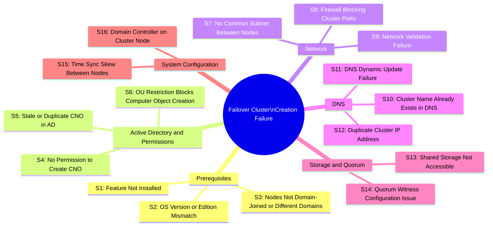
```mermaid
mindmap
  root((Failover Cluster\nCreation Failure))
    Prerequisites
      S1: Feature Not Installed
      S2: OS Version or Edition Mismatch
      S3: Nodes Not Domain-Joined or Different Domains
    Active Directory and Permissions
      S4: No Permission to Create CNO
      S5: Stale or Duplicate CNO in AD
      S6: OU Restriction Blocks Computer Object Creation
    Network
      S7: No Common Subnet Between Nodes
      S8: Firewall Blocking Cluster Ports
      S9: Network Validation Failure
    DNS
      S10: Cluster Name Already Exists in DNS
      S11: DNS Dynamic Update Failure
      S12: Duplicate Cluster IP Address
    Storage and Quorum
      S13: Shared Storage Not Accessible
      S14: Quorum Witness Configuration Issue
    System Configuration
      S15: Time Sync Skew Between Nodes
      S16: Domain Controller on Cluster Node
```

> 这张图帮你快速定位：你的集群创建失败属于哪个类别的问题。

---

## 2. 场景识别指南 (How to Identify Your Scenario)

| 你看到的症状 / Error Message | 可能的场景 | 跳转 |
|------------------------------|-----------|------|
| `Install-WindowsFeature` 报错或 Failover Cluster Manager 不可用 | Feature 未安装 | → [S1](#场景-s1-failover-clustering-feature-未安装) |
| "The cluster could not be created. The nodes are running different versions" | OS 版本不匹配 | → [S2](#场景-s2-os-版本或-edition-不匹配) |
| "The node is not joined to a domain" 或 cluster validation system config 失败 | 节点未加域/不同域 | → [S3](#场景-s3-节点未加域或跨域) |
| "An error occurred creating the cluster name... access denied" 或 0x80070005 | AD 权限不足 | → [S4](#场景-s4-ad-权限不足无法创建-cno) |
| "The cluster name resource failed to come online... object already exists" | CNO 已存在/残留 | → [S5](#场景-s5-ad-中存在残留或重复的-cno) |
| "Unable to create the computer account... object creation blocked" | OU 策略阻止 | → [S6](#场景-s6-ou-策略阻止创建计算机对象) |
| Cluster validation → "Network" test warnings/failures | 网络无共同子网 | → [S7](#场景-s7-节点之间无共同子网) |
| Cluster creation hangs 或 "RPC server is unavailable" | 防火墙阻断 | → [S8](#场景-s8-防火墙阻断集群通信端口) |
| Cluster validation → Network test fails with adapter/connectivity errors | 网络验证失败 | → [S9](#场景-s9-cluster-validation-网络测试失败) |
| "The cluster name is already in use" | DNS 名称冲突 | → [S10](#场景-s10-集群名称在-dns-中已存在) |
| Cluster created but name resource fails to come online | DNS 动态更新失败 | → [S11](#场景-s11-dns-动态更新失败) |
| "The address is already in use" 或 IP resource 无法 online | IP 地址冲突 | → [S12](#场景-s12-集群-ip-地址冲突) |
| Cluster validation → Storage tests fail | 存储不可访问 | → [S13](#场景-s13-共享存储不可访问) |
| Cluster 创建成功但 quorum 报警或很快 lose quorum | Quorum 配置问题 | → [S14](#场景-s14-quorum-witness-配置问题) |
| "The cluster could not be created because the clocks differ..." 或 Kerberos 错误 | 时间不同步 | → [S15](#场景-s15-节点之间时间不同步) |
| 各种奇怪的 AD/DNS/Cluster 行为异常 | DC 运行在集群节点上 | → [S16](#场景-s16-domain-controller-运行在集群节点上) |

---

## 3. 各场景排查详情 (Scenario Details)

---

### 场景 S1: Failover Clustering Feature 未安装

**典型症状：** 找不到 Failover Cluster Manager，`New-Cluster` cmdlet 不存在，或报错 "The term 'New-Cluster' is not recognized"

**排查逻辑：**
> Failover Clustering 是 Windows Server 的可选功能，默认不安装。必须在**所有**要加入集群的节点上安装此功能。检查功能是否安装并包含管理工具。

**排查流程图：**

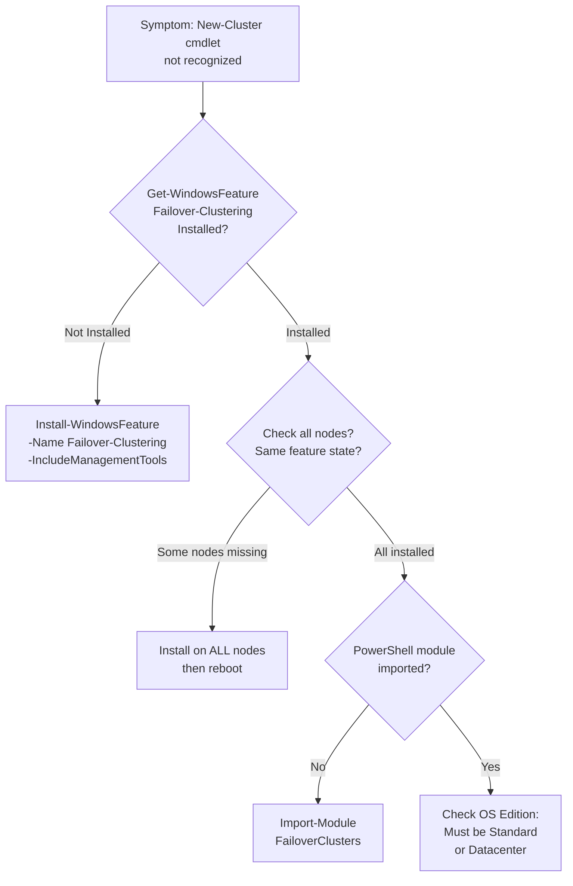
```mermaid
flowchart TD
    Start["Symptom: New-Cluster cmdlet\nnot recognized"] --> Check1{"Get-WindowsFeature\nFailover-Clustering\nInstalled?"}
    Check1 -->|"Not Installed"| Fix1["Install-WindowsFeature\n-Name Failover-Clustering\n-IncludeManagementTools"]
    Check1 -->|"Installed"| Check2{"Check all nodes?\nSame feature state?"}
    Check2 -->|"Some nodes missing"| Fix2["Install on ALL nodes\nthen reboot"]
    Check2 -->|"All installed"| Check3{"PowerShell module\nimported?"}
    Check3 -->|"No"| Fix3["Import-Module\nFailoverClusters"]
    Check3 -->|"Yes"| Escalate["Check OS Edition:\nMust be Standard\nor Datacenter"]
```

**关键诊断命令：**

| 检查什么 | 命令 | 看什么 |
|---------|------|--------|
| Feature 安装状态 | `Get-WindowsFeature Failover-Clustering` | Install State = Installed |
| 管理工具 | `Get-WindowsFeature RSAT-Clustering*` | 管理工具是否安装 |
| OS Edition | `Get-ComputerInfo \| Select OsName` | 不能是 Windows Server Essentials |
| 远程检查所有节点 | `Invoke-Command -ComputerName Node1,Node2 {Get-WindowsFeature Failover-Clustering}` | 所有节点结果一致 |

**💡 Tips：**
- **Tip 1：** 安装 Feature 后**必须重启**服务器才能正常使用
- **Tip 2：** 管理节点上只需安装 `RSAT-Clustering-Mgmt` 和 `RSAT-Clustering-PowerShell`，不需要装完整 Feature
- **⚠️ 常见误区：** Windows Server Essentials Edition 不支持 Failover Clustering

**解决方案摘要：**

| 根因 | 修复方法 | 验证方式 |
|------|---------|---------|
| Feature 未安装 | `Install-WindowsFeature -Name Failover-Clustering -IncludeManagementTools` | `Get-WindowsFeature Failover-Clustering` 显示 Installed |
| OS Edition 不支持 | 升级到 Standard 或 Datacenter Edition | `Get-ComputerInfo` 确认版本 |

---

### 场景 S2: OS 版本或 Edition 不匹配

**典型症状：** Cluster validation 报告 "mixed operating system versions" 警告；创建集群时报错

**排查逻辑：**
> 所有集群节点必须运行**相同的 Windows Server 版本**（大版本号一致）。虽然 Cluster OS Rolling Upgrade 允许临时混合版本，但**新建集群时所有节点版本必须相同**。

**排查流程图：**

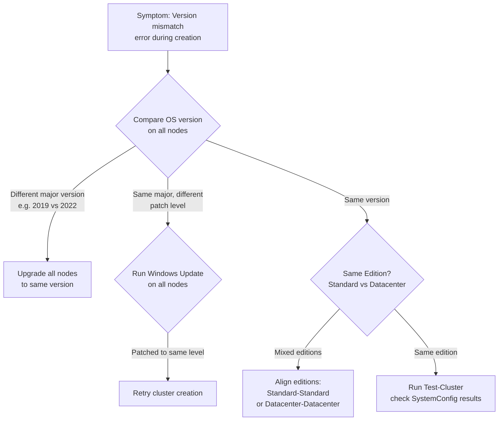
```mermaid
flowchart TD
    Start["Symptom: Version mismatch\nerror during creation"] --> Check1{"Compare OS version\non all nodes"}
    Check1 -->|"Different major version\ne.g. 2019 vs 2022"| Fix1["Upgrade all nodes\nto same version"]
    Check1 -->|"Same major, different\npatch level"| Check2{"Run Windows Update\non all nodes"}
    Check2 -->|"Patched to same level"| Retry["Retry cluster creation"]
    Check1 -->|"Same version"| Check3{"Same Edition?\nStandard vs Datacenter"}
    Check3 -->|"Mixed editions"| Fix3["Align editions:\nStandard-Standard\nor Datacenter-Datacenter"]
    Check3 -->|"Same edition"| Escalate["Run Test-Cluster\ncheck SystemConfig results"]
```

**关键诊断命令：**

| 检查什么 | 命令 | 看什么 |
|---------|------|--------|
| OS 版本 | `[System.Environment]::OSVersion.Version` | 所有节点一致 |
| 详细版本 | `Get-ItemProperty 'HKLM:\SOFTWARE\Microsoft\Windows NT\CurrentVersion' \| Select ProductName,CurrentBuildNumber` | Build 号相同 |
| 远程批量检查 | `Invoke-Command -ComputerName Node1,Node2 {Get-ComputerInfo \| Select OsName,OsVersion}` | 所有节点输出一致 |

**💡 Tips：**
- **Tip 1：** Standard 和 Datacenter Edition 可以组成集群（微软支持），但**强烈建议保持一致**以避免功能差异
- **Tip 2：** KB patch level 不需要完全一致，但建议保持接近（特别是 Cluster Service 相关补丁）
- **⚠️ 常见误区：** Azure Stack HCI 节点不能与普通 Windows Server 节点组建集群

**解决方案摘要：**

| 根因 | 修复方法 | 验证方式 |
|------|---------|---------|
| 主版本不同 | 统一升级到相同版本 | 所有节点 `winver` 一致 |
| Patch level 差异大 | 对所有节点做 Windows Update | `Get-HotFix` 比较 |

---

### 场景 S3: 节点未加域或跨域

**典型症状：** "The node is not joined to an Active Directory domain" 或验证失败

**排查逻辑：**
> 传统 Failover Cluster 要求所有节点加入**同一个 AD 域**。Workgroup Cluster 从 Server 2019 开始支持但功能受限。检查域加入状态和域信任关系。

**排查流程图：**

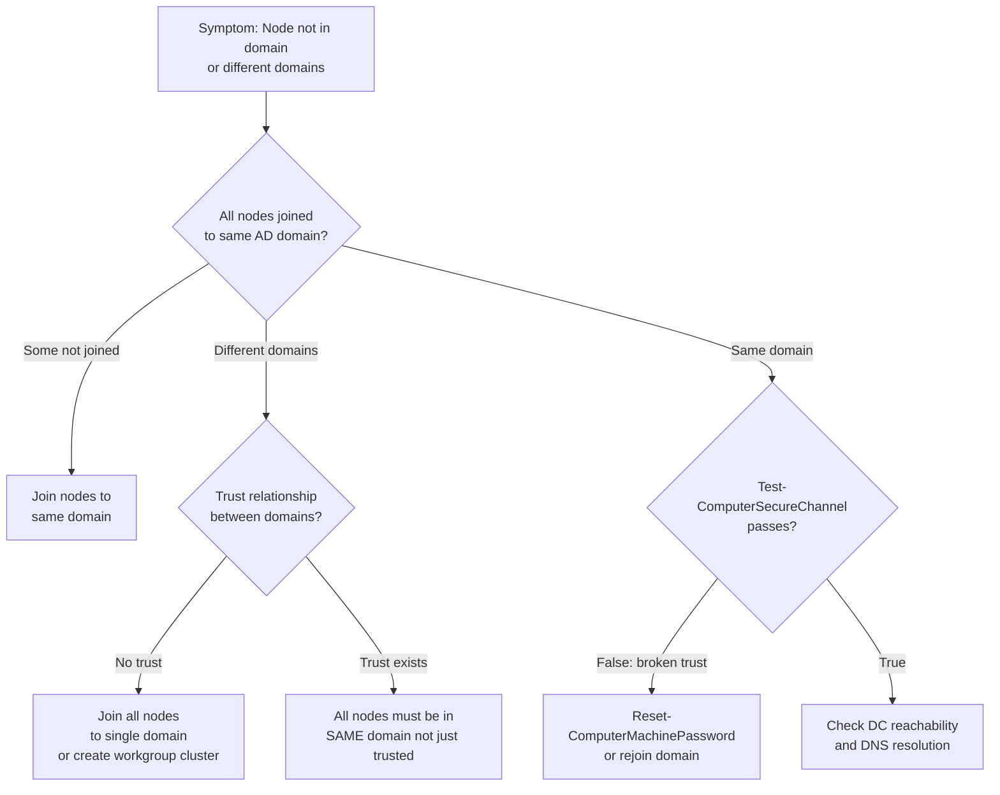
```mermaid
flowchart TD
    Start["Symptom: Node not in domain\nor different domains"] --> Check1{"All nodes joined\nto same AD domain?"}
    Check1 -->|"Some not joined"| Fix1["Join nodes to\nsame domain"]
    Check1 -->|"Different domains"| Check2{"Trust relationship\nbetween domains?"}
    Check2 -->|"No trust"| Fix2["Join all nodes\nto single domain\nor create workgroup cluster"]
    Check2 -->|"Trust exists"| Fix3["All nodes must be in\nSAME domain not just trusted"]
    Check1 -->|"Same domain"| Check3{"Test-ComputerSecureChannel\npasses?"}
    Check3 -->|"False: broken trust"| Fix4["Reset-ComputerMachinePassword\nor rejoin domain"]
    Check3 -->|"True"| Escalate["Check DC reachability\nand DNS resolution"]
```

**关键诊断命令：**

| 检查什么 | 命令 | 看什么 |
|---------|------|--------|
| 域加入状态 | `(Get-WmiObject Win32_ComputerSystem).Domain` | 所有节点返回相同的域 FQDN |
| Secure Channel | `Test-ComputerSecureChannel -Verbose` | 返回 True |
| DC 连接 | `nltest /dsgetdc:contoso.corp` | 能定位到 DC |
| DNS 后缀 | `ipconfig /all \| findstr "DNS Suffix"` | Primary DNS Suffix 正确 |

**💡 Tips：**
- **Tip 1：** Server 2019+ 支持 **Workgroup Cluster**（无需 AD），但不支持 Hyper-V Live Migration 等功能
- **Tip 2：** 如果 Secure Channel 断裂，通常是因为长时间离线或从快照恢复了 VM
- **⚠️ 常见误区：** 仅有域信任关系不够——所有节点必须在**同一个域**

**解决方案摘要：**

| 根因 | 修复方法 | 验证方式 |
|------|---------|---------|
| 未加域 | 加入同一个域后重启 | `systeminfo \| findstr Domain` |
| Secure Channel 断裂 | `Reset-ComputerMachinePassword` 或退域重加 | `Test-ComputerSecureChannel` = True |
| 不同域 | 迁移到同一域或使用 Workgroup Cluster | 所有节点 `(Get-WmiObject Win32_ComputerSystem).Domain` 一致 |

---

### 场景 S4: AD 权限不足无法创建 CNO

**典型症状：** "An error occurred creating the cluster name... access denied"；错误代码 0x80070005

**排查逻辑：**
> 创建集群时，Cluster Service 需要在 AD 中创建 **CNO (Cluster Name Object)** — 一个计算机对象。执行创建的用户账户必须对目标 OU 有 **Create Computer Objects** 权限。如果没有权限，需要 Domain Admin 提前预创建（prestage）CNO。

**排查流程图：**

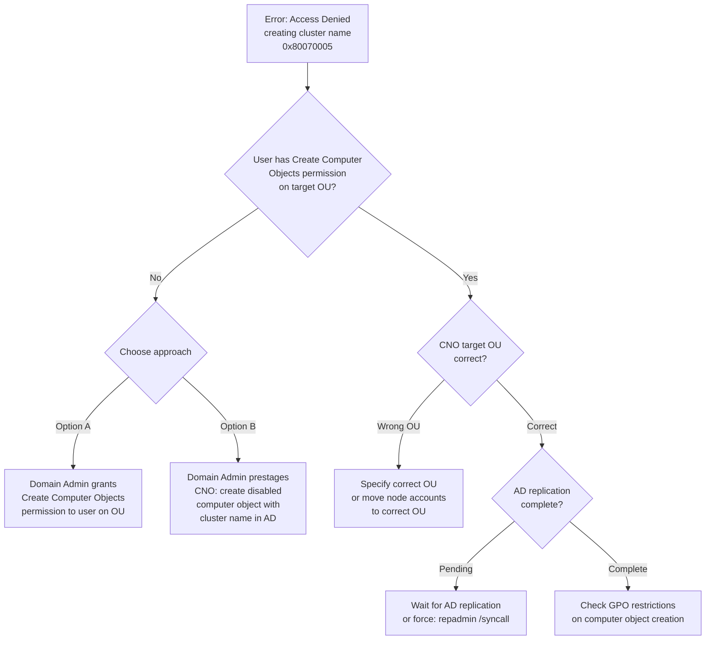
```mermaid
flowchart TD
    Start["Error: Access Denied\ncreating cluster name\n0x80070005"] --> Check1{"User has Create Computer\nObjects permission\non target OU?"}
    Check1 -->|"No"| Option1{"Choose approach"}
    Option1 -->|"Option A"| Fix1["Domain Admin grants\nCreate Computer Objects\npermission to user on OU"]
    Option1 -->|"Option B"| Fix2["Domain Admin prestages\nCNO: create disabled\ncomputer object with\ncluster name in AD"]
    Check1 -->|"Yes"| Check2{"CNO target OU\ncorrect?"}
    Check2 -->|"Wrong OU"| Fix3["Specify correct OU\nor move node accounts\nto correct OU"]
    Check2 -->|"Correct"| Check3{"AD replication\ncomplete?"}
    Check3 -->|"Pending"| Fix4["Wait for AD replication\nor force: repadmin /syncall"]
    Check3 -->|"Complete"| Escalate["Check GPO restrictions\non computer object creation"]
```

**关键诊断命令：**

| 检查什么 | 命令 | 看什么 |
|---------|------|--------|
| 节点所在 OU | `Get-ADComputer NodeName \| Select DistinguishedName` | 确认 OU 路径 |
| OU 权限 | `dsacls "OU=Clusters,DC=contoso,DC=corp"` | 看用户是否有 Create Computer Objects |
| 已有 CNO | `Get-ADComputer ClusterName -ErrorAction SilentlyContinue` | 如果返回结果则 CNO 已存在 |
| AD 复制状态 | `repadmin /replsummary` | 无 failure |

**💡 Tips：**
- **Tip 1：** Prestage 是企业环境的**最佳实践**。Domain Admin 预创建一个**禁用的**计算机对象（名称=集群名），然后给集群创建者 Full Control
- **Tip 2：** 如果 CNO 创建在 default "Computers" container 中，集群可以自动创建最多 10 个 VCO。超过 10 个需要显式授权
- **Tip 3：** 检查是否有 GPO 限制了计算机对象的创建（如 `ms-DS-MachineAccountQuota` 设置为 0）
- **⚠️ 常见误区：** 用户是 Domain Admin 但如果 OU 有 Deny ACE，仍然会被拒绝

**解决方案摘要：**

| 根因 | 修复方法 | 验证方式 |
|------|---------|---------|
| 无 Create Computer Objects 权限 | Domain Admin 授权或 prestage CNO | 检查 OU ACL 或确认 prestaged CNO 存在 |
| GPO 限制 | 调整 GPO 或在独立 OU 中创建 | `gpresult /r` 检查生效策略 |
| AD 复制延迟 | `repadmin /syncall /AdeP` 强制复制 | `repadmin /replsummary` 无错误 |

---

### 场景 S5: AD 中存在残留或重复的 CNO

**典型症状：** "The cluster name resource failed to come online because the name is already in use" 或 "A computer account with this name already exists in Active Directory"

**排查逻辑：**
> 如果之前的集群被不干净地删除，CNO 可能残留在 AD 中。或者已有一个同名的计算机对象。需要清理旧对象或使用不同的集群名称。

**排查流程图：**

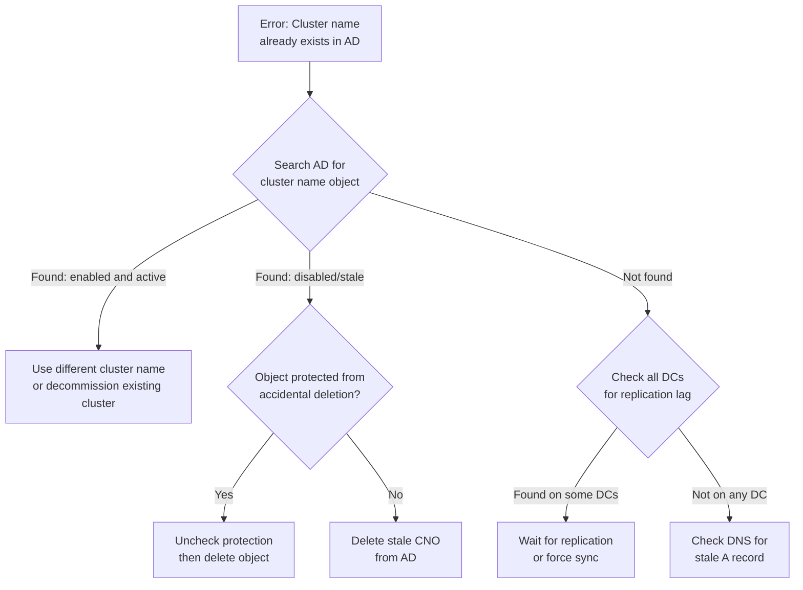
```mermaid
flowchart TD
    Start["Error: Cluster name\nalready exists in AD"] --> Check1{"Search AD for\ncluster name object"}
    Check1 -->|"Found: enabled and active"| Fix1["Use different cluster name\nor decommission existing cluster"]
    Check1 -->|"Found: disabled/stale"| Check2{"Object protected from\naccidental deletion?"}
    Check2 -->|"Yes"| Fix2A["Uncheck protection\nthen delete object"]
    Check2 -->|"No"| Fix2B["Delete stale CNO\nfrom AD"]
    Check1 -->|"Not found"| Check3{"Check all DCs\nfor replication lag"}
    Check3 -->|"Found on some DCs"| Fix3["Wait for replication\nor force sync"]
    Check3 -->|"Not on any DC"| Escalate["Check DNS for\nstale A record"]
```

**关键诊断命令：**

| 检查什么 | 命令 | 看什么 |
|---------|------|--------|
| 查找 CNO | `Get-ADComputer "ClusterName" -Properties * \| Select Name,Enabled,WhenCreated,DistinguishedName` | 是否存在、是否启用 |
| 检查删除保护 | AD Users and Computers → View → Advanced Features → 右键属性 → Object tab | "Protect from accidental deletion" |
| 检查所有 DC | `Get-ADDomainController -Filter * \| ForEach { Get-ADComputer "ClusterName" -Server $_.HostName -ErrorAction SilentlyContinue }` | 跨 DC 一致性 |

**💡 Tips：**
- **Tip 1：** 删除集群请务必使用 `Remove-Cluster` 或 Failover Cluster Manager 的 "Destroy Cluster" 功能，而不是手动拆
- **Tip 2：** 删除 CNO 前确认它确实不再被使用（检查 `WhenChanged` 时间戳）
- **⚠️ 常见误区：** 删除了 CNO 但忘记清理 DNS 中对应的 A 记录 → 会导致 [S10](#场景-s10-集群名称在-dns-中已存在)

**解决方案摘要：**

| 根因 | 修复方法 | 验证方式 |
|------|---------|---------|
| 残留 CNO | 从 AD 中删除旧 CNO 对象 | `Get-ADComputer "ClusterName"` 返回空 |
| 同名计算机存在 | 改用其他集群名称或重命名已有对象 | 集群创建成功 |

---

### 场景 S6: OU 策略阻止创建计算机对象

**典型症状：** 有权限但仍报 "access denied"；GPO 或 OU 安全描述符阻止操作

**排查逻辑：**
> 即使用户有 Create Computer Objects 权限，某些 GPO 或 OU 级的 Security Descriptor 可能有显式 Deny ACE，或 `ms-DS-MachineAccountQuota` 被设为 0 阻止用户创建计算机对象。

**排查流程图：**

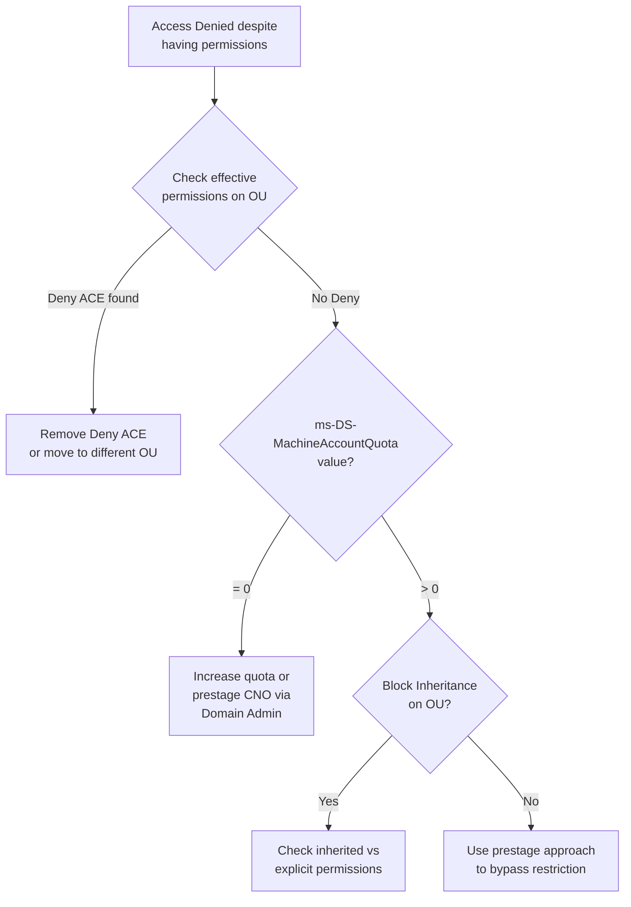
```mermaid
flowchart TD
    Start["Access Denied despite\nhaving permissions"] --> Check1{"Check effective\npermissions on OU"}
    Check1 -->|"Deny ACE found"| Fix1["Remove Deny ACE\nor move to different OU"]
    Check1 -->|"No Deny"| Check2{"ms-DS-MachineAccountQuota\nvalue?"}
    Check2 -->|"= 0"| Fix2["Increase quota or\nprestage CNO via\nDomain Admin"]
    Check2 -->|"> 0"| Check3{"Block Inheritance\non OU?"}
    Check3 -->|"Yes"| Fix3["Check inherited vs\nexplicit permissions"]
    Check3 -->|"No"| Escalate["Use prestage approach\nto bypass restriction"]
```

**关键诊断命令：**

| 检查什么 | 命令 | 看什么 |
|---------|------|--------|
| Machine Account Quota | `Get-ADObject (Get-ADDomain).DistinguishedName -Properties ms-DS-MachineAccountQuota` | 默认 10；如果是 0 则受限 |
| OU Effective Permissions | `dsacls "OU=Servers,DC=contoso,DC=corp"` | 查 Deny entries |
| GPO 生效情况 | `gpresult /r /scope:computer` | 看生效的 GPO |

**💡 Tips：**
- **Tip 1：** 安全团队经常将 `ms-DS-MachineAccountQuota` 设为 0 以防止普通用户随意将设备加入域——这也会影响集群创建
- **⚠️ 常见误区：** 只检查了"允许"权限却忽略了"拒绝"条目——Deny 永远优先于 Allow

**解决方案摘要：**

| 根因 | 修复方法 | 验证方式 |
|------|---------|---------|
| MachineAccountQuota = 0 | Domain Admin prestage CNO | prestaged CNO 存在且用户有 Full Control |
| OU 有 Deny ACE | 移除 Deny 或用 prestage 方式 | `dsacls` 确认无 Deny |

---

### 场景 S7: 节点之间无共同子网

**典型症状：** Cluster Validation → Network 测试报 "nodes do not share a common subnet" 或 "no network path found"

**排查逻辑：**
> Failover Cluster 要求节点之间至少有一个**共同的网络子网**用于集群通信。检查 IP 配置和子网掩码是否允许节点互相发现。

**排查流程图：**

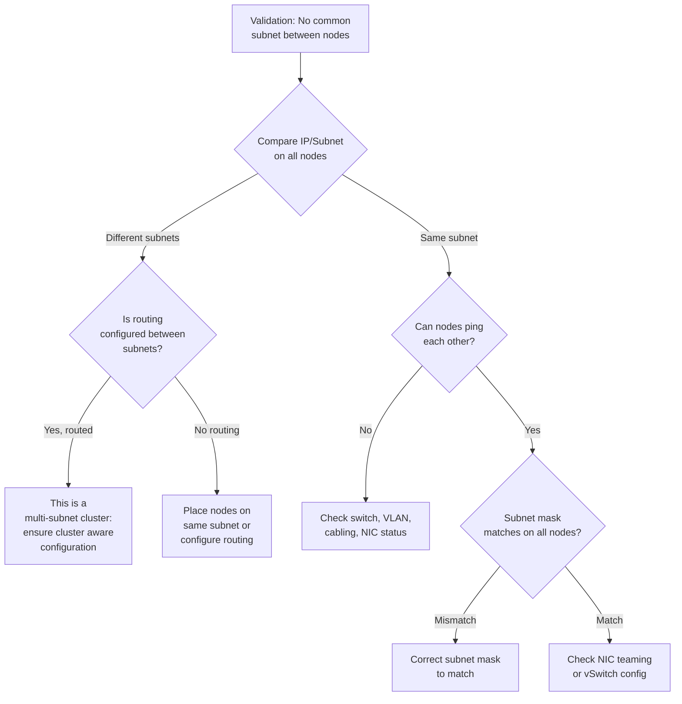
```mermaid
flowchart TD
    Start["Validation: No common\nsubnet between nodes"] --> Check1{"Compare IP/Subnet\non all nodes"}
    Check1 -->|"Different subnets"| Check2{"Is routing\nconfigured between\nsubnets?"}
    Check2 -->|"Yes, routed"| Fix1["This is a\nmulti-subnet cluster:\nensure cluster aware\nconfiguration"]
    Check2 -->|"No routing"| Fix2["Place nodes on\nsame subnet or\nconfigure routing"]
    Check1 -->|"Same subnet"| Check3{"Can nodes ping\neach other?"}
    Check3 -->|"No"| Fix3["Check switch, VLAN,\ncabling, NIC status"]
    Check3 -->|"Yes"| Check4{"Subnet mask\nmatches on all nodes?"}
    Check4 -->|"Mismatch"| Fix4["Correct subnet mask\nto match"]
    Check4 -->|"Match"| Escalate["Check NIC teaming\nor vSwitch config"]
```

**关键诊断命令：**

| 检查什么 | 命令 | 看什么 |
|---------|------|--------|
| IP 配置 | `Get-NetIPAddress -AddressFamily IPv4 \| Format-Table InterfaceAlias,IPAddress,PrefixLength` | 子网一致 |
| 互 ping | `Test-Connection -ComputerName Node2 -Count 4` | 全部成功 |
| 路由 | `route print` | 有到对方子网的路由 |
| NIC 状态 | `Get-NetAdapter \| Format-Table Name,Status,LinkSpeed` | Status = Up |

**💡 Tips：**
- **Tip 1：** 多子网集群（Multi-Subnet Cluster）是合法配置，但需要额外配置（如 OR 依赖关系的 IP 资源）
- **Tip 2：** 确保集群心跳网络和客户端访问网络分开配置
- **⚠️ 常见误区：** 两个节点在不同 VLAN 但 IP 看起来"同网段"——实际二层不通

**解决方案摘要：**

| 根因 | 修复方法 | 验证方式 |
|------|---------|---------|
| 不同子网无路由 | 配置路由或调整到同一子网 | `Test-Connection` 成功 |
| 子网掩码不匹配 | 统一子网掩码 | `ipconfig /all` 比较 |
| VLAN 隔离 | 调整 VLAN 配置 | 二层 ping 通 |

---

### 场景 S8: 防火墙阻断集群通信端口

**典型症状：** 创建集群时挂起或超时；"RPC server is unavailable"；节点之间通信失败

**排查逻辑：**
> Failover Cluster 依赖多个端口进行通信（RPC、SMB、Cluster Communication）。Windows Firewall 通常在安装 Feature 时自动配置规则，但第三方防火墙或 GPO 可能阻断这些端口。

**排查流程图：**

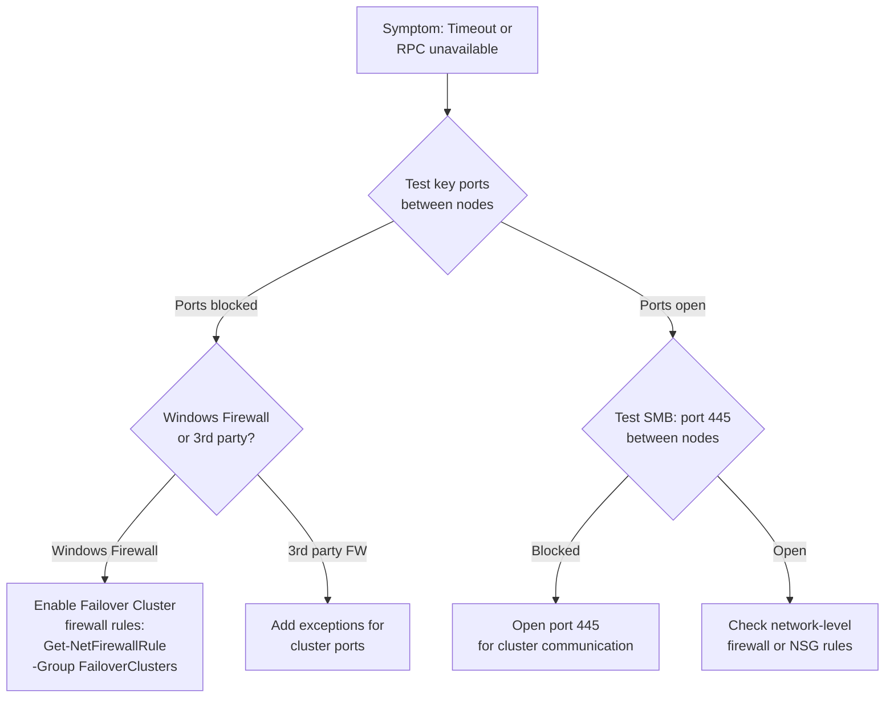
```mermaid
flowchart TD
    Start["Symptom: Timeout or\nRPC unavailable"] --> Check1{"Test key ports\nbetween nodes"}
    Check1 -->|"Ports blocked"| Check2{"Windows Firewall\nor 3rd party?"}
    Check2 -->|"Windows Firewall"| Fix1["Enable Failover Cluster\nfirewall rules:\nGet-NetFirewallRule\n-Group FailoverClusters"]
    Check2 -->|"3rd party FW"| Fix2["Add exceptions for\ncluster ports"]
    Check1 -->|"Ports open"| Check3{"Test SMB: port 445\nbetween nodes"}
    Check3 -->|"Blocked"| Fix3["Open port 445\nfor cluster communication"]
    Check3 -->|"Open"| Escalate["Check network-level\nfirewall or NSG rules"]
```

**关键诊断命令：**

| 检查什么 | 命令 | 看什么 |
|---------|------|--------|
| 关键端口连通性 | `Test-NetConnection Node2 -Port 445` | TcpTestSucceeded = True |
| RPC 端口 | `Test-NetConnection Node2 -Port 135` | TcpTestSucceeded = True |
| Cluster 端口 | `Test-NetConnection Node2 -Port 3343` | TcpTestSucceeded = True（UDP 也需要） |
| Firewall 规则 | `Get-NetFirewallRule -Group "@FirewallAPI.dll,-36001" \| Select DisplayName,Enabled` | Failover Cluster 规则已启用 |
| 防火墙 Profile | `Get-NetFirewallProfile \| Select Name,Enabled` | 确认哪些 profile 活跃 |

**Failover Cluster 必需端口清单：**

| 端口 | 协议 | 用途 |
|------|------|------|
| 135 | TCP | RPC Endpoint Mapper |
| 445 | TCP | SMB（管理共享、CSV 重定向 I/O） |
| 3343 | UDP | Cluster Network Driver（节点间心跳通信） |
| 3343 | TCP | Cluster creation 初始化通信（创建集群时节点间协商使用） |
| 5985 | TCP | WinRM / PowerShell Remoting |
| 49152-65535 | TCP | RPC Dynamic Ports |
| ICMP | - | Cluster network detection |

**💡 Tips：**
- **Tip 1：** 安装 Failover Clustering Feature 时会自动创建 Windows Firewall 规则，但 GPO 可能会覆盖
- **Tip 2：** **Port 3343 UDP** 是集群心跳端口，**TCP 3343** 在集群创建过程中用于节点间初始化通信——两者都必须在所有节点之间双向放行
- **⚠️ 常见误区：** 只测试了 TCP 端口忘记了 UDP 3343；或者只开放了 UDP 3343 忘了 TCP 3343（创建集群时会失败）；或者只测试了单向忘记了双向

**解决方案摘要：**

| 根因 | 修复方法 | 验证方式 |
|------|---------|---------|
| Windows Firewall 规则未启用 | `Enable-NetFirewallRule -Group "@FirewallAPI.dll,-36001"` | 所有 Cluster 规则 Enabled=True |
| 第三方防火墙阻断 | 添加上述端口例外 | `Test-NetConnection` 全部通过 |
| GPO 覆盖防火墙规则 | 调整 GPO 或添加例外策略 | `gpresult /r` + 规则检查 |

---

### 场景 S9: Cluster Validation 网络测试失败

**典型症状：** `Test-Cluster` 的 Network 类别报告 Warning 或 Failure

**排查逻辑：**
> Validation 网络测试检查节点之间的连通性、NIC 配置、网络延迟等。常见失败原因包括 NIC Teaming 配置不一致、vSwitch 问题、或 NIC 驱动不兼容。

**排查流程图：**

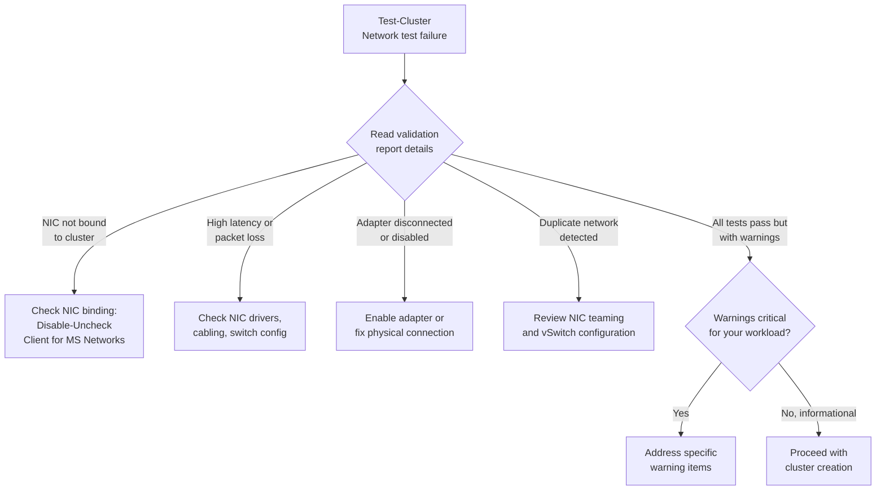
```mermaid
flowchart TD
    Start["Test-Cluster\nNetwork test failure"] --> Check1{"Read validation\nreport details"}
    Check1 -->|"NIC not bound\nto cluster"| Fix1["Check NIC binding:\nDisable-Uncheck\nClient for MS Networks"]
    Check1 -->|"High latency or\npacket loss"| Fix2["Check NIC drivers,\ncabling, switch config"]
    Check1 -->|"Adapter disconnected\nor disabled"| Fix3["Enable adapter or\nfix physical connection"]
    Check1 -->|"Duplicate network\ndetected"| Fix4["Review NIC teaming\nand vSwitch configuration"]
    Check1 -->|"All tests pass but\nwith warnings"| Check2{"Warnings critical\nfor your workload?"}
    Check2 -->|"Yes"| Fix5["Address specific\nwarning items"]
    Check2 -->|"No, informational"| Proceed["Proceed with\ncluster creation"]
```

**关键诊断命令：**

| 检查什么 | 命令 | 看什么 |
|---------|------|--------|
| 运行验证 | `Test-Cluster -Node Node1,Node2 -Include "Network"` | 查看报告中的 Failure/Warning |
| 验证报告位置 | 默认 `C:\Users\<user>\AppData\Local\Temp\` | .htm 报告文件 |
| NIC Binding | `Get-NetAdapterBinding -InterfaceAlias "Ethernet" \| Format-Table ComponentID,Enabled` | `ms_server` 和 `ms_msclient` 已启用 |
| NIC Team | `Get-NetLbfoTeam` | 所有节点 teaming 一致 |

**💡 Tips：**
- **Tip 1：** Validation Warning ≠ 必须修复。微软官方说法是："Warning 不阻止集群创建，但可能影响支持性"
- **Tip 2：** Storage Spaces Direct 集群对网络验证要求更严格（需要 RDMA 验证通过）
- **⚠️ 常见误区：** 在有 Hyper-V vSwitch 的环境中，验证可能把管理 OS vNIC 和物理 NIC 混淆

**解决方案摘要：**

| 根因 | 修复方法 | 验证方式 |
|------|---------|---------|
| NIC 驱动过旧 | 更新到最新驱动 | 重新跑 `Test-Cluster` |
| NIC Teaming 不一致 | 统一 Teaming 模式和配置 | `Get-NetLbfoTeam` 所有节点一致 |
| vSwitch 配置差异 | 统一 vSwitch 配置 | `Get-VMSwitch` 所有节点一致 |

---

### 场景 S10: 集群名称在 DNS 中已存在

**典型症状：** "The cluster name is already in use on the network"

**排查逻辑：**
> 即使 AD 中没有同名 CNO，DNS 中可能有残留的 A 记录。集群创建时会检查 DNS 确认名称唯一性。

**排查流程图：**

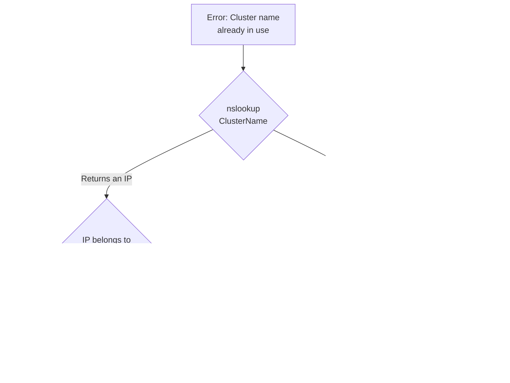
```mermaid
flowchart TD
    Start["Error: Cluster name\nalready in use"] --> Check1{"nslookup\nClusterName"}
    Check1 -->|"Returns an IP"| Check2{"IP belongs to\nan active host?"}
    Check2 -->|"Yes, active"| Fix1["Use different\ncluster name"]
    Check2 -->|"No, stale record"| Fix2["Delete stale DNS record\nfrom DNS Manager"]
    Check1 -->|"Name not found"| Check3{"Check AD for\nexisting CNO"}
    Check3 -->|"CNO exists"| Fix3["See Scenario S5:\nclean up stale CNO"]
    Check3 -->|"No CNO"| Escalate["Check WINS or\nNetBIOS name conflict"]
```

**关键诊断命令：**

| 检查什么 | 命令 | 看什么 |
|---------|------|--------|
| DNS 解析 | `Resolve-DnsName ClusterName` | 不应返回结果（如果是新集群） |
| DNS 区域检查 | `Get-DnsServerResourceRecord -ZoneName "contoso.corp" -Name "ClusterName"` | 在 DNS 服务器上执行 |
| NetBIOS 检查 | `nbtstat -a ClusterName` | 确认 NetBIOS 无冲突 |

**💡 Tips：**
- **Tip 1：** 删除 DNS 记录后可能需要等待 DNS 缓存过期，或在节点上 `ipconfig /flushdns`
- **⚠️ 常见误区：** 只清理了 AD 中的 CNO 但忘了清理 DNS 记录

**解决方案摘要：**

| 根因 | 修复方法 | 验证方式 |
|------|---------|---------|
| 残留 DNS A 记录 | 从 DNS Manager 删除记录 | `Resolve-DnsName` 返回空 |
| NetBIOS 名称冲突 | 使用不同集群名或清理 WINS | `nbtstat -a` 无冲突 |

---

### 场景 S11: DNS 动态更新失败

**典型症状：** 集群创建成功但 Cluster Name resource 无法 online；Event Log 报 DNS registration failed

**排查逻辑：**
> 集群创建后需要在 DNS 中注册 A 记录。如果 DNS 区域不允许动态更新，或 CNO 的计算机账户没有权限更新 DNS，注册会失败。

**排查流程图：**

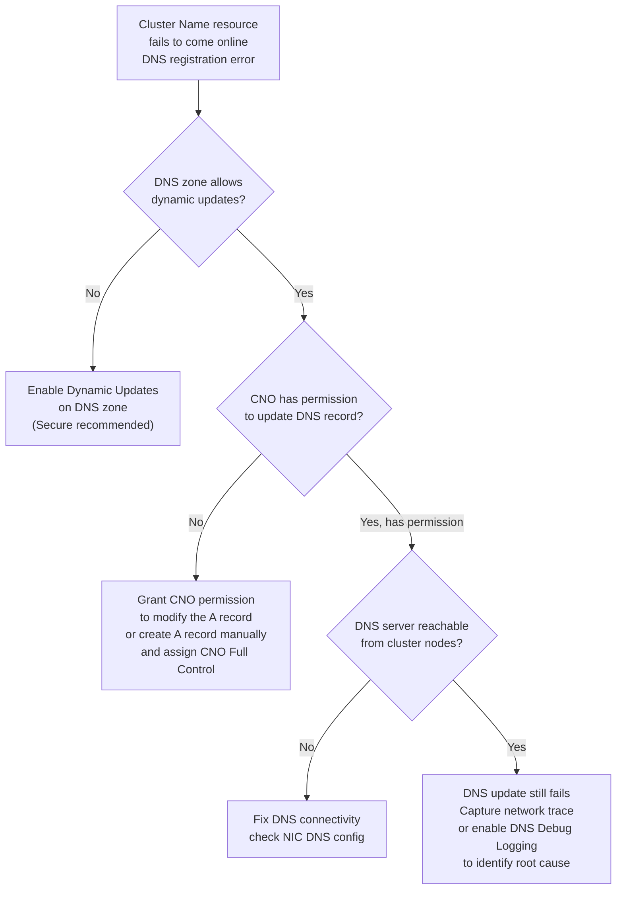
```mermaid
flowchart TD
    Start["Cluster Name resource\nfails to come online\nDNS registration error"] --> Check1{"DNS zone allows\ndynamic updates?"}
    Check1 -->|"No"| Fix1["Enable Dynamic Updates\non DNS zone\n(Secure recommended)"]
    Check1 -->|"Yes"| Check2{"CNO has permission\nto update DNS record?"}
    Check2 -->|"No"| Fix2["Grant CNO permission\nto modify the A record\nor create A record manually\nand assign CNO Full Control"]
    Check2 -->|"Yes, has permission"| Check3{"DNS server reachable\nfrom cluster nodes?"}
    Check3 -->|"No"| Fix3["Fix DNS connectivity\ncheck NIC DNS config"]
    Check3 -->|"Yes"| Escalate["DNS update still fails\nCapture network trace\nor enable DNS Debug Logging\nto identify root cause"]
```

**关键诊断命令：**

| 检查什么 | 命令 | 看什么 |
|---------|------|--------|
| DNS Zone 动态更新设置 | `Get-DnsServerZone -Name "contoso.corp" \| Select DynamicUpdate` | "Secure" 或 "NonsecureAndSecure" |
| Cluster Event Log | `Get-WinEvent -LogName "Microsoft-Windows-FailoverClustering/Operational" -MaxEvents 50` | DNS 注册相关错误 |
| 手动注册测试 | `ipconfig /registerdns` | 在节点上执行看是否成功 |

**💡 Tips：**
- **Tip 1：** 对于 Secure Dynamic Updates，实际执行 DNS 注册的是 **CNO 的计算机账户**，不是运行集群创建的用户账户
- **Tip 2：** 如果 DNS 区域所有者是另一个账户，可能需要手动在 DNS 中创建 A 记录并授权 CNO 修改
- **Tip 3：** 如果 CNO 有权限但更新仍然失败，需要抓取**网络包**（如 Wireshark/netsh trace）或启用 **DNS Server Debug Logging** 来查看具体失败原因
- **⚠️ 常见误区：** DNS 手动注册 A 记录后忘了设置权限 → 集群后续 IP 变更时无法更新

**解决方案摘要：**

| 根因 | 修复方法 | 验证方式 |
|------|---------|---------|
| 动态更新未启用 | 在 DNS zone 属性中启用 Dynamic Update（推荐 Secure） | Zone 属性显示 "Secure only" |
| CNO 无 DNS 更新权限 | 手动创建 A 记录并授予 CNO Full Control | Cluster Name resource 上线成功 |
| 有权限但更新仍失败 | 抓网络包或启用 DNS Debug Logging 分析失败原因 | 根据日志定位具体问题 |

---

### 场景 S12: 集群 IP 地址冲突

**典型症状：** "The address is already in use"；集群 IP 资源无法上线

**排查逻辑：**
> 为集群分配的静态 IP 地址可能已被网络中的其他设备使用。需要确认 IP 空闲后再分配。

**排查流程图：**

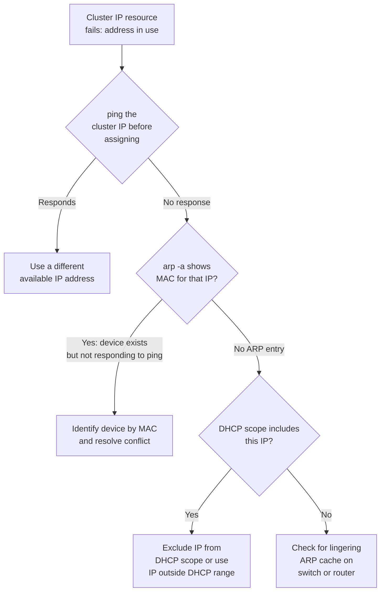
```mermaid
flowchart TD
    Start["Cluster IP resource\nfails: address in use"] --> Check1{"ping the\ncluster IP before\nassigning"}
    Check1 -->|"Responds"| Fix1["Use a different\navailable IP address"]
    Check1 -->|"No response"| Check2{"arp -a shows\nMAC for that IP?"}
    Check2 -->|"Yes: device exists\nbut not responding to ping"| Fix2["Identify device by MAC\nand resolve conflict"]
    Check2 -->|"No ARP entry"| Check3{"DHCP scope includes\nthis IP?"}
    Check3 -->|"Yes"| Fix3["Exclude IP from\nDHCP scope or use\nIP outside DHCP range"]
    Check3 -->|"No"| Escalate["Check for lingering\nARP cache on\nswitch or router"]
```

**关键诊断命令：**

| 检查什么 | 命令 | 看什么 |
|---------|------|--------|
| IP 是否在用 | `Test-Connection -ComputerName 192.0.2.100 -Count 2 -Quiet` | 应返回 False |
| ARP 缓存 | `arp -a \| findstr "192.0.2.100"` | 无条目 |
| DHCP 范围 | 在 DHCP 服务器上检查 scope 和 lease | 不在 DHCP 范围内 |

**💡 Tips：**
- **Tip 1：** 在 DHCP 环境中，集群 IP **必须**使用 DHCP 范围外的静态 IP（或使用 DHCP 保留）
- **⚠️ 常见误区：** 用 `ping` 检查 IP 空闲不完全可靠——有些设备不回复 ping

**解决方案摘要：**

| 根因 | 修复方法 | 验证方式 |
|------|---------|---------|
| IP 被其他设备占用 | 选择空闲 IP | `ping` + `arp -a` 确认空闲 |
| IP 在 DHCP 范围内 | 在 DHCP 中排除或使用范围外 IP | DHCP scope 确认排除 |

---

### 场景 S13: 共享存储不可访问

**典型症状：** Cluster Validation → Storage 测试失败；创建集群时无法添加磁盘

**排查逻辑：**
> 如果使用共享存储（SAN/iSCSI），所有节点必须能看到并访问相同的 LUN。Storage Spaces Direct 则需要本地磁盘满足要求。

**排查流程图：**

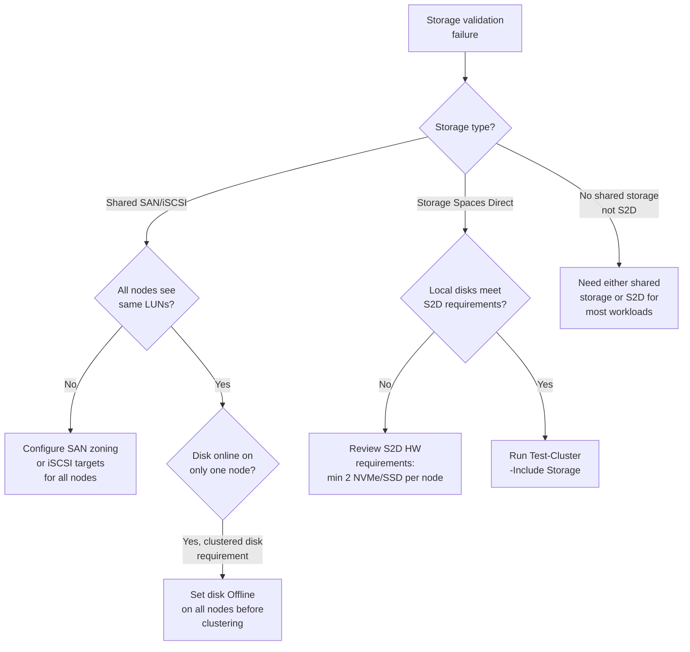
```mermaid
flowchart TD
    Start["Storage validation\nfailure"] --> Check1{"Storage type?"}
    Check1 -->|"Shared SAN/iSCSI"| Check2{"All nodes see\nsame LUNs?"}
    Check2 -->|"No"| Fix1["Configure SAN zoning\nor iSCSI targets\nfor all nodes"]
    Check2 -->|"Yes"| Check3{"Disk online on\nonly one node?"}
    Check3 -->|"Yes, clustered disk\nrequirement"| Fix2["Set disk Offline\non all nodes before\nclustering"]
    Check1 -->|"Storage Spaces Direct"| Check4{"Local disks meet\nS2D requirements?"}
    Check4 -->|"No"| Fix3["Review S2D HW\nrequirements:\nmin 2 NVMe/SSD per node"]
    Check4 -->|"Yes"| Escalate["Run Test-Cluster\n-Include Storage"]
    Check1 -->|"No shared storage\nnot S2D"| Fix4["Need either shared\nstorage or S2D for\nmost workloads"]
```

**关键诊断命令：**

| 检查什么 | 命令 | 看什么 |
|---------|------|--------|
| 磁盘状态 | `Get-Disk \| Format-Table Number,FriendlyName,OperationalStatus,Size` | 所有节点看到相同磁盘 |
| iSCSI 连接 | `Get-IscsiSession` | 所有节点有 session |
| S2D 资格 | `Test-Cluster -Include "Storage Spaces Direct"` | 验证通过 |

**💡 Tips：**
- **Tip 1：** 共享磁盘必须在创建集群**前**设为 Offline。集群创建时会自动接管
- **Tip 2：** S2D 最少需要 2 个节点，每个节点至少 2 块数据盘（不含 OS 盘）
- **⚠️ 常见误区：** File Share Witness 不是"共享存储"——它是 quorum 见证，不用于数据

**解决方案摘要：**

| 根因 | 修复方法 | 验证方式 |
|------|---------|---------|
| SAN LUN 对部分节点不可见 | 修正 SAN zoning / iSCSI target | 所有节点 `Get-Disk` 显示相同 LUN |
| 磁盘 Online 状态冲突 | 在所有节点上 Set-Disk -IsOffline $true | 磁盘显示 Offline |

---

### 场景 S14: Quorum Witness 配置问题

**典型症状：** 集群创建后频繁丢失 quorum；两节点集群在一个节点宕机后整个集群停止

**排查逻辑：**
> 对于偶数节点集群（特别是两节点），**必须**配置 quorum witness（File Share Witness 或 Cloud Witness）以避免脑裂。

**排查流程图：**

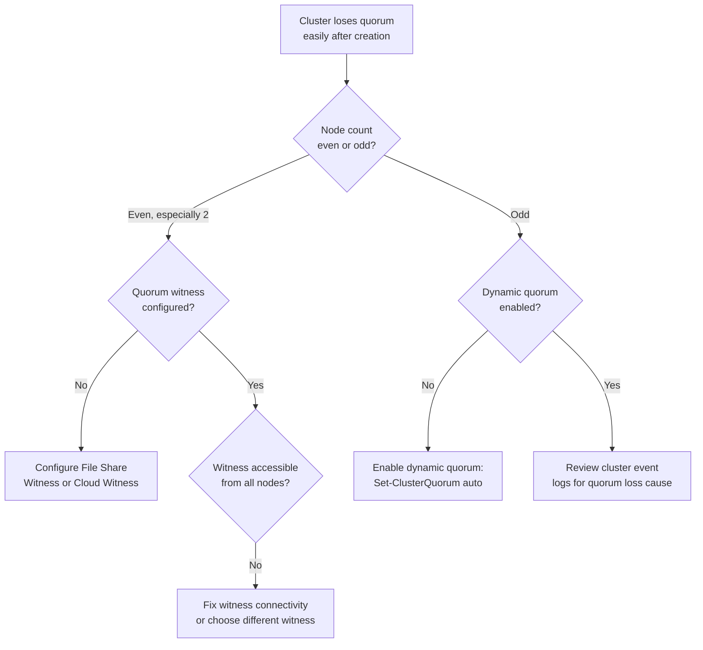
```mermaid
flowchart TD
    Start["Cluster loses quorum\neasily after creation"] --> Check1{"Node count\neven or odd?"}
    Check1 -->|"Even, especially 2"| Check2{"Quorum witness\nconfigured?"}
    Check2 -->|"No"| Fix1["Configure File Share\nWitness or Cloud Witness"]
    Check2 -->|"Yes"| Check3{"Witness accessible\nfrom all nodes?"}
    Check3 -->|"No"| Fix2["Fix witness connectivity\nor choose different witness"]
    Check1 -->|"Odd"| Check4{"Dynamic quorum\nenabled?"}
    Check4 -->|"No"| Fix3["Enable dynamic quorum:\nSet-ClusterQuorum auto"]
    Check4 -->|"Yes"| Escalate["Review cluster event\nlogs for quorum loss cause"]
```

**关键诊断命令：**

| 检查什么 | 命令 | 看什么 |
|---------|------|--------|
| 当前 quorum 配置 | `Get-ClusterQuorum \| Format-List *` | QuorumType 和 Witness 类型 |
| 设置 File Share Witness | `Set-ClusterQuorum -FileShareWitness \\fileserver\witness` | 指向一个 SMB 共享 |
| 设置 Cloud Witness | `Set-ClusterQuorum -CloudWitness -AccountName <storageaccount> -AccessKey <key>` | Azure Storage Account |

**💡 Tips：**
- **Tip 1：** **Cloud Witness** 是推荐的最佳实践（Azure Blob），避免了 File Share Witness 的单点故障
- **Tip 2：** Witness 共享不要放在集群节点本身上！
- **⚠️ 常见误区：** 以为三节点集群不需要 witness——虽然不是必须的，但推荐配置以提高容错

**解决方案摘要：**

| 根因 | 修复方法 | 验证方式 |
|------|---------|---------|
| 无 quorum witness | 配置 File Share 或 Cloud Witness | `Get-ClusterQuorum` 显示 witness |
| Witness 不可达 | 修复连接或更换 witness 路径 | 所有节点可访问 witness |

---

### 场景 S15: 节点之间时间不同步

**典型症状：** Kerberos 认证失败；集群创建报时间偏差错误

**排查逻辑：**
> Kerberos 认证要求节点之间时间差不超过 **5 分钟**（默认）。如果 NTP 配置错误，时间偏移会导致认证失败。

**排查流程图：**

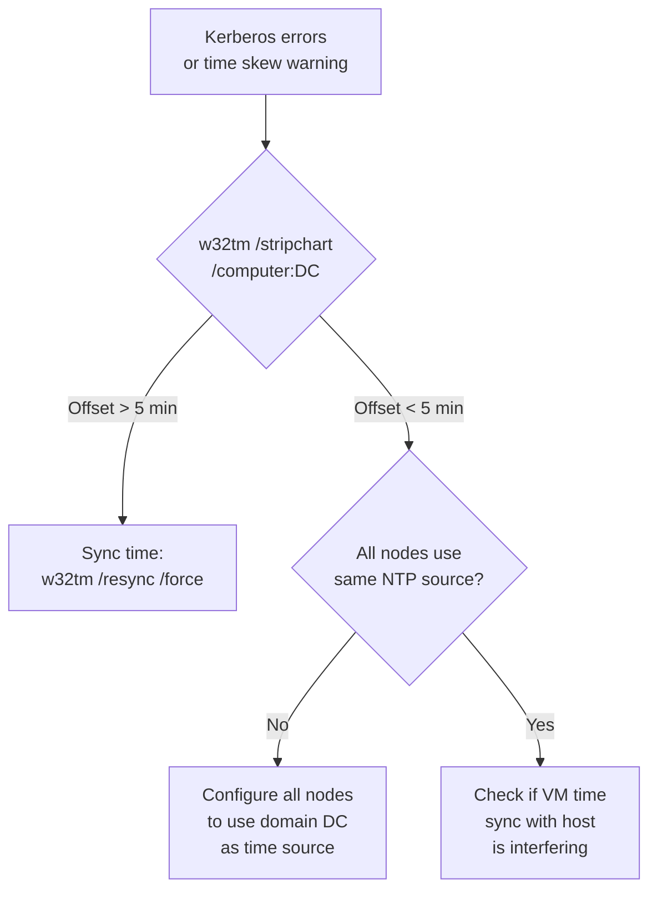
```mermaid
flowchart TD
    Start["Kerberos errors\nor time skew warning"] --> Check1{"w32tm /stripchart\n/computer:DC"}
    Check1 -->|"Offset > 5 min"| Fix1["Sync time:\nw32tm /resync /force"]
    Check1 -->|"Offset < 5 min"| Check2{"All nodes use\nsame NTP source?"}
    Check2 -->|"No"| Fix2["Configure all nodes\nto use domain DC\nas time source"]
    Check2 -->|"Yes"| Escalate["Check if VM time\nsync with host\nis interfering"]
```

**关键诊断命令：**

| 检查什么 | 命令 | 看什么 |
|---------|------|--------|
| 时间偏移 | `w32tm /stripchart /computer:dc01.contoso.corp /samples:3` | Offset 应 < 5 分钟 |
| NTP 源 | `w32tm /query /source` | 应指向域 DC |
| 强制同步 | `w32tm /resync /force` | 同步成功 |

**💡 Tips：**
- **Tip 1：** Hyper-V VM 可能从 Host 同步时间，与 AD NTP 冲突——禁用 VM Integration Services 中的时间同步
- **⚠️ 常见误区：** 手动改了 VM 时间但 Integration Services 又改回去了

**解决方案摘要：**

| 根因 | 修复方法 | 验证方式 |
|------|---------|---------|
| NTP 源错误 | 配置为域 DC | `w32tm /query /source` |
| VM 时间同步冲突 | 禁用 Hyper-V Time Sync IC | VM 设置 → Integration Services |

---

### 场景 S16: Domain Controller 运行在集群节点上

**典型症状：** 各种奇怪的 AD/DNS/集群行为异常

**排查逻辑：**
> 微软明确建议**不要**在集群节点上运行 Domain Controller。DC 和集群服务启动时存在循环依赖，可能导致不可预测的行为。

**排查流程图：**

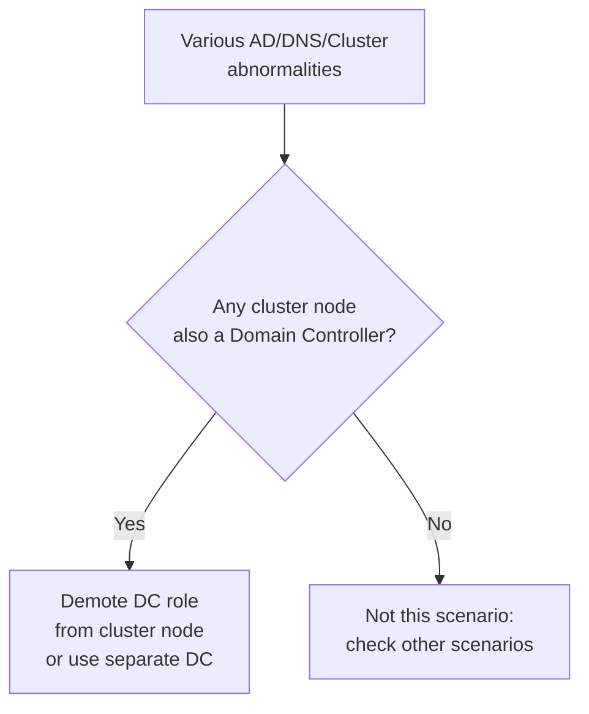
```mermaid
flowchart TD
    Start["Various AD/DNS/Cluster\nabnormalities"] --> Check1{"Any cluster node\nalso a Domain Controller?"}
    Check1 -->|"Yes"| Fix1["Demote DC role\nfrom cluster node\nor use separate DC"]
    Check1 -->|"No"| Escalate["Not this scenario:\ncheck other scenarios"]
```

**💡 Tips：**
- **Tip 1：** 这是一个**硬性最佳实践**——永远不要让 DC 和 Cluster Node 在同一台服务器上
- **⚠️ 常见误区：** "测试环境资源少，DC 和集群放一起没关系"——这会导致非常难排查的问题

---

## 4. 通用排查工具箱 (Universal Toolkit)

### 日志收集

| 目的 | 命令/工具 | 说明 |
|------|----------|------|
| Cluster Validation 报告 | `Test-Cluster -Node Node1,Node2` | 报告在 `%TEMP%` 目录下，.htm 格式 |
| Cluster 事件日志 | `Get-WinEvent -LogName "Microsoft-Windows-FailoverClustering/Operational" -MaxEvents 100` | 集群操作日志 |
| Cluster Debug 日志 | `Get-ClusterLog -Destination C:\Temp -TimeSpan 60` | 收集最近 60 分钟的集群日志 |
| System Event Log | `Get-WinEvent -LogName System -MaxEvents 100 \| Where {$_.LevelDisplayName -in @('Error','Warning')}` | 系统级错误 |
| WER 报告 | `dir C:\ProgramData\Microsoft\Windows\WER\ReportQueue` | Windows Error Reporting 数据 |

### 网络诊断

| 目的 | 命令/工具 | 说明 |
|------|----------|------|
| 端口连通性 | `Test-NetConnection -ComputerName Node2 -Port 445` | 测试 TCP 端口 |
| DNS 解析 | `Resolve-DnsName ClusterName` | 检查 DNS 记录 |
| 网络追踪 | `netsh trace start capture=yes tracefile=C:\temp\cluster.etl` | 内核级网络抓包 |
| 路由检查 | `route print` | 查看路由表 |
| SMB 连接测试 | `Get-SmbConnection -ServerName Node2` | SMB 连接状态 |

### Active Directory 诊断

| 目的 | 命令/工具 | 说明 |
|------|----------|------|
| 查找计算机对象 | `Get-ADComputer "ClusterName" -Properties *` | 查找 CNO |
| OU 权限 | `dsacls "OU=Clusters,DC=contoso,DC=corp"` | 检查 ACL |
| AD 复制状态 | `repadmin /replsummary` | 检查复制健康 |
| DC 定位 | `nltest /dsgetdc:contoso.corp` | 验证 DC 可达 |
| Secure Channel | `Test-ComputerSecureChannel -Verbose` | 验证信任关系 |

### 常用 PowerShell Cmdlets

| 目的 | 命令 | 说明 |
|------|------|------|
| 创建集群 | `New-Cluster -Name ClusterName -Node Node1,Node2 -StaticAddress 192.0.2.100` | 创建新集群 |
| 运行验证 | `Test-Cluster -Node Node1,Node2` | 全量验证 |
| 部分验证 | `Test-Cluster -Node Node1,Node2 -Include "Network","System Configuration"` | 只验证特定类别 |
| 检查功能 | `Get-WindowsFeature Failover-Clustering` | 检查安装状态 |
| 安装功能 | `Install-WindowsFeature -Name Failover-Clustering -IncludeManagementTools` | 安装集群功能 |

---

## 5. 跨场景关联 (Cross-Scenario Relationships)

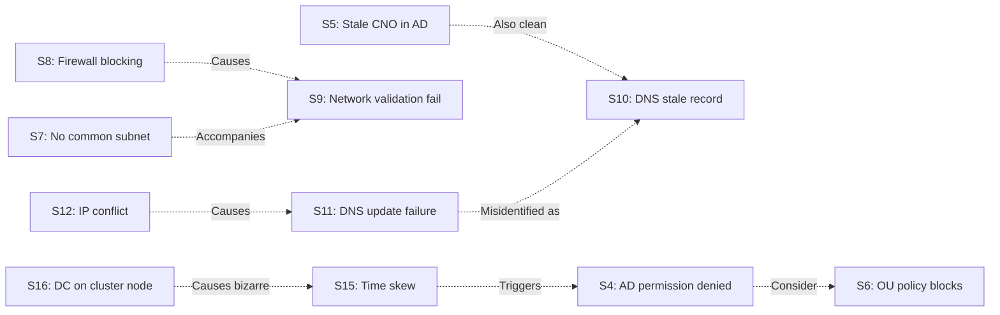
```mermaid
flowchart LR
    S5["S5: Stale CNO in AD"] -.->|"Also clean"| S10["S10: DNS stale record"]
    S4["S4: AD permission denied"] -.->|"Consider"| S6["S6: OU policy blocks"]
    S8["S8: Firewall blocking"] -.->|"Causes"| S9["S9: Network validation fail"]
    S11["S11: DNS update failure"] -.->|"Misidentified as"| S10
    S7["S7: No common subnet"] -.->|"Accompanies"| S9
    S15["S15: Time skew"] -.->|"Triggers"| S4
    S16["S16: DC on cluster node"] -.->|"Causes bizarre"| S15
    S12["S12: IP conflict"] -.->|"Causes"| S11
```

> **典型混淆场景：**
> - S5（残留 CNO）和 S10（残留 DNS 记录）经常需要**同时清理**
> - S4（权限不足）在排查时要额外检查 S6（OU 策略阻止）
> - S8（防火墙阻断）是 S9（网络验证失败）的**最常见根因**
> - S15（时间不同步）会导致 Kerberos 失败，表现为 S4 的 "access denied"

---

## 6. 参考资料 (References)

- [Create a Failover Cluster - Microsoft Learn](https://learn.microsoft.com/en-us/windows-server/failover-clustering/create-failover-cluster) — 创建 Failover Cluster 官方指南
- [Prestage Cluster Computer Objects in AD DS](https://learn.microsoft.com/en-us/windows-server/failover-clustering/prestage-cluster-adds) — AD 中预创建集群对象
- [Failover Clustering Overview](https://learn.microsoft.com/en-us/windows-server/failover-clustering/failover-clustering-overview) — Failover Clustering 概述
- [Troubleshooting using WER Reports](https://learn.microsoft.com/en-us/windows-server/failover-clustering/troubleshooting-using-wer-reports) — 使用 WER 报告排查集群问题

---
---

## 📌 English Version

---

## 1. Scenario Overview

```mermaid
mindmap
  root((Failover Cluster\nCreation Failure))
    Prerequisites
      S1: Feature Not Installed
      S2: OS Version or Edition Mismatch
      S3: Nodes Not Domain-Joined or Different Domains
    Active Directory and Permissions
      S4: No Permission to Create CNO
      S5: Stale or Duplicate CNO in AD
      S6: OU Restriction Blocks Computer Object Creation
    Network
      S7: No Common Subnet Between Nodes
      S8: Firewall Blocking Cluster Ports
      S9: Network Validation Failure
    DNS
      S10: Cluster Name Already Exists in DNS
      S11: DNS Dynamic Update Failure
      S12: Duplicate Cluster IP Address
    Storage and Quorum
      S13: Shared Storage Not Accessible
      S14: Quorum Witness Configuration Issue
    System Configuration
      S15: Time Sync Skew Between Nodes
      S16: Domain Controller on Cluster Node
```

---

## 2. How to Identify Your Scenario

| Symptom / Error Message | Likely Scenario | Jump To |
|------------------------|-----------------|---------|
| `New-Cluster` cmdlet not recognized | Feature not installed | → S1 |
| "Nodes running different versions" | OS mismatch | → S2 |
| "Node is not joined to a domain" | Not domain-joined | → S3 |
| "Access denied creating cluster name" (0x80070005) | AD permission | → S4 |
| "Object already exists" for cluster name | Stale CNO | → S5 |
| Access denied despite having permissions | OU policy | → S6 |
| "No common subnet" in validation | Network config | → S7 |
| "RPC server unavailable" or creation hangs | Firewall | → S8 |
| Cluster validation Network tests fail | NIC/connectivity | → S9 |
| "Cluster name already in use" | DNS conflict | → S10 |
| Cluster Name resource fails to come online | DNS update | → S11 |
| "Address already in use" | IP conflict | → S12 |
| Storage validation tests fail | Storage access | → S13 |
| Cluster loses quorum after creation | Quorum config | → S14 |
| Kerberos errors, clock skew | Time sync | → S15 |
| Various bizarre AD/DNS/Cluster issues | DC on node | → S16 |

---

## 3. Scenario Details

### S1: Failover Clustering Feature Not Installed
**Symptom:** `New-Cluster` not recognized. **Fix:** `Install-WindowsFeature -Name Failover-Clustering -IncludeManagementTools` on ALL nodes, then reboot.

### S2: OS Version/Edition Mismatch
**Symptom:** Validation reports mixed OS versions. **Fix:** Ensure all nodes run the same Windows Server version and edition.

### S3: Nodes Not Domain-Joined
**Symptom:** Domain membership errors. **Fix:** Join all nodes to the same AD domain. If Secure Channel is broken: `Reset-ComputerMachinePassword`.

### S4: No AD Permission to Create CNO
**Symptom:** Access denied (0x80070005). **Fix:** Grant "Create Computer Objects" on the target OU, or have a Domain Admin prestage the CNO.

### S5: Stale/Duplicate CNO in AD
**Symptom:** "Name already exists." **Fix:** Delete the stale CNO from AD (uncheck "Protect from accidental deletion" first). Also clean DNS (→ S10).

### S6: OU Policy Blocks Object Creation
**Symptom:** Access denied despite correct permissions. **Fix:** Check for Deny ACEs, `ms-DS-MachineAccountQuota=0`, or use prestage approach.

### S7: No Common Subnet Between Nodes
**Symptom:** Validation says no common subnet. **Fix:** Place nodes on same subnet, or configure multi-subnet cluster with proper routing.

### S8: Firewall Blocking Cluster Ports
**Symptom:** RPC unavailable, creation hangs. **Key ports:** TCP 135, 445, 5985, 49152-65535; **UDP 3343** (heartbeat); **TCP 3343** (used during cluster creation for initial node-to-node negotiation). **Fix:** Enable Failover Cluster firewall rules or add exceptions. Both TCP and UDP 3343 must be open bidirectionally.

### S9: Network Validation Failure
**Symptom:** Test-Cluster Network tests fail. **Fix:** Update NIC drivers, align NIC Teaming/vSwitch configuration across all nodes.

### S10: Cluster Name Already in DNS
**Symptom:** "Name already in use." **Fix:** Delete stale DNS A record from DNS Manager, then `ipconfig /flushdns`.

### S11: DNS Dynamic Update Failure
**Symptom:** Cluster created but Name resource won't online. **Fix:** Enable Dynamic Updates on DNS zone; ensure CNO has permission to update DNS. If CNO has permission but update still fails, capture a network trace or enable DNS Debug Logging to identify the root cause.

### S12: Cluster IP Address Conflict
**Symptom:** "Address already in use." **Fix:** Choose an unused static IP outside DHCP scope.

### S13: Shared Storage Not Accessible
**Symptom:** Storage validation fails. **Fix:** Ensure all nodes see the same SAN LUNs; set shared disks Offline before clustering.

### S14: Quorum Witness Configuration
**Symptom:** Cluster loses quorum easily. **Fix:** Configure Cloud Witness (recommended) or File Share Witness, especially for even-node clusters.

### S15: Time Sync Skew
**Symptom:** Kerberos errors. **Fix:** `w32tm /resync /force`; configure all nodes to use domain DC as NTP source. Disable Hyper-V time sync IC for VMs.

### S16: Domain Controller on Cluster Node
**Symptom:** Various bizarre failures. **Fix:** Demote DC role from cluster nodes. Never co-locate DC and Cluster Node.

---

## 4. Universal Toolkit

| Purpose | Command | Notes |
|---------|---------|-------|
| Full validation | `Test-Cluster -Node Node1,Node2` | Report at `%TEMP%` |
| Cluster event log | `Get-WinEvent -LogName "Microsoft-Windows-FailoverClustering/Operational"` | Operational log |
| Cluster debug log | `Get-ClusterLog -Destination C:\Temp -TimeSpan 60` | Last 60 minutes |
| Port test | `Test-NetConnection Node2 -Port 445` | TCP connectivity |
| AD computer search | `Get-ADComputer "ClusterName" -Properties *` | Find CNO |
| AD replication | `repadmin /replsummary` | Replication health |
| DNS lookup | `Resolve-DnsName ClusterName` | Check DNS records |
| Time sync check | `w32tm /stripchart /computer:DC /samples:3` | Time offset |

---

## 5. Cross-Scenario Relationships

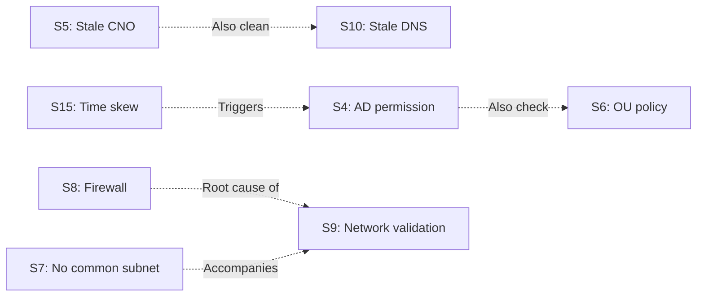
```mermaid
flowchart LR
    S5["S5: Stale CNO"] -.->|"Also clean"| S10["S10: Stale DNS"]
    S4["S4: AD permission"] -.->|"Also check"| S6["S6: OU policy"]
    S8["S8: Firewall"] -.->|"Root cause of"| S9["S9: Network validation"]
    S15["S15: Time skew"] -.->|"Triggers"| S4
    S7["S7: No common subnet"] -.->|"Accompanies"| S9
```

**Common confusion:** S5 (stale CNO) and S10 (stale DNS) usually need to be cleaned together. S15 (time skew) causes Kerberos failures that look like S4 (permission denied).

---

## 6. References

- [Create a Failover Cluster - Microsoft Learn](https://learn.microsoft.com/en-us/windows-server/failover-clustering/create-failover-cluster) — Official cluster creation guide
- [Prestage Cluster Computer Objects in AD DS](https://learn.microsoft.com/en-us/windows-server/failover-clustering/prestage-cluster-adds) — Prestaging CNO in Active Directory
- [Failover Clustering Overview](https://learn.microsoft.com/en-us/windows-server/failover-clustering/failover-clustering-overview) — Failover Clustering overview
- [Troubleshooting using WER Reports](https://learn.microsoft.com/en-us/windows-server/failover-clustering/troubleshooting-using-wer-reports) — Using WER reports for cluster troubleshooting
