# Scenario Map: Windows Cluster CNO Repair Failures

**Product/Service:** Windows Server Failover Clustering / Active Directory
**Scope:** 集群名称对象 (CNO) 修复失败的全场景排查 — 涵盖 CNO 账户问题、权限问题、修复操作失败、DNS 注册问题、域策略限制
**Last Updated:** 2026-03-11

---

## 1. 场景全景图 (Scenario Overview)

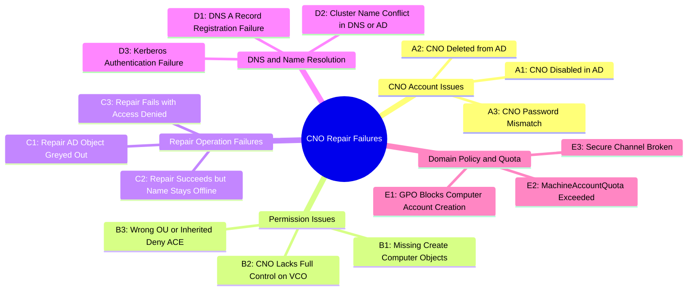
```mermaid
mindmap
  root((CNO Repair Failures))
    CNO Account Issues
      A1: CNO Disabled in AD
      A2: CNO Deleted from AD
      A3: CNO Password Mismatch
    Permission Issues
      B1: Missing Create Computer Objects
      B2: CNO Lacks Full Control on VCO
      B3: Wrong OU or Inherited Deny ACE
    Repair Operation Failures
      C1: Repair AD Object Greyed Out
      C2: Repair Succeeds but Name Stays Offline
      C3: Repair Fails with Access Denied
    DNS and Name Resolution
      D1: DNS A Record Registration Failure
      D2: Cluster Name Conflict in DNS or AD
      D3: Kerberos Authentication Failure
    Domain Policy and Quota
      E1: GPO Blocks Computer Account Creation
      E2: MachineAccountQuota Exceeded
      E3: Secure Channel Broken
```

> 这张图覆盖了 CNO 修复失败的 5 大类 14 个常见场景。根据你的症状在下方 Section 2 快速定位。

---

## 2. 场景识别指南 (How to Identify Your Scenario)

| 你看到的症状 | 可能的场景 | 跳转 |
|-------------|-----------|------|
| Cluster Name resource 离线，AD 中 CNO 图标有向下箭头 | A1: CNO 被禁用 | → [场景 A1](#场景-a1-cno-在-ad-中被禁用) |
| Cluster Name resource 离线，AD 中找不到 CNO 计算机账户 | A2: CNO 被删除 | → [场景 A2](#场景-a2-cno-从-ad-中被删除) |
| Event 1193/1194: `Logon failure: unknown user name or bad password` | A3: CNO 密码不匹配 | → [场景 A3](#场景-a3-cno-密码不匹配) |
| 创建新的集群角色 (clustered role) 时报 "not enough permissions to create" | B1: 缺少 Create Computer Objects 权限 | → [场景 B1](#场景-b1-缺少-create-computer-objects-权限) |
| 集群角色的 Network Name 无法上线，VCO 在 AD 中无 CNO 的 Full Control | B2: CNO 对 VCO 无 Full Control | → [场景 B2](#场景-b2-cno-对-vco-缺少-full-control) |
| 右键 Cluster Name → "Repair Active Directory Object" 是灰色的 | C1: 修复选项灰色 | → [场景 C1](#场景-c1-repair-active-directory-object-选项灰色) |
| 执行 Repair 后无报错但 Cluster Name resource 仍无法上线 | C2: 修复成功但名称仍离线 | → [场景 C2](#场景-c2-修复成功但-cluster-name-仍离线) |
| 执行 Repair 时弹出 Access Denied 错误 | C3: 修复时拒绝访问 | → [场景 C3](#场景-c3-修复时-access-denied) |
| Cluster Name online 但客户端无法通过集群名称连接 | D1: DNS A 记录注册失败 | → [场景 D1](#场景-d1-dns-a-记录注册失败) |
| 创建集群或修复 CNO 时报 "name already in use" | D2: 名称冲突 | → [场景 D2](#场景-d2-集群名称在-dns-或-ad-中冲突) |
| Event 1129: Kerberos authentication failure for cluster name | D3: Kerberos 认证失败 | → [场景 D3](#场景-d3-kerberos-认证失败) |
| 创建新角色时报 "computer object could not be created in domain" | E1/E2: GPO 阻止或配额超限 | → [场景 E1](#场景-e1-gpo-阻止创建计算机账户) |
| `Test-ComputerSecureChannel` 返回 False | E3: 安全通道断裂 | → [场景 E3](#场景-e3-安全通道断裂) |

---

## 3. 各场景排查详情 (Scenario Details)

---

### 场景 A1: CNO 在 AD 中被禁用

**典型症状：** Cluster Name resource 离线。在 AD Users and Computers 中查看 CNO 计算机账户，图标上有一个**向下箭头**（表示已禁用）。

**排查逻辑：**
> CNO 被禁用通常是因为 AD 管理员误操作、自动化脚本清理不活跃账户、或域策略要求禁用闲置计算机账户。修复很简单：启用账户 → 修复 AD 对象 → 上线。但需要排查是谁禁用的，防止再次发生。

**排查流程图：**

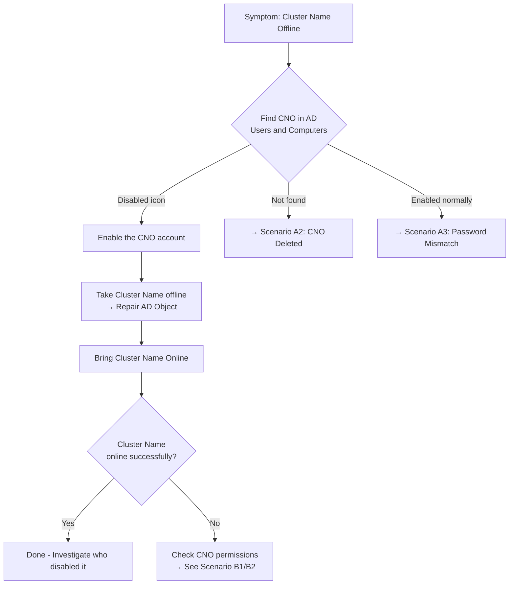
```mermaid
flowchart TD
    Start["Symptom: Cluster Name Offline"] --> Check1{"Find CNO in AD<br/>Users and Computers"}
    Check1 -->|"Disabled icon"| Fix1["Enable the CNO account"]
    Fix1 --> Repair["Take Cluster Name offline<br/>→ Repair AD Object"]
    Repair --> Online["Bring Cluster Name Online"]
    Online --> Verify{"Cluster Name<br/>online successfully?"}
    Verify -->|Yes| Done["Done - Investigate who disabled it"]
    Verify -->|No| CheckPerm["Check CNO permissions<br/>→ See Scenario B1/B2"]
    Check1 -->|"Not found"| ScenA2["→ Scenario A2: CNO Deleted"]
    Check1 -->|"Enabled normally"| ScenA3["→ Scenario A3: Password Mismatch"]
```

**关键诊断命令：**

| 检查什么 | 命令 | 看什么 |
|---------|------|--------|
| CNO 状态 | `Get-ADComputer <ClusterName> -Properties Enabled` | `Enabled` 应为 `True` |
| 谁禁用了 CNO | 检查 AD Security 审计日志 Event ID 4725 | 操作者账户和时间 |
| 启用 CNO | `Enable-ADAccount -Identity <ClusterName>$` | 无报错即成功 |

**💡 Tips：**
- **Tip 1：** 预暂存 (Prestage) 的 CNO 在创建集群之前**应该**是禁用状态，这是正常的。集群创建向导会自动启用它。如果集群已经在运行，CNO 被禁用则是异常
- **Tip 2：** 某些组织有 GPO 定期禁用不活跃的计算机账户。确保集群所在 OU **排除**此策略
- **⚠️ 常见误区：** 不要在 CNO 被禁用的情况下直接尝试强制创建新集群名称，这会导致更多权限混乱

**解决方案摘要：**

| 根因 | 修复方法 | 验证方式 |
|------|---------|---------|
| CNO 被手动/自动禁用 | 在 AD 中启用 CNO → Repair AD Object → Online | `Get-ClusterResource "Cluster Name"` State = Online |
| GPO 自动禁用不活跃账户 | 将集群 OU 排除出该 GPO | 确认 GPO 不再影响该 OU |

---

### 场景 A2: CNO 从 AD 中被删除

**典型症状：** Cluster Name resource 离线。在 AD 中完全找不到集群名称对应的计算机账户。可能在 AD 回收站中能找到。

**排查逻辑：**
> CNO 被删除后，集群名称资源无法上线，所有依赖 CNO 的 VCO 也会受影响。优先从 AD 回收站恢复；如果无法恢复，需要重新创建并修复权限。

**排查流程图：**

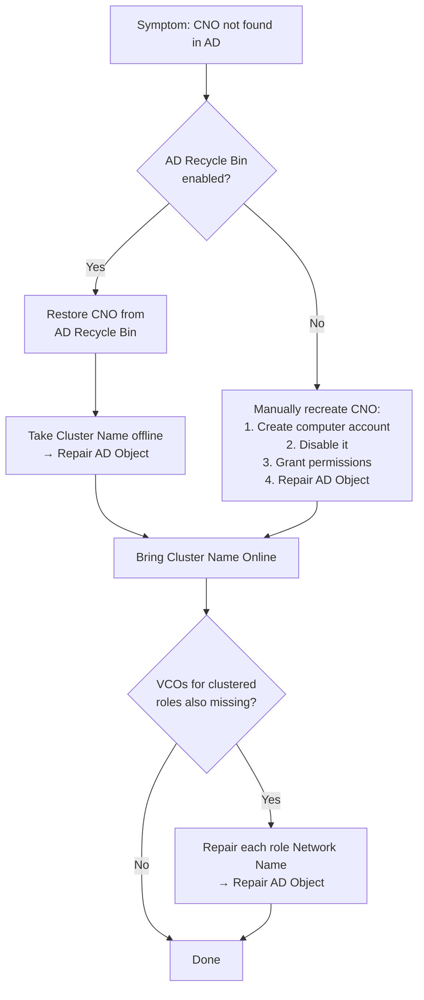
```mermaid
flowchart TD
    Start["Symptom: CNO not found in AD"] --> Check1{"AD Recycle Bin<br/>enabled?"}
    Check1 -->|Yes| Restore["Restore CNO from<br/>AD Recycle Bin"]
    Restore --> Repair["Take Cluster Name offline<br/>→ Repair AD Object"]
    Repair --> Online["Bring Cluster Name Online"]
    Check1 -->|No| Manual["Manually recreate CNO:<br/>1. Create computer account<br/>2. Disable it<br/>3. Grant permissions<br/>4. Repair AD Object"]
    Manual --> Online
    Online --> VerifyVCO{"VCOs for clustered<br/>roles also missing?"}
    VerifyVCO -->|Yes| RepairVCO["Repair each role Network Name<br/>→ Repair AD Object"]
    VerifyVCO -->|No| Done["Done"]
    RepairVCO --> Done
```

**关键诊断命令：**

| 检查什么 | 命令 | 看什么 |
|---------|------|--------|
| 搜索 AD 回收站 | `Get-ADObject -Filter 'Name -eq "<ClusterName>"' -IncludeDeletedObjects` | 是否找到已删除对象 |
| 恢复 CNO | `Restore-ADObject -Identity <ObjectGUID>` | 恢复后确认账户存在 |
| 重新创建 CNO | 在 ADUC 中新建计算机账户并禁用 → 设置权限 | 参照 Prestage 流程 |
| 检查所有 VCO | `Get-ClusterGroup \| Get-ClusterResource \| Where Type -eq "Network Name"` | 是否所有 Network Name 都能上线 |

**💡 Tips：**
- **Tip 1：** 恢复后务必检查 CNO 的 ACL 是否完整（Create Computer Objects 权限），删除-恢复过程可能导致权限丢失
- **Tip 2：** 如果 AD 回收站未启用，建议立即启用：`Enable-ADOptionalFeature 'Recycle Bin Feature' -Scope ForestOrConfigurationSet -Target <ForestName>`
- **⚠️ 常见误区：** 仅恢复 CNO 而忘记检查 VCO（各集群角色的计算机对象），会导致角色的 Network Name 仍然无法上线

**解决方案摘要：**

| 根因 | 修复方法 | 验证方式 |
|------|---------|---------|
| CNO 被删除，AD 回收站可用 | `Restore-ADObject` 恢复 → Repair AD Object | Cluster Name 和所有角色 Online |
| CNO 被删除，无回收站 | 手动 Prestage CNO → 设置权限 → Repair AD Object | `Get-ADComputer <ClusterName>` 存在且 Enabled |

---

### 场景 A3: CNO 密码不匹配

**典型症状：** 集群事件日志中出现 Event 1193/1194，提示 `Logon failure: unknown user name or bad password`。Cluster Name resource 可能间歇性离线。

**排查逻辑：**
> 集群服务定期刷新 CNO 的密码（类似普通计算机账户的密码自动轮换）。如果 AD 侧的密码与集群内部存储的密码不一致（如 AD 被从备份恢复），将导致认证失败。修复方法是通过 Repair AD Object 重置密码。

**排查流程图：**

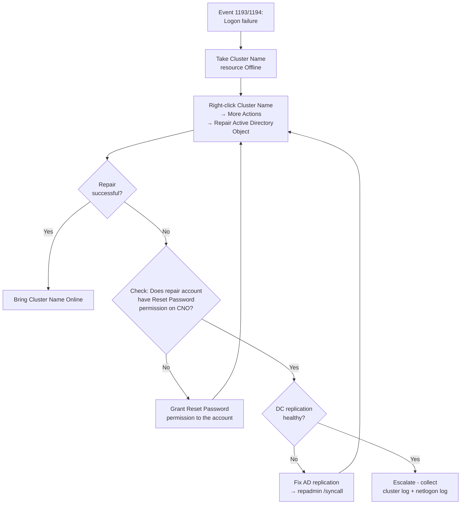
```mermaid
flowchart TD
    Start["Event 1193/1194:<br/>Logon failure"] --> TakeOff["Take Cluster Name<br/>resource Offline"]
    TakeOff --> Repair["Right-click Cluster Name<br/>→ More Actions<br/>→ Repair Active Directory Object"]
    Repair --> Result{"Repair<br/>successful?"}
    Result -->|Yes| Online["Bring Cluster Name Online"]
    Result -->|No| CheckPerm{"Check: Does repair account<br/>have Reset Password<br/>permission on CNO?"}
    CheckPerm -->|No| GrantPerm["Grant Reset Password<br/>permission to the account"]
    GrantPerm --> Repair
    CheckPerm -->|Yes| CheckDC{"DC replication<br/>healthy?"}
    CheckDC -->|No| FixRepl["Fix AD replication<br/>→ repadmin /syncall"]
    FixRepl --> Repair
    CheckDC -->|Yes| Escalate["Escalate - collect<br/>cluster log + netlogon log"]
```

**关键诊断命令：**

| 检查什么 | 命令 | 看什么 |
|---------|------|--------|
| 集群事件 | `Get-WinEvent -LogName System -FilterXPath "*[System[EventID=1193 or EventID=1194]]"` | 密码相关错误 |
| AD 复制状态 | `repadmin /replsummary` | 所有 DC 之间复制正常无失败 |
| CNO 密码上次设置时间 | `Get-ADComputer <ClusterName> -Properties PasswordLastSet` | 对比当前时间判断是否过期 |

**💡 Tips：**
- **Tip 1：** 执行 Repair AD Object 的账户需要在 AD 中对 CNO 有 **Reset Password** 权限。如果你不是 Domain Admin，需要确认此权限
- **Tip 2：** 如果 AD 刚从备份恢复过，所有集群的 CNO 密码可能都不匹配，需要逐一修复
- **⚠️ 常见误区：** 不要尝试手动在 AD 中重置 CNO 的密码（如右键 Reset Password），这会进一步破坏密码同步。只通过 Failover Cluster Manager 的 Repair AD Object 操作

**解决方案摘要：**

| 根因 | 修复方法 | 验证方式 |
|------|---------|---------|
| CNO 密码与 AD 不同步 | Take Offline → Repair AD Object → Online | Event 1193/1194 不再出现 |
| AD 从备份恢复导致密码回滚 | 对所有受影响集群执行 Repair AD Object | 所有集群 Cluster Name Online |

---

### 场景 B1: 缺少 Create Computer Objects 权限

**典型症状：** 集群本身的 Cluster Name 正常，但**创建新的集群角色**（如新 Hyper-V VM 的 Client Access Point）时失败。报错类似：`An error occurred creating the network name... not enough permissions`。

**排查逻辑：**
> 当集群创建新的 clustered role 时，CNO 需要在其所在 OU 中创建 VCO（Virtual Computer Object）。如果 CNO 在该 OU 上没有 Create Computer Objects 权限，创建就会失败。

**排查流程图：**

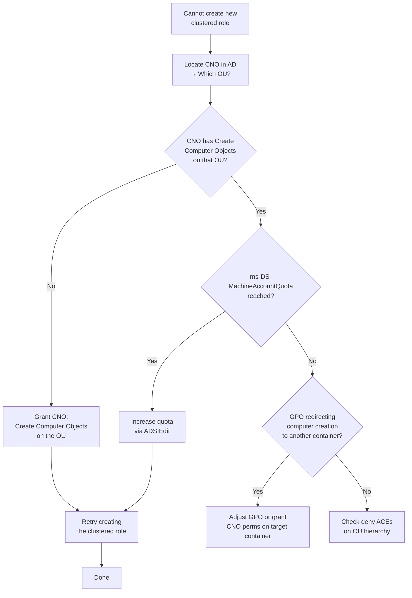
```mermaid
flowchart TD
    Start["Cannot create new<br/>clustered role"] --> FindOU["Locate CNO in AD<br/>→ Which OU?"]
    FindOU --> CheckACL{"CNO has Create<br/>Computer Objects<br/>on that OU?"}
    CheckACL -->|No| GrantACL["Grant CNO:<br/>Create Computer Objects<br/>on the OU"]
    GrantACL --> Retry["Retry creating<br/>the clustered role"]
    CheckACL -->|Yes| CheckQuota{"ms-DS-MachineAccountQuota<br/>reached?"}
    CheckQuota -->|Yes| IncQuota["Increase quota<br/>via ADSIEdit"]
    IncQuota --> Retry
    CheckQuota -->|No| CheckGPO{"GPO redirecting<br/>computer creation<br/>to another container?"}
    CheckGPO -->|Yes| FixGPO["Adjust GPO or grant<br/>CNO perms on target container"]
    CheckGPO -->|No| Escalate["Check deny ACEs<br/>on OU hierarchy"]
    Retry --> Done["Done"]
```

**关键诊断命令：**

| 检查什么 | 命令 | 看什么 |
|---------|------|--------|
| CNO 所在 OU | `Get-ADComputer <ClusterName> \| Select DistinguishedName` | 确认 OU 位置 |
| OU 上的 ACL | `(Get-Acl "AD:\<OU-DN>").Access \| Where IdentityReference -match "<ClusterName>"` | 是否有 CreateChild 权限 |
| 域配额 | `Get-ADObject (Get-ADDomain).DistinguishedName -Properties ms-DS-MachineAccountQuota` | 默认 10，是否已用完 |
| CNO 在默认 Computers 还是自定义 OU | 在 ADUC 中查看 | 默认 Computers 容器可创建 10 个 VCO 无需额外权限 |

**💡 Tips：**
- **Tip 1：** 如果 CNO 在默认 Computers 容器中，可以无需额外配置直接创建最多 10 个 VCO。但如果 CNO 在自定义 OU 中，必须显式授权
- **Tip 2：** 授权时注意 "Applies to" 应设为 **This object and all descendant objects**
- **⚠️ 常见误区：** 只在 OU 上给了 CNO "Read" 权限而忘记给 "Create Computer Objects" 权限

**解决方案摘要：**

| 根因 | 修复方法 | 验证方式 |
|------|---------|---------|
| CNO 缺少 Create Computer Objects | 在 OU 安全设置中添加 CNO → Allow Create Computer Objects | 成功创建新的 clustered role |
| 域配额耗尽 | ADSIEdit 增大 `ms-DS-MachineAccountQuota` | 新 VCO 可以被创建 |

---

### 场景 B2: CNO 对 VCO 缺少 Full Control

**典型症状：** 集群角色的 Network Name 资源无法上线。已有 VCO 存在但 CNO 没有 Full Control 权限。

**排查逻辑：**
> CNO 需要对每个 VCO（集群角色的计算机对象）拥有 Full Control 权限，才能管理其密码、SPN 和 DNS 记录。如果权限被移除或从未正确设置，Network Name 资源将无法上线。

**关键诊断命令：**

| 检查什么 | 命令 | 看什么 |
|---------|------|--------|
| VCO 上 CNO 的权限 | 在 ADUC → VCO Properties → Security Tab | CNO 应有 Full Control |
| 批量检查所有 VCO | PowerShell 遍历集群角色的 Network Name 对应的 AD 对象 | 逐个确认 |

**解决方案摘要：**

| 根因 | 修复方法 | 验证方式 |
|------|---------|---------|
| VCO 上 CNO 无 Full Control | 在 VCO Security Tab 添加 CNO → Full Control | Network Name 资源上线 |
| VCO 是由非集群管理员预创建的 | 添加 CNO Full Control 后 Repair AD Object | 角色正常运行 |

---

### 场景 C1: Repair Active Directory Object 选项灰色

**典型症状：** 右键 Cluster Name 资源 → More Actions → "Repair Active Directory Object" 选项是**灰色不可点击**。

**排查逻辑：**
> 这是最常见的"修复不了"的场景之一。原因很简单：**Repair AD Object 只有在 Cluster Name 资源处于 Offline 状态时才可用**。如果资源是 Online 或 Failed 状态，需要先手动 Take Offline。

**排查流程图：**

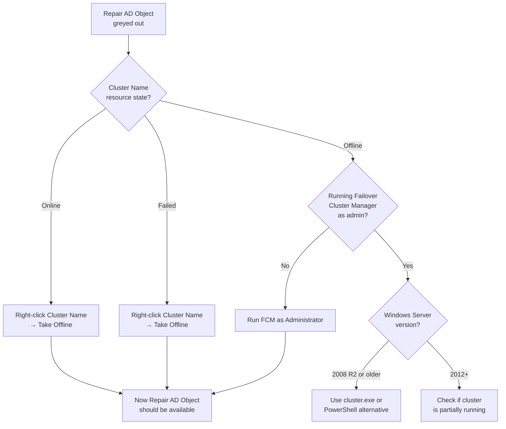
```mermaid
flowchart TD
    Start["Repair AD Object<br/>greyed out"] --> Check1{"Cluster Name<br/>resource state?"}
    Check1 -->|"Online"| TakeOff1["Right-click Cluster Name<br/>→ Take Offline"]
    Check1 -->|"Failed"| TakeOff2["Right-click Cluster Name<br/>→ Take Offline"]
    Check1 -->|"Offline"| Check2{"Running Failover<br/>Cluster Manager<br/>as admin?"}
    TakeOff1 --> Repair["Now Repair AD Object<br/>should be available"]
    TakeOff2 --> Repair
    Check2 -->|No| RunAdmin["Run FCM as Administrator"]
    RunAdmin --> Repair
    Check2 -->|Yes| CheckVer{"Windows Server<br/>version?"}
    CheckVer -->|"2008 R2 or older"| Legacy["Use cluster.exe or<br/>PowerShell alternative"]
    CheckVer -->|"2012+"| Escalate["Check if cluster<br/>is partially running"]
```

**💡 Tips：**
- **Tip 1：** 将 Cluster Name 资源 Take Offline 不会影响其他集群组（如 SQL Server FCI 或 Hyper-V VM），因为它们不依赖 Cluster Name 资源
- **Tip 2：** 如果 Take Offline 本身失败，尝试 `Stop-ClusterResource "Cluster Name" -Force`
- **⚠️ 常见误区：** 很多人看到 Repair 灰色就认为是权限问题，其实 99% 的情况只是忘记先 Take Offline

**解决方案摘要：**

| 根因 | 修复方法 | 验证方式 |
|------|---------|---------|
| Cluster Name 资源未 Offline | 先 Take Offline 再执行 Repair | Repair 选项变为可点击 |
| 未以管理员运行 FCM | 以管理员身份运行 Failover Cluster Manager | Repair 选项可用 |

---

### 场景 C2: 修复成功但 Cluster Name 仍离线

**典型症状：** 执行 Repair AD Object 没有报错，但 Bring Online 后 Cluster Name 资源仍然是 Failed 状态。

**排查逻辑：**
> Repair AD Object 只修复 AD 中的对象（启用账户、重置密码、修复 SPN）。如果问题在 DNS 注册、IP 地址冲突或网络层面，Repair 不会解决这些。需要继续排查其他层面。

**排查流程图：**

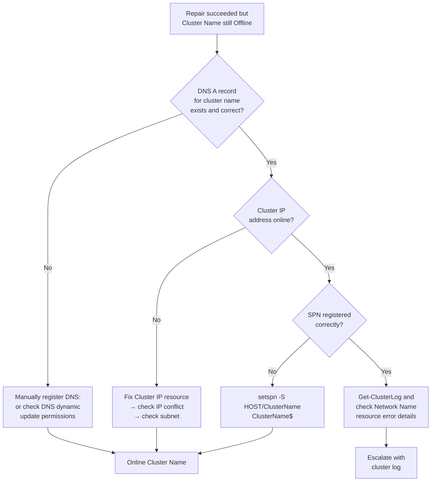
```mermaid
flowchart TD
    Start["Repair succeeded but<br/>Cluster Name still Offline"] --> CheckDNS{"DNS A record<br/>for cluster name<br/>exists and correct?"}
    CheckDNS -->|No| FixDNS["Manually register DNS:<br/>or check DNS dynamic<br/>update permissions"]
    CheckDNS -->|Yes| CheckIP{"Cluster IP<br/>address online?"}
    CheckIP -->|No| FixIP["Fix Cluster IP resource<br/>→ check IP conflict<br/>→ check subnet"]
    CheckIP -->|Yes| CheckSPN{"SPN registered<br/>correctly?"}
    CheckSPN -->|No| FixSPN["setspn -S HOST/ClusterName<br/>ClusterName$"]
    CheckSPN -->|Yes| CheckLog["Get-ClusterLog and<br/>check Network Name<br/>resource error details"]
    FixDNS --> Retry["Online Cluster Name"]
    FixIP --> Retry
    FixSPN --> Retry
    CheckLog --> Escalate["Escalate with<br/>cluster log"]
```

**关键诊断命令：**

| 检查什么 | 命令 | 看什么 |
|---------|------|--------|
| DNS 记录 | `Resolve-DnsName <ClusterName> -Server <DC_IP>` | 应解析到集群 IP |
| 集群 IP 资源状态 | `Get-ClusterResource \| Where ResourceType -eq "IP Address"` | State = Online |
| SPN 注册 | `setspn -L <ClusterName>$` | 应有 `HOST/<ClusterName>` |
| Cluster Name 资源详细错误 | `Get-ClusterLog -Destination C:\temp -TimeSpan 30` | 搜索 Network Name 相关错误 |

**💡 Tips：**
- **Tip 1：** Cluster Name 资源依赖 IP Address 资源。如果 IP 资源都没有上线，Name 资源不可能上线。先确认依赖链
- **Tip 2：** 查看集群日志中 `[RES] Network Name` 的详细错误，通常能直接看到失败原因

**解决方案摘要：**

| 根因 | 修复方法 | 验证方式 |
|------|---------|---------|
| DNS 记录缺失 | 手动添加 A 记录或修复 DNS 动态更新 | `nslookup <ClusterName>` 返回正确 IP |
| IP 地址冲突 | 更换集群 IP 或解决冲突 | IP Address 资源 Online |
| SPN 缺失 | `setspn -S HOST/<ClusterName> <ClusterName>$` | Kerberos 认证正常 |

---

### 场景 C3: 修复时 Access Denied

**典型症状：** 执行 Repair AD Object 时弹出 "Access Denied" 或 "Insufficient permissions" 错误。

**排查逻辑：**
> 执行 Repair 的账户需要对 CNO 有特定 AD 权限（Reset Password、Write 属性等）。如果当前登录账户不是 Domain Admin 且未被授权，就会拒绝。

**关键诊断命令：**

| 检查什么 | 命令 | 看什么 |
|---------|------|--------|
| 当前账户是否有 CNO 权限 | ADUC → CNO Properties → Security Tab | 当前账户或其所在组是否有写权限 |
| 当前账户所属组 | `whoami /groups` | 是否在 Domain Admins 或 Account Operators |

**解决方案摘要：**

| 根因 | 修复方法 | 验证方式 |
|------|---------|---------|
| 当前账户无 CNO 写权限 | 使用 Domain Admin 账户或授予 CNO Reset Password + Write 权限 | Repair 成功无报错 |
| CNO 上有显式 Deny ACE | 移除 Deny ACE | Repair 成功 |

---

### 场景 D1: DNS A 记录注册失败

**典型症状：** Cluster Name 资源显示 Online，但客户端无法通过集群名称连接。`nslookup <ClusterName>` 返回错误或错误 IP。

**排查流程图：**

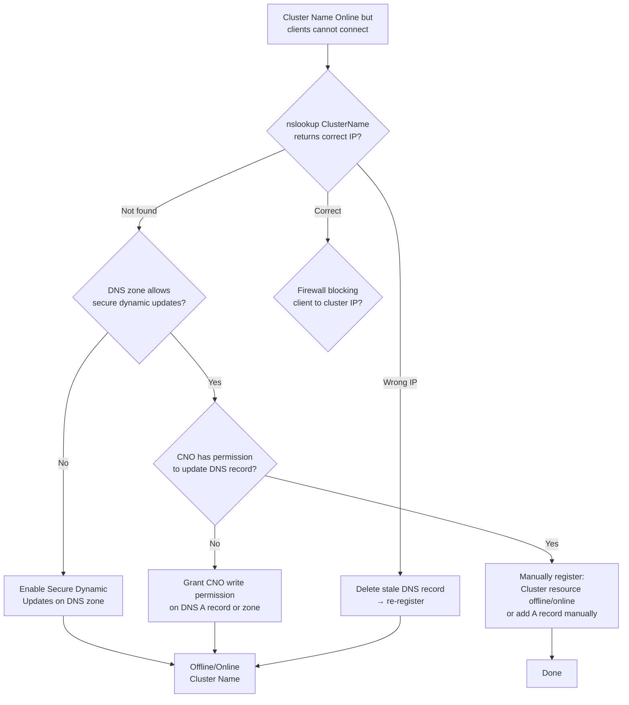
```mermaid
flowchart TD
    Start["Cluster Name Online but<br/>clients cannot connect"] --> DNS1{"nslookup ClusterName<br/>returns correct IP?"}
    DNS1 -->|"Not found"| Check2{"DNS zone allows<br/>secure dynamic updates?"}
    Check2 -->|No| FixZone["Enable Secure Dynamic<br/>Updates on DNS zone"]
    Check2 -->|Yes| Check3{"CNO has permission<br/>to update DNS record?"}
    Check3 -->|No| FixDNSPerm["Grant CNO write permission<br/>on DNS A record or zone"]
    Check3 -->|Yes| ManualReg["Manually register:<br/>Cluster resource offline/online<br/>or add A record manually"]
    DNS1 -->|"Wrong IP"| Stale["Delete stale DNS record<br/>→ re-register"]
    DNS1 -->|"Correct"| CheckFW{"Firewall blocking<br/>client to cluster IP?"}
    FixZone --> Retry["Offline/Online<br/>Cluster Name"]
    FixDNSPerm --> Retry
    ManualReg --> Done["Done"]
    Stale --> Retry
```

**💡 Tips：**
- **Tip 1：** 集群 DNS 注册使用 CNO 的身份进行安全动态更新。如果 DNS 记录最初由另一个账户创建，CNO 可能没有更新权限
- **Tip 2：** 检查 DNS 记录的安全性：`Properties → Security Tab`，确保 CNO 有 Full Control

---

### 场景 D2: 集群名称在 DNS 或 AD 中冲突

**典型症状：** 创建集群或修复 CNO 时，报 "The cluster name is already in use" 或 "A computer account with this name already exists"。

**解决方案摘要：**

| 根因 | 修复方法 | 验证方式 |
|------|---------|---------|
| AD 中已有同名计算机账户 | 删除或重命名冲突对象 | `Get-ADComputer <Name>` 仅返回 CNO |
| DNS 中有残留 A 记录 | 手动删除残留记录 | `Resolve-DnsName` 返回正确结果 |

---

### 场景 D3: Kerberos 认证失败

**典型症状：** Event 1129 或 `Kerberos authentication failure`。客户端连接集群名称时认证失败。

**排查逻辑：**
> SPN (Service Principal Name) 是 Kerberos 认证的关键。如果 CNO 的 SPN 缺失、重复或指向错误对象，Kerberos 认证将失败。

**关键诊断命令：**

| 检查什么 | 命令 | 看什么 |
|---------|------|--------|
| SPN 列表 | `setspn -L <ClusterName>$` | 应包含 `HOST/<ClusterName>` 和 FQDN |
| 重复 SPN | `setspn -X -P` | 不应有重复的 HOST SPN |
| 时间偏差 | `w32tm /query /status` | 与 DC 时间差 < 5 分钟 |

**解决方案摘要：**

| 根因 | 修复方法 | 验证方式 |
|------|---------|---------|
| SPN 缺失 | `setspn -S HOST/<ClusterName> <ClusterName>$` | `setspn -L` 显示正确 |
| SPN 重复 | `setspn -D HOST/<ClusterName> <WrongAccount>` 删除重复项 | `setspn -X` 无重复 |
| 时间偏差超过 5 分钟 | 同步时间 `w32tm /resync` | 时间差 < 5 分钟 |

---

### 场景 E1: GPO 阻止创建计算机账户

**典型症状：** 创建新集群角色时失败，但手动在 AD 中创建计算机账户正常。可能有 GPO 将新计算机账户重定向到特定 OU。

**关键诊断命令：**

| 检查什么 | 命令 | 看什么 |
|---------|------|--------|
| 有效 GPO | `gpresult /r /scope:computer` (在集群节点上运行) | 是否有重定向计算机创建的策略 |
| 默认计算机容器重定向 | `redircmp` 命令的历史设置 | 是否重定向到了受限 OU |

**解决方案摘要：**

| 根因 | 修复方法 | 验证方式 |
|------|---------|---------|
| GPO 重定向计算机创建到受限 OU | 在目标 OU 上授予 CNO Create Computer Objects | 成功创建角色 |
| GPO 限制特定用户创建计算机 | 调整 GPO 或使用预暂存 VCO | 预暂存 VCO 后角色可上线 |

---

### 场景 E2: MachineAccountQuota 超限

**典型症状：** 域的 `ms-DS-MachineAccountQuota`（默认值 10）用尽，非 Domain Admin 用户无法再创建任何计算机对象。

**关键诊断命令：**

| 检查什么 | 命令 | 看什么 |
|---------|------|--------|
| 当前配额 | `Get-ADObject (Get-ADDomain).DistinguishedName -Properties ms-DS-MachineAccountQuota` | 默认 10 |
| 修改配额 | ADSIEdit → 域对象 → `ms-DS-MachineAccountQuota` 改大或改 0（不限制） | 注意安全风险 |

---

### 场景 E3: 安全通道断裂

**典型症状：** 集群节点与 DC 之间的 Secure Channel 断裂，导致集群服务整体认证失败，不仅仅是 CNO 问题。

**排查流程图：**

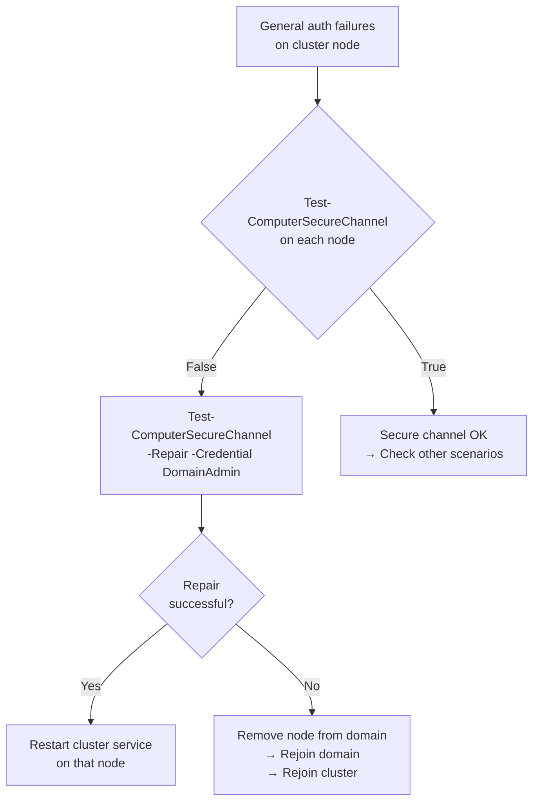
```mermaid
flowchart TD
    Start["General auth failures<br/>on cluster node"] --> Test{"Test-ComputerSecureChannel<br/>on each node"}
    Test -->|"False"| Repair["Test-ComputerSecureChannel<br/>-Repair -Credential DomainAdmin"]
    Test -->|"True"| NotThis["Secure channel OK<br/>→ Check other scenarios"]
    Repair --> Result{"Repair<br/>successful?"}
    Result -->|Yes| Restart["Restart cluster service<br/>on that node"]
    Result -->|No| Rejoin["Remove node from domain<br/>→ Rejoin domain<br/>→ Rejoin cluster"]
```

**解决方案摘要：**

| 根因 | 修复方法 | 验证方式 |
|------|---------|---------|
| 节点安全通道断裂 | `Test-ComputerSecureChannel -Repair` | 返回 True |
| 修复失败 | 退域 → 重新加域 → 重新加入集群 | 节点正常加入集群 |

---

## 4. 通用排查工具箱 (Universal Toolkit)

### 集群诊断

| 目的 | 命令/工具 | 说明 |
|------|----------|------|
| 生成集群日志 | `Get-ClusterLog -Destination C:\temp -TimeSpan 60` | 最近 60 分钟的集群详细日志 |
| 集群验证 | `Test-Cluster -Node Node1,Node2` | 完整的集群配置验证 |
| 查看所有资源状态 | `Get-ClusterResource \| Format-Table Name, State, ResourceType` | 快速定位离线资源 |
| 查看集群事件 | `Get-WinEvent -LogName "Microsoft-Windows-FailoverClustering/Operational" -MaxEvents 50` | 最近 50 条集群事件 |

### Active Directory 诊断

| 目的 | 命令/工具 | 说明 |
|------|----------|------|
| 查看 CNO 详细信息 | `Get-ADComputer <ClusterName> -Properties *` | 包含 Enabled、PasswordLastSet、SPN 等 |
| 查看 CNO ACL | `(Get-Acl "AD:\CN=<ClusterName>,<OU-DN>").Access` | 检查权限列表 |
| 检查 SPN | `setspn -L <ClusterName>$` | 列出所有注册的 SPN |
| 检查 SPN 重复 | `setspn -X -P` | 域内 SPN 重复检测 |
| AD 复制状态 | `repadmin /replsummary` | 确认 DC 间复制正常 |
| AD 回收站恢复 | `Get-ADObject -Filter 'Name -eq "<Name>"' -IncludeDeletedObjects` | 搜索已删除对象 |

### DNS 诊断

| 目的 | 命令/工具 | 说明 |
|------|----------|------|
| DNS 解析 | `Resolve-DnsName <ClusterName> -Server <DC_IP>` | 检查 DNS A 记录 |
| 反向解析 | `Resolve-DnsName <ClusterIP> -Server <DC_IP>` | 检查 PTR 记录 |
| DNS 记录权限 | DNS Manager → 记录 → Properties → Security | CNO 需有写权限 |

### 常用注册表/配置

| 配置项 | 路径/键值 | 作用 |
|--------|----------|------|
| Cluster Log Level | `(Get-Cluster).ClusterLogLevel` | 默认 3，设为 5 获取最详细日志 |
| Cluster Log Size | `(Get-Cluster).ClusterLogSize` | 默认 300MB |
| 域计算机配额 | `ms-DS-MachineAccountQuota`（域对象属性） | 默认 10，控制非 admin 可创建的计算机数 |

---

## 5. 跨场景关联 (Cross-Scenario Relationships)

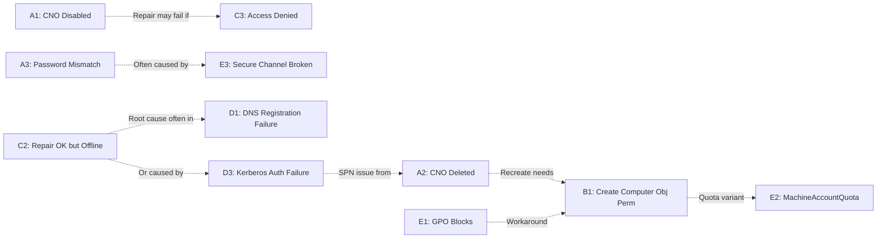
```mermaid
flowchart LR
    A1["A1: CNO Disabled"] -.->|"Repair may fail if"| C3["C3: Access Denied"]
    A2["A2: CNO Deleted"] -.->|"Recreate needs"| B1["B1: Create Computer Obj Perm"]
    A3["A3: Password Mismatch"] -.->|"Often caused by"| E3["E3: Secure Channel Broken"]
    C2["C2: Repair OK but Offline"] -.->|"Root cause often in"| D1["D1: DNS Registration Failure"]
    C2 -.->|"Or caused by"| D3["D3: Kerberos Auth Failure"]
    B1 -.->|"Quota variant"| E2["E2: MachineAccountQuota"]
    D3 -.->|"SPN issue from"| A2
    E1["E1: GPO Blocks"] -.->|"Workaround"| B1
```

> **关键关联说明：**
> - A2（CNO 被删除）重建后常触发 B1（权限不足），因为新建的 CNO 没有自动获得 OU 上的 Create Computer Objects 权限
> - C2（修复成功但仍离线）的根因往往在 D1（DNS）或 D3（Kerberos/SPN），Repair AD Object 只管 AD 层面
> - A3（密码不匹配）和 E3（安全通道断裂）经常并发，都与 AD 认证相关但排查路径不同
> - A1（CNO 被禁用）修复时如果当前账户权限不够，会变成 C3（Access Denied）

---

## 6. 参考资料 (References)

- [Configuring Cluster Accounts in Active Directory](https://learn.microsoft.com/en-us/windows-server/failover-clustering/configure-ad-accounts) — CNO/VCO 的 AD 账户配置完整指南，包含权限要求和账户维护
- [Prestage Cluster Computer Objects in AD DS](https://learn.microsoft.com/en-us/windows-server/failover-clustering/prestage-cluster-adds) — CNO 预暂存步骤详解，包含 OU 权限配置和 VCO 预创建
- [Troubleshoot Issues with Accounts Used by Failover Clusters](https://learn.microsoft.com/en-us/troubleshoot/windows-server/high-availability/troubleshoot-issues-accounts-used-failover-clusters) — CNO 密码问题、权限问题、配额问题的官方排查指南
- [Failover Cluster Domain Migration](https://learn.microsoft.com/en-us/windows-server/failover-clustering/cluster-domain-migration) — 集群跨域迁移中的 CNO 管理（Remove/New-ClusterNameAccount）
- [Create a Failover Cluster](https://learn.microsoft.com/en-us/windows-server/failover-clustering/create-failover-cluster) — 集群创建流程，包含 CNO 自动创建的前提条件
- [Recover a Failover Cluster Without Quorum](https://learn.microsoft.com/en-us/windows-server/failover-clustering/recover-failover-cluster-without-quorum) — 集群 Quorum 丢失后的强制恢复流程

---
---

# Scenario Map: Windows Cluster CNO Repair Failures

**Product/Service:** Windows Server Failover Clustering / Active Directory
**Scope:** All scenarios for Cluster Name Object (CNO) repair failures — covering CNO account issues, permission issues, repair operation failures, DNS registration issues, and domain policy restrictions
**Last Updated:** 2026-03-11

---

## 1. Scenario Overview

```mermaid
mindmap
  root((CNO Repair Failures))
    CNO Account Issues
      A1: CNO Disabled in AD
      A2: CNO Deleted from AD
      A3: CNO Password Mismatch
    Permission Issues
      B1: Missing Create Computer Objects
      B2: CNO Lacks Full Control on VCO
      B3: Wrong OU or Inherited Deny ACE
    Repair Operation Failures
      C1: Repair AD Object Greyed Out
      C2: Repair Succeeds but Name Stays Offline
      C3: Repair Fails with Access Denied
    DNS and Name Resolution
      D1: DNS A Record Registration Failure
      D2: Cluster Name Conflict in DNS or AD
      D3: Kerberos Authentication Failure
    Domain Policy and Quota
      E1: GPO Blocks Computer Account Creation
      E2: MachineAccountQuota Exceeded
      E3: Secure Channel Broken
```

---

## 2. How to Identify Your Scenario

| Symptom You See | Likely Scenario | Jump To |
|----------------|----------------|---------|
| Cluster Name offline; CNO has down-arrow icon in AD | A1: CNO Disabled | → [Scenario A1](#scenario-a1-cno-disabled-in-ad) |
| Cluster Name offline; CNO computer account not found in AD | A2: CNO Deleted | → [Scenario A2](#scenario-a2-cno-deleted-from-ad) |
| Event 1193/1194: `Logon failure: unknown user name or bad password` | A3: Password Mismatch | → [Scenario A3](#scenario-a3-cno-password-mismatch) |
| Creating new clustered role fails with "not enough permissions" | B1: Missing Create Computer Objects | → [Scenario B1](#scenario-b1-missing-create-computer-objects-permission) |
| Clustered role Network Name won't come online | B2: CNO lacks Full Control on VCO | → [Scenario B2](#scenario-b2-cno-lacks-full-control-on-vco) |
| Right-click Cluster Name → "Repair Active Directory Object" is greyed out | C1: Repair option greyed out | → [Scenario C1](#scenario-c1-repair-active-directory-object-greyed-out) |
| Repair completes without error but Cluster Name remains offline | C2: Repair OK but still offline | → [Scenario C2](#scenario-c2-repair-succeeds-but-cluster-name-stays-offline) |
| Repair fails with Access Denied | C3: Access Denied | → [Scenario C3](#scenario-c3-repair-fails-with-access-denied) |
| Cluster Name is Online but clients can't connect via cluster name | D1: DNS registration failure | → [Scenario D1](#scenario-d1-dns-a-record-registration-failure) |
| Creating cluster or repairing CNO shows "name already in use" | D2: Name conflict | → [Scenario D2](#scenario-d2-cluster-name-conflict-in-dns-or-ad) |
| Event 1129: Kerberos authentication failure | D3: Kerberos failure | → [Scenario D3](#scenario-d3-kerberos-authentication-failure) |
| Creating new role fails with "computer object could not be created" | E1/E2: GPO or quota | → [Scenario E1](#scenario-e1-gpo-blocks-computer-account-creation) |
| `Test-ComputerSecureChannel` returns False | E3: Secure Channel broken | → [Scenario E3](#scenario-e3-secure-channel-broken) |

---

## 3. Scenario Details

---

### Scenario A1: CNO Disabled in AD

**Typical Symptom:** Cluster Name resource is offline. The CNO computer account in AD Users and Computers shows a **down-arrow icon** (disabled).

**Troubleshooting Logic:**
> CNO is typically disabled by an AD admin, an automated script cleaning inactive accounts, or a domain policy. Fix: Enable account → Repair AD Object → Bring Online. Then investigate who disabled it to prevent recurrence.

**Troubleshooting Flowchart:**

```mermaid
flowchart TD
    Start["Symptom: Cluster Name Offline"] --> Check1{"Find CNO in AD<br/>Users and Computers"}
    Check1 -->|"Disabled icon"| Fix1["Enable the CNO account"]
    Fix1 --> Repair["Take Cluster Name offline<br/>→ Repair AD Object"]
    Repair --> Online["Bring Cluster Name Online"]
    Online --> Verify{"Cluster Name<br/>online successfully?"}
    Verify -->|Yes| Done["Done - Investigate who disabled it"]
    Verify -->|No| CheckPerm["Check CNO permissions<br/>→ See Scenario B1/B2"]
    Check1 -->|"Not found"| ScenA2["→ Scenario A2: CNO Deleted"]
    Check1 -->|"Enabled normally"| ScenA3["→ Scenario A3: Password Mismatch"]
```

**Key Diagnostic Commands:**

| What to Check | Command | What to Look For |
|--------------|---------|-----------------|
| CNO status | `Get-ADComputer <ClusterName> -Properties Enabled` | `Enabled` should be `True` |
| Who disabled CNO | Check AD Security audit log Event ID 4725 | Actor account and timestamp |
| Enable CNO | `Enable-ADAccount -Identity <ClusterName>$` | No error = success |

**💡 Tips:**
- **Tip 1:** A prestaged CNO is **supposed** to be disabled before cluster creation — the wizard enables it automatically. If the cluster is already running, a disabled CNO is abnormal
- **Tip 2:** Some organizations have GPOs that periodically disable inactive computer accounts. Ensure the cluster OU is **excluded** from such policies
- **⚠️ Common Mistake:** Don't attempt to force-create a new cluster name while CNO is disabled — this causes more permission chaos

**Resolution Summary:**

| Root Cause | Fix | Verification |
|-----------|-----|-------------|
| CNO manually/automatically disabled | Enable in AD → Repair AD Object → Online | `Get-ClusterResource "Cluster Name"` State = Online |
| GPO auto-disables inactive accounts | Exclude cluster OU from that GPO | Confirm GPO no longer affects that OU |

---

### Scenario A2: CNO Deleted from AD

**Typical Symptom:** Cluster Name resource offline. CNO computer account is completely missing from AD. May be found in AD Recycle Bin.

**Troubleshooting Flowchart:**

```mermaid
flowchart TD
    Start["Symptom: CNO not found in AD"] --> Check1{"AD Recycle Bin<br/>enabled?"}
    Check1 -->|Yes| Restore["Restore CNO from<br/>AD Recycle Bin"]
    Restore --> Repair["Take Cluster Name offline<br/>→ Repair AD Object"]
    Repair --> Online["Bring Cluster Name Online"]
    Check1 -->|No| Manual["Manually recreate CNO:<br/>1. Create computer account<br/>2. Disable it<br/>3. Grant permissions<br/>4. Repair AD Object"]
    Manual --> Online
    Online --> VerifyVCO{"VCOs for clustered<br/>roles also missing?"}
    VerifyVCO -->|Yes| RepairVCO["Repair each role Network Name<br/>→ Repair AD Object"]
    VerifyVCO -->|No| Done["Done"]
    RepairVCO --> Done
```

**💡 Tips:**
- **Tip 1:** After restoring, always verify the CNO's ACL is intact — the delete/restore cycle may strip permissions
- **Tip 2:** Don't forget to check VCOs (computer objects for each clustered role). They may also be deleted
- **⚠️ Common Mistake:** Restoring only the CNO while forgetting VCOs causes individual clustered role Network Names to remain offline

---

### Scenario A3: CNO Password Mismatch

**Typical Symptom:** Cluster event log shows Event 1193/1194: `Logon failure: unknown user name or bad password`. Cluster Name may intermittently go offline.

**Troubleshooting Flowchart:**

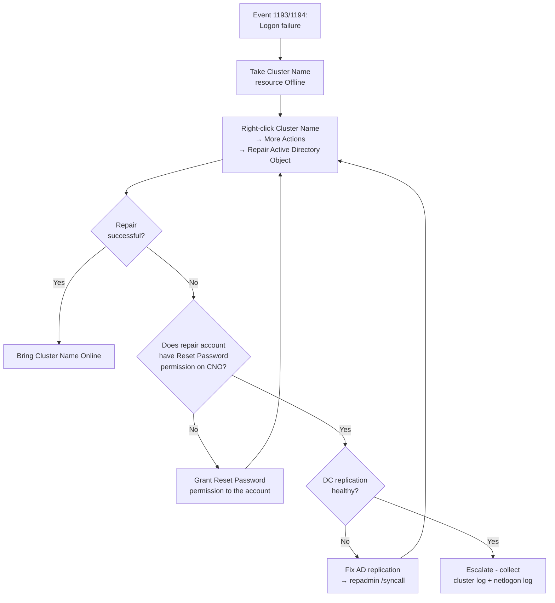
```mermaid
flowchart TD
    Start["Event 1193/1194:<br/>Logon failure"] --> TakeOff["Take Cluster Name<br/>resource Offline"]
    TakeOff --> Repair["Right-click Cluster Name<br/>→ More Actions<br/>→ Repair Active Directory Object"]
    Repair --> Result{"Repair<br/>successful?"}
    Result -->|Yes| Online["Bring Cluster Name Online"]
    Result -->|No| CheckPerm{"Does repair account<br/>have Reset Password<br/>permission on CNO?"}
    CheckPerm -->|No| GrantPerm["Grant Reset Password<br/>permission to the account"]
    GrantPerm --> Repair
    CheckPerm -->|Yes| CheckDC{"DC replication<br/>healthy?"}
    CheckDC -->|No| FixRepl["Fix AD replication<br/>→ repadmin /syncall"]
    FixRepl --> Repair
    CheckDC -->|Yes| Escalate["Escalate - collect<br/>cluster log + netlogon log"]
```

**💡 Tips:**
- **Tip 1:** The account running Repair must have **Reset Password** permission on the CNO in AD
- **Tip 2:** If AD was recently restored from backup, all cluster CNO passwords may be out of sync
- **⚠️ Common Mistake:** Never manually reset the CNO password in AD (right-click → Reset Password). This further breaks sync. Only use Failover Cluster Manager's Repair AD Object

---

### Scenario B1: Missing Create Computer Objects Permission

**Typical Symptom:** Cluster Name itself is fine, but **creating new clustered roles** fails. Error: `not enough permissions to create the network name`.

**Troubleshooting Flowchart:**

```mermaid
flowchart TD
    Start["Cannot create new<br/>clustered role"] --> FindOU["Locate CNO in AD<br/>→ Which OU?"]
    FindOU --> CheckACL{"CNO has Create<br/>Computer Objects<br/>on that OU?"}
    CheckACL -->|No| GrantACL["Grant CNO:<br/>Create Computer Objects<br/>on the OU"]
    GrantACL --> Retry["Retry creating<br/>the clustered role"]
    CheckACL -->|Yes| CheckQuota{"ms-DS-MachineAccountQuota<br/>reached?"}
    CheckQuota -->|Yes| IncQuota["Increase quota<br/>via ADSIEdit"]
    IncQuota --> Retry
    CheckQuota -->|No| CheckGPO{"GPO redirecting<br/>computer creation<br/>to another container?"}
    CheckGPO -->|Yes| FixGPO["Adjust GPO or grant<br/>CNO perms on target container"]
    CheckGPO -->|No| Escalate["Check deny ACEs<br/>on OU hierarchy"]
    Retry --> Done["Done"]
```

**💡 Tips:**
- **Tip 1:** If CNO is in the default Computers container, up to 10 VCOs can be created without extra permissions. In a custom OU, explicit authorization is required
- **Tip 2:** When granting permissions, ensure "Applies to" is set to **This object and all descendant objects**

---

### Scenario B2: CNO Lacks Full Control on VCO

**Typical Symptom:** A clustered role's Network Name resource fails to come online. The VCO exists in AD but CNO doesn't have Full Control.

**Resolution:** In ADUC → VCO Properties → Security Tab → Add CNO → Grant Full Control → Bring Network Name Online.

---

### Scenario C1: Repair Active Directory Object Greyed Out

**Typical Symptom:** Right-click Cluster Name → More Actions → "Repair Active Directory Object" is **greyed out / not clickable**.

**Troubleshooting Flowchart:**

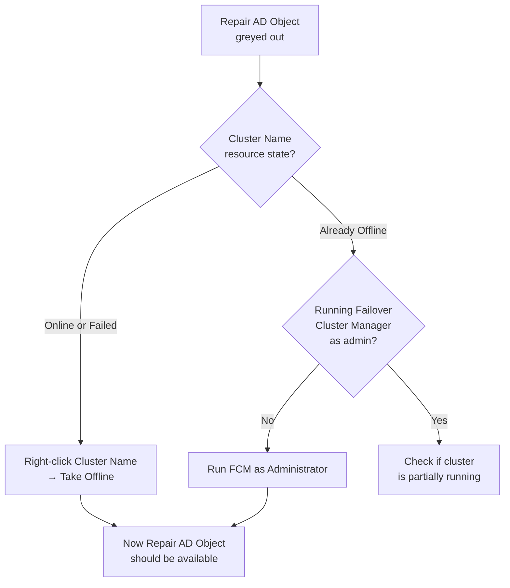
```mermaid
flowchart TD
    Start["Repair AD Object<br/>greyed out"] --> Check1{"Cluster Name<br/>resource state?"}
    Check1 -->|"Online or Failed"| TakeOff["Right-click Cluster Name<br/>→ Take Offline"]
    TakeOff --> Repair["Now Repair AD Object<br/>should be available"]
    Check1 -->|"Already Offline"| Check2{"Running Failover<br/>Cluster Manager<br/>as admin?"}
    Check2 -->|No| RunAdmin["Run FCM as Administrator"]
    RunAdmin --> Repair
    Check2 -->|Yes| Escalate["Check if cluster<br/>is partially running"]
```

**💡 Tips:**
- **Tip 1:** Taking Cluster Name offline does NOT affect other cluster groups (SQL FCI, Hyper-V VMs, etc.) — they don't depend on it
- **Tip 2:** If Take Offline itself fails, try `Stop-ClusterResource "Cluster Name" -Force`
- **⚠️ Common Mistake:** 99% of the time, the Repair option is greyed out simply because the resource hasn't been taken offline first — it's not a permission issue

---

### Scenario C2: Repair Succeeds but Cluster Name Stays Offline

**Typical Symptom:** Repair AD Object completes without error, but Bring Online results in Cluster Name still in Failed state.

**Troubleshooting Flowchart:**

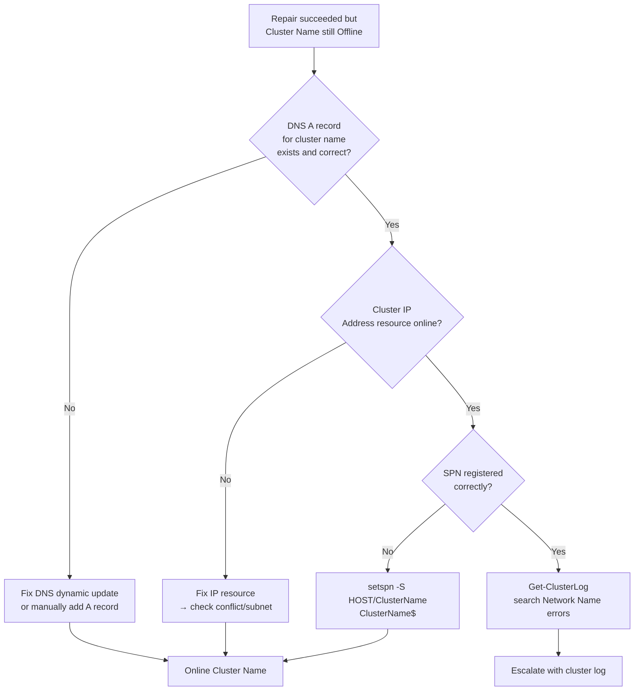
```mermaid
flowchart TD
    Start["Repair succeeded but<br/>Cluster Name still Offline"] --> CheckDNS{"DNS A record<br/>for cluster name<br/>exists and correct?"}
    CheckDNS -->|No| FixDNS["Fix DNS dynamic update<br/>or manually add A record"]
    CheckDNS -->|Yes| CheckIP{"Cluster IP<br/>Address resource online?"}
    CheckIP -->|No| FixIP["Fix IP resource<br/>→ check conflict/subnet"]
    CheckIP -->|Yes| CheckSPN{"SPN registered<br/>correctly?"}
    CheckSPN -->|No| FixSPN["setspn -S HOST/ClusterName<br/>ClusterName$"]
    CheckSPN -->|Yes| CheckLog["Get-ClusterLog<br/>search Network Name errors"]
    FixDNS --> Retry["Online Cluster Name"]
    FixIP --> Retry
    FixSPN --> Retry
    CheckLog --> Escalate["Escalate with cluster log"]
```

**💡 Tips:**
- **Tip 1:** Cluster Name resource depends on the IP Address resource. If IP is not online, Name can never come online. Always check the dependency chain first
- **Tip 2:** Search for `[RES] Network Name` in the cluster log for the specific error

---

### Scenario C3: Repair Fails with Access Denied

**Resolution:** Use a Domain Admin account, or grant the current account **Reset Password** and **Write** permissions on the CNO in AD.

---

### Scenario D1: DNS A Record Registration Failure

**Typical Symptom:** Cluster Name shows Online but clients can't connect. `nslookup <ClusterName>` fails or returns wrong IP.

**Troubleshooting Flowchart:**

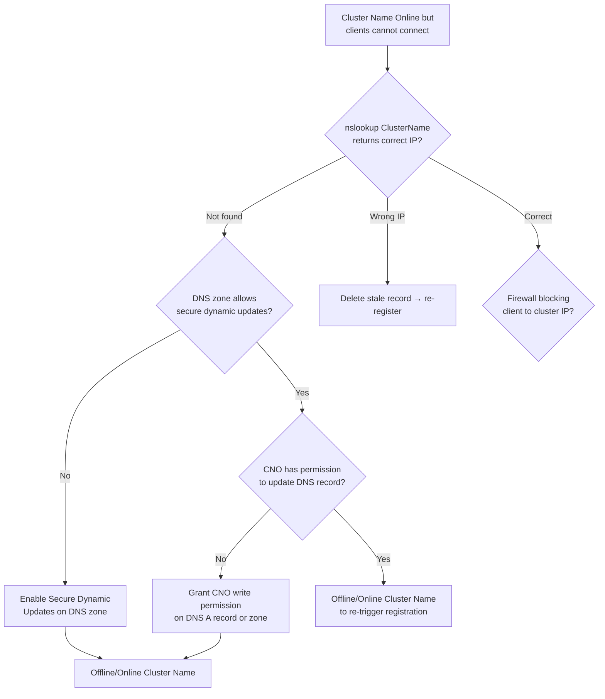
```mermaid
flowchart TD
    Start["Cluster Name Online but<br/>clients cannot connect"] --> DNS1{"nslookup ClusterName<br/>returns correct IP?"}
    DNS1 -->|"Not found"| Check2{"DNS zone allows<br/>secure dynamic updates?"}
    Check2 -->|No| FixZone["Enable Secure Dynamic<br/>Updates on DNS zone"]
    Check2 -->|Yes| Check3{"CNO has permission<br/>to update DNS record?"}
    Check3 -->|No| FixPerm["Grant CNO write permission<br/>on DNS A record or zone"]
    Check3 -->|Yes| ManualReg["Offline/Online Cluster Name<br/>to re-trigger registration"]
    DNS1 -->|"Wrong IP"| Stale["Delete stale record → re-register"]
    DNS1 -->|"Correct"| CheckFW{"Firewall blocking<br/>client to cluster IP?"}
    FixZone --> Retry["Offline/Online Cluster Name"]
    FixPerm --> Retry
```

**💡 Tips:**
- **Tip 1:** Cluster DNS registration uses the CNO's identity for secure dynamic updates. If the record was originally created by another account, CNO may lack update permissions

---

### Scenario D2: Cluster Name Conflict in DNS or AD

**Resolution:** Delete or rename the conflicting computer object in AD, and remove stale DNS records.

---

### Scenario D3: Kerberos Authentication Failure

**Key Diagnostic Commands:**

| What to Check | Command | What to Look For |
|--------------|---------|-----------------|
| SPN list | `setspn -L <ClusterName>$` | Must have `HOST/<ClusterName>` entries |
| Duplicate SPNs | `setspn -X -P` | No duplicate HOST SPNs |
| Time skew | `w32tm /query /status` | Less than 5 minutes from DC |

---

### Scenario E1: GPO Blocks Computer Account Creation

**Resolution:** Grant CNO Create Computer Objects on the target OU, or prestage VCOs manually.

---

### Scenario E2: MachineAccountQuota Exceeded

**Resolution:** Increase `ms-DS-MachineAccountQuota` via ADSIEdit on the domain object (default is 10).

---

### Scenario E3: Secure Channel Broken

**Troubleshooting Flowchart:**

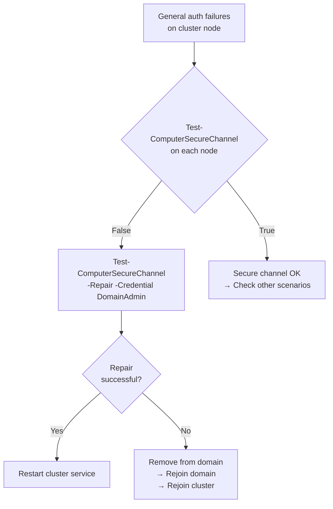
```mermaid
flowchart TD
    Start["General auth failures<br/>on cluster node"] --> Test{"Test-ComputerSecureChannel<br/>on each node"}
    Test -->|"False"| Repair["Test-ComputerSecureChannel<br/>-Repair -Credential DomainAdmin"]
    Test -->|"True"| NotThis["Secure channel OK<br/>→ Check other scenarios"]
    Repair --> Result{"Repair<br/>successful?"}
    Result -->|Yes| Restart["Restart cluster service"]
    Result -->|No| Rejoin["Remove from domain<br/>→ Rejoin domain<br/>→ Rejoin cluster"]
```

---

## 4. Universal Toolkit

### Cluster Diagnostics

| Purpose | Command/Tool | Notes |
|---------|-------------|-------|
| Generate cluster log | `Get-ClusterLog -Destination C:\temp -TimeSpan 60` | Last 60 minutes detailed log |
| Cluster validation | `Test-Cluster -Node Node1,Node2` | Full configuration validation |
| View all resource states | `Get-ClusterResource \| Format-Table Name, State, ResourceType` | Quickly spot offline resources |
| Cluster events | `Get-WinEvent -LogName "Microsoft-Windows-FailoverClustering/Operational" -MaxEvents 50` | Recent 50 cluster events |

### Active Directory Diagnostics

| Purpose | Command/Tool | Notes |
|---------|-------------|-------|
| CNO details | `Get-ADComputer <ClusterName> -Properties *` | Enabled, PasswordLastSet, SPN, etc. |
| CNO ACL | `(Get-Acl "AD:\CN=<ClusterName>,<OU-DN>").Access` | Check permission entries |
| SPN check | `setspn -L <ClusterName>$` | List all registered SPNs |
| Duplicate SPN check | `setspn -X -P` | Domain-wide SPN duplicate detection |
| AD replication | `repadmin /replsummary` | Confirm DC replication health |

### DNS Diagnostics

| Purpose | Command/Tool | Notes |
|---------|-------------|-------|
| Forward lookup | `Resolve-DnsName <ClusterName> -Server <DC_IP>` | Verify DNS A record |
| Reverse lookup | `Resolve-DnsName <ClusterIP> -Server <DC_IP>` | Verify PTR record |
| DNS record permissions | DNS Manager → Record → Properties → Security | CNO needs write permission |

---

## 5. Cross-Scenario Relationships

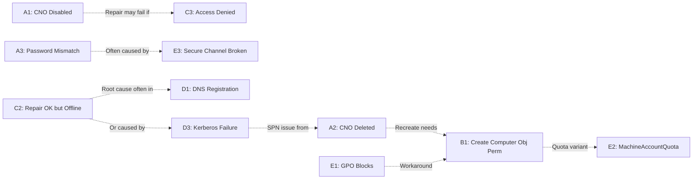
```mermaid
flowchart LR
    A1["A1: CNO Disabled"] -.->|"Repair may fail if"| C3["C3: Access Denied"]
    A2["A2: CNO Deleted"] -.->|"Recreate needs"| B1["B1: Create Computer Obj Perm"]
    A3["A3: Password Mismatch"] -.->|"Often caused by"| E3["E3: Secure Channel Broken"]
    C2["C2: Repair OK but Offline"] -.->|"Root cause often in"| D1["D1: DNS Registration"]
    C2 -.->|"Or caused by"| D3["D3: Kerberos Failure"]
    B1 -.->|"Quota variant"| E2["E2: MachineAccountQuota"]
    D3 -.->|"SPN issue from"| A2
    E1["E1: GPO Blocks"] -.->|"Workaround"| B1
```

> **Key relationships:**
> - A2 (CNO Deleted) → after recreating, often triggers B1 (permissions missing) because the new CNO doesn't auto-inherit Create Computer Objects
> - C2 (Repair OK but offline) → root cause is usually D1 (DNS) or D3 (Kerberos/SPN). Repair AD Object only fixes the AD layer
> - A3 (Password Mismatch) and E3 (Secure Channel Broken) frequently co-occur — both are AD authentication issues but different troubleshooting paths
> - A1 (CNO Disabled) + insufficient repair account permissions → cascades into C3 (Access Denied)

---

## 6. References

- [Configuring Cluster Accounts in Active Directory](https://learn.microsoft.com/en-us/windows-server/failover-clustering/configure-ad-accounts) — Complete guide for CNO/VCO AD account configuration, permission requirements, and account maintenance
- [Prestage Cluster Computer Objects in AD DS](https://learn.microsoft.com/en-us/windows-server/failover-clustering/prestage-cluster-adds) — Step-by-step CNO prestaging, OU permission setup, and VCO pre-creation
- [Troubleshoot Issues with Accounts Used by Failover Clusters](https://learn.microsoft.com/en-us/troubleshoot/windows-server/high-availability/troubleshoot-issues-accounts-used-failover-clusters) — Official troubleshooting for CNO password, permission, and quota issues
- [Failover Cluster Domain Migration](https://learn.microsoft.com/en-us/windows-server/failover-clustering/cluster-domain-migration) — CNO management during cross-domain migration (Remove/New-ClusterNameAccount)
- [Create a Failover Cluster](https://learn.microsoft.com/en-us/windows-server/failover-clustering/create-failover-cluster) — Cluster creation process including CNO auto-creation prerequisites
- [Recover a Failover Cluster Without Quorum](https://learn.microsoft.com/en-us/windows-server/failover-clustering/recover-failover-cluster-without-quorum) — Force recovery procedures when quorum is lost
