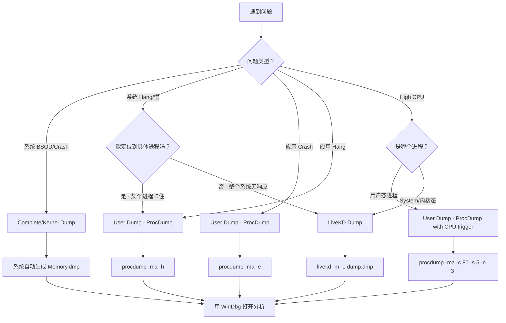
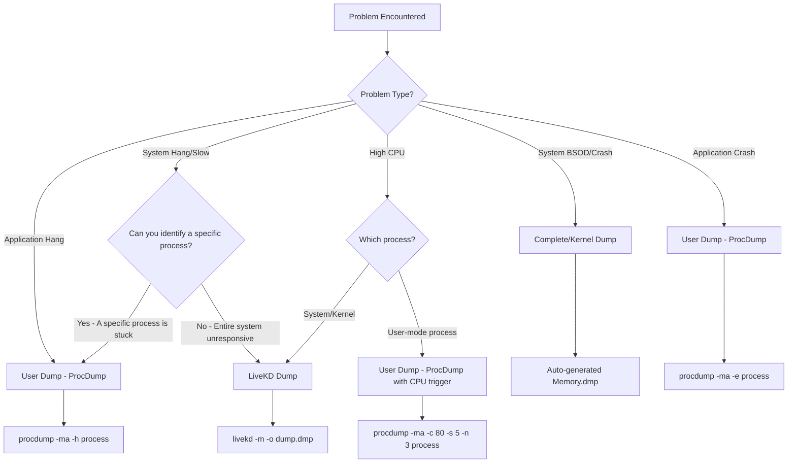

# Deep Dive: Dump 抓取方式与场景分析实战指南

**Topic:** Windows Dump 抓取方法、类型对比与场景化 WinDbg 分析  
**Category:** Debugging  
**Level:** 中级 / Intermediate  
**Last Updated:** 2026-03-13

---

## 中文版

---

### 1. 概述 (Overview)

在 Windows 平台排查系统/应用问题时，"抓 dump → 用 WinDbg 分析" 是最核心的技能之一。但不同问题场景（Crash、Hang、High CPU）需要抓取不同类型的 dump，用不同的方式去捕获，用不同的 WinDbg 命令去分析。

本文从 **Support Engineer 实战视角** 出发，系统梳理三大类 dump 的抓取方法（LiveKD Dump、User Dump、Complete/Kernel Dump），详细对比它们的区别，并针对 **机器 Hang、系统 Crash（BSOD）、High CPU** 三大常见场景，给出"抓什么 dump → 怎么抓 → 怎么用 WinDbg 分析"的完整指南。

---

### 2. 核心概念 (Core Concepts)

#### 2.1 三大 Dump 类型概览

| 维度 | LiveKD Dump | User Dump | Complete/Kernel Dump |
|------|-------------|-----------|---------------------|
| **抓取目标** | 整个 OS 内核内存（活系统快照） | 单个用户态进程 | 系统 Crash 时的完整/内核内存 |
| **抓取时机** | 系统运行时，不需要 Crash | 进程运行时，不需要 Crash | 系统 BSOD 时自动生成 |
| **是否中断系统** | 否（创建内存快照） | 否（进程短暂挂起） | 是（系统已经崩溃） |
| **文件大小** | 与物理内存相当（GB 级别） | 几十 MB 到几 GB | 与物理内存相当 |
| **典型工具** | LiveKD.exe (Sysinternals) | ProcDump / Task Manager | 系统自动生成 / NotMyFault |
| **适用场景** | 内核层 Hang、驱动问题、Dead Lock | 应用 Crash、应用 Hang、应用 High CPU | BSOD、内核 Crash |
| **打开方式** | WinDbg 内核模式调试 | WinDbg 用户模式调试 | WinDbg 内核模式调试 |

#### 2.2 LiveKD Dump — 活系统内核快照

**什么是 LiveKD：** Sysinternals 工具，能在 **不崩溃、不重启** 系统的前提下，创建一个内核内存的"快照" dump 文件。本质上它加载一个临时驱动 `LIVEKDD.SYS`，把当前内核内存状态冻结并写入文件。

**核心特点：**
- 系统不需要 Crash，持续运行
- 捕获的是某一瞬间的内核状态（非完全一致性快照，但 `-m` mirror dump 模式可提高一致性）
- 可以用所有内核调试命令分析（`!process`、`!thread`、`!locks` 等）
- 非常适合排查 **系统 Hang**（系统还活着但很慢或无响应）

**两种模式：**

| 模式 | 命令参数 | 说明 |
|------|---------|------|
| **标准模式** | `livekd -w` 或 `livekd -o dump.dmp` | 创建普通内核 dump，可能有少量不一致 |
| **Mirror 模式** | `livekd -m -o dump.dmp` | 创建 mirror dump，一致性更高，但需要更多空闲物理内存 |

#### 2.3 User Dump — 用户态进程快照

**什么是 User Dump：** 捕获单个用户态进程的内存和状态信息。常用 **ProcDump** 工具或 **Task Manager** 来抓取。

**ProcDump 的 Dump 类型：**

| 参数 | 类型 | 内容 | 大小 |
|------|------|------|------|
| `-mm` | Mini Dump（默认） | 线程栈 + 直接引用的内存 + 元数据 | 最小 |
| `-ma` | Full Dump | 全部内存（Image + Mapped + Private） | 最大 |
| `-mp` | MiniPlus Dump | 所有 Private 内存 + R/W Image/Mapped | Full 的 10%-75% |
| `-mk` | + Kernel Dump | 额外生成包含进程内核栈的 dump | 配合其他参数使用 |

> **实战建议：** 绝大多数场景用 `-ma`（Full Dump）。只有磁盘空间非常紧张时才考虑 `-mp` 或 `-mm`。

#### 2.4 Complete / Kernel Dump — 系统崩溃 Dump

**触发条件：** 系统发生 BSOD（Bug Check / Stop Error）时自动生成。

| 类型 | 注册表值 | 内容 | Page File 要求 |
|------|---------|------|----------------|
| **Complete Memory Dump** | `CrashDumpEnabled = 0x1` | 全部物理内存 | ≥ 物理内存 + 1 MB |
| **Kernel Memory Dump** | `CrashDumpEnabled = 0x2` | 仅内核内存（不含用户态） | 通常 < 物理内存的 1/3 |
| **Small Memory Dump** | `CrashDumpEnabled = 0x3` | 仅 64 KB | 最小 |
| **Automatic Memory Dump** | `CrashDumpEnabled = 0x7` | 同 Kernel，但自动管理 Page File | 自动 |
| **Active Memory Dump** | `CrashDumpEnabled = 0x1` + `FilterPages = 0x1` | 排除不相关的页 | 小于 Complete |

**注册表位置：** `HKLM\System\CurrentControlSet\Control\CrashControl`

**推荐配置：**
- RAM ≤ 32 GB → **Complete Memory Dump**（`CrashDumpEnabled = 0x1`），Page File = RAM + 300 MB
- RAM > 32 GB → **Automatic Memory Dump**（`CrashDumpEnabled = 0x7`），Page File = System Managed

---

### 3. 工作原理 (How It Works)

#### 3.1 场景与 Dump 选型决策流程



#### 3.2 抓取 LiveKD Dump 的详细步骤

**前提条件：**
1. 下载 [LiveKD](https://learn.microsoft.com/sysinternals/downloads/livekd)（解压到如 `C:\Tools\LiveKD\`）
2. 安装 [Debugging Tools for Windows](https://learn.microsoft.com/windows-hardware/drivers/debugger/)（WinDbg）
3. 管理员权限

**抓取命令：**

```powershell
# 方法 1: 直接保存 dump 文件（推荐用于收集 dump 发给工程师）
livekd.exe -m -o C:\dumps\livekd.dmp

# 方法 2: 用 WinDbg 实时查看（适合自己在现场调试）
livekd.exe -w

# 方法 3: 指定调试器路径
livekd.exe -k "C:\Program Files (x86)\Windows Kits\10\Debuggers\x64\kd.exe" -m -o C:\dumps\livekd.dmp

# 方法 4: 使用 Windows 原生 Live Dump（Win 8.1+）
livekd.exe -ml -o C:\dumps\livekd_native.dmp
```

**关键参数说明：**
- `-m`：Mirror dump 模式，创建一致性更好的快照，**推荐使用**
- `-o <filename>`：输出到文件而不是打开调试器
- `-w`：用 WinDbg 打开（而非默认的 kd.exe）
- `-ml`：使用 Windows 原生 Live Dump 机制（Win 8.1+）

> ⚠️ **注意：** LiveKD 需要足够的物理内存来创建 mirror dump。如果系统内存压力很大，mirror dump 可能失败，可以去掉 `-m` 参数使用标准模式。

#### 3.3 抓取 User Dump 的详细步骤

**工具：ProcDump（推荐）**

下载：[ProcDump](https://learn.microsoft.com/sysinternals/downloads/procdump)

**场景化抓取命令：**

```powershell
# === 应用 Crash（捕获异常时的 dump）===
# 捕获未处理异常时的 Full dump
procdump -ma -e w3wp.exe

# 捕获第一次机会异常（first chance exception）
procdump -ma -e 1 w3wp.exe

# 只捕获包含特定关键字的异常
procdump -ma -e 1 -f "OutOfMemory" w3wp.exe

# === 应用 Hang（进程无响应）===
# 窗口无响应超过 5 秒时自动抓取
procdump -ma -h myapp.exe

# 手动立即抓取一个 Full dump（进程还活着但你怀疑它 hang 了）
procdump -ma <PID>

# 连续抓取 3 个 dump，间隔 10 秒（用于对比分析）
procdump -ma -n 3 -s 10 <PID>

# === High CPU ===
# CPU 超过 80% 持续 5 秒时抓取，共抓 3 个
procdump -ma -c 80 -s 5 -n 3 myapp.exe

# CPU 超过 90% 时立即抓取（单核计算）
procdump -ma -c 90 -u myapp.exe

# 基于 Performance Counter 触发
procdump -ma myapp.exe -p "\Process(myapp)\% Processor Time" 200
```

**用 Task Manager 抓取（简单但不够灵活）：**
1. 打开 Task Manager → Processes 或 Details
2. 右键目标进程 → **Create dump file**
3. dump 文件保存在 `%LOCALAPPDATA%\Temp\`

> **实战建议：** Hang 场景建议抓 **2-3 个 dump，间隔 10-30 秒**。通过对比多个 dump 中相同线程的调用栈，判断线程是否真的卡住（栈没变化 = 真 Hang）。

#### 3.4 抓取 Complete/Kernel Dump 的详细步骤

**方法 1：配置系统在 BSOD 时自动生成（最常见）**

```powershell
# 查看当前配置
Get-ItemProperty "HKLM:\System\CurrentControlSet\Control\CrashControl"

# 配置为 Complete Memory Dump（RAM ≤ 32GB 推荐）
Set-ItemProperty "HKLM:\System\CurrentControlSet\Control\CrashControl" -Name CrashDumpEnabled -Value 1

# 配置为 Automatic Memory Dump（RAM > 32GB 推荐）
Set-ItemProperty "HKLM:\System\CurrentControlSet\Control\CrashControl" -Name CrashDumpEnabled -Value 7

# 确保 Page File 足够大（Complete dump 需要 ≥ RAM + 1MB）
# GUI: System Properties → Advanced → Performance → Settings → Advanced → Virtual Memory

# 需要重启生效
Restart-Computer
```

**方法 2：用 NotMyFault 手动触发 Crash（测试/紧急情况）**

```powershell
# 下载 NotMyFault: https://learn.microsoft.com/sysinternals/downloads/notmyfault
notmyfaultc64.exe /crash 0x01
```

**方法 3：键盘触发 Crash（需预先配置）**

```powershell
# 启用键盘触发（USB 键盘）
Set-ItemProperty "HKLM:\System\CurrentControlSet\Control\CrashControl" -Name CrashOnCtrlScroll -Value 1
# PS/2 键盘则设置对应注册表
# 重启后，按住右 Ctrl 键并按 Scroll Lock 两次即可触发 BSOD
```

**方法 4：NMI 触发（服务器 iLO/iDRAC/IPMI）**

需要先启用 NMI Crash Dump：
```powershell
New-ItemProperty "HKLM:\System\CurrentControlSet\Control\CrashControl" -Name NMICrashDump -Value 1 -PropertyType DWord -Force
# 重启后，通过 BMC 管理界面发送 NMI 即可触发 BSOD 并生成 dump
```

**Dump 文件位置：**
- Complete/Kernel/Automatic dump：`%SystemRoot%\Memory.dmp`
- Small dump：`%SystemRoot%\Minidump\MMDDYY-01.dmp`

---

### 4. 场景化 WinDbg 分析指南

#### 4.1 场景一：系统 Crash (BSOD) 分析

**抓什么 dump：** Complete Memory Dump 或 Automatic Memory Dump  
**Dump 来源：** `C:\Windows\Memory.dmp`（系统自动生成）

**WinDbg 分析步骤：**

```
步骤 1: 打开 dump
  File → Open Crash Dump → 选择 Memory.dmp

步骤 2: 自动分析（最重要的一步）
  0: kd> !analyze -v
  
  输出关键信息：
  - BUGCHECK_CODE: Bug Check 代码（如 0x9F = DRIVER_POWER_STATE_FAILURE）
  - BUGCHECK_P1~P4: Bug Check 参数
  - FAULTING_MODULE: 出错的模块
  - DEFAULT_BUCKET_ID: 分类
  - STACK_TEXT: 崩溃时的调用栈 ← 最关键！
  - IMAGE_NAME: 可能导致问题的驱动/模块名

步骤 3: 查看 Bug Check 详情
  0: kd> .bugcheck

步骤 4: 查看崩溃时的调用栈
  0: kd> k           ; 当前线程栈
  0: kd> kv          ; 带参数的栈
  0: kd> kf          ; 带帧大小的栈

步骤 5: 分析问题模块
  0: kd> lm vm <module_name>    ; 查看模块详细信息（版本、时间戳）
  0: kd> !lmi <module_name>     ; 更详细的模块信息

步骤 6: 查看系统信息
  0: kd> vertarget              ; 系统版本
  0: kd> !sysinfo machineid     ; 机器信息

步骤 7: 如果是驱动问题
  0: kd> !devstack <device>     ; 设备栈
  0: kd> !drvobj <driver> 7     ; 驱动对象详情
  0: kd> !irpfind               ; 查找 pending IRP
```

**实战解读 !analyze -v 输出示例：**

```
DRIVER_IRQL_NOT_LESS_OR_EQUAL (d1)     ← Bug Check 名称
An attempt was made to access a pageable (or completely invalid) 
address at an interrupt request level (IRQL) that is too high.
Arguments:
Arg1: fffff80012345678, memory referenced     ← 访问的地址
Arg2: 0000000000000002, IRQL               ← 当前 IRQL
Arg3: 0000000000000000, value 0=read, 1=write
Arg4: fffff80087654321, address which referenced memory

STACK_TEXT:
nt!KeBugCheckEx
nt!KiBugCheckDispatch
nt!KiPageFault
thirdparty_driver!SomeFunction+0x1a3    ← 问题在这里！
nt!IofCallDriver
```

> **排查思路：** 从 STACK_TEXT 自下而上找到第一个非 `nt!` 的模块，通常就是问题根因。用 `lm vm <module>` 查看版本，建议客户更新到最新版本。

#### 4.2 场景二：系统 Hang 分析

**抓什么 dump：** LiveKD Dump  
**为什么不抓 User Dump：** 系统级 Hang 可能涉及内核态死锁、驱动问题、DPC 风暴等，用户态 dump 看不到这些信息。

**抓取命令：**
```powershell
# 抓 2 个 dump，间隔 30 秒（用于对比）
livekd.exe -m -o C:\dumps\hang1.dmp
# 等待 30 秒
livekd.exe -m -o C:\dumps\hang2.dmp
```

**WinDbg 分析步骤：**

```
步骤 1: 打开 dump 并自动分析
  0: kd> !analyze -v -hang    ; 用 -hang 参数提示分析器这是 Hang 场景

步骤 2: 检查死锁（最常见的 Hang 原因）
  0: kd> !locks               ; 查看所有内核锁的持有/等待情况
  0: kd> !locks -v            ; 详细信息

  输出示例：
  Resource @ 0xfffff80012345678    Exclusively owned
    Contention Count = 15         ← 有 15 个线程在等这把锁
    Threads: fffff80087654321-01<*>  ← 谁持有
             fffff80087654322-01     ← 谁在等
             fffff80087654323-01     ← 谁在等

步骤 3: 查看所有进程状态
  0: kd> !process 0 0         ; 列出所有进程概况
  0: kd> !process 0 7         ; 列出所有进程的全部线程栈（大量输出）

步骤 4: 检查特定进程的线程
  0: kd> !process <EPROCESS> 7
  0: kd> !thread <ETHREAD>    ; 查看特定线程的详细栈

步骤 5: 检查 DPC 和中断
  0: kd> !dpcs                ; 查看 DPC 队列
  0: kd> !irql                ; 当前 IRQL

步骤 6: 检查等待链
  0: kd> !waitchain           ; 查看线程等待链（Win 7+）
  0: kd> !ready               ; 查看就绪队列中的线程

步骤 7: 对比两个 dump
  分别打开 hang1.dmp 和 hang2.dmp，比较同一线程的调用栈
  如果 30 秒后栈完全一样 = 线程确实 Hang 了
  找到 Hang 住的线程 → 看它在等什么 → 找到根因
```

**常见 Hang 根因模式：**

| 模式 | WinDbg 表现 | 根因 |
|------|------------|------|
| 死锁 (Deadlock) | `!locks` 显示循环等待 | 两个或多个线程互相持有并等待对方的锁 |
| DPC 风暴 | `!dpcs` 显示大量排队的 DPC | 驱动在 DPC 级别做了太多工作 |
| 资源耗尽 | `!vm` 显示内存耗尽、Pool 耗尽 | NonPaged Pool 或 Paged Pool 用尽 |
| I/O 卡住 | `!irpfind` 显示长时间 pending 的 IRP | 存储/网络驱动没有完成 I/O |

#### 4.3 场景三：High CPU 分析

**抓什么 dump：** 取决于哪个进程 CPU 高

| 情况 | 推荐 dump 类型 | 抓取命令 |
|------|---------------|---------|
| **某个用户态进程** CPU 高 | User Dump (ProcDump) | `procdump -ma -c 80 -s 5 -n 3 <process>` |
| **System 进程** CPU 高 | LiveKD Dump | `livekd -m -o dump.dmp` |
| **Interrupts/DPCs** CPU 高 | LiveKD Dump | `livekd -m -o dump.dmp` |
| **不确定哪个进程** | 先 Task Manager 确认 → 再选对应方式 | — |

##### 4.3.1 用户态进程 High CPU — ProcDump + WinDbg

**抓取：**
```powershell
# 当 w3wp.exe CPU > 80% 持续 5 秒时抓 dump，共抓 3 个
procdump -ma -c 80 -s 5 -n 3 w3wp.exe C:\dumps\

# 加 -mk 额外生成内核栈 dump（可选，帮助看到完整上下文）
procdump -ma -mk -c 80 -s 5 -n 3 w3wp.exe C:\dumps\
```

**WinDbg 分析步骤：**

```
步骤 1: 打开 dump
  File → Open Crash Dump → 选择 .dmp 文件

步骤 2: 配置符号
  0:000> .sympath srv*C:\Symbols*https://msdl.microsoft.com/download/symbols
  0:000> .reload

步骤 3: 查看线程 CPU 时间（最关键的命令！）
  0:000> !runaway 7
  
  输出示例：
  User Mode Time
    Thread       Time
     12:1234      0 days 0:15:32.456    ← 这个线程消耗了 15 分钟 CPU！
      3:5678      0 days 0:00:12.789
      5:9abc      0 days 0:00:01.234
  
  Kernel Mode Time
    Thread       Time
     12:1234      0 days 0:03:21.000    ← 同一个线程在内核态也消耗了 3 分钟
  
  Elapsed Time  
    Thread       Time
     12:1234      0 days 1:25:00.000    ← 总运行时间 1 小时 25 分钟

步骤 4: 切换到 CPU 消耗最高的线程
  0:000> ~12s          ; 切换到线程 12

步骤 5: 查看该线程的调用栈
  0:012> k             ; 调用栈
  0:012> kv            ; 带参数
  0:012> kP            ; 带完整参数类型

步骤 6: 分析调用栈
  看栈中哪个函数在做大量计算/循环：
  - 如果看到递归调用 → 可能是无限递归
  - 如果看到某个 while/for 循环的函数 → 可能是死循环
  - 如果看到 GC 相关函数 → 可能是 .NET GC 压力
  - 如果看到加密/压缩函数 → 可能是正常但需要优化

步骤 7: 如果是 .NET 进程
  0:012> .loadby sos clr        ; 加载 .NET 调试扩展
  0:012> !clrstack              ; .NET 调用栈
  0:012> !clrstack -a           ; 带参数
  0:012> !threads               ; 所有 .NET 线程
  0:012> !gcroot <address>      ; GC 根分析
  0:012> !dumpheap -stat        ; 堆统计

步骤 8: 对比多个 dump
  打开 3 个 dump，分别查看同一线程（通过 Thread ID 匹配）的调用栈
  如果三个 dump 中栈相同或在同一函数循环 → 确认是 CPU 热点
```

##### 4.3.2 System/内核态 High CPU — LiveKD + WinDbg

**抓取：**
```powershell
livekd.exe -m -o C:\dumps\highcpu_kernel.dmp
```

**WinDbg 分析步骤：**

```
步骤 1: 打开 dump 并查看 CPU 信息
  0: kd> !cpuinfo
  0: kd> !running -it         ; 查看每个 CPU 上正在运行的线程

步骤 2: 查看哪个进程 CPU 高
  0: kd> !process 0 0          ; 列出所有进程 — 看 UserTime 和 KernelTime

步骤 3: 查看高 CPU 进程的线程
  0: kd> !process <EPROCESS> 7 ; 展开目标进程的所有线程栈

步骤 4: 检查 DPC/ISR（如果是 Interrupts 高）
  0: kd> !dpcs                  ; DPC 队列
  0: kd> !isr                   ; 中断服务例程
  0: kd> !dpcwatchdog            ; DPC 看门狗信息

步骤 5: 分析问题驱动
  从线程栈中找到消耗 CPU 的驱动模块
  0: kd> lm vm <driver_name>   ; 查看驱动版本信息
```

---

### 5. 关键配置与参数 (Key Configurations)

| 配置项 | 默认值 | 说明 | 常见调优场景 |
|--------|--------|------|-------------|
| `CrashDumpEnabled` | 7 (Automatic) | 控制 Crash dump 类型 | RAM ≤ 32GB 改为 1（Complete） |
| `DumpFile` | `%SystemRoot%\Memory.dmp` | Dump 文件路径 | 系统盘空间不足时改到其他盘 |
| `MinidumpDir` | `%SystemRoot%\Minidump` | Small dump 目录 | — |
| `AutoReboot` | 1 | BSOD 后自动重启 | 需要看蓝屏信息时设为 0 |
| `Overwrite` | 1 | 覆盖已有 dump | 需要保留历史 dump 时设为 0 |
| `NMICrashDump` | 0 | NMI 触发 crash dump | 远程管理触发 dump 时设为 1 |
| `CrashOnCtrlScroll` | 0 | 键盘触发 crash dump | 物理机调试时设为 1 |
| `AlwaysKeepMemoryDump` | 0 | 磁盘空间低时保留 dump | 关键调试时设为 1 |
| `FullLiveReportsMax` | 1 | LiveKD full dump 最大数量 | 需要多次 live dump 时增大 |
| `_NT_SYMBOL_PATH` | 未设置 | 符号路径环境变量 | 设为 `srv*C:\Symbols*https://msdl.microsoft.com/download/symbols` |

---

### 6. 常见问题与排查 (Common Issues & Troubleshooting)

#### 问题 A: LiveKD Mirror Dump 失败

- **症状**：`livekd -m -o dump.dmp` 报错或生成 0 字节文件
- **可能原因**：物理内存不足以创建 mirror dump
- **排查思路**：
  1. 检查 Available Physical Memory（Task Manager → Performance → Memory）
  2. Mirror dump 需要与内核内存相当的空闲物理内存
- **解决方案**：去掉 `-m` 参数使用标准模式：`livekd -o dump.dmp`

#### 问题 B: ProcDump CPU 触发器不触发

- **症状**：`procdump -c 80 -s 5 myapp.exe` 一直等待，不生成 dump
- **可能原因**：
  1. CPU 高峰是瞬间的，不满足持续 5 秒的条件
  2. 多核系统中进程 CPU 显示 200%+，但 `-c` 默认基于总 CPU
- **排查思路**：
  1. 缩短 `-s` 参数（如 `-s 1`）
  2. 添加 `-u` 参数使用单核计算：`procdump -ma -c 50 -u -s 3 myapp.exe`

#### 问题 C: BSOD 后没有生成 Memory.dmp

- **症状**：系统 BSOD 重启后 `C:\Windows\Memory.dmp` 不存在
- **可能原因**：
  1. Page File 太小或不在系统盘
  2. 磁盘空间不足
  3. CrashDumpEnabled 设为 0（禁用）
- **排查思路**：
  1. 检查 `CrashDumpEnabled` 注册表值
  2. 确认 Page File 在 C: 盘且足够大
  3. 确认 C: 盘剩余空间 > 物理内存大小
  4. 检查 Event Log → System → 搜索 "SaveDump" 相关事件

#### 问题 D: !runaway 线程时间全是 0

- **症状**：在 user dump 中执行 `!runaway` 所有线程时间显示 0
- **可能原因**：dump 类型不对，用了 mini dump 而不是 full dump
- **解决方案**：用 `-ma` 参数重新抓取：`procdump -ma <process>`

---

### 7. 实战经验 (Practical Tips)

**最佳实践：**
- Hang 问题**至少抓 2 个 dump**，间隔 30 秒。单个 dump 无法区分"真 Hang"和"临时慢"
- High CPU 问题**抓 3 个 dump**，间隔 5-10 秒。通过对比找到 CPU 热点
- 收到客户 dump 后，**第一个命令永远是 `!analyze -v`**
- ProcDump 加 `-accepteula` 避免弹窗：`procdump -accepteula -ma -c 80 myapp.exe`
- 在生产环境用 `-r` 参数减少对进程的影响：`procdump -r -ma w3wp.exe`

**常见误区：**
- ❌ 系统 Hang 时只抓 User Dump → 看不到内核信息
- ❌ High CPU 只抓 1 个 dump → 无法确认是持续问题还是瞬间毛刺
- ❌ 用 Task Manager 的 "Create dump file" 抓所有场景 → 不支持条件触发
- ❌ 以为 Small Memory Dump (64 KB) 就够了 → 几乎没有有用信息
- ❌ BSOD 后急着重启 → 先检查 dump 是否已生成

**安全注意：**
- Dump 文件包含进程内存，**可能包含密码、Token、密钥等敏感信息**
- 传输 dump 文件时使用加密通道
- 分析完成后及时删除 dump 文件
- Complete Memory Dump 包含全部物理内存，敏感度最高

---

### 8. 与相关技术的对比 (Comparison with Related Technologies)

| 维度 | LiveKD Dump | ProcDump (User) | Complete Dump | Task Manager Dump | DebugDiag |
|------|-------------|-----------------|---------------|-------------------|-----------|
| **目标层级** | 内核态 | 用户态 | 内核态 + 用户态 | 用户态 | 用户态 |
| **触发方式** | 手动命令 | 手动/条件触发 | BSOD 自动 | 手动右键 | 规则触发 |
| **系统影响** | 低（快照） | 低（短暂挂起） | 系统已崩溃 | 低 | 低 |
| **条件触发** | ❌ | ✅ (CPU/内存/异常/Hang) | ❌ | ❌ | ✅ |
| **dump 大小** | GB 级 | MB~GB 级 | GB 级 | MB~GB 级 | MB~GB 级 |
| **学习成本** | 中 | 低 | 低（自动） | 最低 | 中 |
| **推荐场景** | 内核 Hang/驱动 | 应用 Crash/Hang/CPU | BSOD | 快速抓取 | IIS/W3WP |

---

### 9. 快速参考卡片 (Quick Reference)

#### 场景决策表

| 场景 | 抓什么 | 怎么抓 | WinDbg 关键命令 |
|------|--------|--------|----------------|
| **BSOD** | Complete/Automatic Dump | 自动生成 `Memory.dmp` | `!analyze -v` → `k` → `lm vm <module>` |
| **系统 Hang** | LiveKD Dump × 2 | `livekd -m -o dump.dmp` | `!analyze -v -hang` → `!locks` → `!process 0 7` |
| **应用 Crash** | User Dump (Full) | `procdump -ma -e <proc>` | `!analyze -v` → `k` → `.ecxr` → `kv` |
| **应用 Hang** | User Dump × 2~3 | `procdump -ma -n 3 -s 10 <proc>` | `!analyze -v -hang` → `~*k` → 对比栈 |
| **用户态 High CPU** | User Dump × 3 | `procdump -ma -c 80 -s 5 -n 3 <proc>` | `!runaway 7` → `~Ns` → `k` → 对比栈 |
| **内核态 High CPU** | LiveKD Dump | `livekd -m -o dump.dmp` | `!running -it` → `!process 0 0` → `!dpcs` |

---

### 10. 参考资料 (References)

- [LiveKD v5.63 - Sysinternals](https://learn.microsoft.com/sysinternals/downloads/livekd) — LiveKD 工具下载和使用说明
- [ProcDump v11.1 - Sysinternals](https://learn.microsoft.com/sysinternals/downloads/procdump) — ProcDump 完整参数文档和示例
- [Overview of memory dump file options for Windows](https://learn.microsoft.com/troubleshoot/windows-server/performance/memory-dump-file-options) — Windows 各种 dump 类型的配置方法
- [User-mode dump files](https://learn.microsoft.com/windows-hardware/drivers/debugger/user-mode-dump-files) — 用户态 dump 文件类型详解
- [!analyze extension command](https://learn.microsoft.com/windows-hardware/drivers/debuggercmds/-analyze) — WinDbg !analyze 命令详细文档
- [!runaway extension command](https://learn.microsoft.com/windows-hardware/drivers/debuggercmds/-runaway) — WinDbg !runaway 命令（线程 CPU 时间分析）

---

## English Version

---

### 1. Overview

When troubleshooting Windows system/application issues, the workflow of "capture dump → analyze with WinDbg" is one of the most essential skills. However, different problem scenarios (Crash, Hang, High CPU) require different types of dumps, different capture methods, and different WinDbg analysis approaches.

This article provides a systematic guide from a **Support Engineer's practical perspective**, covering three major dump categories (LiveKD Dump, User Dump, Complete/Kernel Dump), their differences, and complete "what to capture → how to capture → how to analyze with WinDbg" guides for **System Hang, BSOD Crash, and High CPU** scenarios.

---

### 2. Core Concepts

#### 2.1 Three Dump Types at a Glance

| Dimension | LiveKD Dump | User Dump | Complete/Kernel Dump |
|-----------|-------------|-----------|---------------------|
| **Target** | Entire OS kernel memory (live snapshot) | Single user-mode process | Full/kernel memory at BSOD |
| **Timing** | While system is running | While process is running | Automatically on BSOD |
| **System Impact** | No (creates memory snapshot) | Minimal (brief process suspension) | System has already crashed |
| **File Size** | GB-level (proportional to physical RAM) | Tens of MB to several GB | GB-level |
| **Typical Tools** | LiveKD.exe (Sysinternals) | ProcDump / Task Manager | Auto-generated / NotMyFault |
| **Best For** | Kernel-level hang, driver issues, deadlocks | App crash, app hang, app high CPU | BSOD, kernel crash |
| **Analysis Mode** | WinDbg kernel-mode debugging | WinDbg user-mode debugging | WinDbg kernel-mode debugging |

#### 2.2 LiveKD Dump — Live System Kernel Snapshot

**What is LiveKD:** A Sysinternals tool that creates a kernel memory "snapshot" dump **without crashing or rebooting** the system. It loads a temporary driver `LIVEKDD.SYS` to freeze the current kernel state and write it to a file.

**Key characteristics:**
- System continues running — no crash required
- Captures a point-in-time kernel state (use `-m` mirror mode for better consistency)
- Supports all kernel debugging commands (`!process`, `!thread`, `!locks`, etc.)
- Ideal for **system hang** scenarios (system is alive but slow/unresponsive)

#### 2.3 User Dump — User-Mode Process Snapshot

**What is User Dump:** Captures memory and state of a single user-mode process. Commonly captured using **ProcDump** or **Task Manager**.

**ProcDump dump types:**

| Flag | Type | Contents | Size |
|------|------|----------|------|
| `-mm` | Mini Dump (default) | Thread stacks + directly referenced memory + metadata | Smallest |
| `-ma` | Full Dump | All memory (Image + Mapped + Private) | Largest |
| `-mp` | MiniPlus Dump | All Private memory + R/W Image/Mapped | 10%-75% of Full |
| `-mk` | + Kernel Dump | Additionally generates kernel stacks of process threads | Used with other flags |

> **Practical tip:** Use `-ma` (Full Dump) in almost all scenarios.

#### 2.4 Complete / Kernel Dump — System Crash Dump

**Trigger:** Automatically generated when the system encounters a BSOD (Bug Check / Stop Error).

| Type | Registry Value | Contents | Page File Requirement |
|------|---------------|----------|----------------------|
| **Complete Memory Dump** | `CrashDumpEnabled = 0x1` | All physical memory | ≥ Physical RAM + 1 MB |
| **Kernel Memory Dump** | `CrashDumpEnabled = 0x2` | Kernel memory only | Usually < 1/3 of RAM |
| **Small Memory Dump** | `CrashDumpEnabled = 0x3` | Only 64 KB | Minimal |
| **Automatic Memory Dump** | `CrashDumpEnabled = 0x7` | Same as Kernel, auto-manages Page File | Automatic |

**Registry location:** `HKLM\System\CurrentControlSet\Control\CrashControl`

---

### 3. How It Works — Capture & Analysis Guide

#### 3.1 Scenario Decision Flow



#### 3.2 Capturing LiveKD Dump

**Prerequisites:**
1. Download [LiveKD](https://learn.microsoft.com/sysinternals/downloads/livekd)
2. Install [Debugging Tools for Windows](https://learn.microsoft.com/windows-hardware/drivers/debugger/)
3. Administrator privileges

**Commands:**

```powershell
# Method 1: Save dump file (recommended for sending to engineers)
livekd.exe -m -o C:\dumps\livekd.dmp

# Method 2: Open WinDbg for live debugging
livekd.exe -w

# Method 3: Use Windows native Live Dump (Win 8.1+)
livekd.exe -ml -o C:\dumps\livekd_native.dmp
```

#### 3.3 Capturing User Dump with ProcDump

```powershell
# Application Crash — capture on unhandled exception
procdump -ma -e w3wp.exe

# Application Hang — capture when window is unresponsive
procdump -ma -h myapp.exe

# Manual immediate capture (3 dumps, 10 seconds apart)
procdump -ma -n 3 -s 10 <PID>

# High CPU — trigger when CPU > 80% for 5+ seconds, 3 dumps
procdump -ma -c 80 -s 5 -n 3 myapp.exe
```

#### 3.4 Capturing Complete/Kernel Dump

```powershell
# Configure for Complete Memory Dump (RAM ≤ 32GB)
Set-ItemProperty "HKLM:\System\CurrentControlSet\Control\CrashControl" -Name CrashDumpEnabled -Value 1

# Configure for Automatic Memory Dump (RAM > 32GB)
Set-ItemProperty "HKLM:\System\CurrentControlSet\Control\CrashControl" -Name CrashDumpEnabled -Value 7

# Manual trigger with NotMyFault (for testing)
notmyfaultc64.exe /crash 0x01

# Enable keyboard trigger
Set-ItemProperty "HKLM:\System\CurrentControlSet\Control\CrashControl" -Name CrashOnCtrlScroll -Value 1

# Enable NMI trigger (for server BMC)
New-ItemProperty "HKLM:\System\CurrentControlSet\Control\CrashControl" -Name NMICrashDump -Value 1 -PropertyType DWord -Force
```

---

### 4. Scenario-Based WinDbg Analysis

#### 4.1 Scenario: System Crash (BSOD)

**Dump type:** Complete/Automatic Memory Dump (`C:\Windows\Memory.dmp`)

**Key WinDbg commands:**

```
!analyze -v              — Automatic analysis (ALWAYS run first)
.bugcheck                — Display bug check code and parameters
k / kv / kf              — Call stack of the crashing thread
lm vm <module>           — Module version info (identify faulty driver)
vertarget                — Target OS version
!sysinfo machineid       — Machine information
```

**Analysis approach:** Look at `STACK_TEXT` in `!analyze -v` output. Find the first non-`nt!` module from the bottom — that's usually the culprit.

#### 4.2 Scenario: System Hang

**Dump type:** LiveKD Dump × 2 (30 seconds apart for comparison)

**Key WinDbg commands:**

```
!analyze -v -hang        — Automatic hang analysis
!locks / !locks -v       — Check for deadlocks (most common hang cause)
!process 0 0             — List all processes
!process 0 7             — All processes with full thread stacks
!thread <ETHREAD>        — Specific thread details
!dpcs                    — Check DPC queue
!irpfind                 — Find pending IRPs
!waitchain               — Thread wait chain (Win 7+)
```

**Analysis approach:** Compare the same thread's call stack across two dumps. If the stack is unchanged after 30 seconds = confirmed hang. Use `!locks` to check for deadlocks.

#### 4.3 Scenario: High CPU

**Dump type:** User Dump × 3 (for user-mode process) or LiveKD Dump (for System/kernel)

**Key WinDbg commands for user-mode:**

```
!runaway 7               — Thread CPU time (user + kernel + elapsed)
~Ns                      — Switch to thread N (highest CPU consumer)
k / kv                   — Call stack
~*k                      — All threads' stacks
.loadby sos clr          — Load .NET debugging extension (if .NET process)
!clrstack                — .NET managed call stack
!threads                 — All .NET threads
```

**Key WinDbg commands for kernel-mode:**

```
!running -it             — Threads running on each CPU
!process 0 0             — All processes (check UserTime/KernelTime)
!process <EPROCESS> 7    — Target process threads
!dpcs                    — DPC queue (for interrupt/DPC high CPU)
```

**Analysis approach:** Use `!runaway 7` to identify the thread consuming the most CPU time. Switch to that thread, examine its call stack. Compare across 3 dumps to confirm the hot path.

---

### 5. Quick Reference Card

| Scenario | Dump Type | Capture Command | Key WinDbg Commands |
|----------|-----------|-----------------|-------------------|
| **BSOD** | Complete/Automatic | Auto-generated `Memory.dmp` | `!analyze -v` → `k` → `lm vm <mod>` |
| **System Hang** | LiveKD × 2 | `livekd -m -o dump.dmp` | `!analyze -v -hang` → `!locks` → `!process 0 7` |
| **App Crash** | User Full Dump | `procdump -ma -e <proc>` | `!analyze -v` → `.ecxr` → `kv` |
| **App Hang** | User Full × 2~3 | `procdump -ma -n 3 -s 10 <proc>` | `!analyze -v -hang` → `~*k` → compare stacks |
| **User-mode High CPU** | User Full × 3 | `procdump -ma -c 80 -s 5 -n 3 <proc>` | `!runaway 7` → `~Ns` → `k` |
| **Kernel High CPU** | LiveKD | `livekd -m -o dump.dmp` | `!running -it` → `!process 0 0` → `!dpcs` |

---

### 6. References

- [LiveKD v5.63 - Sysinternals](https://learn.microsoft.com/sysinternals/downloads/livekd) — LiveKD tool download and usage guide
- [ProcDump v11.1 - Sysinternals](https://learn.microsoft.com/sysinternals/downloads/procdump) — ProcDump full parameter documentation and examples
- [Overview of memory dump file options for Windows](https://learn.microsoft.com/troubleshoot/windows-server/performance/memory-dump-file-options) — Windows dump type configuration
- [User-mode dump files](https://learn.microsoft.com/windows-hardware/drivers/debugger/user-mode-dump-files) — User-mode dump file types explained
- [!analyze extension command](https://learn.microsoft.com/windows-hardware/drivers/debuggercmds/-analyze) — WinDbg !analyze detailed documentation
- [!runaway extension command](https://learn.microsoft.com/windows-hardware/drivers/debuggercmds/-runaway) — WinDbg !runaway command for thread CPU time analysis
