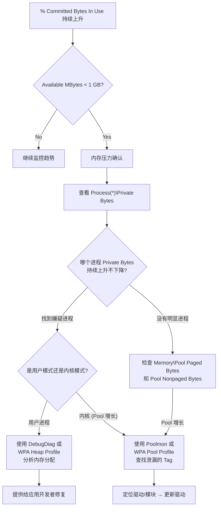
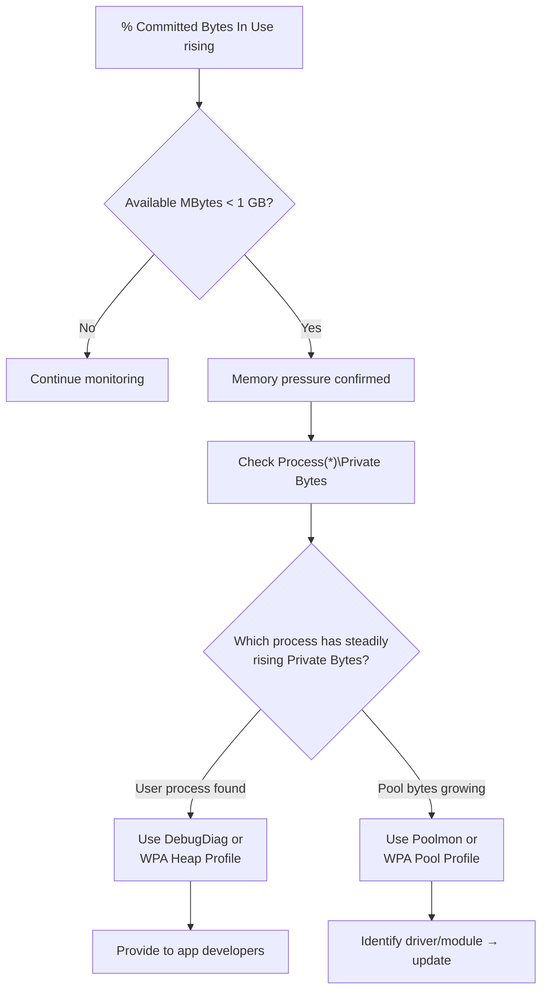

# Deep Dive: 内存性能深度解析

**Topic:** Memory Performance Analysis  
**Category:** Performance  
**Level:** 中级 (Level 200)  
**Series:** Windows Performance Readiness (3/7)  
**Last Updated:** 2026-03-13

---

## 1. 概述 (Overview)

内存问题是最微妙的性能问题之一。CPU 高了能感觉到"卡"，磁盘满了有明确错误 —— 但内存泄漏可能在**一周后**才导致服务器宕机，而且症状像磁盘问题（因为疯狂换页到磁盘）。

理解 Windows 内存管理需要区分两个核心概念：
- **虚拟内存 (Virtual Memory)**：每个进程"以为"自己拥有的地址空间
- **物理内存 (Physical Memory / RAM)**：所有进程共享的、由内核管理的真实硬件资源

本文将从虚拟到物理、从用户模式到内核模式，构建完整的内存性能分析框架。

---

## 2. 虚拟内存模型 (Virtual Memory Model)

### 2.1 核心概念：每个进程活在自己的"虚拟世界"

```
┌─────────────────────────────────────┐
│        进程 A 的虚拟地址空间          │
│  "哇！我有这么多内存，用不完！"        │
│                                     │
│  ┌─────────┐  ┌─────────┐          │
│  │ 用户模式 │  │ 内核模式 │          │
│  │ (私有)   │  │ (共享)   │          │
│  └─────────┘  └─────────┘          │
└──────────────────┬──────────────────┘
                   │  内核管理
┌──────────────────▼──────────────────┐
│           物理资源 (RAM)              │
│   由 VMM (Virtual Memory Manager)    │
│   按需分配，不是提前全部给你            │
└─────────────────────────────────────┘
```

**关键原则：**
- 进程**不知道**物理资源的存在，只能看到自己的虚拟地址空间
- 内核负责将虚拟地址映射到物理 RAM
- 进程很少使用 100% 的虚拟地址空间 —— 浪费是常态
- 进程**不能超过**自己的虚拟地址空间上限

### 2.2 32-bit vs 64-bit 地址空间

| 架构 | 虚拟地址总量 | 用户模式 | 内核模式 |
|------|------------|---------|---------|
| **32-bit** | 4 GB (2³²) | 2 GB（默认）| 2 GB |
| **32-bit + LAA** | 4 GB | 3 GB | 1 GB |
| **32-bit on x64** | 4 GB | 最大 4 GB (WOW64) | N/A |
| **64-bit** | 256 TB (2⁴⁸) | 128 TB | 128 TB |

> 💡 **这就是为什么 64-bit 很重要**：32-bit 进程最多只有 2-4 GB 虚拟空间，大应用很容易"内存不足"（即使物理 RAM 还有很多）。

### 2.3 内存页的三种状态

每个 4KB 内存页处于以下三种状态之一：

| 状态 | 含义 | 类比 |
|------|------|------|
| **Free** | 从未使用或已释放 | 空停车位 |
| **Reserved** | 已预留但未使用，不占用任何物理资源 | 已买机票（但还没有座位号） |
| **Committed** | 已承诺使用，必须由 RAM 或页面文件支持 | 已分配座位（保证有位子坐） |

```
预留 100 MB → 系统提交量不变、RAM 不变、页面文件不变
提交 100 MB → 系统提交量 +100MB（但 RAM 还没真正使用，只是"承诺"了）
实际写入数据 → RAM 使用量增加（Working Set 增加）
```

### 2.4 虚拟内存碎片化

即使还有大量空闲虚拟内存，**碎片化**也可能导致内存分配失败：

```
虚拟地址空间：[使用][空][使用][空][使用][空][使用][空]
                  50MB      30MB      40MB      20MB

想分配 60MB 连续内存？→ 失败！最大连续空间只有 50MB
总空闲 = 140MB，但碎片化导致分配不了
```

> 这在 32-bit 应用中极其常见。64-bit 的 128TB 地址空间几乎不会碎片化。

---

## 3. 内核虚拟内存 (Kernel Virtual Memory)

### 3.1 Pool Paged Bytes 和 Pool Non-paged Bytes

内核也有虚拟地址空间，分为几个关键区域：

| 池 (Pool) | 含义 | 可否换页 |
|-----------|------|---------|
| **Paged Pool** | 存放可以写到磁盘的内核对象 | ✅ 可换页到磁盘 |
| **Non-paged Pool** | 存放必须始终在 RAM 中的内核对象 | ❌ 不可换页 |

**阈值（64-bit 系统）：**

| Pool 使用率 | 状态 |
|------------|------|
| 0-50% (< 4 GB) | ✅ 正常 |
| 60-80% (4-8 GB) | ⚠️ 警告 — 峰值时可能导致服务器缓慢或挂起 |
| 80-100% (8+ GB) | 🔴 严重 — 稳定性和性能问题 |

> ⚠️ Perfmon 无法显示 Pool 的**最大值** —— 需要用其他工具（如 poolmon、WPA）查看。

---

## 4. 物理内存管理 (Physical Memory Management)

### 4.1 提交限制 (Commit Limit)

```
Commit Limit = RAM + 所有页面文件大小之和
```

| 计数器 | 含义 |
|--------|------|
| `\Memory\Commit Limit` | 系统能承诺的最大内存 |
| `\Memory\Committed Bytes` | 当前已承诺的总内存（提交量） |
| `\Memory\% Committed Bytes In Use` | 已使用百分比 |

**当提交限制耗尽时：**
- 系统弹出 "Your computer is low on memory" 警告
- 这意味着 **RAM + 页面文件 都不够用了**
- 系统可能挂起 (hang)

**阈值：**

| % Committed Bytes In Use | 状态 |
|--------------------------|------|
| 0-50% | ✅ 正常 |
| 60-80% | ⚠️ 警告 — 可能在页面文件扩展时突然变慢 |
| 80-100% | 🔴 严重 — 服务器/应用可能挂起 |

### 4.2 页面文件 (Page File) 深入理解

**页面文件是什么？**
- 磁盘上的隐藏系统文件（pagefile.sys），用来模拟物理内存
- 速度比 RAM **慢 1000-1,000,000 倍**：
  - HDD 上的页面文件比 RAM 慢 **100 万倍**
  - SSD 上的页面文件比 RAM 慢 **1000 倍**

**页面文件里有什么？**
- **只有**磁盘上找不到的数据才会写入页面文件
- .dll 和 .exe 文件**不会**写入页面文件（因为它们已经在磁盘上了）
- 例如：Notepad 中未保存的文字 = 可能被页面出去的数据

**System Managed 页面文件（默认）：**
- 最小值：取决于 RAM 大小、提交历史、崩溃转储设置、磁盘空间
- 最大值：3 × RAM 或 4 GB，取较大者
- 在内存压力下可能消耗大量磁盘空间

### 4.3 崩溃转储与页面文件大小

系统崩溃时，文件系统不可用，内核使用**页面文件保留的磁盘空间**来写入转储。

| 转储类型 | 页面文件要求 | 转储大小 |
|---------|------------|---------|
| **Complete** | RAM + 1 MB (最小) | 所有物理内存 |
| **Kernel** | 200 MB - 800 MB | 内核模式内存 |
| **Small/Mini** | ≥ 2 MB | 128 KB - 1 MB |
| **Automatic** (默认) | 自动调整 | 自动选择类型 |
| **Active Memory** | 类似 Kernel | 不含 VM 活跃 RAM |

> 💡 **Dedicated Dump File**：Windows 2008 R2+ 支持专用转储文件，可以放在非系统盘。通过注册表 `HKLM\System\CurrentControlSet\Control\CrashControl` 的 `DedicatedDumpFile` 设置。

---

## 5. Working Set（工作集）

### 5.1 什么是 Working Set？

**Working Set = 进程当前在 RAM 中的已提交内存**。

```
Committed Memory (Private Bytes) = 在 RAM 中的部分 + 在页面文件中的部分
Working Set = 在 RAM 中的部分（实际消耗的物理 RAM）
```

**裁剪 (Trimming)：**
- Available Memory > 1 GB → 工作集被**温和裁剪**或不裁剪
- Available Memory < 1 GB → 工作集被**积极裁剪**
- 裁剪时，**最近最少访问的页**被优先移除（不是最老的页）

### 5.2 页面错误 (Page Faults)

当进程访问的内存页不在工作集中时，发生页面错误：

| 类型 | 含义 | 速度 |
|------|------|------|
| **Soft Fault** | 页面在 RAM 的其他位置（如 Standby List） | 快 (微秒级) |
| **Hard Fault** | 页面在磁盘上的页面文件中 | 慢 (毫秒级) |

### 5.3 Pages/sec 计数器的正确解读

`\Memory\Pages/sec` 衡量**硬页面错误率**（从磁盘读取/写入页面的速率）。

> ⚠️ **关键误区**：Pages/sec 高 ≠ 一定缺内存！

**Pages/sec 高 + Available MBytes 低** → 真的缺内存（换页风暴）  
**Pages/sec 高 + Available MBytes 正常** → 可能是：
- 新应用启动（加载代码页）
- 内存映射文件 IO（如备份软件读取大文件）
- 页面文件预分配

---

## 6. 关键内存计数器 (Key Memory Counters)

### 6.1 系统级计数器

| 计数器 | 含义 | 阈值 |
|--------|------|------|
| **Memory\Available MBytes** | 可立即使用的 RAM | > 2 GB ✅ \| > 1 GB ⚠️ \| < 1 GB 🔴 |
| **Memory\% Committed Bytes In Use** | 提交量占提交限制的比例 | < 50% ✅ \| 60-80% ⚠️ \| > 80% 🔴 |
| **Memory\Pages/sec** | 硬页面错误率 | 需结合 Available MBytes 判断 |
| **Memory\Pool Paged Bytes** | 内核分页池大小 | 看趋势和占比 |
| **Memory\Pool Nonpaged Bytes** | 内核非分页池大小 | 看趋势和占比 |

### 6.2 进程级计数器

| 计数器 | 含义 | 用途 |
|--------|------|------|
| **Process(*)\Private Bytes** | 进程的私有已提交内存 | **最佳内存泄漏检测计数器** |
| **Process(*)\Working Set** | 进程当前使用的 RAM | 看实际 RAM 消耗 |
| **Process(*)\Virtual Bytes** | 进程的已预留+已提交虚拟内存 | 32-bit 进程接近上限时危险 |
| **Process(*)\Handle Count** | 进程的句柄数 | 句柄泄漏检测 |
| **Process(*)\Thread Count** | 进程的线程数 | 线程泄漏检测 |
| **Process(*)\ID Process** | 进程 PID | PID 变化说明进程重启了 |

### 6.3 Working Set vs Private Bytes

**这是最重要的概念区分之一：**

```
SQL Server 示例：
  Private Bytes = 397.2 GB（虚拟内存预留+提交）
  Working Set   =  22.3 GB（实际使用的 RAM）

→ SQL Server "要求"了 397 GB 但实际只"使用"了 22 GB RAM
→ 这是正常的 —— SQL Server 故意预留大量虚拟地址空间
```

**泄漏检测用 Private Bytes，不是 Working Set！**
- 因为 Working Set 可以被 OS 裁剪（数值可能突然下降），但 Private Bytes 不会
- 如果 Private Bytes 持续上升、从不下降 → 内存泄漏

### 6.4 资源泄漏调查阈值

| 计数器 | 值得调查的阈值 |
|--------|-------------|
| Private Bytes | Min 和 Max 之间差值 > 1500 MB |
| Working Set | Min 和 Max 之间差值 > 1500 MB |
| Thread Count | Min 和 Max 之间差值 > 1000 |
| Handle Count | Min 和 Max 之间差值 > 1000 |

---

## 7. 内存泄漏排查流程 (Memory Leak Troubleshooting)



### 关键排查步骤

1. **确认问题**：`% Committed Bytes In Use` 持续上升？`Available MBytes` 低？
2. **定位进程**：按 `\Process(*)\Private Bytes` 排序，找到持续增长的进程
3. **区分用户/内核**：
   - 如果是某个具体进程 → 用户模式泄漏 → DebugDiag / WPA Heap
   - 如果 Pool Bytes 增长 → 内核模式泄漏 → Poolmon / WPA Pool
4. **分析工具**：
   - **DebugDiag**：微软免费工具，附加到进程记录内存分配
   - **VMMap** (Sysinternals)：显示进程的详细内存布局
   - **WPA Pool/Heap Profile**：ETW 级别的精确分析

---

## 8. WPA 内存分析 (WPA Memory Analysis)

### 8.1 录制配置

```powershell
# 堆分析（需要先设置注册表启用目标进程的堆跟踪）
wpr -start Heap -start HeapSnapshot -filemode

# 内核池分析
wpr -start Pool

# 虚拟内存分配分析
wpr -start VirtualAllocation

# 句柄分析
wpr -start Handle

# Resident Set 快照（物理内存组成）
wpr -start ResidentSet
```

### 8.2 WPA 中的关键图表

**Memory Utilization**：每 500ms 采样一次内存利用率，快速发现内存消耗的时间点。

**Heap Allocations**：进程堆的分配/释放记录
- **Impacting Size** = 在查看窗口结束时仍未释放的分配大小
- Impacting Size > 0 = 该内存在查看期间**没有被释放** → 可能是泄漏
- Impacting Size = 0 = 分配后又释放了 → 正常

**Pool Graph**：内核池的分配/释放
- 可以看到 Pool Type (Paged/Nonpaged)、Tag Name、Process、Stack
- 找到 Impacting Size 最大的 Tag → 通过 Stack 定位泄漏的驱动/模块

**Virtual Memory Snapshots**：显示每个进程的 Working Set 和 Commit Size。

**Resident Set**：物理内存的"快照"—— 在 trace 结束时 RAM 中存了什么。
- 按进程查看 Private Working Set
- 重点看 **Active** 类别（当前影响内存使用的部分）
- **Standby** 页面在内存压力下可以被释放
- 展开进程看 **Page Category**：VirtualAlloc、Win32Heap、Image、MapFile 等

---

## 9. 共享内存 (Shared Memory)

相同可执行文件的多个实例会**共享** .dll 和 .exe 的代码页：
- 3 个 notepad.exe 进程 → 只有一份 notepad.exe 代码在 RAM 中
- **Page Combining** (Windows 8/Server 2012+)：周期性地检测并合并相同的私有内存页

---

## 10. 快速参考卡 (Quick Reference)

### 核心阈值

| 计数器 | 正常 | 警告 | 严重 |
|--------|------|------|------|
| Available MBytes | > 2 GB | > 1 GB | < 1 GB |
| % Committed Bytes In Use | < 50% | 60-80% | > 80% |
| Process Virtual Bytes (32-bit) | < 50% of max | 60-80% | > 80% |

### 诊断口诀

```
1. "机器低内存" = Commit Limit 耗尽 (RAM + 页面文件)
2. "进程崩溃 OOM" = 虚拟地址空间耗尽（32-bit 常见）
3. 泄漏检测 → 看 Private Bytes（不是 Working Set）
4. Pages/sec 高 → 先看 Available MBytes 是否真的低
5. Pool 增长 → 内核泄漏 → 找 Tag → 找驱动
```

### WPA 录制命令速查

```powershell
wpr -start Pool                    # 内核池泄漏
wpr -start Heap -filemode          # 用户堆泄漏
wpr -start VirtualAllocation       # VA 分配
wpr -start Handle                  # 句柄泄漏
wpr -start ResidentSet             # RAM 快照
```

---

## 11. 参考资料 (References)

- [Windows Performance Toolkit](https://learn.microsoft.com/windows-hardware/test/wpt/) — WPR/WPA 官方文档
- [Introduction to WPR](https://learn.microsoft.com/windows-hardware/test/wpt/introduction-to-wpr) — WPR 功能介绍

---

## 12. 系列导航 (Series Navigation)

| # | Level | 主题 | 状态 |
|---|-------|------|------|
| 1 | 100 | 性能监控工具全景 | ✅ |
| 2 | 200 | 存储性能深度解析 | ✅ |
| **3** | **200** | **内存性能深度解析 (本文)** | ✅ |
| 4 | 200 | 处理器性能深度解析 | 📝 |
| 5 | 200 | 网络性能深度解析 | 📝 |
| 6 | 300 | WPR/WPA 高级分析技术 | 📝 |
| 7 | 300 | 性能排查方法论 | 📝 |

---

---

# English Version

---

# Deep Dive: Memory Performance Analysis

**Topic:** Memory Performance Analysis  
**Category:** Performance  
**Level:** Intermediate (Level 200)  
**Series:** Windows Performance Readiness (3/7)  
**Last Updated:** 2026-03-13

---

## 1. Overview

Memory issues are among the subtlest performance problems. CPU spikes are immediately noticeable, full disks produce clear errors — but a memory leak may take **a week** before crashing the server, and symptoms mimic disk problems (from excessive paging).

Understanding Windows memory management requires distinguishing two core concepts:
- **Virtual Memory**: The address space each process "believes" it owns
- **Physical Memory (RAM)**: The actual hardware resource shared by all processes, managed by the kernel

---

## 2. Virtual Memory Model

### 2.1 Each Process Lives in Its Own Virtual World

- Processes **don't know** about physical resources — they only see their virtual address space
- The kernel maps virtual addresses to physical RAM **on demand**
- A process **cannot exceed** its virtual address space limit

### 2.2 32-bit vs 64-bit Address Space

| Architecture | User Mode | Kernel Mode |
|-------------|-----------|-------------|
| **32-bit** | 2 GB (default) | 2 GB |
| **32-bit on x64 (WOW64)** | Up to 4 GB | N/A |
| **64-bit** | 128 TB | 128 TB |

> 💡 This is why 64-bit matters: 32-bit processes have only 2-4 GB virtual space. Large apps easily hit "out of memory" even with plenty of physical RAM.

### 2.3 Memory Page States

| State | Meaning | Physical Resources |
|-------|---------|-------------------|
| **Free** | Never used or released | None |
| **Reserved** | Set aside but not used | None |
| **Committed** | Guaranteed by RAM + page file | Guaranteed |

### 2.4 Virtual Memory Fragmentation

Even with plenty of free virtual memory, **fragmentation** can cause allocation failures — especially in 32-bit processes. 64-bit's 128TB address space practically eliminates this problem.

---

## 3. Kernel Virtual Memory

### Pool Paged Bytes and Pool Non-paged Bytes

| Pool | Can Be Paged | Threshold at 80%+ |
|------|-------------|-------------------|
| **Paged Pool** | ✅ Yes | 🔴 Stability/performance issues |
| **Non-paged Pool** | ❌ No (always in RAM) | 🔴 Critical — must investigate |

---

## 4. Physical Memory Management

### 4.1 Commit Limit

```
Commit Limit = RAM + Total Page File Size
```

When the commit limit is reached → system hangs. `% Committed Bytes In Use` near 100% = critical.

### 4.2 Page File

- Disk file simulating RAM — **1,000 to 1,000,000× slower than RAM**
- Contains only data not found elsewhere on disk (.dlls/.exes are NOT in page file)
- System-managed default: min varies by system, max = 3×RAM or 4GB (whichever larger)

### 4.3 Crash Dumps and Page File Sizing

| Dump Type | Page File Requirement |
|-----------|----------------------|
| Complete | RAM + 1 MB minimum |
| Kernel | 200-800 MB |
| Automatic (default) | Auto-adjusts |

---

## 5. Working Sets

### Working Set = Committed bytes currently resident in RAM

**Trimming behavior:**
- Available Memory > 1 GB → gentle or no trimming
- Available Memory < 1 GB → aggressive trimming
- **Least recently accessed** pages are trimmed first (not oldest)

### Page Faults

| Type | Where the Page Is | Speed |
|------|------------------|-------|
| **Soft Fault** | Elsewhere in RAM | Fast (microseconds) |
| **Hard Fault** | On disk (page file) | Slow (milliseconds) |

### Pages/sec — Correct Interpretation

> ⚠️ **Common misconception**: High Pages/sec ≠ necessarily low on memory!

- High Pages/sec + **Low** Available MBytes → Real memory pressure
- High Pages/sec + **Normal** Available MBytes → Could be memory-mapped file I/O, app startup, or page file pre-allocation

---

## 6. Key Memory Counters

### System-level

| Counter | OK | Warning | Critical |
|---------|----|---------| ---------|
| Available MBytes | > 2 GB | > 1 GB | < 1 GB |
| % Committed Bytes In Use | < 50% | 60-80% | > 80% |

### Process-level

| Counter | Purpose |
|---------|---------|
| **Private Bytes** | **Best counter for detecting memory leaks** |
| Working Set | Actual RAM consumption |
| Virtual Bytes | Virtual address space usage (critical for 32-bit) |
| Handle Count | Handle leak detection (investigate if delta > 1000) |
| Thread Count | Thread leak detection (investigate if delta > 1000) |

### Working Set vs Private Bytes

```
SQL Server example:
  Private Bytes = 397 GB (virtual memory reserved+committed)
  Working Set   =  22 GB (actual RAM in use)
```

**Use Private Bytes for leak detection** — Working Set can be trimmed by the OS (drops suddenly), but Private Bytes reflects the true committed memory.

---

## 7. Memory Leak Troubleshooting Flow



---

## 8. WPA Memory Analysis

### Recording Commands

```powershell
wpr -start Pool               # Kernel pool leak
wpr -start Heap -filemode      # User heap leak
wpr -start VirtualAllocation   # VA allocation
wpr -start Handle              # Handle leak
wpr -start ResidentSet         # RAM snapshot
```

### Key WPA Graphs

- **Heap Allocations**: Check **Impacting Size** — if > 0, memory was not freed → potential leak
- **Pool Graph**: Find tags with largest Impacting Size → identify leaking driver via Stack
- **Resident Set**: Snapshot of what's in RAM. Focus on **Active** category, expand by **Page Category** (VirtualAlloc, Win32Heap, Image, etc.)

---

## 9. Quick Reference

### Diagnostic Rules of Thumb

```
1. "Low on memory" message = Commit Limit exhausted (RAM + page files)
2. Process OOM crash = Virtual address space exhausted (common in 32-bit)
3. Leak detection → Watch Private Bytes (not Working Set!)
4. High Pages/sec → Check Available MBytes first
5. Pool growth → Kernel leak → Find Tag → Find driver
```

---

## 10. References

- [Windows Performance Toolkit](https://learn.microsoft.com/windows-hardware/test/wpt/) — WPR/WPA official documentation
- [Introduction to WPR](https://learn.microsoft.com/windows-hardware/test/wpt/introduction-to-wpr) — WPR feature guide

---

## 11. Series Navigation

| # | Level | Topic | Status |
|---|-------|-------|--------|
| 1 | 100 | Performance Monitoring Toolkit Overview | ✅ |
| 2 | 200 | Storage Performance Deep Dive | ✅ |
| **3** | **200** | **Memory Performance Deep Dive (this article)** | ✅ |
| 4 | 200 | Processor Performance Deep Dive | 📝 |
| 5 | 200 | Network Performance Deep Dive | 📝 |
| 6 | 300 | WPR/WPA Advanced Analysis Techniques | 📝 |
| 7 | 300 | Performance Troubleshooting Methodology | 📝 |
