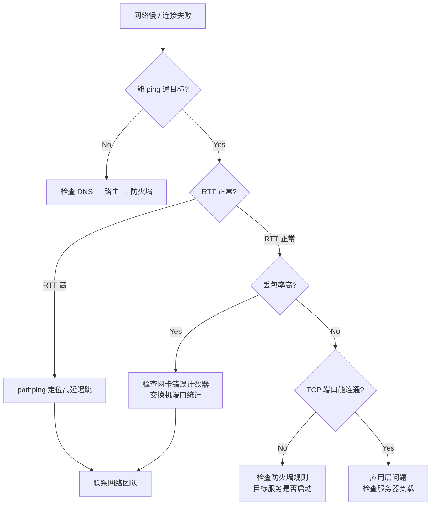
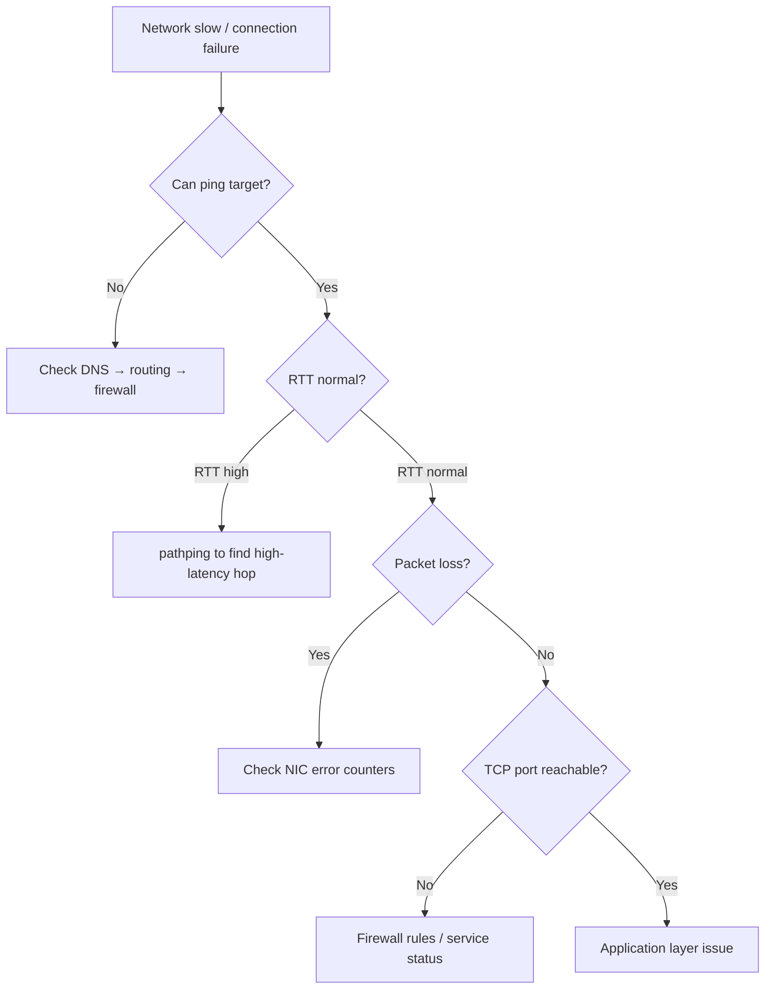

# Deep Dive: 网络性能深度解析

**Topic:** Network Performance Analysis  
**Category:** Performance  
**Level:** 中级 (Level 200)  
**Series:** Windows Performance Readiness (5/7)  
**Last Updated:** 2026-03-13

---

## 1. 概述 (Overview)

网络性能问题往往最复杂，因为涉及的组件最多 —— 从应用到操作系统到网卡驱动、交换机、路由器、防火墙、DNS、代理服务器… 一个"网页打开慢"的投诉可能在链路上任何一个环节出问题。

核心挑战：**网络是共享资源**。不像 CPU/内存/磁盘可以在单台机器上看完整画面，网络需要端到端分析。

本文从基础知识到排查技巧，构建网络性能分析的完整框架。

---

## 2. 核心概念 (Core Concepts)

### 2.1 数据单元名称

不同网络层使用不同的名称：

| 层 | 数据单元 | 协议示例 |
|----|---------|---------|
| 应用层 (Application) | Message / Data | HTTP, SMB, DNS |
| 传输层 (Transport) | **Segment** (TCP) / **Datagram** (UDP) | TCP, UDP |
| 网络层 (Network) | **Packet** | IP |
| 数据链路层 (Data Link) | **Frame** | Ethernet |

> 💡 当我们说"包"（packet）时，严格来说是在网络层。但日常交流中经常混用。

### 2.2 MTU、MSS 和分片

| 概念 | 含义 | 典型值 |
|------|------|--------|
| **MTU** (Maximum Transmission Unit) | 链路层最大帧大小 | Ethernet: **1500 bytes** |
| **MSS** (Maximum Segment Size) | TCP 有效载荷最大值 | 1500 - 20(IP) - 20(TCP) = **1460 bytes** |
| **Jumbo Frame** | 大于标准 MTU 的帧 | **9000 bytes** (数据中心常用) |

**分片 (Fragmentation)**：如果 packet > 路径上最小 MTU → 被分片 → 性能下降。  
**PMTUD** (Path MTU Discovery)：TCP 自动探测路径最小 MTU 避免分片。

### 2.3 路由和网络路径

```
Client → Switch → Router → Firewall → Internet → [ISP routers] → 
→ Load Balancer → Server

每一跳 (hop) 都可能引入延迟和丢包
```

### 2.4 VLAN 和代理

- **VLAN**：逻辑网络分段，不同 VLAN 之间必须经过路由器/三层交换机
- **代理服务器 (Proxy)**：所有流量经过代理 → 额外延迟
- **防火墙**：深度包检测 (DPI) 可能增加显著延迟

---

## 3. TCP vs UDP

### 3.1 核心对比

| 特性 | TCP | UDP |
|------|-----|-----|
| 连接 | 面向连接 (三次握手) | 无连接 |
| 可靠性 | 保证交付 (ACK + 重传) | 不保证 |
| 顺序 | 保证顺序 | 不保证 |
| 流量控制 | 滑动窗口 | 无 |
| 开销 | 较高 (20 byte header) | 较低 (8 byte header) |
| 适用场景 | 文件传输、网页、邮件 | DNS 查询、VoIP、流媒体、游戏 |

### 3.2 TCP 窗口大小与吞吐量

**TCP 吞吐量公式：**

```
最大吞吐量 = 窗口大小 (bytes) / RTT (seconds)
```

| 窗口大小 | RTT | 最大吞吐量 |
|---------|-----|-----------|
| 64 KB | 1 ms | 512 Mbps |
| 64 KB | 10 ms | 51.2 Mbps |
| 64 KB | 100 ms | 5.12 Mbps |
| 1 MB | 100 ms | 80 Mbps |

> ⚠️ 这就是为什么**高延迟链路上 TCP 传输慢** —— 不是带宽不够，是窗口限制了。

**Window Scaling**（RFC 1323）：允许窗口大小超过 64KB（最大 1GB），现代 OS 默认启用。

---

## 4. 网络性能四大指标

### 4.1 带宽 (Bandwidth)

| 计数器 | 含义 |
|--------|------|
| `Network Adapter(*)\Bytes Total/sec` | 收发总字节 |
| `Network Adapter(*)\Bytes Sent/sec` | 发送字节 |
| `Network Adapter(*)\Bytes Received/sec` | 接收字节 |
| `Network Adapter(*)\Current Bandwidth` | 网卡链路速率 (bps) |

**利用率计算：**
```
Network Utilization = (Bytes Total/sec × 8) / Current Bandwidth × 100%
```

> 注意：`Current Bandwidth` 单位是 **bits/sec**，`Bytes Total/sec` 单位是 **bytes/sec**

**阈值：**

| 利用率 | 状态 |
|--------|------|
| < 40% | ✅ 正常 |
| 40-65% | ⚠️ 需要关注 |
| > 65% | 🔴 拥塞风险 |

### 4.2 延迟 (Latency / RTT)

Round-Trip Time = 数据包从发出到收到回复的时间

| RTT | 质量 |
|-----|------|
| < 1 ms | 局域网级别 |
| 1-20 ms | 同城/同区域 |
| 20-100 ms | 跨国/跨洲 |
| > 100 ms | 卫星或极远距离 |

**延迟的影响：**
- TCP 窗口限制吞吐量（上面的公式）
- SMB 文件拷贝性能与 RTT 成反比
- 每次"请求-响应"交互都受 RTT 影响

**测量工具：**
```powershell
# 基本 ping
ping -n 20 target-server

# PSPing — 更精确，支持 TCP 端口测试
psping -n 100 target-server:443

# Test-NetConnection — PowerShell 内置
Test-NetConnection -ComputerName target-server -Port 443

# Pathping — 结合 ping + tracert，显示每跳丢包率
pathping target-server

# Tracert — 路由跟踪
tracert target-server
```

### 4.3 丢包 (Packet Loss)

| 计数器 | 含义 |
|--------|------|
| `Network Adapter(*)\Packets Outbound Errors` | 发送失败的包 |
| `Network Adapter(*)\Packets Received Errors` | 接收错误的包 |
| `Network Adapter(*)\Packets Outbound Discarded` | 被丢弃的发送包 |
| `Network Adapter(*)\Packets Received Discarded` | 被丢弃的接收包 |

**丢包的影响：**
- TCP：触发重传 → 吞吐量下降
- 1% 丢包 → TCP 吞吐量可能下降 **50%+**
- UDP：直接丢失，VoIP 出现语音中断

### 4.4 抖动 (Jitter)

**延迟的变化幅度** —— 对实时应用（VoIP、视频会议）影响最大。

```
RTT 样本：10ms, 15ms, 8ms, 50ms, 12ms, 45ms
→ 抖动大 → 实时音频会出现"卡顿"

RTT 样本：10ms, 11ms, 10ms, 12ms, 11ms, 10ms
→ 抖动小 → 实时通信质量好
```

---

## 5. 端口耗尽 (Port Exhaustion)

### 5.1 临时端口 (Ephemeral Ports)

每个 TCP/UDP 连接需要一个唯一的"源端口号"。Windows 默认的临时端口范围：

```powershell
# 查看临时端口范围
netsh int ipv4 show dynamicport tcp

# Windows 默认：49152 - 65535 = 约 16,384 个端口
```

### 5.2 什么时候会端口耗尽？

**典型场景：**
- 所有 HTTP 流量通过同一代理服务器 → 客户端对代理 IP 的连接数耗尽端口
- 微服务频繁创建短连接 → TIME_WAIT 状态占用端口

**O365 代理场景示例：**
```
10,000 用户 → 都通过 proxy.contoso.com (单 IP)
→ 对代理 IP 最多 ~16,000 个并发连接
→ 每人平均只有 1.6 个连接 → 不够用！
```

### 5.3 诊断

```powershell
# 查看当前连接数
netstat -an | Select-String "ESTABLISHED" | Measure-Object
netstat -an | Select-String "TIME_WAIT" | Measure-Object

# 按远端 IP 统计连接数
netstat -an | Select-String "ESTABLISHED" | ForEach-Object { ($_ -split '\s+')[3] -replace ':\d+$' } | Group-Object | Sort-Object Count -Descending | Select-Object -First 20

# Perfmon 计数器
# TCPv4\Connections Established
# TCPv4\Connection Failures
```

### 5.4 解决方案

| 方案 | 做法 |
|------|------|
| 扩大端口范围 | `netsh int ipv4 set dynamicport tcp start=10000 num=55535` |
| 减少 TIME_WAIT | 注册表调整 TcpTimedWaitDelay (谨慎) |
| 使用连接池 | 应用层改用长连接/连接复用 |
| 多 IP 出口 | 代理使用多个出口 IP 分散连接 |

---

## 6. RSS 和 vRSS (Receive Side Scaling)

### 6.1 问题：网络中断的 CPU 瓶颈

默认情况下，所有网络中断由 **CPU 0** 处理。如果网络流量很大，CPU 0 可能达到 100%，而其他 CPU 空闲。

### 6.2 RSS 解决方案

**RSS (Receive Side Scaling)** 将网络中断分散到多个 CPU 核心。

```
Before RSS:
  CPU 0: 100% (handling all network interrupts)
  CPU 1:  10%
  CPU 2:   5%
  CPU 3:   2%

After RSS:
  CPU 0: 30% (network + other)
  CPU 1: 25% (network)
  CPU 2: 25% (network)
  CPU 3: 20% (network)
```

**启用 RSS：**
```powershell
# 查看 RSS 状态
Get-NetAdapterRss

# 启用 RSS
Enable-NetAdapterRss -Name "Ethernet"

# 设置 RSS CPU 数量
Set-NetAdapterRss -Name "Ethernet" -NumberOfReceiveQueues 4
```

### 6.3 vRSS (Virtual RSS)

在 Hyper-V 虚拟机中，**vRSS** 提供类似功能，将虚拟网卡的中断分散到虚拟 CPU。

```powershell
# 查看 vRSS 状态
Get-NetAdapterRss

# 在 VM 内启用
Enable-NetAdapterRss -Name "vEthernet"
```

---

## 7. 常用网络诊断工具

| 工具 | 用途 | 典型用法 |
|------|------|---------|
| **ping** | 基本连通性 + RTT | `ping -n 20 server` |
| **PSPing** | TCP 端口 RTT + 带宽 | `psping -n 100 server:443` |
| **pathping** | 每跳丢包率分析 | `pathping server` (需要几分钟) |
| **tracert** | 路由路径 | `tracert server` |
| **Test-NetConnection** | PowerShell 连通性 | `tnc server -Port 443` |
| **netstat** | 连接状态统计 | `netstat -an -p tcp` |
| **Get-NetTCPConnection** | PowerShell 连接查询 | `Get-NetTCPConnection -State Established` |

---

## 8. WPA 网络分析 (WPA Network Analysis)

### 8.1 录制网络事件

```powershell
# 包含网络事件的录制
wpr -start Network

# 或使用 GeneralProfile（包含网络 + CPU + 磁盘）
wpr -start GeneralProfile
```

### 8.2 WPA 中的 TCP/IP 分析

WPA 的网络分析能力相对有限，主要通过 **Generic Events** 中的 TCP/IP provider 查看：

- **TCP connection events**: 连接建立/关闭
- **TCP send/receive**: 发送/接收事件及大小
- **TCP retransmit**: 重传事件（关键！重传多 = 网络质量差）

> 💡 对于深度网络分析，**Wireshark/Network Monitor** 通常比 WPA 更合适。WPA 的优势在于将网络事件与 CPU/磁盘/内存事件**关联到同一时间线**。

---

## 9. 快速参考卡 (Quick Reference)

### 网络排查决策树



### 核心阈值

| 指标 | 正常 | 警告 | 严重 |
|------|------|------|------|
| 网络利用率 | < 40% | 40-65% | > 65% |
| 丢包率 | < 0.1% | 0.1-1% | > 1% |
| RTT (LAN) | < 1 ms | 1-5 ms | > 5 ms |
| RTT (WAN) | < 50 ms | 50-150 ms | > 150 ms |
| TIME_WAIT 连接数 | < 5000 | 5000-10000 | > 10000 |

### 诊断口诀

```
1. 先 ping → 再 tracert → 再 PSPing TCP 端口
2. 带宽够但传输慢 → 看 RTT 和窗口大小
3. 间歇性断连 → 看丢包和重传
4. 连接建立失败 → 看端口耗尽和防火墙
5. CPU 0 满载 → 启用 RSS/vRSS
```

---

## 10. 参考资料 (References)

- [Windows Performance Toolkit](https://learn.microsoft.com/windows-hardware/test/wpt/) — WPR/WPA 官方文档
- [Introduction to WPR](https://learn.microsoft.com/windows-hardware/test/wpt/introduction-to-wpr) — WPR 功能介绍

---

## 11. 系列导航 (Series Navigation)

| # | Level | 主题 | 状态 |
|---|-------|------|------|
| 1 | 100 | 性能监控工具全景 | ✅ |
| 2 | 200 | 存储性能深度解析 | ✅ |
| 3 | 200 | 内存性能深度解析 | ✅ |
| 4 | 200 | 处理器性能深度解析 | ✅ |
| **5** | **200** | **网络性能深度解析 (本文)** | ✅ |
| 6 | 300 | WPR/WPA 高级分析技术 | 📝 |
| 7 | 300 | 性能排查方法论 | 📝 |

---

---

# English Version

---

# Deep Dive: Network Performance Analysis

**Topic:** Network Performance Analysis  
**Category:** Performance  
**Level:** Intermediate (Level 200)  
**Series:** Windows Performance Readiness (5/7)  
**Last Updated:** 2026-03-13

---

## 1. Overview

Network performance issues are often the most complex — they involve the most components: application → OS → NIC driver → switches → routers → firewalls → DNS → proxy servers. A "web page is slow" complaint could stem from any link in the chain.

**Core challenge:** The network is a shared resource. Unlike CPU/memory/disk where you can see the full picture on a single machine, network requires end-to-end analysis.

---

## 2. Core Concepts

### Data Unit Names

| Layer | Unit | Examples |
|-------|------|----------|
| Application | Message | HTTP, SMB, DNS |
| Transport | Segment (TCP) / Datagram (UDP) | TCP, UDP |
| Network | Packet | IP |
| Data Link | Frame | Ethernet |

### MTU, MSS, and Fragmentation

- **MTU**: Maximum frame size at link layer (Ethernet default: 1500 bytes)
- **MSS**: TCP payload max = MTU - 40 (IP+TCP headers) = 1460 bytes
- **Fragmentation**: Packet > path MTU → fragmented → performance degrades
- **PMTUD**: TCP auto-discovers path MTU to avoid fragmentation

---

## 3. TCP vs UDP

| Feature | TCP | UDP |
|---------|-----|-----|
| Connection | Connection-oriented (3-way handshake) | Connectionless |
| Reliability | Guaranteed (ACK + retransmit) | Best-effort |
| Ordering | Guaranteed | Not guaranteed |
| Overhead | Higher (20-byte header) | Lower (8-byte header) |
| Use Cases | File transfer, web, email | DNS, VoIP, streaming |

### TCP Window Size and Throughput

```
Max Throughput = Window Size (bytes) / RTT (seconds)
```

With 64KB window and 100ms RTT → max 5.12 Mbps regardless of available bandwidth. **Window Scaling** (RFC 1323) allows windows up to 1GB.

---

## 4. Four Key Network Metrics

### Bandwidth

```
Utilization = (Bytes Total/sec × 8) / Current Bandwidth × 100%
```
Threshold: < 40% OK, 40-65% warning, > 65% critical.

### Latency (RTT)

| RTT Range | Quality |
|-----------|---------|
| < 1 ms | LAN |
| 1-20 ms | Metro/regional |
| 20-100 ms | Cross-country |
| > 100 ms | Satellite/extreme |

### Packet Loss

Even 1% packet loss → TCP throughput drops **50%+** due to retransmissions.

### Jitter

Variation in latency — critical for real-time applications (VoIP, video conferencing).

---

## 5. Port Exhaustion

### The Problem

Each TCP/UDP connection needs a unique source port. Windows default ephemeral range: 49152-65535 (~16,384 ports).

**Typical scenario:** All HTTP through a single proxy IP → per-destination port limit reached quickly.

### Diagnosis

```powershell
netstat -an | Select-String "ESTABLISHED" | Measure-Object
netstat -an | Select-String "TIME_WAIT" | Measure-Object
```

### Solutions

| Solution | How |
|----------|-----|
| Expand port range | `netsh int ipv4 set dynamicport tcp start=10000 num=55535` |
| Connection pooling | App-level long-lived connections |
| Multiple egress IPs | Distribute connections across IPs |

---

## 6. RSS and vRSS

**Problem:** By default, all network interrupts hit CPU 0 → bottleneck under heavy traffic.

**RSS (Receive Side Scaling):** Distributes network processing across multiple CPU cores.

```powershell
Get-NetAdapterRss                                    # Check status
Enable-NetAdapterRss -Name "Ethernet"                # Enable
Set-NetAdapterRss -Name "Ethernet" -NumberOfReceiveQueues 4
```

**vRSS:** Same concept for Hyper-V virtual machines.

---

## 7. Diagnostic Tools

| Tool | Purpose | Usage |
|------|---------|-------|
| **ping** | Connectivity + RTT | `ping -n 20 server` |
| **PSPing** | TCP port RTT + bandwidth | `psping -n 100 server:443` |
| **pathping** | Per-hop packet loss | `pathping server` |
| **tracert** | Route path | `tracert server` |
| **Test-NetConnection** | PS connectivity | `tnc server -Port 443` |

---

## 8. Network Troubleshooting Decision Tree



---

## 9. Quick Reference

```
1. ping → tracert → PSPing TCP port (diagnostic order)
2. Bandwidth OK but slow → check RTT + window size
3. Intermittent drops → check packet loss + retransmits
4. Connection failures → check port exhaustion + firewall
5. CPU 0 maxed → enable RSS/vRSS
```

```powershell
wpr -start Network                    # Network events
wpr -start GeneralProfile             # Network + CPU + Disk
```

---

## 10. References

- [Windows Performance Toolkit](https://learn.microsoft.com/windows-hardware/test/wpt/) — WPR/WPA official documentation
- [Introduction to WPR](https://learn.microsoft.com/windows-hardware/test/wpt/introduction-to-wpr) — WPR feature guide

---

## 11. Series Navigation

| # | Level | Topic | Status |
|---|-------|-------|--------|
| 1 | 100 | Performance Monitoring Toolkit Overview | ✅ |
| 2 | 200 | Storage Performance Deep Dive | ✅ |
| 3 | 200 | Memory Performance Deep Dive | ✅ |
| 4 | 200 | Processor Performance Deep Dive | ✅ |
| **5** | **200** | **Network Performance Deep Dive (this article)** | ✅ |
| 6 | 300 | WPR/WPA Advanced Analysis Techniques | 📝 |
| 7 | 300 | Performance Troubleshooting Methodology | 📝 |
