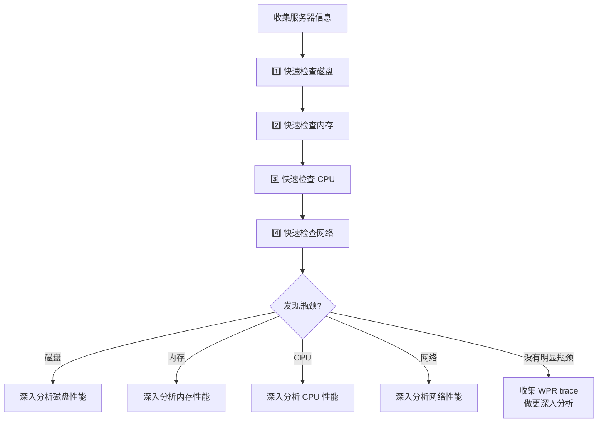
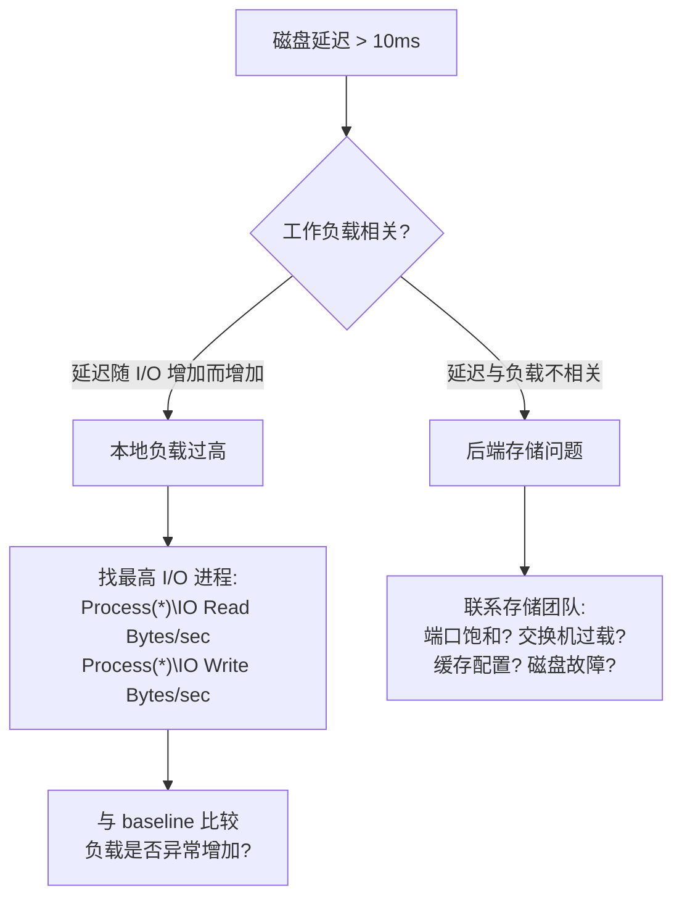
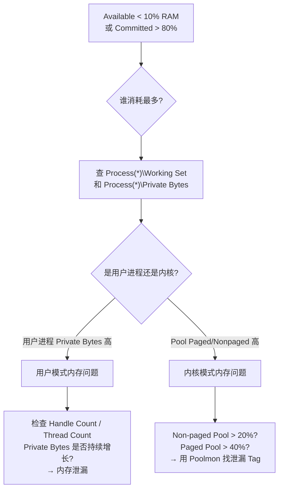
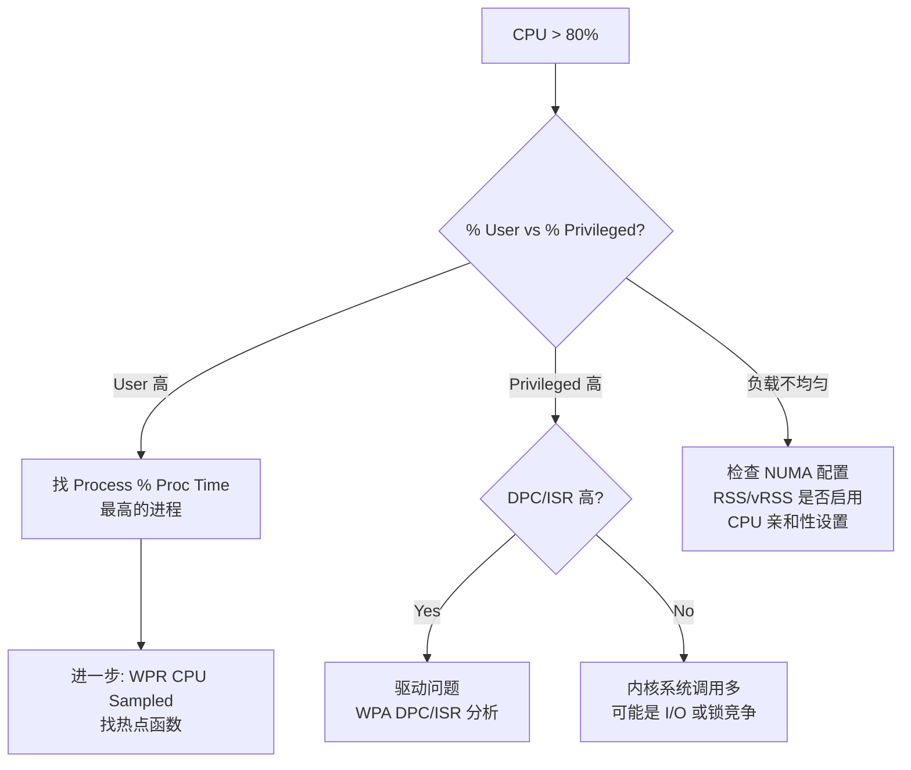
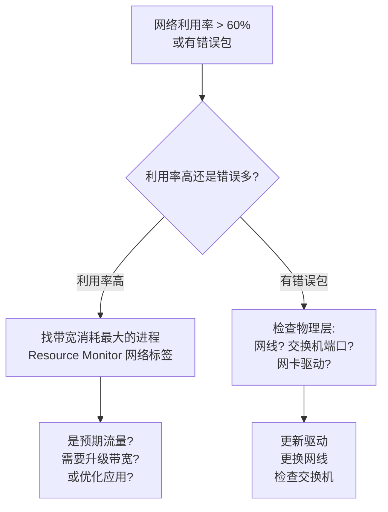
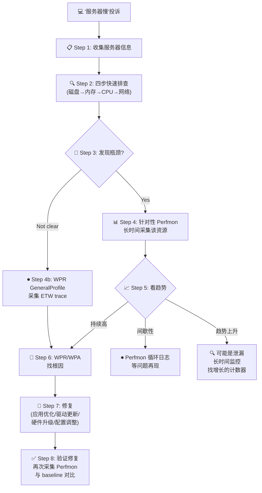
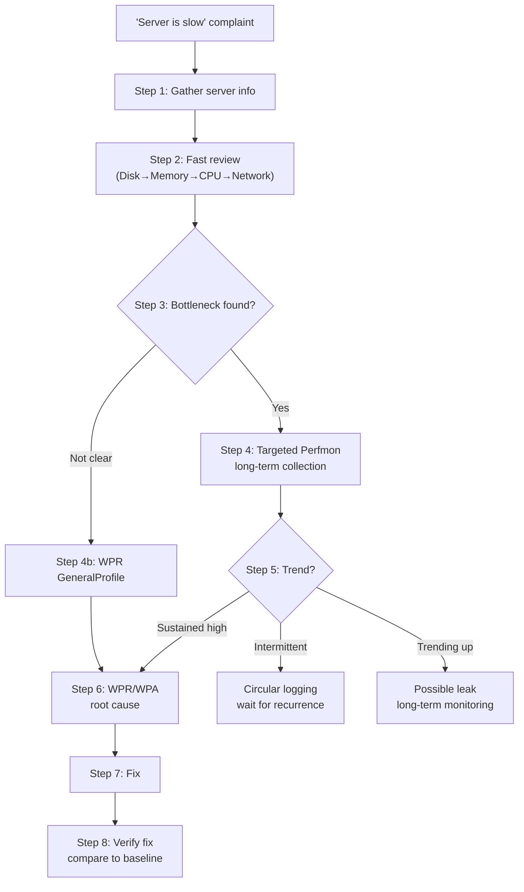

# Deep Dive: 性能排查方法论

**Topic:** Performance Troubleshooting Methodology  
**Category:** Performance  
**Level:** 高级 (Level 300)  
**Series:** Windows Performance Readiness (7/7 — 终章)  
**Last Updated:** 2026-03-13

---

## 1. 概述 (Overview)

前面 6 篇文章教了"工具"和"指标" —— 但在实际排查中，你面对的不是一个计数器，而是"用户说服务器慢"这样模糊的描述。

**方法论 = 把零散的知识串成一条可执行的排查链路。**

本文是整个系列的终章，把所有知识整合成一个端到端的排查流程。

---

## 2. 排查第一步：收集服务器信息

> 不要上来就看计数器。先了解"病人的基本情况"。

### 2.1 必须收集的信息

| 信息 | 为什么重要 |
|------|-----------|
| **物理机 / 虚拟机 / 虚拟化主机** | VM 有额外的虚拟化开销层 |
| **操作系统版本和补丁** | 不同版本行为差异大 |
| **CPU 数量（插槽 × 核心）** | 决定 CPU 指标的基线 |
| **内存大小和启动配置** | 内存阈值依赖于总 RAM |
| **存储：本地 / SAN / NAS** | 存储类型决定延迟基线 |
| **网卡数量和配置** | NIC Teaming、RSS 影响网络性能 |
| **电源策略** | 非"高性能"可能限制 CPU |
| **服务器角色** | DC / SQL / Exchange / Web 等不同角色期望不同 |

---

## 3. 四步快速排查法 (Fast Review)

**原则：先快速扫描四大资源，确定瓶颈在哪个领域，再深入分析。**

### 总体流程



### 3.1 🔍 快速检查磁盘

```
检查: \LogicalDisk(*)\Avg. Disk sec/Read 和 Avg. Disk sec/Write

✅ 正常: 读写延迟 < 10ms (0.010)，偶尔尖峰 < 50ms 且持续 < 60s
⚠️ 需深入: 延迟经常 > 10ms
🔴 严重: 延迟 > 25ms 持续出现
```

### 3.2 🔍 快速检查内存

```
检查: \Memory\Available MBytes 和 \Memory\% Committed Bytes In Use

✅ 正常: Available > 10% RAM 且 % Committed < 80%
⚠️ 需深入: Available < 10% RAM 或 % Committed > 80%
🔴 严重: Available < 100 MB 或 % Committed 接近 100%
```

> 注意：SQL Server 和 Exchange 服务器**故意**消耗大量 RAM → 不要仅因为 Available 低就判定有问题。

### 3.3 🔍 快速检查 CPU

```
检查: \Processor Information(_Total)\% Processor Time 和每个 CPU 的负载

✅ 正常: 平均 < 80%，负载均匀分布
⚠️ 需深入: 平均 > 80% 或负载不均匀
🔴 严重: 持续 > 90% 或单个 CPU 100%（其他空闲）
```

### 3.4 🔍 快速检查网络

```
检查: 利用率 = (Bytes Total/sec × 8) / Current Bandwidth × 100%
      错误计数器: Packets Outbound Errors, Received Errors, Discarded

✅ 正常: 利用率 < 60%，无错误/丢弃包
⚠️ 需深入: 利用率 > 60% 或有错误包
🔴 严重: 利用率 > 80%
```

---

## 4. 深入分析决策树

### 4.1 磁盘性能深入分析



### 4.2 内存性能深入分析



### 4.3 CPU 性能深入分析



### 4.4 网络性能深入分析



---

## 5. 工具选择指南 (Circle of Tools)

### 5.1 概览 vs 深入分析

| 阶段 | 工具 | 作用 |
|------|------|------|
| **快速概览** | Task Manager, Resource Monitor | 实时查看，快速定位嫌疑资源 |
| **趋势监控** | Perfmon (日志模式) | 长时间采集，发现趋势和模式 |
| **深入根因** | WPR + WPA | ETW trace，精确到函数和调用栈 |
| **辅助工具** | Process Explorer, VMMap, Poolmon | 特定场景的专用工具 |
| **网络抓包** | Wireshark, Network Monitor | 网络层面的深入分析 |

### 5.2 按资源选择工具

| 资源 | 概览 | 计数器 | 深入 |
|------|------|--------|------|
| **CPU** | Task Manager | Perfmon: Processor + Process | WPA: CPU Sampled/Precise, DPC/ISR |
| **内存** | Task Manager, ResMon | Perfmon: Memory + Process | WPA: Heap/Pool/ResidentSet, VMMap |
| **磁盘** | ResMon | Perfmon: PhysicalDisk + LogicalDisk | WPA: Disk Usage, DiskSpd (压测) |
| **网络** | ResMon | Perfmon: Network Adapter | WPA: Network, Wireshark/NetMon |
| **内核池** | Process Explorer | Perfmon: Memory Pool | WPA: Pool, Poolmon |

### 5.3 注意事项

- **同时使用多个工具时要注意采集开销**
- 选择合适的采集时间长度 —— 过短可能错过问题，过长产生巨大文件
- **使用循环日志 (Circular Logging)** 来等待间歇性问题

---

## 6. 关键计数器速查表 (Vital Signs Quick Reference)

### 6.1 磁盘计数器

| 计数器 | 正常 | 警告 | 严重 |
|--------|------|------|------|
| LogicalDisk\Avg. Disk sec/Read | < 10ms | 10-15ms | > 15ms |
| LogicalDisk\Avg. Disk sec/Write | < 10ms | 10-15ms | > 15ms |
| LogicalDisk\Avg. Disk Queue Length | < 2 × spindle 数 | 2-3× | > 3× |
| LogicalDisk\% Free Space | > 20% | 10-20% | < 10% |

### 6.2 内存计数器

| 计数器 | 正常 | 警告 | 严重 |
|--------|------|------|------|
| Memory\Available MBytes | > 10% RAM | 5-10% | < 100 MB |
| Memory\% Committed Bytes In Use | < 50% | 60-80% | > 80% |
| Memory\Free System Page Table Entries | > 12,000 | 8,000-12,000 | < 8,000 |
| Memory\Pool Paged/Nonpaged Bytes | < 50% of max | 60-80% | > 80% |

### 6.3 CPU 计数器

| 计数器 | 正常 | 警告 | 严重 |
|--------|------|------|------|
| Processor Information\% Processor Time | < 50% | 50-80% | > 80% |
| Processor Information\% Privileged Time | < 30% | 30-50% | > 50% |
| Processor Information\% DPC Time | < 5% | 5-10% | > 10% |
| System\Processor Queue Length | < 10/CPU | 10-20 | > 20 |
| System\Context Switches/sec | < 2500×N | 趋势上升 | 高且持续 |

### 6.4 网络计数器

| 计数器 | 正常 | 警告 | 严重 |
|--------|------|------|------|
| Network Utilization % | < 30% | 30-60% | > 60% |
| Network Adapter\Output Queue Length | 0-2 | > 2 | 持续 > 2 |
| Packets Outbound/Received Errors | 0 | 偶尔 | 持续出现 |

### 6.5 Hyper-V 额外计数器

| 计数器 | 含义 |
|--------|------|
| Hyper-V Hypervisor Logical Processor\% Total Run Time | 物理 CPU 利用率 |
| Hyper-V Virtual Switch\Bytes Sent/Received/sec | 虚拟交换机流量 |
| Hyper-V Virtual Storage Device\Read/Write Bytes/sec | VHD/AVHD I/O |
| Hyper-V Dynamic Memory Balancer\Available Memory | 动态内存余量 |

---

## 7. 完整排查工作流 (End-to-End Workflow)



---

## 8. 常见排查陷阱 (Common Pitfalls)

### 8.1 十大常见错误

| # | 错误 | 正确做法 |
|---|------|---------|
| 1 | 只看瞬时值而不看趋势 | 至少采集 4+ 小时的 Perfmon 数据 |
| 2 | 用 Working Set 判断内存泄漏 | 用 **Private Bytes** 判断泄漏 |
| 3 | Pages/sec 高就说缺内存 | 先看 Available MBytes 是否真的低 |
| 4 | 进程 CPU > 100% 认为是 bug | 多 CPU 系统正常（总和值） |
| 5 | 忽略电源管理的影响 | 先检查电源计划是否为"高性能" |
| 6 | 只看 CPU 不看 DPC/ISR | Privileged 高时先排除 DPC/ISR |
| 7 | 不看 Physical vs Logical Disk | SAN/LUN 重组后 Logical 编号可能变化 |
| 8 | 忽略 RAID Write Penalty | 写入多的负载在 RAID 5/6 上性能差 |
| 9 | 忘记加载 Symbols | WPA 没有符号 = 看不到函数名 |
| 10 | 采集数据时不记录操作时间 | 标注"用户抱怨慢的时间点"便于定位 |

### 8.2 "看起来像 X 问题，实际是 Y 问题"

| 症状 | 看起来像 | 实际可能是 |
|------|---------|-----------|
| 应用响应慢 | 应用 bug | 磁盘延迟高（等 I/O） |
| 磁盘延迟高 | 存储问题 | 内存不足（换页风暴写磁盘） |
| CPU 低但系统慢 | 没问题？ | DPC/ISR 占用了 CPU 时间 |
| 网络慢 | 带宽不够 | RTT 高 + TCP 窗口限制 |
| 间歇性卡顿 | 硬件故障 | 杀毒软件文件扫描（fltmgr.sys） |

---

## 9. Baseline（基线）的重要性

### 9.1 为什么需要 Baseline？

> "如果你不知道正常时是什么样，怎么知道现在是不正常的？"

- CPU 60% 是高吗？对 SQL Server 可能很正常
- 磁盘延迟 8ms 是好吗？对 NVMe 来说太高了，对 HDD 很正常

### 9.2 如何建立 Baseline

1. 在系统**运行正常时**采集 Perfmon 数据
2. 至少覆盖一个完整业务周期（如 24 小时或一周）
3. 记录关键计数器的**平均值、最大值、最小值**
4. 保存为参考，当出问题时对比

### 9.3 推荐采集的 Baseline 计数器

```
\Processor Information(*)\% Processor Time
\Processor Information(*)\% Privileged Time
\Memory\Available MBytes
\Memory\% Committed Bytes In Use
\LogicalDisk(*)\Avg. Disk sec/Read
\LogicalDisk(*)\Avg. Disk sec/Write
\LogicalDisk(*)\Avg. Disk Queue Length
\Network Adapter(*)\Bytes Total/sec
\Process(*)\% Processor Time
\Process(*)\Private Bytes
\Process(*)\Working Set
\Process(*)\Handle Count
\Process(*)\Thread Count
```

---

## 10. 快速参考卡 (Quick Reference)

### 排查口诀

```
1. 先了解服务器角色和配置
2. 四步快速扫描：磁盘→内存→CPU→网络
3. 发现嫌疑 → Perfmon 长时间采集看趋势
4. 确认瓶颈 → WPR/WPA 深入根因
5. 修复后必须验证！对比 baseline
```

### 工具链

```
实时概览 → Task Manager / Resource Monitor
趋势监控 → Perfmon (logman 自动化)
深入根因 → WPR + WPA
特定场景 → Process Explorer / VMMap / Poolmon / Wireshark
压力测试 → DiskSpd / IOMeter / PSPing
```

### WPR 录制速查

| 场景 | 命令 |
|------|------|
| 通用排查 | `wpr -start GeneralProfile` |
| CPU 问题 | `wpr -start CPU` |
| 内存泄漏 | `wpr -start Heap -start Pool -filemode` |
| 磁盘问题 | `wpr -start GeneralProfile` |
| 启动慢 | `wpr -start Boot` |
| 停止录制 | `wpr -stop mytrace.etl` |

---

## 11. 参考资料 (References)

- [Windows Performance Toolkit](https://learn.microsoft.com/windows-hardware/test/wpt/) — WPR/WPA 官方文档
- [Introduction to WPR](https://learn.microsoft.com/windows-hardware/test/wpt/introduction-to-wpr) — WPR 功能介绍

---

## 12. 系列导航 (Series Navigation)

| # | Level | 主题 | 状态 |
|---|-------|------|------|
| 1 | 100 | 性能监控工具全景 | ✅ |
| 2 | 200 | 存储性能深度解析 | ✅ |
| 3 | 200 | 内存性能深度解析 | ✅ |
| 4 | 200 | 处理器性能深度解析 | ✅ |
| 5 | 200 | 网络性能深度解析 | ✅ |
| 6 | 300 | WPR/WPA 高级分析技术 | ✅ |
| **7** | **300** | **性能排查方法论 (本文 · 终章)** | ✅ |

🎉 **恭喜完成 Windows Performance Readiness 全系列！**

---

---

# English Version

---

# Deep Dive: Performance Troubleshooting Methodology

**Topic:** Performance Troubleshooting Methodology  
**Category:** Performance  
**Level:** Advanced (Level 300)  
**Series:** Windows Performance Readiness (7/7 — Final Chapter)  
**Last Updated:** 2026-03-13

---

## 1. Overview

The previous 6 articles taught "tools" and "metrics." But in real troubleshooting, you don't face a counter — you face "the user says the server is slow."

**Methodology = connecting scattered knowledge into an executable troubleshooting chain.**

---

## 2. Step 1: Gather Server Information

Before looking at counters, understand the patient:

| Information | Why It Matters |
|-------------|----------------|
| Physical / VM / Host | VMs have extra virtualization overhead |
| OS version + patches | Different versions behave differently |
| CPU count (sockets × cores) | Determines CPU metric baselines |
| RAM size | Memory thresholds depend on total RAM |
| Storage type | Local / SAN / NAS determines latency baseline |
| NIC count and config | NIC Teaming, RSS affect network |
| Power policy | Non-"High Performance" may throttle CPU |
| Server role | DC / SQL / Exchange / Web expect different patterns |

---

## 3. Four-Step Fast Review

**Principle: Quickly scan the four major resources, identify which area has the bottleneck, then deep-dive.**

### 3.1 Disk

```
Check: LogicalDisk\Avg. Disk sec/Read and Write
✅ OK: < 10ms, spikes < 50ms lasting < 60s
🔴 Investigate: > 10ms sustained
```

### 3.2 Memory

```
Check: Memory\Available MBytes and % Committed Bytes In Use
✅ OK: Available > 10% RAM AND Committed < 80%
🔴 Investigate: Available < 10% OR Committed > 80%
```

### 3.3 CPU

```
Check: Processor Information(_Total)\% Processor Time
✅ OK: Average < 80%, load evenly distributed
🔴 Investigate: Average > 80% OR uneven load
```

### 3.4 Network

```
Check: Utilization = (Bytes Total/sec × 8) / Current Bandwidth × 100%
✅ OK: < 60%, no errors
🔴 Investigate: > 60% or packet errors present
```

---

## 4. Deep Analysis Decision Trees

### Disk

- Latency correlates with workload → **local load too high** → find the heaviest I/O process
- Latency doesn't correlate → **backend storage issue** → work with storage team

### Memory

- User process Private Bytes high → **user-mode leak** → check Handle/Thread Count
- Pool Paged/Nonpaged high → **kernel leak** → Poolmon to find leaking tag

### CPU

- % User Time high → find top process → WPA CPU Sampled
- % Privileged Time high → check DPC/ISR first → then kernel syscalls

### Network

- Utilization high → find bandwidth consumer → upgrade or optimize
- Errors present → check physical layer (cable, switch port, driver)

---

## 5. Tool Selection Guide

| Phase | Tools | Purpose |
|-------|-------|---------|
| Quick overview | Task Manager, Resource Monitor | Real-time, fast triage |
| Trend monitoring | Perfmon (log mode) | Long-term collection |
| Root cause | WPR + WPA | Function-level precision |
| Specialized | Process Explorer, VMMap, Poolmon | Specific scenarios |
| Network | Wireshark, Network Monitor | Packet-level analysis |

---

## 6. Vital Signs Quick Reference

### Disk

| Counter | OK | Warning | Critical |
|---------|----|---------| ---------|
| Avg. Disk sec/Read\|Write | < 10ms | 10-15ms | > 15ms |
| Avg. Disk Queue Length | < 2×spindles | 2-3× | > 3× |

### Memory

| Counter | OK | Warning | Critical |
|---------|----|---------| ---------|
| Available MBytes | > 10% RAM | 5-10% | < 100 MB |
| % Committed Bytes In Use | < 50% | 60-80% | > 80% |

### CPU

| Counter | OK | Warning | Critical |
|---------|----|---------| ---------|
| % Processor Time | < 50% | 50-80% | > 80% |
| % DPC Time | < 5% | 5-10% | > 10% |

### Network

| Counter | OK | Warning | Critical |
|---------|----|---------| ---------|
| Network Utilization | < 30% | 30-60% | > 60% |

---

## 7. End-to-End Workflow



---

## 8. Common Pitfalls

| Mistake | Correct Approach |
|---------|-----------------|
| Looking at snapshots, not trends | Collect 4+ hours of Perfmon data |
| Using Working Set for leak detection | Use **Private Bytes** |
| High Pages/sec = low memory | Check Available MBytes first |
| Process CPU > 100% is a bug | Normal on multi-CPU (sum of threads) |
| Ignoring power management | Check power plan = "High Performance" |
| Not loading Symbols in WPA | No symbols = no function names |

### "Looks like X, actually Y"

| Symptom | Looks Like | Actually |
|---------|-----------|----------|
| App slow | App bug | Disk latency (waiting for I/O) |
| Disk latency high | Storage issue | Low memory (paging storm) |
| CPU low but system slow | No problem? | DPC/ISR consuming CPU |
| Network slow | Bandwidth | High RTT + TCP window limit |

---

## 9. Baseline Importance

> "If you don't know what normal looks like, how do you know something is abnormal?"

- Collect Perfmon data during **normal** operation
- Cover at least one full business cycle (24h or 1 week)
- Record averages, maximums, minimums for key counters
- Compare against baseline when issues occur

---

## 10. Quick Reference

```
1. Know the server role and configuration first
2. Fast scan: Disk → Memory → CPU → Network
3. Suspect found → Perfmon long-term for trends
4. Bottleneck confirmed → WPR/WPA for root cause
5. Always verify the fix! Compare to baseline
```

---

## 11. References

- [Windows Performance Toolkit](https://learn.microsoft.com/windows-hardware/test/wpt/) — WPR/WPA official documentation
- [Introduction to WPR](https://learn.microsoft.com/windows-hardware/test/wpt/introduction-to-wpr) — WPR feature guide

---

## 12. Series Navigation

| # | Level | Topic | Status |
|---|-------|-------|--------|
| 1 | 100 | Performance Monitoring Toolkit Overview | ✅ |
| 2 | 200 | Storage Performance Deep Dive | ✅ |
| 3 | 200 | Memory Performance Deep Dive | ✅ |
| 4 | 200 | Processor Performance Deep Dive | ✅ |
| 5 | 200 | Network Performance Deep Dive | ✅ |
| 6 | 300 | WPR/WPA Advanced Analysis Techniques | ✅ |
| **7** | **300** | **Performance Troubleshooting Methodology (this article · Final)** | ✅ |

🎉 **Congratulations on completing the Windows Performance Readiness series!**
