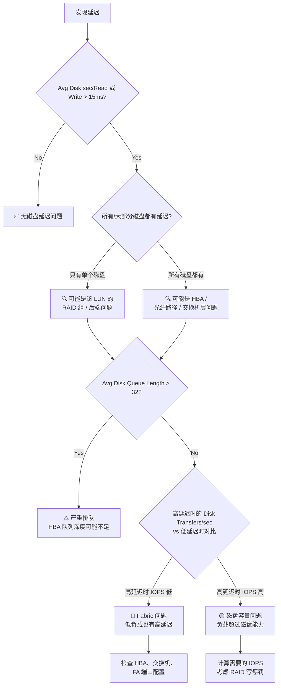
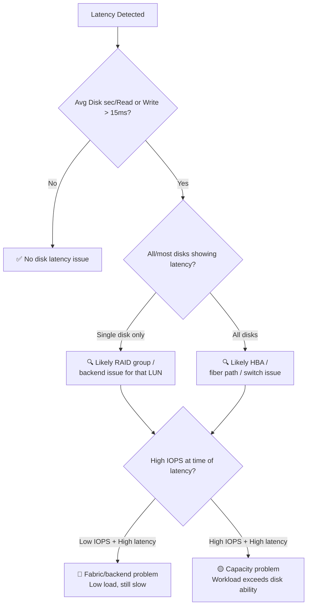

# Deep Dive: 存储性能深度解析

**Topic:** Storage Performance Analysis  
**Category:** Performance  
**Level:** 中级 (Level 200)  
**Series:** Windows Performance Readiness (2/7)  
**Last Updated:** 2026-03-13

---

## 1. 概述 (Overview)

存储往往是性能问题的"隐形杀手"。CPU 高可以在 Task Manager 里一秒看到，但磁盘延迟从 5ms 飙到 200ms，用户只会说"系统慢了"—— 你需要知道去哪里看、看什么、怎么判断。

更具挑战的是，现代存储架构已经从"一块硬盘插在服务器上"演变为层层虚拟化的复杂堆栈：物理磁盘 → RAID 阵列 → SAN 光纤网络 → LUN 映射 → 逻辑卷 → 文件系统。任何一层都可能成为瓶颈，而 Windows 能看到的只是最顶层的"延迟"。

本文将带你从**物理硬件到性能计数器到排查方法论**，建立完整的存储性能分析能力。

---

## 2. 物理磁盘硬件基础 (Physical Disk Hardware)

### 2.1 三代存储介质对比

| 指标 | HDD (15K RPM) | SATA SSD | NVMe SSD |
|------|---------------|----------|----------|
| **随机 IOPS (4KB)** | ~420 读写 | 99,000 读 / 18,000 写 | 430,000 读 / 50,000 写 |
| **顺序吞吐** | ~200 MB/s | 520/475 MB/s | 3500/2100 MB/s |
| **访问时间** | 6-17 ms | 0.2 ms | 0.006 ms |
| **单价** | 低 | 中 | 高 |

> 💡 **直觉理解**：如果 HDD 是骑自行车，SSD 就是开汽车，NVMe 就是坐火箭。IOPS 差距是 **100-1000 倍**。

### 2.2 IOPS 详解

**IOPS (Input/Output Operations Per Second)** 是存储硬件吞吐能力的核心度量。

```
吞吐量 = IOPS × IO 大小
```

**IO 请求的关键维度：**
- **大小 (Size)**：4KB、64KB、1MB —— 大小直接影响吞吐
- **模式 (Pattern)**：随机 vs 顺序 —— HDD 对随机 IO 非常敏感，SSD 不敏感
- **方向**：读 vs 写 —— RAID 的写惩罚会放大写操作的 IO 数量

**IO 大小对性能的实际影响（SSD SAN 实测）：**

| IO Size | 并发 IO | 线程 | IOPS | MB/s | 延迟 |
|---------|--------|------|------|------|------|
| 4KB | 1 | 1 | 3,228 | 12.6 | 0.3 ms |
| 64KB | 1 | 1 | 1,832 | 114.5 | 0.3 ms |
| 1MB | 1 | 1 | 272 | 272.7 | 3.6 ms |
| 4KB | 32 | 8 | 46,831 | 182.9 | 5.5 ms |
| 64KB | 32 | 8 | 7,435 | 464.7 | 34.4 ms |
| 1MB | 32 | 8 | 784 | 784.7 | 326 ms |

> 🔑 **关键洞察**：同样是 SSD，1MB 大 IO + 32 并发 = 326ms 延迟！IO 大小和队列深度对延迟的影响远超想象。

### 2.3 什么是延迟 (Latency)？

延迟是 **IO 请求从发出到确认完成所经过的时间**。对于传统 HDD：

```
15,000 RPM → 每转 4ms
如果观测到 40ms 读延迟 → 磁盘已经可以旋转 10 圈了
→ 延迟不仅仅是磁盘本身，而是整个路径的累加
```

**延迟 = 每一层的耗时之和：**

```
应用程序
  ↓ LP0 (文件系统层)
文件系统 / Volume Manager
  ↓ LP1 (分区管理器)
磁盘驱动 / Miniport
  ↓ LP2 (HBA/控制器)
SAN 交换网络
  ↓ LP3 (光纤路径)
SAN 控制器 / 缓存
  ↓ LP4 (RAID 组)
物理磁盘

总延迟 = LP0 + LP1 + LP2 + LP3 + LP4
```

> 📏 **关键阈值**：基于 64KB 或更小 IO 大小，持续超过 **15ms** 开始影响性能。

---

## 3. 虚拟存储架构 (Virtual Storage)

### 3.1 RAID 类型对比

当物理磁盘通过 RAID 组合后，"一块盘"变成了虚拟概念。理解 RAID 对性能的影响至关重要：

| RAID | 原理 | 读性能 | 写性能 | 写惩罚 | 冗余 | 容量损失 |
|------|------|--------|--------|--------|------|---------|
| **RAID 0** | 条带化 | 最快 (1×n) | 最快 | 1× | ❌ | 0% |
| **RAID 1** | 镜像 | 2× | 1× | 2× | ✅ 1块 | 50% |
| **RAID 5** | 条带+奇偶校验 | 快 (1×n) | **很差** | **4×** | ✅ 1块 | 12-33% |
| **RAID 6** | 条带+双校验 | 快 (1×n) | **最差** | **6×** | ✅ 2块 | 25-50% |
| **RAID 0+1** | 条带+镜像 | 2× | 1× | 2× | ✅ 1块 | 50% |
| **RAID 50** | RAID5 条带化 | 快 | 较好 | ~3× | ✅ 每组1块 | 取决于组数 |

**写惩罚计算示例：**

```
前端写 IOPS: 100
RAID 5 后端实际 IO: 100 读 + (100 × 4) = 500 IO
→ 需要 RAID 组能支撑 500 IOPS 才不会出现延迟
```

| RAID 类型 | 后端 IO 公式 |
|-----------|-------------|
| RAID 1 | 读 + (写 × 2) |
| RAID 5 | 读 + (写 × 4) |
| RAID 6 | 读 + (写 × 6) |

### 3.2 NAS、SAN、iSCSI

| 类型 | 连接方式 | 协议 | 访问方式 | 典型速度 |
|------|---------|------|---------|---------|
| **NAS** | 以太网 TCP/IP | SMB / NFS | UNC 路径 (\\\\svr\\share) | 1-10 Gbps |
| **iSCSI** | 以太网 TCP/IP | SCSI over TCP | 本地磁盘 (LUN) | 1-10 Gbps |
| **SAN (FC)** | 光纤通道 HBA | FC Protocol | 本地磁盘 (LUN) | 8-32 Gbps |

### 3.3 Storage Spaces (Windows 软件 SAN)

微软的软件定义存储解决方案：
- 将多个物理磁盘加入存储池
- 支持分层 (Tiering)：SSD 缓存层 + HDD 容量层
- 支持多种弹性模式：镜像、奇偶校验
- 典型三层架构：
  - **Tier 1**: SSD + 缓存（高性能）
  - **Tier 2**: 10K/15K 2.5" 盘（400-600 IOPS）
  - **Tier 3**: 7200/5400 3.5" 盘（归档前最后一站）

### 3.4 Physical Disk vs Logical Disk

这个概念在 Perfmon 中极其重要：

| 概念 | 定义 | Perfmon 对象 |
|------|------|-------------|
| **Physical Disk** | 呈现给 OS 的"设备"—— 可能是真实硬盘，也可能是 SAN LUN | `\PhysicalDisk(*)` |
| **Logical Disk** | 安装了文件系统的分区（如 C:\、D:\） | `\LogicalDisk(*)` |

> 🔑 **LogicalDisk 通常更有用**，因为应用程序和服务关心的是逻辑卷的性能。一个 PhysicalDisk 上可以有多个 LogicalDisk，反之亦然。

---

## 4. 关键存储计数器 (Key Storage Counters)

### 4.1 主要计数器（Primary — 必看）

| 计数器 | 含义 | 阈值 |
|--------|------|------|
| **Avg. Disk sec/Read** | 平均读延迟（秒） | < 0.015 正常 \| > 0.015 警告 \| > 0.025 严重 |
| **Avg. Disk sec/Write** | 平均写延迟（秒） | 同上 |

> ⚠️ **注意**：这两个计数器的单位是**秒**，不是毫秒！0.015 秒 = 15 ms。

**阈值条件**：基于 64KB 或更小的 IO 大小，持续 1 分钟以上。短暂突刺到 50ms 是正常的。

### 4.2 辅助计数器（Secondary — 辅助判断）

| 计数器 | 含义 | 用途 |
|--------|------|------|
| **Disk Transfers/sec** | 每秒 IO 操作数 | 建立性能基线，判断负载量 |
| **Disk Bytes/sec** | 每秒吞吐量 | 判断带宽是否饱和 |
| **Avg. Disk Bytes/Read (Write)** | 平均 IO 大小 | IO 大大会增加延迟 |
| **Avg. Disk Queue Length** | 平均队列深度 | 看趋势，无固定阈值 |
| **Current Disk Queue Length** | 当前队列深度 | 实时快照 |
| **% Free Space** | 剩余空间百分比 | < 10% 警告，< 5% 严重 |
| **Free Megabytes** | 剩余空间 MB | 同上 |

### 4.3 进程级 IO 计数器

| 计数器 | 说明 |
|--------|------|
| `\Process(*)\IO Read Operations/sec` | 进程的读 IO 速率 |
| `\Process(*)\IO Write Operations/sec` | 进程的写 IO 速率 |

> 💡 这些计数器包含**文件、网络和设备 IO**，不仅仅是磁盘 IO。用作辅助数据判断哪个进程可能在产生大量磁盘 IO。

### 4.4 磁盘空间阈值

| 阈值 | 效果 |
|------|------|
| ≥ 10% Free | ✅ 正常 |
| < 10% Free | ⚠️ 警告 — 碎片增加，可能出现磁盘延迟 |
| < 5% Free | 🔴 严重 — 系统可能无法写入，碎片化加剧导致寻道时间增加 |

---

## 5. 存储性能排查流程 (Troubleshooting Flow)

### 5.1 决策流程图



### 5.2 单盘延迟 vs 系统性延迟

这是**最关键的判断技巧**：

**单个磁盘高延迟** （其他磁盘正常）：
- 问题在 SAN **后端**：该 LUN 对应的 RAID 组可能过载
- HBA 和光纤网络没问题（因为其他磁盘走同一路径是正常的）

**所有磁盘同时高延迟**：
- 问题在**前端/路径层**：HBA 队列溢出、光纤交换机过载、FA 端口拥塞
- 就像高速公路收费站堵车 —— 不管去哪个目的地都要排队

### 5.3 实战分析示例

**场景**：用户投诉服务器 10:30 AM 到 5:00 PM 慢。

**Perfmon 数据：**
- F:\ 盘写延迟峰值 770ms
- F:\ 盘 Disk Transfers/sec 仅 30-50
- F:\ 盘 Avg Disk Queue Length = 28

**分析**：
- 770ms 延迟 + 仅 30-50 IOPS = 极低负载下的高延迟
- 这不是磁盘容量不足（IOPS 很低），而是**路径/后端问题**
- → 检查 SAN 配置、FA 端口是否超额分配、RAID 组是否有故障盘

### 5.4 Queue Depth vs Bandwidth

虚拟化环境特别需要关注**队列深度**问题：

- 在 Hyper-V 主机上，多个 VM 同时发起 IO，队列深度问题比带宽耗尽更容易先出现
- Windows 10 启动需要约 1GB 数据 —— 多个 VM 同时启动可以产生大量并发 IO
- 监控 NIC 和 Disk 的队列深度趋势：如果队列在增长而 Bytes/sec 在下降，说明设备无法处理并发请求

---

## 6. SAN 环境的典型瓶颈点

```
┌──────────────┐
│  应用程序     │
├──────────────┤
│  OS 存储栈    │
├──────────────┤
│  HBA 适配器   │ ← 队列深度需要调整
├──────────────┤
│  光纤交换机   │ ← 可能超额订阅 (oversubscribed)
├──────────────┤
│  FA 端口      │ ← 可能是公共端口，多服务器共用
├──────────────┤
│  SAN 全局缓存 │ ← 缓存设置可能不正确
├──────────────┤
│  RAID 组      │ ← IOPS 可能不足以处理负载
├──────────────┤
│  物理磁盘     │
└──────────────┘
```

**共享主轴 (Shared Spindles) 的问题：**
- 现代 SAN 使用存储池，多台服务器共享底层物理磁盘
- 一台服务器的 IO 风暴可能影响其他服务器的性能
- IOPS 可能不一致（忙时低，闲时高）

**LUN 的组成：**
- 一个 LUN 通常由多个物理磁盘的**一部分**组成
- 比如 4 块 1TB 硬盘各贡献 250GB 组成一个 1TB 的 LUN
- 这意味着这 4 块盘还可能被其他 LUN 使用

---

## 7. 速度单位换算

SAN/NAS 通常用 **Gbps (bits)**，而磁盘用 **MB/s (bytes)**：

```
GB/s ÷ 8 = MiB/s
```

| 网络速度 | 实际吞吐 |
|---------|---------|
| 10 Gbps | ~1,220 MiB/s |
| 1 Gbps | ~122 MiB/s |
| 100 Mbps | ~12.2 MiB/s |

---

## 8. WPA 存储分析 (WPA Storage Analysis)

当 Perfmon 显示磁盘延迟高，但需要更精确的信息时，使用 WPR/WPA 的 Storage 图表。

### 8.1 录制命令

```powershell
wpr -start DiskIO [-filemode]
# 或同时记录文件和注册表 IO
wpr -start DiskIO -start FileIO -start Registry [-filemode]
```

### 8.2 WPA 中的 Disk Usage 图表

**关键列：**
- **IO Time** = OS 层看到的 IO 总时间
- **Disk Service Time** = 硬件层实际处理时间

**判断逻辑：**
- IO Time 高 + Disk Service Time 高 → 硬件/后端问题
- IO Time 高 + Disk Service Time 低 → OS 层排队，可能是驱动或文件系统问题

### 8.3 File I/O 图表

类似 Process Monitor，但有 WPA 的强大排序/过滤/缩放能力：
- 可以按进程、文件路径、IO 类型过滤
- 可以看到每个 IO 的调用栈
- 适合定位"谁在读写这个文件"

### 8.4 StorPort 事件

Disk I/O activity Profile 还会记录 `Microsoft-Windows-StorPort` 事件，出现在 Generic Events 图表中。当 SCSI 请求返回错误时，这些事件对调查非常有帮助。

---

## 9. 常见问题排查 (Common Issues)

### 问题 1：磁盘延迟高但 IOPS 很低

**可能原因**：SAN 后端 RAID 组故障、FA 端口拥塞、HBA 配置问题  
**排查**：检查是否所有磁盘都有延迟 → 判断前端/后端 → 联系存储团队

### 问题 2：磁盘空间不足导致性能下降

**原因**：空间 < 10% 后碎片急剧增加，读写头移动距离增大  
**解决**：删除/移动文件、扩容、碎片整理

### 问题 3：碎片化导致 HDD 性能下降

**原因**：文件系统"老化"—— 文件被分散存储在磁盘各处  
**解决**：对 HDD 执行碎片整理（SSD 不需要传统碎片整理）

### 问题 4：RAID 5/6 写性能极差

**原因**：RAID 5 每个写操作实际产生 4 个 IO，RAID 6 产生 6 个  
**解决**：评估写密集型负载是否应使用 RAID 10，或启用 SAN 缓存

---

## 10. 快速参考卡 (Quick Reference)

### 核心计数器阈值

| 计数器 | 正常 | 警告 | 严重 |
|--------|------|------|------|
| Avg. Disk sec/Read \| Write | < 15ms | > 15ms | > 25ms |
| Avg. Disk Queue Length | 平稳 | 上升趋势 | > 32 |
| % Free Space | > 10% | < 10% | < 5% |

### IOPS 计算公式

```
需要的磁盘数 = 需要的 IOPS ÷ 单盘 IOPS

考虑 RAID 写惩罚：
后端 IOPS = 读 IOPS + (写 IOPS × RAID 写惩罚系数)
RAID 1: ×2 | RAID 5: ×4 | RAID 6: ×6
```

### 排查口诀

```
1. 有没有延迟？→ Avg Disk sec/Read|Write > 15ms？
2. 单盘还是全盘？→ 单盘=后端 | 全盘=路径
3. 有没有排队？→ Queue Length 趋势
4. 负载高还是低？→ IOPS 高=容量不足 | IOPS 低=路径/后端问题
5. IO 多大？→ 大 IO 天然延迟高，阈值需要相应调整
```

---

## 11. 参考资料 (References)

- [Windows Performance Toolkit](https://learn.microsoft.com/windows-hardware/test/wpt/) — WPR/WPA 官方文档
- [Storage Spaces Overview](https://learn.microsoft.com/windows-server/storage/storage-spaces/overview) — Windows Storage Spaces 概述

---

## 12. 系列导航 (Series Navigation)

| # | Level | 主题 | 状态 |
|---|-------|------|------|
| 1 | 100 | 性能监控工具全景 | ✅ |
| **2** | **200** | **存储性能深度解析 (本文)** | ✅ |
| 3 | 200 | 内存性能深度解析 | 📝 |
| 4 | 200 | 处理器性能深度解析 | 📝 |
| 5 | 200 | 网络性能深度解析 | 📝 |
| 6 | 300 | WPR/WPA 高级分析技术 | 📝 |
| 7 | 300 | 性能排查方法论 | 📝 |

---

---

# English Version

---

# Deep Dive: Storage Performance Analysis

**Topic:** Storage Performance Analysis  
**Category:** Performance  
**Level:** Intermediate (Level 200)  
**Series:** Windows Performance Readiness (2/7)  
**Last Updated:** 2026-03-13

---

## 1. Overview

Storage is often the "silent killer" of performance. High CPU is visible in Task Manager within seconds, but disk latency jumping from 5ms to 200ms only manifests as "the system is slow." You need to know where to look, what to look for, and how to interpret it.

Modern storage has evolved from "a hard drive plugged into a server" to complex virtualized stacks: physical disks → RAID arrays → SAN fabric → LUN mapping → logical volumes → file system. Any layer can become a bottleneck, and Windows only sees the top-level "latency."

This article builds your complete storage performance analysis capability, from **physical hardware through counters to troubleshooting methodology**.

---

## 2. Physical Disk Hardware Fundamentals

### 2.1 Three Generations of Storage Media

| Metric | HDD (15K RPM) | SATA SSD | NVMe SSD |
|--------|---------------|----------|----------|
| **Random IOPS (4KB)** | ~420 R/W | 99K R / 18K W | 430K R / 50K W |
| **Sequential Throughput** | ~200 MB/s | 520/475 MB/s | 3500/2100 MB/s |
| **Access Time** | 6-17 ms | 0.2 ms | 0.006 ms |

> 💡 IOPS difference between HDD and NVMe is **100-1000×**.

### 2.2 IOPS in Detail

```
Throughput = IOPS × IO Size
```

**IO size and queue depth dramatically impact latency** — even on SSD SANs, 1MB IO with 32 concurrent operations can produce 326ms latency.

### 2.3 What is Latency?

Latency = total time from IO request to completion acknowledgment. It's the **sum of all layers**:

```
Application → File System → Partition Manager → Disk Driver → HBA →
SAN Switch Fabric → SAN Controller/Cache → RAID Group → Physical Disk
```

> 📏 **Key threshold**: Sustained >15ms (based on ≤64KB IO size) = performance impact.

---

## 3. Virtual Storage Architecture

### 3.1 RAID Types Comparison

| RAID | Read Perf | Write Perf | Write Penalty | Redundancy | Capacity Loss |
|------|-----------|------------|--------------|------------|--------------|
| **0** | Fastest (1×n) | Fastest | 1× | ❌ | 0% |
| **1** | 2× | 1× | 2× | ✅ 1 disk | 50% |
| **5** | Fast (1×n) | **Poor** | **4×** | ✅ 1 disk | 12-33% |
| **6** | Fast (1×n) | **Worst** | **6×** | ✅ 2 disks | 25-50% |
| **0+1** | 2× | 1× | 2× | ✅ 1 disk | 50% |

**Write penalty calculation**: Frontend 100 write IOPS on RAID 5 = 500 backend IOs.

### 3.2 NAS, SAN, iSCSI

| Type | Connection | Protocol | Access | Speed |
|------|-----------|----------|--------|-------|
| **NAS** | Ethernet | SMB/NFS | UNC path | 1-10 Gbps |
| **iSCSI** | Ethernet | SCSI/TCP | Local disk (LUN) | 1-10 Gbps |
| **SAN (FC)** | Fiber Channel | FC Protocol | Local disk (LUN) | 8-32 Gbps |

### 3.3 Physical Disk vs Logical Disk in Perfmon

| Concept | What It Measures | Perfmon Object |
|---------|-----------------|----------------|
| **Physical Disk** | Device presented to OS (could be a SAN LUN) | `\PhysicalDisk(*)` |
| **Logical Disk** | Partitioned volume with file system (C:\, D:\) | `\LogicalDisk(*)` |

> 🔑 **LogicalDisk is usually more relevant** — applications care about volume performance.

---

## 4. Key Storage Counters

### Primary Counters (Must-Watch)

| Counter | Meaning | Thresholds |
|---------|---------|------------|
| **Avg. Disk sec/Read** | Average read latency (seconds) | < 0.015 OK \| > 0.015 Warning \| > 0.025 Critical |
| **Avg. Disk sec/Write** | Average write latency (seconds) | Same as above |

> ⚠️ Units are **seconds**, not milliseconds! 0.015 sec = 15 ms.

### Secondary Counters

| Counter | Purpose |
|---------|---------|
| Disk Transfers/sec | Establish baseline, measure workload |
| Disk Bytes/sec | Check bandwidth saturation |
| Avg. Disk Bytes/Read (Write) | Determine IO sizes (large IO = higher latency expected) |
| Avg. Disk Queue Length | Watch for increasing trends |
| % Free Space | < 10% Warning, < 5% Critical |

### Process I/O Counters

`\Process(*)\IO Read Operations/sec` and `\Process(*)\IO Write Operations/sec` — includes file, network, and device IO (use as supplemental data).

---

## 5. Troubleshooting Flow

### Decision Tree



### The Critical Technique: Single vs. Systemic Latency

**Single disk high latency** (others normal):
- Problem is in the SAN **backend** — that LUN's RAID group may be overloaded
- The shared HBA and fiber path are fine

**All disks simultaneous high latency**:
- Problem is in the **frontend/path** — HBA queue overflow, switch oversubscription, FA port congestion

### Practical Example

**Scenario**: Users report server slow 10:30 AM - 5:00 PM.  
**Data**: F:\ write latency 770ms, Disk Transfers/sec only 30-50.  
**Analysis**: 770ms latency at only 30-50 IOPS = extremely low load with high latency → This is a **path/backend issue**, not capacity. Check SAN configuration, FA port oversubscription, RAID group health.

---

## 6. SAN Bottleneck Points

```
Application → OS Storage Stack → HBA (queue depth) →
Switch Fabric (oversubscription) → FA Ports (shared) →
SAN Cache (settings) → RAID Groups (IOPS capacity) → Physical Disks
```

Each layer can introduce latency. **Shared spindles** mean one server's IO storm can affect another's performance.

---

## 7. WPA Storage Analysis

```powershell
wpr -start DiskIO -start FileIO [-filemode]
```

**Key WPA metrics:**
- **IO Time** = OS-observed total IO duration
- **Disk Service Time** = Hardware processing time
- IO Time high + Disk Service Time high → Hardware/backend issue
- IO Time high + Disk Service Time low → OS-layer queuing

---

## 8. Quick Reference

### Threshold Summary

| Counter | OK | Warning | Critical |
|---------|----|---------| ---------|
| Avg. Disk sec/Read \| Write | < 15ms | > 15ms | > 25ms |
| % Free Space | > 10% | < 10% | < 5% |

### Troubleshooting Checklist

1. **Is there latency?** → Avg Disk sec/Read\|Write > 15ms?
2. **Single or all disks?** → Single = backend \| All = path
3. **Is there queuing?** → Queue Length trending up?
4. **Load high or low?** → High IOPS = capacity \| Low IOPS = fabric/backend
5. **IO size?** → Large IO has naturally higher latency, adjust thresholds accordingly

---

## 9. References

- [Windows Performance Toolkit](https://learn.microsoft.com/windows-hardware/test/wpt/) — WPR/WPA official documentation
- [Storage Spaces Overview](https://learn.microsoft.com/windows-server/storage/storage-spaces/overview) — Windows Storage Spaces overview

---

## 10. Series Navigation

| # | Level | Topic | Status |
|---|-------|-------|--------|
| 1 | 100 | Performance Monitoring Toolkit Overview | ✅ |
| **2** | **200** | **Storage Performance Deep Dive (this article)** | ✅ |
| 3 | 200 | Memory Performance Deep Dive | 📝 |
| 4 | 200 | Processor Performance Deep Dive | 📝 |
| 5 | 200 | Network Performance Deep Dive | 📝 |
| 6 | 300 | WPR/WPA Advanced Analysis Techniques | 📝 |
| 7 | 300 | Performance Troubleshooting Methodology | 📝 |
