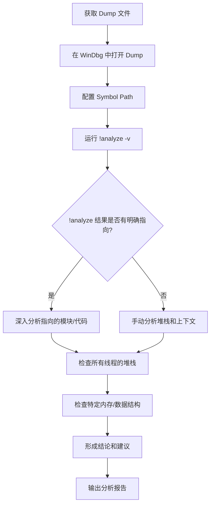

# Deep Dive: WinDbg Dump Analysis — 手把手教你分析 Crash Dump

**Topic:** WinDbg Crash Dump 分析  
**Category:** Debugging / Windows Internals  
**Level:** 入门 → 中级  
**Last Updated:** 2026-03-13

---

# 中文版

---

## 1. 概述 (Overview)

WinDbg 是 Microsoft 官方的 Windows 调试工具，用于分析系统崩溃（BSOD）、应用程序崩溃（App Crash）、系统挂起（Hang）等问题。当 Windows 发生蓝屏时，操作系统会将当时的内存状态转储（dump）到一个 `.dmp` 文件中，WinDbg 就是读取和分析这个文件的核心工具。

对于 Support Engineer 来说，分析 dump 文件是最常见的高级排查手段之一。通过 dump 分析，你可以：
- 定位导致蓝屏/崩溃的**根因模块**（是驱动？是操作系统组件？还是第三方软件？）
- 查看崩溃时的**调用堆栈（Call Stack）**，了解代码执行路径
- 检查当时的**线程状态、内存内容、寄存器值**
- 识别**死锁（Deadlock）、内存泄漏（Memory Leak）、资源耗尽**等问题

WinDbg 在 Windows 调试生态中的位置相当于"终极分析器"——当 Event Log、Performance Monitor 等工具无法定位问题时，dump 分析往往是最后的手段。

## 2. 核心概念 (Core Concepts)

### 2.1 Dump 文件类型

Windows 产生的 dump 文件有多种类型，每种包含不同量级的信息：

| Dump 类型 | 大小 | 内容 | 适用场景 |
|-----------|------|------|---------|
| **Small/Mini Dump** | ~256KB-1MB | Stop message、已加载驱动列表、崩溃进程/线程的上下文 | 快速初步分析，磁盘空间紧张时 |
| **Kernel Memory Dump** | 物理内存的 ~1/3 | 内核模式内存（操作系统 + 驱动代码和数据） | **最常用**，推荐的默认设置 |
| **Complete/Full Memory Dump** | = 物理内存大小 | 所有物理内存内容 | 需要分析用户模式进程内存时 |
| **Automatic Memory Dump** (Win8+) | 与 Kernel 类似 | 类似 Kernel Dump，但可动态管理 pagefile | Windows 8+ 的默认设置 |

> **类比理解**：Mini Dump 就像犯罪现场的简短报告（谁、什么时候、基本情况）；Kernel Dump 像是详细的现场勘查报告（所有证物和照片）；Complete Dump 则是把整个犯罪现场完整搬到实验室里。

### 2.2 符号文件 (Symbol Files / PDB)

符号文件是分析 dump 的**关键依赖**。没有正确的符号，你看到的堆栈只是一堆内存地址，无法解析为函数名。

- **公共符号 (Public Symbols)**：Microsoft 提供的 Windows 组件符号，包含函数名但不含源码行号
- **私有符号 (Private Symbols)**：包含完整调试信息（参数名、局部变量、源码行号），通常只有开发者自己有
- **符号服务器 (Symbol Server)**：Microsoft 的在线符号存储库，WinDbg 可以按需自动下载

### 2.3 内核模式 vs 用户模式

| 维度 | 内核模式 (Kernel-Mode) | 用户模式 (User-Mode) |
|------|----------------------|---------------------|
| 典型场景 | 蓝屏 (BSOD)、驱动崩溃 | 应用程序崩溃、服务挂起 |
| Dump 来源 | 系统自动生成 (`%SystemRoot%\MEMORY.DMP`) | ProcDump、Task Manager、WER |
| 分析重点 | Bug Check Code、内核堆栈、驱动模块 | 异常类型、应用堆栈、堆内存 |
| 常用命令 | `!analyze -v`、`!process`、`!thread`、`!pool` | `!analyze -v`、`!heap`、`!locks`、`~*k` |

### 2.4 Bug Check Code (蓝屏代码)

Bug Check Code 是蓝屏时最重要的线索。常见的有：

| Bug Check Code | 名称 | 常见原因 |
|---------------|------|---------|
| `0x0000000A` | IRQL_NOT_LESS_OR_EQUAL | 驱动在过高的 IRQL 级别访问了分页内存 |
| `0x0000001E` | KMODE_EXCEPTION_NOT_HANDLED | 内核模式异常未被处理 |
| `0x00000050` | PAGE_FAULT_IN_NONPAGED_AREA | 引用了无效的系统内存 |
| `0x0000007E` | SYSTEM_THREAD_EXCEPTION_NOT_HANDLED | 系统线程产生了未处理的异常 |
| `0x0000009F` | DRIVER_POWER_STATE_FAILURE | 驱动在电源状态转换中出错 |
| `0x000000D1` | DRIVER_IRQL_NOT_LESS_OR_EQUAL | 驱动在过高 IRQL 访问分页内存（更具体） |
| `0x000000EF` | CRITICAL_PROCESS_DIED | 关键系统进程意外终止 |
| `0x00000133` | DPC_WATCHDOG_VIOLATION | DPC routine 运行时间超过限制 |
| `0x0000013A` | KERNEL_MODE_HEAP_CORRUPTION | 内核堆损坏 |
| `0x000001CA` | SYNTHETIC_WATCHDOG_TIMEOUT | 合成看门狗超时（Hyper-V 相关） |

## 3. 工作原理 (How It Works)

### 3.1 整体分析流程

下面是分析一个 dump 文件的标准流程：



### 3.2 手把手分析步骤

#### Step 1: 安装 WinDbg

**方法一：WinDbg (新版，推荐)**
- 从 Microsoft Store 搜索 "WinDbg Preview" 安装
- 或使用 winget：`winget install Microsoft.WinDbg`

**方法二：经典 WinDbg**
- 安装 Windows SDK，选择 "Debugging Tools for Windows"
- 安装路径通常在：`C:\Program Files (x86)\Windows Kits\10\Debuggers\x64\`

**方法三：命令行版本 (cdb.exe)**
- 与 WinDbg 共享同一个引擎，适合脚本化分析
- 位于同一安装目录下

#### Step 2: 打开 Dump 文件

**GUI 方式：**
1. 启动 WinDbg
2. `File` → `Open Crash Dump`（快捷键 `Ctrl+D`）
3. 选择 `.dmp` 文件

**命令行方式：**
```
windbg -z C:\path\to\MEMORY.DMP
```

**带完整参数：**
```
windbg -y "srv*C:\Symbols*https://msdl.microsoft.com/download/symbols" -z C:\path\to\MEMORY.DMP
```

#### Step 3: 配置 Symbol Path（最关键的一步！）

在 WinDbg 命令窗口中输入：

```
.sympath srv*C:\Symbols*https://msdl.microsoft.com/download/symbols
```

然后加载符号：
```
.reload
```

> ⚠️ **重要提示**：如果不配置符号路径，你看到的堆栈将是一堆十六进制地址，完全无法阅读！这是新手最常犯的错误。

**验证符号是否加载成功：**
```
lm N T
```
这会列出所有模块及其符号加载状态。你应该看到类似：
```
nt       (pdb symbols)  C:\Symbols\ntkrnlmp.pdb\...\ntkrnlmp.pdb
```

如果看到 `(deferred)` 表示符号尚未加载（会在需要时按需加载），如果看到 `(no symbols)` 则说明找不到符号文件。

#### Step 4: 运行 !analyze -v（自动分析）

这是分析 dump 的**第一条也是最重要的一条命令**：

```
!analyze -v
```

`!analyze -v` 会自动分析 dump 并输出以下关键信息：

```
*******************************************************************************
*                                                                             *
*                        Bugcheck Analysis                                    *
*                                                                             *
*******************************************************************************

DRIVER_IRQL_NOT_LESS_OR_EQUAL (d1)
An attempt was made to access a pageable (or completely invalid) address at an
interrupt request level (IRQL) that is too high. This is usually caused by
drivers using improper addresses.

Arguments:
Arg1: fffff80012345678, memory referenced
Arg2: 0000000000000002, IRQL
Arg3: 0000000000000000, value 0 = read operation, 1 = write operation
Arg4: fffff80011223344, address which referenced memory

SYMBOL_NAME:  thirdparty_driver!BadFunction+0x42

MODULE_NAME:  thirdparty_driver

IMAGE_NAME:  thirdparty_driver.sys

STACK_TEXT:
ffffd000`1234abc0 fffff800`11223344 : ... thirdparty_driver!BadFunction+0x42
ffffd000`1234abd0 fffff800`55667788 : ... nt!KiPageFault+0x360
...

FOLLOWUP_NAME:  thirdparty
```

**关键要看的字段：**

| 字段 | 含义 | 示例 |
|------|------|------|
| **Bugcheck Code** | 蓝屏错误代码 | `DRIVER_IRQL_NOT_LESS_OR_EQUAL (d1)` |
| **Arguments (Arg1-4)** | 错误的详细参数 | 如引用的内存地址、IRQL 级别等 |
| **SYMBOL_NAME** | 导致崩溃的具体符号（函数+偏移） | `thirdparty_driver!BadFunction+0x42` |
| **MODULE_NAME** | 导致崩溃的模块名 | `thirdparty_driver` |
| **IMAGE_NAME** | 模块对应的文件名 | `thirdparty_driver.sys` |
| **STACK_TEXT** | 崩溃时的完整调用堆栈 | 从崩溃点到系统调度的完整路径 |
| **FOLLOWUP_NAME** | 建议跟进的责任方 | `thirdparty` 或 `MachineOwner` |

#### Step 5: 深入分析堆栈

如果 `!analyze -v` 的自动分析不够明确，需要手动查看堆栈：

**查看当前线程的堆栈：**
```
k       // 基本堆栈
kb      // 堆栈 + 前3个参数
kp      // 堆栈 + 完整参数（需要私有符号）
kn      // 堆栈 + 帧编号
kv      // 堆栈 + FPO 数据和调用约定
```

**查看所有线程的堆栈（内核模式）：**
```
!process 0 ff    // 列出所有进程的所有线程堆栈
```

**查看所有线程的堆栈（用户模式）：**
```
~*k             // 所有线程的堆栈
~*kb            // 所有线程的堆栈 + 参数
```

**切换到特定线程：**
```
~3s             // 切换到 3 号线程（用户模式）
.thread <addr>  // 切换到指定地址的线程（内核模式）
```

#### Step 6: 检查模块信息

```
lm              // 列出所有已加载模块
lm N T          // 列出模块 + 时间戳 + 路径
lm vm nt*       // 查看 nt 内核模块的详细信息
lm vm thirdparty_driver  // 查看特定模块的版本和路径
```

**查看特定模块的版本信息（非常重要，可以确认驱动版本）：**
```
!lmi thirdparty_driver
```

#### Step 7: 检查系统和进程信息

**系统基本信息：**
```
vertarget       // 目标系统版本、uptime、dump 时间
!sysinfo cpuinfo    // CPU 信息
!sysinfo machineid  // 机器信息
```

**进程信息（内核模式）：**
```
!process 0 0            // 列出所有进程（简要）
!process <EPROCESS> 7   // 查看特定进程详细信息
```

**Bug Check 信息：**
```
.bugcheck       // 显示 bug check code 和参数
```

### 3.3 典型分析场景

#### 场景一：蓝屏 (BSOD) 分析

```
1. 打开 MEMORY.DMP
2. .sympath srv*C:\Symbols*https://msdl.microsoft.com/download/symbols
3. .reload
4. !analyze -v
5. 查看 MODULE_NAME → 确认是哪个驱动/组件
6. lm vm <module_name> → 确认版本
7. k → 查看完整堆栈确认调用路径
8. 根据 Bug Check Code 查阅 Microsoft 文档
```

#### 场景二：系统 Hang 分析

如果系统挂起但没有蓝屏，可以获取 Complete Dump 后：

```
!analyze -hang          // 专门分析 hang 场景
!locks                  // 查看锁的持有情况
!deadlock               // 检测死锁
!running                // 查看正在运行的线程
!ready                  // 查看就绪队列
!stacks 2               // 查看所有线程堆栈的摘要
```

#### 场景三：用户模式应用崩溃

用户模式 dump（通过 ProcDump、Task Manager 或 WER 获取）：

```
!analyze -v             // 自动分析异常
.exr -1                 // 查看异常记录
.ecxr                   // 切换到异常上下文
k                       // 查看异常时的堆栈
~*k                     // 查看所有线程
!heap -s                // 堆摘要（检查内存泄漏）
!address -summary       // 内存使用摘要
```

## 4. 关键配置与参数 (Key Configurations)

### 4.1 系统 Dump 配置

通过注册表或系统属性配置（`系统属性` → `高级` → `启动和故障恢复`）：

| 配置项 | 注册表路径 | 值 | 说明 |
|--------|-----------|-----|------|
| Dump 类型 | `CrashControl\CrashDumpEnabled` | `1`=Complete, `2`=Kernel, `3`=Small, `7`=Automatic | 推荐 Kernel (2) 或 Automatic (7) |
| Dump 文件路径 | `CrashControl\DumpFile` | `%SystemRoot%\MEMORY.DMP` | 默认路径 |
| Mini Dump 路径 | `CrashControl\MinidumpDir` | `%SystemRoot%\Minidump` | Mini dump 存放目录 |
| 覆盖已有 Dump | `CrashControl\Overwrite` | `1`=覆盖, `0`=不覆盖 | 磁盘空间紧张时注意 |
| 自动重启 | `CrashControl\AutoReboot` | `1`=自动重启 | 默认开启 |
| NMI Dump | `CrashControl\NMICrashDump` | `1`=启用 | 允许通过 NMI 触发 dump |

> **注册表完整路径**：`HKLM\System\CurrentControlSet\Control\CrashControl`

### 4.2 WinDbg 环境变量

| 环境变量 | 示例值 | 说明 |
|----------|--------|------|
| `_NT_SYMBOL_PATH` | `srv*C:\Symbols*https://msdl.microsoft.com/download/symbols` | 全局符号路径 |
| `_NT_IMAGE_PATH` | `C:\TargetImages` | 二进制文件搜索路径 |
| `_NT_SOURCE_PATH` | `C:\Source` | 源码路径 |

> **技巧**：设置 `_NT_SYMBOL_PATH` 环境变量后，WinDbg 打开时会自动使用，无需每次手动配置。

### 4.3 WinDbg 常用命令速查

| 命令 | 功能 | 常用示例 |
|------|------|---------|
| `!analyze -v` | 自动分析崩溃 | 打开 dump 后的第一条命令 |
| `k` / `kb` / `kp` / `kn` | 查看调用堆栈 | `kn` 显示带帧号的堆栈 |
| `lm` | 列出已加载模块 | `lm N T` 显示时间戳 |
| `!lmi` | 模块详细信息 | `!lmi ntfs` |
| `.sympath` | 设置符号路径 | `.sympath+ srv*...` 追加路径 |
| `.reload` | 重新加载符号 | `.reload /f nt` 强制加载 |
| `vertarget` | 目标系统信息 | 查看 OS 版本和 uptime |
| `.bugcheck` | Bug Check 信息 | 确认蓝屏代码 |
| `dt` | 显示数据类型 | `dt nt!_EPROCESS` |
| `!process` | 进程信息 | `!process 0 0` 列出所有进程 |
| `!thread` | 线程信息 | `!thread <addr>` |
| `!pool` | 内存池信息 | `!pool <addr>` 查看池分配 |
| `!pte` | 页表项 | `!pte <addr>` 查看虚拟地址映射 |
| `!irp` | I/O 请求包 | `!irp <addr>` 查看 IRP 详情 |
| `.exr -1` | 异常记录 | 查看最近的异常信息 |
| `.ecxr` | 异常上下文 | 切换到异常时的寄存器上下文 |
| `r` | 寄存器 | 查看/修改寄存器值 |
| `db` / `dw` / `dd` / `dq` | 读内存 | `dd rsp L10` 查看堆栈上的内存 |
| `!locks` | 锁信息 | 分析死锁 |
| `!stacks 2` | 所有线程堆栈摘要 | 快速了解所有线程状态 |
| `.logopen` | 打开日志文件 | `.logopen C:\analysis.txt` |
| `.logclose` | 关闭日志文件 | 保存分析结果 |

## 5. 常见问题与排查 (Common Issues & Troubleshooting)

### 问题 A: 符号加载失败 — 堆栈只显示地址

**症状**：堆栈显示类似 `fffff800'12345678` 的地址而非函数名  
**可能原因**：
- 未配置 Symbol Path
- 网络不通无法连接 Symbol Server
- Proxy 环境未配置 WinDbg 代理

**排查步骤**：
```
.sympath                      // 检查当前符号路径
!sym noisy                    // 开启符号加载详细日志
.reload /f nt                 // 强制重新加载 nt 模块符号
lm N T                        // 检查各模块符号状态
```

**解决方案**：
- 确认网络可以访问 `https://msdl.microsoft.com/download/symbols`
- 如有 proxy：`.symopt+ 0x80000000`（允许代理）
- 离线环境：预先用 `symchk.exe` 下载符号到本地

### 问题 B: "Dump file is incomplete" 错误

**症状**：打开 dump 后提示文件不完整  
**可能原因**：
- 系统 pagefile 太小，无法写入完整 dump
- dump 过程中磁盘空间不足
- 系统在写 dump 时又崩溃了

**排查步骤**：
- 检查 pagefile 大小（Kernel dump 需要约 RAM 的 1/3，Complete dump 需要 = RAM 大小 + 1MB）
- 检查 `%SystemRoot%` 所在磁盘的可用空间
- 检查 Event Log 中关于 dump 的事件

**解决方案**：
- 增大 pagefile（建议设为系统管理大小，或手动设为 RAM + 300MB）
- 确保系统盘有足够空间

### 问题 C: !analyze -v 指向 nt 模块但原因不明

**症状**：`!analyze -v` 的 MODULE_NAME 是 `nt`（Windows 内核）  
**可能原因**：
- 真正的问题驱动可能已经卸载
- 内存损坏导致崩溃发生在内核代码中
- 需要查看更完整的堆栈

**排查步骤**：
```
.bugcheck                     // 再次确认 Bug Check Code
k                             // 查看完整堆栈
!process -1 0                 // 查看崩溃时的进程
!vm                           // 检查虚拟内存状态
!poolused 2                   // 检查池内存使用
```

### 问题 D: Dump 文件没有生成

**症状**：蓝屏后找不到 MEMORY.DMP  
**可能原因**：
- Dump 未配置
- Pagefile 不在系统盘
- 磁盘空间不足
- 第三方软件禁用了 dump 生成

**排查步骤**：
```powershell
# 检查 Dump 配置
Get-ItemProperty "HKLM:\System\CurrentControlSet\Control\CrashControl"

# 检查 Pagefile 配置
Get-WmiObject Win32_PageFileSetting | Select Name, InitialSize, MaximumSize

# 检查系统盘空间
Get-PSDrive C | Select Used, Free
```

## 6. 实战经验 (Practical Tips)

### 最佳实践

1. **打开 dump 的第一件事永远是 `!analyze -v`** —— 这是自动化分析的起点
2. **永远配置好 Symbol Path** —— 没有符号的分析等于瞎猜
3. **保存分析日志** —— 开始分析前用 `.logopen C:\analysis.txt` 记录所有输出
4. **先看 MODULE_NAME 和 IMAGE_NAME** —— 快速判断是不是第三方驱动的问题
5. **多个 dump 一起看** —— 如果有多次蓝屏的 dump，看是否指向同一个模块
6. **关注 3rd party 驱动版本** —— 用 `lm vm <driver>` 确认版本，检查是否有已知更新
7. **使用 `.logopen` 保存输出** —— 方便后续 review 和分享给其他团队

### 常见误区

1. ❌ **只看 Bug Check Code 就下结论** —— Bug Check Code 只是症状，不是根因
2. ❌ **忽略堆栈中的第三方模块** —— `!analyze -v` 可能指向 nt，但堆栈中可能有第三方驱动
3. ❌ **在没有符号的情况下分析** —— 没有符号的堆栈是不可靠的
4. ❌ **只分析一个 dump** —— 单次蓝屏可能是偶发问题，需要多个 dump 交叉验证
5. ❌ **忽略 vertarget 信息** —— OS 版本和 uptime 是重要的背景信息

### 性能考量

- **Symbol 下载**：第一次分析可能需要下载大量符号，建议配置本地缓存 `srv*C:\Symbols*`
- **Complete Dump 分析**：大型 Complete Dump（如 64GB+ 内存的服务器）打开较慢，建议使用 SSD
- **并行分析**：可以同时打开多个 WinDbg 实例分析不同的 dump

### 安全注意

- **Dump 文件可能包含敏感数据**：内存 dump 可能包含密码、密钥、个人数据
- **传输 dump 时注意加密**：特别是 Complete Dump，包含全部内存内容
- **客户 dump 应妥善保管**：遵循数据处理策略，分析完成后按规定处理

## 7. 与相关工具的对比 (Comparison with Related Tools)

| 维度 | WinDbg | Visual Studio Debugger | ProcDump | DebugDiag |
|------|--------|----------------------|----------|-----------|
| **主要用途** | 内核+用户模式全面分析 | 用户模式应用开发调试 | 收集用户模式 dump | 自动分析 IIS/COM+ crash |
| **内核模式支持** | ✅ 完整支持 | ❌ 不支持 | ❌ 仅收集 | ❌ 不支持 |
| **BSOD 分析** | ✅ 核心工具 | ❌ | ❌ | ❌ |
| **学习曲线** | 较陡 | 平缓 | 简单 | 中等 |
| **脚本化** | ✅ (JavaScript/dx) | 有限 | ✅ (命令行参数) | ✅ (规则) |
| **GUI 友好度** | 新版改善很多 | ✅ 优秀 | ❌ 纯命令行 | ✅ 向导式 |
| **适用人群** | 内核开发/Support | 应用开发 | 运维/Support | IIS 管理员 |

**选型建议**：
- **BSOD/内核问题** → 必须用 WinDbg
- **应用崩溃初步分析** → DebugDiag 自动分析报告（快速获得结果）
- **需要深入分析应用崩溃** → WinDbg
- **需要在特定条件下抓 dump** → ProcDump + WinDbg 分析

## 8. 参考资料 (References)

- [WinDbg — Debugging Tools for Windows](https://learn.microsoft.com/windows-hardware/drivers/debugger/) — WinDbg 官方主页，安装和概览
- [Getting Started with Windows Debugging](https://learn.microsoft.com/windows-hardware/drivers/debugger/getting-started-with-windows-debugging) — Windows 调试入门指南
- [!analyze Extension Command](https://learn.microsoft.com/windows-hardware/drivers/debuggercmds/-analyze) — !analyze 命令详细文档
- [Bug Check Code Reference](https://learn.microsoft.com/windows-hardware/drivers/debugger/bug-check-code-reference2) — Bug Check Code 完整参考
- [How to Read Small Memory Dump Files](https://learn.microsoft.com/troubleshoot/windows-client/performance/read-small-memory-dump-file) — 如何读取小内存转储文件 (KB315263)
- [Analyze Crash Dump Files by Using WinDbg](https://learn.microsoft.com/windows-hardware/drivers/debugger/crash-dump-files) — 使用 WinDbg 分析 crash dump 文件

---
---

# English Version

---

## 1. Overview

WinDbg is Microsoft's official debugging tool for Windows, used to analyze system crashes (BSOD), application crashes, system hangs, and other issues. When Windows encounters a blue screen, the operating system dumps the current memory state into a `.dmp` file, and WinDbg is the primary tool for reading and analyzing these files.

For Support Engineers, dump analysis is one of the most critical advanced troubleshooting techniques. Through dump analysis, you can:
- Identify the **root cause module** (driver? OS component? third-party software?)
- Examine the **call stack** at the time of the crash to understand the code execution path
- Inspect **thread states, memory contents, and register values**
- Identify **deadlocks, memory leaks, and resource exhaustion** issues

## 2. Core Concepts

### 2.1 Dump File Types

| Dump Type | Size | Content | Use Case |
|-----------|------|---------|----------|
| **Small/Mini Dump** | ~256KB-1MB | Stop message, loaded drivers list, crash process/thread context | Quick initial analysis |
| **Kernel Memory Dump** | ~1/3 of physical memory | Kernel-mode memory (OS + driver code and data) | **Most common**, recommended default |
| **Complete/Full Memory Dump** | = physical memory size | All physical memory contents | When user-mode process memory analysis is needed |
| **Automatic Memory Dump** (Win8+) | Similar to Kernel | Similar to Kernel Dump with dynamic pagefile management | Default on Windows 8+ |

### 2.2 Symbol Files (PDB)

Symbol files are **critical dependencies** for dump analysis. Without correct symbols, the stack trace shows only hex addresses instead of function names.

- **Public Symbols**: Provided by Microsoft, contain function names but not source line numbers
- **Private Symbols**: Complete debug information, typically only available to developers
- **Symbol Server**: Microsoft's online symbol repository, WinDbg auto-downloads as needed

### 2.3 Common Bug Check Codes

| Bug Check Code | Name | Common Cause |
|---------------|------|-------------|
| `0x0000000A` | IRQL_NOT_LESS_OR_EQUAL | Driver accessing paged memory at too high IRQL |
| `0x00000050` | PAGE_FAULT_IN_NONPAGED_AREA | Invalid system memory reference |
| `0x0000007E` | SYSTEM_THREAD_EXCEPTION_NOT_HANDLED | Unhandled exception in system thread |
| `0x0000009F` | DRIVER_POWER_STATE_FAILURE | Driver error during power state transition |
| `0x000000D1` | DRIVER_IRQL_NOT_LESS_OR_EQUAL | Driver accessing paged memory at elevated IRQL |
| `0x000000EF` | CRITICAL_PROCESS_DIED | Critical system process terminated unexpectedly |
| `0x00000133` | DPC_WATCHDOG_VIOLATION | DPC routine exceeded time limit |

## 3. How It Works — Step-by-Step Analysis

### Step 1: Install WinDbg

**Option A (Recommended):** Install from Microsoft Store or via `winget install Microsoft.WinDbg`

**Option B:** Install Windows SDK → select "Debugging Tools for Windows"

### Step 2: Open the Dump File

```
windbg -z C:\path\to\MEMORY.DMP
```

Or in GUI: `File` → `Open Crash Dump` (`Ctrl+D`)

### Step 3: Configure Symbol Path (Critical!)

```
.sympath srv*C:\Symbols*https://msdl.microsoft.com/download/symbols
.reload
```

Verify symbols are loaded:
```
lm N T
```

### Step 4: Run !analyze -v (Automated Analysis)

```
!analyze -v
```

**Key fields to examine:**

| Field | Meaning |
|-------|---------|
| **Bugcheck Code** | The blue screen error code |
| **Arguments (Arg1-4)** | Detailed parameters of the error |
| **SYMBOL_NAME** | Specific symbol causing the crash |
| **MODULE_NAME** | Module responsible for the crash |
| **IMAGE_NAME** | Filename of the module |
| **STACK_TEXT** | Complete call stack at crash time |

### Step 5: Deep Dive into the Stack

```
k       // Basic stack trace
kb      // Stack + first 3 parameters
kn      // Stack + frame numbers
~*k     // All threads' stacks (user-mode)
!process 0 ff  // All threads' stacks (kernel-mode)
```

### Step 6: Check Module Information

```
lm vm <module_name>    // Detailed module info with version
!lmi <module_name>     // Comprehensive module details
```

### Step 7: System and Process Information

```
vertarget              // Target system version and uptime
.bugcheck              // Bug check code and parameters
!process 0 0           // List all processes (kernel-mode)
```

## 4. Key Configurations

### System Dump Configuration

Registry path: `HKLM\System\CurrentControlSet\Control\CrashControl`

| Setting | Registry Value | Values | Notes |
|---------|---------------|--------|-------|
| Dump Type | `CrashDumpEnabled` | `1`=Complete, `2`=Kernel, `3`=Small, `7`=Auto | Recommend Kernel (2) or Auto (7) |
| Dump Path | `DumpFile` | `%SystemRoot%\MEMORY.DMP` | Default path |
| Overwrite | `Overwrite` | `1`=Yes, `0`=No | Watch disk space |

### WinDbg Environment Variables

| Variable | Purpose |
|----------|---------|
| `_NT_SYMBOL_PATH` | Global symbol path, auto-used by WinDbg |
| `_NT_IMAGE_PATH` | Binary file search path |

## 5. Common Issues & Troubleshooting

### Issue A: Symbols Not Loading
- **Symptom**: Stack shows addresses instead of function names
- **Fix**: Verify `.sympath`, check network connectivity to `msdl.microsoft.com`, use `!sym noisy` for diagnostic output

### Issue B: "Dump file is incomplete"
- **Cause**: Pagefile too small or disk space insufficient
- **Fix**: Increase pagefile size (RAM + 300MB recommended for Complete Dump)

### Issue C: !analyze Points to nt Module
- **Meaning**: The crash occurred in Windows kernel code
- **Action**: Check full stack (`k`) for third-party drivers in the call chain; examine `!poolused 2` for pool corruption

## 6. Practical Tips

### Best Practices
1. **Always run `!analyze -v` first** — it's your starting point
2. **Always configure Symbol Path** — analysis without symbols is guessing
3. **Save analysis logs** — use `.logopen` before starting
4. **Check MODULE_NAME and IMAGE_NAME first** — quickly identify third-party issues
5. **Analyze multiple dumps together** — look for patterns across crashes
6. **Use `vertarget` for context** — OS version and uptime provide crucial background

### Common Mistakes
1. ❌ Concluding from Bug Check Code alone — it's a symptom, not root cause
2. ❌ Ignoring third-party modules in the stack
3. ❌ Analyzing without proper symbols
4. ❌ Drawing conclusions from a single dump
5. ❌ Ignoring system context (OS version, uptime, patches)

## 7. Comparison with Related Tools

| Dimension | WinDbg | Visual Studio | ProcDump | DebugDiag |
|-----------|--------|---------------|----------|-----------|
| **Primary Use** | Full kernel + user-mode analysis | User-mode app debugging | Collect user-mode dumps | Auto-analyze IIS crashes |
| **Kernel Support** | ✅ Full | ❌ | ❌ | ❌ |
| **BSOD Analysis** | ✅ Core tool | ❌ | ❌ | ❌ |
| **Learning Curve** | Steep | Gentle | Simple | Moderate |

**Selection Guide:**
- **BSOD/Kernel issues** → WinDbg is the only option
- **Quick app crash analysis** → DebugDiag for automated reports
- **Deep app crash analysis** → WinDbg
- **Conditional dump collection** → ProcDump + WinDbg

## 8. References

- [WinDbg — Debugging Tools for Windows](https://learn.microsoft.com/windows-hardware/drivers/debugger/) — Official WinDbg homepage
- [Getting Started with Windows Debugging](https://learn.microsoft.com/windows-hardware/drivers/debugger/getting-started-with-windows-debugging) — Windows debugging getting started guide
- [!analyze Extension Command](https://learn.microsoft.com/windows-hardware/drivers/debuggercmds/-analyze) — Detailed !analyze documentation
- [Bug Check Code Reference](https://learn.microsoft.com/windows-hardware/drivers/debugger/bug-check-code-reference2) — Complete Bug Check Code reference
- [How to Read Small Memory Dump Files](https://learn.microsoft.com/troubleshoot/windows-client/performance/read-small-memory-dump-file) — Reading small memory dump files (KB315263)
- [Analyze Crash Dump Files by Using WinDbg](https://learn.microsoft.com/windows-hardware/drivers/debugger/crash-dump-files) — Analyzing crash dumps with WinDbg
