# Deep Dive: 微软产品生态导航图

**Topic:** Microsoft Product Ecosystem  
**Category:** Cloud / Enterprise IT  
**Level:** 入门 ~ 中级  
**Last Updated:** 2026-03-25

---

## 1. 概述 (Overview)

微软的产品生态系统是当今最庞大、最紧密集成的企业 IT 平台之一。从云计算 (Azure)、办公协作 (Microsoft 365)、安全防护 (Defender/Sentinel)、开发工具 (Visual Studio/GitHub)、到数据与 AI (Azure AI Services)，微软产品几乎覆盖了现代 IT 的每一个层面。

理解这些产品**之间的关系**比了解单个产品更为重要——因为微软的核心竞争力正是**深度集成**。例如，Microsoft Entra ID 是几乎所有微软云服务的身份认证基础，Azure Monitor 贯穿了整个云平台的可观测性，而 Power Platform 则将 Microsoft 365 的数据能力延伸到了低代码开发领域。

本文通过**可视化关系图 + 简要产品介绍 + 学习资源链接**的方式，帮助你快速建立对微软产品生态的全局认知。

---

## 2. 产品生态全景图 (Product Ecosystem Overview)

下图展示了微软产品生态的**七大核心板块**及其关系：

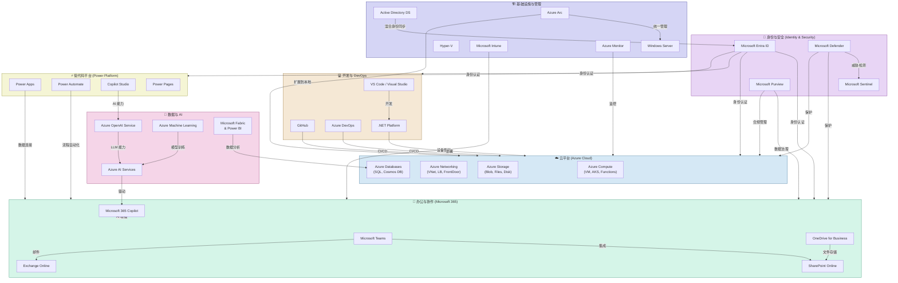

---

## 3. 身份与安全 (Identity & Security)

> 🔑 **身份是微软生态的核心枢纽。** 几乎所有微软云服务都以 Entra ID 作为身份验证基础。

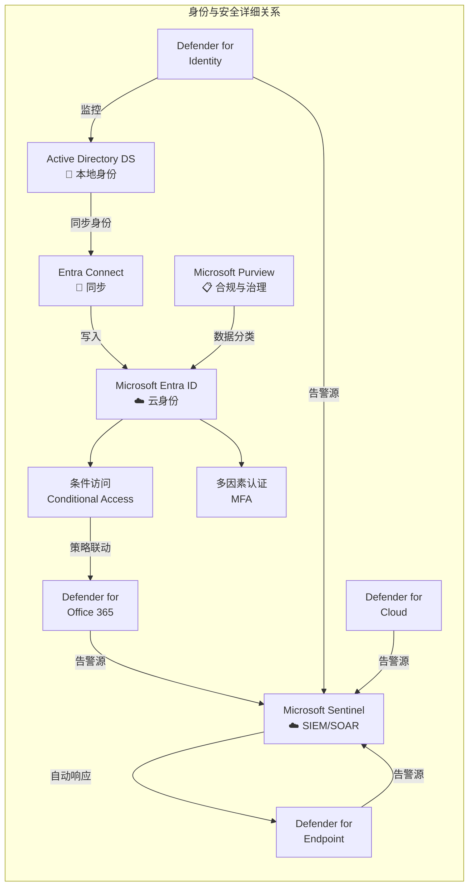

### Microsoft Entra ID (原 Azure AD)
微软云身份与访问管理平台，是**所有微软云服务的身份认证入口**。支持单点登录 (SSO)、条件访问、多因素认证 (MFA)、B2B/B2C 协作等。
- 🔗 [Microsoft Entra ID 文档](https://learn.microsoft.com/en-us/entra/identity/)
- 🔗 [Entra ID 学习路径](https://learn.microsoft.com/en-us/training/browse/?products=entra-id)

### Microsoft Defender (全家族)
微软的**统一安全防护平台**，覆盖终端 (Endpoint)、邮件 (Office 365)、身份 (Identity)、云 (Cloud) 四大领域，提供 XDR (扩展检测与响应) 能力。
- 🔗 [Microsoft Defender 文档](https://learn.microsoft.com/en-us/defender/)
- 🔗 [Defender for Endpoint 文档](https://learn.microsoft.com/en-us/defender-endpoint/)

### Microsoft Sentinel
云原生的 **SIEM (安全信息与事件管理) + SOAR (安全编排自动响应)** 平台，汇聚来自 Defender 及第三方的安全日志，利用 AI 进行威胁检测和自动化响应。
- 🔗 [Microsoft Sentinel 文档](https://learn.microsoft.com/en-us/azure/sentinel/)

### Microsoft Purview
**数据治理与合规管理平台**，统一管理数据分类、敏感信息保护、数据丢失防护 (DLP)、审计与 eDiscovery。
- 🔗 [Microsoft Purview 文档](https://learn.microsoft.com/en-us/purview/)

---

## 4. 云平台 - Azure (Cloud Platform)

> ☁️ **Azure 是微软的公有云平台**，提供 200+ 种服务，是企业混合云和数字化转型的基础。

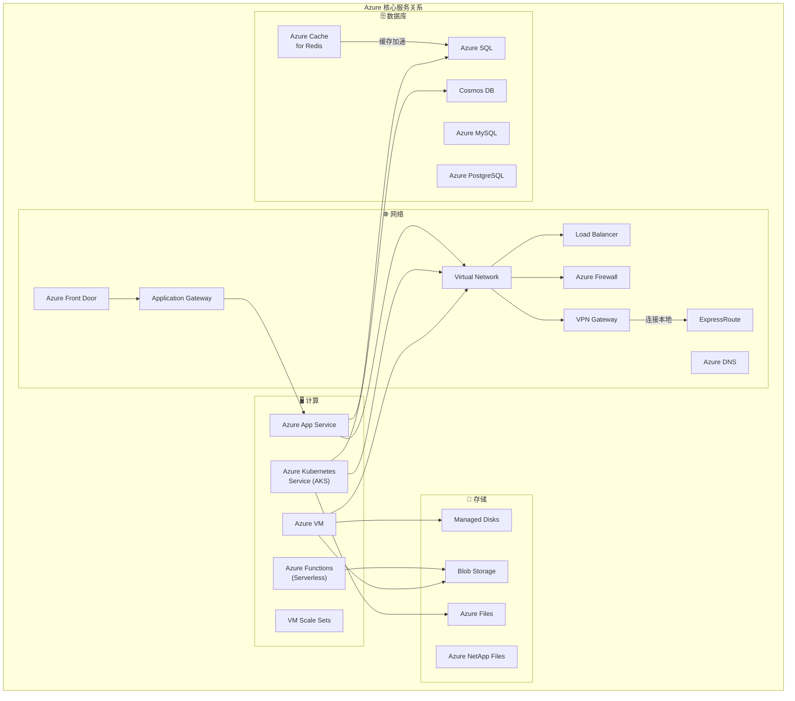

### Azure 计算服务 (Compute)
| 产品 | 简介 | 适用场景 |
|------|------|---------|
| **Azure VM** | IaaS 虚拟机，完全控制操作系统 | 传统应用迁移、自定义环境 |
| **Azure Kubernetes Service (AKS)** | 托管的 Kubernetes 容器编排服务 | 微服务架构、容器化应用 |
| **Azure Functions** | 无服务器计算，按事件触发执行 | 事件驱动、轻量级 API |
| **Azure App Service** | PaaS Web 应用托管 | Web API、Web App 快速部署 |

- 🔗 [Azure 计算文档](https://learn.microsoft.com/en-us/azure/virtual-machines/)
- 🔗 [AKS 文档](https://learn.microsoft.com/en-us/azure/aks/)
- 🔗 [Azure Functions 文档](https://learn.microsoft.com/en-us/azure/azure-functions/)

### Azure 网络服务 (Networking)
| 产品 | 简介 | 适用场景 |
|------|------|---------|
| **Virtual Network (VNet)** | Azure 中的私有网络，所有资源的网络基础 | 所有需要网络隔离的场景 |
| **Azure Load Balancer** | L4 负载均衡 | 高可用后端服务 |
| **Azure Front Door** | 全球 L7 负载均衡 + CDN + WAF | 全球加速、Web 应用保护 |
| **ExpressRoute** | 专线连接本地数据中心到 Azure | 混合云高带宽低延迟互联 |
| **Azure Firewall** | 云原生网络防火墙 | 集中化网络安全策略 |

- 🔗 [Azure 网络文档](https://learn.microsoft.com/en-us/azure/networking/)
- 🔗 [VNet 文档](https://learn.microsoft.com/en-us/azure/virtual-network/)

### Azure 存储服务 (Storage)
| 产品 | 简介 | 适用场景 |
|------|------|---------|
| **Blob Storage** | 对象存储，非结构化数据 | 文件、图片、备份、大数据 |
| **Azure Files** | 完全托管的 SMB/NFS 文件共享 | 文件服务器替代、共享存储 |
| **Managed Disks** | 块存储，用于 VM 磁盘 | VM 数据盘、OS 盘 |

- 🔗 [Azure 存储文档](https://learn.microsoft.com/en-us/azure/storage/)

### Azure 数据库服务 (Database)
| 产品 | 简介 | 适用场景 |
|------|------|---------|
| **Azure SQL** | 托管的 SQL Server 关系型数据库 | 企业关系型数据 |
| **Cosmos DB** | 全球分布式多模型 NoSQL 数据库 | 全球化低延迟应用 |
| **Azure Cache for Redis** | 托管的 Redis 缓存服务 | 会话缓存、数据加速 |

- 🔗 [Azure SQL 文档](https://learn.microsoft.com/en-us/azure/azure-sql/)
- 🔗 [Cosmos DB 文档](https://learn.microsoft.com/en-us/azure/cosmos-db/)

---

## 5. 办公与协作 - Microsoft 365

> 📧 **Microsoft 365 是微软的办公生产力套件**，以 Exchange、Teams、SharePoint 为核心，加上 Office 应用和 AI Copilot。

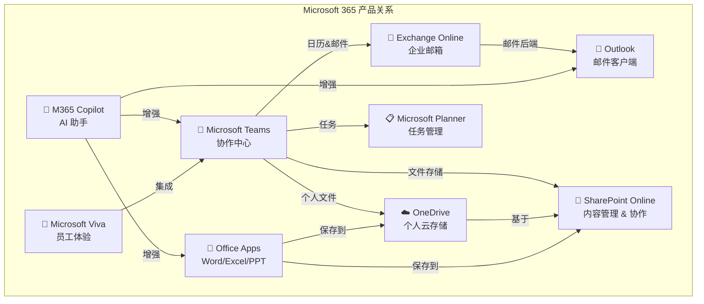

### Microsoft Teams
**统一协作平台**，集即时消息、视频会议、文件共享、应用集成于一体。是微软生态中**连接人与生产力工具的中枢**。
- 🔗 [Microsoft Teams 文档](https://learn.microsoft.com/en-us/microsoftteams/)

### Exchange Online
企业级**电子邮件和日历服务**，支持邮箱管理、邮件流规则、数据丢失防护。是 Outlook 的后端引擎。
- 🔗 [Exchange Online 文档](https://learn.microsoft.com/en-us/exchange/exchange-online)

### SharePoint Online
**企业内容管理与协作平台**，提供文档库、团队站点、企业门户。是 Teams 文件存储和 OneDrive 的底层引擎。
- 🔗 [SharePoint 文档](https://learn.microsoft.com/en-us/sharepoint/)

### OneDrive for Business
**个人云存储**，基于 SharePoint 技术，为每个用户提供 1TB+ 的云存储空间，支持文件同步和共享。
- 🔗 [OneDrive 文档](https://learn.microsoft.com/en-us/onedrive/)

### Microsoft 365 Copilot
基于 Azure OpenAI 的 **AI 助手**，深度集成到 Word、Excel、PPT、Teams、Outlook 等应用中，通过自然语言提升生产力。
- 🔗 [Microsoft 365 Copilot 文档](https://learn.microsoft.com/en-us/copilot/microsoft-365/)

---

## 6. 开发与 DevOps (Development & DevOps)

> 💻 **微软为开发者提供了从编码到部署的完整工具链**，以 Visual Studio、GitHub、Azure DevOps 和 .NET 为核心。

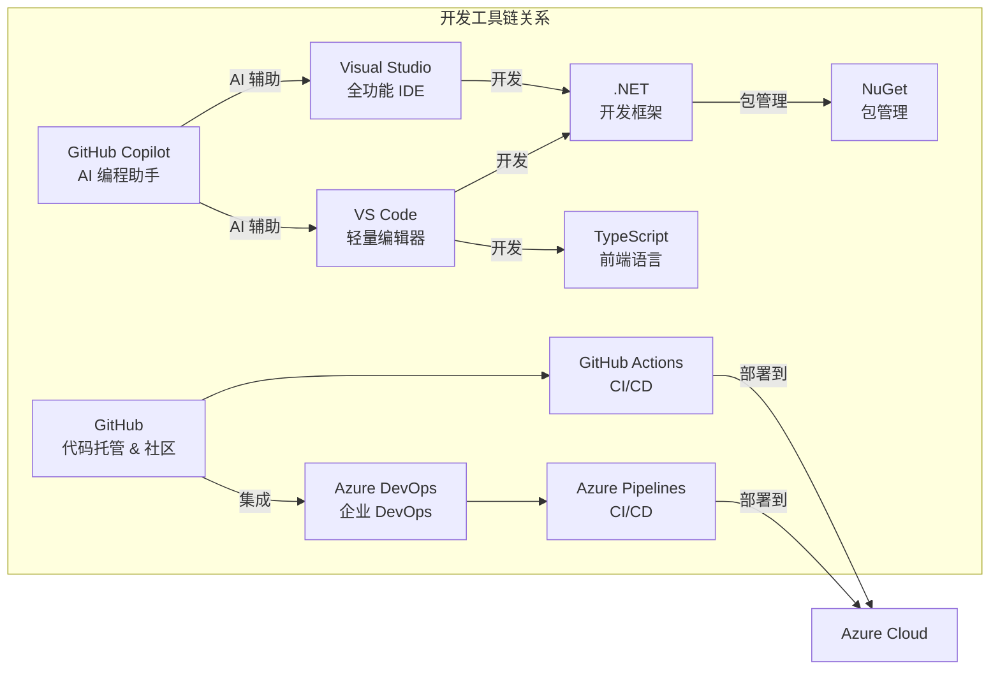

### Visual Studio / VS Code
**Visual Studio** 是微软的全功能 IDE，主力支持 .NET/C# 开发；**VS Code** 是轻量级跨平台编辑器，通过扩展支持几乎所有语言。
- 🔗 [Visual Studio 文档](https://learn.microsoft.com/en-us/visualstudio/)
- 🔗 [VS Code 文档](https://code.visualstudio.com/docs)

### GitHub
全球最大的**代码托管平台与开发者社区**，提供版本控制、代码审查、GitHub Actions (CI/CD)、GitHub Copilot (AI 编程)。
- 🔗 [GitHub 文档](https://docs.github.com/)
- 🔗 [GitHub Copilot 文档](https://docs.github.com/en/copilot)

### Azure DevOps
**企业级 DevOps 平台**，包含 Azure Repos (代码仓库)、Azure Pipelines (CI/CD)、Azure Boards (项目管理)、Azure Artifacts (包管理)。
- 🔗 [Azure DevOps 文档](https://learn.microsoft.com/en-us/azure/devops/)

### .NET Platform
微软的**跨平台开发框架**，支持 Web (ASP.NET Core)、桌面 (WPF/MAUI)、云 (Azure Functions)、移动 (MAUI) 等全栈开发。
- 🔗 [.NET 文档](https://learn.microsoft.com/en-us/dotnet/)

---

## 7. 数据与 AI (Data & AI)

> 🤖 **微软在 AI 领域的布局覆盖了从基础模型到企业应用的完整链路。**

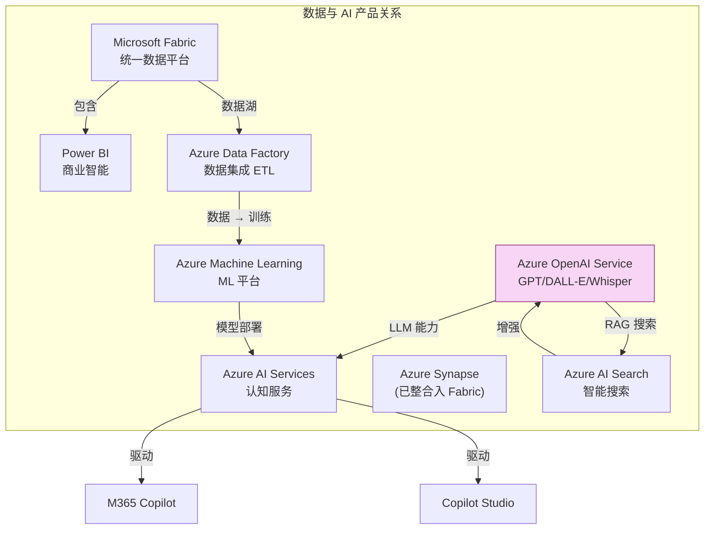

### Azure OpenAI Service
在 Azure 上托管的 **OpenAI 模型** (GPT-4o、o1、DALL-E、Whisper 等)，提供企业级安全、合规和私有部署能力。
- 🔗 [Azure OpenAI 文档](https://learn.microsoft.com/en-us/azure/ai-services/openai/)

### Azure AI Services (原 Cognitive Services)
预构建的 **AI API 集合**，包括视觉、语音、语言、决策等能力，可直接调用无需训练模型。
- 🔗 [Azure AI Services 文档](https://learn.microsoft.com/en-us/azure/ai-services/)

### Azure Machine Learning
端到端的 **ML 平台**，支持模型训练、实验跟踪、模型注册、自动化 ML、MLOps 部署。
- 🔗 [Azure ML 文档](https://learn.microsoft.com/en-us/azure/machine-learning/)

### Microsoft Fabric
**统一的数据分析平台**，整合了数据工程、数据仓库、实时分析、数据科学和 Power BI，一站式处理数据全生命周期。
- 🔗 [Microsoft Fabric 文档](https://learn.microsoft.com/en-us/fabric/)

### Power BI
**商业智能与数据可视化工具**，连接 100+ 数据源，通过交互式报表和仪表盘赋能数据驱动决策。
- 🔗 [Power BI 文档](https://learn.microsoft.com/en-us/power-bi/)

---

## 8. 低代码平台 - Power Platform

> ⚡ **Power Platform 让非开发人员也能构建应用和自动化流程**，与 Microsoft 365 和 Azure 深度集成。

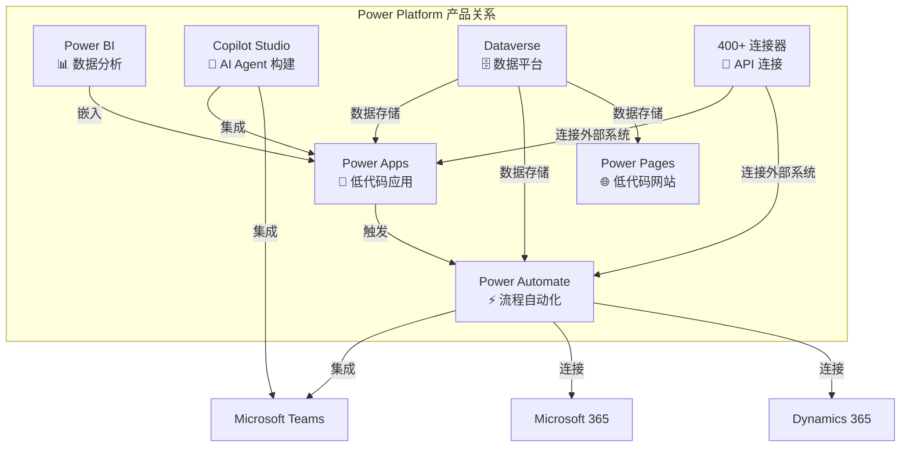

### Power Apps
**低代码/无代码应用开发平台**，快速构建业务应用 (Canvas App / Model-driven App)，连接 400+ 数据源。
- 🔗 [Power Apps 文档](https://learn.microsoft.com/en-us/power-apps/)

### Power Automate
**工作流自动化平台**，通过可视化设计器创建自动化流程 (Cloud Flow / Desktop Flow / RPA)。
- 🔗 [Power Automate 文档](https://learn.microsoft.com/en-us/power-automate/)

### Copilot Studio (原 Power Virtual Agents)
**AI Agent 构建平台**，无需编码即可创建智能对话机器人和自定义 Copilot，可调用 Azure OpenAI 和企业数据。
- 🔗 [Copilot Studio 文档](https://learn.microsoft.com/en-us/microsoft-copilot-studio/)

### Power Pages
**低代码网站构建平台**，快速创建面向外部用户的业务网站和门户。
- 🔗 [Power Pages 文档](https://learn.microsoft.com/en-us/power-pages/)

---

## 9. 基础设施与管理 (Infrastructure & Management)

> 🏗️ **从本地数据中心到混合云，微软提供了完整的基础设施管理工具链。**

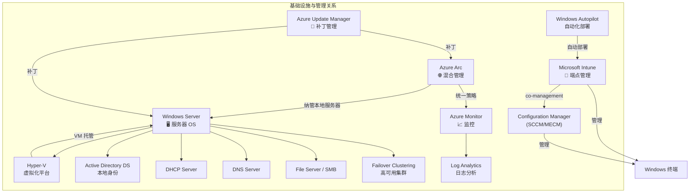

### Windows Server
微软的**服务器操作系统**，提供 AD DS、DNS、DHCP、文件服务、Hyper-V、故障转移集群等企业基础设施角色。
- 🔗 [Windows Server 文档](https://learn.microsoft.com/en-us/windows-server/)

### Hyper-V
微软的**原生虚拟化平台**，支持在 Windows Server 和 Windows 桌面上运行虚拟机。也是 Azure 计算的底层虚拟化引擎。
- 🔗 [Hyper-V 文档](https://learn.microsoft.com/en-us/windows-server/virtualization/hyper-v/)

### Active Directory Domain Services (AD DS)
**本地目录服务**，提供域认证、组策略、LDAP 等企业身份管理能力。通过 Entra Connect 可与 Entra ID 同步实现混合身份。
- 🔗 [AD DS 文档](https://learn.microsoft.com/en-us/windows-server/identity/ad-ds/)

### Microsoft Intune
云端**统一端点管理 (UEM) 平台**，管理 Windows、macOS、iOS、Android 设备的配置、应用、合规性和安全策略。
- 🔗 [Microsoft Intune 文档](https://learn.microsoft.com/en-us/mem/intune/)

### Azure Arc
将 Azure 管理平面**扩展到任何基础设施** (本地、其他云、边缘)，实现混合和多云统一管理。
- 🔗 [Azure Arc 文档](https://learn.microsoft.com/en-us/azure/azure-arc/)

### Azure Monitor
Azure 的**全栈可观测性平台**，收集和分析 metrics、logs、traces，支持告警和自动化响应。
- 🔗 [Azure Monitor 文档](https://learn.microsoft.com/en-us/azure/azure-monitor/)

---

## 10. 核心产品关系总览 (Cross-Product Integration Map)

以下图展示了微软产品之间**最关键的集成关系**：

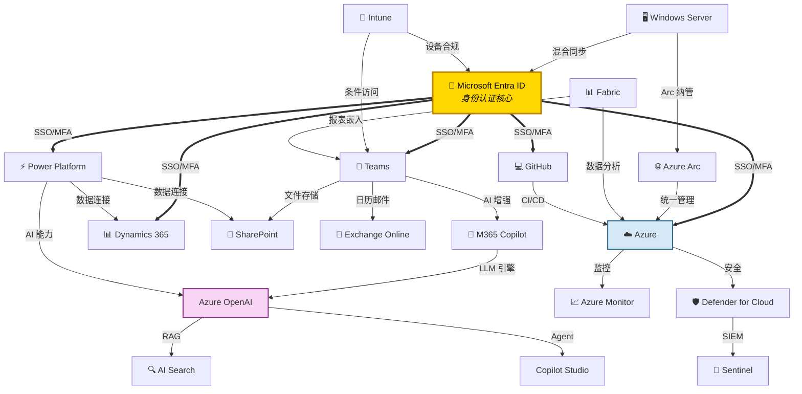

### 关键关系总结

| 关系类型 | 说明 |
|---------|------|
| **Entra ID → 所有云服务** | 统一身份认证入口，SSO + 条件访问 + MFA |
| **Azure OpenAI → Copilot 系列** | GPT 模型驱动 M365 Copilot、Copilot Studio、GitHub Copilot |
| **SharePoint → Teams + OneDrive** | SharePoint 是 Teams 文件和 OneDrive 的底层存储引擎 |
| **Defender → Sentinel** | Defender 是威胁检测前线，Sentinel 是 SIEM 大脑 |
| **AD DS → Entra ID** | 本地身份通过 Entra Connect 同步到云，实现混合身份 |
| **Azure Arc → 本地服务器** | 将 Azure 管理能力扩展到本地和多云 |
| **Power Platform → M365 + Dynamics 365** | 低代码平台连接办公数据和业务数据 |
| **GitHub/Azure DevOps → Azure** | CI/CD 管道将代码部署到 Azure 云 |
| **Fabric → Azure + Power BI** | 统一数据平台汇聚 Azure 数据并通过 Power BI 可视化 |

---

## 11. 学习路径建议 (Recommended Learning Paths)

根据你的角色选择起步方向：

### 🏗️ IT 管理员 / 基础设施工程师
1. Windows Server → AD DS → Entra ID → Intune → Azure Arc
2. 🔗 [Microsoft 365 管理员学习路径](https://learn.microsoft.com/en-us/training/browse/?products=m365)

### 🔐 安全工程师
1. Entra ID → Defender → Sentinel → Purview
2. 🔗 [安全工程师学习路径](https://learn.microsoft.com/en-us/training/browse/?roles=security-engineer)

### ☁️ 云架构师 / Azure 工程师
1. Azure Networking → Azure Compute → Azure Storage → Azure Monitor
2. 🔗 [Azure 学习路径](https://learn.microsoft.com/en-us/training/browse/?products=azure)

### 💻 开发者
1. VS Code → .NET/TypeScript → GitHub → Azure DevOps → Azure App Service
2. 🔗 [开发者学习路径](https://learn.microsoft.com/en-us/training/browse/?roles=developer)

### 📊 数据 & AI 工程师
1. Azure SQL → Microsoft Fabric → Power BI → Azure AI → Azure OpenAI
2. 🔗 [AI 工程师学习路径](https://learn.microsoft.com/en-us/training/browse/?roles=ai-engineer)

### ⚡ 业务分析师 / 公民开发者
1. Power BI → Power Apps → Power Automate → Copilot Studio
2. 🔗 [Power Platform 学习路径](https://learn.microsoft.com/en-us/training/browse/?products=power-platform)

---

## 12. 参考资料 (References)

- [Azure 文档首页](https://learn.microsoft.com/en-us/azure/) — Azure 所有服务的官方文档入口
- [Microsoft 365 文档](https://learn.microsoft.com/en-us/microsoft-365/) — M365 套件官方文档
- [Microsoft Entra ID 文档](https://learn.microsoft.com/en-us/entra/identity/) — 身份与访问管理
- [Microsoft Defender 文档](https://learn.microsoft.com/en-us/defender/) — 安全防护全家族
- [Microsoft Sentinel 文档](https://learn.microsoft.com/en-us/azure/sentinel/) — 云原生 SIEM
- [Power Platform 文档](https://learn.microsoft.com/en-us/power-platform/) — 低代码平台
- [Windows Server 文档](https://learn.microsoft.com/en-us/windows-server/) — 服务器操作系统
- [Azure DevOps 文档](https://learn.microsoft.com/en-us/azure/devops/) — 企业 DevOps
- [Microsoft Intune 文档](https://learn.microsoft.com/en-us/mem/intune/) — 端点管理
- [Azure Monitor 文档](https://learn.microsoft.com/en-us/azure/azure-monitor/) — 可观测性平台
- [Azure AI Services 文档](https://learn.microsoft.com/en-us/azure/ai-services/) — AI 服务
- [Cosmos DB 文档](https://learn.microsoft.com/en-us/azure/cosmos-db/) — 全球分布式数据库
- [Microsoft Learn 培训平台](https://learn.microsoft.com/en-us/training/) — 免费官方培训课程

---

---

# Deep Dive: Microsoft Product Ecosystem Navigation Map

**Topic:** Microsoft Product Ecosystem  
**Category:** Cloud / Enterprise IT  
**Level:** Beginner ~ Intermediate  
**Last Updated:** 2026-03-25

---

## 1. Overview

Microsoft's product ecosystem is one of the largest and most tightly integrated enterprise IT platforms in the world. From cloud computing (Azure), productivity & collaboration (Microsoft 365), security (Defender/Sentinel), development tools (Visual Studio/GitHub), to data & AI (Azure AI Services), Microsoft products cover virtually every layer of modern IT.

Understanding the **relationships between products** is more important than knowing any single product — because Microsoft's core competitive advantage is **deep integration**. For example, Microsoft Entra ID serves as the identity backbone for nearly all Microsoft cloud services, Azure Monitor provides observability across the entire cloud platform, and Power Platform extends Microsoft 365's data capabilities into the low-code development space.

This article uses **visual relationship diagrams + brief product introductions + learning resource links** to help you quickly build a holistic understanding of the Microsoft product ecosystem.

---

## 2. Product Ecosystem Overview

The following diagram shows the **seven core pillars** of Microsoft's product ecosystem and their relationships:

```mermaid
graph TB
    subgraph IDENTITY["🔐 Identity & Security"]
        EntraID["Microsoft Entra ID"]
        Defender["Microsoft Defender"]
        Sentinel["Microsoft Sentinel"]
        Purview["Microsoft Purview"]
    end

    subgraph CLOUD["☁️ Azure Cloud Platform"]
        AzureCompute["Azure Compute<br/>(VM, AKS, Functions)"]
        AzureNetwork["Azure Networking<br/>(VNet, LB, FrontDoor)"]
        AzureStorage["Azure Storage<br/>(Blob, Files, Disk)"]
        AzureDB["Azure Databases<br/>(SQL, Cosmos DB)"]
    end

    subgraph M365["📧 Productivity & Collaboration (M365)"]
        Teams["Microsoft Teams"]
        SharePoint["SharePoint Online"]
        Exchange["Exchange Online"]
        OneDrive["OneDrive for Business"]
        Copilot365["Microsoft 365 Copilot"]
    end

    subgraph DEV["💻 Development & DevOps"]
        VSCode["VS Code / Visual Studio"]
        GitHub["GitHub"]
        AzureDevOps["Azure DevOps"]
        DotNet[".NET Platform"]
    end

    subgraph DATA_AI["🤖 Data & AI"]
        AzureAI["Azure AI Services"]
        AzureOpenAI["Azure OpenAI Service"]
        AzureML["Azure Machine Learning"]
        FabricPBI["Microsoft Fabric<br/>& Power BI"]
    end

    subgraph POWER["⚡ Low-Code (Power Platform)"]
        PowerApps["Power Apps"]
        PowerAutomate["Power Automate"]
        CopilotStudio["Copilot Studio"]
        PowerPages["Power Pages"]
    end

    subgraph INFRA["🏗️ Infrastructure & Management"]
        WinServer["Windows Server"]
        HyperV["Hyper-V"]
        ADDS["Active Directory DS"]
        Intune["Microsoft Intune"]
        AzureArc["Azure Arc"]
        AzureMonitor["Azure Monitor"]
    end

    %% Core relationships
    EntraID -->|"Authentication"| M365
    EntraID -->|"Authentication"| CLOUD
    EntraID -->|"Authentication"| POWER
    EntraID -->|"Authentication"| DEV

    Defender -->|"Threat detection"| Sentinel
    Defender -->|"Protection"| M365
    Defender -->|"Protection"| CLOUD
    Purview -->|"Data governance"| M365
    Purview -->|"Compliance"| CLOUD

    ADDS -->|"Hybrid identity sync"| EntraID
    AzureArc -->|"Unified management"| WinServer
    AzureArc -->|"Extends to on-prem"| CLOUD
    Intune -->|"Device management"| M365
    AzureMonitor -->|"Monitoring"| CLOUD

    Teams -->|"Integration"| SharePoint
    Teams -->|"Email"| Exchange
    OneDrive -->|"File storage"| SharePoint
    Copilot365 -->|"AI enhancement"| M365

    PowerApps -->|"Data connection"| M365
    PowerAutomate -->|"Workflow automation"| M365
    CopilotStudio -->|"AI capability"| AzureOpenAI

    GitHub -->|"CI/CD"| CLOUD
    AzureDevOps -->|"CI/CD"| CLOUD
    VSCode -->|"Development"| DotNet
    DotNet -->|"Deployment"| CLOUD

    AzureAI -->|"Powers"| Copilot365
    AzureOpenAI -->|"LLM capability"| AzureAI
    FabricPBI -->|"Data analytics"| AzureDB
    AzureML -->|"Model training"| AzureAI

    style IDENTITY fill:#e8d5f5,stroke:#7b2d8e
    style CLOUD fill:#d5e8f5,stroke:#2d6b8e
    style M365 fill:#d5f5e8,stroke:#2d8e6b
    style DEV fill:#f5e8d5,stroke:#8e6b2d
    style DATA_AI fill:#f5d5e8,stroke:#8e2d6b
    style POWER fill:#f5f5d5,stroke:#8e8e2d
    style INFRA fill:#d5d5f5,stroke:#2d2d8e
```

---

## 3. Identity & Security

> 🔑 **Identity is the central hub of the Microsoft ecosystem.** Nearly all Microsoft cloud services use Entra ID as their authentication foundation.

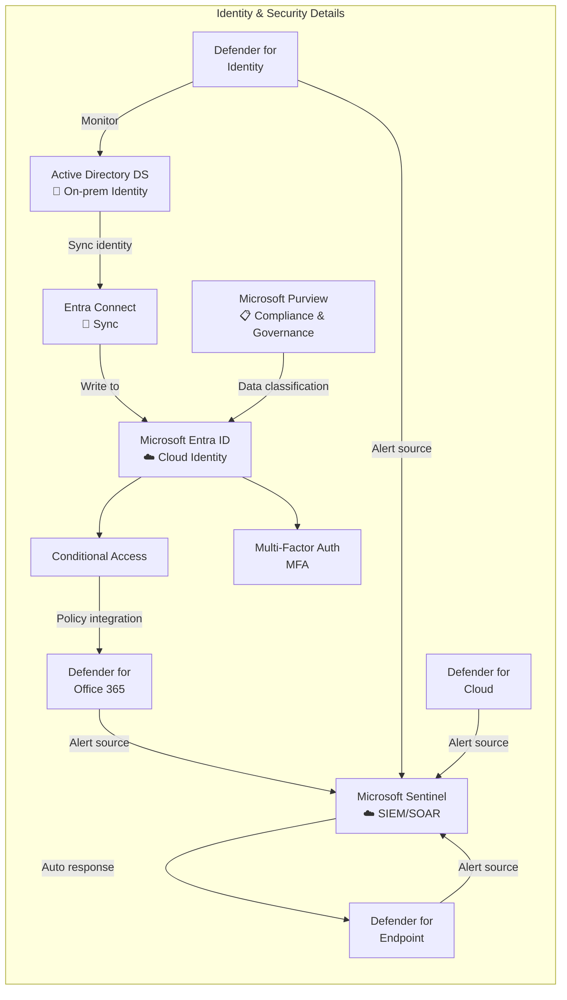

### Microsoft Entra ID (formerly Azure AD)
Microsoft's cloud identity and access management platform, serving as the **authentication gateway for all Microsoft cloud services**. Supports SSO, Conditional Access, MFA, B2B/B2C collaboration.
- 🔗 [Microsoft Entra ID docs](https://learn.microsoft.com/en-us/entra/identity/)
- 🔗 [Entra ID learning paths](https://learn.microsoft.com/en-us/training/browse/?products=entra-id)

### Microsoft Defender (Family)
Microsoft's **unified security protection platform**, covering Endpoint, Office 365, Identity, and Cloud. Provides XDR (Extended Detection and Response) capabilities.
- 🔗 [Microsoft Defender docs](https://learn.microsoft.com/en-us/defender/)

### Microsoft Sentinel
Cloud-native **SIEM + SOAR** platform that aggregates security logs from Defender and third-party sources, using AI for threat detection and automated response.
- 🔗 [Microsoft Sentinel docs](https://learn.microsoft.com/en-us/azure/sentinel/)

### Microsoft Purview
**Data governance and compliance platform** for unified data classification, sensitive information protection, DLP, audit, and eDiscovery.
- 🔗 [Microsoft Purview docs](https://learn.microsoft.com/en-us/purview/)

---

## 4. Cloud Platform - Azure

> ☁️ **Azure is Microsoft's public cloud platform**, offering 200+ services as the foundation for enterprise hybrid cloud and digital transformation.

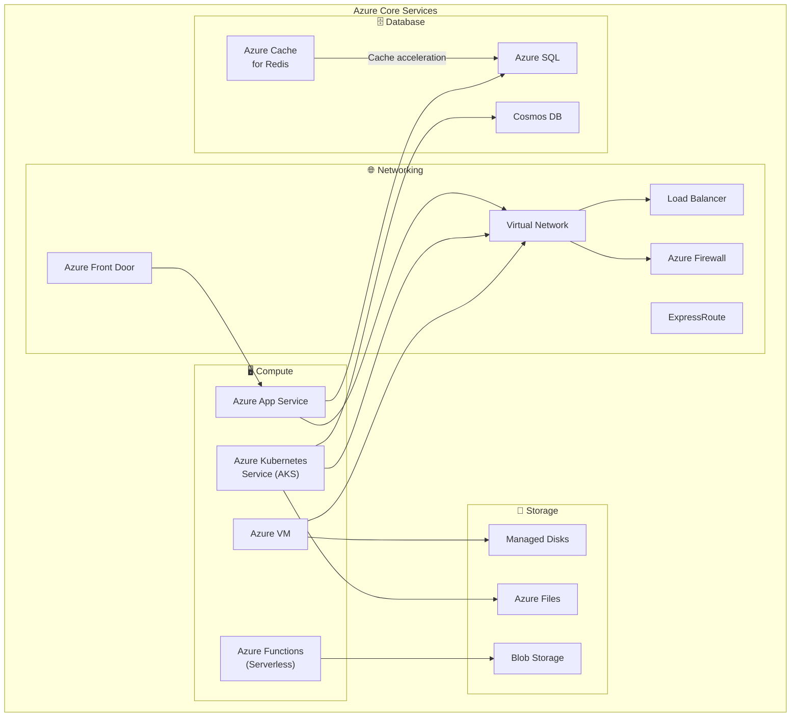

### Azure Compute
| Product | Description | Use Case |
|---------|-------------|----------|
| **Azure VM** | IaaS VMs with full OS control | Legacy app migration, custom environments |
| **AKS** | Managed Kubernetes container orchestration | Microservices, containerized apps |
| **Azure Functions** | Serverless, event-driven compute | Event processing, lightweight APIs |
| **Azure App Service** | PaaS web app hosting | Web APIs, web app rapid deployment |

- 🔗 [Azure Compute docs](https://learn.microsoft.com/en-us/azure/virtual-machines/)
- 🔗 [AKS docs](https://learn.microsoft.com/en-us/azure/aks/)

### Azure Networking
| Product | Description | Use Case |
|---------|-------------|----------|
| **Virtual Network** | Private network in Azure | Network isolation for all resources |
| **Azure Front Door** | Global L7 load balancing + CDN + WAF | Global acceleration, web app protection |
| **ExpressRoute** | Dedicated connection to on-premises | Hybrid cloud high-bandwidth connectivity |
| **Azure Firewall** | Cloud-native network firewall | Centralized network security policies |

- 🔗 [Azure Networking docs](https://learn.microsoft.com/en-us/azure/networking/)

### Azure Storage
| Product | Description | Use Case |
|---------|-------------|----------|
| **Blob Storage** | Object storage for unstructured data | Files, images, backups, big data |
| **Azure Files** | Fully managed SMB/NFS file shares | File server replacement, shared storage |
| **Managed Disks** | Block storage for VM disks | VM data and OS disks |

- 🔗 [Azure Storage docs](https://learn.microsoft.com/en-us/azure/storage/)

### Azure Databases
| Product | Description | Use Case |
|---------|-------------|----------|
| **Azure SQL** | Managed SQL Server relational database | Enterprise relational data |
| **Cosmos DB** | Globally distributed multi-model NoSQL | Global low-latency applications |
| **Azure Cache for Redis** | Managed Redis cache | Session caching, data acceleration |

- 🔗 [Azure SQL docs](https://learn.microsoft.com/en-us/azure/azure-sql/)
- 🔗 [Cosmos DB docs](https://learn.microsoft.com/en-us/azure/cosmos-db/)

---

## 5. Productivity & Collaboration - Microsoft 365

> 📧 **Microsoft 365 is Microsoft's productivity suite**, built around Exchange, Teams, and SharePoint, plus Office apps and AI Copilot.

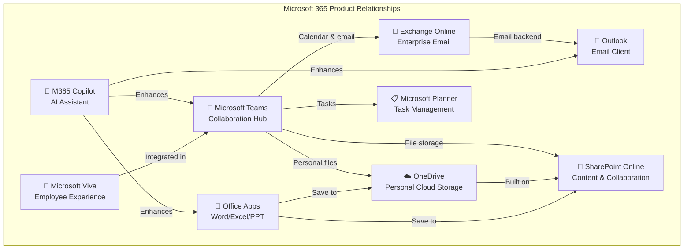

### Microsoft Teams
**Unified collaboration platform** combining instant messaging, video meetings, file sharing, and app integration. It's the **central hub connecting people and productivity tools** in the Microsoft ecosystem.
- 🔗 [Microsoft Teams docs](https://learn.microsoft.com/en-us/microsoftteams/)

### Exchange Online
Enterprise **email and calendar service** with mailbox management, mail flow rules, and DLP. It's the backend engine for Outlook.
- 🔗 [Exchange Online docs](https://learn.microsoft.com/en-us/exchange/exchange-online)

### SharePoint Online
**Enterprise content management and collaboration platform** providing document libraries, team sites, and portals. It's the underlying storage engine for Teams files and OneDrive.
- 🔗 [SharePoint docs](https://learn.microsoft.com/en-us/sharepoint/)

### OneDrive for Business
**Personal cloud storage** built on SharePoint, providing 1TB+ per user with file sync and sharing.
- 🔗 [OneDrive docs](https://learn.microsoft.com/en-us/onedrive/)

### Microsoft 365 Copilot
**AI assistant** powered by Azure OpenAI, deeply integrated into Word, Excel, PPT, Teams, and Outlook to boost productivity through natural language.
- 🔗 [Microsoft 365 Copilot docs](https://learn.microsoft.com/en-us/copilot/microsoft-365/)

---

## 6. Development & DevOps

> 💻 **Microsoft provides a complete toolchain from coding to deployment**, centered on Visual Studio, GitHub, Azure DevOps, and .NET.

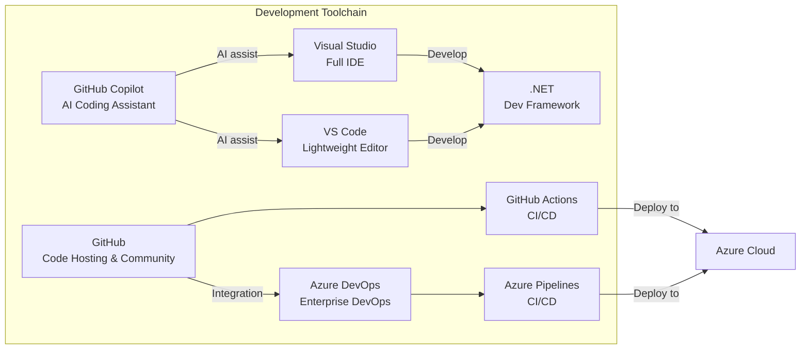

### Visual Studio / VS Code
**Visual Studio** is Microsoft's full-featured IDE for .NET/C# development; **VS Code** is a lightweight cross-platform editor supporting virtually all languages via extensions.
- 🔗 [Visual Studio docs](https://learn.microsoft.com/en-us/visualstudio/)
- 🔗 [VS Code docs](https://code.visualstudio.com/docs)

### GitHub
The world's largest **code hosting platform and developer community**, offering version control, code review, GitHub Actions (CI/CD), and GitHub Copilot (AI coding).
- 🔗 [GitHub docs](https://docs.github.com/)

### Azure DevOps
**Enterprise DevOps platform** including Azure Repos, Pipelines, Boards, and Artifacts.
- 🔗 [Azure DevOps docs](https://learn.microsoft.com/en-us/azure/devops/)

### .NET Platform
Microsoft's **cross-platform development framework** supporting Web (ASP.NET Core), Desktop (WPF/MAUI), Cloud (Azure Functions), and Mobile (MAUI).
- 🔗 [.NET docs](https://learn.microsoft.com/en-us/dotnet/)

---

## 7. Data & AI

> 🤖 **Microsoft's AI strategy spans the full stack from foundation models to enterprise applications.**

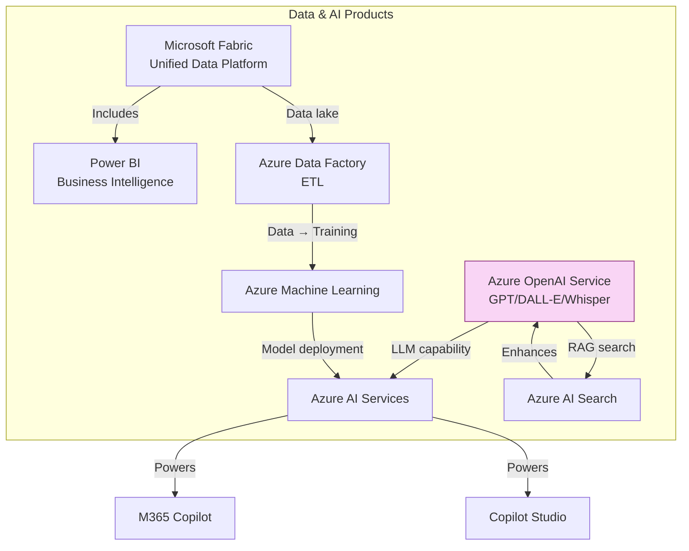

### Azure OpenAI Service
**OpenAI models hosted on Azure** (GPT-4o, o1, DALL-E, Whisper, etc.) with enterprise security, compliance, and private deployment.
- 🔗 [Azure OpenAI docs](https://learn.microsoft.com/en-us/azure/ai-services/openai/)

### Azure AI Services (formerly Cognitive Services)
Pre-built **AI API collection** including Vision, Speech, Language, and Decision capabilities — call directly without training.
- 🔗 [Azure AI Services docs](https://learn.microsoft.com/en-us/azure/ai-services/)

### Azure Machine Learning
End-to-end **ML platform** for model training, experiment tracking, model registry, AutoML, and MLOps deployment.
- 🔗 [Azure ML docs](https://learn.microsoft.com/en-us/azure/machine-learning/)

### Microsoft Fabric
**Unified analytics platform** integrating data engineering, data warehouse, real-time analytics, data science, and Power BI.
- 🔗 [Microsoft Fabric docs](https://learn.microsoft.com/en-us/fabric/)

### Power BI
**Business intelligence and data visualization tool** connecting 100+ data sources for interactive reports and dashboards.
- 🔗 [Power BI docs](https://learn.microsoft.com/en-us/power-bi/)

---

## 8. Low-Code Platform - Power Platform

> ⚡ **Power Platform enables non-developers to build apps and automate workflows**, deeply integrated with Microsoft 365 and Azure.

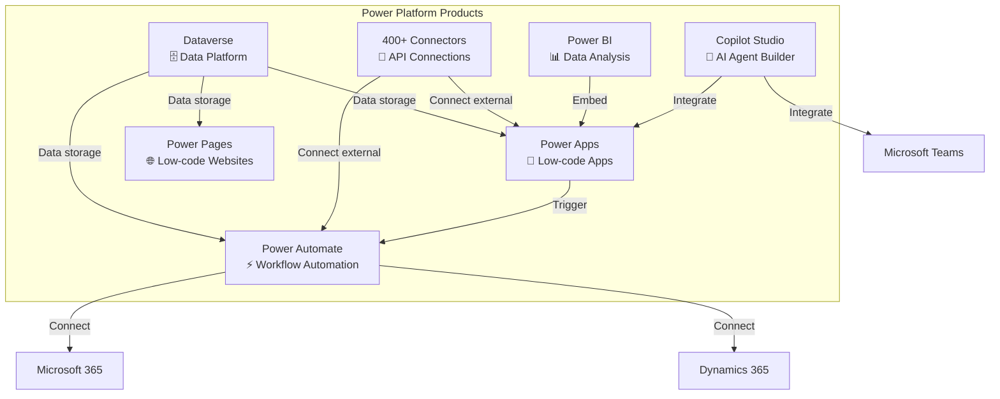

### Power Apps
**Low-code/no-code app development platform** for rapidly building business apps (Canvas/Model-driven) connected to 400+ data sources.
- 🔗 [Power Apps docs](https://learn.microsoft.com/en-us/power-apps/)

### Power Automate
**Workflow automation platform** using visual designer to create flows (Cloud/Desktop/RPA).
- 🔗 [Power Automate docs](https://learn.microsoft.com/en-us/power-automate/)

### Copilot Studio (formerly Power Virtual Agents)
**AI Agent builder platform** — create intelligent chatbots and custom Copilots without code, leveraging Azure OpenAI and enterprise data.
- 🔗 [Copilot Studio docs](https://learn.microsoft.com/en-us/microsoft-copilot-studio/)

### Power Pages
**Low-code website builder** for quickly creating external-facing business websites and portals.
- 🔗 [Power Pages docs](https://learn.microsoft.com/en-us/power-pages/)

---

## 9. Infrastructure & Management

> 🏗️ **From on-premises data centers to hybrid cloud, Microsoft provides a complete infrastructure management toolchain.**

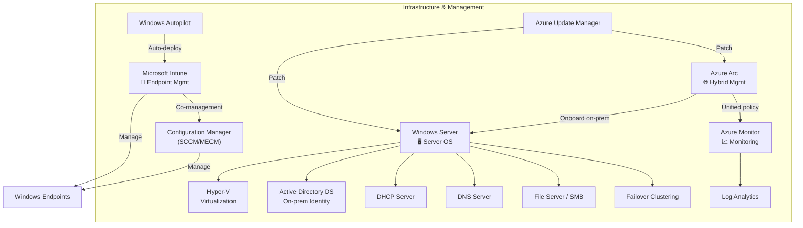

### Windows Server
Microsoft's **server operating system** providing AD DS, DNS, DHCP, File Services, Hyper-V, Failover Clustering, and more.
- 🔗 [Windows Server docs](https://learn.microsoft.com/en-us/windows-server/)

### Hyper-V
Microsoft's **native virtualization platform** for running VMs on Windows Server and Windows desktop. Also the underlying hypervisor for Azure compute.
- 🔗 [Hyper-V docs](https://learn.microsoft.com/en-us/windows-server/virtualization/hyper-v/)

### Active Directory Domain Services (AD DS)
**On-premises directory service** providing domain authentication, Group Policy, and LDAP. Syncs to Entra ID via Entra Connect for hybrid identity.
- 🔗 [AD DS docs](https://learn.microsoft.com/en-us/windows-server/identity/ad-ds/)

### Microsoft Intune
Cloud-based **unified endpoint management (UEM)** platform managing Windows, macOS, iOS, and Android device configuration, apps, compliance, and security.
- 🔗 [Microsoft Intune docs](https://learn.microsoft.com/en-us/mem/intune/)

### Azure Arc
Extends the Azure management plane to **any infrastructure** (on-premises, other clouds, edge) for unified hybrid and multi-cloud management.
- 🔗 [Azure Arc docs](https://learn.microsoft.com/en-us/azure/azure-arc/)

### Azure Monitor
Azure's **full-stack observability platform** collecting and analyzing metrics, logs, and traces with alerting and automated response.
- 🔗 [Azure Monitor docs](https://learn.microsoft.com/en-us/azure/azure-monitor/)

---

## 10. Cross-Product Integration Map

The following diagram shows the **most critical integration relationships** across Microsoft products:

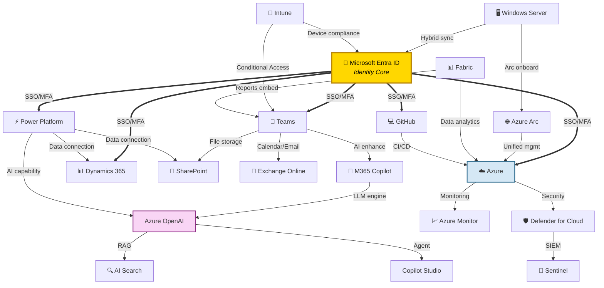

### Key Relationship Summary

| Relationship | Description |
|-------------|-------------|
| **Entra ID → All Cloud Services** | Unified identity gateway — SSO + Conditional Access + MFA |
| **Azure OpenAI → Copilot Family** | GPT models power M365 Copilot, Copilot Studio, GitHub Copilot |
| **SharePoint → Teams + OneDrive** | SharePoint is the underlying storage engine for Teams files and OneDrive |
| **Defender → Sentinel** | Defender is the frontline threat detector; Sentinel is the SIEM brain |
| **AD DS → Entra ID** | On-prem identity syncs to cloud via Entra Connect for hybrid identity |
| **Azure Arc → On-prem Servers** | Extends Azure management to on-prem and multi-cloud |
| **Power Platform → M365 + Dynamics 365** | Low-code platform connects productivity and business data |
| **GitHub/Azure DevOps → Azure** | CI/CD pipelines deploy code to Azure cloud |
| **Fabric → Azure + Power BI** | Unified data platform aggregates Azure data and visualizes via Power BI |

---

## 11. Recommended Learning Paths

Choose your starting point based on your role:

### 🏗️ IT Admin / Infrastructure Engineer
1. Windows Server → AD DS → Entra ID → Intune → Azure Arc
2. 🔗 [M365 Admin learning paths](https://learn.microsoft.com/en-us/training/browse/?products=m365)

### 🔐 Security Engineer
1. Entra ID → Defender → Sentinel → Purview
2. 🔗 [Security Engineer learning paths](https://learn.microsoft.com/en-us/training/browse/?roles=security-engineer)

### ☁️ Cloud Architect / Azure Engineer
1. Azure Networking → Compute → Storage → Monitor
2. 🔗 [Azure learning paths](https://learn.microsoft.com/en-us/training/browse/?products=azure)

### 💻 Developer
1. VS Code → .NET/TypeScript → GitHub → Azure DevOps → Azure App Service
2. 🔗 [Developer learning paths](https://learn.microsoft.com/en-us/training/browse/?roles=developer)

### 📊 Data & AI Engineer
1. Azure SQL → Microsoft Fabric → Power BI → Azure AI → Azure OpenAI
2. 🔗 [AI Engineer learning paths](https://learn.microsoft.com/en-us/training/browse/?roles=ai-engineer)

### ⚡ Business Analyst / Citizen Developer
1. Power BI → Power Apps → Power Automate → Copilot Studio
2. 🔗 [Power Platform learning paths](https://learn.microsoft.com/en-us/training/browse/?products=power-platform)

---

## 12. References

- [Azure Documentation](https://learn.microsoft.com/en-us/azure/) — Official docs for all Azure services
- [Microsoft 365 Documentation](https://learn.microsoft.com/en-us/microsoft-365/) — M365 suite official docs
- [Microsoft Entra ID Documentation](https://learn.microsoft.com/en-us/entra/identity/) — Identity and access management
- [Microsoft Defender Documentation](https://learn.microsoft.com/en-us/defender/) — Security protection family
- [Microsoft Sentinel Documentation](https://learn.microsoft.com/en-us/azure/sentinel/) — Cloud-native SIEM
- [Power Platform Documentation](https://learn.microsoft.com/en-us/power-platform/) — Low-code platform
- [Windows Server Documentation](https://learn.microsoft.com/en-us/windows-server/) — Server operating system
- [Azure DevOps Documentation](https://learn.microsoft.com/en-us/azure/devops/) — Enterprise DevOps
- [Microsoft Intune Documentation](https://learn.microsoft.com/en-us/mem/intune/) — Endpoint management
- [Azure Monitor Documentation](https://learn.microsoft.com/en-us/azure/azure-monitor/) — Observability platform
- [Azure AI Services Documentation](https://learn.microsoft.com/en-us/azure/ai-services/) — AI services
- [Cosmos DB Documentation](https://learn.microsoft.com/en-us/azure/cosmos-db/) — Globally distributed database
- [Microsoft Learn Training Platform](https://learn.microsoft.com/en-us/training/) — Free official training courses
