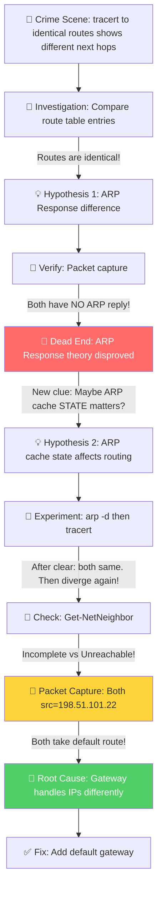

# 🔍 幽灵路由 — 一模一样的路由表，为何走了不同的路？

**Product/Service:** Windows TCP/IP Routing
**Difficulty:** ⭐⭐⭐⭐ (4/5)
**Duration:** 约 2 小时
**Key Technique:** `IppCompareRoutes()` Reachability 判定 + 上游网关对不同目标 IP 的差异化处理

---

## 🚨 案件报告 (The Crime Scene)

客户报警了："我的服务器到 `10.50.6.1` 完全不通！"

乍一看，这就是个简单的网络不可达问题。检查路由表，发现确实配错了 — 缺少一条默认网关。加上就完事了，对吧？

但就在排查的过程中，客户发现了一个**诡异的现象**：

```
C:\Users\appadmin> tracert 10.50.6.1
通过最多 30 个跃点跟踪到 10.50.6.1 的路由
  1   168-18-14-227 [10.20.11.15]   报告：无法访问目标主机。
跟踪完成。

C:\Users\appadmin> tracert 10.50.135.1
通过最多 30 个跃点跟踪到 10.50.135.1 的路由
  1   <1 毫秒   <1 毫秒   <1 毫秒   198.51.100.2
  2   *         *         *         请求超时。
  ...
```

`tracert 10.50.6.1` 的第一跳是 **10.20.11.15**（本机网卡 IP），报告"无法访问目标主机"。
`tracert 10.50.135.1` 的第一跳却是 **198.51.100.2**（上游网关），正常返回了 Time Exceeded。

但是！**打开路由表一看，这两个 IP 的路由配置是一模一样的：**

| 目标 | 掩码 | 接口 |
|------|------|------|
| 10.50.5.1 | 255.255.255.255 | 10.20.11.15 |
| 10.50.6.1 | 255.255.255.255 | 10.20.11.15 |
| 10.50.135.1 | 255.255.255.255 | 10.20.11.15 |
| 10.50.136.1 | 255.255.255.255 | 10.20.11.15 |

都是 `/32` 的 host route，都指向同一个接口 `10.20.11.15`。**配置一模一样，行为却截然不同 — 这不科学！**

> 💡 **给听众的思考题**：如果你是接案的侦探，面对"一模一样的路由配置却走了不同的路"，你会从哪里开始调查？

---

## 🔎 初步调查 (First Investigation)

### Round 1：ARP Response 假设

面对这个诡异现象，我的第一反应是从 ARP 层面推理：

- `tracert 10.50.6.1` 显示下一跳是 **10.20.11.15**（网卡自身 IP），并且报告"无法访问目标主机" — 这意味着系统尝试通过这个接口直接发送，但 **ARP 解析失败**，没人回复 ARP Request，于是本机自己生成了一个 ICMP Destination Host Unreachable。

- `tracert 10.50.135.1` 显示下一跳是 **198.51.100.2** — 这是上游设备的 IP。说明数据包不是从本地接口直接发的，而是**走了默认路由**（`0.0.0.0/0 → 198.51.100.1 via 198.51.101.22`），到达了上游网关 `198.51.100.2`。

**初步推理：** 也许 `10.50.135.1` 的 ARP Request 被某台设备回复了？如果有设备回复了 ARP Response，系统就拿到了 MAC 地址，包就能发出去。而 `10.50.6.1` 没人回复，所以发不出去。

这个推理很合理，对吧？**于是让客户抓了网络包来验证。**

---

## 🧱 遇到阻碍 (The Blocker / Dead End)

网络包一拿到手，我的假设**立刻被推翻了**。

```
# 针对 10.50.6.1 的 ARP — 全是 Request，没有任何 Reply！
17:34:22  10.20.11.15 → 10.50.6.1    ARP:Request, 10.20.11.15 asks for 10.50.6.1
17:34:22  10.20.11.15 → 10.50.6.1    ARP:Request, 10.20.11.15 asks for 10.50.6.1
17:34:23  10.20.11.15 → 10.50.6.1    ARP:Request, 10.20.11.15 asks for 10.50.6.1
17:35:24  10.20.11.15 → 10.50.6.1    ARP:Request, 10.20.11.15 asks for 10.50.6.1
17:36:25  10.20.11.15 → 10.50.6.1    ARP:Request, 10.20.11.15 asks for 10.50.6.1
...

# 针对 10.50.135.1 的 ARP — 同样全是 Request，也没有任何 Reply！
17:37:44  10.20.11.15 → 10.50.135.1  ARP:Request, 10.20.11.15 asks for 10.50.135.1
17:37:45  10.20.11.15 → 10.50.135.1  ARP:Request, 10.20.11.15 asks for 10.50.135.1
17:37:46  10.20.11.15 → 10.50.135.1  ARP:Request, 10.20.11.15 asks for 10.50.135.1
17:38:47  10.20.11.15 → 10.50.135.1  ARP:Request, 10.20.11.15 asks for 10.50.135.1
```

**两个 IP 都没有收到 ARP Reply！** 没有任何设备回复了 MAC 地址。

那我的"ARP Response 差异"假设就完全不成立了。如果两个 IP 的 ARP 行为一模一样（都是只有 Request 没有 Reply），**到底是什么导致了 tracert 结果的差异？**

案件陷入了僵局。我们知道的确有差异，但差异的根源找不到了...

> ⚠️ **关键转折点**：既然"有没有人回复 ARP"不是原因，那是不是**系统内部对 ARP 结果的记忆（Cache）**才是罪魁祸首？同样是没有回复，系统有可能用**不同的方式记住这个失败** — 也就是 ARP Cache 的状态！

---

## 💡 大胆假设 (The Hypothesis)

### 猜想：ARP Cache 的状态不同，导致了路由选择的分歧

虽然两个 IP 都没收到 ARP Reply，但 ARP Cache 里**记录"失败"的方式可能不同**。就像同样是考试没及格 — 一个是"0 分"（彻底不可达），一个是"还在答卷中"（还在尝试）。系统对这两种"失败"的处理方式可能不同。

**推理链：**
- 线索 A：tracert 结果确实不同 → 路由选择确实发生了分歧
- 线索 B：ARP 行为一模一样（都没有 Reply）→ 排除了 ARP Response 差异
- 线索 C：路由表配置一模一样 → 排除了路由表配置差异
- 排除法 → 差异只可能来自**路由选择过程中的动态状态**，最可能的就是 **ARP Cache 状态**

**如果假设成立，我们应该能看到：**
1. 清除 ARP Cache 后，两个 tracert 的行为应该**变成一致**（因为缓存状态被清空了）
2. 一段时间后，ARP Cache 重新建立，两个 tracert 的行为**再次分化**
3. `Get-NetNeighbor` 应该显示两个 IP 对应的 ARP Cache 状态**不同**

---

## 🧪 验证求证 (Verification)

### 实验 1：清除 ARP Cache

```powershell
# 清除所有 ARP Cache
arp -d *

# 立即 tracert 两个目标
tracert 10.50.6.1
tracert 10.50.135.1
```

**验证结果：** 清除 ARP Cache 后，两个 tracert **第一跳都是 10.20.11.15** — **行为完全一致！** ✅

这符合预期 — ARP Cache 清空后，没有了状态差异，系统对两个 IP 的处理方式完全相同。

### 实验 2：等待分化

再次执行：

```powershell
tracert 10.50.6.1    # → 下一跳: 10.20.11.15 （未变）
tracert 10.50.135.1  # → 下一跳: 198.51.100.2 （变了！走了默认路由！）
```

**果然分化了！** 第二轮 tracert 中，`10.50.135.1` 又走了默认路由。

### 实验 3：检查 ARP Cache 状态

```powershell
Get-NetNeighbor | Format-List * | Out-File -FilePath C:\netneighbor_detail.txt -Encoding UTF8
```

**关键发现：** ARP Cache 中两个 IP 的状态不同：

| 目标 IP | ARP Cache 状态 |
|---------|---------------|
| 10.50.6.1 | **Incomplete** |
| 10.50.135.1 | **Unreachable** |

状态确实不同！但这两种"失败"状态到底对路由选择有什么影响？还需要进一步验证。

---

## 🎯 真相大白 (The Resolution)

### "作案手法" — Windows 路由选择的隐藏逻辑

Windows 选择路由时，内部使用 `IppCompareRoutes()` 函数，按以下**严格优先级**逐项 PK：

```
Reachability > Prefix Length > Dead Gateway > Metric > ECMP Hash
```

注意！**Reachability（可达性）排在 Prefix Length（最长前缀）前面！**

不管 ARP Cache 状态是 `Incomplete` 还是 `Unreachable`，host route 对应的下一跳都**没有可用的 MAC 地址**，都算不可达。因此 `IppCompareRoutes()` 在第一轮 Reachability PK 中就**淘汰了 /32 host route**，两个 IP 最终**都走了默认路由**：

```
两个 IP 的路由选择过程完全一致：

路由候选：/32 host route via 10.20.11.15 (ARP=Incomplete 或 Unreachable)
          /0  default route via 198.51.100.1

PK Round 1 - Reachability:
  /32 route: ARP 失败（不管是 Incomplete 还是 Unreachable）→ 不可达 → ❌ 淘汰
  /0  route: 默认网关可达 → ✅ 胜出

结果：两个 IP 都走默认路由 → 198.51.100.1 → 到达上游网关 198.51.100.2
```

### Root Cause — "凶手"是谁？

**真正的"凶手"不在 Windows 客户端，而在上游网关 `198.51.100.2`！**

网络包证实了这一点 — 两个 IP 的数据包**源地址都是 `198.51.101.22`（默认路由网卡）**，证明都走了默认路由。但上游网关对它们的处理截然不同：

```
# 针对 10.50.6.1 — 网关静默丢弃，不回复任何消息
198.51.101.22 → 10.50.6.1  ICMP Echo Request  （无回复）
198.51.101.22 → 10.50.6.1  ICMP Echo Request  （无回复）
198.51.101.22 → 10.50.6.1  ICMP Echo Request  （无回复）

# 针对 10.50.135.1 — 网关正常处理，回复 Time Exceeded
198.51.101.22 → 10.50.135.1  ICMP Echo Request
198.51.100.2  → 198.51.101.22  ICMP Time Exceeded  ← 网关有回复！
198.51.101.22 → 10.50.135.1  ICMP Echo Request
198.51.100.2  → 198.51.101.22  ICMP Time Exceeded  ← 网关有回复！
```

**这就是 tracert 结果不同的真正原因：**

- `tracert 10.50.135.1`：包走默认路由 → 到达网关 `198.51.100.2` → 网关正常回复 **ICMP Time Exceeded** → tracert 显示 `198.51.100.2` 作为第一跳 ✅
- `tracert 10.50.6.1`：包走默认路由 → 到达网关 `198.51.100.2` → 网关**静默丢弃** → 没有任何回复 → tracert 显示本机 `10.20.11.15` 报告"无法访问目标主机" ❌

**用人话说：** 两封信都寄出去了，都经过了同一个邮局（默认网关）。只不过邮局对一封信正常处理（退回了"查无此人"），对另一封信直接扔进了碎纸机（静默丢弃）。寄信人看到的结果不同，但问题不在寄信人身上 — 在邮局。

网关静默丢弃的可能原因包括：ACL/防火墙规则、路由黑洞、或策略路由差异。**这已经不是 Windows 客户端的问题了。**

### 解决方案

原始问题（网络不可达）的修复很简单：

```powershell
# 为缺少默认网关的路由添加正确的网关配置
route add 0.0.0.0 mask 0.0.0.0 198.51.100.1 -p
```

添加默认网关后，所有流量都能正常通过网关转发出去。

---

## 📋 案件复盘 (Case Review)

### 🗺️ 排查路径可视化



### 🎒 Takeaways

1. **技术知识**：Windows 路由选择中，`IppCompareRoutes()` 的 **Reachability 优先于 Prefix Length**。当 ARP Cache 显示下一跳不可达时（不管是 `Incomplete` 还是 `Unreachable`），host route 在 Reachability PK 中都会被淘汰，流量会 fallback 到默认路由。
2. **排查方法**：当 tracert 显示不同下一跳时，不要只盯着本地路由表 — 先用**抓包确认数据包的源 IP**，判断实际走的是哪条路由。tracert 显示的"第一跳"可能是上游设备回复的 ICMP，而不是路由选择的结果。
3. **经验法则**：`arp -d` 清除缓存 + `Get-NetNeighbor` 查看状态，是排查"路由行为异常"时的标准动作。即使最终发现问题不在 ARP Cache，这个过程也能快速缩小排查范围。
4. **踩坑提醒**：tracert 结果不同 ≠ 路由选择不同。上游网关对不同目标 IP 的处理策略（ACL、路由黑洞、策略路由）也会导致 tracert 结果截然不同，但实际上本地的路由选择可能是一致的。

### 🔧 工具箱 (Useful Commands & Tools)

| 命令/工具 | 用途 | 在本案中的作用 |
|----------|------|--------------|
| `tracert <IP>` | 追踪路由路径 | 发现了两个 IP 显示不同的下一跳，触发了调查 |
| `Get-NetNeighbor \| Format-List *` | 查看完整 ARP Cache（含状态） | 揭示了 Incomplete vs Unreachable 的状态差异 |
| `arp -d *` | 清除所有 ARP Cache | 验证了 ARP Cache 状态对行为有影响 |
| `route print` | 查看路由表 | 确认两个 IP 的路由配置完全一致 |
| Network Monitor / Wireshark | 网络包抓取 | 推翻了 ARP Response 假设，验证了默认路由行为 |

### 📚 References

- [ARP Caching Behavior in Windows TCP/IP (KB949589)](https://learn.microsoft.com/troubleshoot/windows-server/networking/address-resolution-protocol-arp-caching-behavior) — Windows ARP 缓存行为的官方说明，包含 Neighbor Cache 状态机
- [How to use TRACERT to troubleshoot TCP/IP problems](https://learn.microsoft.com/troubleshoot/windows-server/networking/trace-route-troubleshoot-tcp-ip-problems) — tracert 使用指南
- [Get-NetNeighbor PowerShell](https://learn.microsoft.com/powershell/module/nettcpip/get-netneighbor) — Get-NetNeighbor cmdlet 参考
- [Routing Table (Windows RRAS)](https://learn.microsoft.com/windows/win32/rras/routing-table) — Windows 路由表数据结构参考

---

## 📝 一句话破案总结 (One-liner)

> 客户发现路由表配置一模一样的两个 IP，tracert 却显示了不同的下一跳。排查发现两个 IP 实际上**都走了默认路由**（抓包源 IP 一致），tracert 显示不同是因为**上游网关对这两个目标 IP 的处理策略不同** — 一个正常回复 Time Exceeded，一个静默丢弃。**看似路由选择的问题，真相却在上游设备。**

---
---

# 🔍 The Phantom Route — Why Identical Routes Led to Different Destinations

**Product/Service:** Windows TCP/IP Routing
**Difficulty:** ⭐⭐⭐⭐ (4/5)
**Duration:** ~2 hours
**Key Technique:** `IppCompareRoutes()` Reachability evaluation + upstream gateway differential handling of destination IPs

---

## 🚨 The Crime Scene

The customer called in: "My server can't reach `10.50.6.1` at all!"

At first glance, a straightforward network unreachability issue. Check the route table — yep, misconfigured, missing a default gateway. Add it and done, right?

But during the investigation, the customer stumbled upon a **bizarre behavior**:

```
C:\Users\appadmin> tracert 10.50.6.1
Tracing route to 10.50.6.1 over a maximum of 30 hops
  1   168-18-14-227 [10.20.11.15]   reports: Destination host unreachable.
Trace complete.

C:\Users\appadmin> tracert 10.50.135.1
Tracing route to 10.50.135.1 over a maximum of 30 hops
  1   <1 ms   <1 ms   <1 ms   198.51.100.2
  2   *        *        *       Request timed out.
  ...
```

`tracert 10.50.6.1` — first hop is **10.20.11.15** (the local NIC IP), reporting "Destination host unreachable."
`tracert 10.50.135.1` — first hop is **198.51.100.2** (an upstream gateway), returning a normal Time Exceeded.

But here's the twist: **the route table entries for both IPs are IDENTICAL:**

| Destination | Mask | Interface |
|-------------|------|-----------|
| 10.50.5.1 | 255.255.255.255 | 10.20.11.15 |
| 10.50.6.1 | 255.255.255.255 | 10.20.11.15 |
| 10.50.135.1 | 255.255.255.255 | 10.20.11.15 |
| 10.50.136.1 | 255.255.255.255 | 10.20.11.15 |

All `/32` host routes, all pointing to the same interface `10.20.11.15`. **Same config, different behavior — something doesn't add up!**

> 💡 **Think about it**: If you were the detective on this case, where would you start investigating "identical route config but different routing behavior"?

---

## 🔎 First Investigation

### Round 1: The ARP Response Hypothesis

My first instinct was to reason from the ARP layer:

- `tracert 10.50.6.1` shows **10.20.11.15** (local NIC) with "Destination host unreachable" → The system tried to send directly via this interface, ARP resolution failed (no one replied), so Windows generated a local ICMP Destination Host Unreachable.

- `tracert 10.50.135.1` shows **198.51.100.2** → This is an upstream device. The packet didn't go out directly — it took the **default route** (`0.0.0.0/0 → 198.51.100.1 via 198.51.101.22`) and reached upstream gateway `198.51.100.2`.

**Initial reasoning:** Maybe some device replied to the ARP Request for `10.50.135.1`? If a device sent back an ARP Reply, the system would have a MAC address and could forward the packet. While `10.50.6.1` had no reply, so it was stuck.

Sounds logical, right? **So I asked the customer to capture network packets.**

---

## 🧱 The Blocker / Dead End

The packet capture **immediately destroyed my hypothesis**.

```
# ARP for 10.50.6.1 — All Requests, ZERO Replies!
17:34:22  10.20.11.15 → 10.50.6.1    ARP:Request, 10.20.11.15 asks for 10.50.6.1
17:34:22  10.20.11.15 → 10.50.6.1    ARP:Request, 10.20.11.15 asks for 10.50.6.1
17:34:23  10.20.11.15 → 10.50.6.1    ARP:Request, 10.20.11.15 asks for 10.50.6.1
...

# ARP for 10.50.135.1 — Also all Requests, ZERO Replies!
17:37:44  10.20.11.15 → 10.50.135.1  ARP:Request, 10.20.11.15 asks for 10.50.135.1
17:37:45  10.20.11.15 → 10.50.135.1  ARP:Request, 10.20.11.15 asks for 10.50.135.1
17:37:46  10.20.11.15 → 10.50.135.1  ARP:Request, 10.20.11.15 asks for 10.50.135.1
...
```

**Neither IP received any ARP Reply!** No device responded with a MAC address.

If both IPs had identical ARP behavior (only Requests, no Replies), **what on earth was causing the tracert difference?**

The case hit a dead end. We knew the difference existed, but the root cause had vanished...

> ⚠️ **Turning Point**: Since "whether ARP was replied to" wasn't the answer, could it be the **system's internal memory of that failure (the Cache)**? Even though both failed, the system might **remember the failure differently** — through different ARP Cache states!

---

## 💡 The Hypothesis

### Guess: Different ARP Cache states are causing a fork in route selection

Even though neither IP received an ARP Reply, the ARP Cache might **record the failure differently**. Think of it like two students who both failed an exam — one scored 0 (confirmed failure), the other's paper is still being graded (status unknown). The school treats them very differently.

**Deduction chain:**
- Clue A: tracert results ARE different → route selection IS diverging
- Clue B: ARP behavior is identical (no Replies) → eliminates ARP Response as the cause
- Clue C: Route table config is identical → eliminates static configuration as the cause
- By elimination → the difference can only come from **dynamic state during route selection**, most likely **ARP Cache state**

**If this hypothesis is correct, we should observe:**
1. After clearing ARP Cache, both tracerts should **behave identically** (cache wiped)
2. After some time, ARP Cache rebuilds and tracerts **diverge again**
3. `Get-NetNeighbor` should show **different states** for the two IPs

---

## 🧪 Verification

### Experiment 1: Clear ARP Cache

```powershell
# Clear all ARP Cache
arp -d *

# Immediately tracert both targets
tracert 10.50.6.1
tracert 10.50.135.1
```

**Result:** After clearing, both tracerts show **10.20.11.15 as the first hop — behavior is identical!** ✅

This matches our prediction — with no cached state, the system treats both IPs the same way.

### Experiment 2: Wait for divergence

Run tracert again:

```powershell
tracert 10.50.6.1    # → Next hop: 10.20.11.15 (unchanged)
tracert 10.50.135.1  # → Next hop: 198.51.100.2 (CHANGED! Took default route!)
```

**Diverged again!** On the second round, `10.50.135.1` switched to the default route.

### Experiment 3: Inspect ARP Cache states

```powershell
Get-NetNeighbor | Format-List * | Out-File -FilePath C:\netneighbor_detail.txt -Encoding UTF8
```

**Key discovery:** The two IPs have different ARP Cache states:

| Target IP | ARP Cache State |
|-----------|----------------|
| 10.50.6.1 | **Incomplete** |
| 10.50.135.1 | **Unreachable** |

The states are indeed different! But what does this actually mean for route selection? We need to dig deeper.

---

## 🎯 The Resolution

### The "Modus Operandi" — How Windows route selection really works

Windows uses `IppCompareRoutes()` internally, with this **strict priority order**:

```
Reachability > Prefix Length > Dead Gateway > Metric > ECMP Hash
```

The critical insight: **Reachability ranks ABOVE Prefix Length!**

Regardless of whether the ARP Cache state is `Incomplete` or `Unreachable`, the next hop for the host route has **no usable MAC address** — it's unreachable either way. So `IppCompareRoutes()` **eliminates the /32 host route in Round 1 of the Reachability PK**, and both IPs **end up taking the default route**:

```
Route selection is IDENTICAL for both IPs:

Candidate routes: /32 host route via 10.20.11.15 (ARP=Incomplete or Unreachable)
                  /0  default route via 198.51.100.1

PK Round 1 - Reachability:
  /32 route: ARP failed (whether Incomplete or Unreachable) → Unreachable → ❌ Eliminated
  /0  route: Default gateway reachable → ✅ Wins

Result: Both IPs take default route → 198.51.100.1 → reach upstream gateway 198.51.100.2
```

### Root Cause — The "Culprit"

**The real culprit isn't on the Windows client at all — it's the upstream gateway `198.51.100.2`!**

Packet capture proves it — both IPs have **source address `198.51.101.22` (the default route NIC)**, confirming both took the default route. But the upstream gateway treats them completely differently:

```
# For 10.50.6.1 — Gateway silently drops, no response at all
198.51.101.22 → 10.50.6.1  ICMP Echo Request  (no reply)
198.51.101.22 → 10.50.6.1  ICMP Echo Request  (no reply)
198.51.101.22 → 10.50.6.1  ICMP Echo Request  (no reply)

# For 10.50.135.1 — Gateway processes normally, responds with Time Exceeded
198.51.101.22 → 10.50.135.1  ICMP Echo Request
198.51.100.2  → 198.51.101.22  ICMP Time Exceeded  ← Gateway replies!
198.51.101.22 → 10.50.135.1  ICMP Echo Request
198.51.100.2  → 198.51.101.22  ICMP Time Exceeded  ← Gateway replies!
```

**This is the real reason behind different tracert results:**

- `tracert 10.50.135.1`: Packet takes default route → reaches gateway `198.51.100.2` → gateway replies with **ICMP Time Exceeded** → tracert shows `198.51.100.2` as hop 1 ✅
- `tracert 10.50.6.1`: Packet takes default route → reaches gateway `198.51.100.2` → gateway **silently drops** → no response → tracert shows local machine `10.20.11.15` reporting "Destination host unreachable" ❌

**In plain English:** Both letters were mailed out through the same post office (default gateway). But the post office handled them differently — one got a proper "return to sender" notice, while the other was silently shredded. The sender sees different outcomes, but the problem isn't with the sender — it's with the post office.

Possible reasons for the gateway's silent drop: ACL/firewall rules, route blackhole, or policy routing differences. **This is no longer a Windows client issue.**

### The Fix

The original issue (network unreachability) was straightforward:

```powershell
# Add the missing default gateway
route add 0.0.0.0 mask 0.0.0.0 198.51.100.1 -p
```

---

## 📋 Case Review

### 🗺️ Investigation Path


### 🎒 Takeaways

1. **Technical Knowledge**: In Windows route selection, `IppCompareRoutes()` ranks **Reachability above Prefix Length**. When ARP Cache shows the next hop as unreachable (whether `Incomplete` or `Unreachable`), the host route is eliminated in the Reachability PK, and traffic falls back to the default route.
2. **Troubleshooting Method**: When tracert shows different next hops, don't just stare at the local route table — **capture packets and check the source IP** to determine which route was actually taken. The "first hop" in tracert might be an ICMP reply from an upstream device, not a direct reflection of route selection.
3. **Rule of Thumb**: `arp -d` to clear cache + `Get-NetNeighbor` to inspect states is the standard playbook for "abnormal routing behavior." Even if the root cause turns out not to be ARP Cache, this process quickly narrows down the investigation scope.
4. **Pitfall Warning**: Different tracert results ≠ different route selection. An upstream gateway's handling policies (ACL, route blackhole, policy routing) for different destination IPs can produce completely different tracert outputs, even when the local route selection is identical.

### 🔧 Useful Commands & Tools

| Command/Tool | General Purpose | Role in This Case |
|-------------|-----------------|-------------------|
| `tracert <IP>` | Trace routing path | Revealed different next hops for identically-routed IPs, triggering the investigation |
| `Get-NetNeighbor \| Format-List *` | View detailed ARP Cache with states | Exposed the Incomplete vs Unreachable state differences |
| `arp -d *` | Clear all ARP Cache entries | Verified that ARP Cache state influences behavior |
| `route print` | Display route table | Confirmed identical route configurations |
| Network Monitor / Wireshark | Packet capture & analysis | Disproved ARP Response hypothesis; proved both IPs took default route (same source IP) |

### 📚 References

- [ARP Caching Behavior in Windows TCP/IP (KB949589)](https://learn.microsoft.com/troubleshoot/windows-server/networking/address-resolution-protocol-arp-caching-behavior) — Official documentation on Windows ARP cache behavior and Neighbor Cache state machine
- [How to use TRACERT to troubleshoot TCP/IP problems](https://learn.microsoft.com/troubleshoot/windows-server/networking/trace-route-troubleshoot-tcp-ip-problems) — TRACERT usage guide
- [Get-NetNeighbor PowerShell](https://learn.microsoft.com/powershell/module/nettcpip/get-netneighbor) — Get-NetNeighbor cmdlet reference
- [Routing Table (Windows RRAS)](https://learn.microsoft.com/windows/win32/rras/routing-table) — Windows routing table data structure reference

---

## 📝 One-liner

> The customer discovered two identically-routed IPs showing different tracert next hops. Investigation revealed both IPs **actually took the same default route** (confirmed by identical source IPs in packet capture). The tracert difference was caused by the **upstream gateway treating the two destination IPs differently** — one got a proper Time Exceeded reply, the other was silently dropped. **What looked like a routing problem was actually an upstream device policy issue.**
