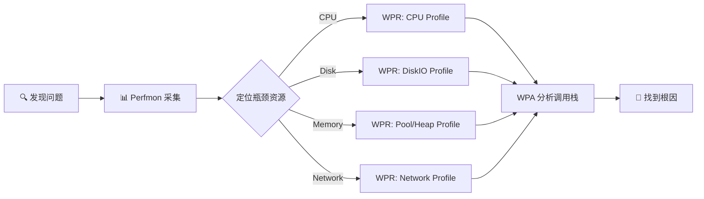

# Deep Dive: Windows 性能监控工具全景

**Topic:** Windows Performance Monitoring Toolkit Overview  
**Category:** Performance  
**Level:** 入门 (Level 100 — Foundation)  
**Series:** Windows Performance Readiness (1/7)  
**Last Updated:** 2026-03-13

---

## 1. 概述 (Overview)

性能问题是 Windows 环境中最常见也最棘手的问题之一。用户说"服务器慢了"，但"慢"可能意味着 CPU 跑满、内存泄漏、磁盘延迟高、或者网络拥塞 —— 你需要**用数据说话**。

Windows 提供了一套完整的性能监控工具链，从轻量级的实时查看（Task Manager）到企业级的深度分析（WPR/WPA）。掌握这些工具，就像医生掌握听诊器、X光和 CT 一样 —— 不同场景用不同工具，才能精准定位问题。

本文是 **Performance Readiness 系列的第一篇**，将带你建立完整的工具认知体系，为后续的 Storage、Memory、Processor、Network 深度分析打下基础。

---

## 2. 工具全景图 (The Toolkit Landscape)

Windows 性能工具可以按**使用场景**分为三层：

```
┌─────────────────────────────────────────────────────────┐
│                 Level 3: 深度分析                         │
│     WPR/WPA (ETW Tracing) · WinDbg · DebugDiag          │
│     适用于：精确定位函数级调用栈、等待链分析、内存泄漏根因  │
├─────────────────────────────────────────────────────────┤
│                 Level 2: 数据采集与趋势分析                │
│     Performance Monitor (Perfmon) · Logman · Relog        │
│     适用于：长时间采集、基线对比、阈值告警、趋势回溯        │
├─────────────────────────────────────────────────────────┤
│                 Level 1: 实时快速查看                      │
│     Task Manager · Resource Monitor · Process Explorer    │
│     适用于：快速定位当前 Top 进程、实时观察资源使用          │
└─────────────────────────────────────────────────────────┘
```

### 工具选择速查表

| 场景 | 推荐工具 | 原因 |
|------|----------|------|
| "哪个进程占 CPU 最高？" | Task Manager / Resource Monitor | 实时、直观 |
| "过去 24 小时磁盘延迟如何？" | Perfmon (Counter Log) | 支持长时间记录 |
| "内存是否在慢慢泄漏？" | Perfmon (Private Bytes 趋势) | 可看天/周级趋势 |
| "高 CPU 到底卡在哪个函数？" | WPR + WPA (CPU Sampled) | 函数级调用栈分析 |
| "线程之间的等待链是什么？" | WPR + WPA (CPU Precise) | Context Switch 精确分析 |
| "进程打开了哪些文件/句柄？" | Process Explorer | 句柄/DLL 级别可见 |
| "需要远程批量部署采集？" | Logman.exe | 命令行，支持远程/脚本 |
| "日志太大需要裁剪？" | Relog.exe | 提取时间窗口/转换格式 |

---

## 3. Level 1: 实时快速查看工具

### 3.1 Task Manager (任务管理器)

最常用的"第一眼工具"，按 `Ctrl + Shift + Esc` 即可打开。

**Performance 选项卡的关键信息：**

| 区域 | 看什么 | 小技巧 |
|------|--------|--------|
| CPU | 整体利用率、每核分布 | 右键图表 → **Show kernel times**（深蓝色线 = Kernel mode） |
| Memory | In Use / Available / Committed | "Committed" 接近 "Commit Limit" 就危险了 |
| Disk | 活跃时间、传输速率 | 注意区分不同磁盘（C: vs D:） |
| Network | 发送/接收速率 | 适合快速判断是否有网络流量异常 |

**Processes 选项卡技巧：**
- 点击列标题排序（CPU、Memory、Disk、Network）
- 右键列标题 → 添加 **PID**、**Command Line** 列
- `svchost.exe` 太多？展开可看到承载的具体服务名

> 💡 **局限**：Task Manager 只显示**当前瞬间**，无法看历史趋势。它是"温度计"，不是"病历本"。

### 3.2 Resource Monitor (资源监视器)

比 Task Manager 更强大的实时工具。运行 `resmon` 或从 Task Manager → Performance → Open Resource Monitor。

**核心优势：**

- **进程筛选**：勾选一个进程后，所有关联的磁盘 I/O、网络连接、内存使用会**高亮显示**
- **CPU → Services**：可以看到哪些服务在消耗 CPU
- **Disk**：可以看到每个进程的读写文件路径、响应时间
- **Network**：可以看到每个进程的 TCP 连接和端口
- **Average CPU**：显示过去 60 秒的平均 CPU 利用率（比 Task Manager 更稳定）

### 3.3 Process Explorer (Sysinternals)

Mark Russinovich 出品的"超级 Task Manager"，从 [Sysinternals](https://learn.microsoft.com/sysinternals/downloads/process-explorer) 下载。

**杀手锏功能：**
- **进程树视图**：父子进程关系一目了然
- **句柄/DLL 搜索**：`Ctrl+F` 搜索哪个进程打开了特定文件或加载了特定 DLL
- **线程调用栈**：双击进程 → Threads 选项卡 → Stack，可以看到线程正在执行的函数（需要配置 Symbols）
- **GPU 列**：可以添加 GPU Usage 列
- **替换 Task Manager**：Options → Replace Task Manager

---

## 4. Level 2: Performance Monitor (Perfmon) 深度掌握

Perfmon 是 Windows 内置的**核心性能数据采集工具**，从 Windows NT 时代就存在。运行 `perfmon` 或 `perfmon.msc` 打开。

### 4.1 理解 Counter Path（计数器路径）

每个 Perfmon 计数器都有一个标准路径格式：

```
\\ComputerName\Object(Instance)\Counter
```

**实例解释：**

```
\\LocalComputer\Processor(_Total)\% Processor Time
     │              │       │           │
     │              │       │           └── Counter: 具体指标
     │              │       └── Instance: 哪个实例（_Total = 所有实例的汇总）
     │              └── Object: 资源类别（Processor, Memory, LogicalDisk...）
     └── Computer: 监控目标机器
```

> 🔑 **`_Total` 是特殊实例**：对于某些计数器它是**求和**（如 Disk Transfers/sec），对于某些是**平均**（如 % Processor Time）。永远要同时看各个单独实例！

### 4.2 三种视图模式

| 视图 | 快捷方式 | 适用场景 |
|------|---------|----------|
| **Line Graph** (折线图) | 默认 | 观察趋势变化、时间关联 |
| **Histogram** (柱状图) | 图表类型按钮 | 对比不同实例的当前值 |
| **Report** (报告) | 图表类型按钮 | 精确查看数值，适合截图记录 |

### 4.3 图表操作技巧

**高亮计数器：** 选中某个计数器后按 `Ctrl+H`，该线条会加粗高亮显示。

**缩放时间范围：** 拖动下方灰色滑条选择时间区间，右键 → **Zoom To** 放大查看细节。

**自动缩放：** 当多个计数器值差异很大（如一个是 0-100%，另一个是 0-100000）时，选中计数器 → 右键 → **Scale Selected Counters**，自动调整比例使曲线可见。

**显示 PID：** 默认进程名可能重复（如多个 `svchost`）。设置注册表：
```
HKLM\SYSTEM\CurrentControlSet\Services\PerfProc\Performance
  ProcessNameFormat = 2 (DWORD)
```
重启 Perfmon 后，进程名会附带 PID（如 `svchost#1234`）。

### 4.4 图表中的统计值

Perfmon 底部显示的 **Last / Min / Avg / Max** 值需要注意：
- 这些值**不受图表缩放比例影响** —— 它们始终是真实值
- **Avg** 是整个可见时间范围的平均值
- 当你 Zoom 到某个时间窗口后，这些值会自动更新为该窗口的统计

### 4.5 创建 Counter Log（数据采集日志）

实时查看只能看"现在"，但很多问题是"昨天下午 3 点发生的"。这时需要 **Counter Log**。

**GUI 方式创建：**

1. 展开 `Data Collector Sets` → 右键 `User Defined` → `New` → `Data Collector Set`
2. 选择 `Create manually (Advanced)` → `Performance counter`
3. 添加需要的计数器 → 设置采样间隔 → 完成

**从模板创建：**
- 选择 `Create from a template (Recommended)`
- 可以使用内置模板或自定义 `.xml` 模板

**采样间隔选择策略：**

| 采集时长 | 建议间隔 | 原因 |
|----------|---------|------|
| 20 分钟 | 1 秒 | 短期捕获，需要细粒度 |
| 1 小时 | 5 秒 | 平衡粒度与文件大小 |
| 24 小时 | 1 分钟 | 长期趋势，~50-400 MB |
| 7 天 | 5 分钟 | 长期基线，文件可控 |

> 📐 **经验公式**：采集总时长 ÷ 1000 = 理想采样间隔（1000 个数据点刚好铺满 Perfmon 图表宽度）。例如 24 小时 ÷ 1000 ≈ 86 秒 ≈ 1 分钟。

### 4.6 日志文件格式选择

| 格式 | 扩展名 | 优缺点 |
|------|--------|--------|
| **Binary** | `.blg` | ✅ 默认推荐，可记录新进程实例，可转换为 CSV |
| **CSV** | `.csv` | ✅ 文件较小，方便其他工具解析 ❌ 不能记录中途启动的新进程 |
| **SQL** | — | ✅ 适合 SQL Reporting Services ❌ 需要 SQL 数据库环境 |

### 4.7 Circular Log（循环日志）

类似飞机上的"黑匣子"—— 到达最大文件大小后，自动覆盖最旧的数据继续记录。

**最佳用途**：问题随机发生但不知道什么时候。设置一个 500MB-1GB 的循环日志，永远保留最近 N 小时的数据。

**创建方法：**
1. Data Collector Set 属性 → Stop Condition → 设置 Maximum Size
2. Data Collector 属性 → File → 选择 **Circular**

### 4.8 加载和查看日志

1. 点击工具栏的 📊 按钮 → Source 选项卡
2. 选择 `Log files` → Add → 选择 `.blg` 文件
3. 添加想查看的计数器即可

> ⚠️ **兼容性注意**：Windows Vista/2008 及以上可以打开任何版本的日志，但 XP/2003 无法打开新版本的日志。

### 4.9 本地采集 vs 远程采集

| 方式 | 优点 | 缺点 |
|------|------|------|
| **本地采集** | ✅ 无网络开销 ✅ 数据无间断 ✅ 时间戳与本地事件日志匹配 | 需要登录服务器 |
| **远程采集** | ✅ 适合大规模趋势分析 | ❌ 时间戳是采集机的时区 ❌ 网络抖动可能导致数据间隙 |

> 💡 **排查问题时永远优先本地采集**。远程采集适合长期监控和趋势分析。

---

## 5. 命令行工具：Logman 和 Relog

### 5.1 Logman.exe — 命令行管理数据采集

当你需要在**数十台服务器**上部署相同的 Perfmon 采集，GUI 就不够用了。Logman 是 Perfmon 的命令行版本。

**常用命令：**

```powershell
# 创建一个名为 "VitalSigns" 的计数器日志
logman create counter "VitalSigns" -cf counters.txt -si 00:01:00 -f bin -o C:\Perflogs\VitalSigns.blg

# 在远程服务器上创建
logman create counter "VitalSigns" -s RemoteServer -cf counters.txt -si 00:01:00 -o C:\Perflogs\VitalSigns.blg

# 启动/停止日志
logman start VitalSigns
logman stop VitalSigns

# 查询所有数据采集集
logman query
logman query -s RemoteServer

# 创建循环日志（黑匣子模式）
logman create counter "Blackbox" -cf counters.txt -si 00:00:15 -f bincirc -o C:\Perflogs\Blackbox -max 500
```

**常用参数速查：**

| 参数 | 说明 | 示例 |
|------|------|------|
| `-s` | 远程计算机 | `-s SRV01` |
| `-f` | 日志格式 | `-f bin` / `-f bincirc` / `-f csv` |
| `-si` | 采样间隔 | `-si 00:01:00` (1分钟) |
| `-b` / `-e` | 开始/结束时间 | `-b 6/27/2026 08:00:00AM` |
| `-o` | 输出路径 | `-o C:\Perflogs\capture.blg` |
| `-cf` | 计数器列表文件 | `-cf counters.txt` |
| `-v` | 文件名版本号 | `-v mmddhhmm` |
| `-max` | 最大大小(MB) | `-max 500` |

**使用 typeperf.exe 生成计数器列表：**

```powershell
# 导出 Processor Information 对象的所有计数器
typeperf -q "Processor Information" -o ProcessorCounters.txt
```

**开机自动启动采集：**

```batch
REM 保存为 blackbox.cmd，放入组策略启动脚本
logman start Blackbox
```

### 5.2 Relog.exe — 日志转换和裁剪

Relog 用于从已有日志中**提取、转换、合并**数据。

**常用场景：**

```powershell
# 查看日志信息（采样数、时间范围）
relog capture.blg

# 转换 BLG 为 CSV
relog capture.blg -f csv -o output.csv

# 提取特定时间窗口
relog capture.blg -b "10/01/2026 01:00" -e "10/02/2026 01:00" -o extracted.blg

# 每隔 N 个采样取一个（降采样）
relog capture.blg -t 2 -o downsampled.blg

# 只提取特定计数器
relog capture.blg -c "\Processor(*)\% Processor Time" -o cpu_only.blg

# 合并多个日志
relog log1.blg log2.blg log3.blg -o merged.blg
```

> 💡 **修复损坏日志的技巧**：如果一个日志中间有损坏数据，用 `-t 2`（跳过每隔一个采样）或 `-b -e`（提取未损坏的时间段）来"抢救"数据。

---

## 6. 修复损坏的计数器

有时候 Perfmon 中浏览计数器时会看到**数字代码而不是正常名称** —— 这说明计数器注册信息损坏了。

**修复方法：**

```powershell
# 在管理员命令提示符下运行（首次执行需 20-30 分钟）
LODCTR /R

# 或使用 WMI 适配器重建
wmiadap.exe /f
```

> ⚠️ 必须以管理员权限运行。`LODCTR /R` 会重建所有计数器的注册信息，包括第三方产品的计数器。

---

## 7. Performance Monitor 趋势分析技巧

学会"读图"是性能分析的核心技能。以下是五种关键图形模式：

### 7.1 上升趋势 (Upward Trend)

```
值 │        ╱
   │      ╱
   │    ╱
   │  ╱
   │╱
   └──────────── 时间
```

**含义**：资源泄漏（内存泄漏、句柄泄漏）。资源被分配但从未释放。  
**典型计数器**：`\Process(*)\Private Bytes`、`\Process(*)\Handle Count`

### 7.2 下降趋势 (Downward Trend)

```
值 │╲
   │  ╲
   │    ╲
   │      ╲
   │        ╲
   └──────────── 时间
```

**含义**：资源耗尽（可用内存减少、磁盘可用空间减少）。  
**典型计数器**：`\Memory\Available MBytes`、`\LogicalDisk(*)\% Free Space`

### 7.3 超过阈值 (Crossing a Threshold)

**含义**：性能瓶颈。当计数器值**持续**超过关键阈值时，表示该资源已成为瓶颈。  
**注意**：短暂的突刺（spike）通常是正常的，要关注**持续时间**。

### 7.4 反向相关 (Inverse Relationship)

**含义**：因果关系。一个计数器上升时另一个下降，表明它们之间存在资源竞争。  
**典型例子**：`Available MBytes` ↓ + `Pages/sec` ↑ = 内存不足导致频繁分页

### 7.5 同步变化 (Sympathetic Patterns)

**含义**：某个进程的活动直接导致了系统资源的变化。  
**典型例子**：`\Process(backup)\IO Read Operations/sec` ↑ 与 `\PhysicalDisk\Avg. Disk sec/Read` ↑ 同步 = 备份进程导致磁盘延迟

### 比较多个 Perfmon 采集

使用 `perfmon /sys /comp` 可以在同一个 Perfmon 窗口中加载多个日志文件进行对比，非常适合"问题时段 vs 正常时段"的 A/B 分析。

---

## 8. Level 3: WPR/WPA 入门

当 Perfmon 告诉你"CPU 高"或"磁盘延迟大"，但你需要知道**具体是哪个函数、哪个驱动导致的** —— 这时就需要 WPR/WPA。

### 8.1 WPR (Windows Performance Recorder)

WPR 基于 **ETW (Event Tracing for Windows)** 技术，能够以极低的开销记录系统和应用程序的详细行为。

**安装方式：**
- **Windows 10/11 自带**：`C:\Windows\System32\WPR.exe`（命令行版本，无 GUI）
- **完整版（含 GUI + WPA）**：安装 [Windows ADK](https://learn.microsoft.com/windows-hardware/get-started/adk-install)

**两种录制方式：**

| 方式 | 工具 | 适用场景 |
|------|------|----------|
| GUI | `WPRUI.exe` | 交互式操作，选择配置文件 → Start → 复现问题 → Save |
| 命令行 | `WPR.exe` | 脚本自动化，远程采集 |

**命令行示例：**

```powershell
# 开始录制（CPU + 磁盘 I/O）
wpr -start CPU -start DiskIO -filemode

# 停止录制并保存
wpr -stop C:\traces\output.etl
```

### 8.2 内置录制配置文件 (Built-in Profiles)

WPR 的配置文件决定了**记录哪些事件**：

**资源分析配置文件：**

| Profile | 记录内容 |
|---------|---------|
| CPU usage | 每个 CPU 的利用率采样 |
| Disk I/O activity | 所有磁盘 I/O 操作 |
| File I/O activity | 所有文件 I/O 操作 |
| Registry I/O activity | 所有注册表变更 |
| Networking I/O activity | 所有网络 I/O 活动 |
| Heap usage | 指定进程的堆分配/释放 |
| Pool usage | 内核池的分配/释放 |
| VirtualAlloc usage | 虚拟内存分配 |
| Power usage | 电源状态和空闲状态 |
| Handle usage | 句柄的创建/关闭 |

**详细级别：**
- **Light**：主要用于计时录制，开销小
- **Verbose**：提供分析所需的详细信息，包含调用栈

**日志模式：**
- **Memory (循环缓冲区)**：适合持续录制，等待问题出现后再保存
- **File (顺序文件)**：适合短期录制，知道问题何时发生

### 8.3 WPA (Windows Performance Analyzer)

WPA 是 WPR 录制的 ETL 文件的分析工具，提供强大的图形化界面。

**基本工作流：**

```
1. 打开 ETL 文件（File → Open）
2. 在 Graph Explorer 中找到相关图表
3. 将图表拖到 Analysis 选项卡
4. 选择时间区间 → 右键 → Zoom to selected time range
5. 在数据表中按列排序，找到 Top 消耗者
6. 展开调用栈 (Stack) 列，定位具体函数
```

**Graph Explorer 中的主要分类：**

| 类别 | 包含图表 | 用途 |
|------|---------|------|
| **System Activity** | Processes, Generic Events, UI Delays | 进程生命周期、ETW 事件、UI 卡顿 |
| **Computation** | CPU Usage (Sampled), CPU Usage (Precise), DPC/ISR | CPU 分析的核心 |
| **Storage** | Disk Usage, File I/O, Registry | 磁盘和文件系统分析 |
| **Memory** | Memory Utilization, Virtual Memory, Hard Faults, Pool, Heap | 内存分析 |
| **Network** | TCP/IP Events | 网络通信分析 |

> 💡 **加载符号 (Symbols)**：菜单 Trace → Load Symbols。有了符号，调用栈中才能显示函数名而不是内存地址。配置 Symbol Path：`srv*C:\Symbols*https://msdl.microsoft.com/download/symbols`

### 8.4 Perfmon vs WPR/WPA 对比

| 维度 | Perfmon | WPR/WPA |
|------|---------|---------|
| **数据类型** | 计数器数值（统计数据） | ETW 事件（事件流） |
| **粒度** | 秒级采样 | 毫秒级甚至微秒级事件 |
| **持续时间** | 小时/天/周 | 分钟级（通常 1-5 分钟） |
| **开销** | 极低（< 1% CPU） | 中等（取决于 Profile） |
| **分析能力** | 趋势、阈值、对比 | 调用栈、等待分析、因果链 |
| **学习曲线** | 低 | 高 |
| **适用阶段** | 第一步：发现哪个资源有瓶颈 | 第二步：深入分析瓶颈的根因 |

**最佳实践流程：**



---

## 9. 常见图表解读错误 (Common Interpretation Pitfalls)

### 错误 1: 把上升趋势误判为泄漏

**现象**：Private Bytes 白天上升、晚上下降。  
**真相**：这是正常的工作负载模式（Daily Workload），不是泄漏。  
**判断方法**：真正的泄漏是**不下降**的持续上升，即使没有活跃用户。

### 错误 2: 计数器看起来一直是 100

**原因**：该计数器的值范围很大（如 Bytes/sec 可达几百万），但 Y 轴范围是 0-100。  
**解决**：右键 → Scale Selected Counters，或手动调整 Y 轴范围。

### 错误 3: 计数器看起来一直是 0

**原因**：与上面相反 —— 该计数器值很小（如 0.015 秒），被 Y 轴压在底部。  
**解决**：同样使用 Scale Selected Counters。

### 错误 4: 图表上看起来没有数据

**原因**：时间范围太大，数据点密度太高，看起来像一条线。  
**解决**：Zoom 到较小的时间窗口。

### 错误 5: 不理解计数器含义就下结论

**关键提醒**：
- `Pages/sec` 高**不一定**意味着内存不足（可能是正常的文件映射 I/O）
- `_Total` 可能掩盖单个实例的异常
- 阈值只是参考，不同应用有不同的正常范围

---

## 10. 快速参考卡 (Quick Reference Card)

### 必知 Perfmon 快捷操作

| 操作 | 方法 |
|------|------|
| 启动 Perfmon | `perfmon` 或 `perfmon.msc` |
| 添加计数器 | 绿色 `+` 按钮 |
| 高亮选中计数器 | `Ctrl + H` |
| 切换视图 | 图表类型按钮（折线/柱状/报告） |
| 缩放 | 拖动底部时间滑条 → 右键 → Zoom To |
| 从日志加载 | 📊 → Source → Log files → Add |
| 比较多个日志 | `perfmon /sys /comp` |

### 核心命令行

```powershell
# Logman: 创建、启动、停止
logman create counter "MyLog" -cf counters.txt -si 00:00:15 -f bincirc -max 500
logman start MyLog
logman stop MyLog
logman query

# Relog: 转换、裁剪
relog input.blg -f csv -o output.csv
relog input.blg -b "03/13/2026 09:00" -e "03/13/2026 17:00" -o window.blg

# WPR: 录制
wpr -start GeneralProfile -start CPU -filemode
wpr -stop C:\traces\output.etl

# 修复计数器
LODCTR /R
```

---

## 11. 参考资料 (References)

- [Windows Performance Toolkit](https://learn.microsoft.com/windows-hardware/test/wpt/) — WPR/WPA 官方文档入口
- [Introduction to WPR](https://learn.microsoft.com/windows-hardware/test/wpt/introduction-to-wpr) — WPR 详细功能介绍
- [Logman](https://learn.microsoft.com/windows-server/administration/windows-commands/logman) — Logman 命令参考
- [Relog](https://learn.microsoft.com/windows-server/administration/windows-commands/relog) — Relog 命令参考
- [Process Explorer](https://learn.microsoft.com/sysinternals/downloads/process-explorer) — Sysinternals Process Explorer
- [Troubleshoot processes and threads by using WPR and WPA](https://learn.microsoft.com/troubleshoot/windows-server/support-tools/support-tools-xperf-wpa-wpr) — WPR/WPA 排查实例
- [WPR Built-in Recording Profiles](https://learn.microsoft.com/windows-hardware/test/wpt/built-in-recording-profiles) — WPR 内置录制配置文件列表

---

## 12. 系列导航 (Series Navigation)

本文是 **Windows Performance Readiness** 系列的第 1 篇。后续文章将深入每个资源领域：

| # | Level | 主题 | 状态 |
|---|-------|------|------|
| **1** | **100** | **性能监控工具全景 (本文)** | ✅ |
| 2 | 200 | 存储性能深度解析 | 📝 |
| 3 | 200 | 内存性能深度解析 | 📝 |
| 4 | 200 | 处理器性能深度解析 | 📝 |
| 5 | 200 | 网络性能深度解析 | 📝 |
| 6 | 300 | WPR/WPA 高级分析技术 | 📝 |
| 7 | 300 | 性能排查方法论 | 📝 |

---

---

# English Version

---

# Deep Dive: Windows Performance Monitoring Toolkit Overview

**Topic:** Windows Performance Monitoring Toolkit Overview  
**Category:** Performance  
**Level:** Beginner (Level 100 — Foundation)  
**Series:** Windows Performance Readiness (1/7)  
**Last Updated:** 2026-03-13

---

## 1. Overview

Performance issues are among the most common and challenging problems in Windows environments. When a user says "the server is slow," it could mean CPU saturation, memory leaks, high disk latency, or network congestion — you need **data to back up your diagnosis**.

Windows provides a comprehensive performance monitoring toolchain, from lightweight real-time viewers (Task Manager) to enterprise-grade deep analysis tools (WPR/WPA). Mastering these tools is like a doctor mastering stethoscopes, X-rays, and CT scans — different scenarios require different instruments.

This article is the **first in the Performance Readiness series**, establishing a complete toolkit awareness as the foundation for the Storage, Memory, Processor, and Network deep dives that follow.

---

## 2. The Toolkit Landscape

Windows performance tools can be organized into three tiers by **use case**:

```
┌─────────────────────────────────────────────────────────┐
│                 Tier 3: Deep Analysis                     │
│     WPR/WPA (ETW Tracing) · WinDbg · DebugDiag           │
│     For: Function-level call stacks, wait chain, root cause│
├─────────────────────────────────────────────────────────┤
│                 Tier 2: Data Collection & Trend Analysis   │
│     Performance Monitor (Perfmon) · Logman · Relog         │
│     For: Long-term collection, baselines, thresholds       │
├─────────────────────────────────────────────────────────┤
│                 Tier 1: Real-time Quick View               │
│     Task Manager · Resource Monitor · Process Explorer     │
│     For: Quickly spot top consumers, real-time observation  │
└─────────────────────────────────────────────────────────┘
```

### Tool Selection Quick Reference

| Scenario | Recommended Tool | Why |
|----------|-----------------|-----|
| "Which process is using the most CPU?" | Task Manager / Resource Monitor | Real-time, intuitive |
| "What was disk latency over the last 24 hours?" | Perfmon (Counter Log) | Supports long-term recording |
| "Is memory slowly leaking?" | Perfmon (Private Bytes trend) | Can show day/week trends |
| "High CPU — which function is the hotspot?" | WPR + WPA (CPU Sampled) | Function-level call stack analysis |
| "What's the wait chain between threads?" | WPR + WPA (CPU Precise) | Precise context switch analysis |
| "Which files/handles does a process have open?" | Process Explorer | Handle/DLL level visibility |
| "Need to deploy collection across many servers?" | Logman.exe | Command-line, supports remote/scripting |
| "Log file too large, need to trim?" | Relog.exe | Extract time windows / convert formats |

---

## 3. Tier 1: Real-time Quick View Tools

### 3.1 Task Manager

The go-to "first look" tool. Press `Ctrl + Shift + Esc` to open.

**Performance tab key information:**

| Area | What to Look For | Tip |
|------|-----------------|-----|
| CPU | Overall utilization, per-core distribution | Right-click graph → **Show kernel times** (dark blue = kernel mode) |
| Memory | In Use / Available / Committed | If "Committed" approaches "Commit Limit," you're in danger |
| Disk | Active time, transfer rate | Note which physical disk (C: vs D:) |
| Network | Send/Receive rates | Quick check for traffic anomalies |

> 💡 **Limitation**: Task Manager shows only the **current moment** — no historical trends. It's a thermometer, not a medical record.

### 3.2 Resource Monitor

More powerful than Task Manager for real-time analysis. Run `resmon` or launch from Task Manager → Performance tab.

**Key advantages:**
- **Process filtering**: Check a process to highlight all its associated disk I/O, network connections, and memory
- **CPU → Services**: See which services consume CPU
- **Disk**: See read/write file paths and response times per process
- **Network**: See TCP connections and ports per process

### 3.3 Process Explorer (Sysinternals)

The "super Task Manager" by Mark Russinovich. Download from [Sysinternals](https://learn.microsoft.com/sysinternals/downloads/process-explorer).

**Killer features:**
- **Process tree view**: Parent-child relationships at a glance
- **Handle/DLL search**: `Ctrl+F` to find which process has a specific file open
- **Thread call stacks**: Double-click process → Threads → Stack (requires Symbols)
- **Replace Task Manager**: Options → Replace Task Manager

---

## 4. Tier 2: Performance Monitor (Perfmon) Mastery

Perfmon is the **core performance data collection tool** built into Windows since NT. Run `perfmon` or `perfmon.msc`.

### 4.1 Understanding Counter Paths

Every Perfmon counter has a standard path format:

```
\\ComputerName\Object(Instance)\Counter
```

Example: `\\LocalComputer\Processor(_Total)\% Processor Time`

> 🔑 **`_Total` is special**: For some counters it's a **sum** (e.g., Disk Transfers/sec), for others an **average** (e.g., % Processor Time). Always look at individual instances too!

### 4.2 Three View Modes

| View | Best For |
|------|----------|
| **Line Graph** | Trend observation, time correlation |
| **Histogram** | Comparing current values across instances |
| **Report** | Precise numeric values, screenshots |

### 4.3 Key Chart Operations

- **Highlight counter**: Select counter → `Ctrl+H` to bold
- **Zoom**: Drag the gray time slider → right-click → **Zoom To**
- **Auto-scale**: Right-click selected counters → **Scale Selected Counters**
- **Show PIDs**: Set registry `HKLM\SYSTEM\CurrentControlSet\Services\PerfProc\Performance\ProcessNameFormat = 2`

### 4.4 Creating Counter Logs

Real-time viewing only shows "now." For "what happened yesterday at 3 PM," you need **Counter Logs**.

**Sampling interval strategy:**

| Duration | Recommended Interval | Rationale |
|----------|---------------------|-----------|
| 20 minutes | 1 second | Short capture, need fine granularity |
| 1 hour | 5 seconds | Balance between detail and file size |
| 24 hours | 1 minute | Long-term trend, ~50-400 MB |
| 7 days | 5 minutes | Long-term baseline |

> 📐 **Rule of thumb**: Total duration ÷ 1000 = ideal sample interval (1000 data points fill the Perfmon chart nicely).

### 4.5 Log File Formats

| Format | Extension | Pros/Cons |
|--------|-----------|-----------|
| **Binary** | `.blg` | ✅ Default recommended, captures new process instances, convertible |
| **CSV** | `.csv` | ✅ Smaller, easy to parse ❌ Cannot capture processes started after logging begins |
| **SQL** | — | ✅ Great for SQL Reporting Services ❌ Requires SQL Server |

### 4.6 Circular Logs

Like a "black box flight recorder" — when maximum size is reached, it overwrites the oldest data. Perfect for random/unpredictable issues. Set a 500MB-1GB circular log as an always-on safety net.

### 4.7 Local vs. Remote Collection

| Method | When to Use |
|--------|-------------|
| **Local** | ✅ **Always prefer for troubleshooting** — no network gaps, timestamps match local event logs |
| **Remote** | Large-scale trend analysis across many servers |

---

## 5. Command-Line Tools: Logman and Relog

### 5.1 Logman.exe — Command-line Perfmon Management

Essential for deploying Perfmon collection across **dozens of servers**.

```powershell
# Create a counter log
logman create counter "VitalSigns" -cf counters.txt -si 00:01:00 -f bin -o C:\Perflogs\VitalSigns.blg

# Create on a remote server
logman create counter "VitalSigns" -s RemoteServer -cf counters.txt -si 00:01:00

# Start/Stop
logman start VitalSigns
logman stop VitalSigns

# Create circular log (black box mode)
logman create counter "Blackbox" -cf counters.txt -si 00:00:15 -f bincirc -max 500

# Auto-start on boot: put "logman start Blackbox" in a startup script via gpedit.msc
```

### 5.2 Relog.exe — Log Conversion and Trimming

```powershell
# Convert BLG to CSV
relog capture.blg -f csv -o output.csv

# Extract specific time window
relog capture.blg -b "10/01/2026 01:00" -e "10/02/2026 01:00" -o extracted.blg

# Downsample (every Nth sample)
relog capture.blg -t 2 -o downsampled.blg

# Extract specific counters only
relog capture.blg -c "\Processor(*)\% Processor Time" -o cpu_only.blg
```

> 💡 **Rescue corrupted logs**: Use `-t 2` (skip every other sample) or `-b -e` (extract undamaged time range) to salvage data.

---

## 6. Repairing Corrupt Counters

If Perfmon shows **numbers or garbled labels** instead of counter names, the counter registration is corrupt.

```powershell
# Run from elevated Command Prompt (takes 20-30 minutes first time)
LODCTR /R
```

---

## 7. Perfmon Trend Analysis Patterns

### Five Key Graph Patterns

| Pattern | Meaning | Typical Counter |
|---------|---------|-----------------|
| **Upward Trend** | Resource leak (allocated but never released) | `\Process(*)\Private Bytes`, `\Process(*)\Handle Count` |
| **Downward Trend** | Resource exhaustion | `\Memory\Available MBytes`, `\LogicalDisk(*)\% Free Space` |
| **Threshold Crossing** | Performance bottleneck (sustained, not spikes) | Various thresholds per resource |
| **Inverse Relationship** | Cause-and-effect between resources | `Available MBytes` ↓ + `Pages/sec` ↑ |
| **Sympathetic Pattern** | Process activity causing system impact | Process I/O ↑ correlated with Disk Latency ↑ |

**Comparing multiple captures**: Use `perfmon /sys /comp` to load multiple logs side-by-side for A/B comparison (problem period vs. baseline).

---

## 8. Tier 3: WPR/WPA Introduction

When Perfmon tells you "CPU is high" but you need to know **which function in which module** — that's when you need WPR/WPA.

### 8.1 WPR (Windows Performance Recorder)

Based on **ETW (Event Tracing for Windows)**, records detailed system behavior with low overhead.

- **In-box** (Windows 10+): `C:\Windows\System32\WPR.exe` (CLI only)
- **Full version** (GUI + WPA): Install [Windows ADK](https://learn.microsoft.com/windows-hardware/get-started/adk-install)

```powershell
# Start recording
wpr -start CPU -start DiskIO -filemode

# Stop and save
wpr -stop C:\traces\output.etl
```

### 8.2 Built-in Recording Profiles

| Profile | Records |
|---------|---------|
| CPU usage | Per-CPU utilization sampling |
| Disk I/O activity | All disk I/O operations |
| File I/O activity | All file I/O operations |
| Registry I/O activity | All registry changes |
| Heap usage | Heap allocations/frees for specified process |
| Pool usage | Kernel pool allocations/frees |
| Handle usage | Handle creation/closure |

**Detail Levels**: Light (timing, low overhead) vs. Verbose (full analysis with call stacks)  
**Logging Modes**: Memory (circular buffer, wait for issue) vs. File (sequential, known timeframe)

### 8.3 WPA (Windows Performance Analyzer)

The analysis tool for ETL files recorded by WPR.

**Basic workflow:**
1. Open ETL file → Graph Explorer shows available graphs
2. Drag relevant graphs to Analysis tab
3. Select time interval → right-click → Zoom to selected time range
4. Sort data table columns to find top consumers
5. Expand Stack column to identify specific functions

**Load Symbols**: Trace → Load Symbols (required for function names in call stacks)  
**Symbol Path**: `srv*C:\Symbols*https://msdl.microsoft.com/download/symbols`

### 8.4 Perfmon vs. WPR/WPA

| Dimension | Perfmon | WPR/WPA |
|-----------|---------|---------|
| Data type | Counter values (statistics) | ETW events (event stream) |
| Granularity | Second-level sampling | Millisecond/microsecond events |
| Duration | Hours/days/weeks | Minutes (typically 1-5 min) |
| Overhead | Very low (< 1% CPU) | Moderate (profile-dependent) |
| Analysis | Trends, thresholds, comparison | Call stacks, wait analysis, causal chains |
| Best for | Step 1: Identify bottleneck resource | Step 2: Deep-dive into root cause |

---

## 9. Common Interpretation Pitfalls

| Pitfall | What You See | Reality |
|---------|-------------|---------|
| Daily workload ≠ Leak | Private Bytes rises during business hours | Normal if it drops after hours |
| Counter stuck at 100 | Flat line at graph top | Value is very large; use Scale Selected Counters |
| Counter stuck at 0 | Flat line at bottom | Value is very small; adjust Y-axis scale |
| No data on graph | Appears empty | Too many data points; zoom in |
| Pages/sec high = low RAM? | High paging rate | Not necessarily — could be memory-mapped file I/O with plenty of Available MBytes |

---

## 10. Quick Reference Card

```powershell
# === Perfmon ===
perfmon                        # Open Performance Monitor
perfmon /sys /comp             # Compare multiple captures

# === Logman ===
logman create counter "MyLog" -cf counters.txt -si 00:00:15 -f bincirc -max 500
logman start MyLog
logman stop MyLog
logman query

# === Relog ===
relog input.blg -f csv -o output.csv
relog input.blg -b "03/13/2026 09:00" -e "03/13/2026 17:00" -o window.blg

# === WPR ===
wpr -start GeneralProfile -start CPU -filemode
wpr -stop C:\traces\output.etl

# === Repair Counters ===
LODCTR /R
```

---

## 11. References

- [Windows Performance Toolkit](https://learn.microsoft.com/windows-hardware/test/wpt/) — WPR/WPA official documentation portal
- [Introduction to WPR](https://learn.microsoft.com/windows-hardware/test/wpt/introduction-to-wpr) — Detailed WPR feature guide
- [Logman](https://learn.microsoft.com/windows-server/administration/windows-commands/logman) — Logman command reference
- [Relog](https://learn.microsoft.com/windows-server/administration/windows-commands/relog) — Relog command reference
- [Process Explorer](https://learn.microsoft.com/sysinternals/downloads/process-explorer) — Sysinternals Process Explorer
- [Troubleshoot processes and threads by using WPR and WPA](https://learn.microsoft.com/troubleshoot/windows-server/support-tools/support-tools-xperf-wpa-wpr) — WPR/WPA troubleshooting examples
- [WPR Built-in Recording Profiles](https://learn.microsoft.com/windows-hardware/test/wpt/built-in-recording-profiles) — WPR built-in profile reference

---

## 12. Series Navigation

This is article **#1** in the **Windows Performance Readiness** series:

| # | Level | Topic | Status |
|---|-------|-------|--------|
| **1** | **100** | **Performance Monitoring Toolkit Overview (this article)** | ✅ |
| 2 | 200 | Storage Performance Deep Dive | 📝 |
| 3 | 200 | Memory Performance Deep Dive | 📝 |
| 4 | 200 | Processor Performance Deep Dive | 📝 |
| 5 | 200 | Network Performance Deep Dive | 📝 |
| 6 | 300 | WPR/WPA Advanced Analysis Techniques | 📝 |
| 7 | 300 | Performance Troubleshooting Methodology | 📝 |
