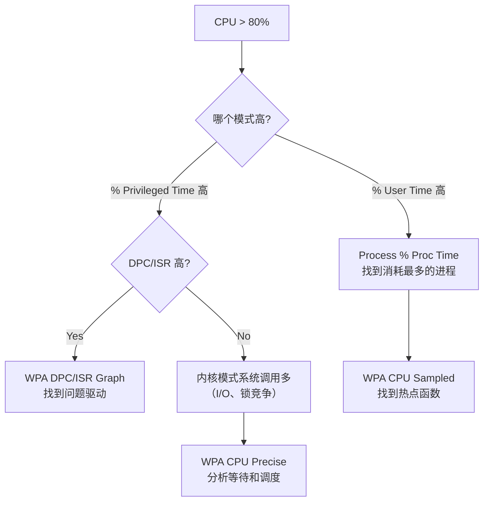
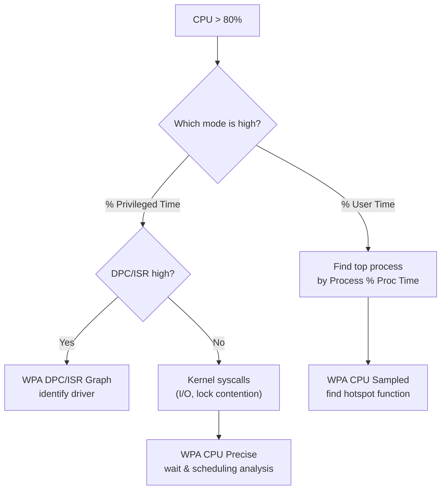

# Deep Dive: 处理器性能深度解析

**Topic:** Processor Performance Analysis  
**Category:** Performance  
**Level:** 中级 (Level 200)  
**Series:** Windows Performance Readiness (4/7)  
**Last Updated:** 2026-03-13

---

## 1. 概述 (Overview)

CPU 是最"直观"的性能指标 —— 任务管理器里的 CPU 百分比几乎每个人都看过。但仅看 `% Processor Time` 远远不够。

CPU 高的根因可能是：
- 应用代码效率低（**用户模式**消耗）
- 驱动程序问题（**内核模式 / DPC / ISR** 消耗）
- 频繁线程切换（**上下文切换**开销）
- 电源管理限制了 CPU 频率（**C-States / Core Parking**）
- 甚至是"假高 CPU"（监控工具本身的采样误差）

要定位根因，需要理解 CPU 时间的组成结构、关键计数器的含义，以及 WPA 中两种完全不同的 CPU 分析方法。

---

## 2. 核心概念 (Core Concepts)

### 2.1 进程与线程

| 概念 | 含义 | 类比 |
|------|------|------|
| **进程 (Process)** | 资源容器（虚拟地址空间、句柄、线程） | 一个"公司" |
| **线程 (Thread)** | 实际执行代码的单元，由操作系统调度到 CPU | 公司里的"员工" |
| **调度 (Scheduling)** | OS 决定哪个线程在哪个 CPU 上运行 | HR 分配工位 |

> 💡 **进程不消耗 CPU，线程才消耗 CPU**。说"这个进程 CPU 高"实际指"该进程内某些线程消耗大量 CPU"。

### 2.2 Idle 进程

当没有任何用户/系统线程需要运行时，CPU 执行 **Idle 线程**。  
**100% - Idle% = 实际 CPU 使用率**

### 2.3 用户模式 vs 内核模式

```
% Processor Time = % User Time + % Privileged Time
      (总)            (应用代码)     (内核/驱动代码)
```

| 模式 | 执行内容 | 典型消耗者 |
|------|---------|-----------|
| **用户模式 (User)** | 应用程序代码 | 应用逻辑、.NET 运行时、脚本引擎 |
| **内核模式 (Privileged)** | 内核、驱动程序 | 文件系统、网络栈、I/O 管理器、DPC/ISR |

> ⚠️ 如果 `% Privileged Time` 很高而 `% User Time` 低 → 问题在内核/驱动侧。

---

## 3. Perfmon 计数器详解

### 3.1 两个 Processor 对象的区别

| 对象 | 显示内容 | 适用场景 |
|------|---------|---------|
| **Processor** | 每个逻辑处理器 | 32 个核以内 |
| **Processor Information** | 按 Group/Numa Node/Core 分组 | **推荐**：支持 >64 核 |

### 3.2 关键阈值

| 计数器 | 正常 | 警告 | 严重 |
|--------|------|------|------|
| **% Processor Time** | < 50% | 50-80% | > 80% |
| **% Privileged Time** | < 30% | 30-50% | > 50% |
| **Processor Queue Length** | < 10 per CPU | 10-20 | > 20 |
| **Context Switches/sec** | < 2500 × CPU 数 | 趋势上升 | 高且持续 |

### 3.3 Process(*)\% Processor Time 的特殊性

> ⚠️ **在多 CPU 系统中，进程的 % Processor Time 可以超过 100%！**

4 核系统 → 单进程最大可达 400%  
这不是 bug —— 它是所有线程消耗时间的**总和**。

要看每个进程归一化到系统总 CPU 的比例：
```
Process % of Total CPU = Process(X)\% Processor Time / (N × 100)
其中 N = 逻辑处理器数量
```

### 3.4 实时工具

**Task Manager (任务管理器)：**
- CPU 列默认显示归一化百分比（总 CPU 为 100%）
- 右键列标题 → 可添加 "CPU time" 列查看累计 CPU 时间

**Resource Monitor (资源监视器)：**
- 比 Task Manager 更详细：显示 PID、Description、Threads、Average CPU
- 可以看到每个进程的 CPU 使用曲线

---

## 4. DPC 和中断 (DPC & ISR)

### 4.1 什么是 DPC 和 ISR？

| 概念 | 全称 | 含义 |
|------|------|------|
| **ISR** | Interrupt Service Routine | 硬件中断处理 —— 最高优先级，必须立即执行 |
| **DPC** | Deferred Procedure Call | 延迟过程调用 —— ISR 完成后的后续处理 |

**执行优先级：** ISR > DPC > 普通线程

```
硬件中断 → ISR（极短，只做最必要的事）→ 排队一个 DPC → DPC 完成剩余处理
                                                          ↓
                                              普通线程恢复执行
```

### 4.2 为什么 DPC/ISR 很重要？

**DPC 和 ISR 在执行时会"抢占"所有普通线程的 CPU 时间。**

如果某个驱动的 DPC/ISR 占用过多 CPU：
- 应用线程被"饿死"（starved）
- 系统表现为"卡顿"但 Process CPU 不高
- 音频/视频播放出现"毛刺" (glitching)

### 4.3 DPC/ISR 阈值

| 计数器 | 正常 | 需要调查 |
|--------|------|---------|
| % DPC Time | < 5% | > 5% 持续 |
| % Interrupt Time | < 5% | > 5% 持续 |
| DPCs Queued/sec | 趋势稳定 | 持续上升 |

> 💡 高 DPC → 通常是网络或存储驱动的问题  
> 💡 高 ISR → 通常是硬件问题或驱动程序 bug

---

## 5. 上下文切换 (Context Switches)

### 5.1 什么是上下文切换？

CPU 从执行线程 A 切换到线程 B 时，必须：
1. 保存线程 A 的寄存器状态
2. 加载线程 B 的寄存器状态
3. 切换内存映射
4. 恢复执行

**每次上下文切换都有开销** —— 切换本身不做有用的工作。

### 5.2 上下文切换的原因

| 原因 | 说明 |
|------|------|
| **自愿 (Voluntary)** | 线程主动等待 I/O、锁、事件 |
| **非自愿 (Involuntary)** | 时间片用完、更高优先级线程抢占 |
| **DPC/ISR 抢占** | 硬件中断导致的切换 |

### 5.3 阈值

```
基准线：Context Switches/sec < 2500 × 逻辑处理器数量

8 核系统：< 20,000 /sec 正常
16 核系统：< 40,000 /sec 正常
```

> 上下文切换本身不是"坏事" —— 它是多任务的正常开销。只有**异常增高的趋势**才值得调查。

---

## 6. NUMA 架构 (NUMA)

### 6.1 什么是 NUMA？

**Non-Uniform Memory Access** —— 在多 CPU 插槽的服务器中，每个 CPU 都有"自己的"本地 RAM。

```
┌────────────────────┐     ┌────────────────────┐
│  NUMA Node 0       │     │  NUMA Node 1       │
│  CPU 0-7           │     │  CPU 8-15          │
│  32 GB 本地 RAM    │←──→│  32 GB 本地 RAM    │
│  (快)              │ 互连 │  (快)              │
└────────────────────┘ (慢) └────────────────────┘

CPU 0 访问 Node 0 的 RAM → 快 (本地)
CPU 0 访问 Node 1 的 RAM → 慢 (远程，通过互连)
```

### 6.2 NUMA 对性能的影响

- 理想情况：进程分配在单个 NUMA Node 上 → 最佳性能
- 跨 Node 访问 → 额外延迟
- SQL Server、Hyper-V 等大应用都有 NUMA 感知优化

---

## 7. 电源管理对 CPU 的影响

### 7.1 C-States（处理器空闲状态）

| 状态 | 含义 | 唤醒延迟 |
|------|------|---------|
| **C0** | 活跃执行 | 无 |
| **C1** | 停止执行但可快速恢复 | 极低 |
| **C2** | 深度节能 | 低 |
| **C3+** | 更深度节能 | 更高 |

### 7.2 Frequency Scaling（频率缩放）

- CPU 可能未运行在最大频率 → 看起来 CPU% 高但实际频率被限制
- `\Processor Information(*)\% of Maximum Frequency` 显示当前频率百分比
- 如果 < 100% → CPU 被电源策略限制了

### 7.3 Core Parking（核心停靠）

- 低负载时，OS 可能"停靠"部分 CPU 核心以省电
- 被停靠的核心不参与调度 → 有效 CPU 数量减少
- `\Processor Information(*)\Parking Status` 查看核心是否被停靠

> 💡 **性能排查时**：先确认电源计划设为"高性能"，排除电源管理的影响。

---

## 8. WPA CPU 分析 (WPA CPU Analysis)

### 8.1 两种分析方法

| 方法 | 原理 | 适用场景 |
|------|------|---------|
| **CPU Usage (Sampled)** | 每 1ms 中断采样"谁在运行" | **CPU 高**时找哪个函数消耗最多 |
| **CPU Usage (Precise)** | 记录每次上下文切换事件 | **等待分析**：为什么线程不运行？ |

### 8.2 CPU Usage (Sampled) — 采样分析

**原理**：每毫秒产生一次 Profile 中断，记录当时正在执行的线程和调用栈。

**核心度量：** `Weight` = 采样中该函数/栈出现的次数。Weight 越高 = 消耗 CPU 越多。

**分析步骤：**
1. 按 `Process` 分组，找到 CPU 最高的进程
2. 展开进程，按 `Stack` 查看调用栈
3. 从栈底向上找到 `Weight` 突然集中的函数 → 那就是 CPU 热点

### 8.3 CPU Usage (Precise) — 精确分析

**原理**：记录每次线程状态变化（Ready/Running/Waiting），可以精确到微秒。

**核心概念 — 线程状态：**

```
     ┌──── Ready ────┐
     │ (等待被调度)    │
     │               ▼
Waiting ←── Running ──→ Terminated
(等待事件)   (正在执行)
```

| 列 | 含义 |
|----|------|
| **NewThreadId** | 被调度执行的线程 |
| **ReadyingThreadId** | 唤醒 NewThread 的线程 |
| **SwitchInTime** | 线程开始执行的时间 |
| **TimeSinceLast (µs)** | 上次被调度到这次的间隔 |

**Wait Analysis（等待分析）：**
- 用 Precise 数据看线程在**等什么** → 找到 Ready Time（等待被调度）和 Wait Time（等待事件）
- Wait Time 长 → 看 ReadyingThread → 追踪"谁唤醒了我" → 找到依赖链

### 8.4 DPC/ISR 分析

WPA 中 DPC/ISR graph 可以：
- 按 Module 分组 → 找到消耗最多 DPC 时间的驱动
- 查看 Fragment Duration → 发现超长的单次 DPC 执行
- 关联 CPU 和时间线 → 看 DPC 与应用线程的干扰关系

---

## 9. 快速参考卡 (Quick Reference)

### CPU 排查决策树



### 核心阈值速查

| 计数器 | 正常 | 警告 | 严重 |
|--------|------|------|------|
| % Processor Time | < 50% | 50-80% | > 80% |
| % Privileged Time | < 30% | 30-50% | > 50% |
| % DPC Time | < 5% | 5-10% | > 10% |
| % Interrupt Time | < 5% | 5-10% | > 10% |
| Context Switches/sec | < 2500×N | 趋势上升 | 高且持续 |
| Processor Queue Length | < 10/CPU | 10-20 | > 20/CPU |

### WPA 录制

```powershell
# 通用 CPU 分析
wpr -start CPU

# CPU + 上下文切换 + DPC/ISR
wpr -start GeneralProfile

# 精确上下文切换分析
wpr -start CPU -start CSwitch

# DPC/ISR 专项
wpr -start DPC_ISR
```

### 诊断口诀

```
1. CPU 高先分 User vs Privileged
2. Privileged 高看 DPC/ISR 是否异常
3. 进程 CPU > 100% 是正常的（多 CPU 系统）
4. Context Switch 高不一定有问题 → 看趋势
5. 频率 < 100% → 先检查电源计划
```

---

## 10. 参考资料 (References)

- [Windows Performance Toolkit](https://learn.microsoft.com/windows-hardware/test/wpt/) — WPR/WPA 官方文档
- [Introduction to WPR](https://learn.microsoft.com/windows-hardware/test/wpt/introduction-to-wpr) — WPR 功能介绍

---

## 11. 系列导航 (Series Navigation)

| # | Level | 主题 | 状态 |
|---|-------|------|------|
| 1 | 100 | 性能监控工具全景 | ✅ |
| 2 | 200 | 存储性能深度解析 | ✅ |
| 3 | 200 | 内存性能深度解析 | ✅ |
| **4** | **200** | **处理器性能深度解析 (本文)** | ✅ |
| 5 | 200 | 网络性能深度解析 | 📝 |
| 6 | 300 | WPR/WPA 高级分析技术 | 📝 |
| 7 | 300 | 性能排查方法论 | 📝 |

---

---

# English Version

---

# Deep Dive: Processor Performance Analysis

**Topic:** Processor Performance Analysis  
**Category:** Performance  
**Level:** Intermediate (Level 200)  
**Series:** Windows Performance Readiness (4/7)  
**Last Updated:** 2026-03-13

---

## 1. Overview

CPU is the most "visible" performance metric — everyone has seen the CPU percentage in Task Manager. But looking at `% Processor Time` alone is far from sufficient.

Root causes of high CPU include:
- Inefficient application code (**User mode**)
- Driver problems (**Kernel mode / DPC / ISR**)
- Excessive thread switching (**Context switch** overhead)
- Power management throttling (**C-States / Core Parking**)

---

## 2. Core Concepts

### Processes and Threads

- **Processes** don't consume CPU — **threads** do
- The scheduler assigns threads to CPUs based on priority

### User Mode vs Kernel Mode

```
% Processor Time = % User Time + % Privileged Time
```

| Mode | Content | Typical Consumers |
|------|---------|-------------------|
| **User** | Application code | App logic, .NET runtime |
| **Privileged** | Kernel + drivers | File system, network stack, I/O |

---

## 3. Key Counters and Thresholds

| Counter | OK | Warning | Critical |
|---------|----|---------| ---------|
| % Processor Time | < 50% | 50-80% | > 80% |
| % Privileged Time | < 30% | 30-50% | > 50% |
| % DPC Time | < 5% | 5-10% | > 10% |
| % Interrupt Time | < 5% | 5-10% | > 10% |
| Context Switches/sec | < 2500×N | Trending up | High sustained |
| Processor Queue Length | < 10/CPU | 10-20 | > 20/CPU |

### Process % Processor Time Can Exceed 100%

On a 4-core system, a single process can reach up to 400%. This is the **sum** of all its threads' CPU time — not a bug.

---

## 4. DPC and Interrupts

| Concept | Full Name | Priority |
|---------|-----------|----------|
| **ISR** | Interrupt Service Routine | Highest — immediate hardware response |
| **DPC** | Deferred Procedure Call | Below ISR, above normal threads |

**Why this matters:** DPC/ISR execution **preempts all normal threads**. A misbehaving driver can cause application starvation — the system feels "laggy" even though process CPU looks normal.

---

## 5. Context Switches

Each context switch saves/restores thread state and has overhead.

**Types:**
- **Voluntary**: Thread waiting for I/O, lock, event
- **Involuntary**: Time slice expired, preempted by higher priority

**Baseline:** < 2,500 × number of logical processors per second

---

## 6. NUMA Architecture

On multi-socket servers, each CPU socket has local RAM. Accessing remote NUMA node memory adds latency. Ensure performance-critical applications are NUMA-aware.

---

## 7. Power Management Impact

- **C-States**: Processor idle states — deeper sleep = longer wake-up latency
- **Frequency Scaling**: CPU may not run at max frequency. Check `% of Maximum Frequency`
- **Core Parking**: OS parks idle cores to save power, reducing available CPUs

> 💡 For troubleshooting: Set power plan to **High Performance** first to eliminate power management effects.

---

## 8. WPA CPU Analysis

### Two Analysis Methods

| Method | Principle | Best For |
|--------|-----------|----------|
| **CPU Sampled** | 1ms profile interrupt sampling | Finding which function burns CPU |
| **CPU Precise** | Records every context switch | Wait analysis: why is a thread NOT running? |

### CPU Sampled — Profiling

1. Group by Process → find highest-CPU process
2. Expand → view call Stack
3. Find where `Weight` concentrates → that's the CPU hotspot

### CPU Precise — Wait Analysis

Tracks thread state transitions: Waiting → Ready → Running

- Long **Wait Time** → find what the thread is waiting for
- Trace the **ReadyingThread** → identify dependency chains

### DPC/ISR Analysis

- Group by Module → find the driver consuming most DPC time
- Check Fragment Duration → find unusually long individual DPC executions

---

## 9. CPU Troubleshooting Decision Tree



---

## 10. Quick Reference

```
1. CPU high → split User vs Privileged first
2. Privileged high → check DPC/ISR
3. Process CPU > 100% is normal (multi-CPU)
4. Context switches high → check trend, not absolute
5. Frequency < 100% → check power plan first
```

```powershell
wpr -start CPU                    # General CPU analysis
wpr -start GeneralProfile         # CPU + CSwitch + DPC/ISR
wpr -start DPC_ISR                # DPC/ISR specific
```

---

## 11. References

- [Windows Performance Toolkit](https://learn.microsoft.com/windows-hardware/test/wpt/) — WPR/WPA official documentation
- [Introduction to WPR](https://learn.microsoft.com/windows-hardware/test/wpt/introduction-to-wpr) — WPR feature guide

---

## 12. Series Navigation

| # | Level | Topic | Status |
|---|-------|-------|--------|
| 1 | 100 | Performance Monitoring Toolkit Overview | ✅ |
| 2 | 200 | Storage Performance Deep Dive | ✅ |
| 3 | 200 | Memory Performance Deep Dive | ✅ |
| **4** | **200** | **Processor Performance Deep Dive (this article)** | ✅ |
| 5 | 200 | Network Performance Deep Dive | 📝 |
| 6 | 300 | WPR/WPA Advanced Analysis Techniques | 📝 |
| 7 | 300 | Performance Troubleshooting Methodology | 📝 |
