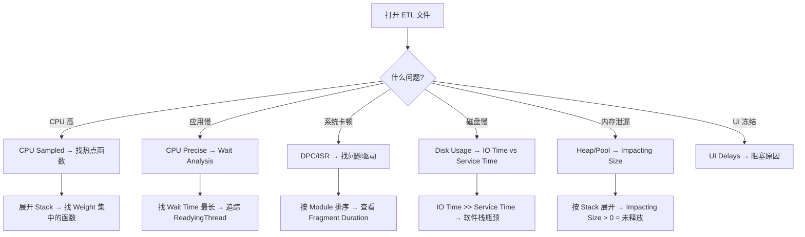
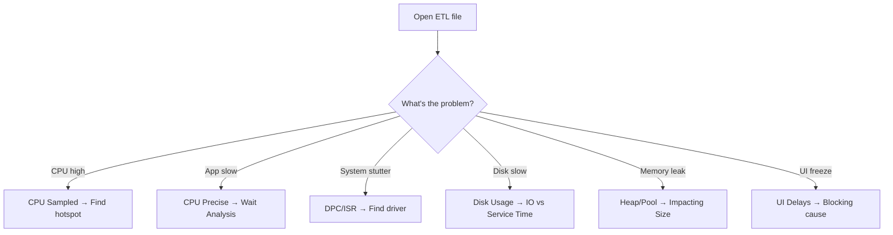

# Deep Dive: WPR/WPA 高级分析技术

**Topic:** Advanced WPR/WPA Analysis Techniques  
**Category:** Performance  
**Level:** 高级 (Level 300)  
**Series:** Windows Performance Readiness (6/7)  
**Last Updated:** 2026-03-13

---

## 1. 概述 (Overview)

**Windows Performance Recorder (WPR)** 和 **Windows Performance Analyzer (WPA)** 是 Windows 性能分析的终极武器。

Perfmon 告诉你 **"发生了什么"**（CPU 高了、磁盘慢了），WPA 告诉你 **"为什么发生"**（具体哪个函数消耗 CPU、哪个线程等待了什么锁、哪个驱动导致磁盘延迟）。

本文是 Level 300 内容 —— 假设你已经理解了前面 5 篇的基础知识，直接进入实战分析技术。

---

## 2. WPR 录制技巧 (WPR Recording)

### 2.1 两种录制模式

| 模式 | 特点 | 适用场景 |
|------|------|---------|
| **Memory** (默认) | 循环缓冲区，自动覆盖旧数据 | 间歇性问题 → 等问题出现再保存 |
| **File** (-filemode) | 写入文件，不覆盖 | 需要完整记录（如从开机到问题出现） |

### 2.2 Profile 选择指南

| Profile | 包含的 Provider | 适用场景 |
|---------|-----------------|---------|
| **GeneralProfile** | CPU, 磁盘, 内存, 网络 | 通用分析起点 |
| **CPU** | CPU Sampled + Precise (CSwitch) | CPU 高 |
| **DPC_ISR** | DPC/ISR 事件 | 系统卡顿、音频毛刺 |
| **Heap** | 堆分配/释放 | 用户模式内存泄漏 |
| **Pool** | 内核池分配 | 内核模式内存泄漏 |
| **VirtualAllocation** | VA 分配 | 虚拟内存问题 |
| **Handle** | 句柄创建/关闭 | 句柄泄漏 |
| **ResidentSet** | 物理内存快照 | 谁占了 RAM |
| **FileIO** | 文件 I/O 事件 | 文件访问性能 |
| **Network** | TCP/IP 事件 | 网络问题 |

### 2.3 Detail Level

| 级别 | 数据量 | 使用时机 |
|------|--------|---------|
| **Light** | 较少 | 足以做基本 CPU/磁盘分析 |
| **Verbose** | 很大 | 需要详细调用栈、完整事件 |

### 2.4 组合录制

```powershell
# 多个 Profile 可以叠加
wpr -start GeneralProfile -start Heap -start Pool -filemode

# 停止并保存
wpr -stop C:\traces\mytrace.etl

# 取消录制
wpr -cancel
```

> ⚠️ 同时启用多个 Profile 会显著增加系统开销和 trace 文件大小。

### 2.5 远程/命令行录制

```powershell
# 列出可用 Profile
wpr -profiles

# 查看当前录制状态
wpr -status

# 录制指定时长（file 模式下，通过脚本控制）
wpr -start GeneralProfile -filemode
Start-Sleep -Seconds 60
wpr -stop C:\traces\perf_capture.etl
```

---

## 3. WPA 界面掌握 (WPA UI Mastery)

### 3.1 核心布局

```
┌──────────────────────────────────────────────┐
│  Graph Explorer（图表浏览器）                   │
│  ├── System Activity                          │
│  ├── Computation                              │
│  │   ├── CPU Usage (Sampled)                  │
│  │   ├── CPU Usage (Precise)                  │
│  │   └── DPC/ISR                              │
│  ├── Storage                                  │
│  │   ├── Disk Usage                           │
│  │   └── File I/O                             │
│  ├── Memory                                   │
│  │   ├── Virtual Memory Snapshots             │
│  │   └── Resident Set                         │
│  └── Power                                    │
├──────────────────────────────────────────────┤
│  Analysis Tab（分析标签页）                     │
│  拖拽图表到这里 → 展开为详细数据表格             │
└──────────────────────────────────────────────┘
```

### 3.2 关键操作

| 操作 | 方法 |
|------|------|
| **添加图表** | 从 Graph Explorer 拖到 Analysis 标签页 |
| **缩放** | 在图表上选择时间范围 → 右键 → Zoom |
| **高亮** | 选择时间范围 → 右键 → Highlight Selection |
| **View Preset** | 右键图表标题 → 选择不同的 Preset（改变列布局） |
| **过滤** | 右键列 → Filter |

### 3.3 表格中的"金线" (Gold Bar)

WPA 数据表格中有一条可拖动的**黄色竖线 (Gold Bar)**：

```
[ Process | Module | Function ] ‖ [ Weight | Count ]
                                ‖
                              Gold Bar
```

- 黄线**左边**：分组/聚合键（Group By）
- 黄线**右边**：显示的度量值
- 拖动列到左边或右边改变聚合方式

---

## 4. CPU Usage (Sampled) — 找出谁烧了 CPU

### 4.1 原理

每 1ms 产生一次 Profile 中断，记录当时：
- 哪个进程在运行
- 哪个线程在运行
- 完整的调用栈

**Weight** = 该行在采样中出现的次数 ≈ 该函数消耗的 CPU 毫秒数。

### 4.2 分析步骤

**推荐 View Preset: `Utilization by Process, Stack`**

1. **找最高 CPU 进程**：按 Weight 降序排序
2. **展开调用栈**：从进程展开 → 看 Stack
3. **识别热点**：找到 Weight 突然集中的函数

```
示例调用栈解读：
Process: sqlservr.exe (Weight: 15000)
  └── ntoskrnl.exe!KiInterruptDispatch
      └── ntoskrnl.exe!KiDpcDispatch
          └── storport.sys!RaidUnitStartIo    ← 存储驱动！
              └── disk.sys!DiskReadWrite

→ 结论：SQL Server 的 CPU 消耗主要在存储 I/O 相关的内核代码
```

### 4.3 符号加载 (Symbols)

正确的符号 **至关重要** —— 没有符号只能看到地址而不是函数名。

```
WPA → Trace → Configure Symbol Paths
  → 添加 Microsoft 公共符号服务器：
    srv*C:\Symbols*https://msdl.microsoft.com/download/symbols
```

---

## 5. CPU Usage (Precise) — 等待分析

### 5.1 原理

不采样，而是记录**每一次上下文切换**：
- 谁被换出 (Old Thread)
- 谁被换入 (New Thread)  
- 为什么被换出（时间片到期？等待 I/O？等待锁？）
- 谁唤醒了被换入的线程 (Readying Thread)

### 5.2 核心概念 — 线程状态

```
                  ┌──────────┐
      唤醒事件 ──→ │  Ready   │ ──── 被调度 ──→ ┌─────────┐
                  │ (可运行) │              │ Running │
                  └──────────┘              │ (运行中) │
                       ↑                    └────┬────┘
                       │                         │
                  ReadyingThread             等待/时间片到期
                       │                         │
                  ┌────┴─────┐              ┌────▼────┐
                  │ Waiting  │ ←────────── │ Waiting  │
                  │ (等待中) │              │ (等待中)  │
                  └──────────┘              └──────────┘
```

### 5.3 Wait Analysis 步骤

**推荐 View Preset: `Utilization by Process, Thread`**

1. **找到目标线程**：知道哪个线程"慢"
2. **看 Wait Time**：线程在等什么？
   - Wait (ms) 高 → 线程在等待事件（I/O、锁、信号量）
   - Ready (ms) 高 → 线程可以运行但 CPU 不够（排队）
3. **追踪 ReadyingThread**：
   - "是谁唤醒了我的线程？" → ReadyingThread
   - ReadyingThread 是 I/O 完成线程？→ I/O 瓶颈
   - ReadyingThread 是另一个应用线程？→ 应用内部依赖

### 5.4 关键列

| 列 | 含义 |
|----|------|
| **NewProcess / NewThreadId** | 被换入执行的线程 |
| **OldProcess / OldThreadId** | 被换出的线程 |
| **NewThreadStack** | 新线程的调用栈（它在等什么之后被唤醒） |
| **ReadyingProcess / ReadyingThreadId** | 唤醒新线程的线程 |
| **ReadyThreadStack** | 唤醒者的调用栈 |
| **TimeSinceLast (µs)** | 从上次运行到现在的间隔 |
| **Wait (ms)** | 等待时间 |
| **Ready (ms)** | 就绪但等待 CPU 调度的时间 |

---

## 6. DPC/ISR 分析

### 6.1 DPC/ISR Graph

从 Graph Explorer → Computation → DPC/ISR 拖入 Analysis。

**推荐 View Preset: `DPC/ISR Duration by Module`**

### 6.2 分析步骤

1. **按 Module 分组**：找到消耗最多 DPC 时间的驱动
2. **查看 Duration**：
   - **Inclusive Duration**：DPC 总执行时间
   - **Exclusive Duration**：排除子调用的时间
3. **Fragment Diagram**：每个小块 = 一次 DPC 执行
   - 正常：短小均匀的块
   - 异常：偶尔出现**很长的块** → 该驱动有问题

### 6.3 常见 DPC 问题来源

| 驱动/模块 | 含义 |
|-----------|------|
| `ndis.sys` | 网络 |
| `storport.sys` / `stornvme.sys` | 存储 |
| `tcpip.sys` | TCP/IP 栈 |
| `Wdf01000.sys` | WDF 框架驱动 |
| `dxgkrnl.sys` | 显示驱动 |

---

## 7. 存储分析 (Disk Usage)

### 7.1 Disk Usage Graph

**推荐 View Preset: `Disk Usage by Process, Path`**

### 7.2 两个关键时间

| 度量 | 含义 |
|------|------|
| **IO Time (ms)** | 从应用发起 I/O 到完成的总时间 |
| **Disk Service Time (ms)** | I/O 在磁盘队列中等待 + 磁盘执行的时间 |

```
IO Time = 软件栈延迟 + 队列等待 + Disk Service Time
```

如果 IO Time >> Disk Service Time → 软件栈有瓶颈（如文件系统 filter driver）  
如果 IO Time ≈ Disk Service Time → 磁盘本身慢

### 7.3 File I/O Graph

比 Disk Usage 更高层 —— 显示文件级别的 I/O：
- 哪个进程读写了哪个文件
- 文件路径
- I/O 类型 (Read/Write/Flush)

### 7.4 注册表 I/O

Registry graph 显示注册表操作：
- 哪个进程访问了哪个注册表键
- 操作类型 (Open/Query/Set/Delete)
- 对于"启动慢"问题，可以看到哪些程序在疯狂读注册表

---

## 8. 内存分析 (Memory Analysis in WPA)

### 8.1 Heap Allocations — 用户模式泄漏检测

**前提**：需要先启用目标进程的堆跟踪

```powershell
# 在录制前设置
reg add "HKLM\SOFTWARE\Microsoft\Windows NT\CurrentVersion\Image File Execution Options\myapp.exe" /v TracingFlags /t REG_DWORD /d 1

# 或使用 gflags
gflags /i myapp.exe +ust

# 然后录制
wpr -start Heap -filemode

# 复现问题后停止
wpr -stop heap_trace.etl
```

**WPA 分析：**

1. 打开 Memory → Heap Allocations
2. 按 Process → Type → Stack 展开
3. 找 **Impacting Size** 最大的分配
   - Impacting Size > 0 = 该内存在观察窗口结束时**未被释放**
   - 对比不同时间段 → Impacting Size 持续增长 = 泄漏

### 8.2 Pool — 内核泄漏检测

```powershell
wpr -start Pool -filemode
# 重现问题
wpr -stop pool_trace.etl
```

**WPA 分析：**
1. 找 Pool Type (Paged 或 NonPaged)
2. 按 Tag Name 排序 → 找最大的 Tag
3. 展开看 Stack → 定位分配的驱动/模块

### 8.3 Resident Set — RAM 快照

在 trace 结束时拍摄的物理 RAM 快照。

- 按 Process → Page Category 展开
- 重点看 **Active** 页面（当前影响内存使用的部分）
- Page Category 包括：VirtualAlloc、Win32Heap、Image、MapFile、PFMappedSection 等

### 8.4 Impacting Size 概念详解

**Impacting Size** 是 WPA 内存分析中最重要的度量：

```
时间窗口：[────────────── 10 分钟 ──────────────]

分配 A：分配 100MB ──── 释放 ─────────────────
分配 B：──── 分配 50MB ──────────────────────── (未释放)
分配 C：────────── 分配 200MB ─── 释放 ────────

Impacting Size at end:
  A = 0 MB (已释放)
  B = 50 MB (未释放 → 可能泄漏)
  C = 0 MB (已释放)
```

---

## 9. 系统活动分析 (System Activity)

### 9.1 Processes Graph

显示 trace 期间的进程生命周期：
- 进程创建/退出时间
- 进程命令行参数
- 对排查"哪个进程什么时候启动的"特别有用

### 9.2 Generic Events

通用 ETW 事件图 —— 任何 provider 的事件都在这里：
- 可以按 Provider Name → Event Name → Field 展开
- 用于分析应用自定义事件

### 9.3 UI Delays

专门检测"用户界面无响应"：
- 记录 UI 线程被阻塞超过 200ms 的事件
- 显示是什么操作导致了 UI 冻结
- 对排查"应用卡顿"非常有用

### 9.4 Boot / Shutdown 分析

WPA 支持分析启动和关机的 trace：
- Boot 各阶段耗时
- 哪些服务启动最慢
- 哪些启动项拖累了启动速度

---

## 10. 调用栈分析技巧 (Call Stack Analysis Tips)

### 10.1 阅读调用栈

```
调用栈从下往上读：
  myapp.exe!main
    └── myapp.exe!ProcessData
        └── myapp.exe!ReadFile
            └── ntdll.dll!NtReadFile
                └── ntoskrnl.exe!NtReadFile    ← 进入内核
                    └── ntoskrnl.exe!IoCallDriver
                        └── fltmgr.sys!FltpPerformIo  ← Filter Manager
                            └── storport.sys!...
```

### 10.2 关键模式识别

| 栈中出现的模块 | 含义 |
|--------------|------|
| `ntoskrnl.exe!Ke*Wait*` | 线程在等待 |
| `ntoskrnl.exe!Ki*Interrupt*` | 中断处理 |
| `fltmgr.sys` | 文件系统 filter（杀毒软件常见） |
| `ntfs.sys` / `refs.sys` | 文件系统 |
| `storport.sys` | 存储端口驱动 |
| `tcpip.sys` | 网络栈 |
| `clr.dll` / `coreclr.dll` | .NET 运行时 |

### 10.3 Exclusive vs Inclusive Time

| 度量 | 含义 |
|------|------|
| **Inclusive** | 该函数 + 它调用的所有子函数的总时间 |
| **Exclusive** | 只有该函数本身执行的时间（不含子调用） |

> 💡 Exclusive time 高 = 该函数本身是热点  
> Inclusive time 高但 Exclusive 低 = 热点在它的子函数中

---

## 11. 快速参考卡 (Quick Reference)

### WPR Profile 速查

| 场景 | Profile 组合 |
|------|-------------|
| 通用排查 | `wpr -start GeneralProfile` |
| CPU 高 | `wpr -start CPU` |
| 系统卡顿/DPC | `wpr -start GeneralProfile -start DPC_ISR` |
| 用户内存泄漏 | `wpr -start Heap -filemode` |
| 内核内存泄漏 | `wpr -start Pool -filemode` |
| 句柄泄漏 | `wpr -start Handle -filemode` |
| 磁盘慢 | `wpr -start GeneralProfile` |
| 启动慢 | `wpr -start Boot` (重启后自动录制) |

### WPA 分析决策树



### 诊断口诀

```
1. 通用问题 → GeneralProfile 录制
2. CPU 高 → Sampled 找函数，Precise 看等待
3. DPC/ISR → 找 Module，看 Fragment 长度
4. 磁盘 → IO Time vs Disk Service Time 对比
5. 内存 → Impacting Size 是泄漏检测的关键
6. 永远先加载符号 (Symbols)！
```

---

## 12. 参考资料 (References)

- [Windows Performance Toolkit](https://learn.microsoft.com/windows-hardware/test/wpt/) — WPR/WPA 官方文档
- [Introduction to WPR](https://learn.microsoft.com/windows-hardware/test/wpt/introduction-to-wpr) — WPR 功能介绍

---

## 13. 系列导航 (Series Navigation)

| # | Level | 主题 | 状态 |
|---|-------|------|------|
| 1 | 100 | 性能监控工具全景 | ✅ |
| 2 | 200 | 存储性能深度解析 | ✅ |
| 3 | 200 | 内存性能深度解析 | ✅ |
| 4 | 200 | 处理器性能深度解析 | ✅ |
| 5 | 200 | 网络性能深度解析 | ✅ |
| **6** | **300** | **WPR/WPA 高级分析技术 (本文)** | ✅ |
| 7 | 300 | 性能排查方法论 | 📝 |

---

---

# English Version

---

# Deep Dive: Advanced WPR/WPA Analysis Techniques

**Topic:** Advanced WPR/WPA Analysis Techniques  
**Category:** Performance  
**Level:** Advanced (Level 300)  
**Series:** Windows Performance Readiness (6/7)  
**Last Updated:** 2026-03-13

---

## 1. Overview

**WPR** and **WPA** are the ultimate weapons for Windows performance analysis. Perfmon tells you **what** happened (CPU high, disk slow). WPA tells you **why** (which function burns CPU, which lock a thread waits on, which driver causes disk latency).

---

## 2. WPR Recording

### Two Recording Modes

| Mode | Behavior | Use Case |
|------|----------|----------|
| **Memory** (default) | Circular buffer, overwrites old data | Intermittent issues — save when problem occurs |
| **File** (-filemode) | Writes to file, no overwrite | Need complete record (e.g., from boot to issue) |

### Profile Selection Guide

| Profile | Best For |
|---------|----------|
| GeneralProfile | General starting point |
| CPU | High CPU |
| DPC_ISR | System stuttering |
| Heap | User-mode memory leak |
| Pool | Kernel memory leak |
| Handle | Handle leak |
| ResidentSet | RAM composition |

### Combined Recording

```powershell
wpr -start GeneralProfile -start Heap -start Pool -filemode
wpr -stop C:\traces\mytrace.etl
```

---

## 3. WPA UI

### Layout

- **Graph Explorer**: Tree of available graphs (System Activity, Computation, Storage, Memory, Power)
- **Analysis Tab**: Drag graphs here for detailed data tables

### The Gold Bar

The yellow vertical line in data tables separates:
- **Left**: Group-by keys
- **Right**: Displayed metrics

---

## 4. CPU Sampled — Finding CPU Hotspots

**Principle**: 1ms profile interrupt sampling records which function is executing.

**Key metric**: `Weight` = number of samples ≈ CPU milliseconds consumed.

**Steps:**
1. Sort by Weight → find top process
2. Expand Stack → find where Weight concentrates
3. That function is the CPU hotspot

---

## 5. CPU Precise — Wait Analysis

**Principle**: Records every context switch with full detail.

**Thread State Machine**: Waiting → Ready → Running

**Key columns:**
| Column | Meaning |
|--------|---------|
| NewThread | Thread being scheduled in |
| ReadyingThread | Thread that woke up NewThread |
| Wait (ms) | Time spent waiting for event |
| Ready (ms) | Time waiting for CPU scheduling |

**Steps:**
1. Find target thread
2. High Wait Time → thread waiting for I/O/lock/signal
3. Trace ReadyingThread → identify dependency chain

---

## 6. DPC/ISR Analysis

1. Group by Module → find driver consuming most DPC time
2. Check Fragment Duration → unusually long single DPC = problematic driver
3. Common sources: `ndis.sys` (network), `storport.sys` (storage), `tcpip.sys` (TCP/IP)

---

## 7. Storage Analysis

### IO Time vs Disk Service Time

| Metric | Meaning |
|--------|---------|
| IO Time | Total time from app request to completion |
| Disk Service Time | Queue wait + disk execution time |

- IO Time >> Service Time → software stack bottleneck
- IO Time ≈ Service Time → disk itself is slow

---

## 8. Memory Analysis

### Heap Allocations (User-mode leak detection)

1. Enable heap tracing: `gflags /i myapp.exe +ust`
2. Record: `wpr -start Heap -filemode`
3. In WPA: Find allocations with **Impacting Size > 0** → memory not freed = potential leak

### Pool (Kernel leak detection)

1. Record: `wpr -start Pool -filemode`
2. Sort by Tag Name → find largest tags
3. Expand Stack → identify leaking driver/module

### Impacting Size Explained

```
Impacting Size = memory allocated but NOT freed by end of observation window
  > 0 = potential leak
  = 0 = allocated and properly freed
```

---

## 9. System Activity

- **Processes Graph**: Process lifecycle (creation/exit, command line)
- **Generic Events**: Any ETW provider events
- **UI Delays**: Detects UI thread blocked > 200ms
- **Boot/Shutdown**: Startup phase analysis

---

## 10. Call Stack Tips

### Reading Call Stacks

Read bottom to top. Key modules to recognize:
- `ntoskrnl.exe!Ke*Wait*` → thread waiting
- `fltmgr.sys` → file system filter (antivirus common)
- `storport.sys` → storage driver
- `tcpip.sys` → network stack
- `clr.dll` → .NET runtime

### Exclusive vs Inclusive Time

- **Inclusive**: Function + all child calls
- **Exclusive**: Function itself only

> High Exclusive = function is the hotspot  
> High Inclusive but low Exclusive = hotspot is in child functions

---

## 11. WPA Analysis Decision Tree



---

## 12. Quick Reference

```
1. General issue → GeneralProfile recording
2. CPU high → Sampled for function, Precise for waits
3. DPC/ISR → Find Module, check Fragment duration
4. Disk → IO Time vs Disk Service Time comparison
5. Memory → Impacting Size is key to leak detection
6. Always load Symbols first!
```

---

## 13. References

- [Windows Performance Toolkit](https://learn.microsoft.com/windows-hardware/test/wpt/) — WPR/WPA official documentation
- [Introduction to WPR](https://learn.microsoft.com/windows-hardware/test/wpt/introduction-to-wpr) — WPR feature guide

---

## 14. Series Navigation

| # | Level | Topic | Status |
|---|-------|-------|--------|
| 1 | 100 | Performance Monitoring Toolkit Overview | ✅ |
| 2 | 200 | Storage Performance Deep Dive | ✅ |
| 3 | 200 | Memory Performance Deep Dive | ✅ |
| 4 | 200 | Processor Performance Deep Dive | ✅ |
| 5 | 200 | Network Performance Deep Dive | ✅ |
| **6** | **300** | **WPR/WPA Advanced Analysis (this article)** | ✅ |
| 7 | 300 | Performance Troubleshooting Methodology | 📝 |
