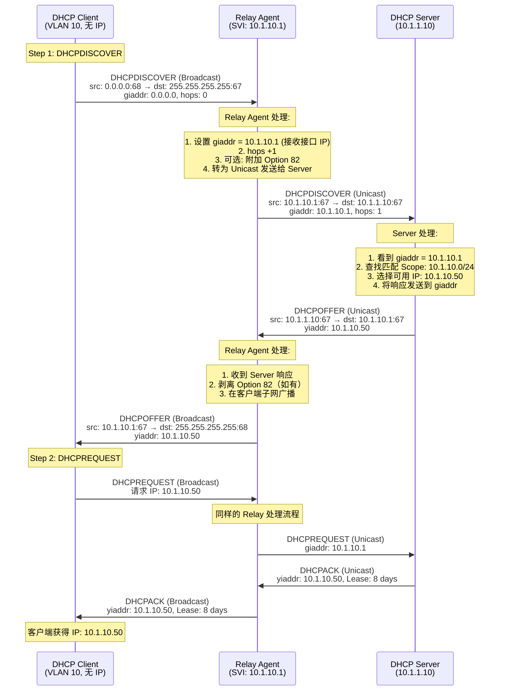

# Deep Dive: DHCP Relay Agent

**Topic:** DHCP Relay Agent — 原理、场景与排查  
**Category:** Networking  
**Level:** 高级 / Advanced  
**Last Updated:** 2026-03-17

---

## 1. 概述 (Overview)

DHCP Relay Agent（也称 IP Helper）是网络基础设施中一个**看似简单但极其关键**的组件。它解决了一个根本性的问题：**DHCP 协议基于广播（Broadcast），而路由器默认不转发广播包**。

在现代企业网络中，几乎不可能在每个子网都部署一台 DHCP 服务器。通常的架构是在数据中心集中部署少量 DHCP 服务器，服务于数十甚至数百个远程子网。这就需要一个"中间人"——Relay Agent——来把客户端子网上的 DHCP 广播"翻译"成服务器可路由的单播消息。

Relay Agent 的行为定义在 **RFC 2131**（DHCP 协议本身）和 **RFC 3046**（Option 82: Relay Agent Information Option）中。它可以运行在：
- **路由器/交换机**（最常见）：Cisco `ip helper-address`、Juniper `helper-address`
- **Windows Server**：通过 Remote Access 角色的 Routing 功能
- **Linux**：`dhcrelay` (ISC DHCP) 或 `kea-dhcp-relay`
- **虚拟化/云环境**：Azure NSX-T、VMware NSX 等

> **为什么 Support Engineer 需要深入理解 Relay Agent？** 因为超过 50% 的"DHCP 客户端无法获取 IP"故障，根因都在 Relay Agent 层面——配置错误、giaddr 不匹配、防火墙阻断、Scope 缺失等。

---

## 2. 核心概念 (Core Concepts)

### 2.1 GIADDR — Gateway IP Address

**GIADDR 是 Relay Agent 与 DHCP Server 交互的核心字段**，它在 DHCP 消息头部中占 4 个字节。

- **定义**：Relay Agent 在转发客户端请求时，将**接收到客户端广播的那个接口的 IP 地址**填入 GIADDR 字段
- **双重功能**：
  1. **告诉 DHCP Server 客户端在哪个子网**（Server 据此选择正确的 Scope 来分配 IP）
  2. **告诉 DHCP Server 把响应发回哪里**（Server 把 Offer/ACK 发送到 GIADDR 地址）

```
DHCP 消息头部中的 GIADDR 字段位置:

 0                   1                   2                   3
 0 1 2 3 4 5 6 7 8 9 0 1 2 3 4 5 6 7 8 9 0 1 2 3 4 5 6 7 8 9 0 1
+-+-+-+-+-+-+-+-+-+-+-+-+-+-+-+-+-+-+-+-+-+-+-+-+-+-+-+-+-+-+-+-+
|     op (1)    |   htype (1)   |   hlen (1)    |   hops (1)    |
+-+-+-+-+-+-+-+-+-+-+-+-+-+-+-+-+-+-+-+-+-+-+-+-+-+-+-+-+-+-+-+-+
|                            xid (4)                            |
+-+-+-+-+-+-+-+-+-+-+-+-+-+-+-+-+-+-+-+-+-+-+-+-+-+-+-+-+-+-+-+-+
|           secs (2)            |           flags (2)           |
+-+-+-+-+-+-+-+-+-+-+-+-+-+-+-+-+-+-+-+-+-+-+-+-+-+-+-+-+-+-+-+-+
|                          ciaddr (4)                           |
+-+-+-+-+-+-+-+-+-+-+-+-+-+-+-+-+-+-+-+-+-+-+-+-+-+-+-+-+-+-+-+-+
|                          yiaddr (4)                           |
+-+-+-+-+-+-+-+-+-+-+-+-+-+-+-+-+-+-+-+-+-+-+-+-+-+-+-+-+-+-+-+-+
|                          siaddr (4)                           |
+-+-+-+-+-+-+-+-+-+-+-+-+-+-+-+-+-+-+-+-+-+-+-+-+-+-+-+-+-+-+-+-+
|                       ★ giaddr (4) ★                          |  ← Relay Agent 填入的接口 IP
+-+-+-+-+-+-+-+-+-+-+-+-+-+-+-+-+-+-+-+-+-+-+-+-+-+-+-+-+-+-+-+-+
|                          chaddr (16)                          |
+-+-+-+-+-+-+-+-+-+-+-+-+-+-+-+-+-+-+-+-+-+-+-+-+-+-+-+-+-+-+-+-+
```

> **类比**：GIADDR 就像信件的"回邮地址"。Relay Agent 收到客户端的广播请求后，在信封上贴上自己的地址（GIADDR），然后把信转寄给 DHCP Server。Server 看到这个地址就知道客户端在哪个子网，并且知道把回信寄到哪里。

**关键规则（Windows DHCP Server）：**
- GIADDR **必须**属于某个已激活的 DHCP Scope 的 IP 地址范围
- 如果 GIADDR 不在任何 Scope 范围内，Windows DHCP Server 会将其视为 **Rogue Relay** 并**静默丢弃**请求
- 可以创建一个"授权 Scope"——包含 GIADDR 地址，但将其排除在分配范围之外

### 2.2 Hops 字段

- Relay Agent 每转发一次 DHCP 消息，`hops` 字段 +1
- DHCP Server 和 Relay Agent 可配置 **最大 hops 数**（默认通常为 4 或 16）
- 超过最大 hops 的消息会被丢弃，防止转发环路

### 2.3 Option 82 — Relay Agent Information Option (RFC 3046)

Option 82 是 Relay Agent 可以**附加到 DHCP 消息中的额外信息**，让 DHCP Server 获得更多关于客户端物理位置的上下文。

| Sub-option | 名称 | 内容 | 典型用途 |
|-----------|------|------|---------|
| **Sub-option 1** | **Circuit ID** | 客户端连接的物理端口/接口标识 | 识别客户端接入的具体交换机端口 |
| **Sub-option 2** | **Remote ID** | Relay Agent 自身的标识（如 MAC 或主机名） | 识别是哪台 Relay 转发的 |
| **Sub-option 5** | **Link Selection** (RFC 3527) | 指定客户端应从哪个子网获取 IP | GIADDR 不在客户端子网时使用 |

**Option 82 的工作流程：**
```
1. Client → Relay:  DHCPDISCOVER（广播，无 Option 82）
2. Relay → Server:  DHCPDISCOVER + 设置 GIADDR + 附加 Option 82
3. Server → Relay:  DHCPOFFER（发送到 GIADDR，包含 Option 82 回声）
4. Relay → Client:  DHCPOFFER（剥离 Option 82，广播给客户端）
```

> **重要**：Relay Agent 在返回消息给客户端时**必须剥离 Option 82**。如果客户端在下次请求中携带 Option 82，某些服务器会拒绝该请求。

### 2.4 UDP 端口

| 方向 | 源端口 | 目标端口 | 说明 |
|------|--------|---------|------|
| Client → Relay | **UDP 68** | **UDP 67** | 客户端广播 |
| Relay → Server | **UDP 67** | **UDP 67** | Relay 转发为单播 |
| Server → Relay | **UDP 67** | **UDP 67** | Server 响应到 GIADDR |
| Relay → Client | **UDP 67** | **UDP 68** | Relay 广播回客户端 |

### 2.5 Relay Agent 的实现形式

| 实现形式 | 典型产品/命令 | 特点 |
|---------|-------------|------|
| **路由器/三层交换机** | Cisco `ip helper-address`<br/>Juniper `helper-address`<br/>Aruba/HPE `ip helper-address` | 最常见，内置于网关设备 |
| **Windows Server RRAS** | Remote Access 角色 → DHCP Relay Agent | 可在没有三层设备时使用 |
| **Linux dhcrelay** | ISC DHCP `dhcrelay -i eth0 10.0.0.1` | 轻量级，常用于 Linux 网关 |
| **虚拟化平台** | VMware NSX、Hyper-V 虚拟交换机 | 虚拟网络中的 Relay |
| **云环境** | Azure VNet 自定义 DHCP | Azure 中需特殊配置（见场景分析） |

---

## 3. 工作原理 (How It Works)

### 3.1 整体架构

```
   VLAN 10 (10.1.10.0/24)          VLAN 20 (10.1.20.0/24)
   ┌──────────────────┐            ┌──────────────────┐
   │  DHCP Client A   │            │  DHCP Client B   │
   │  (MAC: AA:BB...) │            │  (MAC: CC:DD...) │
   └────────┬─────────┘            └────────┬─────────┘
            │ DHCPDISCOVER                   │ DHCPDISCOVER
            │ (Broadcast)                    │ (Broadcast)
            │                                │
   ┌────────▼────────────────────────────────▼─────────┐
   │              Layer 3 Switch / Router               │
   │                                                    │
   │  VLAN 10 SVI: 10.1.10.1  ◄── GIADDR for VLAN 10  │
   │  VLAN 20 SVI: 10.1.20.1  ◄── GIADDR for VLAN 20  │
   │                                                    │
   │  ip helper-address 10.1.1.10  (DHCP Server)       │
   │  ip helper-address 10.1.1.11  (DHCP Server 2)     │
   │                                                    │
   │  [Relay Agent]                                     │
   │  1. 收到广播 → 设置 GIADDR → 转为单播发送给 Server  │
   │  2. 收到 Server 响应 → 转为广播发回客户端子网       │
   └────────────────────────┬──────────────────────────┘
                            │ Unicast (to DHCP Server)
                            │
               ┌────────────▼────────────────┐
               │   DHCP Server (10.1.1.10)   │
               │                             │
               │   Scope 10.1.10.0/24        │
               │   Scope 10.1.20.0/24        │
               │   ...                       │
               └─────────────────────────────┘
```

### 3.2 详细报文流程 — Relay Agent 参与的 DORA



### 3.3 Relay Agent 对 DHCP 包的具体修改

#### 客户端 → 服务器方向

| 字段/操作 | 修改前 (Client 原始) | 修改后 (Relay 转发) | 说明 |
|----------|-------------------|-------------------|------|
| **giaddr** | 0.0.0.0 | 10.1.10.1 (接收接口 IP) | 核心修改 |
| **hops** | 0 | 1 | 每经过一个 Relay +1 |
| **源 IP** | 0.0.0.0 | 10.1.10.1 (Relay 接口) | IP 层修改 |
| **目标 IP** | 255.255.255.255 | 10.1.1.10 (Server IP) | 广播→单播 |
| **源 MAC** | Client MAC | Relay MAC | 以太网层修改 |
| **Option 82** | 无 | 添加 Circuit-ID, Remote-ID | 可选 |

#### 服务器 → 客户端方向

| 字段/操作 | 修改前 (Server 响应) | 修改后 (Relay 转发) | 说明 |
|----------|-------------------|-------------------|------|
| **目标 IP** | 10.1.10.1 (giaddr) | 255.255.255.255 或 Client IP | 取决于 flags 中的 Broadcast 位 |
| **Option 82** | 回声（Server 原样返回） | 剥离 | Relay 必须移除 |
| **目标 MAC** | Relay MAC | Client MAC 或 ff:ff:ff:ff:ff:ff | 取决于广播还是单播 |

### 3.4 Server 如何处理 GIADDR — Scope 匹配逻辑

```
Server 收到带 giaddr 的 DHCP 请求后的处理逻辑：

1. 检查 giaddr 是否为 0.0.0.0
   ├── 是 → 客户端与 Server 同一子网，使用本地接口匹配 Scope
   └── 否 → 进入 Relay 处理流程

2. Relay 处理流程：
   ├── 在所有活跃 Scope 中查找包含 giaddr 的 Scope
   │   ├── 找到 → 使用该 Scope 分配 IP
   │   │         ★ giaddr 本身不会被分配给客户端
   │   │         ★ 建议将 giaddr 加入 Scope 的 Exclusion Range
   │   └── 未找到 → 检查是否有 Superscope 包含该 giaddr
   │       ├── 找到 → 使用 Superscope 中的 Scope 分配 IP
   │       └── 未找到 → ★ 丢弃请求（静默，无错误响应）★
   │                     这是 "rogue relay" 保护机制
   │
   └── 检查 Option 82 Sub-option 5 (Link Selection)
       └── 如果存在 → 使用 Link Selection 指定的子网匹配 Scope
                       （而非 giaddr）
```

### 3.5 续约（Renew）和重绑定（Rebind）中的 Relay

这是一个**经常被忽视但极其重要**的区别：

```
┌─────────────────────────────────────────────────────────────────┐
│                    DHCP 续约时间线                                │
│                                                                 │
│  Lease Start              T1 (50%)         T2 (87.5%)    Expiry │
│     ├──────────────────────┼─────────────────┼─────────────┤    │
│     │                      │                 │             │    │
│     │  正常使用              │  Unicast Renew   │  Broadcast   │    │
│     │                      │  (直接到 Server)  │  Rebind      │    │
│     │                      │  ★不经过 Relay★  │  ★经过 Relay★│    │
│     │                      │                 │             │    │
└─────────────────────────────────────────────────────────────────┘
```

| 阶段 | 时间点 | 消息类型 | 是否经过 Relay | 说明 |
|------|--------|---------|--------------|------|
| **初始获取 (DORA)** | Lease Start | Broadcast | ✅ 是 | 完整 DORA 流程 |
| **续约 (Renew)** | T1 = 50% Lease | **Unicast** | ❌ 否 | 客户端直接向 Server IP 发送 DHCPREQUEST |
| **重绑定 (Rebind)** | T2 = 87.5% Lease | **Broadcast** | ✅ 是 | Renew 失败后，广播 DHCPREQUEST |
| **到期** | 100% Lease | Broadcast | ✅ 是 | 重新开始 DORA |

> **实战意义**：如果 Relay Agent 配置正确但 T1 续约失败（客户端无法直接 Unicast 到 Server），客户端的租约仍然有效——它会在 T2 时通过 Relay 进行 Rebind。这就是为什么有时 Relay 故障后，客户端**不会立即断网**。

---

## 4. 场景深入分析 (Scenario Deep Dives)

### 场景 1: 基础多 VLAN 企业网络

```
典型企业环境：
- 20 个 VLAN，分布在 3 栋建筑
- 1 台中心 DHCP Server
- 每栋楼有一台三层交换机做 Relay

                Building A                Building B              Building C
              ┌──────────┐             ┌──────────┐            ┌──────────┐
 VLAN 10,20,30│  L3 SW-A │  VLAN 40,50│  L3 SW-B │ VLAN 60,70│  L3 SW-C │
              │  (Relay)  │             │  (Relay)  │            │  (Relay)  │
              └─────┬─────┘             └─────┬─────┘            └─────┬─────┘
                    │                         │                        │
              ──────┴─────────────────────────┴────────────────────────┘
                                    │
                          ┌─────────▼──────────┐
                          │   DHCP Server      │
                          │   20 个 Scope       │
                          │   (每 VLAN 一个)    │
                          └────────────────────┘

每台三层交换机的 VLAN SVI 上配置:
  interface Vlan10
    ip address 10.1.10.1 255.255.255.0
    ip helper-address 10.1.1.10       ← DHCP Server IP

DHCP Server 上必须有:
  Scope 10.1.10.0/24 (VLAN 10)
  Scope 10.1.20.0/24 (VLAN 20)
  ... (每个 VLAN 一个 Scope)
  
★ 关键：每个 Scope 的地址范围必须包含对应的 GIADDR (SVI IP)
```

### 场景 2: DHCP Failover + Dual Relay（双 Relay + VRRP/HSRP）

**这是最容易出问题的场景之一。**

```
                   Client Subnet (VLAN 100)
                          │
           ┌──────────────┼──────────────┐
           │                             │
    ┌──────▼──────┐              ┌───────▼─────┐
    │  Router A   │              │  Router B    │
    │  (HSRP Act) │              │  (HSRP Stby) │
    │  VIP: .1    │              │  VIP: .1     │
    │  Real: .2   │              │  Real: .3    │
    │  helper →   │              │  helper →    │
    │  Server1    │              │  Server1     │
    │  Server2    │              │  Server2     │
    └──────┬──────┘              └───────┬──────┘
           │                             │
           └──────────┬──────────────────┘
                      │
         ┌────────────▼────────────┐
         │   DHCP Server 1 & 2    │
         │   (Failover Pair)      │
         └────────────────────────┘
```

**问题**：
- 客户端发广播 DHCPDISCOVER
- **Router A 和 Router B 都收到广播**
- **两台 Router 都转发给 DHCP Server**（因为 HSRP 不影响 Relay 功能）
- Server 收到**重复的请求**，可能返回**不同的租约时长**（MCLT vs Full Lease）
- 客户端收到两个 ACK，接受先到的那个
- DAI（Dynamic ARP Inspection）可能记录后到的那个 → 租约不匹配 → **客户端被阻断**

**解决方案**：

| 方案 | 实现方式 | 推荐度 |
|------|---------|--------|
| **HSRP-Aware DHCP Relay** | `ip helper-address <server> redundancy <hsrp-group>` | ⭐⭐⭐ 最佳 |
| **只在 Active 路由器配 Relay** | 使用 ACL 或配置策略 | ⭐⭐ 可行但不灵活 |
| **使用 VIP 作为 GIADDR** | 不使用物理 IP 做 helper | ⭐ 部分平台支持 |
| **移除一个 Relay** | 牺牲冗余 | ❌ 不推荐 |

```
! Cisco HSRP-Aware DHCP Relay 配置示例:
interface Vlan100
  ip address 10.1.100.2 255.255.255.0
  standby 1 ip 10.1.100.1
  standby 1 name HSRP_GRP1
  ip helper-address 10.1.1.10 redundancy HSRP_GRP1
  ip helper-address 10.1.1.11 redundancy HSRP_GRP1
! 只有 HSRP Active 路由器才会转发 DHCP 请求
```

### 场景 3: GIADDR 与客户端子网不一致 — Option 82 Sub-option 5 (Link Selection)

**场景**：Wireless AP 通过管理 VLAN 与 DHCP Server 通信，但需要为 Guest VLAN 上的无线客户端分配 IP。

```
                    Guest WiFi Client
                         │
                    ┌────▼────┐
                    │   AP    │
                    │         │
                    │ Guest IF│ 10.2.50.x (Guest VLAN)
                    │ Mgmt IF │ 10.1.1.50 (Mgmt VLAN)
                    └────┬────┘
                         │ Relay: giaddr = 10.1.1.50 (Mgmt IF)
                         │         但客户端需要 10.2.50.0/24 的 IP
                         │
                    ┌────▼────────────┐
                    │  DHCP Server    │
                    │                 │
                    │  问题：giaddr    │
                    │  10.1.1.50 指向  │
                    │  Mgmt Scope，   │
                    │  不是 Guest     │
                    │  Scope！        │
                    └─────────────────┘
```

**问题**：GIADDR 是 AP 管理接口的 IP（10.1.1.50），但客户端需要 Guest VLAN (10.2.50.0/24) 的 IP。Server 根据 GIADDR 匹配到的是 Mgmt Scope。

**解决方案**：使用 **Option 82 Sub-option 5 (Link Selection)**

```
AP 在 DHCP 消息中附加:
  GIADDR = 10.1.1.50        (用于 Server ↔ Relay 通信的回路地址)
  Option 82, Sub-option 5 = 10.2.50.0  (告诉 Server 应该从 Guest Scope 分配 IP)

DHCP Server 处理:
  1. 看到 Option 82 Sub-option 5 = 10.2.50.0
  2. 使用 10.2.50.0 匹配 Scope（而非 GIADDR）
  3. 从 Scope 10.2.50.0/24 分配 IP
  4. 将响应发送到 GIADDR = 10.1.1.50（AP 的管理地址）
```

> **注意**：Windows DHCP Server 从 Windows Server 2016 开始支持 Option 82 Sub-option 5。

### 场景 4: Azure 中的 DHCP Relay — 特殊限制

Azure 虚拟网络中运行 DHCP Server 有一个**关键限制**：

```
┌──────────────────────────────────────────────────────────────┐
│  Azure 特殊行为:                                              │
│                                                              │
│  Azure 平台会拦截 UDP 68→67 的直接流量                         │
│  (即客户端直接 Unicast 到 DHCP Server 的流量)                  │
│                                                              │
│  影响: T1 时刻的 Unicast Renew 会失败 (超时)                   │
│  解决: T2 时刻通过 Relay Agent 的 Broadcast Rebind 会成功      │
│                                                              │
│  On-Premises           VPN/ExpressRoute        Azure VNet    │
│  ┌─────────┐          ┌────────────┐          ┌──────────┐  │
│  │ Client  │──────────│ Relay Agent│──────────│ DHCP Srv │  │
│  └─────────┘          └────────────┘          │ (on VM)  │  │
│                                               │ Loopback │  │
│  T1 Renew: Client→Server (UDP 68→67) ❌ 被拦截│ IP req'd │  │
│  T2 Rebind: Client→Relay→Server      ✅ 成功  └──────────┘  │
└──────────────────────────────────────────────────────────────┘
```

**Azure DHCP Server 部署要点**：
1. DHCP Server VM 必须配置 **Loopback 适配器**，绑定 DHCP 服务
2. Loopback IP 需要在 Azure NIC 上添加为**辅助 IP 配置**（Secondary IP）
3. 必须启用 Loopback ↔ NIC 之间的 **IP 路由**
4. On-premises Relay Agent 指向 Loopback IP

### 场景 5: Windows Server RRAS 作为 DHCP Relay Agent

当网络中没有三层交换机，或需要在 Windows Server 上实现 Relay 功能时：

```powershell
# 1. 安装 Remote Access 角色
Install-WindowsFeature RemoteAccess -IncludeManagementTools

# 2. 通过 RRAS MMC 配置:
#    - 启用 LAN Routing
#    - 添加 DHCP Relay Agent 协议 (IPv4 > General > New Routing Protocol)
#    - 添加需要 Relay 的网络接口
#    - 在 DHCP Relay Agent Properties 中添加 DHCP Server IP

# 3. 或通过 netsh 配置:
netsh routing ip relay install
netsh routing ip relay add dhcpserver 10.1.1.10
netsh routing ip relay add interface "Ethernet 2"
```

**RRAS Relay 的局限**：
- 不支持 Option 82
- 性能不如硬件 Relay（路由器/交换机）
- 需要 RRAS 服务运行稳定
- 不推荐用于大规模生产环境

### 场景 6: 多跳 Relay（Cascaded Relay）

```
Client → Relay A → Relay B → DHCP Server

  Client           Relay A           Relay B         DHCP Server
    │                │                 │                 │
    │  DISCOVER      │                 │                 │
    │  giaddr=0      │                 │                 │
    │  hops=0        │                 │                 │
    ├───────────────>│                 │                 │
    │                │  giaddr=10.1.10.1               │
    │                │  hops=1         │                 │
    │                ├────────────────>│                 │
    │                │                 │  giaddr=10.1.10.1
    │                │                 │  hops=2 (不改 giaddr!)
    │                │                 ├────────────────>│
    │                │                 │                 │
    │                │                 │  ★ 关键：      │
    │                │                 │  giaddr 保持    │
    │                │                 │  第一个 Relay   │
    │                │                 │  设置的值       │
    │                │                 │                 │
```

**关键规则**：
- 第一个 Relay（Relay A）设置 giaddr
- 后续 Relay（Relay B）**不修改 giaddr**，只增加 hops
- 这确保 DHCP Server 始终看到客户端实际所在子网的网关地址

---

## 5. 常见问题与排查 (Common Issues & Troubleshooting)

### 问题 A: 客户端无法获取 IP — "No matching scope"

**症状**：DHCP Server 审计日志中出现 "NACK" 或无任何匹配日志

**排查步骤**：
1. **确认 GIADDR**：在 DHCP Server 上抓包，查看收到的 DHCPDISCOVER 中的 giaddr 值
2. **检查 Scope 配置**：确保有一个活跃的 Scope 包含 giaddr 地址
   ```powershell
   Get-DhcpServerv4Scope | Where-Object { 
       $_.StartRange -le "10.1.10.1" -and $_.EndRange -ge "10.1.10.1" 
   }
   ```
3. **检查 Exclusion**：giaddr 自身应在 Scope 范围内，但建议加入 Exclusion
4. **创建授权 Scope**：如果 giaddr 不在任何 Scope 范围内，创建包含 giaddr 的 Scope，将其 Exclude 并激活

### 问题 B: Relay Agent 配置正确但 Server 未收到请求

**症状**：客户端发出 DISCOVER，但 Server 上无任何日志

**排查步骤**：
1. **检查防火墙规则**：确保 UDP 67 在 Relay 和 Server 之间放行
2. **检查路由可达性**：`Test-NetConnection -ComputerName <ServerIP> -Port 67 -InformationLevel Detailed`
3. **在 Relay 上抓包**：确认 Relay 确实在转发
4. **检查 hops 限制**：如果经过多跳 Relay，确保 hops 未超过最大值
5. **检查 helper-address 配置**：确认指向正确的 DHCP Server IP

### 问题 C: 客户端获取 IP 后网络不通

**可能原因**：
- Relay Agent 返回 DHCPOFFER 时，客户端已切换子网
- Scope 中的 Default Gateway Option (003) 配置错误
- Relay 返回的 Broadcast Flag 处理不当

### 问题 D: 续约失败但 Rebind 成功

**症状**：Event Log 中 T1 续约超时，但 T2 Rebind 成功

**可能原因**：
- T1 Unicast Renew 被防火墙阻断（不经过 Relay）
- Azure 环境中 UDP 68→67 被平台拦截
- 网络路由问题导致客户端无法直接到达 Server

### 问题 E: 重复 IP 地址分配

**可能原因**：
- Dual Relay + VRRP/HSRP 导致重复请求（见场景 2）
- 多个 helper-address 指向同一 Server
- DHCP Snooping / DAI 与 Failover 的 MCLT 机制冲突

### 关键排查工具

| 工具 | 用途 | 命令示例 |
|------|------|---------|
| **Wireshark/tcpdump** | 抓取 DHCP 包，查看 giaddr、Option 82 | `filter: udp.port == 67 or udp.port == 68` |
| **DHCP Audit Log** | 查看 Server 端的请求处理记录 | `%systemroot%\System32\dhcp\` |
| **Event Viewer** | DHCP Server 事件 | `Microsoft-Windows-DHCP Server Events/Admin` |
| **PowerShell** | 查看 Scope/Lease 状态 | `Get-DhcpServerv4Scope`, `Get-DhcpServerv4Lease` |
| **netsh** | Windows Relay Agent 诊断 | `netsh routing ip relay show` |
| **show ip dhcp relay** | Cisco 设备 Relay 状态 | `show ip dhcp relay information` |

---

## 6. 实战经验 (Practical Tips)

### 最佳实践

- **始终将 GIADDR 加入 Scope 的 Exclusion Range**：防止 GIADDR 被分配给客户端
- **每个 VLAN 一个 Scope**：不要尝试用 Superscope 跨 VLAN 分配
- **多 Server 时配置多个 helper-address**：确保 Failover 场景下客户端能到达两台 Server
- **HSRP/VRRP 环境必须使用 Redundancy-Aware Relay**：防止重复 DHCP 请求
- **DHCP Scope 的 Default Gateway 使用 VRRP/HSRP VIP**：不要使用物理 IP 作为网关
- **在 Relay 和 Server 之间确保 UDP 67 双向放行**：很多防火墙只放行了一个方向
- **监控 DHCP Audit Log**：定期检查 "NoResp"、"NACK" 等条目

### 常见误区

- ❌ **误以为 `ip helper-address` 只转发 DHCP**：实际上它默认转发 8 种 UDP 服务（DHCP、TFTP、DNS、TACACS、NetBIOS 等）。使用 `no ip forward-protocol udp <port>` 可以精细控制
- ❌ **误以为 Relay Agent 会转发 Unicast Renew (T1)**：T1 续约是客户端直接 Unicast 到 Server，不经过 Relay
- ❌ **误以为 giaddr 可以是任意 IP**：giaddr 必须在某个活跃 Scope 的范围内，否则 Windows DHCP Server 静默丢弃
- ❌ **误以为 Option 82 是必须的**：Option 82 是可选的，大多数基础场景不需要
- ❌ **忘记在 Scope 中排除 GIADDR**：如果不排除，GIADDR 可能被分配给客户端，导致冲突

### 安全注意

- **DHCP Snooping + DAI**：启用这些安全功能时，需要注意与 Relay 的兼容性
- **未授权的 Relay Agent**：Windows DHCP Server 会静默拒绝未知 GIADDR，但应在网络层面做进一步控制
- **Option 82 防篡改**：某些设备支持 Option 82 的完整性校验，防止恶意修改

---

## 7. 与相关技术的对比 (Comparison with Related Technologies)

| 维度 | DHCP Relay Agent | DHCP Proxy | IP Helper (广义) | DHCP Snooping |
|------|-----------------|------------|-------------------|---------------|
| **功能** | 转发 DHCP 广播为单播 | 完全代理 DHCP 协议 | 转发多种 UDP 广播 | 监控并过滤 DHCP 流量 |
| **修改数据包** | 设置 giaddr, hops | 完全重写消息 | 透明转发 | 不修改，只检查 |
| **位置** | 路由器/网关 | 中间设备 | 路由器 | 交换机 |
| **协议标准** | RFC 2131, 3046 | 厂商特定 | Cisco 特性 | IEEE 标准 |
| **与 DHCP Server 关系** | 转发者 | 代理者 | 转发者 | 无直接关系 |
| **安全功能** | 有限 | 可以过滤 | 无 | 核心安全功能 |
| **典型场景** | 跨子网 DHCP | 复杂策略部署 | 简单广播转发 | 防止 DHCP 攻击 |

---

## 8. 参考资料 (References)

- [Install a DHCP relay agent — Microsoft Learn](https://learn.microsoft.com/windows-server/networking/technologies/dhcp/dhcp-deploy-relay-agent) — Windows Server DHCP Relay Agent 部署指南
- [DHCP Subnet Selection Options — Microsoft Learn](https://learn.microsoft.com/windows-server/networking/technologies/dhcp/dhcp-subnet-options) — Option 82 Sub-option 5 (Link Selection) 详解
- [Deploy a DHCP server in Azure — Microsoft Learn](https://learn.microsoft.com/azure/virtual-network/how-to-dhcp-azure) — Azure 中通过 Relay Agent 使用 DHCP Server 的特殊部署
- [Troubleshooting guide for DHCP — Microsoft Learn](https://learn.microsoft.com/windows-server/troubleshoot/troubleshoot-dhcp-issue) — DHCP 故障排查指南
- [RFC 2131 — Dynamic Host Configuration Protocol](https://datatracker.ietf.org/doc/html/rfc2131) — DHCP 协议规范，定义了 Relay Agent 行为和 giaddr 字段
- [RFC 3046 — DHCP Relay Agent Information Option](https://datatracker.ietf.org/doc/html/rfc3046) — Option 82 定义
- [RFC 3527 — Link Selection sub-option for DHCPv4](https://datatracker.ietf.org/doc/html/rfc3527) — Option 82 Sub-option 5 (Link Selection) 定义

---
---

# Deep Dive: DHCP Relay Agent (English Version)

**Topic:** DHCP Relay Agent — Principles, Scenarios & Troubleshooting  
**Category:** Networking  
**Level:** Advanced  
**Last Updated:** 2026-03-17

---

## 1. Overview

The DHCP Relay Agent (also known as IP Helper) is a **deceptively simple yet critically important** network infrastructure component. It solves a fundamental problem: **DHCP relies on broadcast, but routers do not forward broadcast packets by default.**

In modern enterprise networks, deploying a DHCP server on every subnet is impractical. The typical architecture centralizes a few DHCP servers in a data center, serving dozens or hundreds of remote subnets. This requires an intermediary — the Relay Agent — to translate client-subnet DHCP broadcasts into routable unicast messages that can reach the server.

Relay Agent behavior is defined in **RFC 2131** (the DHCP protocol itself) and **RFC 3046** (Option 82: Relay Agent Information Option). It can run on:
- **Routers/Switches** (most common): Cisco `ip helper-address`, Juniper `helper-address`
- **Windows Server**: Via the Remote Access role's Routing feature (RRAS)
- **Linux**: `dhcrelay` (ISC DHCP) or `kea-dhcp-relay`
- **Cloud/Virtual environments**: Azure NSX-T, VMware NSX, etc.

> **Why should Support Engineers deeply understand Relay Agents?** Because over 50% of "client cannot get IP" failures trace back to the Relay Agent layer — misconfiguration, giaddr mismatches, firewall blocks, missing scopes, etc.

---

## 2. Core Concepts

### 2.1 GIADDR — Gateway IP Address

**GIADDR is the core field in relay agent ↔ DHCP server communication**, occupying 4 bytes in the DHCP message header.

- **Definition**: When forwarding a client request, the Relay Agent fills GIADDR with the **IP address of the interface on which it received the client's broadcast**
- **Dual function**:
  1. **Tells the DHCP Server which subnet the client is on** (Server uses this to select the correct Scope)
  2. **Tells the DHCP Server where to send the response** (Server sends Offer/ACK back to the GIADDR address)

> **Analogy**: GIADDR is like the "return address" on an envelope. The Relay Agent receives the client's broadcast request, stamps its own address (GIADDR) on it, and forwards it to the DHCP Server. The Server sees this address, knows which subnet the client is on, and knows where to send the reply.

**Critical rule (Windows DHCP Server):**
- GIADDR **must** belong to an active DHCP Scope's IP address range
- If GIADDR doesn't match any Scope, Windows DHCP Server treats it as a **rogue relay** and **silently drops** the request
- A special "authorization scope" can be created — containing the GIADDR address but excluding it from distribution

### 2.2 Option 82 — Relay Agent Information Option (RFC 3046)

Option 82 allows Relay Agents to **append additional information** to DHCP messages, giving the DHCP Server more context about the client's physical location.

| Sub-option | Name | Content | Typical Use |
|-----------|------|---------|-------------|
| **Sub-option 1** | **Circuit ID** | Physical port/interface where client is connected | Identify the specific switch port |
| **Sub-option 2** | **Remote ID** | Relay Agent's own identifier (MAC or hostname) | Identify which relay forwarded the request |
| **Sub-option 5** | **Link Selection** (RFC 3527) | Specifies which subnet the client should get IP from | Used when GIADDR differs from client subnet |

**Key workflow**: Relay adds Option 82 when forwarding to server; Relay **strips** Option 82 when returning response to client.

### 2.3 Renew (T1) vs. Rebind (T2) and Relay Involvement

| Phase | Time Point | Message Type | Goes Through Relay? | Notes |
|-------|-----------|-------------|--------------------|----|
| **Initial (DORA)** | Lease Start | Broadcast | ✅ Yes | Full DORA process |
| **Renew** | T1 = 50% Lease | **Unicast** | ❌ No | Client sends directly to Server IP |
| **Rebind** | T2 = 87.5% Lease | **Broadcast** | ✅ Yes | If Renew fails, broadcasts DHCPREQUEST |

> **Practical significance**: If the Relay Agent goes down temporarily, clients don't immediately lose connectivity — they still have valid leases and can attempt T1 Unicast Renew directly to the server.

---

## 3. How It Works

### 3.1 Detailed Packet Flow — Relay-Assisted DORA

1. **Client → Relay**: Client broadcasts DHCPDISCOVER (src: 0.0.0.0:68 → dst: 255.255.255.255:67, giaddr=0, hops=0)
2. **Relay processing**: Sets giaddr to receiving interface IP, increments hops, optionally adds Option 82, converts to unicast
3. **Relay → Server**: Unicast DHCPDISCOVER (src: relay_ip:67 → dst: server_ip:67, giaddr=relay_interface_ip, hops=1)
4. **Server processing**: Matches giaddr to a Scope, selects available IP, sends response to giaddr
5. **Server → Relay**: Unicast DHCPOFFER (yiaddr=assigned_ip)
6. **Relay → Client**: Strips Option 82, broadcasts DHCPOFFER on client subnet
7. Steps repeat for DHCPREQUEST/DHCPACK

### 3.2 Server Scope Matching Logic

```
Server receives DHCP request with giaddr ≠ 0:
  1. Search all active Scopes for one containing giaddr
     ├── Found → Use that Scope to allocate IP
     └── Not found → Check for Option 82 Sub-option 5 (Link Selection)
         ├── Found → Use Link Selection subnet to match Scope
         └── Not found → Check Superscopes
             ├── Found → Use Superscope's Scope
             └── Not found → ★ SILENTLY DROP request (rogue relay protection)
```

### 3.3 Cascaded (Multi-hop) Relay

When DHCP messages traverse multiple relay agents:
- **First Relay** sets giaddr to its receiving interface IP
- **Subsequent Relays** do NOT modify giaddr — they only increment the hops field
- This ensures the DHCP Server always sees the gateway address of the client's actual subnet

---

## 4. Scenario Deep Dives

### Scenario 1: Basic Multi-VLAN Enterprise
Each VLAN's SVI on the L3 switch has `ip helper-address` pointing to the DHCP server. Each VLAN needs a corresponding Scope on the server with a range containing the SVI IP (GIADDR).

### Scenario 2: Dual Relay + VRRP/HSRP (Most Problematic)
Both HSRP Active and Standby routers forward DHCP broadcasts, causing duplicate requests. The DHCP server may return different lease durations (MCLT vs Full), causing DAI mismatches. **Solution**: Use HSRP-Aware DHCP Relay (`ip helper-address <server> redundancy <hsrp-group>`).

### Scenario 3: GIADDR ≠ Client Subnet — Option 82 Sub-option 5
When a wireless AP's management interface (GIADDR) is on a different subnet than the guest clients, use Option 82 Sub-option 5 (Link Selection) to tell the server which subnet to allocate from.

### Scenario 4: Azure DHCP Server via Relay
Azure intercepts direct UDP 68→67 traffic, so T1 Unicast Renew fails. T2 Broadcast Rebind via Relay Agent succeeds. DHCP Server in Azure requires a loopback adapter with secondary IP configuration on the Azure NIC, plus routing enabled between loopback and NIC.

### Scenario 5: Windows Server RRAS as Relay Agent
Install Remote Access role → Enable LAN Routing → Add DHCP Relay Agent protocol → Add interface and server IP. Limitations: No Option 82 support, lower performance than hardware relay.

### Scenario 6: Cascaded Multi-hop Relay
First relay sets giaddr; subsequent relays only increment hops. Server always sees the first relay's interface IP to match the correct scope.

---

## 5. Common Issues & Troubleshooting

| Issue | Symptom | Root Cause | Solution |
|-------|---------|------------|----------|
| **No matching scope** | Server silent, no lease | GIADDR not in any active Scope range | Create/activate Scope containing GIADDR |
| **Server never receives request** | No server logs | Firewall blocking UDP 67, routing issue | Check firewall, verify relay config |
| **T1 Renew fails, T2 succeeds** | Event log timeout at T1 | Azure UDP intercept, firewall on unicast path | Expected in Azure; ensure relay works for T2 |
| **Duplicate IP assignment** | IP conflicts | Dual VRRP/HSRP relay, no redundancy-aware config | Use HSRP-Aware DHCP Relay |
| **Wrong subnet IP assigned** | Client gets IP from wrong VLAN | GIADDR points to wrong Scope, missing Link Selection | Fix GIADDR or configure Option 82 Sub-option 5 |

### Key Troubleshooting Tools
- **Wireshark**: Filter `udp.port == 67 or udp.port == 68`, examine giaddr, Option 82
- **DHCP Audit Log**: `%systemroot%\System32\dhcp\`
- **PowerShell**: `Get-DhcpServerv4Scope`, `Get-DhcpServerv4Lease`
- **Cisco**: `show ip dhcp relay information`, `debug ip dhcp server packet`

---

## 6. Practical Tips

### Best Practices
- **Always exclude GIADDR from the Scope's distributable range** to prevent assigning it to clients
- **One Scope per VLAN** — don't try to use Superscopes across VLANs
- **Configure multiple helper-addresses** for DHCP Failover scenarios
- **Use HSRP/VRRP-Aware Relay** in redundant gateway environments
- **Set Scope's Default Gateway to the VRRP/HSRP VIP**, not physical IPs
- **Ensure UDP 67 is bidirectionally open** between Relay and Server
- **Monitor DHCP Audit Logs** for "NoResp" and "NACK" entries

### Common Misconceptions
- ❌ `ip helper-address` only forwards DHCP → It forwards 8 UDP services by default (DHCP, TFTP, DNS, TACACS, NetBIOS, etc.)
- ❌ Relay forwards T1 Unicast Renew → T1 is direct client-to-server unicast, bypasses Relay
- ❌ GIADDR can be any IP → Must be in an active Scope range or Windows DHCP silently drops
- ❌ Option 82 is required → Optional; most basic scenarios don't need it
- ❌ Forgetting to exclude GIADDR from Scope → Can cause IP conflict with the gateway

---

## 7. Comparison with Related Technologies

| Dimension | DHCP Relay Agent | DHCP Proxy | IP Helper (Broad) | DHCP Snooping |
|-----------|-----------------|------------|-------------------|---------------|
| **Function** | Forward DHCP broadcasts as unicast | Fully proxy DHCP protocol | Forward multiple UDP broadcasts | Monitor/filter DHCP traffic |
| **Modifies packets** | Sets giaddr, hops | Completely rewrites messages | Transparent forwarding | Inspect only, no modification |
| **Location** | Router/gateway | Intermediate device | Router | Switch |
| **Standards** | RFC 2131, 3046 | Vendor-specific | Cisco feature | IEEE standard |
| **Security** | Limited | Can filter | None | Core security function |

---

## 8. References

- [Install a DHCP relay agent — Microsoft Learn](https://learn.microsoft.com/windows-server/networking/technologies/dhcp/dhcp-deploy-relay-agent) — Windows Server DHCP Relay Agent deployment guide
- [DHCP Subnet Selection Options — Microsoft Learn](https://learn.microsoft.com/windows-server/networking/technologies/dhcp/dhcp-subnet-options) — Option 82 Sub-option 5 (Link Selection) details
- [Deploy a DHCP server in Azure — Microsoft Learn](https://learn.microsoft.com/azure/virtual-network/how-to-dhcp-azure) — Special deployment using Relay Agent with Azure DHCP Server
- [Troubleshooting guide for DHCP — Microsoft Learn](https://learn.microsoft.com/windows-server/troubleshoot/troubleshoot-dhcp-issue) — DHCP troubleshooting guide
- [RFC 2131 — Dynamic Host Configuration Protocol](https://datatracker.ietf.org/doc/html/rfc2131) — DHCP protocol specification defining Relay Agent behavior and giaddr field
- [RFC 3046 — DHCP Relay Agent Information Option](https://datatracker.ietf.org/doc/html/rfc3046) — Option 82 definition
- [RFC 3527 — Link Selection sub-option for DHCPv4](https://datatracker.ietf.org/doc/html/rfc3527) — Option 82 Sub-option 5 (Link Selection) definition
