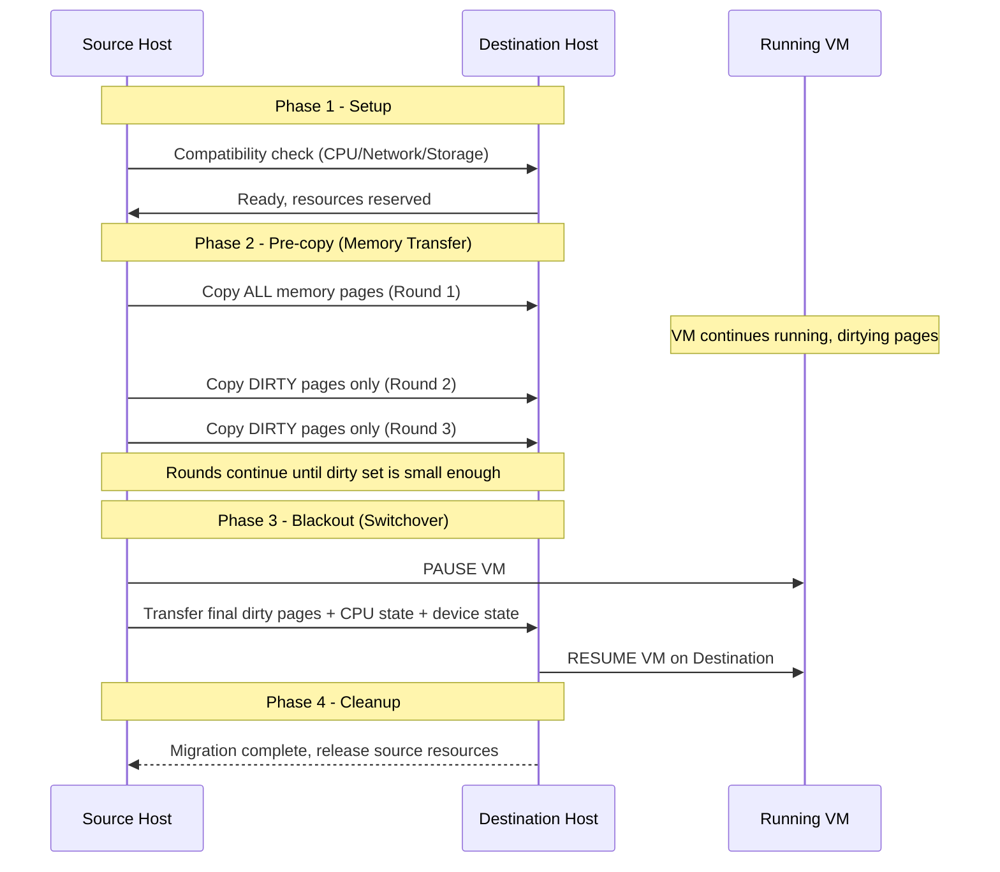

# Deep Dive: Hyper-V 架构与工作机制全解析

**Topic:** Windows Hyper-V Architecture & Working Mechanisms  
**Category:** Virtualization / Infrastructure  
**Level:** 中级 → 高级  
**Last Updated:** 2026-03-17

---

## 1. 概述 (Overview)

Hyper-V 是 Microsoft 的企业级虚拟化平台，自 Windows Server 2008 引入以来持续演进。它采用 **Type-1 (Bare Metal) Hypervisor** 架构——Hypervisor 直接运行在硬件之上，而非运行在操作系统之中（这与 VMware Workstation / VirtualBox 等 Type-2 架构有本质区别）。

Hyper-V 的核心使命是：**将一台物理服务器的 CPU、内存、存储、网络资源虚拟化，分配给多个隔离的虚拟机 (VM)，同时保持接近原生的性能**。它是 Windows Server Failover Clustering、Azure Local (原 Azure Stack HCI)、Azure 公有云的底层虚拟化引擎。

理解 Hyper-V 的内部机制，对于排查 VM 性能问题、Live Migration 失败、存储 IO 瓶颈、网络延迟等场景至关重要。

---

## 2. 核心概念 (Core Concepts)

### 2.1 Type-1 Hypervisor

```
┌─────────────────────────────────────────────────┐
│              虚拟机 (Child Partitions)            │
│  ┌──────────┐  ┌──────────┐  ┌──────────┐      │
│  │   VM 1   │  │   VM 2   │  │   VM 3   │      │
│  │  (VSC)   │  │  (VSC)   │  │  (VSC)   │      │
│  └────┬─────┘  └────┬─────┘  └────┬─────┘      │
│       │              │              │    VMBus    │
│  ┌────┴──────────────┴──────────────┴─────┐      │
│  │         Root Partition (Host OS)        │      │
│  │   VMMS / VMWP / VSP / Device Drivers   │      │
│  └────────────────┬───────────────────────┘      │
├───────────────────┼──────────────────────────────┤
│            Hypervisor (hvix64.exe)                │
├───────────────────┼──────────────────────────────┤
│         Physical Hardware (CPU/RAM/NIC/Disk)      │
└─────────────────────────────────────────────────┘
```

关键理解：**安装 Hyper-V Role 后，原来的 Windows OS 不再直接运行在硬件上，而是被"降级"为 Root Partition（管理分区），Hypervisor 才是真正的"老大"。**

> **类比**：把 Hypervisor 想象成酒店大堂经理，Root Partition 是前台接待（可以调度资源），Child Partition 是各个房间的住客（每个 VM）。前台虽然权限最大，但也得听大堂经理的。

### 2.2 Partition（分区）

| 分区类型 | 角色 | 特点 |
|---------|------|------|
| **Root Partition** | 管理分区 | 运行 Host OS，拥有物理设备直接访问权限，托管 VSP、VMMS、VMWP |
| **Child Partition** | 虚拟机 | 无硬件直接访问权，通过 VMBus 请求 IO 服务 |

- Root Partition 是 Hypervisor 创建的**第一个分区**
- 所有 Child Partition 由 Root Partition 的 VMMS 服务创建和管理
- Root Partition 对物理设备有完全控制权（中断处理、DMA 访问等）

### 2.3 VMBus（虚拟机总线）

VMBus 是 Root Partition 和 Child Partition 之间的**高速通信通道**，基于**共享内存**实现。它替代了传统设备模拟的低效方式。

```
Child Partition              Root Partition
┌─────────────┐              ┌─────────────┐
│    Guest OS  │              │    Host OS   │
│   ┌───────┐  │    VMBus     │  ┌────────┐  │
│   │  VSC  │──┼──────────────┼──│  VSP   │  │
│   │(Client)│  │  共享内存     │  │(Provider)│ │
│   └───────┘  │              │  └────┬───┘  │
└─────────────┘              │       │       │
                              │  Physical HW │
                              └─────────────┘
```

### 2.4 VSP / VSC（虚拟化服务提供者/消费者）

| 组件 | 位置 | 作用 |
|------|------|------|
| **VSP** (Virtualization Service Provider) | Root Partition | 接收 VM 的 IO 请求，转交给实际物理设备驱动 |
| **VSC** (Virtualization Service Client) | Child Partition | Guest OS 中的虚拟设备驱动，将 IO 请求通过 VMBus 发给 VSP |

**常见 VSP/VSC 对：**
- 网络 VSP/VSC → 虚拟网卡 (Synthetic NIC)
- 存储 VSP/VSC → 虚拟 SCSI 控制器
- 视频 VSP/VSC → 虚拟显卡
- HID VSP/VSC → 虚拟键盘/鼠标

### 2.5 Enlightenments（光照优化/启蒙）

Enlightenments 是 Guest OS 内核中的**虚拟化感知优化**。当 Guest OS 检测到自己运行在 Hyper-V 上时，会启用一系列优化路径来提升性能：

- **Hypercall**：Guest OS 直接通过 Hypercall 接口与 Hypervisor 通信（类似系统调用）
- **合成中断**：取代传统 PIC/APIC 模拟，减少虚拟化开销
- **TSC 同步**：时间戳计数器同步，避免 VM 时间漂移
- **自旋锁优化**：多 vCPU 场景下避免无效自旋等待

> **关键点**：这就是为什么安装 **Integration Services（集成服务）** 如此重要——它包含 VSC 驱动和 Enlightenment 组件。没有它们，VM 的所有 IO 都要走低效的设备模拟路径。

### 2.6 VMMS 与 VMWP

| 进程 | 全称 | 作用 |
|------|------|------|
| **vmms.exe** | Virtual Machine Management Service | 管理所有 VM 的创建/删除/配置。是 Hyper-V Manager 的后端服务 |
| **vmwp.exe** | Virtual Machine Worker Process | **每个运行的 VM 对应一个 VMWP 进程**。负责该 VM 的设备模拟、IO 调度、状态管理 |

```
vmms.exe (1个)
  ├── vmwp.exe (VM-1 的 Worker Process)
  ├── vmwp.exe (VM-2 的 Worker Process)
  └── vmwp.exe (VM-3 的 Worker Process)
```

> **排查意义**：如果某个 VM 卡死，可以在 Task Manager 中找到对应的 vmwp.exe 进程。通过 VM 的 GUID 可以关联到具体哪个 vmwp.exe。

---

## 3. 工作原理 (How It Works)

### 3.1 VM 代际：Gen1 vs Gen2

| 对比维度 | Generation 1 | Generation 2 |
|---------|-------------|-------------|
| **固件** | Legacy BIOS | UEFI |
| **启动磁盘** | IDE 控制器 (最大 2TB) | Virtual SCSI (最大 64TB VHDX) |
| **Secure Boot** | ❌ | ✅ |
| **vTPM** | ❌ | ✅ |
| **网络启动** | Legacy NIC | Synthetic NIC (IPv4/IPv6) |
| **热添加内存** | ❌ | ✅ |
| **热添加网卡** | ❌ | ✅ |
| **适用场景** | 旧 OS (32-bit, 早期 Linux) | 推荐所有新 VM |

> **Gen2 VM 的关键优势**：所有设备都是 Synthetic（合成）设备通过 VMBus 通信，无需任何设备模拟（无 IDE、无 PS/2、无 PIC），因此性能更好、攻击面更小。

### 3.2 存储 IO 路径

存储 IO 需要经过**四层**：

```
┌───────────────────────────────────────┐
│ 1. Guest Storage Stack                │
│    应用 → 文件系统 → 存储驱动(VSC)      │
├───────────────────────────────────────┤
│ 2. Host Virtualization Layer          │
│    VMBus → VSP → 设备模拟              │
├───────────────────────────────────────┤
│ 3. Host Storage Stack                 │
│    NTFS/ReFS → StorPort → 小端口驱动    │
├───────────────────────────────────────┤
│ 4. Physical Disk                      │
│    HDD / SSD / NVMe                   │
└───────────────────────────────────────┘
```

**虚拟硬盘格式对比：**

| 格式 | 最大大小 | 特性 |
|------|---------|------|
| **VHD** | 2 TB | 旧格式，2TB 限制，不支持在线调整 |
| **VHDX** | 64 TB | 4KB 扇区对齐，日志结构防断电损坏，支持在线调整大小 |
| **VHDS** | 64 TB | Shared VHDX，用于 Guest Clustering 场景 |

**磁盘类型对比：**

| 类型 | 空间分配 | 性能 | 适用场景 |
|------|---------|------|---------|
| **Fixed（固定）** | 创建时分配全部空间 | 最佳（无碎片） | 生产环境 |
| **Dynamic（动态扩展）** | 按需增长 | 略低（有扩展开销） | 测试/开发 |
| **Differencing（差异）** | 基于父盘只记录变化 | 链越长越慢 | Checkpoint/模板 |
| **Pass-through（直通）** | 直接映射物理磁盘 | 最佳 | 特殊 IO 需求 |

### 3.3 Checkpoint 机制（检查点/快照）

Checkpoint 创建时，Hyper-V **不会复制整个磁盘**，而是：

1. 冻结当前 VHDX，使其变为只读
2. 创建一个 **AVHDX（差异磁盘）** 文件
3. 所有后续写操作都写入 AVHDX
4. 可选地保存内存状态（Standard Checkpoint）

```
Base.vhdx (只读)
  └── Checkpoint1.avhdx (只读)
       └── Checkpoint2.avhdx (当前活跃)
```

**两种 Checkpoint 类型：**

| 类型 | 保存内存状态 | 数据一致性 | 适用场景 |
|------|------------|-----------|---------|
| **Standard Checkpoint** | ✅ | 不保证应用一致性 | 开发/测试 |
| **Production Checkpoint** | ❌ | 使用 VSS 保证一致性 | **生产环境（默认）** |

**AVHDX Merge（合并）过程：**

当删除 Checkpoint 时，Hyper-V 将 AVHDX 中的变更合并回父盘：
- **VM 运行中**：后台异步 Merge（Live Merge），可能需要较长时间
- **VM 关闭后**：在下次启动时或关机过程中完成 Merge

> **⚠️ 常见故障**：AVHDX 链过长（>3层）会严重影响 IO 性能；如果 Merge 失败（如空间不足），可能导致 VM 无法启动。

### 3.4 Dynamic Memory（动态内存）

Dynamic Memory 允许 Hyper-V 在多个 VM 之间**智能分配和回收内存**：

```
┌──────────────────────────────────────────┐
│            Memory Balancer               │
│  (监控所有 VM 内存压力，动态分配/回收)      │
├──────────┬──────────┬────────────────────┤
│  VM-1    │  VM-2    │  VM-3              │
│ Min: 1GB │ Min: 2GB │ Min: 512MB         │
│ Start:2GB│ Start:4GB│ Start: 1GB         │
│ Max: 8GB │ Max:16GB │ Max: 4GB           │
│ 当前: 3GB│ 当前:12GB│ 当前: 1GB          │
└──────────┴──────────┴────────────────────┘
```

**三个关键参数：**

| 参数 | 含义 | 重要性 |
|------|------|--------|
| **Startup Memory** | VM 启动时分配的内存 | 必须够 OS + 关键服务启动 |
| **Minimum Memory** | 运行中允许回收到的最低值 | 设太低可能导致 Guest 频繁 Page Fault |
| **Maximum Memory** | 动态扩展的上限 | 所有 VM 的 Max 总和可能超过物理内存（Overcommit） |

**Smart Paging（智能分页）：**

解决一个极端场景：VM 当前只有 Minimum Memory，但需要重启（重启需要 Startup Memory 大小）。此时：
1. 如果 Host 物理内存不够提供 Startup Memory
2. Hyper-V 在磁盘上创建临时分页文件给 VM 用
3. VM 启动完成后自动释放

> **Smart Paging 是"最后手段"**，磁盘远慢于内存，只在内存极度紧张时使用。

**Balloon Driver 机制：**

Hyper-V Integration Services 中包含一个 Balloon Driver（气球驱动）：
- 当 Host 需要回收 VM 内存时，Balloon Driver 在 Guest 内部"膨胀"，占用 Guest 内存页
- Guest OS 看到可用内存减少，会减少自己的内存使用
- Hypervisor 然后安全地将这些内存页分配给其他 VM
- 反向操作（"放气"）则释放内存给 Guest

### 3.5 虚拟网络 (Virtual Networking)

#### 虚拟交换机类型

| 类型 | 连接范围 | 使用场景 |
|------|---------|---------|
| **External** | VM ↔ Host ↔ 物理网络 | 生产环境（最常用） |
| **Internal** | VM ↔ Host（无物理网络） | 管理网络、隔离测试 |
| **Private** | VM ↔ VM（Host 也不可达） | 完全隔离的实验环境 |

#### 网络性能优化技术

```
┌──────────────────────────────────────────┐
│        高性能网络技术栈                    │
├──────────────────────────────────────────┤
│  SR-IOV      │ 绕过 VMBus，VM 直接      │
│              │ 访问物理 NIC 的虚拟功能    │
│              │ → 最低延迟、最高吞吐       │
├──────────────┼───────────────────────────┤
│  VMQ         │ 硬件队列分离，每个 VM      │
│              │ 有独立的 NIC 接收队列      │
│              │ → 减少 CPU 中断合并开销    │
├──────────────┼───────────────────────────┤
│  vRSS        │ VM 内部多核接收分发        │
│              │ → 突破单核网络处理瓶颈      │
├──────────────┼───────────────────────────┤
│  SET         │ Switch Embedded Teaming   │
│              │ 集成到 vSwitch 中的        │
│              │ NIC 绑定（替代 LBFO）      │
└──────────────┴───────────────────────────┘
```

> **关键变化 (Server 2022+)**：LBFO NIC Teaming 已被**弃用**用于 Hyper-V vSwitch，必须使用 **SET (Switch Embedded Teaming)**。

#### SR-IOV 详解

```
普通路径:
  VM → VSC → VMBus → VSP → Host NIC Driver → Physical NIC

SR-IOV 路径:
  VM → VF Driver → Physical NIC (直通!)
  (VMBus 仅用于控制平面，数据平面完全绕过)
```

SR-IOV 需要：硬件支持 + BIOS/UEFI 开启 + NIC 驱动支持 + VM 使用 Synthetic NIC 并开启 SR-IOV。Live Migration 时 SR-IOV 会**自动降级**为 Synthetic 路径，迁移完成后恢复。

### 3.6 Live Migration（实时迁移）

Live Migration 是在**不中断 VM 服务**的情况下将运行中的 VM 从一台 Host 迁移到另一台。

#### 完整过程



#### 关键术语

| 术语 | 含义 |
|------|------|
| **Pre-copy** | VM 运行时迭代复制内存，每轮只传输上一轮修改的 Dirty Pages |
| **Dirty Page** | 在上一轮传输期间被 VM 修改的内存页 |
| **Convergence** | Dirty Rate ≤ Transfer Rate 时达到收敛 |
| **Brownout** | 预复制阶段 VM 仍运行但性能可能轻微下降 |
| **Blackout** | VM 暂停→传输剩余状态→在目标恢复，通常 < 1 秒 |

#### 性能选项

| 传输方式 | 特点 | 适用场景 |
|---------|------|---------|
| **TCP/IP** | 默认，使用标准 TCP | 通用 |
| **Compression** | 压缩内存再传输，减少带宽占用，增加 CPU 开销 | 带宽受限 |
| **SMB Direct (RDMA)** | 直接内存访问，零 CPU 拷贝 | **最佳性能**，需要 RDMA 网卡 |

#### 认证方式

| 方式 | 特点 |
|------|------|
| **CredSSP** | 源主机模拟用户凭据连接目标主机；需要先登录源主机 |
| **Kerberos** | 使用约束委派(Constrained Delegation)；更安全，支持 Failover Cluster 场景 |

#### Quick Migration vs Live Migration

| 对比 | Quick Migration | Live Migration |
|------|----------------|---------------|
| **机制** | 暂停 VM → 保存状态到磁盘 → 恢复到新主机 | 内存在线迁移 |
| **停机时间** | 取决于 VM 内存大小（秒到分钟） | 通常 < 1 秒 |
| **需要** | Failover Cluster + 共享存储 | 网络连通即可 |
| **适用** | 紧急场景、存储迁移配合 | 计划维护、负载均衡 |

### 3.7 Hyper-V Replica（副本）

Hyper-V Replica 提供**异步复制**用于灾难恢复（DR）：

```
┌──────────────┐          ┌──────────────┐
│ Primary Site  │  复制     │ Replica Site  │
│              │ ──────→  │              │
│   VM (运行)   │          │  VM (关闭)    │
│              │  HTTP/   │              │
│              │  HTTPS   │              │
└──────────────┘          └──────────────┘
```

**工作流程：**

1. **Initial Replication**：完整复制 VM 的 VHD/VHDX 到目标站点（可通过网络或物理介质）
2. **Delta Replication**：定期（30秒/5分钟/15分钟）传输变化块
3. **Change Tracking**：使用 Resilient Change Tracking (RCT) 在 VHDX 级别追踪变化
4. **Recovery Points**：可保留多个历史恢复点

| 配置项 | 选项 |
|--------|------|
| **复制频率** | 30 秒 / 5 分钟 / 15 分钟 |
| **认证方式** | Kerberos (HTTP 80) / 证书 (HTTPS 443) |
| **恢复点数量** | 1-24 个 |
| **Extended Replication** | 支持级联到第三个站点 |

**三种 Failover 类型：**

| 类型 | 触发 | 数据丢失 |
|------|------|---------|
| **Test Failover** | 手动，不影响复制 | 无（用于演练） |
| **Planned Failover** | 手动，主站正常 | 零（先同步再切换） |
| **Unplanned Failover** | 主站宕机 | 可能丢失最后一个复制周期的数据 |

---

## 4. 关键配置与参数 (Key Configurations)

### 4.1 Hyper-V Host 配置

| 配置项 | 默认值 | 说明 | 调优建议 |
|--------|--------|------|---------|
| NUMA Spanning | Enabled | 允许 VM 使用跨 NUMA 节点的内存 | 高性能场景建议 Disable，让 VM 限制在单 NUMA 节点 |
| Live Migration 并发数 | 2 | 同时迁移的 VM 数量 | 大集群可增加到 4-8 |
| Storage Migration 并发数 | 2 | 同时迁移存储的 VM 数 | 按存储带宽调整 |
| Enhanced Session Mode | Enabled | RDP 增强会话 | 管理用途 |
| Live Migration Network | 所有可用网络 | 用于 LM 传输的网卡 | **强烈建议指定专用网络** |

### 4.2 VM 配置

| 配置项 | 建议 | 说明 |
|--------|------|------|
| vCPU 数量 | 不超过物理核数 | 超分会导致 CPU Wait，用 `\Hyper-V Hypervisor Virtual Processor\CPU Wait Time Per Dispatch` 监控 |
| Memory Buffer | 20% (默认) | Dynamic Memory 时的缓冲比例 |
| SCSI Controller | Gen2 默认 | 支持热添加/删除磁盘 |
| Integration Services | 始终最新 | 影响 VSC/Enlightenment 性能 |
| Automatic Stop Action | Save | 选 Save/Shutdown/Turn Off |

### 4.3 性能监控关键计数器

| 计数器 | 含义 | 关注阈值 |
|--------|------|---------|
| `\Hyper-V Hypervisor Logical Processor\% Total Run Time` | Hypervisor CPU 开销 | > 10% 需关注 |
| `\Hyper-V Hypervisor Virtual Processor\% Guest Run Time` | vCPU 在 Guest 中的执行时间 | 健康值：越接近 100% 越好 |
| `\Hyper-V Hypervisor Virtual Processor\CPU Wait Time Per Dispatch` | vCPU 等待物理 CPU 的时间 | > 50,000 ns 表示 CPU 超分严重 |
| `\Hyper-V Dynamic Memory Balancer\Available Memory` | Host 可用内存 | < 2GB 需告警 |
| `\Hyper-V Virtual Storage Device\Read/Write Bytes/sec` | VM 存储 IO 吞吐 | 与基线对比 |

---

## 5. 常见问题与排查 (Common Issues & Troubleshooting)

### 问题 1: VM 无法启动

**症状：** Hyper-V Manager 中 Start VM 失败，状态卡在 Starting 或直接报错

**常见原因及排查：**

| 可能原因 | 检查方法 | 解决方案 |
|---------|---------|---------|
| VHDX/AVHDX 文件缺失或权限问题 | 检查 VM 配置路径、文件是否存在 | 恢复文件或修复权限 |
| Checkpoint 链断裂 | `Get-VHD -Path <avhdx>` 检查 ParentPath | 手动修复 AVHDX 链或 Merge |
| 内存不足 | `Get-VM` 查看 MemoryAssigned + Host 可用内存 | 关闭不需要的 VM 或增加内存 |
| Hypervisor 未运行 | `systeminfo` 查看 "Hyper-V Requirements" | 检查 BIOS 虚拟化开关、bcdedit |
| 安全策略阻止 | Event Log: Hyper-V-VMMS/Admin | 检查 Shielded VM / HGS 配置 |

**关键事件日志路径：**
- `Applications and Services Logs > Microsoft > Windows > Hyper-V-VMMS > Admin`
- `Applications and Services Logs > Microsoft > Windows > Hyper-V-Worker > Admin`

### 问题 2: Live Migration 失败

**症状：** Migration 过程中报错回退，或 VM 在目标 Host 不可达

**排查思路：**

1. **兼容性检查**：`Compare-VM` 或检查 Event Log 中的 Compatibility 错误
2. **CPU 兼容性**：不同代 CPU 需开启 "Processor Compatibility Mode"
3. **网络连通性**：确认 LM 专用网络双向连通
4. **认证问题**：Kerberos 需要 Constrained Delegation 配置；CredSSP 需要先登录源主机
5. **存储可达性**：确认两台 Host 都能访问 VM 的存储路径

**关键命令：**
```powershell
# 测试 Live Migration 兼容性
Compare-VM -Name "TestVM" -DestinationHost "HV-Node02"

# 查看 Live Migration 配置
Get-VMHost | Select-Object VirtualMachineMigration*

# 测试网络连通
Test-NetConnection -ComputerName HV-Node02 -Port 6600
```

### 问题 3: VM 性能缓慢

**症状：** VM 内应用响应慢，Guest 内 CPU/内存/磁盘指标异常

**排查层次：**

```
1. 检查 Host 层面是否过载
   → CPU: Physical Processor % Total Run Time
   → Memory: Available Memory < 2GB?
   → Disk: Host 磁盘队列长度

2. 检查 VM 层面虚拟化开销
   → vCPU Wait Time (CPU 超分?)
   → Dynamic Memory 是否频繁 Balloon/Smart Page
   → AVHDX 链是否过长

3. 检查 Guest 内部
   → Guest OS 自身问题(驱动、服务、应用)
   → Integration Services 版本是否最新
```

### 问题 4: VMMS/VMWP 服务崩溃

**症状：** vmms.exe 或 vmwp.exe 意外终止，VM 变为 Critical 状态

**排查方法：**
1. 检查 Windows Error Reporting (WER)：`C:\ProgramData\Microsoft\Windows\WER\ReportQueue`
2. 收集 Crash Dump：配置 WER 生成 Full Dump
3. 检查是否有第三方安全软件/备份软件干扰
4. 检查最近的 Windows Update 是否引入了已知问题

---

## 6. 实战经验 (Practical Tips)

### 最佳实践

- **始终使用 Gen2 VM** 除非有明确的兼容性需求
- **生产 VM 用 Fixed VHDX**：避免 Dynamic Disk 的扩展开销
- **Checkpoint ≠ Backup**：不要用 Checkpoint 替代正规备份。AVHDX 链过长会严重影响性能
- **专用网络分离**：Management、Live Migration、Storage、VM Traffic 各用独立网络/VLAN
- **NUMA 感知**：高性能 VM (如 SQL) 将 vCPU 和内存配置在单个 NUMA 节点内
- **Integration Services 保持最新**：影响 VSC 驱动性能和功能

### 常见误区

| 误区 | 真相 |
|------|------|
| "Hyper-V 安装后 Host OS 在 Hypervisor 之上" | Host OS 变成 Root Partition，Hypervisor 在最底层 |
| "Dynamic Disk 可以自动缩小" | 只能手动 Compact，日常使用只会增长 |
| "Live Migration 零停机" | 有 <1s 的 Blackout，对大多数应用无感知 |
| "所有 VM 应开 Dynamic Memory" | SQL Server、Exchange 等内存密集型应用建议用静态内存 |
| "Checkpoint 就是备份" | Checkpoint 只是差异磁盘，不是独立的备份副本 |
| "LBFO 仍可用于 vSwitch" | Server 2022+ 已弃用，必须使用 SET |

### 安全注意

- **Shielded VM** 用于高安全需求场景（需要 HGS 基础设施）
- **Secure Boot** 对 Gen2 VM 默认启用，确认 Linux VM 使用正确的证书模板
- **BitLocker + vTPM** 可加密 VM 磁盘
- **PowerShell Direct** 可在不依赖网络的情况下管理 VM（通过 VMBus）

---

## 7. 与相关技术的对比 (Comparison)

| 维度 | Hyper-V | VMware vSphere/ESXi | KVM |
|------|---------|---------------------|-----|
| **类型** | Type-1 | Type-1 | Type-1 (嵌入 Linux 内核) |
| **管理 OS** | Windows (Root Partition) | ESXi (精简 Linux) | Linux Host |
| **授权** | 包含在 Windows Server 中 | 商业授权 | 开源免费 |
| **最大 vCPU/VM** | 2048 (WS2025) | 768 (8.0) | 取决于硬件 |
| **最大内存/VM** | 12 TB (WS2025) | 24 TB (8.0) | 取决于硬件 |
| **存储格式** | VHDX | VMDK | QCOW2 / Raw |
| **DR 方案** | Hyper-V Replica | vSphere Replication | 第三方 |
| **管理工具** | WAC / SCVMM / PowerShell | vCenter / vSphere Client | libvirt / Cockpit |
| **容器集成** | Windows/Linux Containers | vSphere Tanzu | 原生 |
| **适用场景** | Windows 生态、Azure 混合云 | 企业数据中心 | 云原生、开源生态 |

---

## 8. 参考资料 (References)

- [Hyper-V Architecture](https://learn.microsoft.com/en-us/windows-server/administration/performance-tuning/role/hyper-v-server/architecture) — 官方架构文档，详细描述 VSP/VSC/VMBus 机制
- [Hyper-V Features and Terminology](https://learn.microsoft.com/en-us/windows-server/virtualization/hyper-v/features-terminology) — 全面的功能和术语参考
- [Hyper-V Overview](https://learn.microsoft.com/en-us/windows-server/virtualization/hyper-v/hyper-v-overview) — 官方概述，涵盖所有企业功能
- [Should I Create a Gen 1 or Gen 2 VM?](https://learn.microsoft.com/en-us/windows-server/virtualization/hyper-v/plan/should-i-create-a-generation-1-or-2-virtual-machine-in-hyper-v) — Gen1 vs Gen2 完整对比
- [Live Migration Overview](https://learn.microsoft.com/en-us/windows-server/virtualization/hyper-v/manage/live-migration-overview) — Live Migration 官方文档
- [Hyper-V Replica Setup](https://learn.microsoft.com/en-us/windows-server/virtualization/hyper-v/manage/set-up-hyper-v-replica) — Replica 配置和工作原理
- [Dynamic Memory for Hyper-V](https://learn.microsoft.com/en-us/windows-server/virtualization/hyper-v/dynamic-memory) — 动态内存官方指南

---

---

# English Version

---

# Deep Dive: Hyper-V Architecture & Working Mechanisms

**Topic:** Windows Hyper-V Architecture & Working Mechanisms  
**Category:** Virtualization / Infrastructure  
**Level:** Intermediate → Advanced  
**Last Updated:** 2026-03-17

---

## 1. Overview

Hyper-V is Microsoft's enterprise-grade virtualization platform, first introduced in Windows Server 2008 and continuously evolved since. It employs a **Type-1 (Bare Metal) Hypervisor** architecture — the hypervisor runs directly on hardware, not inside an operating system (fundamentally different from Type-2 hypervisors like VMware Workstation or VirtualBox).

Hyper-V's core mission: **virtualize a physical server's CPU, memory, storage, and network resources, allocating them to multiple isolated virtual machines (VMs) while maintaining near-native performance**. It serves as the underlying virtualization engine for Windows Server Failover Clustering, Azure Local (formerly Azure Stack HCI), and the Azure public cloud.

Understanding Hyper-V internals is crucial for troubleshooting VM performance issues, live migration failures, storage IO bottlenecks, and network latency scenarios.

---

## 2. Core Concepts

### 2.1 Type-1 Hypervisor

```
┌─────────────────────────────────────────────────┐
│              Virtual Machines (Child Partitions)  │
│  ┌──────────┐  ┌──────────┐  ┌──────────┐      │
│  │   VM 1   │  │   VM 2   │  │   VM 3   │      │
│  │  (VSC)   │  │  (VSC)   │  │  (VSC)   │      │
│  └────┬─────┘  └────┬─────┘  └────┬─────┘      │
│       │              │              │    VMBus    │
│  ┌────┴──────────────┴──────────────┴─────┐      │
│  │         Root Partition (Host OS)        │      │
│  │   VMMS / VMWP / VSP / Device Drivers   │      │
│  └────────────────┬───────────────────────┘      │
├───────────────────┼──────────────────────────────┤
│            Hypervisor (hvix64.exe)                │
├───────────────────┼──────────────────────────────┤
│         Physical Hardware (CPU/RAM/NIC/Disk)      │
└─────────────────────────────────────────────────┘
```

**Key insight: After installing the Hyper-V role, the original Windows OS no longer runs directly on hardware. It becomes the Root Partition (management partition), while the Hypervisor becomes the true "boss."**

> **Analogy**: Think of the Hypervisor as a hotel general manager, the Root Partition as the front desk (can dispatch resources), and Child Partitions as guest rooms (each VM). The front desk has the most authority, but still answers to the general manager.

### 2.2 Partitions

| Partition Type | Role | Characteristics |
|---------------|------|-----------------|
| **Root Partition** | Management partition | Runs Host OS, has direct physical device access, hosts VSP, VMMS, VMWP |
| **Child Partition** | Virtual machine | No direct hardware access, requests IO services through VMBus |

- Root Partition is the **first partition** created by the Hypervisor
- All Child Partitions are created and managed by VMMS in the Root Partition
- Root Partition has full control over physical devices (interrupt handling, DMA access, etc.)

### 2.3 VMBus (Virtual Machine Bus)

VMBus is the **high-speed communication channel** between Root and Child Partitions, implemented via **shared memory**. It replaces the inefficient traditional device emulation approach.

```
Child Partition              Root Partition
┌─────────────┐              ┌─────────────┐
│    Guest OS  │              │    Host OS   │
│   ┌───────┐  │    VMBus     │  ┌────────┐  │
│   │  VSC  │──┼──────────────┼──│  VSP   │  │
│   │(Client)│  │ Shared Memory│  │(Provider)│ │
│   └───────┘  │              │  └────┬───┘  │
└─────────────┘              │       │       │
                              │  Physical HW │
                              └─────────────┘
```

### 2.4 VSP / VSC

| Component | Location | Purpose |
|-----------|----------|---------|
| **VSP** (Virtualization Service Provider) | Root Partition | Receives VM IO requests, forwards to physical device drivers |
| **VSC** (Virtualization Service Client) | Child Partition | Virtual device driver in Guest OS, sends IO requests via VMBus to VSP |

**Common VSP/VSC pairs:**
- Network VSP/VSC → Synthetic NIC
- Storage VSP/VSC → Virtual SCSI Controller
- Video VSP/VSC → Virtual GPU
- HID VSP/VSC → Virtual Keyboard/Mouse

### 2.5 Enlightenments

Enlightenments are **virtualization-aware optimizations** in the Guest OS kernel. When the Guest OS detects it's running on Hyper-V, it enables optimized code paths:

- **Hypercalls**: Guest OS communicates directly with the Hypervisor (similar to system calls)
- **Synthetic Interrupts**: Replace traditional PIC/APIC emulation, reducing virtualization overhead
- **TSC Synchronization**: Time Stamp Counter sync to prevent VM time drift
- **Spinlock Optimization**: Avoid wasteful spinning in multi-vCPU scenarios

> **Key point**: This is why installing **Integration Services** is critical — they contain VSC drivers and Enlightenment components. Without them, all VM IO goes through the slow device emulation path.

### 2.6 VMMS and VMWP

| Process | Full Name | Purpose |
|---------|-----------|---------|
| **vmms.exe** | Virtual Machine Management Service | Manages all VM lifecycle (create/delete/configure). Backend for Hyper-V Manager |
| **vmwp.exe** | Virtual Machine Worker Process | **One VMWP process per running VM**. Handles device emulation, IO scheduling, state management |

```
vmms.exe (1 instance)
  ├── vmwp.exe (Worker for VM-1)
  ├── vmwp.exe (Worker for VM-2)
  └── vmwp.exe (Worker for VM-3)
```

> **Troubleshooting significance**: If a specific VM hangs, find its corresponding vmwp.exe in Task Manager. The VM's GUID maps to a specific vmwp.exe instance.

---

## 3. How It Works

### 3.1 VM Generations: Gen1 vs Gen2

| Comparison | Generation 1 | Generation 2 |
|-----------|-------------|-------------|
| **Firmware** | Legacy BIOS | UEFI |
| **Boot Disk** | IDE Controller (2TB max) | Virtual SCSI (64TB VHDX max) |
| **Secure Boot** | ❌ | ✅ |
| **vTPM** | ❌ | ✅ |
| **Network Boot** | Legacy NIC | Synthetic NIC (IPv4/IPv6) |
| **Hot-Add Memory** | ❌ | ✅ |
| **Hot-Add NIC** | ❌ | ✅ |
| **Use Case** | Legacy OS (32-bit, older Linux) | Recommended for all new VMs |

> **Gen2 key advantage**: All devices are Synthetic (through VMBus), no device emulation needed (no IDE, no PS/2, no PIC), resulting in better performance and smaller attack surface.

### 3.2 Storage IO Path

Storage IO traverses **four layers**:

```
┌───────────────────────────────────────┐
│ 1. Guest Storage Stack                │
│    App → File System → Storage VSC    │
├───────────────────────────────────────┤
│ 2. Host Virtualization Layer          │
│    VMBus → VSP → Device Emulation     │
├───────────────────────────────────────┤
│ 3. Host Storage Stack                 │
│    NTFS/ReFS → StorPort → Miniport    │
├───────────────────────────────────────┤
│ 4. Physical Disk                      │
│    HDD / SSD / NVMe                   │
└───────────────────────────────────────┘
```

**Virtual Hard Disk Format Comparison:**

| Format | Max Size | Features |
|--------|----------|----------|
| **VHD** | 2 TB | Legacy format, 2TB limit, no online resize |
| **VHDX** | 64 TB | 4KB sector aligned, journal structure for crash protection, online resize |
| **VHDS** | 64 TB | Shared VHDX for Guest Clustering |

**Disk Type Comparison:**

| Type | Space Allocation | Performance | Use Case |
|------|-----------------|-------------|----------|
| **Fixed** | Full allocation at creation | Best (no fragmentation) | Production |
| **Dynamic** | Grows on demand | Slightly lower (expansion overhead) | Test/Dev |
| **Differencing** | Only records changes from parent | Slower with longer chains | Checkpoints/Templates |
| **Pass-through** | Direct physical disk mapping | Best | Special IO requirements |

### 3.3 Checkpoint Mechanism

When a checkpoint is created, Hyper-V **does NOT copy the entire disk**. Instead:

1. Freezes the current VHDX, making it read-only
2. Creates an **AVHDX (differencing disk)** file
3. All subsequent writes go to the AVHDX
4. Optionally saves memory state (Standard Checkpoint)

```
Base.vhdx (read-only)
  └── Checkpoint1.avhdx (read-only)
       └── Checkpoint2.avhdx (currently active)
```

**Two Checkpoint Types:**

| Type | Saves Memory State | Data Consistency | Use Case |
|------|-------------------|-----------------|----------|
| **Standard** | ✅ | No application consistency guarantee | Dev/Test |
| **Production** | ❌ | Uses VSS for consistency | **Production (default)** |

**AVHDX Merge Process:**

When deleting a checkpoint, Hyper-V merges AVHDX changes back into the parent:
- **VM running**: Background async merge (Live Merge), may take a long time
- **VM powered off**: Merge completes during shutdown or next startup

> **⚠️ Common issue**: Long AVHDX chains (>3 levels) severely impact IO performance; failed merges (e.g., insufficient space) can prevent VM from starting.

### 3.4 Dynamic Memory

Dynamic Memory enables Hyper-V to **intelligently allocate and reclaim memory** across VMs:

**Three Key Parameters:**

| Parameter | Meaning | Importance |
|-----------|---------|------------|
| **Startup Memory** | RAM allocated during VM boot | Must be sufficient for OS + critical services |
| **Minimum Memory** | Lowest allocation during operation | Too low → frequent Guest page faults |
| **Maximum Memory** | Upper expansion limit | Sum of all Max values can exceed physical RAM (overcommit) |

**Smart Paging:**

Addresses an edge case: VM currently has only Minimum Memory but needs to restart (restart requires Startup Memory). When the host can't provide enough physical RAM:
1. Hyper-V creates a temporary paging file on disk for the VM
2. VM boots using disk-backed memory (slow but functional)
3. Automatically released once memory pressure eases

> **Smart Paging is a "last resort"** — disk is far slower than RAM.

**Balloon Driver Mechanism:**

Integration Services includes a Balloon Driver:
- When the host needs to reclaim VM memory, the Balloon Driver "inflates" inside the guest, consuming guest memory pages
- Guest OS sees reduced available memory and decreases its usage
- Hypervisor safely reallocates those pages to other VMs
- Reverse operation ("deflate") releases memory back to the guest

### 3.5 Virtual Networking

#### Virtual Switch Types

| Type | Connectivity | Use Case |
|------|-------------|----------|
| **External** | VM ↔ Host ↔ Physical Network | Production (most common) |
| **Internal** | VM ↔ Host (no physical network) | Management, isolated testing |
| **Private** | VM ↔ VM (Host unreachable too) | Fully isolated lab environments |

#### Network Performance Technologies

| Technology | Description | Benefit |
|-----------|-------------|---------|
| **SR-IOV** | Bypasses VMBus, VM directly accesses NIC virtual functions | Lowest latency, highest throughput |
| **VMQ** | Hardware queue separation, each VM gets dedicated NIC receive queue | Reduced CPU interrupt overhead |
| **vRSS** | Multi-core receive distribution within VM | Breaks single-core network processing bottleneck |
| **SET** | Switch Embedded Teaming, NIC bonding integrated into vSwitch | Replaces deprecated LBFO |

> **Key change (Server 2022+)**: LBFO NIC Teaming is **deprecated** for Hyper-V vSwitch. Must use **SET (Switch Embedded Teaming)**.

#### SR-IOV Details

```
Normal path:
  VM → VSC → VMBus → VSP → Host NIC Driver → Physical NIC

SR-IOV path:
  VM → VF Driver → Physical NIC (direct!)
  (VMBus only for control plane, data plane completely bypassed)
```

During Live Migration, SR-IOV **automatically falls back** to the Synthetic path, then re-enables after migration completes.

### 3.6 Live Migration

Live Migration moves a running VM from one host to another **without service interruption**.

#### Complete Process


#### Key Terminology

| Term | Meaning |
|------|---------|
| **Pre-copy** | Iteratively copies memory while VM runs; each round only transfers dirty pages from previous round |
| **Dirty Page** | Memory page modified by VM during previous transfer round |
| **Convergence** | When dirty rate ≤ transfer rate |
| **Brownout** | Pre-copy phase — VM still runs but may experience slight performance degradation |
| **Blackout** | VM paused → remaining state transferred → resumed on target; typically < 1 second |

#### Performance Options

| Transfer Method | Characteristics | Use Case |
|----------------|-----------------|----------|
| **TCP/IP** | Default, standard TCP | General |
| **Compression** | Compresses memory before transfer, reduces bandwidth, increases CPU overhead | Bandwidth-limited |
| **SMB Direct (RDMA)** | Direct memory access, zero CPU copy | **Best performance**, requires RDMA NICs |

#### Quick Migration vs Live Migration

| Comparison | Quick Migration | Live Migration |
|-----------|----------------|---------------|
| **Mechanism** | Pause VM → Save state to disk → Restore on new host | Online memory migration |
| **Downtime** | Depends on VM memory size (seconds to minutes) | Typically < 1 second |
| **Requires** | Failover Cluster + shared storage | Network connectivity |
| **Use Case** | Emergency, combined with storage migration | Planned maintenance, load balancing |

### 3.7 Hyper-V Replica

Hyper-V Replica provides **asynchronous replication** for disaster recovery:

```
┌──────────────┐          ┌──────────────┐
│ Primary Site  │  Repl.   │ Replica Site  │
│              │ ──────→  │              │
│   VM (Online) │          │  VM (Off)     │
│              │  HTTP/   │              │
│              │  HTTPS   │              │
└──────────────┘          └──────────────┘
```

**Workflow:**

1. **Initial Replication**: Full VM VHD/VHDX copy to target site (via network or physical media)
2. **Delta Replication**: Periodic (30s/5min/15min) change block transfers
3. **Change Tracking**: Uses Resilient Change Tracking (RCT) at VHDX level
4. **Recovery Points**: Can maintain multiple historical recovery points

| Configuration | Options |
|--------------|---------|
| **Replication Frequency** | 30 seconds / 5 minutes / 15 minutes |
| **Authentication** | Kerberos (HTTP 80) / Certificate (HTTPS 443) |
| **Recovery Points** | 1-24 |
| **Extended Replication** | Supports cascading to a third site |

**Three Failover Types:**

| Type | Trigger | Data Loss |
|------|---------|-----------|
| **Test Failover** | Manual, doesn't affect replication | None (for drills) |
| **Planned Failover** | Manual, primary healthy | Zero (syncs before switching) |
| **Unplanned Failover** | Primary down | May lose last replication cycle |

---

## 4. Key Configurations

### 4.1 Hyper-V Host

| Setting | Default | Description | Tuning |
|---------|---------|-------------|--------|
| NUMA Spanning | Enabled | Allows VM to use cross-NUMA memory | Disable for high-performance VMs to keep within single NUMA node |
| Live Migration Concurrent | 2 | Simultaneous VM migrations | Increase to 4-8 for large clusters |
| Storage Migration Concurrent | 2 | Simultaneous storage migrations | Adjust based on storage bandwidth |
| Live Migration Network | All available | NICs used for LM transfers | **Strongly recommend dedicated network** |

### 4.2 Performance Monitoring Counters

| Counter | Meaning | Alert Threshold |
|---------|---------|-----------------|
| `\Hyper-V Hypervisor Logical Processor\% Total Run Time` | Hypervisor CPU overhead | > 10% needs attention |
| `\Hyper-V Hypervisor Virtual Processor\CPU Wait Time Per Dispatch` | vCPU waiting for physical CPU | > 50,000 ns indicates severe CPU overcommit |
| `\Hyper-V Dynamic Memory Balancer\Available Memory` | Host available memory | < 2GB needs alerting |

---

## 5. Common Issues & Troubleshooting

### Issue 1: VM Won't Start

**Common causes:**

| Cause | Diagnostic | Solution |
|-------|-----------|----------|
| VHDX/AVHDX missing or permission issues | Check VM config paths, verify files exist | Restore files or fix permissions |
| Checkpoint chain broken | `Get-VHD -Path <avhdx>` check ParentPath | Manually repair AVHDX chain or merge |
| Insufficient memory | `Get-VM` check MemoryAssigned + host available | Stop unneeded VMs or add RAM |
| Hypervisor not running | `systeminfo` check "Hyper-V Requirements" | Verify BIOS virtualization, bcdedit |

### Issue 2: Live Migration Failures

**Troubleshooting steps:**

1. **Compatibility**: `Compare-VM` or check Event Log compatibility errors
2. **CPU compatibility**: Different CPU generations require "Processor Compatibility Mode"
3. **Network**: Verify LM dedicated network bidirectional connectivity
4. **Authentication**: Kerberos needs Constrained Delegation; CredSSP needs source host login
5. **Storage accessibility**: Both hosts must access VM storage paths

### Issue 3: VM Performance Degradation

**Layered troubleshooting:**

1. **Host level**: CPU overload? Memory pressure? Disk queue length?
2. **Virtualization overhead**: vCPU Wait Time? Frequent balloon/smart paging? Long AVHDX chains?
3. **Guest internal**: Guest OS issues? Integration Services up-to-date?

### Issue 4: VMMS/VMWP Crashes

1. Check Windows Error Reporting: `C:\ProgramData\Microsoft\Windows\WER\ReportQueue`
2. Collect crash dumps
3. Check for third-party security/backup software interference
4. Check recent Windows Updates for known issues

---

## 6. Practical Tips

### Best Practices

- **Always use Gen2 VMs** unless explicit compatibility needs
- **Fixed VHDX for production** — avoid Dynamic Disk expansion overhead
- **Checkpoints ≠ Backups** — don't substitute checkpoints for proper backups
- **Dedicated network separation** — Management, Live Migration, Storage, VM Traffic on separate networks/VLANs
- **NUMA-aware configuration** — for high-performance VMs (e.g., SQL), keep vCPU and memory within single NUMA node
- **Keep Integration Services current** — impacts VSC/Enlightenment performance

### Common Misconceptions

| Misconception | Reality |
|--------------|---------|
| "Host OS runs on top of Hypervisor after install" | Host OS becomes Root Partition; Hypervisor is at the bottom |
| "Dynamic Disk auto-shrinks" | Only manual Compact; it only grows during daily use |
| "Live Migration = zero downtime" | There's a <1s blackout, imperceptible to most applications |
| "All VMs should use Dynamic Memory" | Memory-intensive apps (SQL, Exchange) should use static memory |
| "Checkpoints are backups" | Checkpoints are differencing disks, not independent backup copies |
| "LBFO still works for vSwitch" | Deprecated in Server 2022+; must use SET |

---

## 7. Comparison with Related Technologies

| Dimension | Hyper-V | VMware vSphere/ESXi | KVM |
|-----------|---------|---------------------|-----|
| **Type** | Type-1 | Type-1 | Type-1 (embedded in Linux kernel) |
| **Management OS** | Windows (Root Partition) | ESXi (minimal Linux) | Linux Host |
| **Licensing** | Included with Windows Server | Commercial | Open source |
| **Max vCPU/VM** | 2048 (WS2025) | 768 (8.0) | Hardware dependent |
| **Max Memory/VM** | 12 TB (WS2025) | 24 TB (8.0) | Hardware dependent |
| **Storage Format** | VHDX | VMDK | QCOW2 / Raw |
| **DR Solution** | Hyper-V Replica | vSphere Replication | Third-party |
| **Management** | WAC / SCVMM / PowerShell | vCenter | libvirt / Cockpit |
| **Best For** | Windows ecosystem, Azure hybrid | Enterprise datacenter | Cloud-native, open source |

---

## 8. References

- [Hyper-V Architecture](https://learn.microsoft.com/en-us/windows-server/administration/performance-tuning/role/hyper-v-server/architecture) — Official architecture document detailing VSP/VSC/VMBus mechanisms
- [Hyper-V Features and Terminology](https://learn.microsoft.com/en-us/windows-server/virtualization/hyper-v/features-terminology) — Comprehensive feature and terminology reference
- [Hyper-V Overview](https://learn.microsoft.com/en-us/windows-server/virtualization/hyper-v/hyper-v-overview) — Official overview covering all enterprise capabilities
- [Should I Create a Gen 1 or Gen 2 VM?](https://learn.microsoft.com/en-us/windows-server/virtualization/hyper-v/plan/should-i-create-a-generation-1-or-2-virtual-machine-in-hyper-v) — Complete Gen1 vs Gen2 comparison
- [Live Migration Overview](https://learn.microsoft.com/en-us/windows-server/virtualization/hyper-v/manage/live-migration-overview) — Official Live Migration documentation
- [Hyper-V Replica Setup](https://learn.microsoft.com/en-us/windows-server/virtualization/hyper-v/manage/set-up-hyper-v-replica) — Replica configuration and working principles
- [Dynamic Memory for Hyper-V](https://learn.microsoft.com/en-us/windows-server/virtualization/hyper-v/dynamic-memory) — Official Dynamic Memory guide
