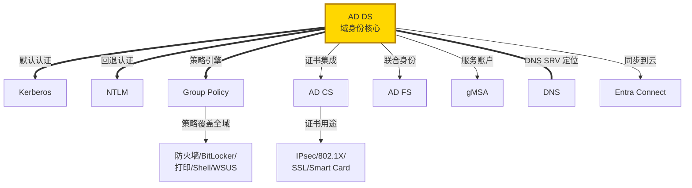

# Windows 目录服务技术导航 / Directory Services Guide

> 🔐 Active Directory 是 Windows 企业网络的**身份认证和策略管理核心**。
> 
> 🔗 返回主导航图：[Windows 技术生态导航图](/knowledge_base/knowledge/windows/2026/03/25/windows-technology-ecosystem-navigation-map/)

---

## Active Directory Domain Services (AD DS)

**域目录服务** — Windows 企业网络的身份核心。存储用户、计算机、组等对象信息，提供身份验证（Kerberos/NTLM）、授权、域名解析定位（通过 DNS SRV 记录）、复制等核心功能。所有域内资源访问都以 AD DS 为认证基础。

**核心概念：** Domain, Forest, Trust, OU, Site, Replication, Schema, Global Catalog, FSMO Roles

| 资源 | 链接 |
|------|------|
| 📖 AD DS 概述 | [Active Directory Domain Services Overview](https://learn.microsoft.com/en-us/windows-server/identity/ad-ds/get-started/virtual-dc/active-directory-domain-services-overview) |
| 📖 AD DS 部署指南 | [AD DS Deployment Guide](https://learn.microsoft.com/en-us/windows-server/identity/ad-ds/deploy/ad-ds-deployment) |
| 📖 AD DS 管理 | [AD DS Management](https://learn.microsoft.com/en-us/windows-server/identity/ad-ds/manage/component-updates/ad-ds-operations) |
| 📖 AD 复制概念 | [AD Replication Concepts](https://learn.microsoft.com/en-us/windows-server/identity/ad-ds/get-started/replication/active-directory-replication-concepts) |
| 🎓 学习路径 | [Microsoft Learn: AD DS](https://learn.microsoft.com/en-us/training/browse/?terms=active%20directory) |
| 🔧 内部 Wiki | [Directory Services Workflows](https://supportability.visualstudio.com/WindowsDirectoryServices/_wiki/wikis/WindowsDirectoryServices/389664/Directory-Services-Workflows) |

---

## Kerberos Authentication

**Kerberos 认证协议** — Windows 域内的**默认认证协议**。基于票据 (Ticket) 机制，通过 KDC（运行在 DC 上）颁发 TGT 和 Service Ticket 实现单点登录 (SSO)。支持委派 (Delegation)、约束委派、SPN 注册等。

**核心概念：** KDC, TGT, Service Ticket, SPN, Delegation, Constrained Delegation, S4U, PKINIT

| 资源 | 链接 |
|------|------|
| 📖 Kerberos 概述 | [Kerberos Authentication Overview](https://learn.microsoft.com/en-us/windows-server/security/kerberos/kerberos-authentication-overview) |
| 📖 Kerberos 约束委派 | [Kerberos Constrained Delegation](https://learn.microsoft.com/en-us/windows-server/security/kerberos/kerberos-constrained-delegation-overview) |
| 📖 SPN 管理 | [Service Principal Names](https://learn.microsoft.com/en-us/windows-server/identity/ad-ds/manage/how-to-configure-spn) |
| 🔧 排查指南 | [Troubleshoot Kerberos](https://learn.microsoft.com/en-us/troubleshoot/windows-server/identity/troubleshoot-kerberos-failures-overview) |

---

## NTLM Authentication

**NTLM 认证** — Windows 的**旧式认证协议**，仍作为 Kerberos 的回退方案。使用质询-响应 (Challenge-Response) 机制。在无法使用 Kerberos 的场景（如使用 IP 地址访问、跨非信任域）中自动使用。微软正在逐步限制 NTLM 的使用。

**核心概念：** Challenge-Response, NTLMv1, NTLMv2, Pass-the-Hash, NTLM Blocking

| 资源 | 链接 |
|------|------|
| 📖 NTLM 概述 | [NTLM Overview](https://learn.microsoft.com/en-us/windows-server/security/kerberos/ntlm-overview) |
| 📖 限制 NTLM | [Restrict NTLM Authentication](https://learn.microsoft.com/en-us/windows/security/threat-protection/security-policy-settings/network-security-restrict-ntlm) |

---

## Group Policy (GPO)

**组策略** — 通过 AD DS 对域内用户和计算机**集中下发配置和安全策略**的机制。GPO 存储在 SYSVOL 中，通过 AD 复制分发。可配置安全设置、软件安装、脚本、注册表、防火墙规则等几千项策略。

**核心概念：** GPO, SYSVOL, GPO 继承与优先级 (LSDOU), WMI Filter, Security Filtering, ADMX/ADML, RSoP, GPMC

| 资源 | 链接 |
|------|------|
| 📖 Group Policy 概述 | [Group Policy Overview](https://learn.microsoft.com/en-us/windows-server/identity/ad-ds/manage/group-policy/group-policy-overview) |
| 📖 GPMC 使用 | [Group Policy Management Console](https://learn.microsoft.com/en-us/previous-versions/windows/it-pro/windows-server-2012-r2-and-2012/dn265969(v=ws.11)) |
| 🔧 排查指南 | [Troubleshoot Group Policy](https://learn.microsoft.com/en-us/troubleshoot/windows-server/group-policy/group-policy-overview) |

---

## Active Directory Federation Services (AD FS)

**联合身份服务** — 提供跨组织边界的**单点登录 (SSO) 和联合身份**能力。使用 Claims-based 认证，支持 SAML 2.0、WS-Federation、OAuth/OpenID Connect 协议。常用于将本地身份扩展到 SaaS 应用。

> ⚠️ 微软建议迁移到 **Microsoft Entra ID**，AD FS 正在逐步退役。

**核心概念：** Claims, Relying Party Trust, Claims Provider, Token Signing Certificate, WAP (Web Application Proxy)

| 资源 | 链接 |
|------|------|
| 📖 AD FS 概述 | [AD FS Overview](https://learn.microsoft.com/en-us/windows-server/identity/ad-fs/ad-fs-overview) |
| 📖 迁移到 Entra ID | [Migrate from AD FS to Entra ID](https://learn.microsoft.com/en-us/entra/identity/enterprise-apps/migrate-adfs-apps-stages) |
| 🔧 排查指南 | [Troubleshoot AD FS](https://learn.microsoft.com/en-us/troubleshoot/windows-server/identity/ad-fs-overview) |

---

## Active Directory Certificate Services (AD CS)

**证书服务** — Windows 内置的 **PKI (公钥基础设施)** 平台，颁发和管理 X.509 数字证书。用于 SSL/TLS、IPsec、802.1X、Smart Card 登录、EFS、代码签名等场景。

**核心概念：** CA Hierarchy (Root/Subordinate), Certificate Templates, CRL, OCSP, NDES, CEP/CES, Auto-Enrollment

| 资源 | 链接 |
|------|------|
| 📖 AD CS 概述 | [AD CS Overview](https://learn.microsoft.com/en-us/windows-server/identity/ad-cs/active-directory-certificate-services-overview) |
| 📖 PKI 设计指南 | [PKI Design Guide](https://learn.microsoft.com/en-us/windows-server/identity/ad-cs/certification-authority-role) |
| 🔧 排查指南 | [Troubleshoot AD CS](https://learn.microsoft.com/en-us/troubleshoot/windows-server/identity/ad-cs-overview) |

---

## Active Directory Lightweight Directory Services (AD LDS)

**轻量目录服务** — 提供独立于 AD DS 的 **LDAP 目录服务**。不需要域环境，可运行多个实例，适用于需要 LDAP 目录但不需要完整 AD 功能的应用场景（如 Web 应用用户目录）。

| 资源 | 链接 |
|------|------|
| 📖 AD LDS 概述 | [AD LDS Overview](https://learn.microsoft.com/en-us/previous-versions/windows/it-pro/windows-server-2012-r2-and-2012/hh831593(v=ws.11)) |

---

## Group Managed Service Accounts (gMSA)

**组托管服务账户** — 域账户的进化版本，**自动管理密码**、简化 SPN 管理。适用于在多台服务器上运行的服务（如 IIS 应用池、SQL 服务、计划任务等），消除了手工密码管理的安全风险。

**核心概念：** KDS Root Key, gMSA, sMSA, Password Auto-Rotation

| 资源 | 链接 |
|------|------|
| 📖 gMSA 概述 | [gMSA Overview](https://learn.microsoft.com/en-us/windows-server/security/group-managed-service-accounts/group-managed-service-accounts-overview) |
| 📖 创建 gMSA | [Create a gMSA](https://learn.microsoft.com/en-us/windows-server/security/group-managed-service-accounts/getting-started-with-group-managed-service-accounts) |

---

## Entra Connect (Azure AD Connect)

**混合身份同步工具** — 将本地 AD DS 的身份同步到 **Microsoft Entra ID (Azure AD)**，实现混合身份管理。支持密码哈希同步 (PHS)、直通认证 (PTA)、联合认证 (Federation with AD FS) 三种认证模式。

**核心概念：** Password Hash Sync, Pass-through Authentication, Federation, Seamless SSO, Filtering

| 资源 | 链接 |
|------|------|
| 📖 Entra Connect 概述 | [Entra Connect Overview](https://learn.microsoft.com/en-us/entra/identity/hybrid/connect/whatis-azure-ad-connect) |
| 📖 同步架构 | [Sync Architecture](https://learn.microsoft.com/en-us/entra/identity/hybrid/connect/concept-azure-ad-connect-sync-architecture) |
| 🔧 排查指南 | [Troubleshoot Entra Connect](https://learn.microsoft.com/en-us/troubleshoot/entra/entra-id/azure-ad-hybrid-sync/azure-ad-connect-overview) |

---

## 目录服务技术关系一览

