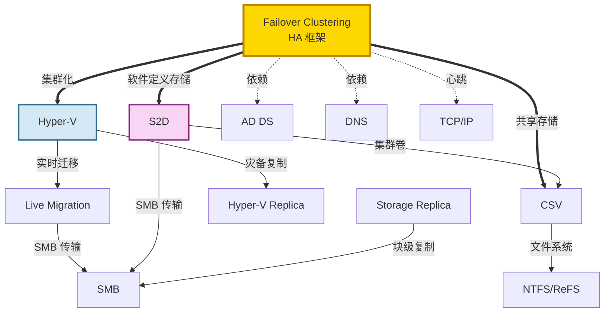

# Windows 高可用与虚拟化技术导航 / HA & Virtualization Guide

> ⚙️ Failover Clustering + Hyper-V + Storage Spaces Direct 构成了 Windows 高可用的三大支柱。
>
> 🔗 返回主导航图：[Windows 技术生态导航图](/knowledge_base/knowledge/windows/2026/03/25/windows-technology-ecosystem-navigation-map/)

---

## Failover Clustering

**故障转移集群** — Windows 高可用的**核心框架**。将多台服务器（节点）组成集群，当一个节点故障时自动将工作负载转移到其他节点（Failover）。支持 Hyper-V、File Server、SQL Server、DHCP 等角色的高可用部署。

**核心概念：** Cluster Node, Resource Group, Quorum (Witness), Heartbeat, Failover/Failback, CAU (Cluster-Aware Updating), Cluster Network, Affinity Rules

**依赖关系：** 需要 AD DS（身份验证）、DNS（名称注册）、TCP/IP（心跳网络）、共享存储（SAN/iSCSI/S2D/CSV）

| 资源 | 链接 |
|------|------|
| 📖 集群概述 | [Failover Clustering Overview](https://learn.microsoft.com/en-us/windows-server/failover-clustering/failover-clustering-overview) |
| 📖 创建集群 | [Create a Failover Cluster](https://learn.microsoft.com/en-us/windows-server/failover-clustering/create-failover-cluster) |
| 📖 集群仲裁 | [Cluster Quorum](https://learn.microsoft.com/en-us/windows-server/failover-clustering/manage-cluster-quorum) |
| 📖 CAU | [Cluster-Aware Updating](https://learn.microsoft.com/en-us/windows-server/failover-clustering/cluster-aware-updating) |
| 🔧 排查指南 | [Troubleshoot Clustering](https://learn.microsoft.com/en-us/troubleshoot/windows-server/high-availability/troubleshoot-failover-cluster-overview) |
| 🔧 内部 Wiki | [SHA Wiki](https://supportability.visualstudio.com/) |

---

## Hyper-V

**虚拟化平台** — 微软的 **Type-1 hypervisor**，直接运行在硬件上。支持创建和管理虚拟机 (VM)，提供隔离、快照、动态内存、SR-IOV、虚拟交换机等功能。与 Failover Clustering 集成实现 VM 高可用，是 Azure 计算服务的底层虚拟化引擎。

**核心概念：** VM Generation (Gen1/Gen2), Virtual Switch (External/Internal/Private), VHD/VHDX, Dynamic Memory, SR-IOV, Nested Virtualization, Shielded VM, Discrete Device Assignment (DDA)

| 资源 | 链接 |
|------|------|
| 📖 Hyper-V 概述 | [Hyper-V Technology Overview](https://learn.microsoft.com/en-us/windows-server/virtualization/hyper-v/hyper-v-technology-overview) |
| 📖 Hyper-V 网络 | [Hyper-V Virtual Switch](https://learn.microsoft.com/en-us/windows-server/virtualization/hyper-v-virtual-switch/hyper-v-virtual-switch) |
| 📖 Shielded VMs | [Shielded VMs](https://learn.microsoft.com/en-us/windows-server/security/guarded-fabric-shielded-vm/guarded-fabric-and-shielded-vms) |
| 🔧 排查指南 | [Troubleshoot Hyper-V](https://learn.microsoft.com/en-us/troubleshoot/windows-server/virtualization/virtualization-overview) |

---

## Live Migration

**实时迁移** — 在**不中断服务的情况下**将运行中的 VM 从一个 Hyper-V 主机迁移到另一个主机。利用 SMB 或压缩传输 VM 内存状态。支持集群内迁移和跨集群共享迁移 (Shared Nothing Live Migration)。

**核心概念：** Memory Pre-copy, SMB Transport, Compression, Shared Nothing Migration, Storage Migration

| 资源 | 链接 |
|------|------|
| 📖 Live Migration 概述 | [Live Migration Overview](https://learn.microsoft.com/en-us/windows-server/virtualization/hyper-v/manage/live-migration-overview) |
| 📖 Storage Migration | [Virtual Machine Storage Migration](https://learn.microsoft.com/en-us/windows-server/virtualization/hyper-v/manage/live-migration-overview#virtual-machine-live-storage-migration) |

---

## Cluster Shared Volumes (CSV)

**集群共享卷** — 允许集群中的**所有节点同时读写同一个卷**的技术。是 Hyper-V 集群和 Scale-Out File Server 的存储基础。基于 NTFS 或 ReFS，通过 SMB 协议实现重定向 I/O。

**核心概念：** Direct I/O vs Redirected I/O, CSV Ownership, CSV Metadata, CSV Cache

| 资源 | 链接 |
|------|------|
| 📖 CSV 概述 | [Cluster Shared Volumes](https://learn.microsoft.com/en-us/windows-server/failover-clustering/failover-cluster-csvs) |
| 🔧 排查指南 | [Troubleshoot CSV](https://learn.microsoft.com/en-us/troubleshoot/windows-server/high-availability/troubleshoot-csv-overview) |

---

## Storage Spaces Direct (S2D)

**存储空间直通** — **超融合基础设施 (HCI)** 的核心存储技术。将集群节点的本地磁盘池化为统一的软件定义存储。支持 NVMe、SSD、HDD 分层缓存，通过 SMB 在节点间通信。是 Azure Stack HCI / Azure Local 的技术基础。

**核心概念：** Storage Pool, Storage Tiers (NVMe/SSD/HDD), Virtual Disk, Resiliency (Mirror/Parity/Erasure Coding), Cache, Fault Domain, Storage Bus Layer (SBL)

| 资源 | 链接 |
|------|------|
| 📖 S2D 概述 | [Storage Spaces Direct Overview](https://learn.microsoft.com/en-us/windows-server/storage/storage-spaces/storage-spaces-direct-overview) |
| 📖 硬件要求 | [S2D Hardware Requirements](https://learn.microsoft.com/en-us/windows-server/storage/storage-spaces/storage-spaces-direct-hardware-requirements) |
| 📖 部署指南 | [Deploy S2D](https://learn.microsoft.com/en-us/windows-server/storage/storage-spaces/deploy-storage-spaces-direct) |

---

## Storage Spaces (Standalone)

**存储空间** — S2D 的单机版本。将**多块物理磁盘池化**为虚拟磁盘，提供镜像、奇偶校验、简单等弹性级别。适用于非集群场景的存储虚拟化。

| 资源 | 链接 |
|------|------|
| 📖 Storage Spaces 概述 | [Storage Spaces Overview](https://learn.microsoft.com/en-us/windows-server/storage/storage-spaces/overview) |

---

## Storage Replica

**存储副本** — 提供卷级别的**同步或异步块级复制**，用于灾难恢复。支持服务器到服务器、集群到集群、跨集群延伸集群三种拓扑。使用 SMB 进行数据传输。

**核心概念：** Synchronous/Asynchronous Replication, Source/Destination Group, Log Volume, Stretch Cluster, Test Failover

| 资源 | 链接 |
|------|------|
| 📖 Storage Replica 概述 | [Storage Replica Overview](https://learn.microsoft.com/en-us/windows-server/storage/storage-replica/storage-replica-overview) |

---

## Hyper-V Replica

**Hyper-V 副本** — VM 级别的**异步复制**方案，将 VM 复制到另一个 Hyper-V 主机（可跨站点）实现灾备。支持 5 分钟 / 30 秒复制间隔和测试故障转移。

**核心概念：** Primary/Replica Server, Replication Frequency, Test Failover, Planned Failover, Extended Replication

| 资源 | 链接 |
|------|------|
| 📖 Hyper-V Replica 概述 | [Hyper-V Replica](https://learn.microsoft.com/en-us/windows-server/virtualization/hyper-v/manage/set-up-hyper-v-replica) |

---

## 高可用技术关系一览

