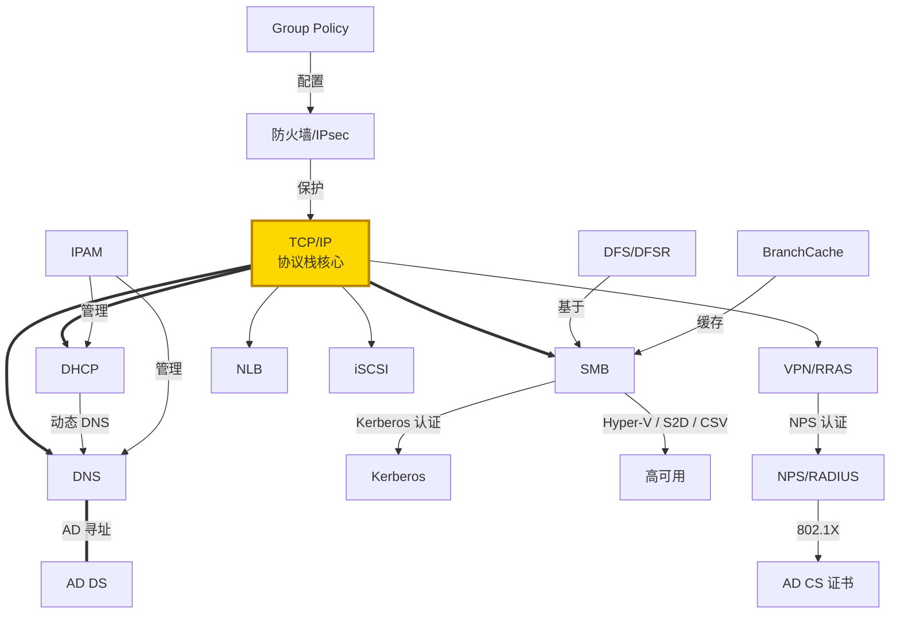

# Windows 网络技术导航 / Networking Technologies Guide

> 🌐 Windows 网络从 TCP/IP 协议栈出发，构建了完整的企业网络基础设施。
>
> 🔗 返回主导航图：[Windows 技术生态导航图](/knowledge_base/knowledge/windows/2026/03/25/windows-technology-ecosystem-navigation-map/)

---

## TCP/IP Protocol Stack

**TCP/IP 协议栈** — Windows 网络的**最底层基础**。包括 Winsock、TCP、UDP、IP (IPv4/IPv6)、ICMP、ARP 等。所有上层网络服务（DNS、DHCP、SMB、HTTP 等）都运行在 TCP/IP 之上。Windows 实现了完整的 RFC 标准协议栈，支持 Receive Side Scaling (RSS)、TCP Chimney Offload 等高性能特性。

**核心概念：** IPv4/IPv6 Dual Stack, Winsock, TCP Window Scaling, MTU/MSS, ARP/NDP, Routing Table, Dead Gateway Detection

| 资源 | 链接 |
|------|------|
| 📖 Windows 网络文档 | [Windows Server Networking](https://learn.microsoft.com/en-us/windows-server/networking/) |
| 📖 TCP/IP 基础 | [TCP/IP Fundamentals](https://learn.microsoft.com/en-us/previous-versions/windows/it-pro/windows-server-2003/cc786128(v=ws.10)) |
| 🔧 排查指南 | [Troubleshoot TCP/IP](https://learn.microsoft.com/en-us/troubleshoot/windows-server/networking/networking-overview) |

---

## DNS Server

**DNS 服务器** — 将主机名映射到 IP 地址的**名称解析服务**。在 Windows 域环境中，DNS 是 **AD DS 的寻址基础**（通过 SRV 记录定位域控制器）。支持 AD 集成区域、动态更新、条件转发、DNSSEC、DNS Policies 等。

**核心概念：** Zones (Primary/Secondary/Stub/AD-Integrated), Dynamic Update, Forwarding, Conditional Forwarding, DNSSEC, Scavenging, DNS Policies

| 资源 | 链接 |
|------|------|
| 📖 DNS 概述 | [DNS Overview](https://learn.microsoft.com/en-us/windows-server/networking/dns/dns-overview) |
| 📖 DNS Server 部署 | [Deploy DNS Server](https://learn.microsoft.com/en-us/windows-server/networking/dns/deploy/dns-deploy-overview) |
| 📖 DNSSEC | [DNSSEC Overview](https://learn.microsoft.com/en-us/previous-versions/windows/it-pro/windows-server-2012-r2-and-2012/jj200221(v=ws.11)) |
| 🔧 排查指南 | [Troubleshoot DNS](https://learn.microsoft.com/en-us/troubleshoot/windows-server/networking/dns-overview) |

---

## DHCP Server

**动态主机配置协议** — 自动分配 IP 地址和网络配置（子网掩码、网关、DNS 等）。支持作用域、超级作用域、DHCP 故障转移、DHCP Relay Agent（跨子网分配）。与 DNS 配合可实现动态 DNS 更新。

**核心概念：** DORA Process, Scope, Reservation, Exclusion, DHCP Relay, Failover, Options (003/006/015/044/066/067 等)

| 资源 | 链接 |
|------|------|
| 📖 DHCP 概述 | [DHCP Overview](https://learn.microsoft.com/en-us/windows-server/networking/technologies/dhcp/dhcp-top) |
| 📖 DHCP 故障转移 | [DHCP Failover](https://learn.microsoft.com/en-us/windows-server/networking/technologies/dhcp/dhcp-failover) |
| 🔧 排查指南 | [Troubleshoot DHCP](https://learn.microsoft.com/en-us/troubleshoot/windows-server/networking/dhcp-overview) |

---

## SMB Protocol (Server Message Block)

**服务器消息块协议** — Windows 的**核心文件共享协议**，支持文件/打印共享、管道通信。SMB 3.x 提供了 SMB Encryption、SMB Multichannel、SMB Direct (RDMA)、SMB over QUIC 等企业级特性。也是 Hyper-V、S2D、CSV、DFS 的底层传输协议。

**核心概念：** SMB 2.x/3.x, SMB Signing, SMB Encryption, Multichannel, SMB Direct (RDMA), SMB over QUIC, Dialect Negotiation

| 资源 | 链接 |
|------|------|
| 📖 SMB 概述 | [SMB Overview](https://learn.microsoft.com/en-us/windows-server/storage/file-server/file-server-smb-overview) |
| 📖 SMB over QUIC | [SMB over QUIC](https://learn.microsoft.com/en-us/windows-server/storage/file-server/smb-over-quic) |
| 📖 SMB 安全增强 | [SMB Security](https://learn.microsoft.com/en-us/windows-server/storage/file-server/smb-security) |
| 🔧 排查指南 | [Troubleshoot SMB](https://learn.microsoft.com/en-us/troubleshoot/windows-server/networking/smb-overview) |

---

## VPN / RRAS / DirectAccess

**远程访问服务** — RRAS (Routing and Remote Access Service) 提供 VPN 服务器（支持 SSTP、IKEv2、L2TP/IPsec、PPTP）和路由功能。DirectAccess 提供无缝远程连接（无需手动拨号 VPN）。Always On VPN 是微软推荐的现代替代方案。

**核心概念：** SSTP, IKEv2, L2TP/IPsec, Always On VPN, DirectAccess, Split Tunneling, Force Tunneling

| 资源 | 链接 |
|------|------|
| 📖 Remote Access 概述 | [Remote Access Overview](https://learn.microsoft.com/en-us/windows-server/remote/remote-access/remote-access) |
| 📖 Always On VPN | [Always On VPN](https://learn.microsoft.com/en-us/windows-server/remote/remote-access/vpn/always-on-vpn/) |
| 📖 DirectAccess | [DirectAccess](https://learn.microsoft.com/en-us/windows-server/remote/remote-access/directaccess/directaccess) |

---

## Windows Firewall & IPsec

**Windows 防火墙** — 内置的主机防火墙，支持基于端口/协议/程序/服务的入站和出站过滤。**IPsec** 集成在防火墙中，提供网络层加密和认证。可通过 Group Policy 统一管理防火墙规则和 IPsec 策略。

**核心概念：** Inbound/Outbound Rules, Connection Security Rules (IPsec), Profile (Domain/Private/Public), Windows Filtering Platform (WFP)

| 资源 | 链接 |
|------|------|
| 📖 Windows Firewall | [Windows Firewall Overview](https://learn.microsoft.com/en-us/windows/security/operating-system-security/network-security/windows-firewall/) |
| 📖 IPsec | [IPsec Overview](https://learn.microsoft.com/en-us/windows-server/security/ipsec/ipsec-overview) |
| 🔧 排查指南 | [Troubleshoot Firewall](https://learn.microsoft.com/en-us/troubleshoot/windows-server/networking/windows-firewall-overview) |

---

## NPS / RADIUS

**网络策略服务器 (NPS)** — Windows 内置的 **RADIUS 服务器**实现，用于集中管理网络访问认证和授权。支持 VPN 认证、802.1X 无线/有线认证、网络访问策略。可配合 AD CS 证书实现 EAP-TLS 等强认证。

**核心概念：** RADIUS, Network Policy, Connection Request Policy, EAP-TLS, PEAP, 802.1X

| 资源 | 链接 |
|------|------|
| 📖 NPS 概述 | [NPS Overview](https://learn.microsoft.com/en-us/windows-server/networking/technologies/nps/nps-top) |
| 📖 802.1X 部署 | [802.1X Wired/Wireless](https://learn.microsoft.com/en-us/windows-server/networking/technologies/nps/nps-8021x-configure) |

---

## Network Load Balancing (NLB)

**网络负载均衡** — Windows 内置的 **L4 负载均衡**方案，将网络流量分发到集群中的多台服务器。常用于 RDS Gateway、Web 服务器、AD FS 等场景。

> ⚠️ NLB 是较旧的方案，现代场景建议使用 Azure Load Balancer 或硬件负载均衡器。

| 资源 | 链接 |
|------|------|
| 📖 NLB 概述 | [NLB Overview](https://learn.microsoft.com/en-us/windows-server/networking/technologies/network-load-balancing) |

---

## IPAM (IP Address Management)

**IP 地址管理** — 集中管理和监控网络中的 **IP 地址、DNS 和 DHCP** 基础设施。提供统一的仪表盘来发现、监控和审计 IP 地址使用情况。

| 资源 | 链接 |
|------|------|
| 📖 IPAM 概述 | [IPAM Overview](https://learn.microsoft.com/en-us/windows-server/networking/technologies/ipam/ipam-top) |

---

## DFS / DFS-R (Distributed File System)

**分布式文件系统** — 提供跨服务器的**命名空间统一**和**文件复制**。DFS Namespaces 将多个文件共享组织为逻辑命名空间；DFS Replication 在服务器之间高效复制数据（也用于 SYSVOL 复制）。

**核心概念：** DFS Namespace (Domain-based/Standalone), DFS-R, RDC (Remote Differential Compression)

| 资源 | 链接 |
|------|------|
| 📖 DFS 概述 | [DFS Overview](https://learn.microsoft.com/en-us/windows-server/storage/dfs-namespaces/dfs-overview) |
| 📖 DFS-R | [DFS Replication](https://learn.microsoft.com/en-us/windows-server/storage/dfs-replication/dfsr-overview) |

---

## BranchCache

**分支缓存** — 优化 WAN 带宽的技术，让分支办公室从**本地缓存**获取已下载过的内容（文件、网页），减少对总部服务器的重复请求。支持 Distributed Mode 和 Hosted Cache Mode。

| 资源 | 链接 |
|------|------|
| 📖 BranchCache 概述 | [BranchCache Overview](https://learn.microsoft.com/en-us/windows-server/networking/branchcache/branchcache) |

---

## 网络技术关系一览

