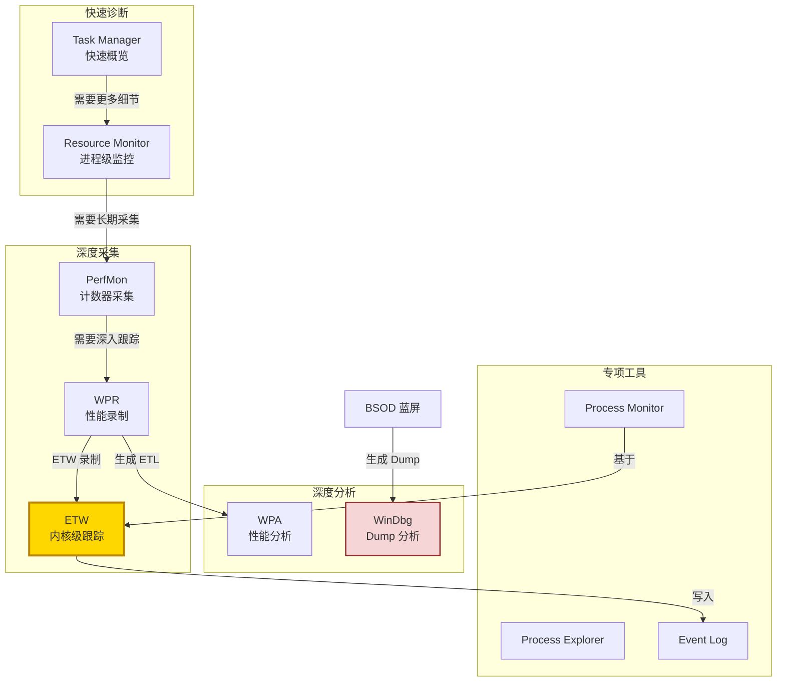

# Windows 性能与诊断技术导航 / Performance & Diagnostics Guide

> 📊 Windows 提供了从实时监控到事后分析的完整性能诊断工具链。
>
> 🔗 返回主导航图：[Windows 技术生态导航图](/knowledge_base/knowledge/windows/2026/03/25/windows-technology-ecosystem-navigation-map/)

---

## Performance Monitor (PerfMon)

**性能监视器** — Windows 内置的**实时性能数据采集和分析工具**。通过性能计数器 (Performance Counters) 监控 CPU、内存、磁盘、网络、进程等指标。支持 Data Collector Sets 进行长时间数据采集，生成报告用于趋势分析。

**核心概念：** Performance Counters, Data Collector Set (DCS), Counter Log, Alert, Report, Performance Object, Instance

**关键计数器分类：**
- CPU: `\Processor(_Total)\% Processor Time`, `\System\Processor Queue Length`
- Memory: `\Memory\Available MBytes`, `\Memory\Pages/sec`
- Disk: `\PhysicalDisk(*)\Avg. Disk sec/Read`, `\PhysicalDisk(*)\Disk Queue Length`
- Network: `\Network Interface(*)\Bytes Total/sec`

| 资源 | 链接 |
|------|------|
| 📖 PerfMon 概述 | [Performance Monitor](https://learn.microsoft.com/en-us/previous-versions/windows/it-pro/windows-server-2008-r2-and-2008/cc749249(v=ws.11)) |
| 📖 Data Collector Sets | [Data Collector Sets](https://learn.microsoft.com/en-us/previous-versions/windows/it-pro/windows-server-2008-r2-and-2008/cc766404(v=ws.11)) |
| 🔧 性能排查概述 | [Performance Troubleshooting](https://learn.microsoft.com/en-us/troubleshoot/windows-server/performance/performance-overview) |
| 🔧 内部 Wiki | [Performance Wiki](https://supportability.visualstudio.com/) |

---

## Resource Monitor

**资源监视器** — 比 Task Manager 更详细的**实时资源监控工具**。按进程级别展示 CPU、内存、磁盘、网络的使用情况，支持按进程过滤磁盘活动和网络连接。

**使用场景：** 快速定位哪个进程占用资源最多、查看进程的磁盘 I/O 和网络连接

| 资源 | 链接 |
|------|------|
| 📖 Resource Monitor | [Use Resource Monitor](https://learn.microsoft.com/en-us/previous-versions/windows/it-pro/windows-server-2008-r2-and-2008/dd883276(v=ws.11)) |

---

## ETW (Event Tracing for Windows)

**Windows 事件跟踪** — Windows 内核级别的**高性能跟踪框架**，是几乎所有 Windows 诊断工具的底层引擎。Provider 产生事件 → Controller 启停会话 → Consumer 消费事件。WPR、Netsh trace、Logman 等工具都基于 ETW。

**核心概念：** Provider, Controller, Consumer, Session, Keyword, Level, ETL File, Manifest-based vs TraceLogging

| 资源 | 链接 |
|------|------|
| 📖 ETW 概述 | [Event Tracing for Windows](https://learn.microsoft.com/en-us/windows/win32/etw/event-tracing-portal) |
| 📖 ETW 会话 | [ETW Sessions](https://learn.microsoft.com/en-us/windows/win32/etw/configuring-and-starting-an-event-tracing-session) |

---

## WPR / WPA (Windows Performance Recorder / Analyzer)

**Windows 性能录制器和分析器** — WPR 使用 ETW 录制系统级性能数据；WPA 以图形化方式分析 ETL 文件。是**深度性能分析的首选工具**，可分析 CPU 调度、磁盘 I/O、内存分配、网络活动、启动时间等。

**核心概念：** Recording Profile, ETL File, CPU Usage (Sampled/Precise), Disk I/O, Memory, Generic Events, Regions of Interest, Stack Analysis

| 资源 | 链接 |
|------|------|
| 📖 WPR 概述 | [Windows Performance Recorder](https://learn.microsoft.com/en-us/windows-hardware/test/wpt/windows-performance-recorder) |
| 📖 WPA 概述 | [Windows Performance Analyzer](https://learn.microsoft.com/en-us/windows-hardware/test/wpt/windows-performance-analyzer) |
| 📖 WPT 下载 | [Windows Performance Toolkit](https://learn.microsoft.com/en-us/windows-hardware/test/wpt/) |

---

## Xperf (Legacy)

**Xperf** — WPR/WPA 的前身，命令行工具，仍在某些场景中使用。使用 `xperf -on` 开始录制，`xperf -stop` 停止，`xperf -i` 或 WPA 分析。

| 资源 | 链接 |
|------|------|
| 📖 Xperf 参考 | [Xperf Command-Line](https://learn.microsoft.com/en-us/windows-hardware/test/wpt/xperf-command-line-reference) |

---

## Event Log

**事件日志** — Windows 的**集中式日志系统**。记录系统、应用、安全等事件。包括 Windows Logs (System, Application, Security) 和 Applications and Services Logs。是排查问题的第一手信息来源。

**核心概念：** Event ID, Source, Level (Info/Warning/Error/Critical), Event Viewer, Custom Views, Event Forwarding, Subscriptions

| 资源 | 链接 |
|------|------|
| 📖 Event Log 概述 | [Windows Event Log](https://learn.microsoft.com/en-us/windows/win32/wes/windows-event-log) |
| 📖 Event Forwarding | [Windows Event Forwarding](https://learn.microsoft.com/en-us/windows/security/operating-system-security/device-management/windows-event-forwarding/) |

---

## BSOD / Bugcheck & Dump Analysis

**蓝屏与转储分析** — 当 Windows 遇到无法恢复的内核错误时，生成 **BSOD (蓝屏)**并写入内存转储文件 (Memory Dump)。使用 WinDbg 分析 dump 文件来定位问题根因（驱动、硬件、内存损坏等）。

**核心概念：** Bugcheck Code, Minidump/Kernel Dump/Complete Dump, WinDbg, `!analyze -v`, Stack Trace, IRQL, Pool Corruption

**常见 Bugcheck Codes：**
- `0x0A` IRQL_NOT_LESS_OR_EQUAL — 驱动/内核访问了错误的 IRQL 内存
- `0x1A` MEMORY_MANAGEMENT — 内存管理错误（常指硬件内存问题）
- `0x50` PAGE_FAULT_IN_NONPAGED_AREA — 引用了无效的非分页内存
- `0x9F` DRIVER_POWER_STATE_FAILURE — 驱动电源状态异常
- `0xD1` DRIVER_IRQL_NOT_LESS_OR_EQUAL — 驱动在错误 IRQL 访问分页内存

| 资源 | 链接 |
|------|------|
| 📖 Bugcheck 代码参考 | [Bug Check Code Reference](https://learn.microsoft.com/en-us/windows-hardware/drivers/debugger/bug-check-code-reference2) |
| 📖 配置 Dump | [Configure Memory Dump](https://learn.microsoft.com/en-us/troubleshoot/windows-server/performance/memory-dump-file-options) |
| 📖 WinDbg 入门 | [Getting Started with WinDbg](https://learn.microsoft.com/en-us/windows-hardware/drivers/debugger/getting-started-with-windbg) |
| 🔧 排查指南 | [BSOD Troubleshooting](https://learn.microsoft.com/en-us/troubleshoot/windows-server/performance/stop-error-overview) |

---

## WinDbg

**Windows 调试器** — 微软官方的**内核和用户模式调试器**，是分析 Memory Dump 的核心工具。支持本地/远程调试、符号加载、扩展命令。`!analyze -v` 是最常用的自动分析命令。

**核心命令：**
- `!analyze -v` — 自动分析 crash 原因
- `!process 0 0` — 列出所有进程
- `!thread` — 显示当前线程
- `k` / `kv` / `kp` — 显示调用栈
- `!pool` / `!poolused` — 池内存分析
- `!vm` — 虚拟内存信息

| 资源 | 链接 |
|------|------|
| 📖 WinDbg 下载 | [Install WinDbg](https://learn.microsoft.com/en-us/windows-hardware/drivers/debugger/) |
| 📖 调试命令参考 | [Debugger Commands](https://learn.microsoft.com/en-us/windows-hardware/drivers/debugger/debugger-commands) |
| 📖 符号设置 | [Symbol Path](https://learn.microsoft.com/en-us/windows-hardware/drivers/debugger/symbol-path) |

---

## Sysinternals Tools

**Sysinternals 工具套件** — 由 Mark Russinovich 开发的**高级系统诊断工具集**，是 Windows 工程师的必备利器。

| 工具 | 用途 | 链接 |
|------|------|------|
| **Process Monitor** | 实时监控文件/注册表/网络/进程活动 | [ProcMon](https://learn.microsoft.com/en-us/sysinternals/downloads/procmon) |
| **Process Explorer** | 进程详细信息（句柄、DLL、性能） | [ProcExp](https://learn.microsoft.com/en-us/sysinternals/downloads/process-explorer) |
| **Autoruns** | 启动项管理（所有自启动位置） | [Autoruns](https://learn.microsoft.com/en-us/sysinternals/downloads/autoruns) |
| **TCPView** | 实时网络连接监控 | [TCPView](https://learn.microsoft.com/en-us/sysinternals/downloads/tcpview) |
| **PsExec** | 远程执行命令 | [PsExec](https://learn.microsoft.com/en-us/sysinternals/downloads/psexec) |
| **Handle** | 查看进程持有的句柄 | [Handle](https://learn.microsoft.com/en-us/sysinternals/downloads/handle) |
| **RAMMap** | 物理内存使用分析 | [RAMMap](https://learn.microsoft.com/en-us/sysinternals/downloads/rammap) |
| **VMMap** | 进程虚拟内存分析 | [VMMap](https://learn.microsoft.com/en-us/sysinternals/downloads/vmmap) |
| **DiskMon** | 磁盘 I/O 活动监控 | [DiskMon](https://learn.microsoft.com/en-us/sysinternals/downloads/diskmon) |

| 资源 | 链接 |
|------|------|
| 📖 Sysinternals 首页 | [Sysinternals Suite](https://learn.microsoft.com/en-us/sysinternals/) |

---

## 性能诊断工具链关系

### 诊断工具选择指南

| 场景 | 推荐工具 | 说明 |
|------|---------|------|
| **快速查看系统状态** | Task Manager → Resource Monitor | 实时概览 |
| **长时间性能监控** | PerfMon (Data Collector Set) | 采集计数器趋势 |
| **CPU/磁盘/内存深度分析** | WPR + WPA | ETW 级别深度分析 |
| **蓝屏/系统崩溃** | WinDbg + Memory Dump | `!analyze -v` 定位根因 |
| **应用启动慢/行为异常** | Process Monitor + Process Explorer | 文件/注册表/网络活动跟踪 |
| **事件审计/日志检查** | Event Viewer | 检查 System/Application/Security 日志 |
