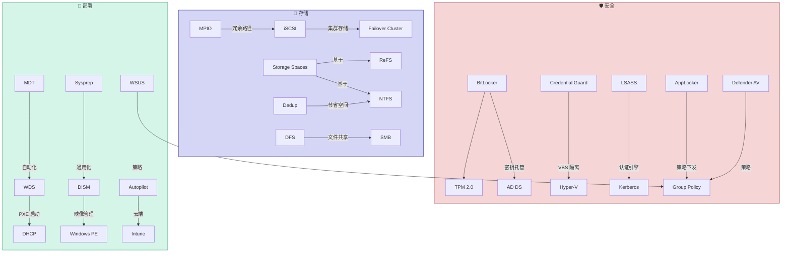

# Windows 安全、存储与部署技术导航 / Security, Storage & Deployment Guide

> 🛡️ 安全、存储、部署是 Windows 平台的基础保障层。
>
> 🔗 返回主导航图：[Windows 技术生态导航图](/case-knowledge-base/knowledge/windows/2026/03/25/windows-technology-ecosystem-navigation-map/)

---

# 🛡️ 安全技术 (Security)

---

## BitLocker

**磁盘加密** — 对整个卷进行**全盘加密**，防止设备丢失或被盗时数据泄露。使用 AES-128/256 加密，支持 TPM 芯片保护启动密钥。可通过 Group Policy 集中管理，密钥可托管到 AD DS 或 Entra ID。

**核心概念：** Full Volume Encryption, TPM + PIN, Recovery Key, BitLocker To Go (USB), Network Unlock, Used Space Only Encryption

| 资源 | 链接 |
|------|------|
| 📖 BitLocker 概述 | [BitLocker Overview](https://learn.microsoft.com/en-us/windows/security/operating-system-security/data-protection/bitlocker/) |
| 📖 部署 BitLocker | [Deploy BitLocker](https://learn.microsoft.com/en-us/windows/security/operating-system-security/data-protection/bitlocker/bitlocker-deployment-comparison) |
| 📖 Group Policy 配置 | [BitLocker Group Policy](https://learn.microsoft.com/en-us/windows/security/operating-system-security/data-protection/bitlocker/bitlocker-group-policy-settings) |
| 🔧 排查指南 | [Troubleshoot BitLocker](https://learn.microsoft.com/en-us/troubleshoot/windows-client/windows-security/bitlocker-overview) |

---

## Credential Guard

**凭据保护** — 使用**基于虚拟化的安全 (VBS)** 隔离 LSASS 中存储的域凭据（Kerberos TGT、NTLM 哈希），防止 Pass-the-Hash、Pass-the-Ticket 等凭据窃取攻击。需要 Hyper-V 支持。

**核心概念：** Virtualization-Based Security (VBS), Isolated LSA, UEFI Lock, Hardware Requirements

| 资源 | 链接 |
|------|------|
| 📖 Credential Guard 概述 | [Credential Guard Overview](https://learn.microsoft.com/en-us/windows/security/identity-protection/credential-guard/) |
| 📖 部署要求 | [Credential Guard Requirements](https://learn.microsoft.com/en-us/windows/security/identity-protection/credential-guard/credential-guard-requirements) |

---

## LSASS / SAM

**本地安全机构子系统 (LSASS)** — Windows 的**核心认证进程** (`lsass.exe`)，负责处理 Kerberos/NTLM 认证、管理安全令牌。**SAM (Security Account Manager)** 存储本地用户账户和密码哈希。LSASS 是攻击者的重要目标（Mimikatz 等工具）。

**核心概念：** LSASS Process, Security Token, SAM Database, LSA Secrets, LSASS Memory Protection

| 资源 | 链接 |
|------|------|
| 📖 LSASS 保护 | [Configure LSASS Protection](https://learn.microsoft.com/en-us/windows-server/security/credentials-protection-and-management/configuring-additional-lsa-protection) |

---

## TPM 2.0 (Trusted Platform Module)

**可信平台模块** — 硬件级别的**安全芯片**，提供密钥生成、加密存储、平台完整性度量等功能。是 BitLocker、Credential Guard、Windows Hello、Secure Boot 的硬件基础。Windows 11 要求 TPM 2.0。

| 资源 | 链接 |
|------|------|
| 📖 TPM 概述 | [TPM Overview](https://learn.microsoft.com/en-us/windows/security/hardware-security/tpm/trusted-platform-module-overview) |

---

## Windows Defender / Microsoft Defender Antivirus

**内置防病毒** — Windows 自带的**实时防护引擎**，提供病毒/恶意软件扫描、实时保护、云保护、Tamper Protection。可通过 Group Policy 或 Intune 管理。

| 资源 | 链接 |
|------|------|
| 📖 Defender 防病毒 | [Microsoft Defender Antivirus](https://learn.microsoft.com/en-us/defender-endpoint/microsoft-defender-antivirus-windows) |

---

## AppLocker / WDAC

**应用控制** — **AppLocker** 通过规则限制哪些应用可以运行（基于路径/发布者/哈希）。**WDAC (Windows Defender Application Control)** 是更强大的内核级应用控制方案，支持 Code Integrity Policy。

| 资源 | 链接 |
|------|------|
| 📖 AppLocker | [AppLocker Overview](https://learn.microsoft.com/en-us/windows/security/application-security/application-control/app-control-for-business/applocker/applocker-overview) |
| 📖 WDAC | [WDAC Overview](https://learn.microsoft.com/en-us/windows/security/application-security/application-control/app-control-for-business/) |

---

## Smart Card Authentication

**智能卡认证** — 使用物理智能卡（含数字证书）进行双因素认证。需要 AD CS 颁发智能卡证书。常用于高安全要求的政府和金融机构。

| 资源 | 链接 |
|------|------|
| 📖 Smart Card 概述 | [Smart Card Overview](https://learn.microsoft.com/en-us/windows/security/identity-protection/smart-cards/smart-card-windows-smart-card-technical-reference) |

---

# 💾 存储技术 (Storage)

---

## NTFS

**NT 文件系统** — Windows 的**主要文件系统**，支持权限控制 (ACL)、加密 (EFS)、压缩、配额、硬链接、Change Journal 等。NTFS 是系统分区和大多数数据卷的默认文件系统。

**核心概念：** MFT (Master File Table), ACL, EFS, Disk Quota, Change Journal (USN), Hard Link, Junction Point, Sparse File

| 资源 | 链接 |
|------|------|
| 📖 NTFS 概述 | [NTFS Overview](https://learn.microsoft.com/en-us/windows-server/storage/file-server/ntfs-overview) |

---

## ReFS (Resilient File System)

**弹性文件系统** — 微软的新一代文件系统，专为**数据完整性和大规模存储**设计。支持 Block Clone（快速 VM 操作）、Integrity Streams（数据校验和自动修复）。是 Storage Spaces Direct 和 Hyper-V 的推荐文件系统。

> ⚠️ ReFS 不支持 Boot 卷、EFS、压缩、磁盘配额等 NTFS 功能。

| 资源 | 链接 |
|------|------|
| 📖 ReFS 概述 | [ReFS Overview](https://learn.microsoft.com/en-us/windows-server/storage/refs/refs-overview) |

---

## iSCSI

**Internet SCSI** — 通过 TCP/IP 网络传输 **SCSI 块存储**协议。Windows Server 同时包含 iSCSI Target（存储端）和 iSCSI Initiator（客户端）。常用作 Failover Cluster 的共享存储。

**核心概念：** iSCSI Target, iSCSI Initiator, IQN, LUN, CHAP Authentication, MPIO

| 资源 | 链接 |
|------|------|
| 📖 iSCSI Target | [iSCSI Target Server](https://learn.microsoft.com/en-us/windows-server/storage/iscsi/iscsi-target-server) |
| 📖 iSCSI Initiator | [iSCSI Initiator](https://learn.microsoft.com/en-us/previous-versions/windows/it-pro/windows-server-2008-r2-and-2008/ee338476(v=ws.10)) |

---

## MPIO (Multipath I/O)

**多路径 I/O** — 通过多条物理路径连接到同一存储设备，提供**冗余和负载均衡**。支持 iSCSI 和 Fibre Channel 存储。当一条路径故障时自动切换到另一条路径。

| 资源 | 链接 |
|------|------|
| 📖 MPIO 概述 | [MPIO Overview](https://learn.microsoft.com/en-us/windows-server/storage/disk-management/mpio-overview) |

---

## Data Deduplication

**重复数据删除** — 在卷级别识别和消除重复数据块，**节省存储空间**。适用于文件服务器、VDI、备份卷等包含大量重复数据的场景。在 NTFS 卷上运行。

| 资源 | 链接 |
|------|------|
| 📖 Dedup 概述 | [Data Deduplication Overview](https://learn.microsoft.com/en-us/windows-server/storage/data-deduplication/overview) |

---

# 🚀 部署技术 (Deployment)

---

## WSUS (Windows Server Update Services)

**更新服务** — 集中管理和分发 **Microsoft 更新补丁**的服务器角色。管理员可审批/拒绝更新，按计算机组控制更新部署。通过 Group Policy 将客户端指向 WSUS 服务器。

**核心概念：** Update Classification, Computer Groups, Sync Schedule, Approval, BITS Download

| 资源 | 链接 |
|------|------|
| 📖 WSUS 概述 | [WSUS Overview](https://learn.microsoft.com/en-us/windows-server/administration/windows-server-update-services/get-started/windows-server-update-services-wsus) |
| 📖 部署 WSUS | [Deploy WSUS](https://learn.microsoft.com/en-us/windows-server/administration/windows-server-update-services/deploy/deploy-windows-server-update-services) |

---

## WDS (Windows Deployment Services)

**部署服务** — 通过 **PXE 网络启动**部署 Windows 操作系统映像。依赖 DHCP（提供网络启动地址）和 TFTP。与 MDT 配合实现自动化大批量部署。

**核心概念：** PXE Boot, Boot Image, Install Image, Multicast, Transport Server

| 资源 | 链接 |
|------|------|
| 📖 WDS 概述 | [WDS Overview](https://learn.microsoft.com/en-us/windows/deployment/wds-boot-support) |

---

## MDT (Microsoft Deployment Toolkit)

**部署工具包** — 免费的**自动化 OS 部署框架**，提供 Task Sequence 向导、驱动管理、应用安装、用户数据迁移等。与 WDS 配合实现零接触部署 (ZTI) 或轻接触部署 (LTI)。

| 资源 | 链接 |
|------|------|
| 📖 MDT 文档 | [MDT Documentation](https://learn.microsoft.com/en-us/mem/configmgr/mdt/) |

---

## DISM (Deployment Image Servicing and Management)

**映像服务和管理** — 命令行工具，用于**离线或在线管理 Windows 映像** (.wim/.vhdx)。可添加/删除功能、驱动、更新包，修复系统组件。

**常用命令：**
- `DISM /Online /Cleanup-Image /RestoreHealth` — 修复系统组件
- `DISM /Mount-Image` — 挂载离线映像
- `DISM /Add-Driver` — 注入驱动

| 资源 | 链接 |
|------|------|
| 📖 DISM 参考 | [DISM Command Reference](https://learn.microsoft.com/en-us/windows-hardware/manufacture/desktop/dism-reference--deployment-image-servicing-and-management) |

---

## Sysprep

**系统准备工具** — 将 Windows 安装**通用化**（移除硬件特定信息、SID 等），生成可用于批量部署的模板映像。是创建标准化 Windows 映像的必备步骤。

| 资源 | 链接 |
|------|------|
| 📖 Sysprep 概述 | [Sysprep Overview](https://learn.microsoft.com/en-us/windows-hardware/manufacture/desktop/sysprep--system-preparation--overview) |

---

## Windows Autopilot

**云端自动部署** — 基于 **Intune** 的现代 Windows 设备部署方案。设备开箱即用，连接网络后自动从云端拉取配置和策略，无需传统映像部署。是微软推荐的现代部署方式。

| 资源 | 链接 |
|------|------|
| 📖 Autopilot 概述 | [Windows Autopilot](https://learn.microsoft.com/en-us/autopilot/windows-autopilot) |

---

## 安全/存储/部署技术关系一览

