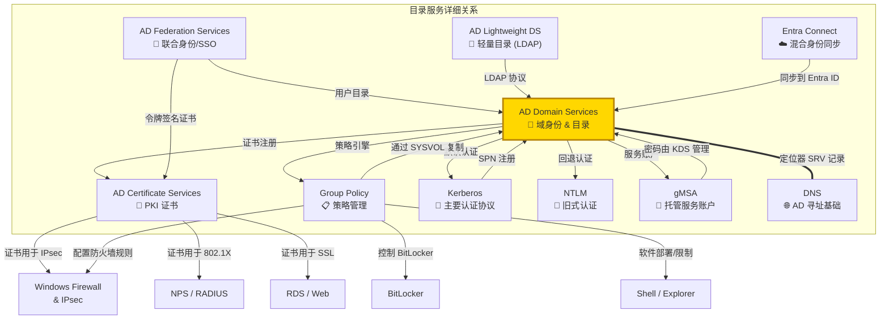
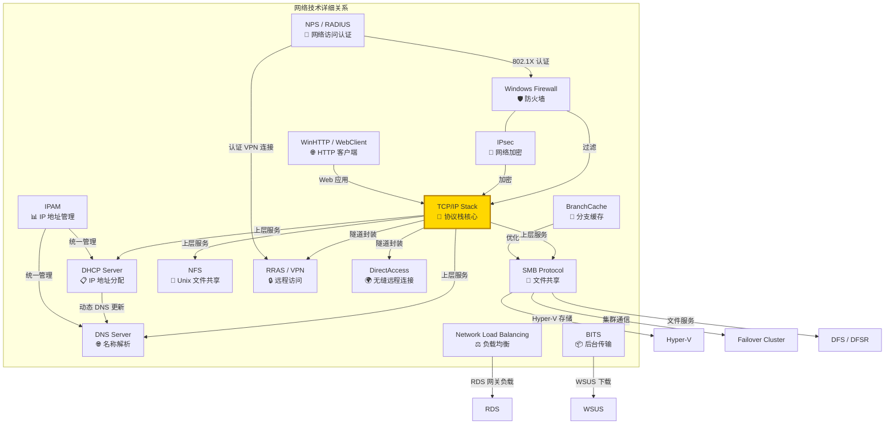
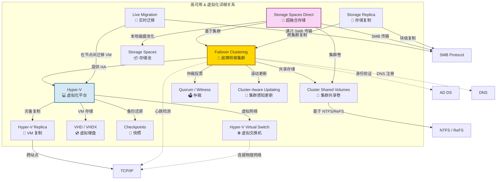
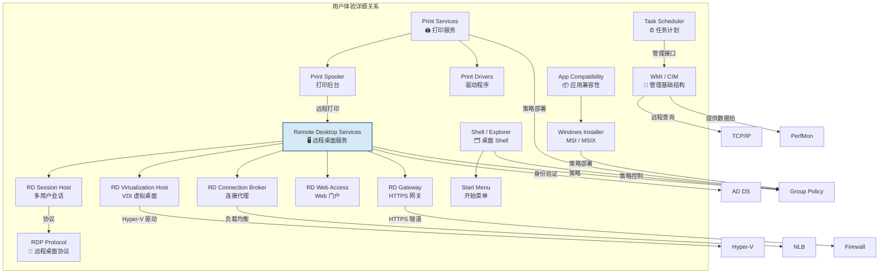
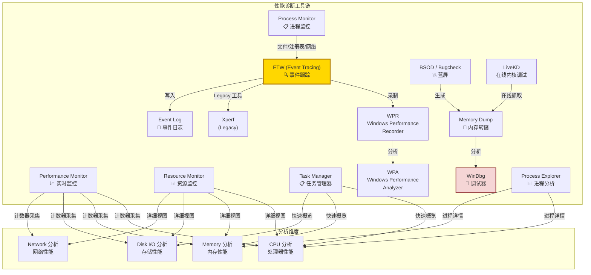
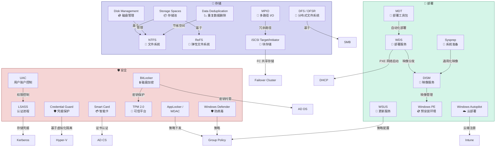
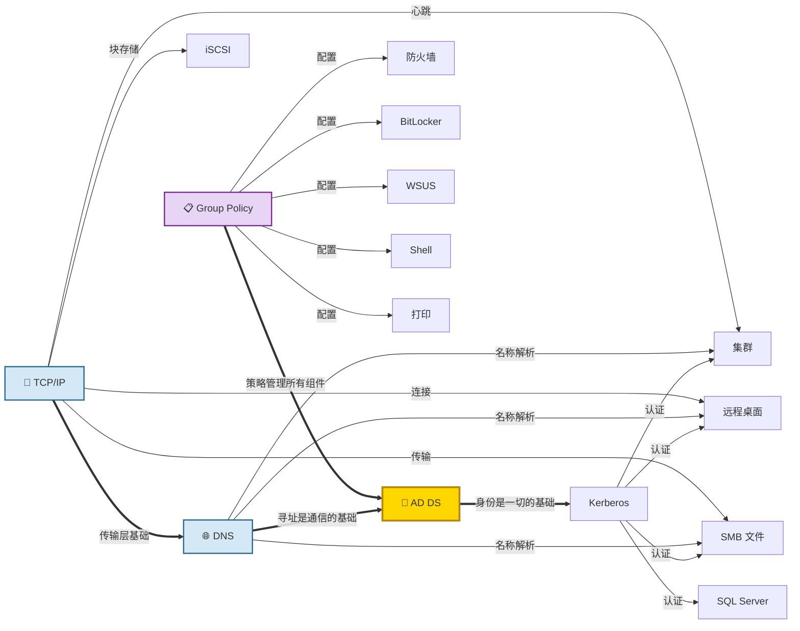

# Deep Dive: Windows 技术生态导航图

**Topic:** Windows Server & Client Technology Ecosystem  
**Category:** Windows Platform  
**Level:** 入门 ~ 中级  
**Last Updated:** 2026-03-25

---

## 1. 概述 (Overview)

Windows 平台是微软最核心的技术基座。围绕 Windows Server 和 Windows Client，微软构建了一个覆盖**身份认证、网络通信、存储、虚拟化、高可用、安全、桌面体验、性能诊断**等领域的完整技术体系。

这些技术之间存在着**深度的依赖和协作关系**。例如：
- **Active Directory** 是整个 Windows 网络的身份核心，DNS 是 AD 的寻址基础
- **Failover Clustering** 依赖网络心跳和共享存储来实现高可用
- **Hyper-V** 虚拟化平台使用 SMB 存储、虚拟交换机、Live Migration 等多项底层技术
- **Group Policy** 通过 AD DS 下发，控制着安全策略、软件部署、桌面配置等

本文以**可视化关系图**为核心，建立 Windows 技术全景的认知框架，并链接到各分区的详细介绍。

> 📖 **分区详细帖导航：**
> - [目录服务 (Directory Services)](/knowledge_base/knowledge/windows/2026/03/25/windows-directory-services-guide/)
> - [网络技术 (Networking)](/knowledge_base/knowledge/windows/2026/03/25/windows-networking-technologies-guide/)
> - [高可用与虚拟化 (HA & Virtualization)](/knowledge_base/knowledge/windows/2026/03/25/windows-high-availability-virtualization-guide/)
> - [用户体验 / UEX (User Experience)](/knowledge_base/knowledge/windows/2026/03/25/windows-user-experience-guide/)
> - [性能与诊断 (Performance & Diagnostics)](/knowledge_base/knowledge/windows/2026/03/25/windows-performance-diagnostics-guide/)
> - [安全、存储与部署 (Security, Storage & Deployment)](/knowledge_base/knowledge/windows/2026/03/25/windows-security-storage-deployment-guide/)

---

## 2. Windows 技术全景关系图 (Full Ecosystem Map)

```mermaid
graph TB
    subgraph DS["🔐 目录服务<br/>Directory Services"]
        ADDS["Active Directory<br/>Domain Services"]
        ADFS["AD Federation<br/>Services"]
        ADCS["AD Certificate<br/>Services"]
        GP["Group Policy"]
        KRB["Kerberos / NTLM"]
    end

    subgraph NET["🌐 网络技术<br/>Networking"]
        TCPIP["TCP/IP Stack"]
        DNS["DNS Server"]
        DHCP["DHCP Server"]
        SMB["SMB / File Sharing"]
        VPN["VPN / RRAS /<br/>DirectAccess"]
        FW["Windows Firewall<br/>& IPsec"]
        NPS["NPS / RADIUS"]
        NLB["Network Load<br/>Balancing"]
    end

    subgraph SHA["⚙️ 高可用 & 虚拟化<br/>HA & Virtualization"]
        FC["Failover<br/>Clustering"]
        HV["Hyper-V"]
        LM["Live Migration"]
        CSV["Cluster Shared<br/>Volumes"]
        SR["Storage Replica"]
        S2D["Storage Spaces<br/>Direct"]
    end

    subgraph UEX["🖥️ 用户体验<br/>User Experience"]
        RDS["Remote Desktop<br/>Services"]
        RDP["RDP Protocol"]
        Print["Print Services"]
        Shell["Shell / Explorer"]
        WMI["WMI / CIM"]
        TaskSch["Task Scheduler"]
    end

    subgraph PERF["📊 性能 & 诊断<br/>Performance"]
        PerfMon["Performance<br/>Monitor"]
        WPA["WPA / ETW<br/>Tracing"]
        BSOD["BSOD / Bugcheck<br/>Dump Analysis"]
        EventLog["Event Log"]
        WinDbg["WinDbg /<br/>Dump Analysis"]
    end

    subgraph SEC["🛡️ 安全 & 存储 & 部署<br/>Security / Storage / Deploy"]
        BitLocker["BitLocker"]
        CG["Credential Guard"]
        LSASS["LSASS / SAM"]
        Storage["Storage Spaces /<br/>NTFS / ReFS"]
        iSCSI["iSCSI / MPIO"]
        WSUS["WSUS"]
        WDS["WDS / MDT /<br/>DISM"]
    end

    %% ===== 身份核心关系 =====
    ADDS -->|"身份验证基础"| KRB
    ADDS -->|"策略下发"| GP
    ADDS -->|"证书集成"| ADCS
    ADDS -->|"联合身份"| ADFS
    ADDS ===|"DNS 是 AD 的寻址基础"| DNS

    %% ===== 网络层关系 =====
    DNS -->|"名称解析"| TCPIP
    DHCP -->|"IP 分配"| TCPIP
    SMB -->|"基于 TCP/IP"| TCPIP
    VPN -->|"加密隧道"| FW
    NPS -->|"认证"| VPN
    NLB -->|"L4 负载均衡"| TCPIP
    KRB -->|"认证 SMB 访问"| SMB
    FW -->|"IPsec 策略"| GP

    %% ===== 高可用层关系 =====
    FC -->|"心跳网络"| TCPIP
    FC -->|"共享存储"| CSV
    FC -->|"DNS 注册"| DNS
    FC -->|"身份验证"| ADDS
    HV -->|"集群化"| FC
    HV -->|"VM 存储"| SMB
    HV -->|"虚拟网络"| TCPIP
    LM -->|"VM 迁移"| HV
    LM -->|"网络传输"| SMB
    S2D -->|"基于集群"| FC
    S2D -->|"网络传输"| SMB
    SR -->|"复制传输"| SMB
    CSV -->|"基于"| Storage

    %% ===== 用户体验层关系 =====
    RDS -->|"协议"| RDP
    RDS -->|"身份验证"| ADDS
    RDS -->|"负载均衡"| NLB
    RDS -->|"打印重定向"| Print
    Print -->|"策略"| GP
    Shell -->|"策略控制"| GP
    WMI -->|"远程管理"| TCPIP
    TaskSch -->|"运行管理"| WMI

    %% ===== 性能诊断层关系 =====
    PerfMon -->|"采集"| EventLog
    WPA -->|"ETW 跟踪"| EventLog
    BSOD -->|"分析"| WinDbg
    EventLog -->|"日志来源"| WMI

    %% ===== 安全存储层关系 =====
    BitLocker -->|"密钥存储"| ADDS
    CG -->|"隔离"| HV
    LSASS -->|"认证引擎"| KRB
    Storage -->|"文件共享"| SMB
    iSCSI -->|"块存储"| TCPIP
    iSCSI -->|"集群存储"| FC
    WSUS -->|"策略"| GP
    WDS -->|"网络启动"| DHCP

    style DS fill:#e8d5f5,stroke:#7b2d8e
    style NET fill:#d5e8f5,stroke:#2d6b8e
    style SHA fill:#f5e8d5,stroke:#8e6b2d
    style UEX fill:#d5f5e8,stroke:#2d8e6b
    style PERF fill:#f5d5d5,stroke:#8e2d2d
    style SEC fill:#f5f5d5,stroke:#8e8e2d
```

---

## 3. 目录服务关系图 (Directory Services)

> 🔐 Active Directory 是 Windows 企业网络的**身份认证和策略管理核心**。

> 📖 **详细介绍：** [目录服务分区详细帖](/knowledge_base/knowledge/windows/2026/03/25/windows-directory-services-guide/)

---

## 4. 网络技术关系图 (Networking)

> 🌐 Windows 网络技术从 TCP/IP 协议栈出发，提供 DNS、DHCP、SMB、VPN、防火墙等完整网络基础设施。

> 📖 **详细介绍：** [网络技术分区详细帖](/knowledge_base/knowledge/windows/2026/03/25/windows-networking-technologies-guide/)

---

## 5. 高可用 & 虚拟化关系图 (HA & Virtualization)

> ⚙️ Failover Clustering + Hyper-V + Storage Spaces Direct 构成了 Windows 高可用的三大支柱。

> 📖 **详细介绍：** [高可用与虚拟化分区详细帖](/knowledge_base/knowledge/windows/2026/03/25/windows-high-availability-virtualization-guide/)

---

## 6. 用户体验关系图 (User Experience / UEX)

> 🖥️ UEX 涵盖了远程桌面、打印、Shell、WMI 等面向用户和管理员的交互技术。

> 📖 **详细介绍：** [用户体验 UEX 分区详细帖](/knowledge_base/knowledge/windows/2026/03/25/windows-user-experience-guide/)

---

## 7. 性能与诊断关系图 (Performance & Diagnostics)

> 📊 Windows 提供了从实时监控到事后分析的完整性能诊断工具链。

> 📖 **详细介绍：** [性能与诊断分区详细帖](/knowledge_base/knowledge/windows/2026/03/25/windows-performance-diagnostics-guide/)

---

## 8. 安全、存储与部署关系图 (Security, Storage & Deployment)

> 🛡️ 安全、存储、部署是 Windows 平台的基础保障层。

> 📖 **详细介绍：** [安全、存储与部署分区详细帖](/knowledge_base/knowledge/windows/2026/03/25/windows-security-storage-deployment-guide/)

---

## 9. 跨领域核心依赖关系 (Cross-Domain Dependencies)

以下展示 Windows 技术之间**最关键的跨领域依赖**：

### 关键依赖总结

| 基础技术 | 依赖它的技术 | 原因 |
|---------|-----------|------|
| **AD DS** | 几乎所有 Windows Server 角色 | 身份验证、授权、策略管理 |
| **DNS** | AD DS, Failover Cluster, SMB DFS, RDS | 所有名称解析都依赖 DNS |
| **TCP/IP** | 所有网络服务 | 底层传输协议 |
| **Kerberos** | SMB, RDS, SQL, 集群, Web | Windows 域内默认认证协议 |
| **Group Policy** | 防火墙, BitLocker, WSUS, 打印, Shell | 统一的配置管理和策略下发 |
| **SMB** | Hyper-V, S2D, DFS, 文件共享, 集群 | Windows 核心文件传输协议 |
| **Failover Clustering** | Hyper-V HA, S2D, SQL Always-On, 文件服务器 | 高可用的基础框架 |

---

## 10. CSS Support Team 技术对照 (Internal Wiki Reference)

| CSS Team / Wiki | 覆盖技术 | 内部 Wiki |
|----------------|---------|-----------|
| **Directory Services** | AD DS, AD FS, AD CS, AD LDS, GP, Kerberos, NTLM, gMSA | [DS Workflows Wiki](https://supportability.visualstudio.com/WindowsDirectoryServices/_wiki/wikis/WindowsDirectoryServices/389664/Directory-Services-Workflows) |
| **Networking** | TCP/IP, DNS, DHCP, SMB, NFS, VPN, Firewall, NPS, NLB, IPAM | [Networking Wiki](https://supportability.visualstudio.com/WindowsNetworking/_wiki/wikis/WindowsNetworking/588295/Wiki-Links-of-other-teams) |
| **SHA (High Availability)** | Failover Clustering, Hyper-V, S2D, Storage Replica, CSV | [SHA Wiki](https://supportability.visualstudio.com/) |
| **UEX (User Experience)** | Shell, RDS, Printing, WMI, Task Scheduler, App Compat | [UEX Wiki](https://supportability.visualstudio.com/WindowsUserExperience/_wiki/wikis/WindowsUserExperience/724471/UEX-Wiki) |
| **Performance** | PerfMon, WPA, ETW, BSOD, Dump Analysis, CPU/Mem/Disk | [Performance Wiki](https://supportability.visualstudio.com/) |
| **Security** | BitLocker, Credential Guard, LSASS, UAC, Smart Card, TPM | Internal |
| **Storage** | NTFS, ReFS, Storage Spaces, iSCSI, MPIO, Dedup, DFS | Internal |
| **Deployment** | WSUS, WDS, MDT, DISM, Sysprep, Autopilot | Internal |

---

---

# Deep Dive: Windows Technology Ecosystem Navigation Map

**Topic:** Windows Server & Client Technology Ecosystem  
**Category:** Windows Platform  
**Level:** Beginner ~ Intermediate  
**Last Updated:** 2026-03-25

---

## 1. Overview

The Windows platform is Microsoft's most foundational technology base. Built around Windows Server and Windows Client, Microsoft has created a complete technology ecosystem covering **identity & authentication, networking, storage, virtualization, high availability, security, desktop experience, and performance diagnostics**.

These technologies have **deep interdependencies**. For example:
- **Active Directory** is the identity core of the entire Windows network; DNS is AD's addressing foundation
- **Failover Clustering** relies on network heartbeats and shared storage for high availability
- **Hyper-V** uses SMB storage, virtual switches, Live Migration and multiple underlying technologies
- **Group Policy** is distributed through AD DS, controlling security policies, software deployment, and desktop configuration

This article focuses on **visual relationship diagrams** to establish a cognitive framework of the Windows technology landscape, linking to detailed guides for each area.

> 📖 **Detail Post Navigation:**
> - [Directory Services](/knowledge_base/knowledge/windows/2026/03/25/windows-directory-services-guide/)
> - [Networking Technologies](/knowledge_base/knowledge/windows/2026/03/25/windows-networking-technologies-guide/)
> - [HA & Virtualization](/knowledge_base/knowledge/windows/2026/03/25/windows-high-availability-virtualization-guide/)
> - [User Experience / UEX](/knowledge_base/knowledge/windows/2026/03/25/windows-user-experience-guide/)
> - [Performance & Diagnostics](/knowledge_base/knowledge/windows/2026/03/25/windows-performance-diagnostics-guide/)
> - [Security, Storage & Deployment](/knowledge_base/knowledge/windows/2026/03/25/windows-security-storage-deployment-guide/)

---

## 2. Full Ecosystem Map

*(Same Mermaid diagrams as Chinese version above — see Section 2-9 of Chinese version)*

---

## 3. Key Cross-Domain Dependencies

| Foundation Technology | Dependent Technologies | Reason |
|----------------------|----------------------|--------|
| **AD DS** | Nearly all Windows Server roles | Authentication, authorization, policy management |
| **DNS** | AD DS, Failover Cluster, SMB DFS, RDS | All name resolution depends on DNS |
| **TCP/IP** | All network services | Underlying transport protocol |
| **Kerberos** | SMB, RDS, SQL, Clustering, Web | Default authentication protocol in Windows domain |
| **Group Policy** | Firewall, BitLocker, WSUS, Print, Shell | Unified configuration management and policy distribution |
| **SMB** | Hyper-V, S2D, DFS, File Sharing, Clustering | Windows core file transfer protocol |
| **Failover Clustering** | Hyper-V HA, S2D, SQL Always-On, File Server | Foundation framework for high availability |

---

## 4. References

- [Windows Server Documentation](https://learn.microsoft.com/en-us/windows-server/) — Official Windows Server docs
- [Active Directory DS Overview](https://learn.microsoft.com/en-us/windows-server/identity/ad-ds/get-started/virtual-dc/active-directory-domain-services-overview)
- [Windows Server Networking](https://learn.microsoft.com/en-us/windows-server/networking/)
- [Failover Clustering Overview](https://learn.microsoft.com/en-us/windows-server/failover-clustering/failover-clustering-overview)
- [Hyper-V Technology Overview](https://learn.microsoft.com/en-us/windows-server/virtualization/hyper-v/hyper-v-technology-overview)
- [Remote Desktop Services](https://learn.microsoft.com/en-us/windows-server/remote/remote-desktop-services/welcome-to-rds)
- [Performance Troubleshooting](https://learn.microsoft.com/en-us/troubleshoot/windows-server/performance/performance-overview)
- [Windows Security](https://learn.microsoft.com/en-us/windows-server/security/security-and-assurance)
- [Windows Server Storage](https://learn.microsoft.com/en-us/windows-server/storage/)
