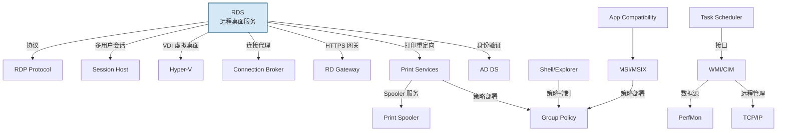

# Windows 用户体验技术导航 / User Experience (UEX) Guide

> 🖥️ UEX 涵盖了远程桌面、打印、Shell、WMI 等面向用户和管理员的交互技术。
>
> 🔗 返回主导航图：[Windows 技术生态导航图](/knowledge_base/knowledge/windows/2026/03/25/windows-technology-ecosystem-navigation-map/)

---

## Remote Desktop Services (RDS)

**远程桌面服务** — 通过 **RDP 协议**将桌面或应用远程交付给用户的平台。支持多用户会话 (Session-based)、VDI 虚拟桌面、RemoteApp 单个应用发布。包含 Session Host、Connection Broker、Web Access、Gateway 等组件。

**核心概念：** RDSH (Session Host), RDVH (Virtualization Host), RD Connection Broker, RD Web Access, RD Gateway, RemoteApp, RDS Licensing (CAL)

**与其他技术的关系：**
- 身份验证 → AD DS + Kerberos / NLA
- 负载均衡 → NLB 或 RD Connection Broker
- 打印 → Printer Redirection
- 存储 → User Profile Disk / FSLogix
- 虚拟化 → Hyper-V (VDI)
- 现代替代 → Azure Virtual Desktop (AVD)

| 资源 | 链接 |
|------|------|
| 📖 RDS 概述 | [Remote Desktop Services Overview](https://learn.microsoft.com/en-us/windows-server/remote/remote-desktop-services/welcome-to-rds) |
| 📖 RDS 部署指南 | [Deploy RDS](https://learn.microsoft.com/en-us/windows-server/remote/remote-desktop-services/rds-deploy-infrastructure) |
| 📖 RD Gateway | [RD Gateway](https://learn.microsoft.com/en-us/windows-server/remote/remote-desktop-services/rds-roles#rd-gateway) |
| 📖 Azure Virtual Desktop | [AVD Documentation](https://learn.microsoft.com/en-us/azure/virtual-desktop/) |
| 🔧 排查指南 | [Troubleshoot RDS](https://learn.microsoft.com/en-us/troubleshoot/windows-server/remote/remote-desktop-services-overview) |
| 🔧 内部 Wiki | [UEX Wiki](https://supportability.visualstudio.com/WindowsUserExperience/_wiki/wikis/WindowsUserExperience/724471/UEX-Wiki) |

---

## RDP Protocol (Remote Desktop Protocol)

**远程桌面协议** — 微软开发的**远程显示协议**，在客户端和服务器之间传输图形界面、键盘/鼠标输入、音频、打印机重定向、剪贴板等。默认端口 TCP 3389，支持 TLS 加密和 NLA (Network Level Authentication)。

**核心概念：** RDP 虚拟通道, NLA, CredSSP, RDP Compression, RemoteFX, UDP Transport, RDP Shortpath

| 资源 | 链接 |
|------|------|
| 📖 RDP 协议规范 | [RDP Protocol](https://learn.microsoft.com/en-us/openspecs/windows_protocols/ms-rdpbcgr/) |
| 📖 RDP Shortpath | [RDP Shortpath for AVD](https://learn.microsoft.com/en-us/azure/virtual-desktop/rdp-shortpath) |

---

## Print Services

**打印服务** — Windows 的**打印基础设施**，包括 Print Spooler 服务、打印队列管理、打印驱动程序、打印机共享。支持通过 Group Policy 部署打印机、Point and Print、Branch Office Direct Printing。

**核心概念：** Print Spooler, Print Queue, Print Driver (V3/V4), Point and Print, Printer Pooling, Branch Office Direct Printing, Print Management Console

**常见问题：** Spooler 崩溃、驱动兼容性、RDS 中的打印重定向

| 资源 | 链接 |
|------|------|
| 📖 打印服务概述 | [Print Services](https://learn.microsoft.com/en-us/windows-server/administration/server-manager/install-or-uninstall-roles-role-services-or-features) |
| 📖 打印管理 | [Print Management](https://learn.microsoft.com/en-us/previous-versions/windows/it-pro/windows-server-2012-r2-and-2012/hh831468(v=ws.11)) |
| 🔧 排查指南 | [Troubleshoot Printing](https://learn.microsoft.com/en-us/troubleshoot/windows-server/printing/printing-overview) |

---

## Shell / Explorer

**Windows Shell** — 用户与操作系统交互的**图形界面**，包括桌面、任务栏、开始菜单、文件资源管理器 (Explorer)、通知区域等。Group Policy 可控制 Shell 的各个方面（限制开始菜单项、锁定任务栏等）。

**核心概念：** Explorer.exe, Shell Extensions, File Associations, Start Menu, Taskbar, Notification Area, Shell Folders

| 资源 | 链接 |
|------|------|
| 📖 Shell 开发 | [Windows Shell](https://learn.microsoft.com/en-us/windows/win32/shell/shell-entry) |
| 🔧 排查指南 | [Troubleshoot Shell/Explorer](https://learn.microsoft.com/en-us/troubleshoot/windows-client/shell-experience/shell-experience-overview) |

---

## WMI / CIM (Windows Management Instrumentation)

**Windows 管理规范** — Windows 的**标准管理基础设施**，提供统一的接口来查询和管理系统信息。WMI 可远程管理计算机，是 SCCM、PowerShell、Performance Monitor、Event Log 等管理工具的底层数据源。

**核心概念：** WMI Repository, Namespace (root\cimv2), WMI Classes, WQL (WMI Query Language), CIM Cmdlets, WMI Provider, WMIC (已弃用)

| 资源 | 链接 |
|------|------|
| 📖 WMI 概述 | [WMI Overview](https://learn.microsoft.com/en-us/windows/win32/wmisdk/wmi-start-page) |
| 📖 CIM Cmdlets | [CIM Cmdlets](https://learn.microsoft.com/en-us/powershell/module/cimcmdlets/) |
| 🔧 排查指南 | [Troubleshoot WMI](https://learn.microsoft.com/en-us/troubleshoot/windows-server/system-management-components/wmi-overview) |

---

## Task Scheduler

**任务计划程序** — Windows 内置的**自动化任务调度**服务，按时间、事件、登录等触发器自动执行脚本、程序或操作。支持通过 PowerShell、COM、WMI 远程管理。Group Policy 也使用 Task Scheduler 实现计划任务部署。

**核心概念：** Trigger (Time/Event/Logon/Idle), Action (Execute/Email/Message), Condition, Settings, Task History, Run As (Credential)

| 资源 | 链接 |
|------|------|
| 📖 Task Scheduler 概述 | [Task Scheduler](https://learn.microsoft.com/en-us/windows/win32/taskschd/task-scheduler-start-page) |
| 📖 PowerShell 管理 | [ScheduledTasks Module](https://learn.microsoft.com/en-us/powershell/module/scheduledtasks/) |

---

## Application Compatibility & Packaging

**应用兼容性与打包** — 确保应用在新版 Windows 上正常运行的技术集合。包括 Application Compatibility Toolkit (ACT)、Shim 兼容层。现代应用打包格式包括 MSI (Windows Installer)、MSIX、App-V (应用虚拟化)。

**核心概念：** Shim Database, Compatibility Mode, Windows Installer (MSI), MSIX, App-V, Program Compatibility Assistant

| 资源 | 链接 |
|------|------|
| 📖 应用兼容性 | [Application Compatibility](https://learn.microsoft.com/en-us/windows/compatibility/) |
| 📖 MSIX 打包 | [MSIX Overview](https://learn.microsoft.com/en-us/windows/msix/) |
| 📖 Windows Installer | [Windows Installer](https://learn.microsoft.com/en-us/windows/win32/msi/windows-installer-portal) |

---

## UEX 技术关系一览

