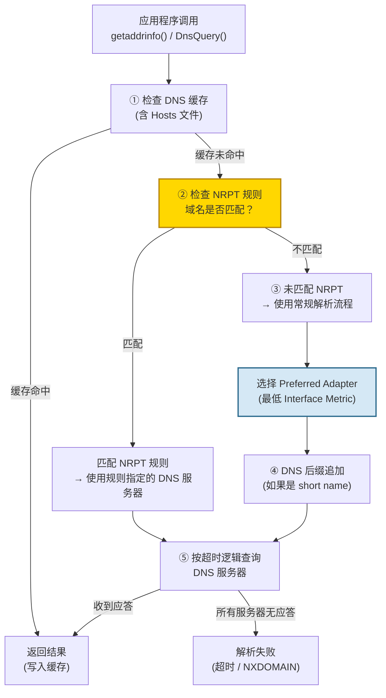
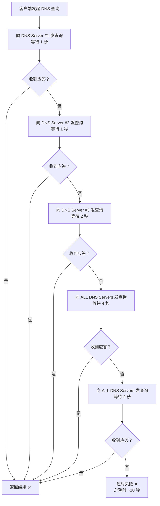
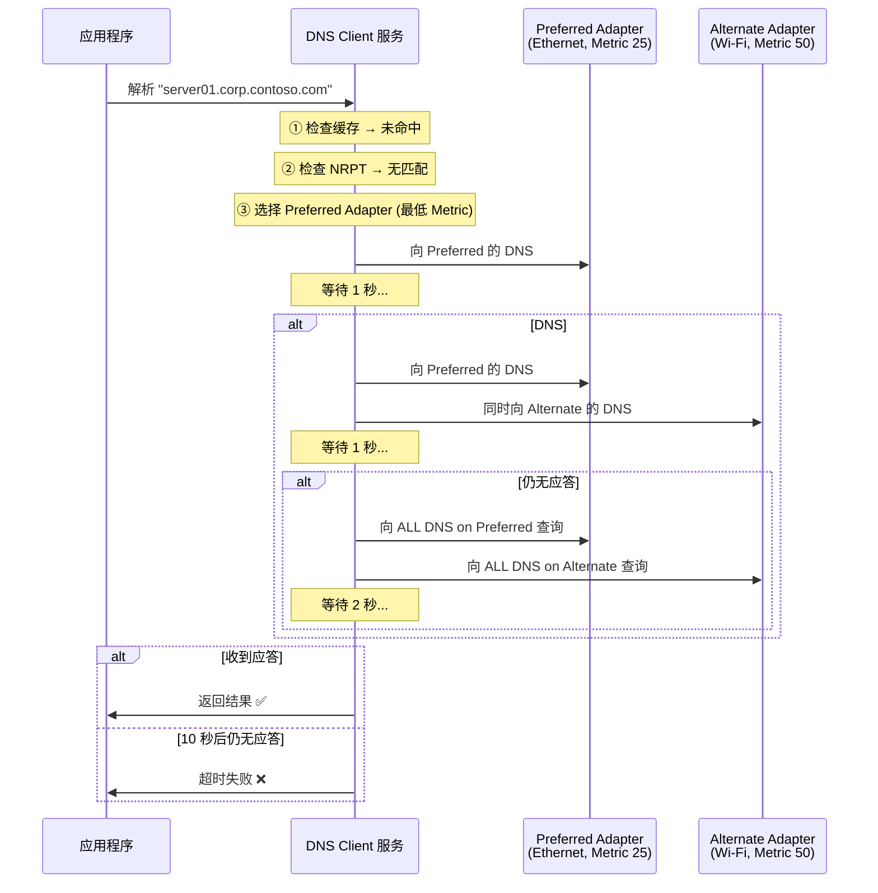
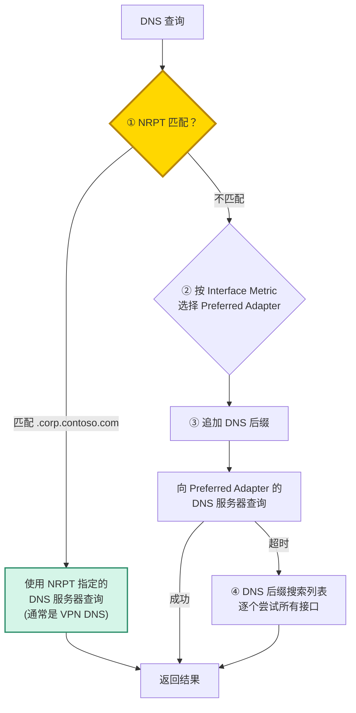

# Deep Dive: Windows DNS 客户端解析逻辑

**Topic:** Windows DNS Client Resolution — Multi-DNS Server, Multi-NIC, VPN Scenarios  
**Category:** Networking / DNS  
**Level:** 中级 ~ 高级  
**Last Updated:** 2026-03-27

---

## 1. 概述 (Overview)

Windows DNS 客户端的名称解析看似简单——应用程序调用 `getaddrinfo()` 或 `DnsQuery()`，DNS Client 服务 (`Dnscache`) 向 DNS 服务器发出查询并返回结果。但当设备处于以下复杂场景时，解析逻辑变得**非常微妙**：

1. **单网卡配置多个 DNS 服务器** — 第一个 DNS 不可达时如何回退？超时多久？
2. **多网卡 (Multi-Homed)** — 多张网卡各有自己的 DNS 服务器和 DNS 后缀，系统如何选择？
3. **VPN 连接后** — VPN 带来新的 DNS 服务器和内部域名，如何确保内部域名走 VPN 的 DNS？

理解这三个场景的底层逻辑，对于排查 **DNS 解析超时、解析到错误 IP、VPN 连接后无法访问内部资源** 等问题至关重要。

本文从 Windows DNS Client 的解析流水线开始，逐步拆解每个场景的完整行为。

---

## 2. 核心概念 (Core Concepts)

### DNS Client 服务 (Dnscache)

Windows DNS 解析并非由应用程序直接发送 UDP 包，而是由 `DNS Client` 服务 (`svchost.exe → Dnscache`) 统一管理。它负责：
- 维护 **DNS 缓存** (正向/反向/负缓存)
- 管理 **每个网卡的 DNS 服务器列表**
- 实现 **NRPT (Name Resolution Policy Table)** 规则匹配
- 控制 **查询超时和重试逻辑**
- 处理 **DNS 后缀追加和 Devolution**

### Interface Metric (接口跃点数)

每个网络适配器都有一个 **Interface Metric（跃点数）**，数值越小优先级越高。Windows 使用 Interface Metric 来决定**哪张网卡是 "Preferred Adapter"（首选适配器）**，DNS 查询首先发往首选适配器的 DNS 服务器。

```
# 查看接口跃点数
Get-NetIPInterface | Select-Object InterfaceAlias, InterfaceMetric, AddressFamily | Sort-Object InterfaceMetric
```

- **自动跃点值** (Automatic Metric)：基于链路速度自动计算（千兆=25, 百兆=35, Wi-Fi=50, VPN 通常更高）
- VPN 适配器通常获得较高的 Metric（更低优先级）
- 可手动设置（`Set-NetIPInterface -InterfaceAlias "Ethernet" -InterfaceMetric 10`）

### DNS 后缀 (DNS Suffix)

有三种类型的 DNS 后缀影响名称解析：

| 类型 | 设置位置 | 说明 |
|------|---------|------|
| **Primary DNS Suffix** | 系统属性 → 计算机名 | 通常是域名（如 `corp.contoso.com`），全局唯一 |
| **Connection-Specific DNS Suffix** | 每个网卡各自配置 | 由 DHCP 下发或手动设置（如 VPN 的 `vpn.contoso.com`） |
| **DNS Suffix Search List** | Group Policy 或网卡高级设置 | 全局覆盖，定义后缀追加顺序 |

> ⚠️ **重要**：如果配置了全局 DNS Suffix Search List（通过 GPO 或手动），它会**覆盖**所有 Primary 和 Connection-Specific 后缀。

### NRPT (Name Resolution Policy Table)

**NRPT 是 DNS 解析流程中优先级最高的路由机制**。它是一张"域名→DNS 服务器"的映射表：

```powershell
# 查看当前 NRPT 规则
Get-DnsClientNrptRule

# 添加 NRPT 规则（将 .corp.contoso.com 的查询发往指定 DNS）
Add-DnsClientNrptRule -Namespace ".corp.contoso.com" -NameServers "10.0.0.10","10.0.0.11"
```

NRPT 常用于：
- **VPN** 连接时，将内部域名的 DNS 查询路由到 VPN 的 DNS 服务器
- **DirectAccess** 的域内解析
- **DNSSEC** 策略执行

---

## 3. 工作原理 (How It Works)

### 3.1 DNS 解析完整流水线



### 3.2 场景一：单网卡多个 DNS 服务器

假设网卡配置了 DNS 服务器列表：`10.0.0.1`、`10.0.0.2`、`10.0.0.3`

#### 超时和重试逻辑

**2 个 DNS 服务器配置时：**

| 时间 (累计秒) | 动作 |
|:---:|------|
| **0s** | 向第 1 个 DNS 服务器 (`10.0.0.1`) 发查询 |
| **1s** | 无应答 → 向第 2 个 DNS 服务器 (`10.0.0.2`) 发查询 |
| **2s** | 无应答 → 再次向第 2 个 DNS 发查询 |
| **4s** | 无应答 → **同时**向所有 DNS 服务器发查询 |
| **8s** | 无应答 → **同时**向所有 DNS 服务器发查询 |
| **10s** | **超时**，解析失败 |

**3 个或更多 DNS 服务器配置时：**

| 时间 (累计秒) | 动作 |
|:---:|------|
| **0s** | 向第 1 个 DNS 服务器发查询 |
| **1s** | 无应答 → 向第 2 个 DNS 发查询 |
| **2s** | 无应答 → 向第 3 个 DNS 发查询 |
| **4s** | 无应答 → **同时**向**所有** DNS 服务器发查询（包括第 4、5 个等） |
| **8s** | 无应答 → **同时**向**所有** DNS 服务器发查询 |
| **10s** | **超时**，解析失败 |

#### 关键行为细节



> ⚠️ **关键规则 #1：** **否定应答 (Negative Response / NXDOMAIN) 会立即终止查询**。DNS 客户端不会再尝试下一个 DNS 服务器。只有当 DNS 服务器**不可达（无应答）**时才会尝试下一个。

> ⚠️ **关键规则 #2：** 前 3 个 DNS 服务器是逐个尝试的。**第 4 个及以后的 DNS 服务器只在 4 秒后的"同时发送"阶段才会被使用**。因此，如果唯一可达的 DNS 在第 4 位或更后，至少有 4 秒延迟。

### 3.3 场景二：多网卡 (Multi-Homed)

当设备有多张网卡（如有线 + 无线，或物理网卡 + VPN 虚拟网卡），每张网卡有自己的 DNS 服务器列表。

#### 适配器选择逻辑

```
示例配置：

  Ethernet (Metric: 25)         Wi-Fi (Metric: 50)
  DNS: 10.0.0.1, 10.0.0.2      DNS: 192.168.1.1
  Suffix: corp.contoso.com      Suffix: home.local
         ↓                              ↓
    [Preferred Adapter]           [Alternate Adapter]
    (Metric 更低 = 优先)
```

#### 多网卡查询流程



**详细步骤：**

| 时间 | 动作 |
|:---:|------|
| **0s** | 向 **Preferred Adapter** 的第 1 个 DNS 服务器发查询 |
| **1s** | 无应答 → 向 Preferred 的第 2 个 DNS 和 **所有 Alternate Adapter 的第 1 个 DNS** 发查询 |
| **2s** | 无应答 → 向 Alternate 的第 2 个 DNS（如有）发查询 |
| **4s** | 无应答 → 向**所有适配器的所有 DNS 服务器**同时发查询 |
| **8s** | 无应答 → 再次向所有 DNS 服务器同时发查询 |
| **10s** | 超时 |

#### Smart Multi-Homed Name Resolution

Windows 8/Server 2012 引入了 **Smart Multi-Homed Name Resolution**（智能多宿主名称解析）：

| 行为 | 传统模式 | Smart Multi-Homed (默认启用) |
|------|---------|---------------------------|
| 查询范围 | 先查 Preferred，超时后查其他 | **可能同时向所有适配器的 DNS 发查询** |
| 延迟 | 较高（串行等待） | **较低（并行查询）** |
| DNS 泄露风险 | 低 | ⚠️ 可能将内部域名查询发到外部 DNS |

> ⚠️ **安全注意**：Smart Multi-Homed 可能导致**DNS 查询泄露**。例如，查询 `internal.corp.contoso.com` 时，如果同时向公司 DNS 和家庭 Wi-Fi 的 DNS 都发查询，家庭 ISP 的 DNS 服务器就能看到这个内部域名。

**通过 Group Policy 控制：**
```
Computer Configuration → Administrative Templates → Network → DNS Client
→ "Turn off smart multi-homed name resolution" = Enabled (关闭并行查询)
```

#### 否定应答的适配器隔离

当某个适配器的 DNS 服务器返回**否定应答 (NXDOMAIN)**：
- 该适配器的**所有 DNS 服务器都不再被查询**（被"移出考虑范围"）
- 但**其他适配器的 DNS 服务器不受影响**，会继续被查询

### 3.4 场景三：VPN 连接后的 DNS 解析

这是最复杂也是**最常见的排查场景**。

#### VPN 连接改变了什么

VPN 连接建立后，系统状态发生以下变化：

```
连接 VPN 前：                    连接 VPN 后：
┌─────────────────┐              ┌─────────────────┐
│ Ethernet         │              │ Ethernet         │
│ Metric: 25       │              │ Metric: 25       │ ← 仍然是 Preferred
│ DNS: 8.8.8.8     │              │ DNS: 8.8.8.8     │
│ Suffix: -        │              │ Suffix: -        │
└─────────────────┘              └─────────────────┘
                                  ┌─────────────────┐
                                  │ VPN Adapter       │ ← 新增
                                  │ Metric: 100       │ ← 通常较高
                                  │ DNS: 10.0.0.10    │ ← 公司内部 DNS
                                  │ Suffix: corp.     │
                                  │   contoso.com     │
                                  └─────────────────┘
                                  ┌─────────────────┐
                                  │ NRPT 规则 (可选)   │ ← VPN 可能注入
                                  │ .corp.contoso.com │
                                  │  → 10.0.0.10      │
                                  └─────────────────┘
```

#### VPN DNS 解析的三种模式



**Windows 官方文档定义的三步解析逻辑：**

1. **先查 NRPT** — 如果域名匹配 NRPT 规则，使用规则指定的 DNS 服务器
2. **未匹配 NRPT** — 在首选接口（最低 Metric）上追加 DNS 后缀并查询
3. **查询超时** — 使用 DNS 后缀搜索列表，在所有接口上逐个尝试

#### 场景分析：有 NRPT 规则

```
配置：
  Ethernet (Metric 25): DNS = 8.8.8.8, Suffix = (无)
  VPN (Metric 100):     DNS = 10.0.0.10, Suffix = corp.contoso.com
  NRPT 规则:            .corp.contoso.com → 10.0.0.10
```

| 查询目标 | 解析路径 | 结果 |
|---------|---------|------|
| `server01.corp.contoso.com` | NRPT 匹配 → 10.0.0.10 | ✅ 正确走 VPN DNS |
| `www.google.com` | NRPT 不匹配 → Preferred (Ethernet) → 8.8.8.8 | ✅ 正确走公网 DNS |
| `server01` (short name) | NRPT 不匹配 → Preferred 追加 Suffix → 无后缀 → 查询超时 → 尝试其他适配器后缀 `corp.contoso.com` → `server01.corp.contoso.com` → 可能再匹配 NRPT | ⚠️ 可能延迟 |

#### 场景分析：无 NRPT 规则（常见问题场景）

```
配置：
  Ethernet (Metric 25): DNS = 8.8.8.8, Suffix = (无)
  VPN (Metric 100):     DNS = 10.0.0.10, Suffix = corp.contoso.com
  NRPT 规则:            (无)
```

| 查询目标 | 解析路径 | 结果 |
|---------|---------|------|
| `server01.corp.contoso.com` | NRPT 无规则 → Preferred (Ethernet) → 8.8.8.8 | ❌ **错误！** 公网 DNS 不认识内部域名 → NXDOMAIN |
| `www.google.com` | Preferred → 8.8.8.8 | ✅ 正常 |
| `server01` (short name) | Preferred → 8.8.8.8 (无后缀) → 失败 → 追加 VPN 后缀 `corp.contoso.com` → `server01.corp.contoso.com` → 但**仍然先发给 8.8.8.8** | ❌ **仍然错误** |

> 🔴 **这是最常见的 VPN DNS 问题**：没有 NRPT 规则时，由于 VPN 适配器的 Metric 通常较高（优先级低），所有 DNS 查询都先发给物理网卡的 DNS 服务器（如公网 DNS），公网 DNS 返回 NXDOMAIN 后**直接终止**，永远不会查到 VPN 的内部 DNS。

#### 解决方案对比

| 方案 | 做法 | 优点 | 缺点 |
|------|-----|------|------|
| **① 配置 NRPT 规则** | VPN Profile 中设置 NRPT | ✅ 精确控制，只有内部域名走 VPN DNS | 需要明确知道所有内部域名后缀 |
| **② 降低 VPN Metric** | `Set-NetIPInterface -InterfaceAlias "VPN" -InterfaceMetric 1` | ✅ 简单粗暴 | ❌ 所有 DNS 都走 VPN → 公网访问变慢 |
| **③ Force Tunnel** | VPN 配置为全隧道 | ✅ 所有流量走 VPN | ❌ 公网流量绕远路，带宽压力大 |
| **④ DNS Suffix Search List** | 全局配置搜索列表包含 `corp.contoso.com` | 部分改善 short name 解析 | ❌ 不解决 FQDN 查询问题 |

**推荐方案：NRPT 规则 (Always On VPN / Intune 配置)**

```powershell
# 方法1: PowerShell 手动添加
Add-DnsClientNrptRule -Namespace ".corp.contoso.com" -NameServers "10.0.0.10","10.0.0.11"

# 方法2: VPN Profile (Always On VPN) 中配置
# 在 VPN ProfileXML 中的 DomainNameInformation 节点
# <DomainName>.corp.contoso.com</DomainName>
# <DnsServers>10.0.0.10,10.0.0.11</DnsServers>

# 验证 NRPT 规则
Get-DnsClientNrptRule
```

---

## 4. 关键配置与参数 (Key Configurations)

| 配置项/参数 | 默认值 | 说明 | 常见调优场景 |
|------------|--------|------|------------|
| **Interface Metric** | 自动 (基于链路速度) | 决定 Preferred Adapter | VPN 接入后需要调整优先级 |
| **DNS Suffix Search List** | 空 (使用 per-adapter 后缀) | 全局 DNS 后缀搜索顺序 | 多域环境需要统一搜索列表 |
| **NRPT Rules** | 空 | 域名→DNS 服务器映射 | VPN / DirectAccess 必配 |
| **Smart Multi-Homed** | 启用 | 并行查询所有适配器的 DNS | 安全敏感环境应禁用 |
| **DNS Cache Max TTL** | 86400s (1天) | 正缓存最大生存时间 | `MaxCacheTtl` 注册表值 |
| **DNS Negative Cache TTL** | 900s (15分钟) | 负缓存 (NXDOMAIN) 生存时间 | `MaxNegativeCacheTtl`，排查时可设 0 |
| **DNS Client Timeout** | 约 10 秒 | 单次查询总超时 | 不可直接配置，由重试逻辑决定 |

**关键注册表位置：**
```
HKEY_LOCAL_MACHINE\SYSTEM\CurrentControlSet\Services\Dnscache\Parameters
  - MaxCacheTtl (DWORD): 正缓存 TTL 上限
  - MaxNegativeCacheTtl (DWORD): 负缓存 TTL 上限
  - ServerPriorityTimeLimit (DWORD): DNS 服务器优先级缓存时间

HKEY_LOCAL_MACHINE\SOFTWARE\Policies\Microsoft\Windows NT\DNSClient
  - DisableSmartNameResolution (DWORD): 1=禁用 Smart Multi-Homed
```

---

## 5. 常见问题与排查 (Common Issues & Troubleshooting)

### 问题 A: VPN 连接后无法解析内部域名

**症状：** 连接 VPN 后，`ping server01.corp.contoso.com` 返回 "could not find host"，但 `nslookup server01.corp.contoso.com 10.0.0.10` 正常。

**可能原因：**
- 无 NRPT 规则，VPN 适配器 Metric 较高
- Preferred Adapter 的公网 DNS 返回 NXDOMAIN → 查询立即终止
- Smart Multi-Homed 被禁用

**排查思路：**
```powershell
# 1. 检查接口优先级
Get-NetIPInterface | Select InterfaceAlias, InterfaceMetric, ConnectionState | Sort InterfaceMetric

# 2. 检查 NRPT 规则
Get-DnsClientNrptRule

# 3. 检查 DNS 服务器配置
Get-DnsClientServerAddress | Format-Table InterfaceAlias, ServerAddresses

# 4. 检查 DNS 后缀
Get-DnsClient | Select InterfaceAlias, ConnectionSpecificSuffix, UseSuffixWhenRegistering

# 5. 测试解析路径 (Resolve-DnsName 遵守 NRPT，nslookup 不遵守)
Resolve-DnsName server01.corp.contoso.com -DnsOnly
```

### 问题 B: DNS 解析超时导致应用卡顿

**症状：** 应用打开极慢，Wireshark 看到 DNS 查询在 4-10 秒后才得到回应。

**可能原因：**
- 配置的 DNS 服务器列表中前几个不可达
- 唯一可达的 DNS 排在第 4 位或更后

**排查思路：**
```powershell
# 检查每个 DNS 的响应
Test-NetConnection -ComputerName 10.0.0.1 -Port 53
Test-NetConnection -ComputerName 10.0.0.2 -Port 53

# 抓包分析 DNS 超时
# Wireshark 过滤: dns && ip.dst == 10.0.0.1
```

**解决：** 将可达的 DNS 移到列表前 3 位。

### 问题 C: Short Name (单标签名) 解析失败

**症状：** `ping server01` 失败，但 `ping server01.corp.contoso.com` 成功。

**可能原因：**
- DNS 后缀未正确配置
- 全局 DNS Suffix Search List 不包含目标域名
- Devolution 级别设置过高

**排查思路：**
```powershell
# 检查 DNS 后缀配置
Get-DnsClient | Format-Table InterfaceAlias, ConnectionSpecificSuffix
ipconfig /all | Select-String "DNS Suffix"

# 检查搜索列表 (注册表)
Get-ItemProperty "HKLM:\SOFTWARE\Policies\Microsoft\Windows NT\DNSClient" -Name SearchList -ErrorAction SilentlyContinue
```

### 问题 D: nslookup 和 Resolve-DnsName 结果不同

**症状：** `nslookup` 能解析但应用不能，或反过来。

**原因：**
- `nslookup` 有自己的 DNS 解析逻辑，**不使用 DNS Client 服务、不查 NRPT、不查 DNS 缓存**
- `Resolve-DnsName` 和应用程序使用 DNS Client 服务，**遵守 NRPT 和缓存**

> 💡 **最佳实践：** 排查 DNS 问题时，用 `Resolve-DnsName` 代替 `nslookup` 以获得与应用一致的行为。

---

## 6. 实战经验 (Practical Tips)

### 最佳实践

- **每个网卡最多配 2-3 个 DNS 服务器**，第 4 个以后在正常解析中会被延迟至少 4 秒
- **VPN 场景必须配置 NRPT 规则**，不要依赖 Interface Metric
- **使用 `Resolve-DnsName` 而非 `nslookup`** 来测试实际解析行为
- **在排查期间清除 DNS 缓存**：`Clear-DnsClientCache`
- **监控 DNS Client 事件日志**：`Applications and Services Logs → Microsoft → Windows → DNS Client Events`

### 常见误区

| 误区 | 事实 |
|------|------|
| "DNS 服务器列表是负载均衡" | ❌ 不是。它是**故障转移**列表，按顺序尝试 |
| "配更多 DNS 服务器更可靠" | ❌ 超过 3 个时，后面的在前 4 秒内不会被使用 |
| "否定应答后会尝试下一个 DNS" | ❌ **否定应答立即终止**，只有超时才继续 |
| "VPN 的 DNS 会自动用于内部域名" | ❌ 取决于 Metric 和 NRPT，默认可能不走 VPN |
| "nslookup 能解析就说明 DNS 正常" | ❌ nslookup 不走 NRPT/缓存，行为不同 |

### 性能考量

- 每次 DNS 解析失败最多等待 **~10 秒**，应用可能更早超时
- DNS 负缓存默认 **15 分钟**（`MaxNegativeCacheTtl`），排查时设为 0
- 多网卡 + 多 DNS + Smart Multi-Homed 禁用 = 最长延迟

### 安全注意

- **Smart Multi-Homed 启用时**，内部域名查询可能泄露到外部 DNS
- **Split Tunnel VPN** 不配 NRPT 时，所有 DNS 查询走公网 → 内部域名暴露
- 考虑启用 **DNS over HTTPS (DoH)** 保护 DNS 查询隐私

---

## 7. 排查命令速查表 (Quick Reference)

```powershell
# ===== 查看配置 =====
Get-DnsClientServerAddress                           # 各网卡的 DNS 服务器
Get-DnsClient                                        # DNS 后缀配置
Get-NetIPInterface | Sort InterfaceMetric             # 接口优先级
Get-DnsClientNrptRule                                 # NRPT 规则
Get-DnsClientCache                                    # DNS 缓存内容

# ===== 测试解析 =====
Resolve-DnsName server01.corp.contoso.com             # 模拟真实解析 (遵守 NRPT)
Resolve-DnsName server01.corp.contoso.com -Server 10.0.0.10  # 指定 DNS 服务器
Test-NetConnection -ComputerName 10.0.0.10 -Port 53  # 测试 DNS 服务器可达性

# ===== 清除/刷新 =====
Clear-DnsClientCache                                  # 清除 DNS 缓存
Register-DnsClient                                    # 重新注册 DNS
ipconfig /flushdns                                    # 传统方式清缓存

# ===== NRPT 管理 =====
Add-DnsClientNrptRule -Namespace ".corp.contoso.com" -NameServers "10.0.0.10"
Remove-DnsClientNrptRule -Name "{rule-guid}"
Get-DnsClientNrptPolicy                               # 查看生效的 NRPT 策略

# ===== ETW 跟踪 =====
# 抓取 DNS Client 详细日志
netsh trace start scenario=netconnection capture=yes tracefile=C:\dns_trace.etl
# ... 复现问题 ...
netsh trace stop
```

---

## 8. 参考资料 (References)

- [DNS Client Resolution Timeouts](https://learn.microsoft.com/en-us/troubleshoot/windows-server/networking/dns-client-resolution-timeouts) — 单网卡多 DNS 超时行为详解
- [How DNS Queries Work (Multi-Homed)](https://learn.microsoft.com/en-us/previous-versions/windows/it-pro/windows-server-2008-r2-and-2008/dd197552(v=ws.10)) — 多网卡 DNS 查询流程
- [VPN Name Resolution](https://learn.microsoft.com/en-us/windows/security/operating-system-security/network-security/vpn/vpn-name-resolution) — VPN 场景 DNS 解析和 NRPT
- [Policy CSP - ADMX_DnsClient](https://learn.microsoft.com/en-us/windows/client-management/mdm/policy-csp-admx-dnsclient) — DNS 客户端所有 GPO 设置
- [Get-DnsClientNrptRule](https://learn.microsoft.com/en-us/powershell/module/dnsclient/get-dnsclientnrptrule) — NRPT 规则 PowerShell 管理

---

---

# Deep Dive: Windows DNS Client Resolution Logic

**Topic:** Windows DNS Client Resolution — Multi-DNS Server, Multi-NIC, VPN Scenarios  
**Category:** Networking / DNS  
**Level:** Intermediate ~ Advanced  
**Last Updated:** 2026-03-27

---

## 1. Overview

Windows DNS client name resolution appears simple — an application calls `getaddrinfo()` or `DnsQuery()`, the DNS Client service (`Dnscache`) sends a query to a DNS server and returns the result. But in these complex scenarios, the resolution logic becomes **extremely nuanced**:

1. **Single NIC with multiple DNS servers** — How does fallback work when the first DNS is unreachable? How long are timeouts?
2. **Multi-NIC (Multi-Homed)** — Multiple adapters each with their own DNS servers and suffixes. How does the system choose?
3. **After VPN connection** — VPN brings new DNS servers and internal domains. How to ensure internal names go through VPN DNS?

Understanding these three scenarios is critical for troubleshooting **DNS resolution timeouts, resolution to wrong IPs, and inability to access internal resources after VPN connection**.

---

## 2. Core Concepts

### DNS Client Service (Dnscache)

DNS resolution in Windows is not performed directly by applications. The `DNS Client` service (`svchost.exe → Dnscache`) manages all resolution:
- Maintains the **DNS cache** (positive/negative)
- Manages **per-adapter DNS server lists**
- Implements **NRPT (Name Resolution Policy Table)** rule matching
- Controls **query timeout and retry logic**
- Handles **DNS suffix appending and devolution**

### Interface Metric

Each network adapter has an **Interface Metric** — lower values mean higher priority. Windows uses this to determine the **"Preferred Adapter"** whose DNS servers are queried first.

```powershell
Get-NetIPInterface | Select InterfaceAlias, InterfaceMetric, AddressFamily | Sort InterfaceMetric
```

- **Automatic Metric**: Based on link speed (GbE=25, 100Mbps=35, Wi-Fi=50, VPN typically higher)
- VPN adapters usually get higher Metric (lower priority)

### NRPT (Name Resolution Policy Table)

**NRPT is the highest-priority routing mechanism in DNS resolution**. It's a "domain → DNS server" mapping table checked **before** normal adapter-based resolution.

```powershell
# View NRPT rules
Get-DnsClientNrptRule

# Add NRPT rule
Add-DnsClientNrptRule -Namespace ".corp.contoso.com" -NameServers "10.0.0.10","10.0.0.11"
```

---

## 3. How It Works

### 3.1 Complete DNS Resolution Pipeline

1. **Check DNS Cache** (including Hosts file) → if hit, return immediately
2. **Check NRPT** → if domain matches a rule, use the rule's specified DNS servers
3. **If no NRPT match** → select Preferred Adapter (lowest Interface Metric)
4. **Append DNS suffix** (if short name) → query Preferred Adapter's DNS servers
5. **If timeout** → try DNS suffix search list across all interfaces

### 3.2 Scenario 1: Single NIC, Multiple DNS Servers

**With 2 DNS servers configured:**

| Time | Action |
|:---:|--------|
| **0s** | Query DNS Server #1 |
| **1s** | No response → Query DNS Server #2 |
| **2s** | No response → Query DNS #2 again |
| **4s** | No response → Query **ALL** DNS servers simultaneously |
| **8s** | No response → Query **ALL** simultaneously again |
| **10s** | **Timeout** — resolution fails |

**With 3+ DNS servers configured:**

| Time | Action |
|:---:|--------|
| **0s** | Query DNS #1 |
| **1s** | No response → Query DNS #2 |
| **2s** | No response → Query DNS #3 |
| **4s** | No response → Query **ALL** DNS servers (including #4, #5, etc.) |
| **8s** | No response → Query **ALL** again |
| **10s** | **Timeout** |

> ⚠️ **Critical Rule #1:** A **negative response (NXDOMAIN) immediately terminates** the query process. The client does NOT try the next DNS server. It only tries next servers when the previous ones are **unreachable (no response)**.

> ⚠️ **Critical Rule #2:** Only the first 3 DNS servers are tried individually. **DNS servers at position 4+ are only queried during the "blast all" phase at 4 seconds**. So if your only working DNS is at position 4, expect at least a 4-second delay.

### 3.3 Scenario 2: Multi-NIC (Multi-Homed)

**Multi-homed query flow:**

| Time | Action |
|:---:|--------|
| **0s** | Query **Preferred Adapter's** DNS #1 |
| **1s** | No response → Query Preferred's DNS #2 AND **Alternate Adapter's** DNS #1 |
| **2s** | No response → Query Alternate's DNS #2 (if any) |
| **4s** | No response → Query **ALL DNS servers on ALL adapters** |
| **8s** | No response → Query ALL again |
| **10s** | Timeout |

**Key behavior:** When a DNS server on one adapter returns NXDOMAIN, that **entire adapter** is removed from consideration — but other adapters continue to be queried.

### 3.4 Scenario 3: VPN DNS Resolution

**The official Windows DNS resolution order with VPN:**

1. **Check NRPT** → if domain matches, use NRPT-specified DNS servers
2. **No NRPT match** → append DNS suffix on the most preferred interface (lowest metric), query its DNS
3. **If query times out** → use DNS suffix search list, try all interfaces

**The most common VPN DNS problem:** Without NRPT rules, the VPN adapter typically has a higher metric (lower priority), so DNS queries go to the physical adapter's DNS first. If that public DNS returns NXDOMAIN for an internal domain, **resolution terminates immediately** — the VPN's internal DNS is never queried.

**Solution: Configure NRPT rules** to direct internal domain queries to VPN DNS:

```powershell
Add-DnsClientNrptRule -Namespace ".corp.contoso.com" -NameServers "10.0.0.10","10.0.0.11"
```

---

## 4. Common Issues & Troubleshooting

### Issue A: Can't resolve internal names after VPN connection
- **Cause:** No NRPT rules, VPN metric too high, public DNS returns NXDOMAIN first
- **Fix:** Add NRPT rules for internal domains

### Issue B: DNS resolution timeout causing slow applications
- **Cause:** Unreachable DNS servers at top of list
- **Fix:** Move working DNS to top 3 positions

### Issue C: `nslookup` works but application doesn't
- **Cause:** `nslookup` bypasses DNS Client service, NRPT, and cache
- **Fix:** Use `Resolve-DnsName` for accurate testing

---

## 5. Quick Reference Commands

```powershell
# View DNS configuration
Get-DnsClientServerAddress                           # DNS servers per adapter
Get-DnsClient                                        # DNS suffix config
Get-NetIPInterface | Sort InterfaceMetric             # Interface priority
Get-DnsClientNrptRule                                 # NRPT rules
Get-DnsClientCache                                    # DNS cache

# Test resolution
Resolve-DnsName server01.corp.contoso.com             # Real resolution (honors NRPT)
Clear-DnsClientCache                                  # Clear DNS cache
```

---

## 6. References

- [DNS Client Resolution Timeouts](https://learn.microsoft.com/en-us/troubleshoot/windows-server/networking/dns-client-resolution-timeouts)
- [How DNS Queries Work (Multi-Homed)](https://learn.microsoft.com/en-us/previous-versions/windows/it-pro/windows-server-2008-r2-and-2008/dd197552(v=ws.10))
- [VPN Name Resolution](https://learn.microsoft.com/en-us/windows/security/operating-system-security/network-security/vpn/vpn-name-resolution)
- [Policy CSP - ADMX_DnsClient](https://learn.microsoft.com/en-us/windows/client-management/mdm/policy-csp-admx-dnsclient)
- [Get-DnsClientNrptRule](https://learn.microsoft.com/en-us/powershell/module/dnsclient/get-dnsclientnrptrule)
