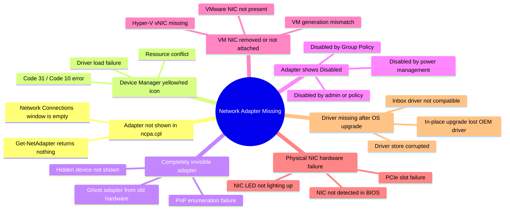
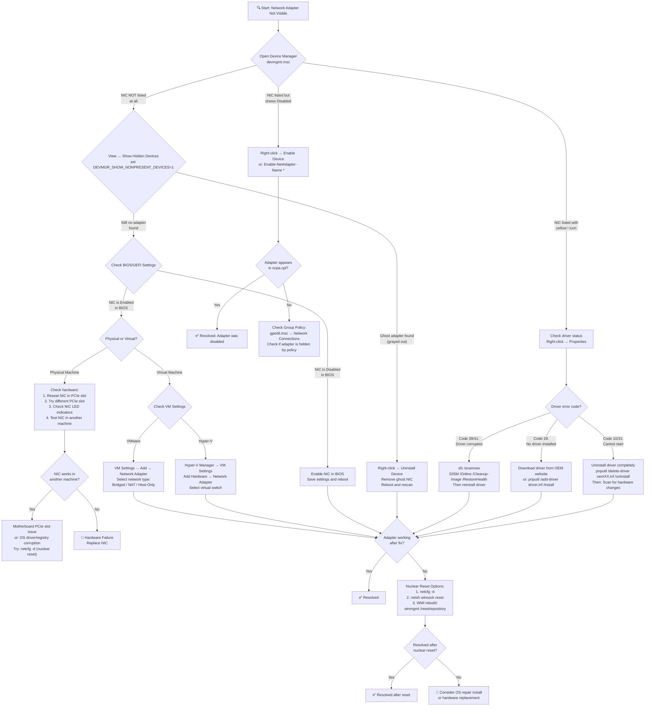

# Scenario Map: TCP/IP — 网卡缺失 (Network Adapter Missing)

**Product/Service:** Windows TCP/IP Stack  
**Scope:** 网络适配器在系统中不可见或无法使用  
**Last Updated:** 2026-03-11

---

## 1. 场景概述

网卡缺失是指 Windows 系统无法识别、加载或显示一个或多个网络适配器，导致网络连接完全不可用。此场景涵盖物理网卡、虚拟网卡（Hyper-V / VMware）、Wi-Fi 适配器等所有类型。

### 子场景分类 (Sub-types)



---

## 2. 典型症状

| # | 症状描述 | 影响范围 |
|---|---------|---------|
| 1 | 打开 `ncpa.cpl`（网络连接）显示 "No network adapters found" 或完全空白 | 所有网络连接不可用 |
| 2 | `Get-NetAdapter` 返回空结果，无任何适配器列出 | PowerShell 网络管理失效 |
| 3 | 设备管理器中网卡条目显示黄色感叹号（!）或红色叉号（×） | 适配器存在但驱动加载失败 |
| 4 | 操作系统升级（如 Win10→Win11）后网卡驱动丢失 | 升级后无法联网 |
| 5 | Hyper-V / VMware 虚拟机中找不到任何网卡 | VM 无网络连接 |
| 6 | 适配器显示 "Network cable unplugged"，但之前一直正常工作 | 间歇性或永久断网 |
| 7 | `ipconfig /all` 无任何适配器信息输出 | 无 IP 地址，DNS 不可用 |
| 8 | 系统托盘网络图标显示红色叉号，提示 "No connections available" | 用户无法连接任何网络 |

---

## 3. 排查流程图



---

## 4. 详细排查步骤与命令

### Step 1: 检查适配器基本状态

```powershell
# 列出所有网络适配器（包括隐藏的）
Get-NetAdapter -IncludeHidden

# 列出所有网络类别的 PnP 设备（包括有问题的设备）
Get-PnpDevice -Class Net

# 使用 pnputil 枚举所有网络类设备
pnputil /enum-devices /class Net

# 列出所有网络适配器的详细信息（WMI）
Get-WmiObject Win32_NetworkAdapter | Format-Table Name, NetConnectionStatus, PNPDeviceID -AutoSize

# 列出所有网络适配器配置信息
Get-WmiObject Win32_NetworkAdapterConfiguration | Where-Object { $_.IPEnabled } | Format-List Description, IPAddress, DHCPEnabled
```

### Step 2: 检查驱动程序状态

```powershell
# 列出所有已安装的网络驱动
dism /online /get-drivers /all | findstr /i "net"

# 检查驱动存储中的网络驱动 INF 文件
pnputil /enum-drivers | findstr /i "net"

# 查看特定设备的驱动详情
Get-PnpDeviceProperty -InstanceId "PCI\VEN_8086*" | Format-Table KeyName, Data -AutoSize

# 检查驱动签名状态
sigverif  # GUI 工具
# 或
driverquery /v | findstr /i "network"
```

### Step 3: 在设备管理器中显示隐藏设备

```cmd
:: 方法 1：设置环境变量后打开设备管理器
set DEVMGR_SHOW_NONPRESENT_DEVICES=1
devmgmt.msc

:: 方法 2：PowerShell 方式
[Environment]::SetEnvironmentVariable("DEVMGR_SHOW_NONPRESENT_DEVICES", "1", "Process")
Start-Process devmgmt.msc
```

### Step 4: 检查核心网络服务

```powershell
# 检查 NDIS（网络驱动接口规范）服务状态
sc query NDIS

# 检查 Network Connections 服务
sc query Netman

# 检查 Network Store Interface 服务
sc query nsi

# 检查 WLAN AutoConfig（Wi-Fi 适配器需要）
sc query WlanSvc

# 检查所有网络相关服务
Get-Service | Where-Object { $_.DisplayName -match "network|ndis|wlan|net" } | Format-Table Name, Status, StartType -AutoSize
```

### Step 5: 检查事件日志

```powershell
# 查看与网卡相关的系统事件日志（最近 24 小时）
Get-WinEvent -FilterHashtable @{
    LogName = 'System'
    ProviderName = 'ndis', 'NetBT', 'Tcpip', 'e1iexpress', 'NETVSC'
    StartTime = (Get-Date).AddHours(-24)
} -ErrorAction SilentlyContinue | Format-Table TimeCreated, Id, LevelDisplayName, Message -Wrap

# 查看 PnP 相关事件（设备安装/移除）
Get-WinEvent -FilterHashtable @{
    LogName = 'System'
    ProviderName = 'Microsoft-Windows-Kernel-PnP'
    StartTime = (Get-Date).AddHours(-24)
} -ErrorAction SilentlyContinue | Select-Object -First 20 | Format-Table TimeCreated, Id, Message -Wrap

# 查看 Device Setup Manager 日志
Get-WinEvent -LogName 'Microsoft-Windows-DeviceSetupManager/Admin' -MaxEvents 20 -ErrorAction SilentlyContinue | Format-Table TimeCreated, Message -Wrap
```

### Step 6: BIOS/固件和硬件检查

```powershell
# 检查系统是否识别到网卡的 PCI 设备
Get-PnpDevice -Class Net -Status OK, Error, Degraded, Unknown | Format-Table FriendlyName, Status, InstanceId -AutoSize

# 检查 PCI 总线上的网络设备
Get-PnpDevice | Where-Object { $_.InstanceId -match "PCI\\VEN" -and $_.Class -eq "Net" }

# 查看网卡硬件 ID（即使驱动未加载也可见）
pnputil /enum-devices /class Net /drivers
```

### Step 7: 虚拟机专用检查

```powershell
# Hyper-V: 检查 VM 的网络适配器配置
Get-VMNetworkAdapter -VMName "YourVMName"

# Hyper-V: 列出所有虚拟交换机
Get-VMSwitch

# Hyper-V: 为 VM 添加网络适配器
Add-VMNetworkAdapter -VMName "YourVMName" -SwitchName "YourSwitch"

# VMware: 检查 vmxnet3 驱动是否安装（VM 内执行）
Get-PnpDevice | Where-Object { $_.FriendlyName -match "vmxnet|vmware" }

# 检查 Hyper-V Integration Services 版本
Get-VMIntegrationService -VMName "YourVMName" | Format-Table Name, Enabled, PrimaryStatusDescription
```

---

## 5. 各根因对应解决方案

### 根因 1: 驱动程序缺失

**原因：** OEM 驱动未安装，或操作系统升级后 inbox 驱动不支持该网卡。

```powershell
# 从 INF 文件安装驱动
pnputil /add-driver "C:\Drivers\NetAdapter.inf" /install

# 使用 Windows Update 搜索驱动
# 设备管理器 → 右键未知设备 → 更新驱动程序 → 自动搜索

# 从制造商网站下载驱动后安装
# Intel: https://www.intel.com/content/www/us/en/download-center
# Realtek: https://www.realtek.com/en/downloads
# Broadcom: 通过 OEM（Dell/HP/Lenovo）支持页面下载
```

### 根因 2: 适配器被禁用

**原因：** 管理员手动禁用、组策略禁用、或电源管理自动关闭。

```powershell
# 启用所有被禁用的网络适配器
Get-NetAdapter -IncludeHidden | Where-Object { $_.Status -eq 'Disabled' } | Enable-NetAdapter

# 检查并禁用电源管理关闭网卡的设置
$adapter = Get-NetAdapter | Select-Object -First 1
$deviceId = (Get-PnpDevice -FriendlyName $adapter.InterfaceDescription).InstanceId
# 然后在设备管理器 → 适配器属性 → 电源管理 → 取消勾选"允许计算机关闭此设备以节省电源"

# 通过注册表禁用电源管理
$regPath = "HKLM:\SYSTEM\CurrentControlSet\Control\Class\{4d36e972-e325-11ce-bfc1-08002be10318}"
Get-ChildItem $regPath | ForEach-Object {
    $friendlyName = (Get-ItemProperty $_.PSPath).DriverDesc
    if ($friendlyName) {
        Set-ItemProperty $_.PSPath -Name "PnPCapabilities" -Value 24 -Type DWord
        Write-Host "Disabled power management for: $friendlyName"
    }
}
```

### 根因 3: 幽灵（Ghost）适配器残留

**原因：** 旧硬件或旧虚拟适配器的注册信息残留在系统中，可能占用 IP 配置或引起冲突。

```cmd
:: 显示所有设备（包括非当前连接的）
set DEVMGR_SHOW_NONPRESENT_DEVICES=1
devmgmt.msc
:: 手动在设备管理器中右键灰色的网卡条目 → 卸载设备

:: 使用 pnputil 清理旧驱动
pnputil /enum-devices /class Net /disconnected
pnputil /remove-device "设备实例ID"
```

### 根因 4: 物理硬件故障

**原因：** 网卡硬件损坏、PCIe 插槽问题、或线缆/端口故障。

**排查步骤：**
1. 检查网卡 LED 指示灯是否亮起
2. 将网卡移动到另一个 PCIe 插槽
3. 将网卡放到另一台机器中测试
4. 检查 BIOS/UEFI 中是否能看到该设备
5. 对于板载网卡，检查 BIOS 中 "Onboard LAN" 是否为 Enabled

### 根因 5: 虚拟机网卡未连接

**原因：** VM 配置中未添加网络适配器，或虚拟交换机被删除。

```powershell
# Hyper-V: 添加网络适配器
Add-VMNetworkAdapter -VMName "VM01" -SwitchName "Default Switch"

# Hyper-V: 如果虚拟交换机不存在，先创建
New-VMSwitch -Name "External-Switch" -NetAdapterName "Ethernet" -AllowManagementOS $true

# VMware: 通过 VM Settings GUI 添加 Network Adapter
# 或编辑 .vmx 文件添加:
# ethernet0.present = "TRUE"
# ethernet0.connectionType = "nat"
# ethernet0.virtualDev = "vmxnet3"
```

### 根因 6: OS 升级后驱动丢失

**原因：** In-place upgrade 未迁移 OEM 网卡驱动，或新 OS 版本不支持旧驱动。

```powershell
# 检查旧驱动是否还在驱动存储中
pnputil /enum-drivers | findstr /i "net"

# 检查 Windows 升级日志中的驱动迁移信息
Get-Content "C:\Windows\Panther\setupact.log" | Select-String -Pattern "driver" -Context 2,2 | Select-Object -First 20

# 检查兼容性报告
Get-Content "$env:SystemDrive\`$WINDOWS.~BT\Sources\Panther\compat*.xml" -ErrorAction SilentlyContinue

# 从旧驱动存储恢复（如果 Windows.old 存在）
# 旧驱动位置: C:\Windows.old\Windows\System32\DriverStore\FileRepository\
```

### 根因 7: WMI 仓库损坏

**原因：** WMI 仓库损坏导致 Windows 无法正确枚举网络设备。

```cmd
:: 验证 WMI 仓库一致性
winmgmt /verifyrepository

:: 尝试修复 WMI 仓库
winmgmt /salvagerepository

:: 如果修复失败，重置 WMI 仓库（警告：会丢失所有自定义 WMI 数据）
winmgmt /resetrepository
```

### 根因 8: 最终手段 — 网络栈完全重置

**原因：** 当所有其他方法均失败时，使用 `netcfg -d` 完全重置网络配置。

```cmd
:: ⚠️ 警告：此命令将移除所有网络适配器和协议绑定，需要重新配置所有网络设置！
netcfg -d

:: 配合以下命令进行完全网络重置
netsh winsock reset
netsh int ip reset
ipconfig /flushdns

:: 重启计算机
shutdown /r /t 0
```

---

## 6. 实用 Tips

> **Tip 1:** 在设备管理器中显示隐藏设备，旧版 Windows 需要先设置环境变量 `set DEVMGR_SHOW_NONPRESENT_DEVICES=1`，Windows 10 1809+ 可直接在菜单中点击 **View → Show hidden devices**。

> **Tip 2:** 更新驱动后，建议先 **Disable** 再 **Enable** 适配器（而不仅仅是重新安装驱动），这可以确保新驱动被完整加载。

> **Tip 3:** 幽灵网卡（Ghost NIC）可能占用 IP 配置。如果新网卡无法使用旧网卡的 IP 地址，先删除幽灵网卡再配置 IP。

> **Tip 4:** 如果网卡间歇性消失，检查电源管理设置：**设备管理器 → 适配器属性 → 电源管理 → 取消勾选 "Allow the computer to turn off this device to save power"**。

> **Tip 5:** BIOS/UEFI 中禁用网卡对 Windows 完全不可见，`Get-PnpDevice` 也不会列出。必须进入 BIOS 检查 "Onboard LAN" 或 "NIC Configuration" 设置。

> **Tip 6:** NIC Teaming (LBFO) 环境中，如果从 Team 中移除物理网卡，Team 适配器本身可能消失。先检查 Team 配置：`Get-NetLbfoTeam` 和 `Get-NetLbfoTeamMember`。

> **Tip 7:** 笔记本 Wi-Fi 适配器可能被 **飞行模式（Airplane Mode）** 或 **物理无线开关** 隐藏。检查：`Get-NetAdapter -Name "Wi-Fi*" -IncludeHidden` 以及飞行模式开关状态。

> **Tip 8:** `netcfg -d` 是网络栈的"核武器级"重置，会移除所有第三方网络协议、过滤驱动和适配器配置。仅在所有其他方法失败后使用，且执行前务必记录当前网络配置。

---

## 7. 参考文档

暂无可验证的参考文档。

---

---

# Scenario Map: TCP/IP — Network Adapter Missing

**Product/Service:** Windows TCP/IP Stack  
**Scope:** Network adapter is not visible or unusable in the system  
**Last Updated:** 2026-03-11

---

## 1. Scenario Overview

Network Adapter Missing refers to a situation where Windows cannot recognize, load, or display one or more network adapters, rendering network connectivity completely unavailable. This scenario covers all adapter types including physical NICs, virtual NICs (Hyper-V / VMware), and Wi-Fi adapters.

### Sub-type Classification


---

## 2. Typical Symptoms

| # | Symptom | Impact |
|---|---------|--------|
| 1 | Opening `ncpa.cpl` (Network Connections) shows "No network adapters found" or completely blank | All network connections unavailable |
| 2 | `Get-NetAdapter` returns empty result with no adapters listed | PowerShell network management non-functional |
| 3 | Device Manager shows network adapter entry with yellow exclamation (!) or red cross (×) | Adapter exists but driver failed to load |
| 4 | After OS upgrade (e.g., Win10→Win11), NIC driver is missing | No network after upgrade |
| 5 | Hyper-V / VMware VM has no NIC visible | VM has no network connectivity |
| 6 | Adapter shows "Network cable unplugged" but was previously working fine | Intermittent or permanent disconnection |
| 7 | `ipconfig /all` produces no adapter information output | No IP address, DNS unavailable |
| 8 | System tray network icon shows red cross with "No connections available" | User cannot connect to any network |

---

## 3. Troubleshooting Flowchart


---

## 4. Detailed Troubleshooting Steps and Commands

### Step 1: Check Basic Adapter Status

```powershell
# List all network adapters (including hidden ones)
Get-NetAdapter -IncludeHidden

# List all PnP devices in the Net class (including problematic devices)
Get-PnpDevice -Class Net

# Use pnputil to enumerate all network class devices
pnputil /enum-devices /class Net

# List all network adapters with details (WMI)
Get-WmiObject Win32_NetworkAdapter | Format-Table Name, NetConnectionStatus, PNPDeviceID -AutoSize

# List all network adapter configurations
Get-WmiObject Win32_NetworkAdapterConfiguration | Where-Object { $_.IPEnabled } | Format-List Description, IPAddress, DHCPEnabled
```

### Step 2: Check Driver Status

```powershell
# List all installed network drivers
dism /online /get-drivers /all | findstr /i "net"

# Check network driver INF files in the driver store
pnputil /enum-drivers | findstr /i "net"

# View driver details for a specific device
Get-PnpDeviceProperty -InstanceId "PCI\VEN_8086*" | Format-Table KeyName, Data -AutoSize

# Check driver signing status
sigverif  # GUI tool
# or
driverquery /v | findstr /i "network"
```

### Step 3: Show Hidden Devices in Device Manager

```cmd
:: Method 1: Set environment variable then open Device Manager
set DEVMGR_SHOW_NONPRESENT_DEVICES=1
devmgmt.msc

:: Method 2: PowerShell approach
[Environment]::SetEnvironmentVariable("DEVMGR_SHOW_NONPRESENT_DEVICES", "1", "Process")
Start-Process devmgmt.msc
```

### Step 4: Check Core Network Services

```powershell
# Check NDIS (Network Driver Interface Specification) service status
sc query NDIS

# Check Network Connections service
sc query Netman

# Check Network Store Interface service
sc query nsi

# Check WLAN AutoConfig (required for Wi-Fi adapters)
sc query WlanSvc

# Check all network-related services
Get-Service | Where-Object { $_.DisplayName -match "network|ndis|wlan|net" } | Format-Table Name, Status, StartType -AutoSize
```

### Step 5: Check Event Logs

```powershell
# View NIC-related system event logs (last 24 hours)
Get-WinEvent -FilterHashtable @{
    LogName = 'System'
    ProviderName = 'ndis', 'NetBT', 'Tcpip', 'e1iexpress', 'NETVSC'
    StartTime = (Get-Date).AddHours(-24)
} -ErrorAction SilentlyContinue | Format-Table TimeCreated, Id, LevelDisplayName, Message -Wrap

# View PnP-related events (device installation/removal)
Get-WinEvent -FilterHashtable @{
    LogName = 'System'
    ProviderName = 'Microsoft-Windows-Kernel-PnP'
    StartTime = (Get-Date).AddHours(-24)
} -ErrorAction SilentlyContinue | Select-Object -First 20 | Format-Table TimeCreated, Id, Message -Wrap

# View Device Setup Manager log
Get-WinEvent -LogName 'Microsoft-Windows-DeviceSetupManager/Admin' -MaxEvents 20 -ErrorAction SilentlyContinue | Format-Table TimeCreated, Message -Wrap
```

### Step 6: BIOS/Firmware and Hardware Checks

```powershell
# Check if the system recognizes the NIC PCI device
Get-PnpDevice -Class Net -Status OK, Error, Degraded, Unknown | Format-Table FriendlyName, Status, InstanceId -AutoSize

# Check for network devices on the PCI bus
Get-PnpDevice | Where-Object { $_.InstanceId -match "PCI\\VEN" -and $_.Class -eq "Net" }

# View NIC hardware IDs (visible even if driver is not loaded)
pnputil /enum-devices /class Net /drivers
```

### Step 7: Virtual Machine Specific Checks

```powershell
# Hyper-V: Check VM network adapter configuration
Get-VMNetworkAdapter -VMName "YourVMName"

# Hyper-V: List all virtual switches
Get-VMSwitch

# Hyper-V: Add a network adapter to a VM
Add-VMNetworkAdapter -VMName "YourVMName" -SwitchName "YourSwitch"

# VMware: Check if vmxnet3 driver is installed (run inside VM)
Get-PnpDevice | Where-Object { $_.FriendlyName -match "vmxnet|vmware" }

# Check Hyper-V Integration Services version
Get-VMIntegrationService -VMName "YourVMName" | Format-Table Name, Enabled, PrimaryStatusDescription
```

---

## 5. Solutions by Root Cause

### Root Cause 1: Driver Missing

**Cause:** OEM driver not installed, or inbox driver does not support the NIC after an OS upgrade.

```powershell
# Install driver from INF file
pnputil /add-driver "C:\Drivers\NetAdapter.inf" /install

# Use Windows Update to search for driver
# Device Manager → Right-click unknown device → Update driver → Search automatically

# Download driver from manufacturer website and install
# Intel: https://www.intel.com/content/www/us/en/download-center
# Realtek: https://www.realtek.com/en/downloads
# Broadcom: Via OEM (Dell/HP/Lenovo) support page
```

### Root Cause 2: Adapter Disabled

**Cause:** Manually disabled by admin, disabled by Group Policy, or turned off by power management.

```powershell
# Enable all disabled network adapters
Get-NetAdapter -IncludeHidden | Where-Object { $_.Status -eq 'Disabled' } | Enable-NetAdapter

# Check and disable power management setting that turns off NIC
$adapter = Get-NetAdapter | Select-Object -First 1
$deviceId = (Get-PnpDevice -FriendlyName $adapter.InterfaceDescription).InstanceId
# Then in Device Manager → Adapter Properties → Power Management → Uncheck "Allow the computer to turn off this device to save power"

# Disable power management via registry
$regPath = "HKLM:\SYSTEM\CurrentControlSet\Control\Class\{4d36e972-e325-11ce-bfc1-08002be10318}"
Get-ChildItem $regPath | ForEach-Object {
    $friendlyName = (Get-ItemProperty $_.PSPath).DriverDesc
    if ($friendlyName) {
        Set-ItemProperty $_.PSPath -Name "PnPCapabilities" -Value 24 -Type DWord
        Write-Host "Disabled power management for: $friendlyName"
    }
}
```

### Root Cause 3: Ghost Adapter Residue

**Cause:** Registry entries from old hardware or old virtual adapters remain in the system, potentially occupying IP configurations or causing conflicts.

```cmd
:: Show all devices (including non-present ones)
set DEVMGR_SHOW_NONPRESENT_DEVICES=1
devmgmt.msc
:: Manually right-click grayed-out NIC entries in Device Manager → Uninstall device

:: Use pnputil to clean up old drivers
pnputil /enum-devices /class Net /disconnected
pnputil /remove-device "DeviceInstanceID"
```

### Root Cause 4: Physical Hardware Failure

**Cause:** NIC hardware is damaged, PCIe slot issue, or cable/port failure.

**Troubleshooting Steps:**
1. Check if NIC LED indicators are lit
2. Move the NIC to a different PCIe slot
3. Test the NIC in another machine
4. Check if the device is visible in BIOS/UEFI
5. For onboard NICs, verify "Onboard LAN" is set to Enabled in BIOS

### Root Cause 5: VM NIC Not Attached

**Cause:** Network adapter not added in VM configuration, or virtual switch has been deleted.

```powershell
# Hyper-V: Add a network adapter
Add-VMNetworkAdapter -VMName "VM01" -SwitchName "Default Switch"

# Hyper-V: If virtual switch doesn't exist, create one first
New-VMSwitch -Name "External-Switch" -NetAdapterName "Ethernet" -AllowManagementOS $true

# VMware: Add Network Adapter via VM Settings GUI
# Or edit the .vmx file to add:
# ethernet0.present = "TRUE"
# ethernet0.connectionType = "nat"
# ethernet0.virtualDev = "vmxnet3"
```

### Root Cause 6: Driver Lost After OS Upgrade

**Cause:** In-place upgrade did not migrate the OEM NIC driver, or the new OS version does not support the old driver.

```powershell
# Check if old drivers are still in the driver store
pnputil /enum-drivers | findstr /i "net"

# Check Windows upgrade logs for driver migration information
Get-Content "C:\Windows\Panther\setupact.log" | Select-String -Pattern "driver" -Context 2,2 | Select-Object -First 20

# Check compatibility report
Get-Content "$env:SystemDrive\`$WINDOWS.~BT\Sources\Panther\compat*.xml" -ErrorAction SilentlyContinue

# Recover from old driver store (if Windows.old exists)
# Old driver location: C:\Windows.old\Windows\System32\DriverStore\FileRepository\
```

### Root Cause 7: WMI Repository Corruption

**Cause:** Corrupted WMI repository prevents Windows from properly enumerating network devices.

```cmd
:: Verify WMI repository consistency
winmgmt /verifyrepository

:: Attempt to repair WMI repository
winmgmt /salvagerepository

:: If repair fails, reset WMI repository (WARNING: loses all custom WMI data)
winmgmt /resetrepository
```

### Root Cause 8: Last Resort — Full Network Stack Reset

**Cause:** When all other methods have failed, use `netcfg -d` to completely reset network configuration.

```cmd
:: ⚠️ WARNING: This command removes ALL network adapters and protocol bindings. All network settings must be reconfigured!
netcfg -d

:: Combine with the following commands for a complete network reset
netsh winsock reset
netsh int ip reset
ipconfig /flushdns

:: Reboot the computer
shutdown /r /t 0
```

---

## 6. Practical Tips

> **Tip 1:** To show hidden devices in Device Manager, older Windows versions require setting the environment variable `set DEVMGR_SHOW_NONPRESENT_DEVICES=1` first. Windows 10 1809+ supports clicking **View → Show hidden devices** directly from the menu.

> **Tip 2:** After updating a driver, it is recommended to **Disable** then **Enable** the adapter (not just reinstall the driver). This ensures the new driver is fully loaded.

> **Tip 3:** Ghost NICs may occupy IP configurations. If a new NIC cannot use the old NIC's IP address, remove the ghost NIC first before configuring the IP.

> **Tip 4:** If a NIC disappears intermittently, check power management settings: **Device Manager → Adapter Properties → Power Management → Uncheck "Allow the computer to turn off this device to save power"**.

> **Tip 5:** A NIC disabled in BIOS/UEFI is completely invisible to Windows — `Get-PnpDevice` will not list it. You must enter BIOS to check the "Onboard LAN" or "NIC Configuration" setting.

> **Tip 6:** In NIC Teaming (LBFO) environments, if a physical NIC is removed from the team, the team adapter itself may disappear. Check team configuration first: `Get-NetLbfoTeam` and `Get-NetLbfoTeamMember`.

> **Tip 7:** Laptop Wi-Fi adapters may be hidden by **Airplane Mode** or a **physical wireless switch**. Check with: `Get-NetAdapter -Name "Wi-Fi*" -IncludeHidden` and verify the Airplane Mode toggle status.

> **Tip 8:** `netcfg -d` is the "nuclear option" for the network stack — it removes all third-party network protocols, filter drivers, and adapter configurations. Use only after all other methods have failed, and always document the current network configuration before executing.

---

## 7. References

No verified reference documents available at this time.
