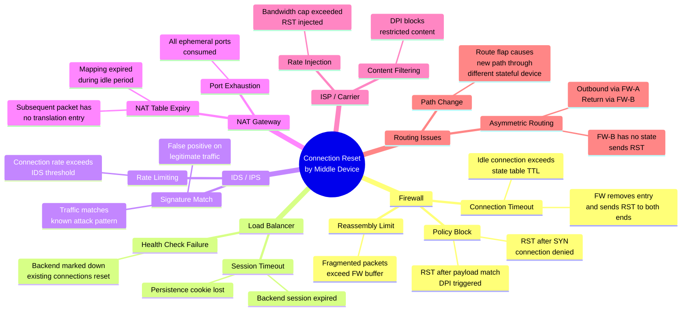
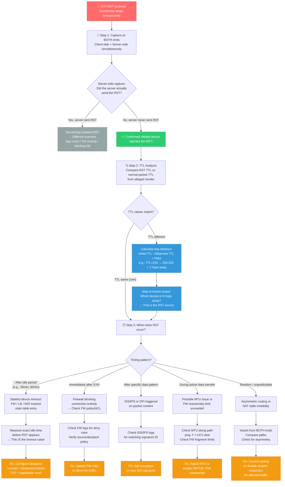
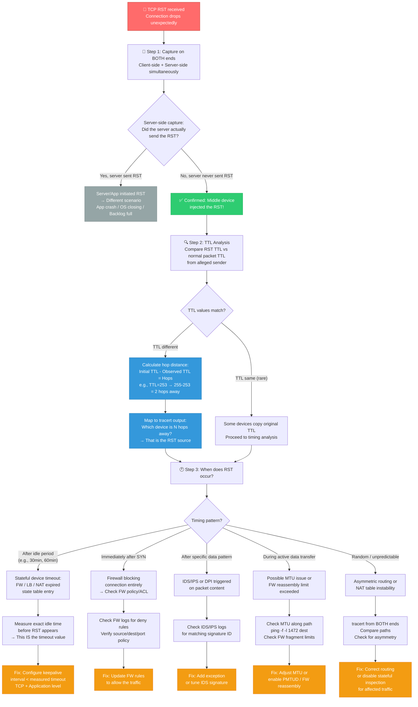

# Scenario Map: TCP/IP — 中间设备重置连接 (Connection Reset by Middle Device)

**Product/Service:** Windows TCP/IP Stack / Network Path  
**Scope:** TCP 连接被路径上的中间设备发送 RST 包强制断开  
**Last Updated:** 2026-03-11

---

## 核心概念 (Key Concept)

当中间设备（防火墙、负载均衡器、IDS/IPS、NAT 网关等）发送 TCP RST 时，它会 **伪造** RST 数据包，使其看起来像是从对端发送的。识别"中间设备伪造的 RST"与"对端真实发送的 RST"的关键方法：

1. **TTL 分析**：将 RST 包的 TTL 与该对端正常数据包的 TTL 进行比较——如果 TTL 值不同，RST 包来自不同的设备
2. **时间模式**：RST 出现在特定模式之后（例如，精确的空闲超时时间后，或特定负载匹配后）
3. **双端同时抓包**：一端看到了 RST，但另一端根本没有发送过 RST——这就是确凿的证据

> ⚠️ **这是网络排查中最常被误诊的场景之一。** 应用程序报错"Connection reset by peer"，工程师往往直奔服务端排查，却忽略了 RST 可能根本不是服务端发出的。

---

## 1. 场景子类型 (Sub-types)



---

## 2. 典型症状

| 症状 | 说明 | 排查线索 |
|------|------|----------|
| 应用报错 "Connection reset by peer" | 最常见的表现形式，应用层收到 RST 后的标准错误信息 | 需要抓包确认 RST 是否真的来自 peer |
| Wireshark 显示空闲一段时间后出现 RST | 典型的状态防火墙/NAT 超时表现 | 测量空闲时间 → 即为中间设备的超时值 |
| 长连接周期性断开 | SSH、数据库连接、RDP 等在特定空闲时间后断开 | 断开间隔是否固定？固定 = 超时值 |
| 初始连接正常，大量传输时断开 | 可能是防火墙重组限制或 MTU/分片问题 | 检查是否与传输数据量相关 |
| RST 包的 TTL 与正常包不同 | **最直接的中间设备 RST 注入证据** | 对比同一源 IP 的 RST TTL vs ACK TTL |
| 重连后工作一段时间又断开（循环模式） | 中间设备新建状态 → 超时 → RST → 重连 → 循环 | 确认循环周期 = 超时值 |
| LAN 正常但 WAN 失败 | WAN 路径上有额外的状态设备（防火墙、NAT） | 对比 LAN/WAN 路径差异 |
| 单方向连接正常，反方向失败 | 可能是非对称路由，回程走了不同的防火墙 | tracert 两个方向对比路径 |

---

## 3. 排查流程图



---

## 4. 详细排查步骤与命令

### Step 1: 双端同时抓包（最关键的步骤）

> ⚠️ **必须在客户端和服务端同时抓包。** 仅在一端抓包无法区分中间设备 RST 和对端 RST。

**客户端抓包：**

```powershell
# 方法 1：netsh trace（Windows 原生，无需安装工具）
netsh trace start capture=yes tracefile=C:\temp\client_capture.etl maxsize=512

# 方法 2：pktmon（Windows 10 2004+ / Server 2022+）
pktmon start --capture --file-name C:\temp\client_pktmon.etl

# 复现问题后停止：
netsh trace stop
# 或
pktmon stop
```

**服务端抓包：**

```powershell
# 同样使用 netsh trace 或 pktmon
netsh trace start capture=yes tracefile=C:\temp\server_capture.etl maxsize=512

# Linux 服务端使用 tcpdump：
# tcpdump -i eth0 -w /tmp/server_capture.pcap host <client_ip> and port <port>
```

### Step 2: 定位所有 RST 包

```
# Wireshark 过滤器：
tcp.flags.reset == 1

# 只看特定连接的 RST：
tcp.flags.reset == 1 && ip.addr == <server_ip> && tcp.port == <port>

# 显示 RST 包的 TTL 值（添加列）：
# 右键 → Preferences → Columns → 添加 "ip.ttl" 列
```

### Step 3: TTL 对比分析（核心技术）

```
# 在 Wireshark 中对比：

# 1. 找到来自同一源 IP 的正常 ACK 包的 TTL：
ip.src == <server_ip> && tcp.flags.ack == 1 && tcp.flags.reset == 0
# 记录 TTL 值，例如：TTL = 118

# 2. 找到来自同一源 IP 的 RST 包的 TTL：
ip.src == <server_ip> && tcp.flags.reset == 1
# 记录 TTL 值，例如：TTL = 253

# 3. 分析：
# 正常 ACK TTL=118 → 初始 TTL=128（Windows），经过 128-118=10 跳
# RST TTL=253     → 初始 TTL=255（网络设备），经过 255-253=2 跳
# 结论：RST 不是来自服务端，而是来自路径上距客户端 2 跳的设备！

# 4. 用 tracert 定位该设备：
tracert <server_ip>
# 第 2 跳设备就是发送 RST 的中间设备
```

**常见初始 TTL 值参考：**

| 操作系统/设备 | 默认初始 TTL |
|--------------|-------------|
| Windows | 128 |
| Linux / macOS | 64 |
| 网络设备（路由器/防火墙） | 255 |
| 某些 Unix 系统 | 255 |

### Step 4: 检查 TCP Keepalive 配置

```powershell
# 查看当前 TCP 全局设置
netsh int tcp show global

# 查看 KeepAlive 注册表值
reg query "HKLM\SYSTEM\CurrentControlSet\Services\Tcpip\Parameters" /v KeepAliveTime
reg query "HKLM\SYSTEM\CurrentControlSet\Services\Tcpip\Parameters" /v KeepAliveInterval
reg query "HKLM\SYSTEM\CurrentControlSet\Services\Tcpip\Parameters" /v TcpMaxDataRetransmissions

# 默认值（如果注册表项不存在）：
# KeepAliveTime     = 7200000 ms (2 小时)
# KeepAliveInterval = 1000 ms (1 秒)
# KeepAlive 探测次数 = 10 次

# ⚠️ 如果防火墙超时 < 2 小时（常见为 30-60 分钟），空闲连接必然被重置！
```

### Step 5: 网络路径分析

```powershell
# 查看网络路径中的每一跳
tracert <destination_ip>

# 查看当前连接状态
netstat -ano | findstr <port>

# 快速连接测试
Test-NetConnection -ComputerName <destination> -Port <port>

# 持续 ping 监控连接稳定性
ping -t <destination_ip>

# 查看路由表
route print

# MTU 探测（发现路径 MTU）
ping -f -l 1472 <destination_ip>
# 如果 "Packet needs to be fragmented"，逐步减小 -l 值
```

### Step 6: 测量防火墙/中间设备超时值

```powershell
# 方法：建立 TCP 连接后不发送数据，观察多久后收到 RST
# 使用 PowerShell 建立 TCP 连接并保持空闲：
$client = New-Object System.Net.Sockets.TcpClient
$client.Connect("<server_ip>", <port>)
# 开始计时，等待连接断开
# 当连接断开时，空闲时长 = 中间设备超时值

# 同时运行 Wireshark 抓包，精确记录 RST 到达的时间
```

---

## 5. 解决方案

### 5.1 防火墙空闲超时 → 调整 TCP KeepAlive

```powershell
# 方案 A：减小 TCP KeepAliveTime（全局生效）
# 将 KeepAlive 间隔从默认 2 小时改为 5 分钟
Set-ItemProperty -Path "HKLM:\SYSTEM\CurrentControlSet\Services\Tcpip\Parameters" `
    -Name "KeepAliveTime" -Value 300000 -Type DWord

# 需要重启系统生效

# 方案 B：应用级别 KeepAlive（推荐，粒度更细）
# 不同应用有自己的 keepalive 设置（见下文各应用配置）
```

### 5.2 各应用 KeepAlive 配置

**SQL Server 连接：**

```
# SQL Server TCP KeepAlive（注册表）
# HKLM\SYSTEM\CurrentControlSet\Services\Tcpip\Parameters
# KeepAliveTime = 30000 (30 秒)

# SQL 应用层 KeepAlive（连接字符串）：
# 在连接字符串中添加：
# Connection Timeout=30; Keep Alive=30;

# SSMS 中：Tools → Options → Database Engine → Connection Timeout
```

**RDP 远程桌面：**

```powershell
# RDP KeepAlive 间隔（组策略或注册表）
Set-ItemProperty -Path "HKLM:\SOFTWARE\Policies\Microsoft\Windows NT\Terminal Services" `
    -Name "KeepAliveInterval" -Value 1 -Type DWord
# 值 = 1 表示每 1 分钟发送 keepalive
# 值 = 0 表示禁用 keepalive

# 或通过组策略：
# Computer Configuration → Administrative Templates → Windows Components
# → Remote Desktop Services → Remote Desktop Session Host → Connections
# → "Configure keep-alive connection interval"
```

**SSH 连接：**

```
# 客户端 ssh_config（~/.ssh/config）：
Host *
    ServerAliveInterval 60
    ServerAliveCountMax 3
# 每 60 秒发送一次 keepalive，3 次失败后断开

# 服务端 sshd_config（/etc/ssh/sshd_config）：
ClientAliveInterval 60
ClientAliveCountMax 3
```

**SMB/CIFS 文件共享：**

```powershell
# SMB 会话超时
Set-SmbServerConfiguration -AutoDisconnectTimeout 0
# 值 = 0 表示禁用自动断开
# 默认值 = 15 分钟
```

### 5.3 IDS/IPS 误报 → 添加例外

```
# 1. 查看 IDS/IPS 日志，找到匹配的签名 ID
# 2. 在 IDS/IPS 管理控制台中为该签名添加例外：
#    - 按源/目标 IP 例外
#    - 按端口例外
#    - 或调整签名阈值
# 3. 记录例外原因和审批信息
```

### 5.4 负载均衡器会话超时 → 增加超时或启用 keepalive

```
# 以 Azure Load Balancer 为例：
# 默认 TCP idle timeout = 4 分钟
# 最大可调整到 30 分钟
# 或启用 "TCP Reset on Idle" 发送 RST（至少让客户端知道连接已断开）
# 最佳方案：启用 TCP keepalive，间隔 < 4 分钟

# 以 F5 BIG-IP 为例：
# tmsh modify /ltm profile tcp my_tcp_profile idle-timeout 3600
# 将空闲超时从默认 300 秒增加到 3600 秒
```

### 5.5 非对称路由 → 修复路由或调整防火墙

```powershell
# 诊断非对称路由：
# 从客户端 tracert 到服务端
tracert <server_ip>

# 从服务端 tracert 到客户端
# tracert <client_ip>  (在服务端执行)

# 如果两个方向经过不同的防火墙 → 非对称路由
# 修复方案：
# 1. 调整路由使双向流量经过同一防火墙
# 2. 在两个防火墙之间同步状态表
# 3. 对受影响的流量禁用状态检测
```

### 5.6 NAT 表过期 → keepalive 或增加 NAT 超时

```
# 与防火墙超时类似：
# 1. 启用 TCP keepalive，间隔 < NAT 超时值
# 2. 在 NAT 设备上增加映射保持时间
# 3. 考虑使用静态 NAT 映射（不会过期）
```

### 5.7 ISP RST 注入 → VPN 绕过

```
# 如果 ISP 进行 RST 注入（内容过滤/限速）：
# 1. 使用 VPN 隧道绕过 ISP 深度包检测
# 2. 使用 TLS/HTTPS 加密流量（ISP 无法匹配内容）
# 3. 联系 ISP 确认是否有流量管理策略
```

---

## 6. 经验与技巧 (Tips)

> 💡 **TTL 分析是识别中间设备 RST 注入最强大的技术。** 在你的 Wireshark 中添加 TTL 列作为标准配置。

- **KeepAliveTime 默认 2 小时 vs 防火墙超时通常 30-60 分钟**：如果不修改 KeepAlive，空闲连接几乎必然被中间防火墙重置。这是最常见的根因
- **SQL 连接特殊注意**：SQL 的 keepalive 与 TCP keepalive 是独立的——需要同时配置两者
- **RDP KeepAlive**：通过注册表 `HKLM\SOFTWARE\Policies\Microsoft\Windows NT\Terminal Services\KeepAliveInterval` 配置
- **SSH KeepAlive**：在 `ssh_config` 中配置 `ServerAliveInterval`
- **防火墙日志关联**：许多防火墙在发送 RST 时会记录 "connection expired" 或 "session timed out"——检查防火墙日志并与抓包时间进行关联
- **非对称路由很隐蔽**：短连接完全正常（在超时前已完成），只有长连接才会失败。这使得问题看起来像是应用问题而不是网络问题
- **如何精确测量防火墙超时**：建立 TCP 连接 → 保持完全空闲 → 观察 RST 到达时间 → 该时间即为防火墙超时值。多次测试确认一致性
- **Azure/云环境特殊超时**：Azure Load Balancer 默认 4 分钟空闲超时，AWS ELB 默认 60 秒——云环境的超时值通常比本地防火墙更短
- **双端抓包对比口诀**：一端看到 RST，另一端没发过 → 中间设备；两端都有 RST → 真实端点发送
- **某些高级防火墙会复制原始 TTL**，使 TTL 分析失效——此时只能依赖双端抓包对比

---

## 7. 参考文档

暂无可验证的参考文档

---

---

---

# Scenario Map: TCP/IP — Connection Reset by Middle Device

**Product/Service:** Windows TCP/IP Stack / Network Path  
**Scope:** TCP connections forcibly terminated by RST packets injected by intermediate network devices  
**Last Updated:** 2026-03-11

---

## Key Concept

When a middle device (firewall, load balancer, IDS/IPS, NAT gateway, etc.) sends a TCP RST, it **forges** the RST packet to appear as if it came from the remote endpoint. The key methods to distinguish a "fake RST from a middle device" versus a "real RST from the endpoint" are:

1. **TTL Analysis**: Compare the TTL of the RST packet with the TTL of normal packets from that endpoint — if different, the RST came from a different device
2. **Timing Pattern**: RST appears after a specific pattern (e.g., precise idle timeout period, or after specific payload match)
3. **Dual-sided Capture**: One end sees the RST, but the other end never sent it — this is conclusive proof

> ⚠️ **This is one of the most commonly misdiagnosed scenarios in network troubleshooting.** The application reports "Connection reset by peer," and engineers rush to troubleshoot the server, overlooking the fact that the RST may not have originated from the server at all.

---

## 1. Scenario Sub-types


---

## 2. Typical Symptoms

| Symptom | Description | Troubleshooting Clue |
|---------|-------------|---------------------|
| "Connection reset by peer" error | Most common manifestation; standard error when application receives RST | Packet capture needed to verify if RST truly came from peer |
| Wireshark shows RST after idle period | Classic stateful firewall/NAT timeout behavior | Measure idle time before RST → that IS the device timeout value |
| Long-lived connections drop periodically | SSH, database, RDP connections drop after specific idle duration | Is the drop interval consistent? Consistent = timeout value |
| Connection works initially, drops during large transfer | Possible firewall reassembly limit or MTU/fragmentation issue | Check if correlated with data volume |
| RST packet has different TTL than normal packets | **Most direct evidence of middle-device RST injection** | Compare RST TTL vs normal ACK TTL from same source IP |
| Reconnect works, then drops again (cyclic pattern) | Middle device creates new state → timeout → RST → reconnect → repeat | Confirm cycle period = timeout value |
| Works on LAN but fails over WAN | WAN path has additional stateful devices (firewalls, NAT) | Compare LAN vs WAN path differences |
| One direction works, reverse direction fails | Possible asymmetric routing; return path through different firewall | Compare tracert from both directions |

---

## 3. Troubleshooting Flowchart



---

## 4. Detailed Troubleshooting Steps and Commands

### Step 1: Simultaneous Dual-Sided Packet Capture (CRITICAL)

> ⚠️ **You MUST capture on both client and server simultaneously.** Capturing on only one side cannot distinguish a middle-device RST from a genuine endpoint RST.

**Client-side capture:**

```powershell
# Method 1: netsh trace (Windows native, no tool installation required)
netsh trace start capture=yes tracefile=C:\temp\client_capture.etl maxsize=512

# Method 2: pktmon (Windows 10 2004+ / Server 2022+)
pktmon start --capture --file-name C:\temp\client_pktmon.etl

# Stop after reproducing the issue:
netsh trace stop
# or
pktmon stop
```

**Server-side capture:**

```powershell
# Windows server: same netsh trace or pktmon approach
netsh trace start capture=yes tracefile=C:\temp\server_capture.etl maxsize=512

# Linux server: use tcpdump
# tcpdump -i eth0 -w /tmp/server_capture.pcap host <client_ip> and port <port>
```

### Step 2: Locate All RST Packets

```
# Wireshark display filter:
tcp.flags.reset == 1

# RST packets for a specific connection only:
tcp.flags.reset == 1 && ip.addr == <server_ip> && tcp.port == <port>

# Add TTL column for analysis:
# Right-click column header → Column Preferences → Add new column
# Title: TTL, Fields: ip.ttl, Type: Custom
```

### Step 3: TTL Comparison Analysis (Core Technique)

```
# In Wireshark, compare TTL values:

# 1. Find TTL of normal ACK packets from the same source IP:
ip.src == <server_ip> && tcp.flags.ack == 1 && tcp.flags.reset == 0
# Record TTL value, e.g.: TTL = 118

# 2. Find TTL of RST packets from the same source IP:
ip.src == <server_ip> && tcp.flags.reset == 1
# Record TTL value, e.g.: TTL = 253

# 3. Analysis:
# Normal ACK TTL=118 → Initial TTL=128 (Windows default), 128-118 = 10 hops traversed
# RST TTL=253        → Initial TTL=255 (network device default), 255-253 = 2 hops traversed
# Conclusion: RST did NOT come from the server — it came from a device 2 hops from the client!

# 4. Map to tracert output to identify the device:
tracert <server_ip>
# The device at hop 2 is the one injecting RST packets
```

**Common Initial TTL Values Reference:**

| OS / Device Type | Default Initial TTL |
|-----------------|-------------------|
| Windows | 128 |
| Linux / macOS | 64 |
| Network devices (routers/firewalls) | 255 |
| Some Unix systems | 255 |

### Step 4: Check TCP KeepAlive Configuration

```powershell
# View current TCP global settings
netsh int tcp show global

# Query KeepAlive registry values
reg query "HKLM\SYSTEM\CurrentControlSet\Services\Tcpip\Parameters" /v KeepAliveTime
reg query "HKLM\SYSTEM\CurrentControlSet\Services\Tcpip\Parameters" /v KeepAliveInterval
reg query "HKLM\SYSTEM\CurrentControlSet\Services\Tcpip\Parameters" /v TcpMaxDataRetransmissions

# Default values (when registry keys do not exist):
# KeepAliveTime     = 7200000 ms (2 hours)
# KeepAliveInterval = 1000 ms (1 second)
# KeepAlive probe count = 10

# ⚠️ If firewall timeout < 2 hours (commonly 30-60 minutes), idle connections WILL be reset!
```

### Step 5: Network Path Analysis

```powershell
# Trace each hop in the network path
tracert <destination_ip>

# Check current connection state
netstat -ano | findstr <port>

# Quick connectivity test
Test-NetConnection -ComputerName <destination> -Port <port>

# Continuous ping to monitor stability
ping -t <destination_ip>

# View routing table
route print

# MTU path discovery (find path MTU)
ping -f -l 1472 <destination_ip>
# If "Packet needs to be fragmented", decrease -l value incrementally
```

### Step 6: Measure Firewall/Middle Device Timeout Value

```powershell
# Method: Establish TCP connection, leave idle, observe when RST arrives
# Use PowerShell to create and hold an idle TCP connection:
$client = New-Object System.Net.Sockets.TcpClient
$client.Connect("<server_ip>", <port>)
# Start timer, wait for connection to be reset
# When connection drops, idle duration = middle device timeout value

# Run Wireshark simultaneously to record exact RST arrival time
```

---

## 5. Solutions

### 5.1 Firewall Idle Timeout → Adjust TCP KeepAlive

```powershell
# Option A: Reduce TCP KeepAliveTime (system-wide)
# Change KeepAlive interval from default 2 hours to 5 minutes
Set-ItemProperty -Path "HKLM:\SYSTEM\CurrentControlSet\Services\Tcpip\Parameters" `
    -Name "KeepAliveTime" -Value 300000 -Type DWord

# Requires system restart to take effect

# Option B: Application-level KeepAlive (recommended, finer granularity)
# Different applications have their own keepalive settings (see below)
```

### 5.2 Per-Application KeepAlive Configuration

**SQL Server Connections:**

```
# SQL Server TCP KeepAlive (Registry):
# HKLM\SYSTEM\CurrentControlSet\Services\Tcpip\Parameters
# KeepAliveTime = 30000 (30 seconds)

# SQL Application-Level KeepAlive (Connection String):
# Add to connection string:
# Connection Timeout=30; Keep Alive=30;

# SSMS: Tools → Options → Database Engine → Connection Timeout
```

**RDP (Remote Desktop):**

```powershell
# RDP KeepAlive interval (Group Policy or Registry)
Set-ItemProperty -Path "HKLM:\SOFTWARE\Policies\Microsoft\Windows NT\Terminal Services" `
    -Name "KeepAliveInterval" -Value 1 -Type DWord
# Value = 1 means send keepalive every 1 minute
# Value = 0 means disable keepalive

# Or via Group Policy:
# Computer Configuration → Administrative Templates → Windows Components
# → Remote Desktop Services → Remote Desktop Session Host → Connections
# → "Configure keep-alive connection interval"
```

**SSH Connections:**

```
# Client-side ssh_config (~/.ssh/config):
Host *
    ServerAliveInterval 60
    ServerAliveCountMax 3
# Sends keepalive every 60 seconds; disconnects after 3 failures

# Server-side sshd_config (/etc/ssh/sshd_config):
ClientAliveInterval 60
ClientAliveCountMax 3
```

**SMB/CIFS File Sharing:**

```powershell
# SMB session auto-disconnect timeout
Set-SmbServerConfiguration -AutoDisconnectTimeout 0
# Value = 0 disables auto-disconnect
# Default value = 15 minutes
```

### 5.3 IDS/IPS False Positive → Add Exception

```
# 1. Review IDS/IPS logs to find the matching signature ID
# 2. Add exception in IDS/IPS management console for that signature:
#    - Exception by source/destination IP
#    - Exception by port
#    - Or adjust signature threshold
# 3. Document exception reason and approval
```

### 5.4 Load Balancer Session Timeout → Increase Timeout or Enable KeepAlive

```
# Azure Load Balancer example:
# Default TCP idle timeout = 4 minutes
# Maximum adjustable to 30 minutes
# Or enable "TCP Reset on Idle" to send RST (at least client knows connection is dead)
# Best approach: Enable TCP keepalive with interval < 4 minutes

# F5 BIG-IP example:
# tmsh modify /ltm profile tcp my_tcp_profile idle-timeout 3600
# Increase idle timeout from default 300 seconds to 3600 seconds
```

### 5.5 Asymmetric Routing → Fix Routing or Adjust Firewall

```powershell
# Diagnose asymmetric routing:
# From client, trace to server:
tracert <server_ip>

# From server, trace to client:
# tracert <client_ip>  (execute on server)

# If the two directions traverse different firewalls → asymmetric routing
# Fix options:
# 1. Adjust routing so both directions traverse the same firewall
# 2. Synchronize state tables between the two firewalls
# 3. Disable stateful inspection for the affected traffic flows
```

### 5.6 NAT Table Expiry → KeepAlive or Increase NAT Timeout

```
# Similar to firewall timeout:
# 1. Enable TCP keepalive with interval < NAT timeout value
# 2. Increase NAT mapping hold time on the NAT device
# 3. Consider using static NAT mappings (they do not expire)
```

### 5.7 ISP RST Injection → VPN Bypass

```
# If ISP performs RST injection (content filtering / rate limiting):
# 1. Use VPN tunnel to bypass ISP deep packet inspection
# 2. Use TLS/HTTPS to encrypt traffic (ISP cannot match content)
# 3. Contact ISP to confirm whether traffic management policies are in effect
```

---

## 6. Tips and Best Practices

> 💡 **TTL analysis is THE most powerful technique for identifying middle-device RST injection.** Add a TTL column to your Wireshark layout as a standard configuration.

- **KeepAliveTime default 2 hours vs firewall timeout typically 30–60 minutes**: Without modifying KeepAlive, idle connections are almost guaranteed to be reset by intermediate firewalls. This is the single most common root cause
- **SQL connections require special attention**: SQL application-level keepalive is independent from TCP keepalive — you must configure BOTH
- **RDP KeepAlive**: Configure via registry `HKLM\SOFTWARE\Policies\Microsoft\Windows NT\Terminal Services\KeepAliveInterval`
- **SSH KeepAlive**: Configure `ServerAliveInterval` in `ssh_config`
- **Firewall log correlation**: Many firewalls log "connection expired" or "session timed out" when they send RST — check firewall logs and correlate timestamps with packet captures
- **Asymmetric routing is subtle**: Short-lived connections work perfectly (they complete before timeout), only long-lived connections fail. This makes the problem appear to be an application issue rather than a network issue
- **How to precisely measure firewall timeout**: Establish TCP connection → leave completely idle → observe when RST arrives → that duration IS the firewall timeout value. Test multiple times to confirm consistency
- **Azure/Cloud-specific timeouts**: Azure Load Balancer defaults to 4-minute idle timeout, AWS ELB defaults to 60 seconds — cloud environment timeouts are typically shorter than on-premises firewalls
- **Dual-sided capture comparison rule**: One side sees RST but other side never sent it → middle device; both sides show RST → genuine endpoint-initiated RST
- **Some advanced firewalls copy original TTL**, defeating TTL analysis — in such cases, dual-sided capture comparison is the only reliable method

---

## 7. References

No verified reference documentation available at this time.
