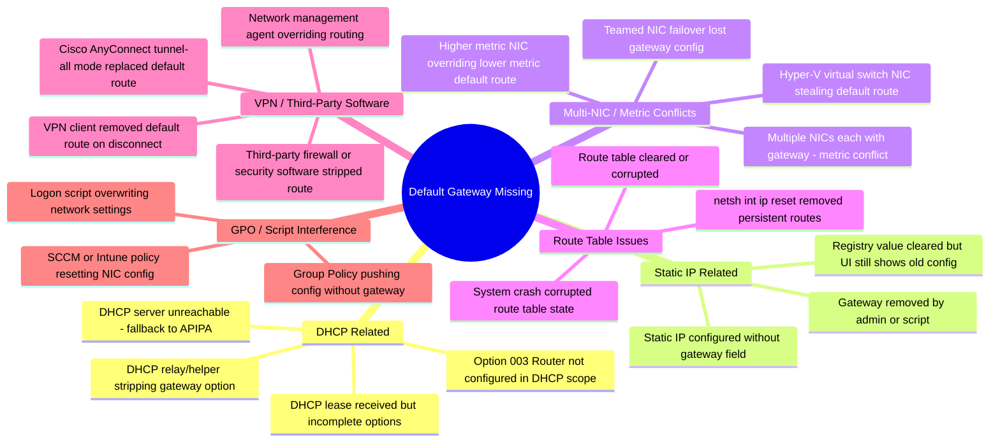
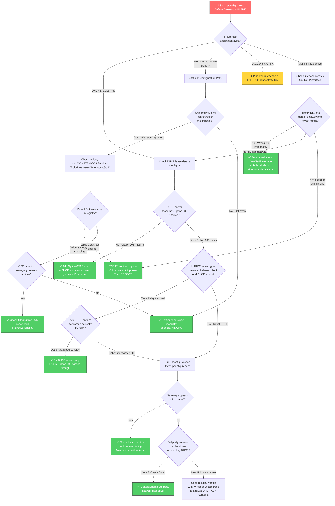

# Scenario Map: TCP/IP — 默认网关缺失 (Default Gateway Missing)

**Product/Service:** Windows TCP/IP Stack  
**Scope:** 默认网关未配置，`route print` 无 `0.0.0.0` 默认路由  
**Last Updated:** 2026-03-11

> ⚠️ **与 "Gateway Unreachable" 的关键区别：** 本场景中网关**根本没有配置**。`ipconfig` 显示网关字段为空，或 `route print` 中没有 `0.0.0.0` 条目。而 "Gateway Unreachable" 场景中，网关**已配置但无法到达**（例如 ARP 解析失败、网关设备宕机等）。

---

## 1. 场景子类型 (Sub-Scenario Mindmap)



---

## 2. 典型症状

| 症状 | 说明 |
|------|------|
| `ipconfig` 网关字段为空 | `Default Gateway . . . . . . . . . :` 后面无任何 IP 地址 |
| `route print` 无 `0.0.0.0` 条目 | 路由表中缺少默认路由（Network Destination 为 `0.0.0.0`，Netmask 为 `0.0.0.0` 的行不存在） |
| 本地子网通信正常，跨子网完全不通 | 能 ping 同子网设备，但 ping 任何远端 IP 均返回 "General failure" 或 "PING: transmit failed. General failure." |
| 显示 "No Internet access" 但本地连接正常 | 系统托盘网络图标显示 ⚠️ 黄色三角，网络状态 "No Internet" |
| `nslookup` 失败 | 如果 DNS 服务器不在本地子网，由于没有默认路由，无法到达 DNS 服务器 |
| `tracert` 第一跳就失败 | `tracert 8.8.8.8` 立即返回 "General failure" 而不是超时 |
| `Test-NetConnection` 报错 | `Test-NetConnection -ComputerName 8.8.8.8` 返回 `PingSucceeded: False`，且 `RemoteAddress` 无法解析路由 |

---

## 3. 排查流程图 (Troubleshooting Flowchart)



---

## 4. 详细排查步骤与命令

### Step 1：确认默认网关确实缺失

```powershell
# 查看所有网络接口详细信息 - 重点关注 "Default Gateway" 和 "DHCP Enabled"
ipconfig /all

# 查看 IPv4 路由表 - 寻找 0.0.0.0 的默认路由条目
route print -4

# PowerShell 方式查看默认路由
Get-NetRoute -DestinationPrefix "0.0.0.0/0" -ErrorAction SilentlyContinue

# 查看所有接口的详细路由配置信息
Get-NetIPConfiguration -Detailed
```

**预期发现：** `ipconfig` 的 `Default Gateway` 字段为空；`route print -4` 在 "Network Destination = 0.0.0.0, Netmask = 0.0.0.0" 没有对应条目；`Get-NetRoute` 返回空结果或报错。

### Step 2：确认本地子网通信正常（排除其他网络问题）

```powershell
# Ping 本地子网中一台已知设备（替换为实际子网内的 IP）
ping 192.168.1.1

# Ping 一个远端 IP（应该失败 - 确认是跨子网的问题）
ping 8.8.8.8

# 如果本地子网 ping 也不通，说明不仅仅是网关问题，IP 配置可能全部有误
```

### Step 3：判断 IP 配置类型（DHCP vs 静态）

```powershell
# 查看 DHCP 状态
ipconfig /all | findstr /i "DHCP Enabled"

# PowerShell 方式查看
Get-NetIPInterface | Select-Object InterfaceAlias, InterfaceIndex, Dhcp, ConnectionState
```

### Step 4（DHCP 路径）：检查 DHCP 服务器配置

```powershell
# 在 DHCP 服务器上运行 - 检查指定 Scope 的 Option 003 (Router)
Get-DhcpServerv4OptionValue -ScopeId 192.168.1.0 | Where-Object OptionId -eq 3

# 查看该 Scope 的所有选项
Get-DhcpServerv4OptionValue -ScopeId 192.168.1.0

# 如果 Option 003 缺失，添加它
Set-DhcpServerv4OptionValue -ScopeId 192.168.1.0 -OptionId 3 -Value 192.168.1.1

# 在客户端强制续约
ipconfig /release && ipconfig /renew
```

### Step 5（静态路径）：检查注册表中的网关配置

```powershell
# 查询所有网络接口的 DefaultGateway 注册表值
reg query "HKLM\SYSTEM\CurrentControlSet\Services\Tcpip\Parameters\Interfaces" /s /v DefaultGateway

# 也查看 DhcpDefaultGateway（DHCP 分配的网关）
reg query "HKLM\SYSTEM\CurrentControlSet\Services\Tcpip\Parameters\Interfaces" /s /v DhcpDefaultGateway

# 查看每个接口的完整 IP 配置
netsh interface ip show config
```

### Step 6：检查多网卡接口指标（Metric）

```powershell
# 查看所有网络适配器及其接口指标 - 低 Metric 值 = 高优先级
Get-NetAdapter | Where-Object Status -eq "Up" | 
    Get-NetIPInterface -AddressFamily IPv4 | 
    Select-Object InterfaceAlias, InterfaceIndex, InterfaceMetric, Dhcp |
    Sort-Object InterfaceMetric

# 查看每个活动接口是否有网关
Get-NetIPConfiguration | Select-Object InterfaceAlias, IPv4DefaultGateway
```

### Step 7：手动添加默认路由（临时测试）

```powershell
# 临时添加默认路由（重启后消失）
route add 0.0.0.0 mask 0.0.0.0 192.168.1.1

# 添加持久默认路由（-p 参数使其在重启后保留）
route add 0.0.0.0 mask 0.0.0.0 192.168.1.1 -p

# PowerShell 方式添加持久默认路由
New-NetRoute -DestinationPrefix "0.0.0.0/0" -NextHop "192.168.1.1" -InterfaceIndex 12

# 验证路由是否已添加
route print -4 | findstr "0.0.0.0"
```

### Step 8：TCP/IP 栈重置（路由表损坏时）

```powershell
# 重置 TCP/IP 栈（需要重启生效）
netsh int ip reset

# 重置 Winsock
netsh winsock reset

# 查看重置日志
Get-Content "$env:SystemRoot\System32\LogFiles\Tcpip\resetlog.txt" -Tail 20

# 重启计算机
Restart-Computer -Force
```

### Step 9：检查 VPN 和第三方软件影响

```powershell
# 查看当前所有网络相关的服务
Get-Service | Where-Object { $_.DisplayName -match "VPN|Cisco|Tunnel|Network" } | 
    Select-Object Name, DisplayName, Status

# 查看网络过滤驱动
Get-NetAdapterBinding | Where-Object ComponentID -match "ms_|npcap|winpcap" | 
    Select-Object Name, ComponentID, Enabled

# 检查 Routing and Remote Access Service 是否意外启用
Get-Service RemoteAccess | Select-Object Name, Status, StartType
```

### Step 10：GPO 诊断

```powershell
# 生成 GPO 结果报告
gpresult /h "$env:USERPROFILE\Desktop\gpo_report.html"

# 检查是否有网络相关的 GPO 策略
gpresult /r /scope:computer | findstr /i "network gateway"
```

---

## 5. 解决方案汇总

| 根因 | 解决方案 | 命令 |
|------|---------|------|
| DHCP Scope 缺少 Option 003 (Router) | 在 DHCP 服务器上添加 Router 选项 | `Set-DhcpServerv4OptionValue -ScopeId <scope> -OptionId 3 -Value <gateway_ip>` |
| 静态 IP 配置遗漏网关 | 添加默认路由 | `New-NetRoute -DestinationPrefix "0.0.0.0/0" -NextHop <gw_ip> -InterfaceIndex <idx>` |
| 多网卡接口指标冲突 | 手动设置正确的接口指标 | `Set-NetIPInterface -InterfaceIndex <idx> -InterfaceMetric <value>` |
| 路由表损坏 | 重置 TCP/IP 栈 + 重启 | `netsh int ip reset` 然后 `Restart-Computer` |
| VPN 客户端删除了默认路由 | 重连 VPN 或检查 split tunnel 配置 | 检查 VPN 客户端配置，确认 split tunnel vs tunnel-all 设置 |
| 第三方软件干扰 | 识别并移除/更新干扰软件 | 使用 Process Monitor 跟踪路由表修改操作，定位干扰进程 |
| GPO 推送了错误配置 | 修正 GPO 中的网络策略 | `gpresult /h report.html` 定位有问题的策略，在 GPMC 中修正 |
| DHCP Relay 剥离了 Option | 修复 DHCP Relay Agent 配置 | 检查 Relay Agent 设备配置，确保转发所有 DHCP 选项 |

---

## 6. 实用经验 Tips

> 💡 **症状特征识别：** "能 ping 通本地子网设备 + 无法 ping 通任何远端 IP" = 经典的默认网关缺失症状。如果 DNS 恰好在本地子网，可能还能解析域名，但 HTTP 连接仍然不通。

> 💡 **DHCP Option 003 vs Option 006：** Option 003 = Router（网关），Option 006 = DNS Server。这两个经常被混淆。缺少 Option 003 不影响 DNS 解析（如果 DNS 在本地子网），但跨子网通信全部不通。

> 💡 **多网卡与接口指标：** 如果多个网卡都配置了默认网关，Windows 会根据 Interface Metric 选择使用哪个 — **Metric 值越低优先级越高**。自动指标基于链路速度（1Gbps = metric 25，100Mbps = metric 35，Wi-Fi 通常更高）。

> 💡 **`route add -p` 持久路由：** 使用 `route add -p` 添加的路由会写入注册表 `HKLM\SYSTEM\CurrentControlSet\Services\Tcpip\Parameters\PersistentRoutes`，重启后仍然生效。但 `route add`（不带 `-p`）仅存在于当前会话。

> 💡 **Hyper-V 主机最佳实践：** 在 Hyper-V 主机上，管理 NIC 应该配置默认网关，虚拟交换机使用的 NIC **不应该** 配置网关。否则容易出现路由冲突导致默认网关 "消失"。

> 💡 **VPN 客户端行为：** 某些 VPN 客户端（如 Cisco AnyConnect 的 "tunnel all" 模式）会**故意删除**原有默认路由，用 VPN 隧道接口的路由替代。VPN 断开后如果未正确还原，默认网关就会丢失。

> 💡 **RRAS 服务陷阱：** 如果 Routing and Remote Access Service (RRAS) 被意外启用，它会改变路由表的行为模式。检查 `Get-Service RemoteAccess` 的状态 — 在非路由器/VPN 服务器角色的机器上，此服务应该是 Stopped/Disabled。

> 💡 **`netsh int ip reset` 注意事项：** 此命令会重置整个 TCP/IP 栈到出厂状态，所有自定义的持久路由、IP 配置都会丢失。执行前务必记录当前配置（`netsh int ip show config > backup.txt`），且**必须重启**才能完全生效。

---

## 7. 参考文档

暂无可验证的参考文档。

---

---

# Scenario Map: TCP/IP — Default Gateway Missing

**Product/Service:** Windows TCP/IP Stack  
**Scope:** Default gateway not configured; `route print` shows no `0.0.0.0` default route  
**Last Updated:** 2026-03-11

> ⚠️ **Key Difference from "Gateway Unreachable":** In this scenario, the gateway is **NOT CONFIGURED AT ALL**. `ipconfig` shows a blank gateway field, or `route print` has no `0.0.0.0` entry. In the "Unreachable" scenario, the gateway **IS configured but cannot be reached** (e.g., ARP failure, gateway device down).

---

## 1. Sub-Scenario Types (Mindmap)


---

## 2. Typical Symptoms

| Symptom | Description |
|---------|-------------|
| Blank gateway in `ipconfig` | `Default Gateway . . . . . . . . . :` followed by nothing |
| No `0.0.0.0` entry in `route print` | The routing table has no default route (no row with Network Destination `0.0.0.0` and Netmask `0.0.0.0`) |
| Local subnet works, off-subnet fails | Can ping devices on the same subnet, but pinging any remote IP returns "General failure" or "PING: transmit failed. General failure." |
| "No Internet access" with local connectivity | System tray network icon shows ⚠️ yellow triangle, status reads "No Internet" |
| `nslookup` fails | If the DNS server is off-subnet, it becomes unreachable without a default route |
| `tracert` fails on first hop | `tracert 8.8.8.8` immediately returns "General failure" instead of timing out |
| `Test-NetConnection` fails | `Test-NetConnection -ComputerName 8.8.8.8` returns `PingSucceeded: False` with no route to destination |

---

## 3. Troubleshooting Flowchart


---

## 4. Detailed Troubleshooting Steps & Commands

### Step 1: Confirm the Default Gateway Is Truly Missing

```powershell
# View detailed info for all network interfaces - focus on "Default Gateway" and "DHCP Enabled"
ipconfig /all

# View IPv4 routing table - look for the 0.0.0.0 default route entry
route print -4

# PowerShell method to check for default route
Get-NetRoute -DestinationPrefix "0.0.0.0/0" -ErrorAction SilentlyContinue

# View detailed routing information for all interfaces
Get-NetIPConfiguration -Detailed
```

**Expected Finding:** The `Default Gateway` field in `ipconfig` is blank; `route print -4` shows no row with Network Destination `0.0.0.0` and Netmask `0.0.0.0`; `Get-NetRoute` returns empty or throws an error.

### Step 2: Verify Local Subnet Connectivity (Rule Out Broader Issues)

```powershell
# Ping a known device on the local subnet (replace with an actual local IP)
ping 192.168.1.1

# Ping a remote IP (this should fail - confirms the issue is cross-subnet)
ping 8.8.8.8

# If local subnet ping also fails, the problem goes beyond just a missing gateway
```

### Step 3: Determine IP Configuration Type (DHCP vs Static)

```powershell
# Check DHCP status
ipconfig /all | findstr /i "DHCP Enabled"

# PowerShell method
Get-NetIPInterface | Select-Object InterfaceAlias, InterfaceIndex, Dhcp, ConnectionState
```

### Step 4 (DHCP Path): Inspect DHCP Server Configuration

```powershell
# Run on the DHCP server - check Option 003 (Router) for the specified scope
Get-DhcpServerv4OptionValue -ScopeId 192.168.1.0 | Where-Object OptionId -eq 3

# View all options for the scope
Get-DhcpServerv4OptionValue -ScopeId 192.168.1.0

# If Option 003 is missing, add it
Set-DhcpServerv4OptionValue -ScopeId 192.168.1.0 -OptionId 3 -Value 192.168.1.1

# Force a DHCP renewal on the client
ipconfig /release && ipconfig /renew
```

### Step 5 (Static Path): Check Registry for Gateway Configuration

```powershell
# Query the DefaultGateway registry value for all network interfaces
reg query "HKLM\SYSTEM\CurrentControlSet\Services\Tcpip\Parameters\Interfaces" /s /v DefaultGateway

# Also check DhcpDefaultGateway (gateway assigned by DHCP)
reg query "HKLM\SYSTEM\CurrentControlSet\Services\Tcpip\Parameters\Interfaces" /s /v DhcpDefaultGateway

# View per-interface IP configuration
netsh interface ip show config
```

### Step 6: Check Multi-NIC Interface Metrics

```powershell
# View all network adapters and their interface metrics - lower metric = higher priority
Get-NetAdapter | Where-Object Status -eq "Up" | 
    Get-NetIPInterface -AddressFamily IPv4 | 
    Select-Object InterfaceAlias, InterfaceIndex, InterfaceMetric, Dhcp |
    Sort-Object InterfaceMetric

# Check which interfaces have a gateway configured
Get-NetIPConfiguration | Select-Object InterfaceAlias, IPv4DefaultGateway
```

### Step 7: Manually Add Default Route (Temporary Test)

```powershell
# Add a temporary default route (lost after reboot)
route add 0.0.0.0 mask 0.0.0.0 192.168.1.1

# Add a persistent default route (-p flag survives reboots)
route add 0.0.0.0 mask 0.0.0.0 192.168.1.1 -p

# PowerShell method to add a persistent default route
New-NetRoute -DestinationPrefix "0.0.0.0/0" -NextHop "192.168.1.1" -InterfaceIndex 12

# Verify the route was added
route print -4 | findstr "0.0.0.0"
```

### Step 8: Reset TCP/IP Stack (For Corrupted Route Tables)

```powershell
# Reset the TCP/IP stack to factory defaults (requires reboot)
netsh int ip reset

# Reset Winsock catalog
netsh winsock reset

# Review the reset log
Get-Content "$env:SystemRoot\System32\LogFiles\Tcpip\resetlog.txt" -Tail 20

# Reboot the machine
Restart-Computer -Force
```

### Step 9: Investigate VPN and Third-Party Software

```powershell
# List all network-related services currently running
Get-Service | Where-Object { $_.DisplayName -match "VPN|Cisco|Tunnel|Network" } | 
    Select-Object Name, DisplayName, Status

# Check for network filter drivers
Get-NetAdapterBinding | Where-Object ComponentID -match "ms_|npcap|winpcap" | 
    Select-Object Name, ComponentID, Enabled

# Check if Routing and Remote Access Service is accidentally enabled
Get-Service RemoteAccess | Select-Object Name, Status, StartType
```

### Step 10: GPO Diagnostics

```powershell
# Generate a GPO result report
gpresult /h "$env:USERPROFILE\Desktop\gpo_report.html"

# Check for network-related GPO policies
gpresult /r /scope:computer | findstr /i "network gateway"
```

---

## 5. Solution Summary

| Root Cause | Solution | Command |
|-----------|----------|---------|
| DHCP Scope missing Option 003 (Router) | Add the Router option to the DHCP scope | `Set-DhcpServerv4OptionValue -ScopeId <scope> -OptionId 3 -Value <gateway_ip>` |
| Static IP config missing gateway | Add a default route | `New-NetRoute -DestinationPrefix "0.0.0.0/0" -NextHop <gw_ip> -InterfaceIndex <idx>` |
| Multi-NIC interface metric conflict | Manually set the correct interface metric | `Set-NetIPInterface -InterfaceIndex <idx> -InterfaceMetric <value>` |
| Route table corrupted | Reset TCP/IP stack + reboot | `netsh int ip reset` then `Restart-Computer` |
| VPN client removed default route | Reconnect VPN or check split tunnel config | Review VPN client settings; confirm split tunnel vs tunnel-all mode |
| Third-party software interference | Identify and remove/update offending software | Use Process Monitor to trace route table modifications and identify the process |
| GPO pushing incorrect config | Correct the network policy in GPO | `gpresult /h report.html` to locate the problematic policy; fix in GPMC |
| DHCP Relay stripping options | Fix DHCP Relay Agent configuration | Check relay agent device config; ensure all DHCP options are forwarded |

---

## 6. Practical Tips

> 💡 **Signature Symptom:** "Can ping local subnet + cannot ping anything off-subnet" = classic missing default gateway. If DNS happens to be on the local subnet, name resolution may still work, but HTTP connections to remote hosts will still fail.

> 💡 **DHCP Option 003 vs Option 006:** Option 003 = Router (gateway), Option 006 = DNS Server. These are frequently confused. Missing Option 003 does not affect DNS resolution (if the DNS server is on the local subnet), but all cross-subnet communication breaks.

> 💡 **Multi-NIC and Interface Metrics:** When multiple NICs each have a default gateway configured, Windows uses the Interface Metric to decide which one becomes the active default route — **lower metric = higher priority**. Automatic metrics are based on link speed (1 Gbps = metric ~25, 100 Mbps = metric ~35, Wi-Fi is typically higher).

> 💡 **`route add -p` Persistent Routes:** Routes added with the `-p` flag are stored in the registry at `HKLM\SYSTEM\CurrentControlSet\Services\Tcpip\Parameters\PersistentRoutes` and survive reboots. Routes added without `-p` exist only for the current session.

> 💡 **Hyper-V Host Best Practice:** On Hyper-V hosts, the management NIC should have the default gateway configured. Virtual switch NICs should **NOT** have a gateway assigned. Otherwise, routing conflicts can cause the default gateway to "disappear."

> 💡 **VPN Client Behavior:** Some VPN clients (e.g., Cisco AnyConnect in "tunnel all" mode) **intentionally remove** the existing default route and replace it with a VPN tunnel route. If the VPN disconnects without properly restoring the original route, the default gateway is lost.

> 💡 **RRAS Service Trap:** If the Routing and Remote Access Service (RRAS) is accidentally enabled, it changes route table behavior. Check `Get-Service RemoteAccess` — on machines that are not configured as routers or VPN servers, this service should be Stopped and Disabled.

> 💡 **`netsh int ip reset` Warning:** This command resets the entire TCP/IP stack to factory defaults — all custom persistent routes and IP configurations are lost. Always back up the current config first (`netsh int ip show config > backup.txt`), and a **reboot is required** for the reset to take full effect.

---

## 7. References

No verified reference documentation available at this time.
