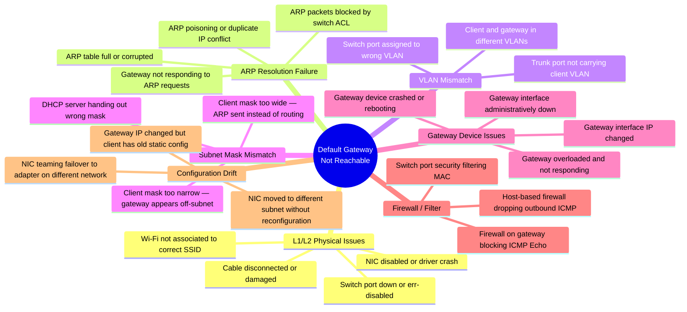
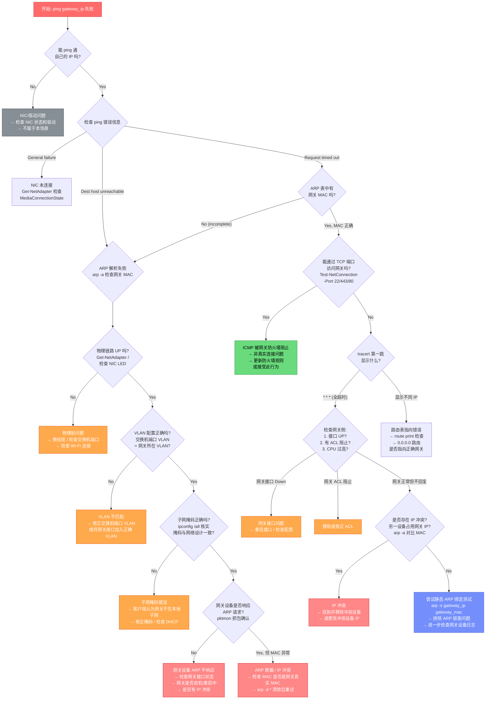
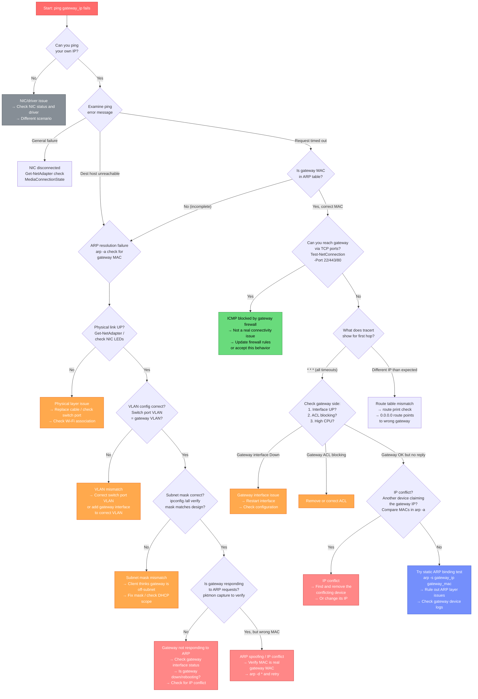

# Scenario Map: TCP/IP — 默认网关不可达 (Default Gateway Not Reachable)

**Product/Service:** Windows TCP/IP Stack  
**Scope:** 默认网关已配置但 ping 不通，客户端无法到达网关地址  
**Last Updated:** 2026-03-11

---

## 1. 场景概述 (Scenario Overview)

默认网关不可达是最常见的网络连接故障之一。客户端已配置网关 IP（静态或 DHCP），但无法与网关通信，导致所有跨子网流量中断。此场景涵盖从物理层到 IP 层的多种根因。

### 子场景分类 (Sub-types)



---

## 2. 典型症状 (Typical Symptoms)

| 症状 | 含义 | 指向的层级 |
|------|------|-----------|
| `ping <gateway_ip>` → **"Destination host unreachable"** | 本机发送了 ARP 请求但未收到回复，无法解析网关 MAC 地址 | **L2 层问题**（物理连接、VLAN、ARP） |
| `ping <gateway_ip>` → **"Request timed out"** | ARP 已解析成功，ICMP Echo Request 已发送，但未收到 Echo Reply | **L3+ 问题**（网关 ICMP 被阻、网关宕机、路由问题） |
| `ping <gateway_ip>` → **"General failure"** | NIC 未连接或驱动异常，IP 栈无法发送数据包 | **NIC/驱动层问题** |
| `ping 127.0.0.1` 成功，`ping <own_ip>` 成功，`ping <gateway>` 失败 | 本机 TCP/IP 栈正常，问题在本机与网关之间的路径 | L2 或 L3 |
| `tracert` 第一跳显示 `* * *` | 网关未回应 ICMP TTL Exceeded 或 Echo Reply | 网关不可达或 ICMP 被过滤 |
| 任务栏网络图标显示 **"No Internet access"** | NCA (Network Connectivity Assistant) 检测到无法到达 Internet 探测目标 | 广义连接中断 |
| `arp -a` 中网关 IP 对应条目缺失或显示 "incomplete" | ARP 解析失败 | L2 层问题 |
| 能 ping 通同子网其他主机，但 ping 不通网关 | 网关自身问题（宕机、接口 down、ACL） | 网关设备问题 |

**关键鉴别点：** `Destination host unreachable` = ARP 失败（L2）vs `Request timed out` = 包已发出但无回复（L3+）。这是整个排查的**第一分叉点**。

---

## 3. 排查流程图 (Troubleshooting Flowchart)



---

## 4. 详细排查步骤 (Detailed Troubleshooting Steps)

### Step 1: 验证本机 TCP/IP 栈

```powershell
# 确认 NIC 状态
Get-NetAdapter | Select-Object Name, Status, LinkSpeed, MediaConnectionState

# 确认 IP 配置（注意子网掩码！）
ipconfig /all

# PowerShell 方式查看完整配置
Get-NetIPConfiguration -Detailed

# ping 本机 IP 确认栈正常
ping 127.0.0.1
ping <own_ip>
```

**判断点：** 如果 `Get-NetAdapter` 显示 `MediaConnectionState: Disconnected`，这是物理层问题，不属于本场景核心。

### Step 2: 分析 ping 网关的错误类型

```powershell
# ping 网关并观察错误信息
ping <gateway_ip>
ping -n 10 <gateway_ip>

# 关键区分:
# "Reply from <own_ip>: Destination host unreachable" → ARP 失败 (L2)
# "Request timed out" → 包已发送但无回复 (L3+)
# "General failure" → NIC/驱动问题
# "PING: transmit failed. General failure." → IPv6/IPv4 路由表异常
```

### Step 3: 检查 ARP 表

```powershell
# 查看 ARP 缓存中是否有网关条目
arp -a
# 或 PowerShell 方式（更详细）
Get-NetNeighbor -IPAddress <gateway_ip>

# 状态含义:
# Reachable → MAC 已解析，链路曾经正常
# Incomplete → ARP 请求已发送但未收到回复
# Stale → 缓存条目已过期
# 无条目 → 从未尝试解析或已被清除
```

### Step 4: 清除 ARP 缓存并重试

```powershell
# 清除所有 ARP 缓存条目并重新 ping
arp -d *
ping <gateway_ip>

# 再次检查 ARP 状态
Get-NetNeighbor -IPAddress <gateway_ip>
```

### Step 5: 验证路由表

```powershell
# 打印完整路由表
route print

# 确认默认路由 (0.0.0.0) 指向正确网关
route print | findstr "0.0.0.0"

# PowerShell 方式
Get-NetRoute -DestinationPrefix "0.0.0.0/0"
```

**判断点：** 如果 `0.0.0.0/0` 路由的 NextHop 不是预期网关 IP，则路由配置有误。

### Step 6: 验证子网掩码

```powershell
# 详细检查子网掩码
ipconfig /all

# 示例问题:
# 网关 IP: 10.1.1.1，客户端 IP: 10.1.1.50
# 正确掩码: 255.255.255.0 (/24) → 网关在本地子网 → ARP 直接解析
# 错误掩码: 255.255.255.240 (/28) → 客户端范围 10.1.1.49-62
#   网关 10.1.1.1 不在此范围 → 客户端尝试通过路由到达网关 → 但路由指向的就是这个网关 → 死循环
```

### Step 7: 网络层抓包分析

```powershell
# 使用 pktmon 在 NIC 层抓包
pktmon start --capture --comp nics -m real-time

# 在另一个窗口 ping 网关
ping <gateway_ip>

# 停止抓包
pktmon stop

# 将抓包转换为 pcapng 格式用 Wireshark 分析
pktmon pcapng PktMon.etl -o gateway_debug.pcapng

# 在抓包中查找:
# 1. ARP Request: Who has <gateway_ip>? Tell <own_ip> → 是否发出?
# 2. ARP Reply: <gateway_ip> is at <mac> → 是否收到?
# 3. ICMP Echo Request → 是否发出?
# 4. ICMP Echo Reply → 是否收到?
```

### Step 8: 测试 TCP 连通性（排除 ICMP 被阻）

```powershell
# 尝试 TCP 连接到网关的已知端口
Test-NetConnection -ComputerName <gateway_ip> -Port 443
Test-NetConnection -ComputerName <gateway_ip> -Port 22
Test-NetConnection -ComputerName <gateway_ip> -Port 80

# 如果 TCP 成功但 ICMP 失败 → 网关防火墙阻止 ICMP，非真实连接问题
```

### Step 9: 检查 IP 冲突

```powershell
# 查看 ARP 表中网关 IP 对应的 MAC
arp -a | findstr "<gateway_ip>"

# 对比已知的网关真实 MAC 地址
# 如果 MAC 不匹配 → 另一设备抢占了网关 IP

# 获取本机所有接口 MAC
getmac /v

# Windows 事件日志中检查 IP 冲突告警
Get-WinEvent -FilterHashtable @{LogName='System'; Id=4199} -MaxEvents 5 -ErrorAction SilentlyContinue
```

### Step 10: 静态 ARP 绑定测试

```powershell
# 临时绑定网关 MAC（需要管理员权限）
# 用于排除 ARP 解析问题（测试用途，非永久方案）
arp -s <gateway_ip> <gateway_mac>
ping <gateway_ip>

# PowerShell 方式
New-NetNeighbor -InterfaceIndex <idx> -IPAddress <gateway_ip> -LinkLayerAddress "<mac>" -State Permanent

# 测试完成后清除
arp -d <gateway_ip>
```

---

## 5. 解决方案汇总 (Solutions Summary)

| 根因 | 诊断证据 | 解决方案 | 优先级 |
|------|----------|----------|--------|
| **网关设备宕机/重启** | ARP 无回复；同子网其他设备也无法 ping 网关；网关控制台无响应 | 重启网关设备；检查网关日志和电源；联系网络团队 | 🔴 紧急 |
| **物理链路中断** | `Get-NetAdapter` 显示 `Disconnected`；NIC LED 不亮；交换机端口 link down | 更换网线；检查交换机端口状态；确认 NIC 未被禁用 | 🔴 紧急 |
| **VLAN 不匹配** | ARP 无回复；同 VLAN 其他设备可达；交换机配置显示端口 VLAN 不同 | 修正交换机端口 VLAN 配置，使客户端与网关在同一 VLAN | 🟠 高 |
| **子网掩码错误** | `ipconfig` 显示掩码与网络设计不符；ARP 行为异常（不发 ARP 或发到错误地址） | 修正客户端子网掩码（静态配置或修复 DHCP 作用域） | 🟠 高 |
| **ARP 缓存错误/ARP 欺骗** | `arp -a` 显示网关 MAC 与实际不符；清除缓存后短暂恢复 | `arp -d *` 清除缓存；排查 ARP 欺骗源；必要时配置静态 ARP | 🟠 高 |
| **IP 地址冲突** | ARP 表中网关 MAC 频繁变化；系统日志有 Event 4199 | 找到占用网关 IP 的冲突设备并移除或更改其 IP | 🟠 高 |
| **网关 ICMP 被防火墙阻止** | ping 超时但 `Test-NetConnection -Port 443` 成功 | 非真实连接问题；如需要 ping，更新网关防火墙规则放行 ICMP | 🟡 中 |
| **网关 IP 变更/客户端配置过时** | `ipconfig` 显示的网关 IP 与当前网络实际网关不符 | 更新客户端网关 IP（静态配置或 `ipconfig /renew` 获取新 DHCP 租约） | 🟡 中 |
| **NIC 连接到错误网络** | 笔记本移动到新位置；Wi-Fi 连接到访客 SSID | 连接到正确的网络/SSID；或重新配置 IP 适配新网络 | 🟡 中 |
| **NIC Teaming 故障切换** | 团队成员切换时短暂中断；事件日志有 Teaming 切换记录 | 等待切换完成；检查备用成员网络配置是否一致 | 🟢 低 |
| **路由表异常** | `route print` 显示 0.0.0.0 路由指向非预期网关或缺失 | `route add 0.0.0.0 mask 0.0.0.0 <correct_gateway>` 修正路由 | 🟡 中 |

---

## 6. 实用技巧 (Troubleshooting Tips)

> 💡 **Tip 1: "Destination host unreachable" vs "Request timed out" 是最关键的鉴别点**
> - `Destination host unreachable`（且来源 IP 是本机）= **ARP 解析失败**，问题在 **L2 层**（物理连接、VLAN、子网掩码）
> - `Request timed out` = **ICMP Echo Request 已发送**（ARP 成功），问题在 **L3+ 层**（网关宕机、ICMP 被阻、路由问题）
> - 这个区分决定了你的排查方向，务必先明确！

> 💡 **Tip 2: 子网掩码是隐形杀手**
> - `255.255.255.0` (/24) vs `255.255.0.0` (/16) 会完全改变客户端的行为
> - 掩码太窄：网关被认为在"远端"，客户端尝试路由到网关——但路由的下一跳就是网关本身，形成死循环
> - 掩码太宽：本应路由的远端地址被当作本地，客户端发 ARP 而非走路由
> - **永远先验证 `ipconfig /all` 中的子网掩码！**

> 💡 **Tip 3: Wi-Fi 环境下的特殊考虑**
> - 检查是否连接到正确的 SSID（企业环境常有 Corp / Guest / IoT 多个 SSID）
> - Guest 网络的网关与 Corp 网络不同，IP 配置不匹配
> - Wi-Fi 漫游时可能短暂关联到不同 AP 的不同 VLAN

> 💡 **Tip 4: 使用 `arp -s` 做诊断性静态绑定**
> - `arp -s <gateway_ip> <gateway_mac>` 可以临时绑定网关 MAC
> - 如果绑定后 ping 成功 → 说明 ARP 解析过程有问题（ARP 被阻、ARP 欺骗、竞争条件）
> - 如果绑定后仍然失败 → ARP 不是根因，问题在更高层
> - **注意：这仅用于诊断，不要作为长期解决方案**

> 💡 **Tip 5: NIC Teaming 故障切换的暂时性问题**
> - NIC Teaming 在主备切换时可能导致几秒到几十秒的网关不可达
> - 切换期间 ARP 表可能指向旧的物理 NIC MAC，交换机 CAM 表未更新
> - 检查事件日志中的 Teaming 切换事件：`Get-WinEvent -FilterHashtable @{LogName='Microsoft-Windows-MsLbfoProvider/Operational'} -MaxEvents 10`

> 💡 **Tip 6: tracert 第一跳的信息价值**
> - 如果第一跳显示 `* * *`：网关完全不可达或不回复 ICMP
> - 如果第一跳显示**不同于预期网关的 IP**：路由表有问题，流量走了错误路径
> - 如果第一跳正常但后续全 `*`：问题不在网关可达性，而在网关上游

---

## 7. 参考文档 (References)

暂无可验证的参考文档。

---

---

# Scenario Map: TCP/IP — Default Gateway Not Reachable

**Product/Service:** Windows TCP/IP Stack  
**Scope:** Default gateway is configured but unreachable (ping fails)  
**Last Updated:** 2026-03-11

---

## 1. Scenario Overview

Default gateway unreachable is one of the most common network connectivity issues. The client has a configured gateway IP (static or DHCP) but cannot communicate with it, causing all cross-subnet traffic to fail. This scenario covers multiple root causes spanning from the physical layer to the IP layer.

### Sub-type Classification


---

## 2. Typical Symptoms

| Symptom | Meaning | Points To |
|---------|---------|-----------|
| `ping <gateway_ip>` → **"Destination host unreachable"** | Host sent ARP request but received no reply; cannot resolve gateway MAC address | **L2 issue** (physical link, VLAN, ARP) |
| `ping <gateway_ip>` → **"Request timed out"** | ARP resolved successfully; ICMP Echo Request sent but no Echo Reply received | **L3+ issue** (gateway down, ICMP blocked, routing) |
| `ping <gateway_ip>` → **"General failure"** | NIC disconnected or driver failure; IP stack cannot send packets | **NIC/driver issue** |
| `ping 127.0.0.1` OK, `ping <own_ip>` OK, `ping <gateway>` fails | Local TCP/IP stack is healthy; problem is between host and gateway | L2 or L3 |
| `tracert` first hop shows `* * *` | Gateway not responding to ICMP TTL Exceeded or Echo Reply | Gateway unreachable or ICMP filtered |
| Taskbar network icon shows **"No Internet access"** | NCA (Network Connectivity Assistant) detected failure to reach Internet probe target | General connectivity failure |
| `arp -a` shows no entry or "incomplete" for gateway IP | ARP resolution failed | L2 issue |
| Can ping other hosts on same subnet but not the gateway | Gateway-specific issue (down, interface off, ACL) | Gateway device problem |

**Key Differentiator:** `Destination host unreachable` = ARP failure (L2) vs `Request timed out` = packet sent but no reply (L3+). This is the **first branch point** of the entire investigation.

---

## 3. Troubleshooting Flowchart



---

## 4. Detailed Troubleshooting Steps

### Step 1: Verify Local TCP/IP Stack

```powershell
# Check NIC status
Get-NetAdapter | Select-Object Name, Status, LinkSpeed, MediaConnectionState

# Check IP configuration (pay attention to subnet mask!)
ipconfig /all

# PowerShell detailed configuration
Get-NetIPConfiguration -Detailed

# Verify local stack works
ping 127.0.0.1
ping <own_ip>
```

**Decision Point:** If `Get-NetAdapter` shows `MediaConnectionState: Disconnected`, this is a physical layer problem and falls outside the core of this scenario.

### Step 2: Analyze the ping Error Type

```powershell
# Ping the gateway and observe the error message
ping <gateway_ip>
ping -n 10 <gateway_ip>

# Key distinctions:
# "Reply from <own_ip>: Destination host unreachable" → ARP failure (L2)
# "Request timed out" → Packet sent but no reply (L3+)
# "General failure" → NIC/driver issue
# "PING: transmit failed. General failure." → IPv6/IPv4 route table anomaly
```

### Step 3: Examine ARP Table

```powershell
# Check ARP cache for gateway entry
arp -a
# PowerShell method (more detailed)
Get-NetNeighbor -IPAddress <gateway_ip>

# State meanings:
# Reachable → MAC resolved, link was working
# Incomplete → ARP request sent, no reply received
# Stale → Cache entry has expired
# No entry → Never attempted resolution or already cleared
```

### Step 4: Clear ARP Cache and Retry

```powershell
# Clear all ARP cache entries and ping again
arp -d *
ping <gateway_ip>

# Check ARP state again
Get-NetNeighbor -IPAddress <gateway_ip>
```

### Step 5: Verify Route Table

```powershell
# Print full route table
route print

# Confirm default route (0.0.0.0) points to correct gateway
route print | findstr "0.0.0.0"

# PowerShell method
Get-NetRoute -DestinationPrefix "0.0.0.0/0"
```

**Decision Point:** If the `0.0.0.0/0` route's NextHop is not the expected gateway IP, the routing configuration is wrong.

### Step 6: Verify Subnet Mask

```powershell
# Carefully check the subnet mask
ipconfig /all

# Example problem:
# Gateway IP: 10.1.1.1, Client IP: 10.1.1.50
# Correct mask: 255.255.255.0 (/24) → Gateway is on local subnet → ARP resolves directly
# Wrong mask: 255.255.255.240 (/28) → Client range is 10.1.1.49-62
#   Gateway 10.1.1.1 is NOT in this range → Client tries to route to gateway
#   → But the route's next-hop IS this gateway → Dead loop
```

### Step 7: Packet Capture at NIC Level

```powershell
# Capture packets at NIC level using pktmon
pktmon start --capture --comp nics -m real-time

# In another window, ping the gateway
ping <gateway_ip>

# Stop capture
pktmon stop

# Convert capture to pcapng for Wireshark analysis
pktmon pcapng PktMon.etl -o gateway_debug.pcapng

# What to look for in the capture:
# 1. ARP Request: Who has <gateway_ip>? Tell <own_ip> → Was it sent?
# 2. ARP Reply: <gateway_ip> is at <mac> → Was it received?
# 3. ICMP Echo Request → Was it sent?
# 4. ICMP Echo Reply → Was it received?
```

### Step 8: Test TCP Connectivity (Rule Out ICMP Blocking)

```powershell
# Attempt TCP connections to known ports on the gateway
Test-NetConnection -ComputerName <gateway_ip> -Port 443
Test-NetConnection -ComputerName <gateway_ip> -Port 22
Test-NetConnection -ComputerName <gateway_ip> -Port 80

# If TCP succeeds but ICMP fails → Gateway firewall is blocking ICMP
# This is NOT a real connectivity problem
```

### Step 9: Check for IP Conflict

```powershell
# Check the MAC address associated with gateway IP in ARP table
arp -a | findstr "<gateway_ip>"

# Compare against the known real gateway MAC address
# If MAC doesn't match → Another device has claimed the gateway IP

# Get local interface MACs
getmac /v

# Check Windows event log for IP conflict alerts
Get-WinEvent -FilterHashtable @{LogName='System'; Id=4199} -MaxEvents 5 -ErrorAction SilentlyContinue
```

### Step 10: Static ARP Binding Test

```powershell
# Temporarily bind gateway MAC (requires admin privileges)
# Used to rule out ARP resolution problems (diagnostic only, not a permanent fix)
arp -s <gateway_ip> <gateway_mac>
ping <gateway_ip>

# PowerShell method
New-NetNeighbor -InterfaceIndex <idx> -IPAddress <gateway_ip> -LinkLayerAddress "<mac>" -State Permanent

# Clean up after testing
arp -d <gateway_ip>
```

---

## 5. Solutions Summary

| Root Cause | Diagnostic Evidence | Solution | Priority |
|------------|-------------------|----------|----------|
| **Gateway device down/rebooting** | No ARP reply; other hosts on same subnet also cannot ping gateway; gateway console unresponsive | Restart gateway device; check gateway logs and power; contact network team | 🔴 Critical |
| **Physical link failure** | `Get-NetAdapter` shows `Disconnected`; NIC LEDs off; switch port shows link down | Replace cable; check switch port status; verify NIC is not disabled | 🔴 Critical |
| **VLAN mismatch** | No ARP reply; other devices on same VLAN are reachable; switch config shows port in different VLAN | Correct switch port VLAN assignment so client and gateway share the same VLAN | 🟠 High |
| **Subnet mask mismatch** | `ipconfig` shows mask inconsistent with network design; abnormal ARP behavior | Fix client subnet mask (static config or fix DHCP scope) | 🟠 High |
| **Stale/poisoned ARP cache** | `arp -a` shows incorrect MAC for gateway; brief recovery after cache clear | `arp -d *` to clear cache; investigate ARP spoofing source; configure static ARP if needed | 🟠 High |
| **IP address conflict** | Gateway MAC changes frequently in ARP table; System log has Event 4199 | Find the conflicting device and remove it or change its IP | 🟠 High |
| **Gateway ICMP blocked by firewall** | Ping times out but `Test-NetConnection -Port 443` succeeds | Not a real connectivity issue; update gateway firewall to allow ICMP if ping is needed | 🟡 Medium |
| **Gateway IP changed / stale client config** | `ipconfig` shows a gateway IP different from the current actual network gateway | Update client gateway IP (static config or `ipconfig /renew` for new DHCP lease) | 🟡 Medium |
| **NIC connected to wrong network** | Laptop moved to new location; Wi-Fi associated to guest SSID | Connect to the correct network/SSID; or reconfigure IP for the new network | 🟡 Medium |
| **NIC Teaming failover** | Transient outage during team member switch; Teaming failover events in event log | Wait for switchover to complete; verify standby member's network config is consistent | 🟢 Low |
| **Route table anomaly** | `route print` shows 0.0.0.0 route pointing to unexpected gateway or missing entirely | `route add 0.0.0.0 mask 0.0.0.0 <correct_gateway>` to fix routing | 🟡 Medium |

---

## 6. Troubleshooting Tips

> 💡 **Tip 1: "Destination host unreachable" vs "Request timed out" is THE key differentiator**
> - `Destination host unreachable` (with source IP = your own IP) = **ARP resolution failure**, problem at **L2** (physical link, VLAN, subnet mask)
> - `Request timed out` = **ICMP Echo Request was sent** (ARP succeeded), problem at **L3+** (gateway down, ICMP blocked, routing issue)
> - This distinction determines your entire investigation direction — always clarify this first!

> 💡 **Tip 2: Subnet mask is the silent killer**
> - `255.255.255.0` (/24) vs `255.255.0.0` (/16) completely changes client behavior
> - Mask too narrow: Gateway appears "remote"; client tries to route to gateway — but the route's next-hop IS the gateway, creating a dead loop
> - Mask too wide: Remote addresses are treated as local; client sends ARP instead of routing
> - **Always verify the subnet mask in `ipconfig /all` first!**

> 💡 **Tip 3: Special considerations for Wi-Fi environments**
> - Verify you are connected to the correct SSID (enterprise environments often have Corp / Guest / IoT SSIDs)
> - Guest network gateways differ from Corp network gateways — IP config won't match
> - Wi-Fi roaming may temporarily associate to a different AP on a different VLAN

> 💡 **Tip 4: Use `arp -s` for diagnostic static binding**
> - `arp -s <gateway_ip> <gateway_mac>` temporarily binds the gateway MAC
> - If ping succeeds after binding → ARP resolution process is the problem (ARP blocked, ARP spoofing, race condition)
> - If ping still fails after binding → ARP is not the root cause; problem is at a higher layer
> - **This is for diagnosis only — do not use as a permanent fix**

> 💡 **Tip 5: NIC Teaming failover causes transient gateway unreachable**
> - NIC Teaming active/standby switchover can cause a few seconds to tens of seconds of gateway unreachable
> - During switchover, ARP table may still point to the old physical NIC's MAC; switch CAM table not yet updated
> - Check Teaming failover events: `Get-WinEvent -FilterHashtable @{LogName='Microsoft-Windows-MsLbfoProvider/Operational'} -MaxEvents 10`

> 💡 **Tip 6: The information value of tracert first hop**
> - First hop shows `* * *`: Gateway completely unreachable or not replying to ICMP
> - First hop shows a **different IP than the expected gateway**: Route table issue — traffic is taking the wrong path
> - First hop normal but all subsequent hops are `*`: Problem is not gateway reachability but upstream from the gateway

---

## 7. References

No verified reference documentation available at this time.
