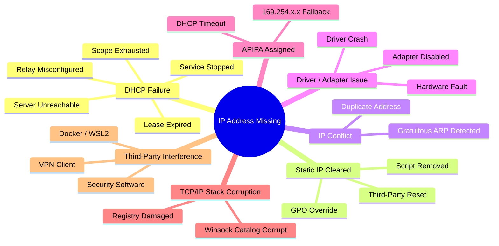
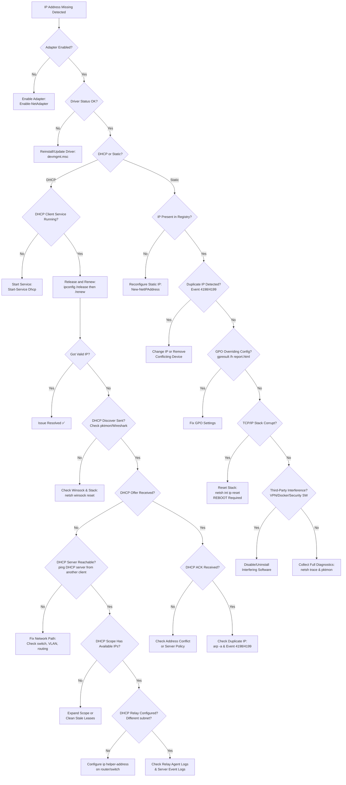

# Scenario Map: TCP/IP — IP 地址缺失

**Product/Service:** Windows TCP/IP Stack  
**Scope:** 网卡无 IP 地址或 IP 配置异常的排查  
**Last Updated:** 2026-03-11

---

## 1. 场景概述

当 Windows 网卡（NIC）丢失有效的 IPv4 地址时，用户将完全无法进行网络通信。这一场景涵盖了多种表现形式：网卡上完全没有 IPv4 地址、获取到 169.254.x.x（APIPA）自动私有地址、原本配置的静态 IP 被意外清除、或者因 IP 地址冲突导致地址被禁用。

**常见子场景分类：**

| 子场景 | 描述 |
|--------|------|
| **DHCP 获取失败** | DHCP 客户端无法从服务器获取地址，回落到 APIPA 169.254.x.x |
| **静态 IP 被清除** | 手动配置的静态 IP 被组策略、脚本或第三方软件移除 |
| **IP 地址冲突** | 分配的 IP 与网络中另一台设备重复，Windows 禁用该地址 |
| **驱动/适配器故障** | 网卡驱动异常导致 TCP/IP 栈无法绑定地址 |
| **APIPA 地址** | DHCP 失败后自动分配 169.254.x.x，仅限本地链路通信 |
| **TCP/IP 栈损坏** | Winsock 或 TCP/IP 注册表配置损坏导致无法持有 IP |
| **第三方软件干扰** | VPN、Docker、WSL2、安全软件剥离或劫持网卡 IP |



---

## 2. 典型症状

用户报告 "没有网络" 或 "无法上网" 时，以下症状通常指向 IP 地址缺失问题：

### 2.1 网络连接状态

- 系统托盘网络图标显示**黄色感叹号三角**（"No Internet access" 或 "No network access"）
- 网络连接状态显示 "Limited" 或 "No network access"
- Wi-Fi 显示已连接但无法访问任何资源

### 2.2 ipconfig 输出异常

- `ipconfig` 输出中对应网卡**完全没有 IPv4 Address 行**
- IPv4 地址显示为 `169.254.x.x`（APIPA），子网掩码 `255.255.0.0`，无默认网关
- `Autoconfiguration IPv4 Address` 前缀表示这是 APIPA 而非正常 DHCP 地址
- `DHCP Enabled: Yes` 但没有获取到 DHCP 服务器地址

### 2.3 网络诊断命令输出

- `ping` 任何地址返回 **"General failure"** — 表示本地 TCP/IP 栈或适配器异常
- `ping` 返回 **"Destination host unreachable"** 且源地址为 169.254.x.x
- `nslookup` 返回 "Default Server: UnKnown" 且无法解析任何域名
- `Test-NetConnection` 报告 `PingSucceeded: False`，`NameResolutionSucceeded: False`

### 2.4 事件日志信号

- **Event ID 1003**（Dhcp-Client）：`Your computer was not able to renew its address from the network (from the DHCP Server) for the Network Card with network address 0xXXXXXXXXXXXX`
- **Event ID 1002**（Dhcp-Client）：`The IP address lease x.x.x.x for the Network Card with network address 0xXXXXXXXXXXXX has been denied by the DHCP server x.x.x.x`
- **Event ID 4199**（Tcpip）：IP 地址冲突检测
- **Event ID 4198**（Tcpip）：`The system detected an address conflict for IP address x.x.x.x`

---

## 3. 排查逻辑与流程图

排查 IP 地址缺失问题时，应遵循 **"由近及远、由下至上"** 的原则。首先确认网卡本身是否启用且驱动正常（物理层/链路层），然后判断 IP 配置方式（DHCP 还是静态），再根据配置方式进入对应的排查分支。

**对于 DHCP 场景**：需要确认本地 DHCP Client 服务是否运行，然后检查 DHCP 四步握手（DORA：Discover → Offer → Request → Ack）是否能正常完成。如果 Discover 包已发出但没有 Offer 回应，问题在于 DHCP 服务器不可达或作用域配置问题。如果有 Offer 但客户端未接受，可能存在地址冲突或客户端栈问题。

**对于静态 IP 场景**：需要检查注册表中是否仍保存着 IP 配置，确认是否有组策略（GPO）或脚本在覆盖配置，以及检测是否存在 IP 冲突。

**最终兜底**：如果以上均正常但 IP 仍然缺失，考虑 TCP/IP 栈损坏或第三方软件干扰。



---

## 4. 详细排查步骤

### 步骤 1：确认网卡状态

**为什么检查：** 如果网卡本身被禁用或驱动异常，IP 配置无从谈起。

```powershell
# 查看所有网卡状态
Get-NetAdapter | Format-Table Name, Status, MediaConnectionState, LinkSpeed, DriverVersion

# 查看适配器详细信息（包括 MAC 地址）
Get-NetAdapter | Select-Object Name, Status, MacAddress, InterfaceDescription
```

**结果判读：**
- ✅ `Status: Up`, `MediaConnectionState: Connected` — 网卡正常，继续下一步
- ❌ `Status: Disabled` — 执行 `Enable-NetAdapter -Name "Ethernet"`
- ❌ `Status: Not Present` 或 `Disconnected` — 检查物理连接或驱动
- ❌ 驱动版本极旧或设备管理器中有黄色感叹号 — 更新驱动

### 步骤 2：查看当前 IP 配置

**为什么检查：** 确认 IP 缺失的具体表现形式。

```powershell
# 经典命令 — 显示全部配置
ipconfig /all

# PowerShell 方式 — 更易于脚本化
Get-NetIPAddress -InterfaceAlias "Ethernet" | Format-Table IPAddress, PrefixLength, AddressFamily, SuffixOrigin

# 查看 IP 配置来源（DHCP vs Manual）
Get-NetIPConfiguration -InterfaceAlias "Ethernet" -Detailed
```

**结果判读：**
- ✅ `IPv4 Address: 10.x.x.x / 192.168.x.x` 且 `SuffixOrigin: Dhcp` 或 `Manual` — IP 正常
- ❌ 无 IPv4 Address 行 — IP 完全丢失
- ❌ `Autoconfiguration IPv4 Address: 169.254.x.x` — DHCP 获取失败，回落到 APIPA
- ❌ `Duplicate` 标记 — 存在 IP 冲突

### 步骤 3：确定 IP 配置方式（DHCP vs 静态）

**为什么检查：** DHCP 和静态 IP 的排查路径完全不同。

```powershell
# 检查 DHCP 是否启用
netsh interface ip show config

# 或者使用 PowerShell
Get-NetIPInterface -InterfaceAlias "Ethernet" -AddressFamily IPv4 | Select-Object InterfaceAlias, Dhcp
```

**结果判读：**
- `DHCP enabled: Yes` — 进入 DHCP 排查路径（步骤 4）
- `DHCP enabled: No` — 进入静态 IP 排查路径（步骤 7）

### 步骤 4：检查 DHCP Client 服务状态

**为什么检查：** DHCP Client 服务停止后，客户端无法发起 DHCP 请求。

```powershell
# 检查服务状态
Get-Service -Name Dhcp | Select-Object Name, Status, StartType

# 如果服务停止，启动它
Start-Service -Name Dhcp
Set-Service -Name Dhcp -StartupType Automatic

# 检查服务依赖项
Get-Service -Name Dhcp -DependentServices
```

**结果判读：**
- ✅ `Status: Running`, `StartType: Automatic` — 服务正常
- ❌ `Status: Stopped` — 启动服务后执行 `ipconfig /renew`
- ❌ 服务无法启动 — 检查系统事件日志，可能是依赖服务故障或系统文件损坏

### 步骤 5：尝试释放和续约

**为什么检查：** 强制客户端重新执行 DHCP DORA 流程。

```powershell
# 释放当前地址
ipconfig /release

# 请求新地址
ipconfig /renew

# 如果只针对特定网卡
ipconfig /release "Ethernet"
ipconfig /renew "Ethernet"
```

**结果判读：**
- ✅ 获得有效 IP 地址 — 问题解决
- ❌ `An error occurred while releasing interface... The system cannot find the file specified` — 适配器或驱动问题
- ❌ `DHCP Server unreachable` 或长时间超时 — 继续步骤 6

### 步骤 6：网络抓包分析 DHCP 握手

**为什么检查：** 确定 DHCP DORA 四步握手在哪一步中断。

```powershell
# 使用 pktmon 抓取 DHCP 流量（端口 67/68）
pktmon filter add -t UDP -p 67
pktmon filter add -t UDP -p 68
pktmon start --etw -m real-time

# 在另一个窗口执行 ipconfig /renew
# 完成后停止抓包
pktmon stop
pktmon filter remove

# 转换为 pcapng 供 Wireshark 分析
pktmon pcapng PktMon.etl -o dhcp_capture.pcapng
```

```powershell
# 同时检查 DHCP Client 事件日志
Get-WinEvent -LogName "Microsoft-Windows-Dhcp-Client/Operational" -MaxEvents 20 |
    Format-Table TimeCreated, Id, Message -Wrap

# 查看系统日志中的 DHCP 相关事件
Get-WinEvent -FilterHashtable @{LogName='System'; ProviderName='Dhcp-Client'} -MaxEvents 10 |
    Format-List TimeCreated, Id, Message
```

**结果判读：**
- ✅ 看到完整的 Discover → Offer → Request → Ack — DHCP 正常，问题可能是间歇性的
- ❌ 只有 Discover，无 Offer — DHCP 服务器不可达（检查网络路径、VLAN、DHCP Relay）
- ❌ 有 Offer 但无 Request — 客户端栈异常
- ❌ 有 Request 但收到 NAK — DHCP 服务器拒绝（地址冲突或策略限制）
- ❌ 完整 DORA 但 IP 立即消失 — 第三方软件干扰或 IP 冲突

### 步骤 7：检查静态 IP 注册表配置

**为什么检查：** 静态 IP 存储在注册表中，如果被清除则 IP 丢失。

```powershell
# 查看网卡的注册表配置
# 首先找到目标网卡的 GUID
Get-NetAdapter | Select-Object Name, InterfaceGuid

# 查看对应的 TCP/IP 参数
$guid = (Get-NetAdapter -Name "Ethernet").InterfaceGuid
Get-ItemProperty -Path "HKLM:\SYSTEM\CurrentControlSet\Services\Tcpip\Parameters\Interfaces\$guid" |
    Select-Object IPAddress, SubnetMask, DefaultGateway, EnableDHCP, DhcpIPAddress, NameServer
```

**结果判读：**
- ✅ `EnableDHCP: 0`, `IPAddress` 有值 — 静态 IP 配置正确
- ❌ `EnableDHCP: 0` 但 `IPAddress` 为空 — 静态配置被清除
- ❌ `EnableDHCP: 1`（但用户认为是静态）— 可能被 GPO 或脚本改为 DHCP

### 步骤 8：检查 IP 地址冲突

**为什么检查：** Windows 检测到 IP 冲突后会禁用该地址。

```powershell
# 检查 ARP 表中是否有冲突迹象
arp -a

# 检查 IP 冲突相关事件
Get-WinEvent -FilterHashtable @{LogName='System'; Id=4198,4199} -MaxEvents 10 -ErrorAction SilentlyContinue |
    Format-List TimeCreated, Id, Message

# 使用 arping 测试（如果可用）
# 从另一台机器 ping 目标 IP，观察 ARP 表中是否有两个不同 MAC
```

**结果判读：**
- ✅ 无事件 4198/4199，ARP 表正常 — 无冲突
- ❌ Event 4198：`The system detected an address conflict for IP address x.x.x.x with the system having network hardware address xx-xx-xx-xx-xx-xx` — 找到冲突设备的 MAC 地址，定位该设备

### 步骤 9：检查 GPO 和脚本影响

**为什么检查：** 组策略或登录脚本可能覆盖网络配置。

```powershell
# 生成组策略结果报告
gpresult /h C:\temp\gp_report.html
# 在浏览器中打开查看网络相关策略

# 检查已应用的策略
gpresult /r /scope:computer | Select-String -Pattern "network|ip|dhcp|tcpip" -SimpleMatch

# 检查计划任务中是否有网络配置脚本
Get-ScheduledTask | Where-Object { $_.State -ne 'Disabled' } |
    Select-Object TaskName, TaskPath | Where-Object { $_.TaskName -match "network|ip|adapter" }
```

**结果判读：**
- ✅ 无与网络 IP 配置相关的 GPO — 排除 GPO 干扰
- ❌ 发现覆盖网络配置的策略 — 联系域管理员修改 GPO

### 步骤 10：检查 TCP/IP 栈完整性

**为什么检查：** Winsock 或 TCP/IP 栈损坏会导致无法正常绑定 IP。

```powershell
# 查看 Winsock 目录
netsh winsock show catalog

# 查看 TCP/IP 当前配置
netsh interface ip show config

# 查看 TCP/IP 全局参数
netsh interface ip show global

# 检查 IP 接口状态
netsh interface ipv4 show interfaces
```

**结果判读：**
- ✅ 所有输出正常，接口列表完整 — 栈可能正常
- ❌ 命令输出异常、缺少接口、或报错 — 栈可能损坏，需要重置

### 步骤 11：检查第三方软件干扰

**为什么检查：** VPN 客户端、Docker、WSL2、安全软件等可能修改网卡配置。

```powershell
# 查看网卡上绑定的协议和服务
Get-NetAdapterBinding -InterfaceAlias "Ethernet" | Format-Table ComponentID, DisplayName, Enabled

# 查看最近安装的网络驱动或软件
Get-WinEvent -LogName System -MaxEvents 50 |
    Where-Object { $_.Message -match "network|adapter|driver|miniport" } |
    Format-Table TimeCreated, Id, Message -Wrap

# 检查虚拟网卡（Docker/WSL/VPN 常创建虚拟适配器）
Get-NetAdapter -IncludeHidden | Where-Object { $_.InterfaceDescription -match "Virtual|Hyper-V|TAP|VPN|Docker" }

# 查看网络过滤驱动
fltmc
```

**结果判读：**
- ✅ 只有标准 Microsoft 组件 — 无第三方干扰
- ❌ 有异常的第三方绑定或过滤驱动 — 尝试禁用后测试

---

## 5. 解决方案

| # | 场景 | 解决方案 | 命令/操作 | 备注 |
|---|------|----------|-----------|------|
| 1 | DHCP Client 服务停止 | 启动服务并设为自动 | `Start-Service Dhcp; Set-Service Dhcp -StartupType Automatic` | 启动后执行 `ipconfig /renew` |
| 2 | DHCP 服务器不可达 | 修复网络路径 | 检查交换机端口、VLAN、路由 | 确认 DHCP Relay（ip helper-address）配置 |
| 3 | DHCP 作用域地址耗尽 | 扩展作用域或清理过期租约 | 在 DHCP 服务器管理控制台操作 | 缩短租约时间有助于加快地址回收 |
| 4 | IP 地址冲突 | 更改冲突设备的 IP | 通过 MAC 地址定位冲突设备并修改其 IP | 使用 DHCP Reservation 避免再次冲突 |
| 5 | 静态 IP 被 GPO 清除 | 修改 GPO 或改用 DHCP Reservation | `gpresult /h` 确认策略，联系域管修改 | DHCP Reservation = 静态体验 + DHCP 管理灵活性 |
| 6 | TCP/IP 栈损坏 | 重置 TCP/IP 栈和 Winsock | 见下方详细命令 | **必须重启** |
| 7 | 网卡驱动故障 | 重新安装驱动 | 设备管理器卸载 → 扫描硬件变更 | 或从厂商网站下载最新驱动 |
| 8 | 第三方软件剥离 IP | 禁用或卸载干扰软件 | 禁用 VPN 客户端 / Docker 桌面等后测试 | 干净启动（msconfig）可快速隔离 |

### 解决方案 6 详细操作：TCP/IP 栈重置

```powershell
# 重置 TCP/IP 栈（写入日志到 C:\resetlog.txt）
netsh int ip reset C:\resetlog.txt

# 重置 Winsock 目录
netsh winsock reset

# 刷新 DNS 缓存
ipconfig /flushdns

# 重置防火墙为默认值（可选，如怀疑防火墙干扰）
netsh advfirewall reset

# ⚠️ 必须重启计算机才能生效！
Restart-Computer
```

### 解决方案 8 详细操作：干净启动隔离

```powershell
# 使用 msconfig 执行干净启动
# 1. 运行 msconfig
# 2. 选择 "Selective startup"
# 3. 取消勾选 "Load startup items"
# 4. 在 "Services" 标签页，勾选 "Hide all Microsoft services"
# 5. 点击 "Disable all"
# 6. 重启

# 或使用 PowerShell 禁用所有非 Microsoft 服务
Get-Service | Where-Object {
    $_.StartType -eq 'Automatic' -and
    $_.ServiceName -notmatch '^(wuauserv|Dhcp|Dnscache|LanmanWorkstation|LanmanServer|Netlogon|W32Time)'
} | Select-Object ServiceName, DisplayName, StartType
```

---

## 6. 💡 Tips & 常见误区

### 💡 Tip 1：APIPA ≠ 网线断开
很多人看到 169.254.x.x 就认为是物理连接问题。实际上 **APIPA 地址意味着网卡链路是通的**（否则连 APIPA 都不会分配），但 DHCP 获取失败。如果是网线断开，`ipconfig` 会显示 `Media disconnected`，而不是 169.254 地址。

### 💡 Tip 2：netsh int ip reset 必须重启
执行 `netsh int ip reset` 后，如果不重启计算机，**更改不会生效**。很多工程师执行了重置命令后直接测试，发现没有变化，误以为命令无效。实际上只是还没重启。

### 💡 Tip 3：关键事件 ID
| Event ID | 来源 | 含义 |
|----------|------|------|
| **1003** | Dhcp-Client | DHCP 续约失败 — 无法从服务器获取地址 |
| **1002** | Dhcp-Client | DHCP 请求被服务器拒绝 |
| **4198** | Tcpip | 检测到 IP 地址冲突（含冲突 MAC） |
| **4199** | Tcpip | IP 地址冲突已解决 |
| **1001** | Dhcp-Client | DHCP 成功获取新地址 |

```powershell
# 快速查询所有 DHCP 和 IP 冲突事件
Get-WinEvent -FilterHashtable @{LogName='System'; ProviderName='Dhcp-Client','Tcpip'; Level=2,3} -MaxEvents 30 |
    Format-Table TimeCreated, ProviderName, Id, LevelDisplayName, Message -Wrap
```

### 💡 Tip 4：VPN 软件会剥离物理网卡 IP
部分 VPN 客户端（如 Cisco AnyConnect、GlobalProtect、某些 SSL VPN）在连接时会**从物理网卡上移除 IP 地址**，将流量全部路由到虚拟 VPN 适配器。断开 VPN 后如果未正确恢复，物理网卡可能保持无 IP 状态。解决方法：断开 VPN → `ipconfig /renew` → 如果无效则禁用再启用网卡。

### 💡 Tip 5：Docker / WSL2 对 DHCP 的干扰
- **Docker Desktop**：安装后会创建 `vEthernet (DockerNAT)` 或 `vEthernet (WSL)` 虚拟交换机，可能会干扰物理网卡的 DHCP 获取，特别是在使用 Hyper-V 虚拟交换机共享物理网卡时。
- **WSL2**：使用 Hyper-V 虚拟化网络，可能触发物理网卡的 IP 配置变化。
- **排查方法**：在 Hyper-V 管理器中检查虚拟交换机配置，确认没有将物理网卡独占给虚拟交换机。

### 💡 Tip 6：快速诊断一键命令

```powershell
# 一键收集所有 IP 相关诊断信息
Write-Host "=== Adapter Status ===" -ForegroundColor Cyan
Get-NetAdapter | Format-Table Name, Status, LinkSpeed, MacAddress
Write-Host "=== IP Configuration ===" -ForegroundColor Cyan
Get-NetIPAddress -AddressFamily IPv4 | Format-Table InterfaceAlias, IPAddress, PrefixLength, SuffixOrigin
Write-Host "=== DHCP Status ===" -ForegroundColor Cyan
Get-NetIPInterface -AddressFamily IPv4 | Format-Table InterfaceAlias, Dhcp, ConnectionState
Write-Host "=== DHCP Service ===" -ForegroundColor Cyan
Get-Service Dhcp | Format-Table Name, Status, StartType
Write-Host "=== Recent DHCP Events ===" -ForegroundColor Cyan
Get-WinEvent -FilterHashtable @{LogName='System'; ProviderName='Dhcp-Client'} -MaxEvents 5 -ErrorAction SilentlyContinue |
    Format-Table TimeCreated, Id, Message -Wrap
```

---

## 7. 参考资料

暂无可验证的参考文档。

---

---

---

# Scenario Map: TCP/IP — IP Address Missing

**Product/Service:** Windows TCP/IP Stack  
**Scope:** Troubleshooting NIC with no IP address or abnormal IP configuration  
**Last Updated:** 2026-03-11

---

## 1. Scenario Overview

When a Windows Network Interface Card (NIC) loses its valid IPv4 address, the user loses all network connectivity. This scenario covers multiple manifestations: the NIC has no IPv4 address at all, it falls back to a 169.254.x.x APIPA (Automatic Private IP Addressing) address, a previously configured static IP is unexpectedly cleared, or the address is disabled due to an IP conflict.

**Common Sub-Scenario Categories:**

| Sub-Scenario | Description |
|--------------|-------------|
| **DHCP Acquisition Failure** | DHCP client cannot obtain an address from the server and falls back to APIPA 169.254.x.x |
| **Static IP Cleared** | Manually configured static IP removed by Group Policy, scripts, or third-party software |
| **IP Address Conflict** | Assigned IP duplicates another device on the network; Windows disables the address |
| **Driver / Adapter Fault** | NIC driver anomaly prevents the TCP/IP stack from binding an address |
| **APIPA Address** | Automatic 169.254.x.x assignment after DHCP failure; local-link only communication |
| **TCP/IP Stack Corruption** | Winsock or TCP/IP registry configuration corruption prevents IP retention |
| **Third-Party Interference** | VPN, Docker, WSL2, or security software strips or hijacks the NIC's IP |


---

## 2. Typical Symptoms

When users report "no network" or "can't connect to the internet," the following symptoms typically point to an IP address missing problem:

### 2.1 Network Connection Status

- System tray network icon shows a **yellow exclamation triangle** ("No Internet access" or "No network access")
- Network connection status reads "Limited" or "No network access"
- Wi-Fi shows as connected but cannot access any resources

### 2.2 Abnormal ipconfig Output

- `ipconfig` output for the affected NIC **has no IPv4 Address line at all**
- IPv4 address shows `169.254.x.x` (APIPA) with subnet mask `255.255.0.0` and no default gateway
- `Autoconfiguration IPv4 Address` prefix indicates APIPA rather than a normal DHCP address
- `DHCP Enabled: Yes` but no DHCP server address is listed

### 2.3 Network Diagnostic Command Output

- `ping` to any address returns **"General failure"** — indicates local TCP/IP stack or adapter anomaly
- `ping` returns **"Destination host unreachable"** with source address 169.254.x.x
- `nslookup` returns "Default Server: UnKnown" and cannot resolve any domain names
- `Test-NetConnection` reports `PingSucceeded: False`, `NameResolutionSucceeded: False`

### 2.4 Event Log Signals

- **Event ID 1003** (Dhcp-Client): `Your computer was not able to renew its address from the network (from the DHCP Server) for the Network Card with network address 0xXXXXXXXXXXXX`
- **Event ID 1002** (Dhcp-Client): `The IP address lease x.x.x.x for the Network Card with network address 0xXXXXXXXXXXXX has been denied by the DHCP server x.x.x.x`
- **Event ID 4199** (Tcpip): IP address conflict detected
- **Event ID 4198** (Tcpip): `The system detected an address conflict for IP address x.x.x.x`

---

## 3. Troubleshooting Logic & Flowchart

When troubleshooting IP address missing issues, follow the principle of **"near to far, bottom to top."** First confirm whether the NIC itself is enabled and the driver is healthy (physical/link layer), then determine the IP configuration method (DHCP vs. static), and branch into the corresponding troubleshooting path.

**For DHCP scenarios:** Verify the local DHCP Client service is running, then examine whether the DHCP four-way handshake (DORA: Discover → Offer → Request → Ack) completes successfully. If the Discover packet is sent but no Offer is received, the problem lies with the DHCP server being unreachable or a scope configuration issue. If an Offer is received but the client does not accept it, there may be an address conflict or a client stack issue.

**For static IP scenarios:** Check whether the IP configuration is still stored in the registry, verify whether Group Policy (GPO) or scripts are overriding the configuration, and test for IP conflicts.

**Final fallback:** If everything above appears normal but IP is still missing, consider TCP/IP stack corruption or third-party software interference.


---

## 4. Detailed Investigation Steps

### Step 1: Verify Adapter Status

**Why check:** If the NIC itself is disabled or the driver is faulty, IP configuration is impossible.

```powershell
# View all adapter status
Get-NetAdapter | Format-Table Name, Status, MediaConnectionState, LinkSpeed, DriverVersion

# View adapter details including MAC address
Get-NetAdapter | Select-Object Name, Status, MacAddress, InterfaceDescription
```

**Reading the results:**
- ✅ `Status: Up`, `MediaConnectionState: Connected` — Adapter is healthy, proceed to next step
- ❌ `Status: Disabled` — Run `Enable-NetAdapter -Name "Ethernet"`
- ❌ `Status: Not Present` or `Disconnected` — Check physical connection or driver
- ❌ Very old driver version or yellow exclamation in Device Manager — Update driver

### Step 2: View Current IP Configuration

**Why check:** Confirm the specific manifestation of the missing IP.

```powershell
# Classic command — show full configuration
ipconfig /all

# PowerShell method — more scriptable
Get-NetIPAddress -InterfaceAlias "Ethernet" | Format-Table IPAddress, PrefixLength, AddressFamily, SuffixOrigin

# View IP configuration source (DHCP vs Manual)
Get-NetIPConfiguration -InterfaceAlias "Ethernet" -Detailed
```

**Reading the results:**
- ✅ `IPv4 Address: 10.x.x.x / 192.168.x.x` with `SuffixOrigin: Dhcp` or `Manual` — IP is normal
- ❌ No IPv4 Address line — IP completely missing
- ❌ `Autoconfiguration IPv4 Address: 169.254.x.x` — DHCP failed, fell back to APIPA
- ❌ `Duplicate` marker — IP conflict exists

### Step 3: Determine IP Configuration Method (DHCP vs. Static)

**Why check:** DHCP and static IP have completely different troubleshooting paths.

```powershell
# Check whether DHCP is enabled
netsh interface ip show config

# Or use PowerShell
Get-NetIPInterface -InterfaceAlias "Ethernet" -AddressFamily IPv4 | Select-Object InterfaceAlias, Dhcp
```

**Reading the results:**
- `DHCP enabled: Yes` — Enter DHCP troubleshooting path (Step 4)
- `DHCP enabled: No` — Enter static IP troubleshooting path (Step 7)

### Step 4: Check DHCP Client Service Status

**Why check:** If the DHCP Client service is stopped, the client cannot initiate DHCP requests.

```powershell
# Check service status
Get-Service -Name Dhcp | Select-Object Name, Status, StartType

# If service is stopped, start it
Start-Service -Name Dhcp
Set-Service -Name Dhcp -StartupType Automatic

# Check service dependencies
Get-Service -Name Dhcp -DependentServices
```

**Reading the results:**
- ✅ `Status: Running`, `StartType: Automatic` — Service is healthy
- ❌ `Status: Stopped` — Start the service then run `ipconfig /renew`
- ❌ Service fails to start — Check System event log; may be a dependency failure or system file corruption

### Step 5: Attempt Release and Renew

**Why check:** Force the client to re-execute the DHCP DORA process.

```powershell
# Release current address
ipconfig /release

# Request new address
ipconfig /renew

# Target a specific adapter only
ipconfig /release "Ethernet"
ipconfig /renew "Ethernet"
```

**Reading the results:**
- ✅ Obtained a valid IP address — Issue resolved
- ❌ `An error occurred while releasing interface... The system cannot find the file specified` — Adapter or driver issue
- ❌ `DHCP Server unreachable` or prolonged timeout — Continue to Step 6

### Step 6: Packet Capture to Analyze DHCP Handshake

**Why check:** Determine at which step the DHCP DORA four-way handshake breaks down.

```powershell
# Capture DHCP traffic using pktmon (ports 67/68)
pktmon filter add -t UDP -p 67
pktmon filter add -t UDP -p 68
pktmon start --etw -m real-time

# In another window, run ipconfig /renew
# After completion, stop capture
pktmon stop
pktmon filter remove

# Convert to pcapng for Wireshark analysis
pktmon pcapng PktMon.etl -o dhcp_capture.pcapng
```

```powershell
# Also check DHCP Client event logs
Get-WinEvent -LogName "Microsoft-Windows-Dhcp-Client/Operational" -MaxEvents 20 |
    Format-Table TimeCreated, Id, Message -Wrap

# View DHCP-related events in System log
Get-WinEvent -FilterHashtable @{LogName='System'; ProviderName='Dhcp-Client'} -MaxEvents 10 |
    Format-List TimeCreated, Id, Message
```

**Reading the results:**
- ✅ Complete Discover → Offer → Request → Ack seen — DHCP is working; issue may be intermittent
- ❌ Only Discover, no Offer — DHCP server unreachable (check network path, VLAN, DHCP Relay)
- ❌ Offer received but no Request — Client stack anomaly
- ❌ Request sent but NAK received — DHCP server refused (address conflict or policy restriction)
- ❌ Complete DORA but IP disappears immediately — Third-party software interference or IP conflict

### Step 7: Check Static IP Registry Configuration

**Why check:** Static IP is stored in the registry; if cleared, the IP is lost.

```powershell
# View adapter registry configuration
# First find the target adapter's GUID
Get-NetAdapter | Select-Object Name, InterfaceGuid

# View corresponding TCP/IP parameters
$guid = (Get-NetAdapter -Name "Ethernet").InterfaceGuid
Get-ItemProperty -Path "HKLM:\SYSTEM\CurrentControlSet\Services\Tcpip\Parameters\Interfaces\$guid" |
    Select-Object IPAddress, SubnetMask, DefaultGateway, EnableDHCP, DhcpIPAddress, NameServer
```

**Reading the results:**
- ✅ `EnableDHCP: 0`, `IPAddress` has value — Static IP configuration is correct
- ❌ `EnableDHCP: 0` but `IPAddress` is empty — Static configuration has been cleared
- ❌ `EnableDHCP: 1` (but user believes it's static) — May have been changed to DHCP by GPO or script

### Step 8: Check for IP Address Conflict

**Why check:** Windows disables an IP address when it detects a conflict.

```powershell
# Check ARP table for conflict indicators
arp -a

# Check IP conflict related events
Get-WinEvent -FilterHashtable @{LogName='System'; Id=4198,4199} -MaxEvents 10 -ErrorAction SilentlyContinue |
    Format-List TimeCreated, Id, Message

# Use arping test (if available)
# From another machine, ping the target IP and observe ARP table for two different MACs
```

**Reading the results:**
- ✅ No events 4198/4199, ARP table is normal — No conflict
- ❌ Event 4198: `The system detected an address conflict for IP address x.x.x.x with the system having network hardware address xx-xx-xx-xx-xx-xx` — Identify the conflicting device by its MAC address

### Step 9: Check GPO and Script Impact

**Why check:** Group Policy or logon scripts may override network configuration.

```powershell
# Generate Group Policy results report
gpresult /h C:\temp\gp_report.html
# Open in browser to review network-related policies

# Check applied policies
gpresult /r /scope:computer | Select-String -Pattern "network|ip|dhcp|tcpip" -SimpleMatch

# Check scheduled tasks for network configuration scripts
Get-ScheduledTask | Where-Object { $_.State -ne 'Disabled' } |
    Select-Object TaskName, TaskPath | Where-Object { $_.TaskName -match "network|ip|adapter" }
```

**Reading the results:**
- ✅ No GPO related to network IP configuration — GPO interference ruled out
- ❌ Policy found that overrides network configuration — Contact domain admin to modify GPO

### Step 10: Check TCP/IP Stack Integrity

**Why check:** Winsock or TCP/IP stack corruption can prevent proper IP binding.

```powershell
# View Winsock catalog
netsh winsock show catalog

# View TCP/IP current configuration
netsh interface ip show config

# View TCP/IP global parameters
netsh interface ip show global

# Check IP interface status
netsh interface ipv4 show interfaces
```

**Reading the results:**
- ✅ All output is normal, interface list is complete — Stack is likely healthy
- ❌ Command output is abnormal, interfaces missing, or errors reported — Stack may be corrupt, reset required

### Step 11: Check Third-Party Software Interference

**Why check:** VPN clients, Docker, WSL2, and security software may modify NIC configuration.

```powershell
# View protocols and services bound to the NIC
Get-NetAdapterBinding -InterfaceAlias "Ethernet" | Format-Table ComponentID, DisplayName, Enabled

# View recently installed network drivers or software
Get-WinEvent -LogName System -MaxEvents 50 |
    Where-Object { $_.Message -match "network|adapter|driver|miniport" } |
    Format-Table TimeCreated, Id, Message -Wrap

# Check virtual adapters (Docker/WSL/VPN often create virtual adapters)
Get-NetAdapter -IncludeHidden | Where-Object { $_.InterfaceDescription -match "Virtual|Hyper-V|TAP|VPN|Docker" }

# View network filter drivers
fltmc
```

**Reading the results:**
- ✅ Only standard Microsoft components — No third-party interference
- ❌ Abnormal third-party bindings or filter drivers found — Try disabling them and test

---

## 5. Solutions

| # | Scenario | Solution | Command / Action | Notes |
|---|----------|----------|------------------|-------|
| 1 | DHCP Client Service Stopped | Start service and set to automatic | `Start-Service Dhcp; Set-Service Dhcp -StartupType Automatic` | Run `ipconfig /renew` after starting |
| 2 | DHCP Server Unreachable | Fix network path | Check switch port, VLAN, routing | Verify DHCP Relay (ip helper-address) configuration |
| 3 | DHCP Scope Exhausted | Expand scope or clean stale leases | Operate from DHCP Server management console | Shorter lease times help faster address reclamation |
| 4 | IP Address Conflict | Change the conflicting device's IP | Locate the conflicting device by MAC and change its IP | Use DHCP Reservation to prevent future conflicts |
| 5 | Static IP Cleared by GPO | Modify GPO or switch to DHCP Reservation | `gpresult /h` to confirm policy, contact domain admin | DHCP Reservation = static experience + DHCP management flexibility |
| 6 | TCP/IP Stack Corruption | Reset TCP/IP stack and Winsock | See detailed commands below | **Reboot required** |
| 7 | NIC Driver Fault | Reinstall driver | Device Manager: uninstall → Scan for hardware changes | Or download latest driver from manufacturer |
| 8 | Third-Party Software Stripped IP | Disable or uninstall interfering software | Disable VPN client / Docker Desktop etc., then test | Clean boot (msconfig) can quickly isolate the cause |

### Solution 6 Detailed: TCP/IP Stack Reset

```powershell
# Reset TCP/IP stack (log to C:\resetlog.txt)
netsh int ip reset C:\resetlog.txt

# Reset Winsock catalog
netsh winsock reset

# Flush DNS cache
ipconfig /flushdns

# Reset firewall to defaults (optional, if firewall interference suspected)
netsh advfirewall reset

# ⚠️ Reboot is REQUIRED for changes to take effect!
Restart-Computer
```

### Solution 8 Detailed: Clean Boot Isolation

```powershell
# Perform a clean boot using msconfig
# 1. Run msconfig
# 2. Select "Selective startup"
# 3. Uncheck "Load startup items"
# 4. On the "Services" tab, check "Hide all Microsoft services"
# 5. Click "Disable all"
# 6. Reboot

# Or use PowerShell to list non-Microsoft auto-start services
Get-Service | Where-Object {
    $_.StartType -eq 'Automatic' -and
    $_.ServiceName -notmatch '^(wuauserv|Dhcp|Dnscache|LanmanWorkstation|LanmanServer|Netlogon|W32Time)'
} | Select-Object ServiceName, DisplayName, StartType
```

---

## 6. 💡 Tips & Common Misconceptions

### 💡 Tip 1: APIPA ≠ Cable Unplugged
Many people see 169.254.x.x and assume it's a physical connection problem. In reality, **an APIPA address means the NIC link is UP** (otherwise APIPA wouldn't even be assigned) but DHCP acquisition failed. If the cable is unplugged, `ipconfig` shows `Media disconnected` rather than a 169.254 address.

### 💡 Tip 2: netsh int ip reset REQUIRES a Reboot
After running `netsh int ip reset`, if you don't reboot the computer, **the changes will not take effect**. Many engineers run the reset command and test immediately, find nothing changed, and mistakenly believe the command didn't work. The truth is they simply haven't rebooted yet.

### 💡 Tip 3: Key Event IDs
| Event ID | Source | Meaning |
|----------|--------|---------|
| **1003** | Dhcp-Client | DHCP renewal failure — unable to obtain address from server |
| **1002** | Dhcp-Client | DHCP request denied by server |
| **4198** | Tcpip | IP address conflict detected (includes conflicting MAC) |
| **4199** | Tcpip | IP address conflict resolved |
| **1001** | Dhcp-Client | DHCP successfully obtained new address |

```powershell
# Quickly query all DHCP and IP conflict events
Get-WinEvent -FilterHashtable @{LogName='System'; ProviderName='Dhcp-Client','Tcpip'; Level=2,3} -MaxEvents 30 |
    Format-Table TimeCreated, ProviderName, Id, LevelDisplayName, Message -Wrap
```

### 💡 Tip 4: VPN Software Can Strip Physical NIC IP
Some VPN clients (e.g., Cisco AnyConnect, GlobalProtect, certain SSL VPNs) **remove the IP address from the physical NIC** when connecting, routing all traffic through the virtual VPN adapter. If the VPN disconnects without proper restoration, the physical NIC may remain without an IP. Resolution: Disconnect VPN → `ipconfig /renew` → If that fails, disable and re-enable the adapter.

### 💡 Tip 5: Docker / WSL2 Interference with DHCP
- **Docker Desktop:** After installation, it creates `vEthernet (DockerNAT)` or `vEthernet (WSL)` virtual switches that may interfere with DHCP acquisition on the physical NIC, especially when using a Hyper-V virtual switch shared with the physical adapter.
- **WSL2:** Uses Hyper-V virtualized networking, which may trigger IP configuration changes on the physical NIC.
- **Troubleshooting:** Check virtual switch configuration in Hyper-V Manager and confirm the physical NIC is not exclusively assigned to a virtual switch.

### 💡 Tip 6: Quick One-Liner Diagnostic Command

```powershell
# One-liner to collect all IP-related diagnostic information
Write-Host "=== Adapter Status ===" -ForegroundColor Cyan
Get-NetAdapter | Format-Table Name, Status, LinkSpeed, MacAddress
Write-Host "=== IP Configuration ===" -ForegroundColor Cyan
Get-NetIPAddress -AddressFamily IPv4 | Format-Table InterfaceAlias, IPAddress, PrefixLength, SuffixOrigin
Write-Host "=== DHCP Status ===" -ForegroundColor Cyan
Get-NetIPInterface -AddressFamily IPv4 | Format-Table InterfaceAlias, Dhcp, ConnectionState
Write-Host "=== DHCP Service ===" -ForegroundColor Cyan
Get-Service Dhcp | Format-Table Name, Status, StartType
Write-Host "=== Recent DHCP Events ===" -ForegroundColor Cyan
Get-WinEvent -FilterHashtable @{LogName='System'; ProviderName='Dhcp-Client'} -MaxEvents 5 -ErrorAction SilentlyContinue |
    Format-Table TimeCreated, Id, Message -Wrap
```

---

## 7. References

暂无可验证的参考文档 / No verified reference documents available at this time.
