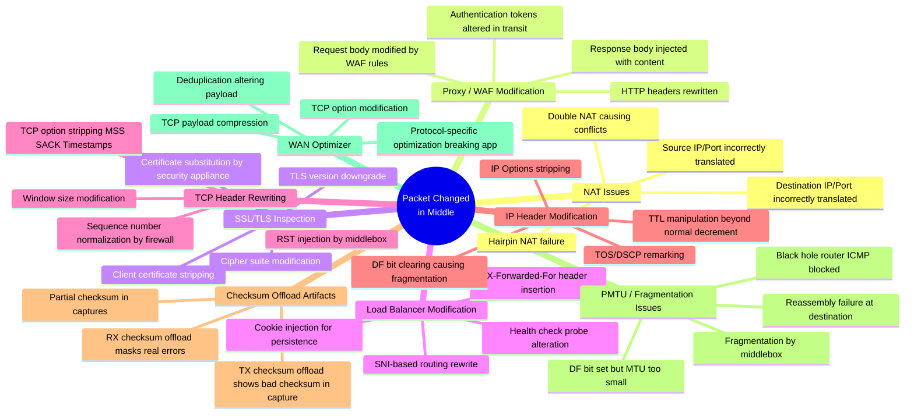
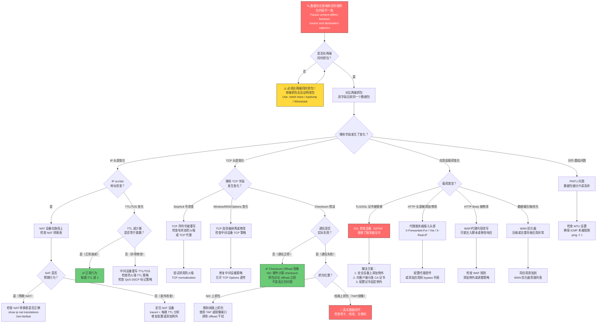
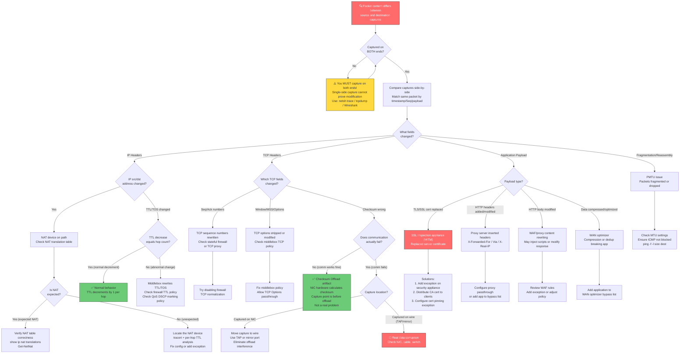

# Scenario Map: TCP/IP — 中间设备改包 (Packet Changed in Middle)

**Product/Service:** Windows TCP/IP Stack / Network Path  
**Scope:** 数据包在传输路径上被中间设备修改导致通信异常  
**Last Updated:** 2026-03-11

---

## 1. 场景子类型 (Sub-Scenario Mindmap)



---

## 2. 典型症状

| # | 症状描述 | 可能原因 | 严重程度 |
|---|---------|---------|---------|
| 1 | TLS/SSL 握手失败，客户端报证书错误 | SSL 检查设备替换了服务器证书，客户端不信任替换后的 CA | 🔴 高 |
| 2 | 应用层认证失败（token/cookie 被修改） | 代理或 WAF 修改了 HTTP 头部中的认证信息 | 🔴 高 |
| 3 | 服务器看到的源 IP 与客户端真实 IP 不同 | NAT 设备或代理替换了源地址 | 🟡 中 |
| 4 | HTTP 请求成功但响应内容被篡改 | 代理注入了额外内容（广告、脚本、安全警告页面） | 🟡 中 |
| 5 | 间歇性通信失败：部分请求成功，部分失败 | 多路径负载均衡，部分路径经过改包设备 | 🔴 高 |
| 6 | Wireshark 抓包显示 TCP checksum 错误 | 可能是 Checksum Offload 导致的假象，也可能是真实损坏 | 🟡 中 |
| 7 | 绕过代理时应用正常，通过代理时失败 | 代理修改了请求/响应内容 | 🟢 低（已定位） |
| 8 | 直连正常，通过 VPN/代理时行为不同 | VPN/代理路径上的中间设备修改了数据包 | 🟡 中 |
| 9 | TCP 连接建立后立即被 RST 断开 | 防火墙/IPS 检测到异常后注入 RST 包 | 🔴 高 |
| 10 | MTU 相关的大包传输失败，小包正常 | 中间设备清除 DF bit 导致分片，或 ICMP 被阻断导致 PMTU 黑洞 | 🟡 中 |

---

## 3. 排查流程图 (Troubleshooting Flowchart)



---

## 4. 详细排查步骤与命令

### Step 1: 两端同时抓包（必须步骤）

> **核心原则：** "改包"只能通过对比两端抓包来证明。单端抓包永远无法确认数据包是否被修改。

**客户端抓包：**

```powershell
# 方法 1: netsh trace（Windows 原生，无需安装）
netsh trace start capture=yes tracefile=C:\Temp\client_trace.etl maxsize=512
# ... 复现问题 ...
netsh trace stop

# 方法 2: Wireshark/tshark
# 启动 Wireshark → 选择网络接口 → 开始捕获
# 或使用命令行:
tshark -i "Ethernet" -w C:\Temp\client_capture.pcapng -f "host <dest_ip>"

# 方法 3: pktmon（Windows 10 2004+/Server 2022+）
pktmon start --capture --pkt-size 0 -f C:\Temp\client_pktmon.etl
# ... 复现问题 ...
pktmon stop
pktmon etl2pcap C:\Temp\client_pktmon.etl --out C:\Temp\client_pktmon.pcapng
```

**服务端抓包：**

```bash
# Linux 服务器
tcpdump -i eth0 -w /tmp/server_capture.pcap host <client_ip> -s 0

# Windows 服务器
netsh trace start capture=yes tracefile=C:\Temp\server_trace.etl maxsize=512
```

### Step 2: 逐字段对比分析

```
# Wireshark 对比步骤：
# 1. 两端分别打开抓包文件
# 2. 找到同一个 TCP 流（按时间戳、Seq 号、payload 内容匹配）
# 3. 右键 → Follow → TCP Stream → 对比两端内容
# 4. 逐字段检查：
#    - IP 层: src IP, dst IP, TTL, TOS/DSCP, IP Options, DF bit
#    - TCP 层: src port, dst port, Seq, Ack, Window, MSS, SACK, Timestamps, Checksum
#    - 应用层: HTTP headers, TLS certificate, payload content
```

### Step 3: IP 层检查

```powershell
# 检查 TTL（源端 TTL 减去目的端 TTL = 经过的跳数）
# 源端抓到的 TTL: 128 (Windows 默认)
# 目的端抓到的 TTL: 如果远小于预期跳数差，说明有设备重写了 TTL

# 追踪路由 + 每跳分析
tracert -d <destination_ip>
# 或更详细的:
pathping -n <destination_ip>

# 检查本机 NAT 配置（Windows Server）
Get-NetNat
Get-NetNatStaticMapping
Get-NetNatSession

# 检查当前连接的地址映射
Get-NetTCPConnection -RemoteAddress <dest_ip> | Select-Object LocalAddress, LocalPort, RemoteAddress, RemotePort, State
```

### Step 4: TCP 层检查

```powershell
# 在 Wireshark 中检查 TCP Options:
# 过滤器: tcp.options.mss or tcp.options.wscale or tcp.options.sack_perm

# 检查 checksum 是否因 offload 导致错误:
# Wireshark → Edit → Preferences → Protocols → TCP → 取消勾选 "Validate the TCP checksum if possible"
# 如果取消验证后不再显示错误，且通信正常 → 是 offload 假象

# 查看网卡 offload 设置
Get-NetAdapterChecksumOffload | Format-List
Get-NetAdapterAdvancedProperty | Where-Object {$_.DisplayName -like "*Offload*" -or $_.DisplayName -like "*Checksum*"} | Format-Table Name, DisplayName, DisplayValue

# 临时禁用 checksum offload（仅用于诊断抓包）
Set-NetAdapterChecksumOffload -Name "Ethernet" -TcpIPv4 Disabled -UdpIPv4 Disabled
# 诊断完成后恢复:
Set-NetAdapterChecksumOffload -Name "Ethernet" -TcpIPv4 TxRxEnabled -UdpIPv4 TxRxEnabled
```

### Step 5: TLS/SSL 证书检查

```powershell
# 从客户端检查服务器证书（经过中间设备路径）
# 如果有 SSL 检查设备，这里看到的是替换后的证书
openssl s_client -connect <dest>:443 -servername <hostname> < nul 2>&1 | Select-String -Pattern "issuer|subject|CN"

# 从服务器同网段检查证书（绕过中间设备）
# 对比两次输出的 issuer — 如果不同，说明有 SSL 检查设备
openssl s_client -connect <dest>:443 -servername <hostname> < nul 2>&1

# 使用 curl 查看完整证书链
curl -v --head https://<dest> 2>&1 | Select-String -Pattern "SSL|certificate|issuer|subject"

# 检查 Windows 证书信任存储
certutil -verifyctl AuthRoot
# 查找可疑的企业 CA（可能是 SSL 检查设备的根证书）
Get-ChildItem Cert:\LocalMachine\Root | Where-Object {$_.NotAfter -gt (Get-Date)} | Select-Object Subject, Issuer, NotAfter | Format-Table -AutoSize
```

### Step 6: 代理检查

```powershell
# 检查 WinHTTP 代理设置
netsh winhttp show proxy

# 检查 IE/系统代理设置
Get-ItemProperty "HKCU:\Software\Microsoft\Windows\CurrentVersion\Internet Settings" | Select-Object ProxyEnable, ProxyServer, ProxyOverride, AutoConfigURL

# 检查 GPO 强制代理
reg query "HKLM\SOFTWARE\Policies\Microsoft\Windows\CurrentVersion\Internet Settings" /v ProxySettingsPerUser 2>$null
reg query "HKLM\SOFTWARE\Policies\Microsoft\Windows\CurrentVersion\Internet Settings" /v ProxyServer 2>$null

# 检查 PAC 文件配置
reg query "HKCU\Software\Microsoft\Windows\CurrentVersion\Internet Settings" /v AutoConfigURL 2>$null

# 检查环境变量代理
$env:HTTP_PROXY
$env:HTTPS_PROXY
$env:NO_PROXY

# 测试直连 vs 代理
# 直连测试（绕过代理）
curl --noproxy "*" -v https://<dest> 2>&1 | head -30
# 通过代理测试
curl -x http://<proxy>:<port> -v https://<dest> 2>&1 | head -30
```

### Step 7: MTU / PMTU 检查

```powershell
# 检查当前 MTU 设置
Get-NetIPInterface | Select-Object InterfaceAlias, AddressFamily, NlMtu | Format-Table -AutoSize

# 探测路径 MTU（使用 DF bit）
ping -f -l 1472 <destination_ip>
# 如果失败，逐步减小 payload 大小:
ping -f -l 1400 <destination_ip>
ping -f -l 1300 <destination_ip>
# 直到找到最大不分片的 payload 大小
# Path MTU = payload_size + 28 (20 IP header + 8 ICMP header)

# 检查是否有 ICMP 被阻断（PMTU 黑洞的常见原因）
# 在 Wireshark 中过滤: icmp.type == 3 and icmp.code == 4
# (Destination Unreachable, Fragmentation Needed)
```

### Step 8: 网络连接基础诊断

```powershell
# 详细连接测试
Test-NetConnection -ComputerName <dest> -Port 443 -InformationLevel Detailed

# 查看路由表
Get-NetRoute -AddressFamily IPv4 | Where-Object {$_.DestinationPrefix -ne "0.0.0.0/0"} | Sort-Object DestinationPrefix | Format-Table -AutoSize

# 检查 ARP 表（是否有异常 MAC 地址指向网关）
Get-NetNeighbor -AddressFamily IPv4 | Where-Object {$_.State -ne "Unreachable"} | Format-Table -AutoSize

# 检查 DNS 解析（是否被 DNS 劫持到代理）
Resolve-DnsName <hostname> -Type A
nslookup <hostname>
```

---

## 5. 解决方案

| 问题根因 | 解决方案 | 详细操作 |
|---------|---------|---------|
| **NAT 配置错误** | 修复 NAT 规则 | 检查并修正 NAT 设备上的地址/端口映射规则；确认没有冲突的 NAT 条目 |
| **SSL 检查导致证书错误** | 添加例外或分发 CA | 方案 1：在安全设备上为目标域名添加 SSL 检查豁免；方案 2：将安全设备的根 CA 证书分发到所有客户端受信任根存储 |
| **代理修改内容** | 配置代理旁路 | 将受影响的目标地址/域名添加到代理 bypass 列表；或调整代理规则不修改特定应用的流量 |
| **负载均衡器问题** | 调整 LB 配置 | 修复健康检查配置、会话保持（persistence）设置、头部插入规则；确保 X-Forwarded-For 正确传递 |
| **TCP 序列号重写** | 禁用 TCP normalization | 在防火墙上为受影响流量禁用 TCP normalization / sequence randomization |
| **Checksum Offload 假象** | 无需修复（非真实问题） | 这不是真正的问题；如需精确抓包，可临时禁用 offload 或在线路上用 TAP 抓包 |
| **WAN 优化器破坏应用** | 添加旁路 | 将受影响应用加入 WAN 优化器的 bypass / passthrough 列表 |
| **PMTU 黑洞** | 修复 MTU 或允许 ICMP | 确保路径上 ICMP Type 3 Code 4 未被阻断；或手动降低端点 MTU |
| **WAF 误改内容** | 调整 WAF 规则 | 检查 WAF 规则是否误匹配正常流量，调整规则精度或添加白名单 |

---

## 6. 实用技巧 (Tips)

> 💡 **黄金法则：两端抓包**  
> "改包"只能通过对比两端抓包来证明。如果只有单端抓包，你无法确认任何"被修改"的结论。这是所有改包排查的第一步，没有例外。

> 💡 **Checksum 错误 ≠ 真实损坏**  
> Wireshark 中看到的 TCP checksum 错误几乎都是 TCP Checksum Offload 的假象。NIC 硬件在发送时计算 checksum，但抓包点在 NIC offload 之前，所以抓到的是未计算的 checksum。验证方法：如果通信实际正常（没有重传），那就是 offload 假象。禁用验证：Wireshark → Edit → Preferences → Protocols → TCP → 取消 "Validate the TCP checksum if possible"。

> 💡 **SSL 检查快速检测法**  
> 对比证书 issuer：从客户端用 `openssl s_client -connect <host>:443` 查看证书 issuer。如果 issuer 是企业安全设备的 CA（如 Palo Alto, Zscaler, Fortinet 等）而非网站真实 CA（如 DigiCert, Let's Encrypt），说明有 SSL 检查设备在中间替换了证书。

> 💡 **TTL 变化是正常的**  
> 每经过一个路由器/三层设备，TTL 减 1。这是正常行为。只有 TTL 被重置为一个固定值（如从 52 突变到 128）才说明有设备重写了 TTL。通过公式 `跳数 = 源端TTL - 目的端TTL` 验证是否正常。

> 💡 **NAT 是最常见的"改包"原因**  
> 在所有"数据包在中途被修改"的场景中，NAT 设备是 #1 原因。总是优先检查路径上的 NAT 转换表。使用 `tracert` 结合两端抓包中的 IP 地址差异快速定位 NAT 设备。

> 💡 **Wireshark Expert Info 是你的好朋友**  
> 不要手动逐包检查。使用 Wireshark 的 Analyze → Expert Information 功能快速找到异常：Warnings（重传、乱序）、Errors（checksum 错误、格式错误）会帮你快速定位问题。

> 💡 **代理旁路测试是最快的定位方法**  
> 如果怀疑代理改包，最快的验证方式是：绕过代理直连测试。如果绕过代理后正常，问题就定位到代理了——不需要再花时间分析抓包。`curl --noproxy "*" https://<dest>` 或临时清除代理设置。

> 💡 **ETL 转 PCAPNG**  
> Windows `netsh trace` 生成的 .etl 文件可以用 `etl2pcapng.exe` 转换为 Wireshark 可读的 .pcapng 格式。Microsoft 官方工具：[https://github.com/microsoft/etl2pcapng](https://github.com/microsoft/etl2pcapng)

---

## 7. 参考文档

暂无可验证的参考文档

---

---

# Scenario Map: TCP/IP — Packet Changed in Middle

**Product/Service:** Windows TCP/IP Stack / Network Path  
**Scope:** Packets modified by intermediate devices on the transmission path causing communication failures  
**Last Updated:** 2026-03-11

---

## 1. Sub-Scenario Mindmap


---

## 2. Typical Symptoms

| # | Symptom | Possible Cause | Severity |
|---|---------|---------------|----------|
| 1 | TLS/SSL handshake fails with certificate errors | SSL inspection appliance replaced the server certificate; client doesn't trust the replacement CA | 🔴 High |
| 2 | Application-level authentication fails (token/cookie modified) | Proxy or WAF modified authentication info in HTTP headers | 🔴 High |
| 3 | Source IP seen by server differs from client's real IP | NAT device or proxy replaced source address | 🟡 Medium |
| 4 | HTTP requests succeed but response content is altered | Proxy injected additional content (ads, scripts, security warning pages) | 🟡 Medium |
| 5 | Intermittent failures: some requests succeed, others fail | Multi-path load balancing; some paths traverse a packet-modifying device | 🔴 High |
| 6 | TCP checksum errors in Wireshark captures | Could be Checksum Offload artifact, or real corruption | 🟡 Medium |
| 7 | Application works when bypassing proxy, fails through proxy | Proxy modifies request/response content | 🟢 Low (localized) |
| 8 | Different behavior on direct connection vs through VPN/proxy | Intermediate devices on VPN/proxy path modify packets | 🟡 Medium |
| 9 | TCP connection RST immediately after establishment | Firewall/IPS detects anomaly and injects RST packet | 🔴 High |
| 10 | Large packets fail, small packets work (MTU-related) | Middlebox clears DF bit causing fragmentation, or ICMP blocked causing PMTU black hole | 🟡 Medium |

---

## 3. Troubleshooting Flowchart



---

## 4. Detailed Troubleshooting Steps with Commands

### Step 1: Capture on BOTH Ends Simultaneously (MANDATORY)

> **Core Principle:** "Packet modification" can ONLY be proven by comparing captures from both ends. A single-side capture can never confirm that a packet was modified in transit.

**Client-side capture:**

```powershell
# Method 1: netsh trace (Windows native, no installation required)
netsh trace start capture=yes tracefile=C:\Temp\client_trace.etl maxsize=512
# ... reproduce the issue ...
netsh trace stop

# Method 2: Wireshark/tshark
# Launch Wireshark → select interface → start capture
# Or via command line:
tshark -i "Ethernet" -w C:\Temp\client_capture.pcapng -f "host <dest_ip>"

# Method 3: pktmon (Windows 10 2004+ / Server 2022+)
pktmon start --capture --pkt-size 0 -f C:\Temp\client_pktmon.etl
# ... reproduce the issue ...
pktmon stop
pktmon etl2pcap C:\Temp\client_pktmon.etl --out C:\Temp\client_pktmon.pcapng
```

**Server-side capture:**

```bash
# Linux server
tcpdump -i eth0 -w /tmp/server_capture.pcap host <client_ip> -s 0

# Windows server
netsh trace start capture=yes tracefile=C:\Temp\server_trace.etl maxsize=512
```

### Step 2: Field-by-Field Comparison

```
# Wireshark comparison steps:
# 1. Open capture files from both ends
# 2. Locate the same TCP stream (match by timestamp, Seq number, payload content)
# 3. Right-click → Follow → TCP Stream → compare content from both sides
# 4. Check each field:
#    - IP layer: src IP, dst IP, TTL, TOS/DSCP, IP Options, DF bit
#    - TCP layer: src port, dst port, Seq, Ack, Window, MSS, SACK, Timestamps, Checksum
#    - Application layer: HTTP headers, TLS certificate, payload content
```

### Step 3: IP Layer Inspection

```powershell
# Check TTL (source TTL minus destination TTL = hops traversed)
# Source capture TTL: 128 (Windows default)
# Destination capture TTL: if much less than expected hop difference, a device rewrote the TTL

# Trace route + per-hop analysis
tracert -d <destination_ip>
# Or more detailed:
pathping -n <destination_ip>

# Check local NAT configuration (Windows Server)
Get-NetNat
Get-NetNatStaticMapping
Get-NetNatSession

# Check current connection address mapping
Get-NetTCPConnection -RemoteAddress <dest_ip> | Select-Object LocalAddress, LocalPort, RemoteAddress, RemotePort, State
```

### Step 4: TCP Layer Inspection

```powershell
# In Wireshark, check TCP Options:
# Display filter: tcp.options.mss or tcp.options.wscale or tcp.options.sack_perm

# Check if checksum errors are caused by offload:
# Wireshark → Edit → Preferences → Protocols → TCP → uncheck "Validate the TCP checksum if possible"
# If errors disappear after disabling validation and communication works → offload artifact

# View NIC offload settings
Get-NetAdapterChecksumOffload | Format-List
Get-NetAdapterAdvancedProperty | Where-Object {$_.DisplayName -like "*Offload*" -or $_.DisplayName -like "*Checksum*"} | Format-Table Name, DisplayName, DisplayValue

# Temporarily disable checksum offload (for diagnostic capture accuracy ONLY)
Set-NetAdapterChecksumOffload -Name "Ethernet" -TcpIPv4 Disabled -UdpIPv4 Disabled
# Restore after diagnostics:
Set-NetAdapterChecksumOffload -Name "Ethernet" -TcpIPv4 TxRxEnabled -UdpIPv4 TxRxEnabled
```

### Step 5: TLS/SSL Certificate Inspection

```powershell
# From client: check server certificate (through middlebox path)
# If SSL inspection exists, this shows the REPLACED certificate
openssl s_client -connect <dest>:443 -servername <hostname> < nul 2>&1 | Select-String -Pattern "issuer|subject|CN"

# From server's subnet: check certificate (bypassing middlebox)
# Compare the issuer from both outputs — if different, SSL inspection is present
openssl s_client -connect <dest>:443 -servername <hostname> < nul 2>&1

# Use curl to see full certificate chain
curl -v --head https://<dest> 2>&1 | Select-String -Pattern "SSL|certificate|issuer|subject"

# Check Windows certificate trust stores
certutil -verifyctl AuthRoot
# Look for suspicious enterprise CAs (possibly SSL inspection root cert)
Get-ChildItem Cert:\LocalMachine\Root | Where-Object {$_.NotAfter -gt (Get-Date)} | Select-Object Subject, Issuer, NotAfter | Format-Table -AutoSize
```

### Step 6: Proxy Inspection

```powershell
# Check WinHTTP proxy settings
netsh winhttp show proxy

# Check IE/system proxy settings
Get-ItemProperty "HKCU:\Software\Microsoft\Windows\CurrentVersion\Internet Settings" | Select-Object ProxyEnable, ProxyServer, ProxyOverride, AutoConfigURL

# Check GPO-enforced proxy
reg query "HKLM\SOFTWARE\Policies\Microsoft\Windows\CurrentVersion\Internet Settings" /v ProxySettingsPerUser 2>$null
reg query "HKLM\SOFTWARE\Policies\Microsoft\Windows\CurrentVersion\Internet Settings" /v ProxyServer 2>$null

# Check PAC file configuration
reg query "HKCU\Software\Microsoft\Windows\CurrentVersion\Internet Settings" /v AutoConfigURL 2>$null

# Check environment variable proxies
$env:HTTP_PROXY
$env:HTTPS_PROXY
$env:NO_PROXY

# Test direct vs proxy connection
# Direct test (bypass proxy)
curl --noproxy "*" -v https://<dest> 2>&1 | head -30
# Through proxy test
curl -x http://<proxy>:<port> -v https://<dest> 2>&1 | head -30
```

### Step 7: MTU / PMTU Inspection

```powershell
# Check current MTU settings
Get-NetIPInterface | Select-Object InterfaceAlias, AddressFamily, NlMtu | Format-Table -AutoSize

# Probe path MTU (with DF bit set)
ping -f -l 1472 <destination_ip>
# If fails, gradually decrease payload size:
ping -f -l 1400 <destination_ip>
ping -f -l 1300 <destination_ip>
# Until you find the maximum non-fragmented payload size
# Path MTU = payload_size + 28 (20 IP header + 8 ICMP header)

# Check if ICMP is being blocked (common cause of PMTU black holes)
# In Wireshark, filter: icmp.type == 3 and icmp.code == 4
# (Destination Unreachable, Fragmentation Needed)
```

### Step 8: Baseline Network Diagnostics

```powershell
# Detailed connection test
Test-NetConnection -ComputerName <dest> -Port 443 -InformationLevel Detailed

# View routing table
Get-NetRoute -AddressFamily IPv4 | Where-Object {$_.DestinationPrefix -ne "0.0.0.0/0"} | Sort-Object DestinationPrefix | Format-Table -AutoSize

# Check ARP table (look for unexpected MAC addresses pointing to gateway)
Get-NetNeighbor -AddressFamily IPv4 | Where-Object {$_.State -ne "Unreachable"} | Format-Table -AutoSize

# Check DNS resolution (possible DNS hijack to proxy)
Resolve-DnsName <hostname> -Type A
nslookup <hostname>
```

---

## 5. Solutions

| Root Cause | Solution | Details |
|-----------|----------|---------|
| **NAT misconfiguration** | Fix NAT rules | Check and correct address/port mapping rules on the NAT device; ensure no conflicting NAT entries |
| **SSL inspection causing cert errors** | Add exception or distribute CA | Option 1: Add SSL inspection bypass for the target domain on the security appliance; Option 2: Distribute the appliance's root CA certificate to all client trusted root stores |
| **Proxy modifying content** | Configure proxy bypass | Add the affected destination address/domain to the proxy bypass list; or adjust proxy rules to not modify traffic for the specific application |
| **Load balancer issues** | Adjust LB configuration | Fix health check config, session persistence settings, header insertion rules; ensure X-Forwarded-For is passed correctly |
| **TCP sequence number rewriting** | Disable TCP normalization | Disable TCP normalization / sequence randomization on the firewall for affected traffic flows |
| **Checksum offload artifact** | No fix needed (not a real problem) | This is not an actual issue; for accurate captures, temporarily disable offload or use a TAP on the wire |
| **WAN optimizer breaking app** | Add bypass | Add the affected application to the WAN optimizer's bypass / passthrough list |
| **PMTU black hole** | Fix MTU or allow ICMP | Ensure ICMP Type 3 Code 4 is not blocked on the path; or manually lower the endpoint MTU |
| **WAF incorrectly modifying content** | Adjust WAF rules | Check if WAF rules are incorrectly matching legitimate traffic; refine rules or add whitelist entries |

---

## 6. Practical Tips

> 💡 **Golden Rule: Capture on BOTH Ends**  
> "Packet modification" can ONLY be proven by comparing captures from both ends. If you only have a single-side capture, you cannot confirm any "modified in transit" conclusion. This is the first step of all packet modification investigations, no exceptions.

> 💡 **Checksum Errors ≠ Real Corruption**  
> TCP checksum errors seen in Wireshark are almost always TCP Checksum Offload artifacts. The NIC hardware calculates the checksum at send time, but the capture point is before the NIC offload, so the captured checksum hasn't been computed yet. Validation: if communication actually works (no retransmissions), it's an offload artifact. Disable validation: Wireshark → Edit → Preferences → Protocols → TCP → uncheck "Validate the TCP checksum if possible".

> 💡 **Quick SSL Inspection Detection**  
> Compare the certificate issuer: from the client, use `openssl s_client -connect <host>:443` and check the issuer. If the issuer is an enterprise security appliance CA (e.g., Palo Alto, Zscaler, Fortinet) rather than the real website CA (e.g., DigiCert, Let's Encrypt), an SSL inspection appliance is replacing the certificate in the middle.

> 💡 **TTL Changes Are Normal**  
> Every router/L3 device decrements TTL by 1. This is normal behavior. Only when TTL is reset to a fixed value (e.g., jumping from 52 back to 128) does it indicate a device rewrote the TTL. Verify with: `hops = source_TTL - destination_TTL`.

> 💡 **NAT Is the #1 Cause of "Packet Changed"**  
> Among all "packet modified in transit" scenarios, NAT devices are the number one cause. Always check NAT translation tables first on path devices. Use `tracert` combined with IP address differences between the two captures to quickly locate the NAT device.

> 💡 **Wireshark Expert Info Is Your Best Friend**  
> Don't inspect packets one by one manually. Use Wireshark's Analyze → Expert Information to quickly find anomalies: Warnings (retransmissions, out-of-order), Errors (checksum errors, malformed packets) help you pinpoint issues fast.

> 💡 **Proxy Bypass Test Is the Fastest Localization**  
> If you suspect proxy modification, the fastest validation is: test with a direct connection bypassing the proxy. If it works without the proxy, the problem is localized — no need to spend time analyzing captures. Use `curl --noproxy "*" https://<dest>` or temporarily clear the proxy settings.

> 💡 **Converting ETL to PCAPNG**  
> Windows `netsh trace` generates .etl files that can be converted to Wireshark-readable .pcapng format using `etl2pcapng.exe`. Microsoft official tool: [https://github.com/microsoft/etl2pcapng](https://github.com/microsoft/etl2pcapng)

---

## 7. References

No verified reference documents at this time.
