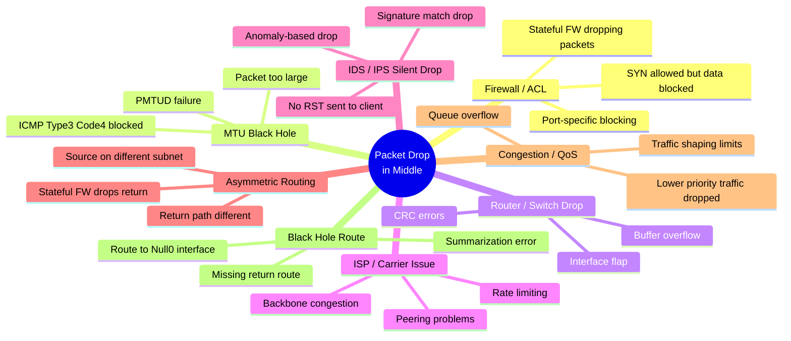
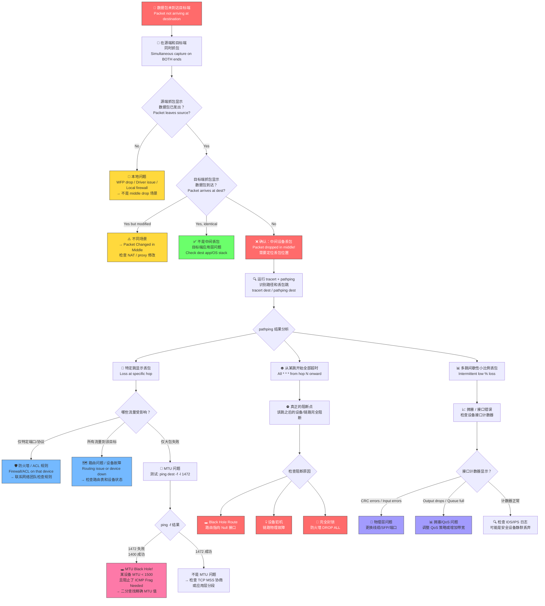
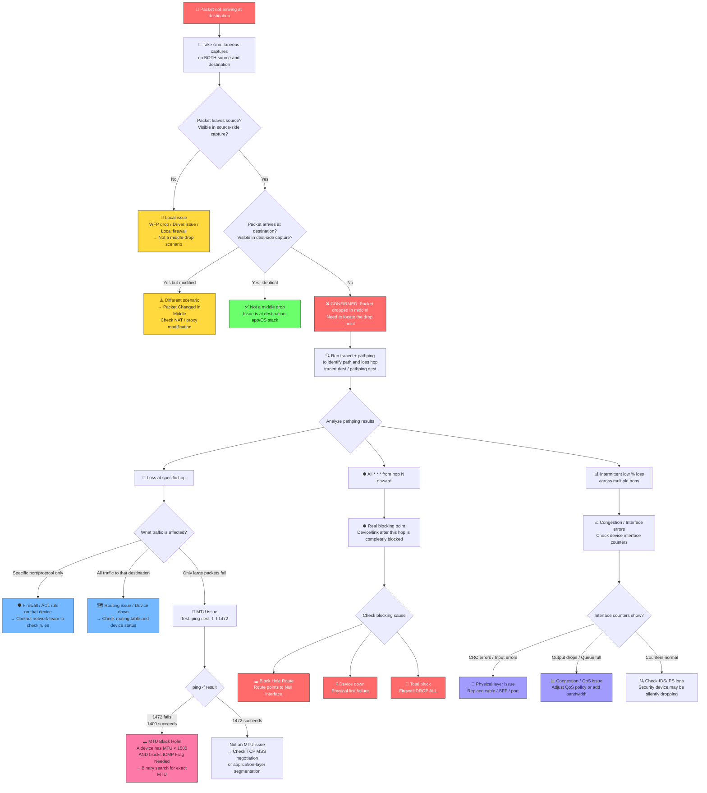

# Scenario Map: TCP/IP — 中间设备丢包 (Packet Drop in Middle)

**Product/Service:** Windows TCP/IP Stack / Network Path  
**Scope:** 数据包在源端和目标端之间的网络路径上被丢弃  
**Last Updated:** 2026-03-11

---

## 核心概念

> **"Middle" 指源端和目标端之间的 ANY 设备：路由器、交换机、防火墙、负载均衡器、ISP 设备、IDS/IPS。**  
> 证明"中间丢包"的唯一方法是：**在源端和目标端同时抓包**，源端发出了、目标端没收到 → 中间丢了。

---

## 1. 子场景分类 (Sub-types)



---

## 2. 典型症状

| # | 症状 | 可能的原因 |
|---|------|-----------|
| 1 | **间歇性连通：** ping 有时通有时不通，有 % loss | 拥塞丢包、接口错误、不稳定链路 |
| 2 | **pathping 在特定跳显示丢包** | 该跳设备或其上游链路存在问题 |
| 3 | **tracert 在某跳超时，但后续跳正常响应** | 该路由器限制了 ICMP 回复速率（**不一定是问题**） |
| 4 | **tracert 从某跳开始全部 `* * *`** | 真正的阻断点 — 流量到此为止 |
| 5 | **大文件传输失败，但小请求正常** | MTU Black Hole — PMTUD 失败 |
| 6 | **TCP 连接建立成功，但数据传输挂起（Window Size 变为 0）** | 中间设备篡改或丢弃数据包 |
| 7 | **单向通信：A→B 正常，B→A 失败** | 非对称路由 — 回程走了不同路径，有状态防火墙丢弃 |
| 8 | **只有特定端口/协议不通，其他正常** | 防火墙/ACL 规则精确匹配 |
| 9 | **Wireshark 中大量 TCP Retransmission** | 数据包在路径中被丢弃，TCP 层不断重传 |
| 10 | **TTL 值异常偏低** | 可能存在路由环路，包在环路中被消耗 |

---

## 3. 排查流程图 (Troubleshooting Flowchart)



---

## 4. 详细排查步骤与关键命令

### Step 1: 确认"中间丢包" — 双端同时抓包

**这是最关键的一步。** 没有双端抓包，无法证明是中间丢包。

```powershell
# === 源端 (Source) ===
# 方法 1: netsh trace (推荐，内置，低开销)
netsh trace start capture=yes tracefile=c:\source_trace.etl maxsize=512
# ... 复现问题 ...
netsh trace stop

# 方法 2: pktmon (Windows Server 2019+ / Windows 10 2004+)
pktmon start --capture --comp all -f c:\source_pktmon.etl
# ... 复现问题 ...
pktmon stop

# === 目标端 (Destination) ===
# 同样的命令，同时启动
netsh trace start capture=yes tracefile=c:\dest_trace.etl maxsize=512
# ... 复现问题 ...
netsh trace stop
```

**分析方法：**
- 源端抓包有 TCP SYN → 目标端没有 → **SYN 被中间丢了**（防火墙最常见）
- 源端抓包有 Data 包 → 目标端没有对应 Data → **数据被中间丢了**（MTU / IDS 最常见）
- 源端有大量 TCP Retransmission → 目标端完全没有对应包 → **确认中间丢包**

### Step 2: 定位丢包跳 (Identify the problematic hop)

```powershell
# tracert — 显示路径（快速，但不显示丢包率）
tracert <destination_ip>
tracert -d <destination_ip>          # -d 不解析 DNS，更快

# pathping — 显示每一跳的丢包率（需等待约 5 分钟，结果更精确）
pathping <destination_ip>
pathping -n <destination_ip>         # -n 不解析 DNS，更快
pathping -q 100 <destination_ip>     # -q 指定每跳发送的查询数（默认 100）

# 持续 ping — 观察丢包模式
ping <destination_ip> -t             # 持续 ping，Ctrl+C 停止，查看 % loss
ping <destination_ip> -t -l 1400     # 用较大包持续 ping，更容易暴露问题
```

**解读 pathping 输出：**
```
                   Source to Here   This Node/Link
Hop  RTT    Lost/Sent = Pct  Lost/Sent = Pct  Address
  0                                           192.168.1.10
                                0/ 100 =  0%   |
  1   1ms     0/ 100 =  0%     0/ 100 =  0%  192.168.1.1
                                0/ 100 =  0%   |
  2  15ms     0/ 100 =  0%     0/ 100 =  0%  10.0.0.1
                               12/ 100 = 12%   |       ← 这条链路有 12% 丢包！
  3  45ms    12/ 100 = 12%     0/ 100 =  0%  10.1.1.1  ← 到这里累积 12% 丢包
```
- **"This Node/Link" 列** 才是关键 — 显示该跳本身贡献的丢包率
- **"Source to Here" 列** 是累积丢包率

### Step 3: MTU 问题诊断

```powershell
# MTU 测试：-f = Don't Fragment，-l = 包大小
# 标准以太网 MTU = 1500，减去 IP(20) + ICMP(8) 头 = 1472
ping <destination_ip> -f -l 1472    # 如果失败 → MTU < 1500
ping <destination_ip> -f -l 1400    # 缩小测试
ping <destination_ip> -f -l 1300    # 继续缩小
# 二分查找直到找到精确的最大可通过大小

# 失败时会看到:
# "Packet needs to be fragmented but DF set."

# 查看本地接口 MTU
netsh interface ipv4 show subinterfaces

# 临时降低本地 MTU 作为 workaround
netsh interface ipv4 set subinterface "Ethernet" mtu=1400 store=persistent
```

**MTU Black Hole 的经典场景：**
1. VPN 隧道封装额外头部（GRE +24, IPsec +50-80），实际可用 MTU 减少
2. PPPoE 连接 MTU = 1492（而非 1500）
3. 某些云环境 / SD-WAN MTU 更低
4. 中间设备**阻止了 ICMP Type 3 Code 4 (Fragmentation Needed)** → PMTUD 失败 → 大包永远传不过去

### Step 4: 防火墙 / ACL 排查

```powershell
# 测试特定端口连通性
Test-NetConnection <destination_ip> -Port 443
Test-NetConnection <destination_ip> -Port 80
Test-NetConnection <destination_ip> -Port 3389

# 对比：ICMP 通但 TCP 不通 → 防火墙按端口/协议过滤
ping <destination_ip>                          # 成功
Test-NetConnection <destination_ip> -Port 443  # 失败
# → 几乎肯定是中间防火墙阻止了 TCP 443

# 检查是 SYN 被丢还是 SYN-ACK 被丢（在源端 Wireshark 中）
# 过滤: tcp.flags.syn==1 && tcp.flags.ack==0
# 如果只看到 SYN 重传，没有 SYN-ACK → SYN 被中间丢弃
# 如果看到 SYN-ACK 但后续 ACK/Data 丢失 → 可能是 stateful FW 问题
```

### Step 5: 非对称路由排查

```powershell
# 从两端分别 tracert 到对方
# === 在 A 端 ===
tracert -d <B_ip>

# === 在 B 端 ===
tracert -d <A_ip>

# 如果路径不同（非对称），且中间有 stateful firewall
# → 防火墙只在一个方向看到了连接建立，另一个方向的包被当作"无效连接"丢弃
```

### Step 6: 高级诊断

```powershell
# pktmon 查看丢包组件（Windows Server 2019+）
pktmon start --capture --comp all --type drop
# ... 复现 ...
pktmon stop
pktmon format c:\PktMon.etl -o c:\pktmon_drops.txt
# 查看 drop reason 字段

# TTL 分析（在 Wireshark 中）
# 正常 TTL: Linux 起始 64，Windows 起始 128
# 如果收到的 TTL 为 120 → 经过了 8 跳 (128 - 120 = 8)
# 如果 tracert 显示只有 5 跳但 TTL 减了 8 → 有隐藏跳/可能路由环路

# TCP 重传分析（Wireshark 过滤）
# tcp.analysis.retransmission — 显示所有重传
# tcp.analysis.fast_retransmission — 快速重传（收到 3 个 DupACK）
# tcp.analysis.rto — 超时重传（更严重，通常是完全丢包）
```

---

## 5. 解决方案

| 根因 | 解决方案 | 实施方 |
|------|---------|--------|
| **防火墙/ACL 阻止** | 在特定设备上添加允许规则；确保 ICMP Type 3 Code 4 放行 | 网络/安全团队 |
| **MTU Black Hole** | 降低客户端 MTU (`netsh interface ipv4 set subinterface`)；修复阻止 ICMP 的设备；启用 TCP MSS Clamping | 网络团队 / 客户端 |
| **路由器接口错误** | 检查接口健康状态；更换 SFP/线缆/端口；清除接口计数器后观察 | 网络团队 |
| **ISP 问题** | 提供 traceroute/pathping 证据，联系 ISP 报告其跳位丢包 | ISP |
| **非对称路由** | 修复路由使路径对称；或将 stateful FW 改为允许非对称流量 | 网络团队 |
| **拥塞/QoS** | 调整 QoS 策略提高关键流量优先级；升级带宽 | 网络团队 |
| **IDS/IPS 静默丢弃** | 检查 IDS/IPS 日志匹配规则，添加例外白名单 | 安全团队 |
| **Black Hole Route** | 修复路由表，移除指向 Null 接口的错误路由 | 网络团队 |

---

## 6. 排查经验与 Tips

> 💡 **Tip 1:** **必须在两端同时抓包** — 这是证明"中间丢包"的唯一方法。单端抓包只能看到重传，无法证明包在哪里丢的。

> 💡 **Tip 2:** **pathping 优于 tracert 定位丢包点。** tracert 只显示路径，pathping 显示每跳的**丢包率 %**。但 pathping 需要等约 5 分钟完成统计。

> 💡 **Tip 3:** **tracert 某跳超时 ≠ 该跳有问题！** 很多路由器**限制 ICMP 回复速率**，所以 tracert 在该跳显示 `* * *`，但实际数据流量正常通过。只有从该跳开始**全部超时**才说明是真正的阻断点。

> 💡 **Tip 4:** **MTU Black Hole 的经典表现是 "ping 通但大文件传不了"。** 立刻用 `ping -f -l 1472` 测试。如果 1472 失败但 1400 成功，就是 MTU 问题。

> 💡 **Tip 5:** **Wireshark 中大量 TCP Retransmission = 中间设备丢包的强信号。** 特别是 RTO (Retransmission Timeout) 类型的重传，通常意味着包完全丢失而非仅仅延迟。

> 💡 **Tip 6:** **比较收到包的 TTL 值。** 如果 TTL 比预期低很多，可能存在额外跳（路由环路会快速消耗 TTL）。

> 💡 **Tip 7:** **如果只有 TCP SYN 被丢但 ICMP (ping) 正常 → 几乎肯定是防火墙规则。** 防火墙通常按端口/协议过滤，ICMP 可能被放行但 TCP 特定端口被阻止。

> 💡 **Tip 8:** **ISP 问题排查：从两个方向做 traceroute。** 使用 Looking Glass 工具从 ISP 侧反向 traceroute，证明丢包点在 ISP 网络内部。

> 💡 **Tip 9:** **时间相关的丢包（工作时间丢包多，夜间正常）→ 拥塞。** 不依赖时间的持续丢包 → 配置问题或硬件故障。

> 💡 **Tip 10:** **pktmon drop monitoring** (`pktmon start --type drop`) 可以捕获 Windows 协议栈内部的丢包原因，对于排查本地是否丢包非常有用。

---

## 7. 参考资料

暂无可验证的参考文档

---

---

# Scenario Map: TCP/IP — Packet Drop in Middle (Network Path)

**Product/Service:** Windows TCP/IP Stack / Network Path  
**Scope:** Packets being dropped on the network path between source and destination  
**Last Updated:** 2026-03-11

---

## Core Concept

> **"Middle" means ANY device between source and destination: routers, switches, firewalls, load balancers, ISP equipment, IDS/IPS.**  
> The ONLY way to prove "dropped in the middle" is: **capture on BOTH source and destination simultaneously** — source sent it, destination never received it → dropped in the middle.

---

## 1. Sub-types (Mindmap)


---

## 2. Typical Symptoms

| # | Symptom | Likely Cause |
|---|---------|-------------|
| 1 | **Intermittent connectivity:** ping works sometimes, fails sometimes (% loss) | Congestion, interface errors, unstable link |
| 2 | **pathping shows loss at a specific hop** | That hop's device or upstream link has issues |
| 3 | **tracert times out at a specific hop but later hops respond** | That router rate-limits ICMP replies (**not necessarily a problem**) |
| 4 | **tracert shows all `* * *` from a certain hop onward** | Real blocking point — traffic stops here |
| 5 | **Large file transfers fail but small requests work** | MTU Black Hole — PMTUD failure |
| 6 | **TCP connections establish but data transfer hangs (Window Size drops to 0)** | Middle device dropping or modifying data packets |
| 7 | **One-way communication: A→B works, B→A fails** | Asymmetric routing — return path goes through a different (blocking) device |
| 8 | **Only specific port/protocol fails, everything else works** | Firewall/ACL rule matching precisely |
| 9 | **Massive TCP Retransmissions in Wireshark** | Packets dropped on the path, TCP layer retransmitting |
| 10 | **TTL value abnormally low** | Possible routing loop consuming TTL hops |

---

## 3. Troubleshooting Flowchart



---

## 4. Detailed Troubleshooting Steps with Key Commands

### Step 1: Confirm "Middle Drop" — Simultaneous Capture on Both Ends

**This is the most critical step.** Without dual-end captures, you cannot prove it's a middle drop.

```powershell
# === Source Side ===
# Method 1: netsh trace (recommended — built-in, low overhead)
netsh trace start capture=yes tracefile=c:\source_trace.etl maxsize=512
# ... reproduce the issue ...
netsh trace stop

# Method 2: pktmon (Windows Server 2019+ / Windows 10 2004+)
pktmon start --capture --comp all -f c:\source_pktmon.etl
# ... reproduce the issue ...
pktmon stop

# === Destination Side ===
# Same commands, started at the same time
netsh trace start capture=yes tracefile=c:\dest_trace.etl maxsize=512
# ... reproduce the issue ...
netsh trace stop
```

**Analysis approach:**
- Source has TCP SYN → Destination doesn't → **SYN dropped in middle** (most likely firewall)
- Source has Data packets → Destination missing corresponding Data → **Data dropped in middle** (MTU / IDS most likely)
- Source shows massive TCP Retransmissions → Destination has none of those packets → **Confirmed middle drop**

### Step 2: Locate the Problematic Hop

```powershell
# tracert — shows the path (fast, but no loss percentage)
tracert <destination_ip>
tracert -d <destination_ip>          # -d = no DNS resolution, faster

# pathping — shows loss % at each hop (wait ~5 minutes for full statistics)
pathping <destination_ip>
pathping -n <destination_ip>         # -n = no DNS resolution, faster
pathping -q 100 <destination_ip>     # -q = queries per hop (default 100)

# Continuous ping — observe loss pattern
ping <destination_ip> -t             # continuous ping, Ctrl+C to stop, check % loss
ping <destination_ip> -t -l 1400     # larger packets, more likely to expose issues
```

**Reading pathping output:**
```
                   Source to Here   This Node/Link
Hop  RTT    Lost/Sent = Pct  Lost/Sent = Pct  Address
  0                                           192.168.1.10
                                0/ 100 =  0%   |
  1   1ms     0/ 100 =  0%     0/ 100 =  0%  192.168.1.1
                                0/ 100 =  0%   |
  2  15ms     0/ 100 =  0%     0/ 100 =  0%  10.0.0.1
                               12/ 100 = 12%   |       ← This LINK has 12% loss!
  3  45ms    12/ 100 = 12%     0/ 100 =  0%  10.1.1.1  ← Cumulative 12% to here
```
- **"This Node/Link" column** is the key — shows loss contributed by that specific hop
- **"Source to Here" column** is cumulative loss

### Step 3: MTU Issue Diagnosis

```powershell
# MTU test: -f = Don't Fragment, -l = payload size
# Standard Ethernet MTU = 1500, minus IP(20) + ICMP(8) headers = 1472
ping <destination_ip> -f -l 1472    # If fails → MTU < 1500 somewhere on path
ping <destination_ip> -f -l 1400    # Try smaller
ping <destination_ip> -f -l 1300    # Keep narrowing down
# Binary search until you find the exact maximum passable size

# Failure message:
# "Packet needs to be fragmented but DF set."

# Check local interface MTU
netsh interface ipv4 show subinterfaces

# Lower local MTU as a workaround
netsh interface ipv4 set subinterface "Ethernet" mtu=1400 store=persistent
```

**Classic MTU Black Hole scenarios:**
1. VPN tunnels add encapsulation headers (GRE +24, IPsec +50-80), reducing effective MTU
2. PPPoE connections: MTU = 1492 (not 1500)
3. Some cloud environments / SD-WAN have even lower MTU
4. A middle device **blocks ICMP Type 3 Code 4 (Fragmentation Needed)** → PMTUD fails → large packets never get through

### Step 4: Firewall / ACL Investigation

```powershell
# Test specific port connectivity
Test-NetConnection <destination_ip> -Port 443
Test-NetConnection <destination_ip> -Port 80
Test-NetConnection <destination_ip> -Port 3389

# Compare: ICMP works but TCP doesn't → firewall filtering by port/protocol
ping <destination_ip>                          # Success
Test-NetConnection <destination_ip> -Port 443  # Failure
# → Almost certainly a middle firewall blocking TCP 443

# In source-side Wireshark, check if SYN or SYN-ACK is being dropped:
# Filter: tcp.flags.syn==1 && tcp.flags.ack==0
# Only SYN retransmissions, no SYN-ACK → SYN dropped in middle
# SYN-ACK received but subsequent ACK/Data lost → possible stateful FW issue
```

### Step 5: Asymmetric Routing Investigation

```powershell
# Tracert from BOTH directions
# === On Host A ===
tracert -d <B_ip>

# === On Host B ===
tracert -d <A_ip>

# If paths are different (asymmetric) AND there's a stateful firewall in between:
# → The firewall only sees the connection setup on one direction
# → Return traffic on the other path is treated as "invalid connection" and dropped
```

### Step 6: Advanced Diagnostics

```powershell
# pktmon drop monitoring (Windows Server 2019+)
pktmon start --capture --comp all --type drop
# ... reproduce ...
pktmon stop
pktmon format c:\PktMon.etl -o c:\pktmon_drops.txt
# Check the "drop reason" field

# TTL analysis (in Wireshark):
# Default starting TTL: Linux = 64, Windows = 128
# If received TTL = 120 → traversed 8 hops (128 - 120 = 8)
# If tracert shows only 5 hops but TTL decreased by 8 → hidden hops / possible routing loop

# TCP retransmission analysis (Wireshark filters):
# tcp.analysis.retransmission — all retransmissions
# tcp.analysis.fast_retransmission — fast retransmit (3 DupACKs received)
# tcp.analysis.rto — retransmission timeout (more severe, usually total drop)
```

---

## 5. Solutions

| Root Cause | Solution | Owner |
|-----------|----------|-------|
| **Firewall/ACL blocking** | Add allow rule on the specific device; ensure ICMP Type 3 Code 4 is permitted | Network / Security team |
| **MTU Black Hole** | Lower client MTU (`netsh interface ipv4 set subinterface`); fix device blocking ICMP; enable TCP MSS Clamping | Network team / Client |
| **Router interface errors** | Check interface health; replace SFP/cable/port; clear counters and monitor | Network team |
| **ISP issue** | Provide traceroute/pathping evidence showing loss at their hop; escalate to ISP | ISP |
| **Asymmetric routing** | Fix routing to ensure symmetric paths; or configure stateful FW to allow asymmetric traffic | Network team |
| **Congestion/QoS** | Adjust QoS policy to prioritize critical traffic; upgrade bandwidth | Network team |
| **IDS/IPS silent drop** | Check IDS/IPS logs for matching rule; add exception/whitelist | Security team |
| **Black hole route** | Fix routing table; remove erroneous route pointing to Null interface | Network team |

---

## 6. Troubleshooting Tips

> 💡 **Tip 1:** **ALWAYS capture on BOTH ends simultaneously** — this is the ONLY way to prove "dropped in middle." Single-end capture only shows retransmissions, not where the drop happens.

> 💡 **Tip 2:** **pathping is better than tracert for finding the loss point.** tracert shows the path; pathping shows the **loss percentage** at each hop. However, pathping takes ~5 minutes to gather statistics.

> 💡 **Tip 3:** **tracert timeout at a specific hop ≠ that hop is the problem!** Many routers **rate-limit ICMP replies**, so tracert shows `* * *` at that hop, but actual data traffic passes through fine. Only when **all hops from that point onward time out** is it a real blocking point.

> 💡 **Tip 4:** **MTU Black Hole classic sign: "ping works but large data transfers hang."** Immediately test with `ping -f -l 1472`. If 1472 fails but 1400 succeeds, it's an MTU issue.

> 💡 **Tip 5:** **Massive TCP Retransmissions in Wireshark = strong indicator of middle device dropping.** Especially RTO (Retransmission Timeout) type retransmissions — these usually mean complete packet loss, not just delay.

> 💡 **Tip 6:** **Compare TTL values of received packets.** If TTL is much lower than expected, extra hops exist (routing loops rapidly consume TTL).

> 💡 **Tip 7:** **If only TCP SYN is dropped but ICMP (ping) works → almost certainly a firewall rule.** Firewalls typically filter by port/protocol — ICMP may be allowed while specific TCP ports are blocked.

> 💡 **Tip 8:** **For ISP issues, traceroute from BOTH directions.** Use Looking Glass tools to run a reverse traceroute from the ISP side, proving the loss point is within their network.

> 💡 **Tip 9:** **Time-correlated loss (high during business hours, fine at night) → congestion.** Time-independent, persistent loss → configuration issue or hardware failure.

> 💡 **Tip 10:** **pktmon drop monitoring** (`pktmon start --type drop`) captures drop reasons inside the Windows networking stack — invaluable for determining whether drops are local or truly in the middle.

---

## 7. References

No verified reference documents at this time.
