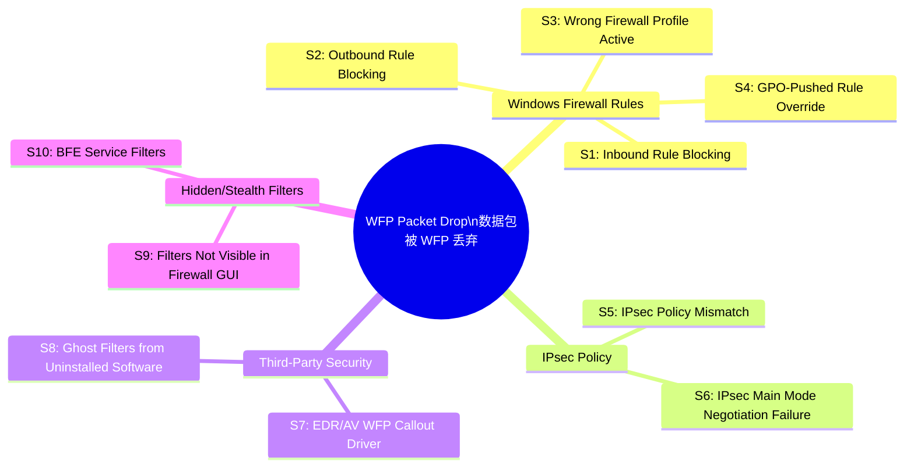
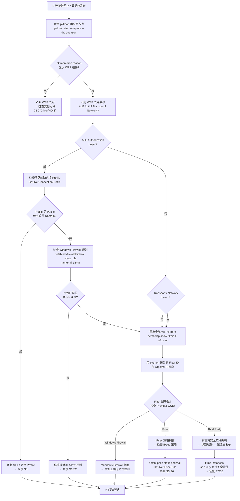
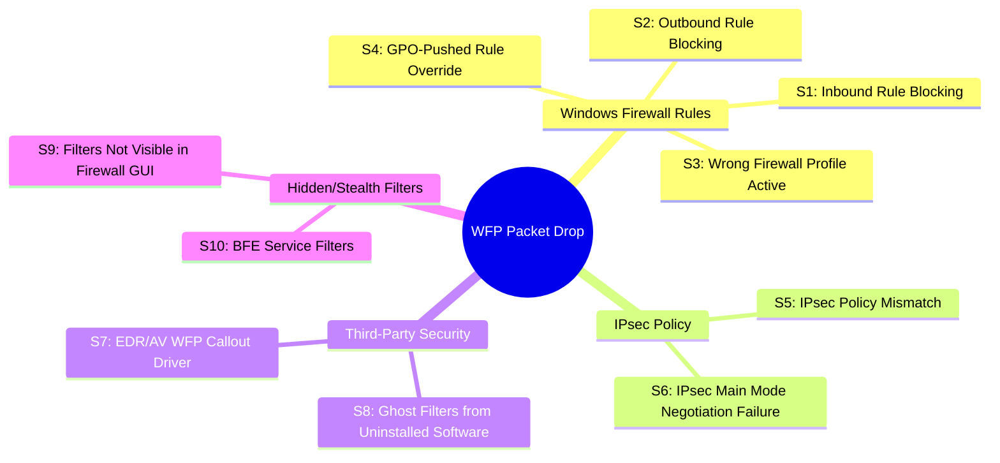
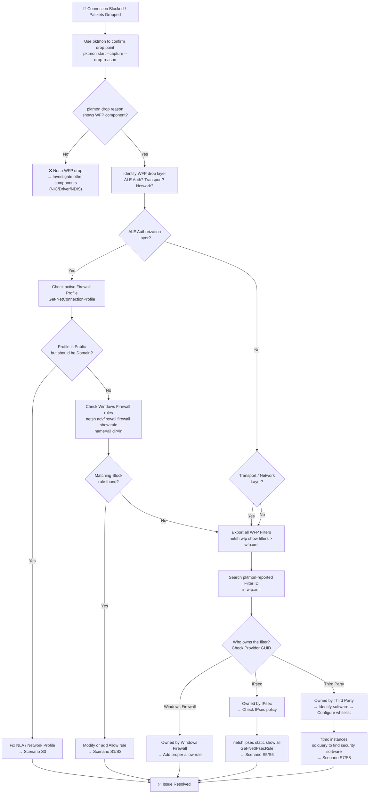

# Scenario Map: TCP/IP — WFP 丢包 (Packet Drop by WFP)

**Product/Service:** Windows TCP/IP Stack / Windows Filtering Platform  
**Scope:** 数据包被 Windows Filtering Platform 层丢弃  
**Last Updated:** 2026-03-11

---

## 📌 中文版

---

## 1. 场景概述 (Scenario Overview)

### 什么是 WFP (Windows Filtering Platform)?

Windows Filtering Platform (WFP) 是 Windows 操作系统中内置的 **内核模式网络过滤框架**。它并不是一个直接面向用户的功能，而是一个底层平台，为以下组件提供统一的包过滤和连接过滤能力：

- **Windows Firewall (Windows 防火墙)** — 最常见的 WFP 消费者，所有 Windows Firewall 规则最终都被翻译为 WFP filter
- **IPsec** — IPsec 策略的强制执行通过 WFP 的 ALE (Application Layer Enforcement) 层实现
- **第三方安全软件** — CrowdStrike Falcon、Microsoft Defender for Endpoint、Symantec Endpoint Protection、Carbon Black、SentinelOne 等 EDR/AV 产品都通过 **WFP Callout Driver** 注册自己的过滤逻辑

### WFP 架构层级

WFP 由多个 **过滤层 (Filtering Layers)** 组成，数据包在流经 TCP/IP 协议栈时会在不同层级被检查：

| WFP Layer | 作用 | 典型过滤场景 |
|-----------|------|-------------|
| **ALE (Application Layer Enforcement)** | 应用层连接授权 | Windows Firewall 规则（按应用程序、端口、协议过滤） |
| **Transport Layer** | 传输层过滤 | TCP/UDP 端口级别过滤 |
| **Network Layer** | 网络层过滤 | IP 地址级别过滤 |
| **Forward Layer** | 转发层过滤 | 路由转发场景（如 Hyper-V 虚拟交换机） |
| **Stream Layer** | 数据流过滤 | 深度包检测 (DPI)、内容过滤 |

### WFP Callout Driver 机制

第三方安全软件通过注册 **WFP Callout Driver** 将自己的过滤逻辑挂钩到 WFP 层中。这些 callout driver：

- 运行在 **内核模式**，拥有对数据包的完全控制
- 可以 **允许、阻止、修改** 数据包
- 不一定会出现在 Windows Firewall GUI 中 — 这是排查的难点
- 即使卸载了对应软件，callout driver 注册的 WFP filter 可能 **残留** 在系统中

### 场景全景图



> 这张图帮你快速定位：你的 WFP 丢包属于哪个类别的问题。

---

## 2. 典型症状 (Typical Symptoms)

| 你看到的症状 | 可能的场景 | 跳转 |
|-------------|-----------|------|
| A 到 B 连接正常，但 B 到 A 被阻止 (单向阻断) | Inbound 防火墙规则阻止 | → [S1](#场景-s1-windows-firewall-inbound-规则阻止) |
| 特定端口/协议被阻止，其他端口正常工作 | 端口级别防火墙规则 | → [S1](#场景-s1-windows-firewall-inbound-规则阻止) / [S2](#场景-s2-windows-firewall-outbound-规则阻止) |
| pktmon 显示 drop reason 为 WFP 组件 | 确认是 WFP 丢包 | → [排查流程图](#3-排查流程图-troubleshooting-flowchart) |
| `netsh wfp show state` 输出中有 DROP action 的 filter | 存在活跃的 DROP 规则 | → [S9](#场景-s9-gui-不可见的隐藏-filter) |
| 网络抓包显示 SYN 已发送，但无 SYN-ACK 返回 | 目标端 WFP 阻止入站 | → [S1](#场景-s1-windows-firewall-inbound-规则阻止) |
| 安全策略变更后连接突然中断 | GPO/策略推送的新规则 | → [S4](#场景-s4-gpo-推送的防火墙规则覆盖) |
| 禁用 Windows Firewall 后连接恢复 | 防火墙规则问题 (但不应以此为最终解决方案) | → [S1](#场景-s1-windows-firewall-inbound-规则阻止) - [S4](#场景-s4-gpo-推送的防火墙规则覆盖) |
| 连接到 Domain 网络时正常，切到 Public WiFi 时失败 | 防火墙 Profile 差异 | → [S3](#场景-s3-防火墙-profile-错误公共网络-vs-域网络) |
| 卸载某安全软件后网络问题出现或持续 | 残留 WFP filter | → [S8](#场景-s8-已卸载软件的残留-ghost-filter) |
| IPsec 协商日志显示 failure | IPsec 策略不匹配 | → [S5](#场景-s5-ipsec-策略不匹配导致丢包) |

---

## 3. 排查流程图 (Troubleshooting Flowchart)



---

## 4. 各场景详细排查步骤

### 场景 S1: Windows Firewall Inbound 规则阻止

**症状：** 远程主机无法连接本机特定端口，但本机可以主动连接出去。

**排查步骤：**

```powershell
# 1. 确认 pktmon 丢包原因
pktmon start --capture --drop-reason --comp all
# 复现问题后停止
pktmon stop
pktmon etl2pcap pktmon.etl --drop-only

# 2. 查看丢包统计
pktmon counters

# 3. 检查当前活跃的防火墙 Profile
Get-NetConnectionProfile

# 4. 列出所有 Inbound 规则
netsh advfirewall firewall show rule name=all dir=in | more

# 5. 查找特定端口的规则
netsh advfirewall firewall show rule name=all dir=in | findstr /i "LocalPort.*<目标端口>"

# 6. 查找所有 Block 规则
Get-NetFirewallRule | Where-Object {$_.Action -eq 'Block' -and $_.Direction -eq 'Inbound' -and $_.Enabled -eq 'True'} | 
    Select-Object DisplayName, Profile, Action | Format-Table -AutoSize

# 7. 检查特定端口的防火墙过滤情况
Get-NetFirewallPortFilter | Where-Object {$_.LocalPort -eq '<目标端口>'} | 
    Get-NetFirewallRule | Select-Object DisplayName, Direction, Action, Enabled, Profile
```

**解决方法：**

```powershell
# 添加 Inbound 允许规则
New-NetFirewallRule -DisplayName "Allow Inbound TCP <Port>" `
    -Direction Inbound -Protocol TCP -LocalPort <Port> -Action Allow -Profile Any

# 或修改现有 Block 规则
Set-NetFirewallRule -DisplayName "<规则名>" -Action Allow
```

---

### 场景 S2: Windows Firewall Outbound 规则阻止

**症状：** 本机无法连接远程主机特定端口，但远程主机能连接本机。

> ⚠️ 默认情况下 Windows Firewall 的 Outbound 策略是 **Allow**。如果 Outbound 出现 Block，通常是 **企业 GPO 策略** 或管理员手动配置。

**排查步骤：**

```powershell
# 1. 确认 Outbound 默认策略
netsh advfirewall show allprofiles | findstr /i "Firewall Policy"
# 正常应显示: BlockInbound,AllowOutbound

# 2. 查找 Outbound Block 规则
Get-NetFirewallRule | Where-Object {$_.Action -eq 'Block' -and $_.Direction -eq 'Outbound' -and $_.Enabled -eq 'True'} |
    Select-Object DisplayName, Profile, Action | Format-Table -AutoSize

# 3. 如果默认 Outbound 被改为 Block，列出所有 Outbound Allow 规则确认是否遗漏
netsh advfirewall firewall show rule name=all dir=out | findstr /i "Rule Name\|Action\|LocalPort\|RemotePort"
```

**解决方法：**

```powershell
# 添加 Outbound 允许规则
New-NetFirewallRule -DisplayName "Allow Outbound TCP <Port>" `
    -Direction Outbound -Protocol TCP -RemotePort <Port> -Action Allow -Profile Any
```

---

### 场景 S3: 防火墙 Profile 错误（公共网络 vs 域网络）

**症状：** 机器加入了 Domain，但防火墙 Profile 显示为 **Public**。Public Profile 的规则远比 Domain Profile 严格。

> 🔑 **这是最常见的 WFP 丢包根因之一！** 很多管理员只给 Domain Profile 添加了 Allow 规则，但机器实际运行在 Public Profile 下。

**排查步骤：**

```powershell
# 1. 检查当前活跃的网络连接 Profile
Get-NetConnectionProfile

# 2. 查看各 Profile 的防火墙状态
netsh advfirewall show allprofiles

# 3. 如果 Profile 是 Public 但应该是 Domain：
# 检查 NLA (Network Location Awareness) 服务
Get-Service NlaSvc | Select-Object Status, StartType

# 4. 检查是否能联系到 Domain Controller
nltest /dsgetdc:<DomainName>

# 5. 检查 DNS 是否指向 DC
Get-DnsClientServerAddress -InterfaceAlias "Ethernet*" | Select-Object InterfaceAlias, ServerAddresses
```

**解决方法：**

```powershell
# 方法 1: 重启 NLA 服务 (让系统重新检测网络类型)
Restart-Service NlaSvc

# 方法 2: 手动设置 Network Category (临时)
Set-NetConnectionProfile -InterfaceAlias "<网卡名>" -NetworkCategory DomainAuthenticated
# 注意: DomainAuthenticated 需要实际能联系到 DC

# 方法 3: 如果是 DNS 问题导致无法检测到 Domain
# 修复 DNS 配置，确保指向 Domain Controller
Set-DnsClientServerAddress -InterfaceAlias "<网卡名>" -ServerAddresses "<DC_IP>"
```

---

### 场景 S4: GPO 推送的防火墙规则覆盖

**症状：** 本地添加的 Allow 规则不生效，因为 GPO 推送的 Block 规则优先级更高。

**排查步骤：**

```powershell
# 1. 检查 GPO 应用结果
gpresult /h gpresult.html
# 打开 gpresult.html 查看 "Windows Firewall with Advanced Security" 相关策略

# 2. 查看哪些防火墙规则来自 GPO
Get-NetFirewallRule | Where-Object {$_.PolicyStoreSource -ne 'PersistentStore'} |
    Select-Object DisplayName, Direction, Action, PolicyStoreSource | Format-Table -AutoSize

# 3. 检查是否 GPO 设置了 "Apply local firewall rules: No"
# 如果是，则本地规则完全被忽略
netsh advfirewall show allprofiles | findstr /i "LocalFirewallRules\|LocalConSecRules"

# 4. 强制刷新 GPO 查看是否有变化
gpupdate /force
```

**解决方法：**

- 需要在 **Group Policy** 层面修改防火墙规则
- 如果 GPO 设置了 "Do not apply local firewall rules"，只有 GPO 规则生效
- 联系 Active Directory / GPO 管理员修改策略

---

### 场景 S5: IPsec 策略不匹配导致丢包

**症状：** 连接失败，WFP 丢包指向 IPsec 相关的 filter。通常是因为一端配置了 IPsec 要求但另一端没有，或者 IPsec 参数不匹配。

**排查步骤：**

```powershell
# 1. 查看 Legacy IPsec 策略 (netsh ipsec - 旧式)
netsh ipsec static show all

# 2. 查看 Modern IPsec 规则 (PowerShell)
Get-NetIPsecRule | Select-Object DisplayName, Enabled, InboundSecurity, OutboundSecurity, Phase1AuthSet | Format-Table -AutoSize

# 3. 查看 IPsec Main Mode SA (Security Associations)
Get-NetIPsecMainModeSA

# 4. 查看 IPsec Quick Mode SA
Get-NetIPsecQuickModeSA

# 5. 查看连接安全规则 (Connection Security Rules)
netsh advfirewall consec show rule name=all

# 6. 检查 WFP 状态中的 IPsec 相关 filter
netsh wfp show filters > C:\temp\wfp-filters.xml
# 在输出中搜索 "IPSEC" 或 "IKEEXT"
```

**解决方法：**

```powershell
# 如果不需要 IPsec，移除策略
Remove-NetIPsecRule -DisplayName "<规则名>"

# 如果需要 IPsec，确保两端配置匹配:
# - 相同的认证方法 (Kerberos/Certificate/PSK)
# - 相同的加密算法
# - 相同的 IPsec 模式 (Transport/Tunnel)

# 豁免特定流量不走 IPsec
New-NetIPsecRule -DisplayName "Exempt Traffic to <IP>" `
    -RemoteAddress <IP> -InboundSecurity None -OutboundSecurity None
```

---

### 场景 S6: IPsec Main Mode 协商失败

**症状：** IPsec 策略存在，但 Main Mode (Phase 1) 协商超时或失败，导致所有受保护的流量被 WFP 丢弃。

**排查步骤：**

```powershell
# 1. 开启 IPsec 审核日志
auditpol /set /subcategory:"IPsec Main Mode" /success:enable /failure:enable
auditpol /set /subcategory:"IPsec Quick Mode" /success:enable /failure:enable

# 2. 查看事件日志中的 IPsec 事件
Get-WinEvent -LogName Security -FilterXPath "*[System[EventID=4653 or EventID=4654 or EventID=4655]]" -MaxEvents 20 |
    Select-Object TimeCreated, Id, Message | Format-List

# 3. 检查 IKE/AuthIP 服务状态
Get-Service IKEEXT | Select-Object Status, StartType

# 4. 检查证书 (如果使用 Certificate 认证)
Get-ChildItem Cert:\LocalMachine\My | Select-Object Subject, NotAfter, HasPrivateKey
```

---

### 场景 S7: 第三方 EDR/AV 的 WFP Callout Driver

**症状：** Windows Firewall 规则没有任何 Block，但连接仍被 WFP 阻止。第三方安全软件（CrowdStrike Falcon、Microsoft Defender for Endpoint、Symantec、Carbon Black、SentinelOne 等）通过 WFP Callout Driver 实施自己的过滤策略。

> 🔑 **关键：** 这些 Callout Driver 创建的 WFP filter 不会显示在 Windows Firewall GUI 中！必须用 `netsh wfp show filters` 导出查看。

**排查步骤：**

```powershell
# 1. 确认 pktmon 丢包的 Filter ID
pktmon start --capture --drop-reason --comp all
# 复现后
pktmon stop

# 2. 导出全部 WFP Filters (警告: 输出可能非常大，10MB+)
netsh wfp show filters > C:\temp\wfp-filters.xml

# 3. 用 pktmon 报告的 Filter ID 在 wfp-filters.xml 中搜索
# 找到 filter 后查看 "providerKey" 字段确认属于哪个软件

# 4. 查看已加载的 Filter Driver (可能发现第三方 WFP callout)
fltmc instances

# 5. 查找系统中的安全软件服务
sc query | findstr /i "crowd\|symantec\|mcafee\|defender\|carbon\|sentinel\|trend\|sophos\|eset"

# 6. 查看已注册的 WFP callout drivers
netsh wfp show callouts > C:\temp\wfp-callouts.xml

# 7. 常见第三方 WFP Provider GUID 参考:
# CrowdStrike: 搜索 "CrowdStrike" 或 "CSFalcon"
# Symantec: 搜索 "Symantec" 或 "SEP"
# Carbon Black: 搜索 "CarbonBlack" 或 "Cb"
```

**解决方法：**

- 在对应安全软件的管理控制台中添加 **白名单/例外** 规则
- 联系安全软件厂商确认是否有已知的 WFP filter 问题
- **不建议** 直接卸载安全软件，除非作为诊断步骤并获得安全团队批准

---

### 场景 S8: 已卸载软件的残留 Ghost Filter

**症状：** 之前安装过某安全软件，已卸载，但 WFP filter 仍然残留在系统中，继续阻止流量。

> ⚠️ 卸载安全软件时，如果 BFE (Base Filtering Engine) 服务未正确清理，WFP filter 会变成"幽灵"规则持续生效。

**排查步骤：**

```powershell
# 1. 导出 WFP Filters 并搜索已卸载软件的名称
netsh wfp show filters > C:\temp\wfp-filters.xml
# 搜索已卸载软件的关键词

# 2. 查看 WFP Provider 列表
netsh wfp show providers > C:\temp\wfp-providers.xml
# 查找属于已卸载软件的 provider

# 3. 确认软件确实已卸载
Get-WmiObject -Class Win32_Product | Where-Object {$_.Name -match "<软件名>"} | Select-Object Name, Version

# 4. 检查残留的服务和驱动
sc query type=driver | findstr /i "<软件名>"
Get-WindowsDriver -Online | Where-Object {$_.ProviderName -match "<软件名>"}
```

**解决方法：**

```powershell
# 方法 1: 重启 BFE 服务 (清理非持久化 filter)
Restart-Service BFE
# 注意: 重启 BFE 会短暂中断所有网络连接和 Windows Firewall

# 方法 2: 重启系统 (推荐第一步尝试)
Restart-Computer

# 方法 3: 如果重启无效，使用厂商提供的清理工具
# CrowdStrike: CrowdStrike Sensor Removal Tool
# Symantec: CleanWipe / SymDiag
# McAfee: MCPR (McAfee Consumer Product Removal)

# 方法 4: 手动清理 WFP filter (高风险，仅最后手段)
# 需要使用 WFP API 通过编程方式删除特定 filter
# 参考 Microsoft WFP API 文档
```

---

### 场景 S9: GUI 不可见的隐藏 Filter

**症状：** Windows Firewall Advanced Security GUI (wf.msc) 中看不到任何 Block 规则，但 WFP 层存在阻止 filter。

**这种情况出现在：**
- 第三方软件通过 WFP API 直接注册的 filter (绕过 Windows Firewall 管理)
- BFE 内置的默认 filter
- 通过 `netsh wfp` 或 WFP API 创建的 filter (不经过 Windows Firewall 管理层)

**排查步骤：**

```powershell
# 1. 导出完整 WFP 状态
netsh wfp show state > C:\temp\wfp-state.xml
netsh wfp show filters > C:\temp\wfp-filters.xml
netsh wfp show netevents > C:\temp\wfp-netevents.xml

# 2. 查看最近的 WFP 网络事件 (包含丢包记录)
netsh wfp show netevents

# 3. 使用 pktmon 获取 Drop 的 Filter ID
pktmon start --capture --drop-reason
# 复现问题
pktmon stop

# 4. 在 wfp-filters.xml 中搜索该 Filter ID
# 关注以下字段:
#   - filterId: pktmon 报告的 ID
#   - displayData.name: filter 的名称
#   - providerKey: 谁创建了这个 filter
#   - action.type: FWP_ACTION_BLOCK 表示阻止

# 5. 统计 WFP 中所有 BLOCK action 的 filter
# (在 wfp-filters.xml 中搜索 "FWP_ACTION_BLOCK")
```

---

### 场景 S10: BFE 服务级别 Filter

**症状：** BFE (Base Filtering Engine) 服务自身维护了一些系统级别的 WFP filter，这些 filter 用于强制执行默认的网络安全策略。

**排查步骤：**

```powershell
# 1. 检查 BFE 服务状态
Get-Service BFE | Select-Object Status, StartType

# 2. BFE 是 Windows Firewall 的基础服务
# 如果 BFE 服务被停止或禁用，Windows Firewall 和 IPsec 都会失效
# 某些管理员可能错误地禁用了 BFE

# 3. 如果 BFE 启动失败，检查依赖
sc qc BFE
sc queryex BFE

# 4. 检查 BFE 相关的事件日志
Get-WinEvent -LogName "Microsoft-Windows-Windows Firewall With Advanced Security/Firewall" -MaxEvents 20 |
    Select-Object TimeCreated, Id, Message | Format-List
```

---

## 5. 通用诊断命令速查 (Quick Command Reference)

### 5.1 pktmon 系列 (数据包监控)

```powershell
# 带丢包原因的完整捕获
pktmon start --capture --drop-reason --comp all

# 停止并转换格式
pktmon stop
pktmon etl2pcap pktmon.etl

# 查看各组件丢包统计
pktmon counters

# 仅查看丢包的 etl (过滤)
pktmon etl2pcap pktmon.etl --drop-only
```

### 5.2 netsh wfp 系列 (WFP 状态查看)

```powershell
# 导出所有 WFP Filters (⚠️ 输出巨大，必须重定向到文件)
netsh wfp show filters > C:\temp\wfp-filters.xml

# 查看 WFP 当前状态
netsh wfp show state > C:\temp\wfp-state.xml

# 查看最近的 WFP 网络事件
netsh wfp show netevents > C:\temp\wfp-netevents.xml

# 查看已注册的 WFP Callouts
netsh wfp show callouts > C:\temp\wfp-callouts.xml

# 查看 WFP Providers
netsh wfp show providers > C:\temp\wfp-providers.xml
```

### 5.3 防火墙规则查询

```powershell
# 所有 Inbound 规则
netsh advfirewall firewall show rule name=all dir=in

# 所有 Outbound 规则
netsh advfirewall firewall show rule name=all dir=out

# 查看各 Profile 状态
netsh advfirewall show allprofiles

# 当前活跃的防火墙 Profile
Get-NetConnectionProfile

# 所有启用的 Block 规则
Get-NetFirewallRule | Where-Object {$_.Action -eq 'Block' -and $_.Enabled -eq 'True'} |
    Select-Object DisplayName, Direction, Profile | Format-Table -AutoSize

# 统计活跃规则总数
Get-NetFirewallRule | Where-Object {$_.Enabled -eq 'True'} | Measure-Object
```

### 5.4 IPsec 诊断

```powershell
# Legacy IPsec 策略
netsh ipsec static show all

# Modern IPsec 规则
Get-NetIPsecRule

# Connection Security Rules
netsh advfirewall consec show rule name=all

# IPsec SA 状态
Get-NetIPsecMainModeSA
Get-NetIPsecQuickModeSA
```

### 5.5 第三方软件识别

```powershell
# 已加载的 Filter Drivers
fltmc instances

# 查找安全软件服务
sc query | findstr /i "crowd\|symantec\|mcafee\|defender\|carbon\|sentinel\|trend\|sophos\|eset"

# 查看内核驱动
driverquery /v | findstr /i "crowd\|symantec\|mcafee\|wfp\|callout"

# GPO 应用结果
gpresult /h C:\temp\gpresult.html
```

---

## 6. 解决方案总结 (Solutions Summary)

| 场景 | 根因 | 解决方案 |
|------|------|---------|
| S1: Inbound Block | 缺少 Inbound Allow 规则 | `New-NetFirewallRule -Direction Inbound -Protocol TCP -LocalPort <port> -Action Allow` |
| S2: Outbound Block | GPO 设置 Outbound 为 Block | 检查企业策略，添加 Outbound Allow 规则 |
| S3: Wrong Profile | Public Profile 而非 Domain | 修复 NLA 服务，确保 DNS 指向 DC，重启 NlaSvc |
| S4: GPO Override | GPO 推送的 Block 规则覆盖本地规则 | 在 GPO 层面修改策略，或联系 AD 管理员 |
| S5: IPsec Mismatch | IPsec 策略要求但未匹配 | 统一两端 IPsec 配置，或豁免特定流量 |
| S6: IPsec Negotiation | IKE/AuthIP 协商失败 | 检查证书有效性、算法兼容性、时间同步 |
| S7: 3rd Party EDR | 安全软件 WFP Callout 阻止 | 在安全软件管理端添加白名单/例外 |
| S8: Ghost Filters | 卸载软件后残留 WFP filter | 重启系统，使用厂商清理工具，必要时重启 BFE |
| S9: Hidden Filters | GUI 不可见的 WFP filter | 用 `netsh wfp show filters` 导出分析 |
| S10: BFE Filters | BFE 服务级别默认过滤 | 检查 BFE 服务状态和默认安全策略 |

---

## 7. 排查 Tips (Pro Tips)

> 💡 **Tip 1:** Public Profile 比 Domain/Private Profile **严格得多** — 排查的第一步永远是 `Get-NetConnectionProfile` 确认当前 Profile。

> 💡 **Tip 2:** `pktmon` 的 drop reason code 是确认 WFP 丢包 **最快** 的方法，不需要猜测。

> 💡 **Tip 3:** `netsh wfp show filters` 的输出可能 **超过 10MB** — 必须重定向到文件，然后用文本编辑器搜索。

> 💡 **Tip 4:** 卸载安全软件后，WFP filter 可能 **不会自动清除** — 需要重启系统或使用厂商清理工具。

> 💡 **Tip 5:** GPO 推送的防火墙规则 **覆盖** 本地规则 — 始终先用 `gpresult` 检查。

> 💡 **Tip 6:** 临时测试可以用 `netsh advfirewall set allprofiles state off` 禁用防火墙 — **仅用于诊断，必须立即重新启用！**

> 💡 **Tip 7:** WFP Filter ID 是 **全局唯一** 的 — 将 pktmon 报告的 Filter ID 与 `netsh wfp show filters` 输出关联，即可精确定位哪条规则导致了丢包。

> 💡 **Tip 8:** 某些 EDR 产品（如 CrowdStrike Falcon）使用的 WFP Callout Driver **完全不会** 出现在 Windows Firewall GUI 中 — 必须用 `netsh wfp show filters` 和 `netsh wfp show callouts` 导出分析。

> 💡 **Tip 9:** 如果怀疑是第三方 WFP filter 但不确定是哪个软件，搜索 `wfp-filters.xml` 中的 **providerKey** GUID，然后在注册表 `HKLM\SYSTEM\CurrentControlSet\Services` 中搜索对应 GUID 来定位驱动。

---

## 8. 参考文档

暂无可验证的参考文档

---
---
---

## 📌 English Version

---

# Scenario Map: TCP/IP — Packet Drop by WFP (Windows Filtering Platform)

**Product/Service:** Windows TCP/IP Stack / Windows Filtering Platform  
**Scope:** Packets dropped by Windows Filtering Platform layers  
**Last Updated:** 2026-03-11

---

## 1. Scenario Overview

### What is WFP (Windows Filtering Platform)?

Windows Filtering Platform (WFP) is a **kernel-mode network filtering framework** built into the Windows operating system. It is not a user-facing feature but rather a low-level platform that provides unified packet filtering and connection filtering capabilities for:

- **Windows Firewall** — The most common WFP consumer; all Windows Firewall rules are ultimately translated into WFP filters
- **IPsec** — IPsec policy enforcement is implemented through WFP's ALE (Application Layer Enforcement) layers
- **Third-party security software** — CrowdStrike Falcon, Microsoft Defender for Endpoint, Symantec Endpoint Protection, Carbon Black, SentinelOne, and other EDR/AV products register their filtering logic through **WFP Callout Drivers**

### WFP Architecture Layers

WFP consists of multiple **Filtering Layers**. Packets are inspected at different layers as they traverse the TCP/IP stack:

| WFP Layer | Purpose | Typical Filtering Scenario |
|-----------|---------|---------------------------|
| **ALE (Application Layer Enforcement)** | Application-level connection authorization | Windows Firewall rules (filter by application, port, protocol) |
| **Transport Layer** | Transport-level filtering | TCP/UDP port-level filtering |
| **Network Layer** | Network-level filtering | IP address-level filtering |
| **Forward Layer** | Forwarding filtering | Routing/forwarding scenarios (e.g., Hyper-V virtual switch) |
| **Stream Layer** | Data stream filtering | Deep Packet Inspection (DPI), content filtering |

### WFP Callout Driver Mechanism

Third-party security software hooks its filtering logic into WFP layers by registering **WFP Callout Drivers**. These callout drivers:

- Run in **kernel mode** with full control over packets
- Can **allow, block, or modify** packets
- May **not appear** in the Windows Firewall GUI — this is a major troubleshooting challenge
- Even after uninstalling the software, callout driver-registered WFP filters may **persist** in the system

### Scenario Overview Mindmap



> This map helps you quickly identify which category your WFP packet drop belongs to.

---

## 2. Typical Symptoms

| Symptom | Possible Scenario | Jump To |
|---------|-------------------|---------|
| A→B connection works, but B→A is blocked (one-way block) | Inbound firewall rule blocking | → [S1](#scenario-s1-windows-firewall-inbound-rule-blocking) |
| Specific port/protocol blocked, others work fine | Port-level firewall rule | → [S1](#scenario-s1-windows-firewall-inbound-rule-blocking) / [S2](#scenario-s2-windows-firewall-outbound-rule-blocking) |
| pktmon shows drop reason with WFP component | Confirmed WFP drop | → [Flowchart](#3-troubleshooting-flowchart) |
| `netsh wfp show state` reveals DROP action filters | Active DROP rule exists | → [S9](#scenario-s9-hidden-filters-not-visible-in-gui) |
| Network trace shows SYN sent but no SYN-ACK returned | Destination-side WFP blocking inbound | → [S1](#scenario-s1-windows-firewall-inbound-rule-blocking) |
| Connection broke after security policy change | GPO/policy-pushed new rules | → [S4](#scenario-s4-gpo-pushed-firewall-rule-override) |
| Connection restores when Windows Firewall is disabled | Firewall rule issue (but don't use this as the fix!) | → [S1](#scenario-s1-windows-firewall-inbound-rule-blocking) - [S4](#scenario-s4-gpo-pushed-firewall-rule-override) |
| Works on Domain network, fails on Public WiFi | Firewall profile difference | → [S3](#scenario-s3-wrong-firewall-profile-public-vs-domain) |
| Network issues appeared/persist after uninstalling security software | Residual WFP filters | → [S8](#scenario-s8-ghost-filters-from-uninstalled-software) |
| IPsec negotiation logs show failure | IPsec policy mismatch | → [S5](#scenario-s5-ipsec-policy-mismatch) |

---

## 3. Troubleshooting Flowchart



---

## 4. Detailed Troubleshooting Steps per Scenario

### Scenario S1: Windows Firewall Inbound Rule Blocking

**Symptoms:** Remote hosts cannot connect to a specific port on this machine, but this machine can connect outbound.

**Troubleshooting Steps:**

```powershell
# 1. Confirm drop reason with pktmon
pktmon start --capture --drop-reason --comp all
# Reproduce the issue, then stop
pktmon stop
pktmon etl2pcap pktmon.etl --drop-only

# 2. Check drop statistics
pktmon counters

# 3. Check current active Firewall Profile
Get-NetConnectionProfile

# 4. List all Inbound rules
netsh advfirewall firewall show rule name=all dir=in | more

# 5. Find rules for a specific port
netsh advfirewall firewall show rule name=all dir=in | findstr /i "LocalPort.*<target_port>"

# 6. Find all active Block rules
Get-NetFirewallRule | Where-Object {$_.Action -eq 'Block' -and $_.Direction -eq 'Inbound' -and $_.Enabled -eq 'True'} |
    Select-Object DisplayName, Profile, Action | Format-Table -AutoSize

# 7. Check firewall filtering for a specific port
Get-NetFirewallPortFilter | Where-Object {$_.LocalPort -eq '<target_port>'} |
    Get-NetFirewallRule | Select-Object DisplayName, Direction, Action, Enabled, Profile
```

**Solution:**

```powershell
# Add an Inbound Allow rule
New-NetFirewallRule -DisplayName "Allow Inbound TCP <Port>" `
    -Direction Inbound -Protocol TCP -LocalPort <Port> -Action Allow -Profile Any

# Or modify an existing Block rule
Set-NetFirewallRule -DisplayName "<RuleName>" -Action Allow
```

---

### Scenario S2: Windows Firewall Outbound Rule Blocking

**Symptoms:** This machine cannot connect to a specific port on remote hosts, but remote hosts can connect to this machine.

> ⚠️ By default, Windows Firewall's outbound policy is **Allow**. If outbound blocking exists, it's usually from **corporate GPO policy** or manual admin configuration.

**Troubleshooting Steps:**

```powershell
# 1. Check default outbound policy
netsh advfirewall show allprofiles | findstr /i "Firewall Policy"
# Expected: BlockInbound,AllowOutbound

# 2. Find Outbound Block rules
Get-NetFirewallRule | Where-Object {$_.Action -eq 'Block' -and $_.Direction -eq 'Outbound' -and $_.Enabled -eq 'True'} |
    Select-Object DisplayName, Profile, Action | Format-Table -AutoSize

# 3. If default Outbound is changed to Block, list all Outbound Allow rules
netsh advfirewall firewall show rule name=all dir=out | findstr /i "Rule Name\|Action\|LocalPort\|RemotePort"
```

**Solution:**

```powershell
# Add an Outbound Allow rule
New-NetFirewallRule -DisplayName "Allow Outbound TCP <Port>" `
    -Direction Outbound -Protocol TCP -RemotePort <Port> -Action Allow -Profile Any
```

---

### Scenario S3: Wrong Firewall Profile (Public vs Domain)

**Symptoms:** Machine is domain-joined, but the firewall profile shows **Public**. Public profile rules are far more restrictive than Domain profile.

> 🔑 **This is one of the most common root causes of WFP drops!** Many admins only add Allow rules for the Domain profile, but the machine is actually running under the Public profile.

**Troubleshooting Steps:**

```powershell
# 1. Check current active network connection profile
Get-NetConnectionProfile

# 2. View firewall status per profile
netsh advfirewall show allprofiles

# 3. If profile is Public but should be Domain:
# Check NLA (Network Location Awareness) service
Get-Service NlaSvc | Select-Object Status, StartType

# 4. Test connectivity to Domain Controller
nltest /dsgetdc:<DomainName>

# 5. Check DNS pointing to DC
Get-DnsClientServerAddress -InterfaceAlias "Ethernet*" | Select-Object InterfaceAlias, ServerAddresses
```

**Solution:**

```powershell
# Method 1: Restart NLA service (re-detect network type)
Restart-Service NlaSvc

# Method 2: Manually set Network Category (temporary)
Set-NetConnectionProfile -InterfaceAlias "<AdapterName>" -NetworkCategory DomainAuthenticated
# Note: DomainAuthenticated requires actual DC connectivity

# Method 3: If DNS issue prevents Domain detection
# Fix DNS configuration to point to Domain Controller
Set-DnsClientServerAddress -InterfaceAlias "<AdapterName>" -ServerAddresses "<DC_IP>"
```

---

### Scenario S4: GPO-Pushed Firewall Rule Override

**Symptoms:** Locally added Allow rules don't take effect because GPO-pushed Block rules have higher priority.

**Troubleshooting Steps:**

```powershell
# 1. Check GPO application results
gpresult /h gpresult.html
# Open gpresult.html and look for "Windows Firewall with Advanced Security" policies

# 2. Identify which firewall rules come from GPO
Get-NetFirewallRule | Where-Object {$_.PolicyStoreSource -ne 'PersistentStore'} |
    Select-Object DisplayName, Direction, Action, PolicyStoreSource | Format-Table -AutoSize

# 3. Check if GPO set "Apply local firewall rules: No"
# If so, local rules are completely ignored
netsh advfirewall show allprofiles | findstr /i "LocalFirewallRules\|LocalConSecRules"

# 4. Force GPO refresh
gpupdate /force
```

**Solution:**

- Firewall rules must be modified at the **Group Policy** level
- If GPO sets "Do not apply local firewall rules," only GPO rules take effect
- Contact the Active Directory / GPO administrator to modify the policy

---

### Scenario S5: IPsec Policy Mismatch

**Symptoms:** Connection fails, WFP drop points to an IPsec-related filter. Typically because one side requires IPsec but the other doesn't, or IPsec parameters don't match.

**Troubleshooting Steps:**

```powershell
# 1. View Legacy IPsec policies (netsh ipsec - old style)
netsh ipsec static show all

# 2. View Modern IPsec rules (PowerShell)
Get-NetIPsecRule | Select-Object DisplayName, Enabled, InboundSecurity, OutboundSecurity, Phase1AuthSet | Format-Table -AutoSize

# 3. View IPsec Main Mode SA (Security Associations)
Get-NetIPsecMainModeSA

# 4. View IPsec Quick Mode SA
Get-NetIPsecQuickModeSA

# 5. View Connection Security Rules
netsh advfirewall consec show rule name=all

# 6. Check IPsec-related filters in WFP state
netsh wfp show filters > C:\temp\wfp-filters.xml
# Search output for "IPSEC" or "IKEEXT"
```

**Solution:**

```powershell
# If IPsec is not needed, remove the policy
Remove-NetIPsecRule -DisplayName "<RuleName>"

# If IPsec is needed, ensure both sides match:
# - Same authentication method (Kerberos/Certificate/PSK)
# - Same encryption algorithms
# - Same IPsec mode (Transport/Tunnel)

# Exempt specific traffic from IPsec
New-NetIPsecRule -DisplayName "Exempt Traffic to <IP>" `
    -RemoteAddress <IP> -InboundSecurity None -OutboundSecurity None
```

---

### Scenario S6: IPsec Main Mode Negotiation Failure

**Symptoms:** IPsec policy exists, but Main Mode (Phase 1) negotiation times out or fails, causing all protected traffic to be dropped by WFP.

**Troubleshooting Steps:**

```powershell
# 1. Enable IPsec audit logging
auditpol /set /subcategory:"IPsec Main Mode" /success:enable /failure:enable
auditpol /set /subcategory:"IPsec Quick Mode" /success:enable /failure:enable

# 2. Check IPsec events in the Security log
Get-WinEvent -LogName Security -FilterXPath "*[System[EventID=4653 or EventID=4654 or EventID=4655]]" -MaxEvents 20 |
    Select-Object TimeCreated, Id, Message | Format-List

# 3. Check IKE/AuthIP service status
Get-Service IKEEXT | Select-Object Status, StartType

# 4. Check certificates (if using Certificate authentication)
Get-ChildItem Cert:\LocalMachine\My | Select-Object Subject, NotAfter, HasPrivateKey
```

---

### Scenario S7: Third-Party EDR/AV WFP Callout Driver

**Symptoms:** No Block rules in Windows Firewall, but connections are still blocked by WFP. Third-party security software (CrowdStrike Falcon, Microsoft Defender for Endpoint, Symantec, Carbon Black, SentinelOne, etc.) implements its own filtering policies through WFP Callout Drivers.

> 🔑 **Key point:** Filters created by these Callout Drivers will **NOT appear** in the Windows Firewall GUI! You must export them with `netsh wfp show filters`.

**Troubleshooting Steps:**

```powershell
# 1. Confirm the Filter ID from pktmon drop report
pktmon start --capture --drop-reason --comp all
# Reproduce the issue, then
pktmon stop

# 2. Export all WFP Filters (WARNING: output may be very large, 10MB+)
netsh wfp show filters > C:\temp\wfp-filters.xml

# 3. Search for the pktmon-reported Filter ID in wfp-filters.xml
# Look at the "providerKey" field to identify which software owns the filter

# 4. List loaded Filter Drivers (may reveal third-party WFP callouts)
fltmc instances

# 5. Find security software services on the system
sc query | findstr /i "crowd\|symantec\|mcafee\|defender\|carbon\|sentinel\|trend\|sophos\|eset"

# 6. View registered WFP callout drivers
netsh wfp show callouts > C:\temp\wfp-callouts.xml

# 7. Common third-party WFP Provider identification:
# CrowdStrike: Search for "CrowdStrike" or "CSFalcon"
# Symantec: Search for "Symantec" or "SEP"
# Carbon Black: Search for "CarbonBlack" or "Cb"
```

**Solution:**

- Add a **whitelist/exception** rule in the security software's management console
- Contact the security software vendor to check for known WFP filter issues
- **Do not** uninstall security software unless as a diagnostic step with security team approval

---

### Scenario S8: Ghost Filters from Uninstalled Software

**Symptoms:** Previously installed security software has been uninstalled, but WFP filters remain in the system and continue blocking traffic.

> ⚠️ When uninstalling security software, if the BFE (Base Filtering Engine) service doesn't clean up properly, WFP filters become "ghost" rules that keep taking effect.

**Troubleshooting Steps:**

```powershell
# 1. Export WFP Filters and search for the uninstalled software's name
netsh wfp show filters > C:\temp\wfp-filters.xml
# Search for the uninstalled software's keywords

# 2. View WFP Provider list
netsh wfp show providers > C:\temp\wfp-providers.xml
# Look for providers belonging to the uninstalled software

# 3. Confirm the software is actually uninstalled
Get-WmiObject -Class Win32_Product | Where-Object {$_.Name -match "<SoftwareName>"} | Select-Object Name, Version

# 4. Check for residual services and drivers
sc query type=driver | findstr /i "<SoftwareName>"
Get-WindowsDriver -Online | Where-Object {$_.ProviderName -match "<SoftwareName>"}
```

**Solution:**

```powershell
# Method 1: Restart BFE service (clears non-persistent filters)
Restart-Service BFE
# WARNING: Restarting BFE briefly disrupts all network connections and Windows Firewall

# Method 2: Restart the system (recommended first step)
Restart-Computer

# Method 3: If restart doesn't help, use vendor-provided cleanup tools
# CrowdStrike: CrowdStrike Sensor Removal Tool
# Symantec: CleanWipe / SymDiag
# McAfee: MCPR (McAfee Consumer Product Removal)

# Method 4: Manually clean WFP filters (high risk, last resort only)
# Requires programmatic deletion via WFP API
# Refer to Microsoft WFP API documentation
```

---

### Scenario S9: Hidden Filters Not Visible in GUI

**Symptoms:** No Block rules visible in the Windows Firewall Advanced Security GUI (wf.msc), but blocking WFP filters exist.

**This happens when:**
- Third-party software registers filters directly via WFP API (bypassing Windows Firewall management)
- BFE built-in default filters
- Filters created via `netsh wfp` or WFP API (not through the Windows Firewall management layer)

**Troubleshooting Steps:**

```powershell
# 1. Export complete WFP state
netsh wfp show state > C:\temp\wfp-state.xml
netsh wfp show filters > C:\temp\wfp-filters.xml
netsh wfp show netevents > C:\temp\wfp-netevents.xml

# 2. View recent WFP network events (includes drop records)
netsh wfp show netevents

# 3. Get Drop Filter ID from pktmon
pktmon start --capture --drop-reason
# Reproduce issue
pktmon stop

# 4. Search for that Filter ID in wfp-filters.xml
# Key fields to examine:
#   - filterId: the ID reported by pktmon
#   - displayData.name: the filter's name
#   - providerKey: who created this filter
#   - action.type: FWP_ACTION_BLOCK means blocking

# 5. Count all BLOCK action filters in WFP
# (Search wfp-filters.xml for "FWP_ACTION_BLOCK")
```

---

### Scenario S10: BFE Service-Level Filters

**Symptoms:** The BFE (Base Filtering Engine) service itself maintains system-level WFP filters that enforce default network security policies.

**Troubleshooting Steps:**

```powershell
# 1. Check BFE service status
Get-Service BFE | Select-Object Status, StartType

# 2. BFE is the foundation service for Windows Firewall
# If BFE is stopped or disabled, Windows Firewall and IPsec both cease to function
# Some admins may have incorrectly disabled BFE

# 3. If BFE fails to start, check dependencies
sc qc BFE
sc queryex BFE

# 4. Check BFE-related event logs
Get-WinEvent -LogName "Microsoft-Windows-Windows Firewall With Advanced Security/Firewall" -MaxEvents 20 |
    Select-Object TimeCreated, Id, Message | Format-List
```

---

## 5. Quick Command Reference

### 5.1 pktmon Series (Packet Monitoring)

```powershell
# Full capture with drop reasons
pktmon start --capture --drop-reason --comp all

# Stop and convert format
pktmon stop
pktmon etl2pcap pktmon.etl

# View per-component drop statistics
pktmon counters

# Convert drops only
pktmon etl2pcap pktmon.etl --drop-only
```

### 5.2 netsh wfp Series (WFP State Inspection)

```powershell
# Export all WFP Filters (⚠️ huge output, always redirect to file)
netsh wfp show filters > C:\temp\wfp-filters.xml

# View current WFP state
netsh wfp show state > C:\temp\wfp-state.xml

# View recent WFP network events
netsh wfp show netevents > C:\temp\wfp-netevents.xml

# View registered WFP Callouts
netsh wfp show callouts > C:\temp\wfp-callouts.xml

# View WFP Providers
netsh wfp show providers > C:\temp\wfp-providers.xml
```

### 5.3 Firewall Rule Queries

```powershell
# All Inbound rules
netsh advfirewall firewall show rule name=all dir=in

# All Outbound rules
netsh advfirewall firewall show rule name=all dir=out

# View all profiles status
netsh advfirewall show allprofiles

# Current active Firewall Profile
Get-NetConnectionProfile

# All enabled Block rules
Get-NetFirewallRule | Where-Object {$_.Action -eq 'Block' -and $_.Enabled -eq 'True'} |
    Select-Object DisplayName, Direction, Profile | Format-Table -AutoSize

# Count total active rules
Get-NetFirewallRule | Where-Object {$_.Enabled -eq 'True'} | Measure-Object
```

### 5.4 IPsec Diagnostics

```powershell
# Legacy IPsec policies
netsh ipsec static show all

# Modern IPsec rules
Get-NetIPsecRule

# Connection Security Rules
netsh advfirewall consec show rule name=all

# IPsec SA status
Get-NetIPsecMainModeSA
Get-NetIPsecQuickModeSA
```

### 5.5 Third-Party Software Identification

```powershell
# Loaded Filter Drivers
fltmc instances

# Find security software services
sc query | findstr /i "crowd\|symantec\|mcafee\|defender\|carbon\|sentinel\|trend\|sophos\|eset"

# View kernel drivers
driverquery /v | findstr /i "crowd\|symantec\|mcafee\|wfp\|callout"

# GPO application results
gpresult /h C:\temp\gpresult.html
```

---

## 6. Solutions Summary

| Scenario | Root Cause | Solution |
|----------|-----------|----------|
| S1: Inbound Block | Missing Inbound Allow rule | `New-NetFirewallRule -Direction Inbound -Protocol TCP -LocalPort <port> -Action Allow` |
| S2: Outbound Block | GPO set Outbound to Block | Check corporate policy, add Outbound Allow rule |
| S3: Wrong Profile | Public profile instead of Domain | Fix NLA service, ensure DNS points to DC, restart NlaSvc |
| S4: GPO Override | GPO-pushed Block rules override local rules | Modify policy at GPO level, contact AD admin |
| S5: IPsec Mismatch | IPsec policy required but not matched | Unify IPsec config on both sides, or exempt specific traffic |
| S6: IPsec Negotiation | IKE/AuthIP negotiation failure | Check certificate validity, algorithm compatibility, time sync |
| S7: 3rd Party EDR | Security software WFP Callout blocking | Add whitelist/exception in security software management console |
| S8: Ghost Filters | Residual WFP filters from uninstalled software | Restart system, use vendor cleanup tools, restart BFE if needed |
| S9: Hidden Filters | WFP filters not visible in GUI | Export and analyze with `netsh wfp show filters` |
| S10: BFE Filters | BFE service-level default filtering | Check BFE service status and default security policies |

---

## 7. Pro Tips

> 💡 **Tip 1:** Public profile is **far more restrictive** than Domain/Private — always start by running `Get-NetConnectionProfile` to confirm the active profile.

> 💡 **Tip 2:** The pktmon drop reason code is the **fastest way** to confirm a WFP drop — no guessing needed.

> 💡 **Tip 3:** `netsh wfp show filters` output can exceed **10MB** — always redirect to a file and search with a text editor.

> 💡 **Tip 4:** After uninstalling security software, WFP filters may **not be automatically removed** — a system restart or vendor cleanup tool is needed.

> 💡 **Tip 5:** GPO-pushed firewall rules **override** local rules — always check with `gpresult` first.

> 💡 **Tip 6:** For temporary testing, use `netsh advfirewall set allprofiles state off` to disable the firewall — **only for diagnostics, re-enable immediately!**

> 💡 **Tip 7:** WFP Filter IDs are **globally unique** — correlate the pktmon-reported Filter ID with `netsh wfp show filters` output to pinpoint the exact rule causing the drop.

> 💡 **Tip 8:** Some EDR products (e.g., CrowdStrike Falcon) use WFP Callout Drivers that **never appear** in the Windows Firewall GUI — you must use `netsh wfp show filters` and `netsh wfp show callouts` to export and analyze.

> 💡 **Tip 9:** If you suspect a third-party WFP filter but aren't sure which software, search for the **providerKey** GUID in `wfp-filters.xml`, then search the registry under `HKLM\SYSTEM\CurrentControlSet\Services` for that GUID to locate the driver.

---

## 8. References

No verified reference documentation available at this time.
