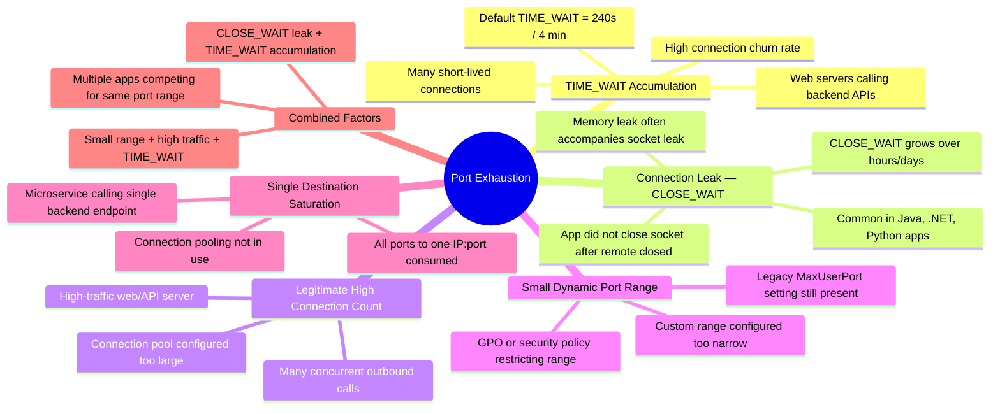
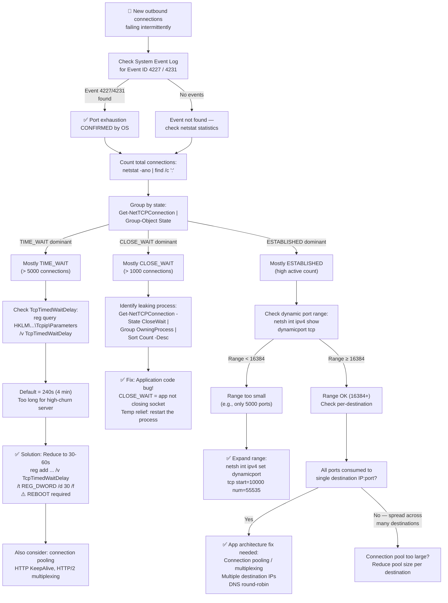

# Scenario Map: TCP/IP — 端口耗尽 (Port Exhaustion)

**Product/Service:** Windows TCP/IP Stack  
**Scope:** 临时端口（Ephemeral Ports）被耗尽导致无法建立新连接  
**Last Updated:** 2026-03-11

---

## 1. 场景概述 (Scenario Overview)

Windows 默认动态端口范围是 **49152–65535**（共 16384 个端口）。当所有临时端口均处于使用中状态（ESTABLISHED、TIME_WAIT、CLOSE_WAIT）时，系统无法为新的出站连接分配源端口，新连接将失败。这通常表现为随机出现的 **"connection refused"** 或 **"address already in use"** 错误，且随时间推移逐渐恶化——服务器重启后恢复正常，但数小时/天后再次出现。

### 子场景分类 (Sub-types)



---

## 2. 典型症状 (Typical Symptoms)

| # | 症状 | 说明 |
|---|------|------|
| 1 | 新建连接失败，错误码 **10048** | `"Only one usage of each socket address (protocol/network address/port) is normally permitted"` — 请求的端口已被占用 |
| 2 | 新建连接失败，错误码 **10055** | `"An operation on a socket could not be performed because the system lacked sufficient buffer space or because a queue was full"` — 无可用缓冲区/端口 |
| 3 | 系统日志 **Event ID 4227** | `TCP/IP failed to establish an outgoing connection because the selected local endpoint was recently used in a connect operation` |
| 4 | 系统日志 **Event ID 4231** | `A request to allocate an ephemeral port number from the global TCP port space has failed due to all such ports being in use` |
| 5 | 应用程序在负载下随机失败 | 低负载时正常，高峰期出错；部分请求成功部分失败 |
| 6 | `netstat -ano` 显示数千个 TIME_WAIT 或 CLOSE_WAIT | TIME_WAIT > 5000 或 CLOSE_WAIT 持续增长是典型标志 |
| 7 | 服务器重启后恢复，但数小时后再次恶化 | CLOSE_WAIT 泄漏的典型模式：重启清除所有连接，然后泄漏再次累积 |
| 8 | 仅出站连接失败，入站监听正常 | 监听端口（如 80、443）不使用临时端口，因此不受影响 |
| 9 | 性能计数器 `\TCPv4\Connection Failures` 持续上升 | 每次分配端口失败都会递增此计数器 |

---

## 3. 排查流程图 (Troubleshooting Flowchart)



---

## 4. 详细排查步骤 (Detailed Diagnostic Steps)

### Step 1：确认端口耗尽（Event Log 检查）

```powershell
# 检查系统日志中是否存在端口耗尽事件
Get-WinEvent -FilterHashtable @{LogName='System'; Id=4227,4231} -MaxEvents 20 |
    Format-Table TimeCreated, Id, Message -AutoSize -Wrap

# 如果上面报错（无匹配事件），说明 OS 层面尚未触发端口耗尽告警
# 继续 Step 2 做主动检查
```

### Step 2：统计当前连接数及状态分布

```powershell
# 总连接数（快速估算）
netstat -ano | find /c ":"

# 按状态分组统计（推荐方式）
Get-NetTCPConnection | Group-Object State | Select-Object Count, Name | Sort-Object Count -Descending

# 分别统计关键状态
netstat -ano | find /c "ESTABLISHED"
netstat -ano | find /c "TIME_WAIT"
netstat -ano | find /c "CLOSE_WAIT"
```

> **判断标准：**
> - TIME_WAIT > 5000 → TIME_WAIT 累积问题
> - CLOSE_WAIT > 1000 且持续增长 → 应用连接泄漏
> - ESTABLISHED > 10000 → 合法高连接数或连接池过大

### Step 3：识别消耗端口最多的进程

```powershell
# TIME_WAIT 最多的前 10 个进程
Get-NetTCPConnection -State TimeWait |
    Group-Object OwningProcess |
    Sort-Object Count -Descending |
    Select-Object -First 10 |
    ForEach-Object {
        [PSCustomObject]@{
            PID = $_.Name
            Count = $_.Count
            ProcessName = (Get-Process -Id $_.Name -ErrorAction SilentlyContinue).ProcessName
        }
    }

# CLOSE_WAIT 最多的前 10 个进程（找到泄漏进程）
Get-NetTCPConnection -State CloseWait |
    Group-Object OwningProcess |
    Sort-Object Count -Descending |
    Select-Object -First 10 |
    ForEach-Object {
        [PSCustomObject]@{
            PID = $_.Name
            Count = $_.Count
            ProcessName = (Get-Process -Id $_.Name -ErrorAction SilentlyContinue).ProcessName
        }
    }

# ESTABLISHED 最多的前 10 个进程
Get-NetTCPConnection -State Established |
    Group-Object OwningProcess |
    Sort-Object Count -Descending |
    Select-Object -First 10 |
    ForEach-Object {
        [PSCustomObject]@{
            PID = $_.Name
            Count = $_.Count
            ProcessName = (Get-Process -Id $_.Name -ErrorAction SilentlyContinue).ProcessName
        }
    }
```

### Step 4：检查动态端口范围

```powershell
# 查看当前 TCP 动态端口范围
netsh int ipv4 show dynamicport tcp

# 查看当前 UDP 动态端口范围
netsh int ipv4 show dynamicport udp

# 检查是否有旧版 MaxUserPort 注册表（Windows XP/2003 遗留）
reg query "HKLM\SYSTEM\CurrentControlSet\Services\Tcpip\Parameters" /v MaxUserPort 2>nul

# 检查 TcpTimedWaitDelay 当前值
reg query "HKLM\SYSTEM\CurrentControlSet\Services\Tcpip\Parameters" /v TcpTimedWaitDelay 2>nul
```

> **默认值参考：**
> - 动态端口范围：Start Port = 49152, Number of Ports = 16384（即 49152–65535）
> - TcpTimedWaitDelay：默认 240 秒（4 分钟），Windows 不接受低于 30 秒的值
> - MaxUserPort：仅对 Windows XP/Server 2003 有效，现代 Windows 使用 `netsh dynamicport`

### Step 5：查看 TCP 统计信息

```powershell
# TCP 协议统计（连接失败、重置等）
netstat -s -p tcp

# 使用性能计数器实时监控
Get-Counter '\TCPv4\Connections Established'
Get-Counter '\TCPv4\Connection Failures'
Get-Counter '\TCPv4\Connections Active'
Get-Counter '\TCPv4\Connections Reset'

# 连续采样 10 次，每秒一次，观察趋势
Get-Counter '\TCPv4\Connection Failures','\TCPv4\Connections Active' -SampleInterval 1 -MaxSamples 10
```

### Step 6：按目标地址分析（排查单目标饱和）

```powershell
# 查看连接到哪些目标 IP:Port 最多
Get-NetTCPConnection -State Established,TimeWait,CloseWait |
    Group-Object RemoteAddress, RemotePort |
    Sort-Object Count -Descending |
    Select-Object -First 20

# 如果某个目标消耗了大量端口，说明是单目标饱和
# 例如：所有 TIME_WAIT 都指向 10.0.0.50:443
```

---

## 5. 解决方案 (Solutions)

### 方案 A：减少 TIME_WAIT 持续时间（适用于 TIME_WAIT 累积）

```powershell
# 将 TcpTimedWaitDelay 从默认 240s 减少到 30s
reg add "HKLM\SYSTEM\CurrentControlSet\Services\Tcpip\Parameters" /v TcpTimedWaitDelay /t REG_DWORD /d 30 /f

# ⚠️ 需要重启才能生效！
# ⚠️ 不要设置为 0 — TIME_WAIT 是 TCP 协议的重要机制（防止旧包混入新连接）
# ⚠️ Windows 会忽略任何低于 30 秒的值
```

### 方案 B：扩大动态端口范围（适用于范围过小或合法高流量）

```powershell
# 将动态端口范围扩大到 10000-65535（共 55535 个端口）
netsh int ipv4 set dynamicport tcp start=10000 num=55535
netsh int ipv4 set dynamicport udp start=10000 num=55535

# 验证更改
netsh int ipv4 show dynamicport tcp

# ⚠️ 立即生效，无需重启
# ⚠️ 确保扩展范围不与已知服务固定端口冲突
```

### 方案 C：修复应用连接泄漏（适用于 CLOSE_WAIT 持续增长）

```
CLOSE_WAIT 状态含义：远端已发送 FIN 关闭连接，但本地应用程序未调用 close() 关闭 socket。

这始终是应用程序代码 Bug — 不是网络问题，不是操作系统问题！

临时缓解：
1. 识别泄漏进程 PID（见 Step 3）
2. 重启该进程（清除所有 CLOSE_WAIT 连接）
3. 联系应用开发团队修复 socket 未关闭的 Bug

常见泄漏模式：
- HTTP client 未调用 response.close() / using 块
- 数据库连接未归还连接池
- try-catch 中异常路径未关闭连接
- 异步操作超时后未清理 socket
```

### 方案 D：启用连接池和复用（减少连接创建频率）

```
针对不同应用场景：

1. IIS / ASP.NET：
   - 启用 HTTP KeepAlive（默认已启用，确认未禁用）
   - 使用 HttpClient 单例模式（避免每次请求创建新 HttpClient）
   - 设置 ServicePointManager.DefaultConnectionLimit = 100+

2. SQL Server 客户端：
   - 确保连接字符串包含 "Pooling=true; Max Pool Size=100"
   - 确保 using 块正确释放 SqlConnection

3. 微服务 / API 调用：
   - 使用 HTTP/2 多路复用（一个 TCP 连接承载多个请求）
   - 配置合理的连接池大小
   - 避免为每个请求创建新的 TCP 连接

4. 通用应用：
   - 代码层面设置 SO_REUSEADDR 选项
   - 对于极端场景可设置 SO_LINGER timeout=0（跳过 TIME_WAIT，但有风险）
```

### 方案 E：解决单目标饱和

```
当所有端口都消耗在同一个目标 IP:Port 时：

- DNS Round-Robin：让目标域名解析到多个 IP，分散连接
- 负载均衡器：在目标端部署 LB，提供多个 VIP
- HTTP/2 / gRPC：多路复用减少连接数
- 连接池 + 复用：避免 connect-request-close 模式
```

---

## 6. 实用技巧 (Practical Tips)

> 💡 **TIME_WAIT 是正常且必要的** — 它防止已关闭连接的残留数据包被新连接误收。不要设置为 0，也不要认为 TIME_WAIT 就是"问题"。只有当 TIME_WAIT 数量导致端口耗尽时才需要调优。

> ⚠️ **CLOSE_WAIT = 应用程序 Bug** — CLOSE_WAIT 意味着远端已关闭连接但本地应用未关闭 socket。这**始终**是应用代码问题，永远不是网络问题。找到泄漏进程并修复代码。

> 📊 **默认 16384 端口听起来很多，但...** — 一个繁忙的 Web 服务器每秒可能创建数百个短连接。如果每个 TIME_WAIT 持续 240 秒：500 连接/秒 × 240 秒 = 120,000 个 TIME_WAIT（远超 16384 端口上限）。

> 🔧 **TcpTimedWaitDelay 最小值是 30 秒** — Windows 内核会忽略任何低于 30 的值。设置为 29 或更低实际等于没有设置。

> 📋 **Event ID 含义速查：**
> - **4227** = TCP/IP 因选定的本地端点最近刚用于连接操作而无法建立出站连接
> - **4231** = 从全局 TCP 端口空间分配临时端口号的请求已失败，因为所有此类端口都在使用中

> 📈 **监控建议：** 设置性能计数器告警，当 `\TCPv4\Connections Active` 超过动态端口范围的 80% 时触发。例如默认范围 16384 × 80% = 约 13100 连接时告警。

> 🚀 **无需重启的快速缓解：**
> - CLOSE_WAIT 泄漏 → 重启泄漏进程即可释放其所有连接
> - TIME_WAIT 累积 → 等待 4 分钟（默认 TIME_WAIT 超时后自动清除）
> - 扩大端口范围 → `netsh int ipv4 set dynamicport` 立即生效

> 🏚️ **MaxUserPort 注册表已过时** — `MaxUserPort` 仅在 Windows XP / Server 2003 上有效。现代 Windows（Vista+）使用 `netsh int ipv4 set dynamicport` 命令。如果同时存在两者，`netsh` 设置优先。

> 🌐 **IIS / Web 服务器专项优化：**
> - 调整 HTTP.sys 连接池大小
> - 确保 HTTP KeepAlive 启用（减少连接创建频率）
> - 考虑 HTTP/2 以多路复用连接（一个 TCP 连接承载所有请求）
> - 检查后端 API 调用是否使用了 HttpClient 单例

---

## 7. 参考资料 (References)

暂无可验证的参考文档

---
---

# Scenario Map: TCP/IP — Port Exhaustion

**Product/Service:** Windows TCP/IP Stack  
**Scope:** Ephemeral port exhaustion preventing new outbound connections  
**Last Updated:** 2026-03-11

---

## 1. Scenario Overview

The Windows default dynamic port range is **49152–65535** (16,384 ports total). When ALL ephemeral ports are in use (ESTABLISHED, TIME_WAIT, CLOSE_WAIT), the OS cannot allocate a source port for new outbound connections, and they fail. This typically manifests as random **"connection refused"** or **"address already in use"** errors that worsen over time — the server works fine after a restart but degrades over hours or days.

### Sub-types


---

## 2. Typical Symptoms

| # | Symptom | Details |
|---|---------|---------|
| 1 | New connections fail with error **10048** | `"Only one usage of each socket address (protocol/network address/port) is normally permitted"` — requested port already in use |
| 2 | New connections fail with error **10055** | `"An operation on a socket could not be performed because the system lacked sufficient buffer space or because a queue was full"` — no buffer/port available |
| 3 | System log **Event ID 4227** | `TCP/IP failed to establish an outgoing connection because the selected local endpoint was recently used in a connect operation` |
| 4 | System log **Event ID 4231** | `A request to allocate an ephemeral port number from the global TCP port space has failed due to all such ports being in use` |
| 5 | Applications fail randomly under load | Works at low load, fails at peak; some requests succeed while others fail |
| 6 | `netstat -ano` shows thousands of TIME_WAIT or CLOSE_WAIT | TIME_WAIT > 5,000 or continuously growing CLOSE_WAIT is a telltale sign |
| 7 | Server recovers after restart but degrades over hours | Classic CLOSE_WAIT leak pattern: restart clears all connections, then leak re-accumulates |
| 8 | Only outbound connections fail; inbound listening works fine | Listening ports (e.g., 80, 443) do not use ephemeral ports and are unaffected |
| 9 | Performance counter `\TCPv4\Connection Failures` rising | Incremented each time ephemeral port allocation fails |

---

## 3. Troubleshooting Flowchart


---

## 4. Detailed Diagnostic Steps

### Step 1: Confirm Port Exhaustion (Event Log Check)

```powershell
# Check System log for port exhaustion events
Get-WinEvent -FilterHashtable @{LogName='System'; Id=4227,4231} -MaxEvents 20 |
    Format-Table TimeCreated, Id, Message -AutoSize -Wrap

# If the above throws "No events were found" — the OS hasn't triggered the exhaustion alert yet
# Proceed to Step 2 for proactive checking
```

### Step 2: Count Current Connections and State Distribution

```powershell
# Quick total connection count
netstat -ano | find /c ":"

# Group by state (recommended approach)
Get-NetTCPConnection | Group-Object State | Select-Object Count, Name | Sort-Object Count -Descending

# Count key states individually
netstat -ano | find /c "ESTABLISHED"
netstat -ano | find /c "TIME_WAIT"
netstat -ano | find /c "CLOSE_WAIT"
```

> **Thresholds:**
> - TIME_WAIT > 5,000 → TIME_WAIT accumulation problem
> - CLOSE_WAIT > 1,000 and growing → Application connection leak
> - ESTABLISHED > 10,000 → Legitimate high load or oversized connection pool

### Step 3: Identify Top Port-Consuming Processes

```powershell
# Top 10 processes with the most TIME_WAIT connections
Get-NetTCPConnection -State TimeWait |
    Group-Object OwningProcess |
    Sort-Object Count -Descending |
    Select-Object -First 10 |
    ForEach-Object {
        [PSCustomObject]@{
            PID = $_.Name
            Count = $_.Count
            ProcessName = (Get-Process -Id $_.Name -ErrorAction SilentlyContinue).ProcessName
        }
    }

# Top 10 processes with the most CLOSE_WAIT connections (find the leaking process)
Get-NetTCPConnection -State CloseWait |
    Group-Object OwningProcess |
    Sort-Object Count -Descending |
    Select-Object -First 10 |
    ForEach-Object {
        [PSCustomObject]@{
            PID = $_.Name
            Count = $_.Count
            ProcessName = (Get-Process -Id $_.Name -ErrorAction SilentlyContinue).ProcessName
        }
    }

# Top 10 processes with the most ESTABLISHED connections
Get-NetTCPConnection -State Established |
    Group-Object OwningProcess |
    Sort-Object Count -Descending |
    Select-Object -First 10 |
    ForEach-Object {
        [PSCustomObject]@{
            PID = $_.Name
            Count = $_.Count
            ProcessName = (Get-Process -Id $_.Name -ErrorAction SilentlyContinue).ProcessName
        }
    }
```

### Step 4: Check Dynamic Port Range

```powershell
# View current TCP dynamic port range
netsh int ipv4 show dynamicport tcp

# View current UDP dynamic port range
netsh int ipv4 show dynamicport udp

# Check for legacy MaxUserPort registry (Windows XP/2003 era)
reg query "HKLM\SYSTEM\CurrentControlSet\Services\Tcpip\Parameters" /v MaxUserPort 2>nul

# Check current TcpTimedWaitDelay value
reg query "HKLM\SYSTEM\CurrentControlSet\Services\Tcpip\Parameters" /v TcpTimedWaitDelay 2>nul
```

> **Default Values Reference:**
> - Dynamic port range: Start Port = 49152, Number of Ports = 16384 (i.e., 49152–65535)
> - TcpTimedWaitDelay: Default 240 seconds (4 minutes); Windows ignores values below 30 seconds
> - MaxUserPort: Only effective on Windows XP/Server 2003; modern Windows uses `netsh dynamicport`

### Step 5: Review TCP Statistics

```powershell
# TCP protocol statistics (connection failures, resets, etc.)
netstat -s -p tcp

# Real-time performance counter monitoring
Get-Counter '\TCPv4\Connections Established'
Get-Counter '\TCPv4\Connection Failures'
Get-Counter '\TCPv4\Connections Active'
Get-Counter '\TCPv4\Connections Reset'

# Sample 10 times, once per second, to observe trends
Get-Counter '\TCPv4\Connection Failures','\TCPv4\Connections Active' -SampleInterval 1 -MaxSamples 10
```

### Step 6: Analyze by Destination (Single-Destination Saturation Check)

```powershell
# Find which destination IP:Port pairs consume the most connections
Get-NetTCPConnection -State Established,TimeWait,CloseWait |
    Group-Object RemoteAddress, RemotePort |
    Sort-Object Count -Descending |
    Select-Object -First 20

# If one destination consumes a disproportionate number of ports,
# this is single-destination saturation
# e.g., all TIME_WAIT connections point to 10.0.0.50:443
```

---

## 5. Solutions

### Solution A: Reduce TIME_WAIT Duration (for TIME_WAIT Accumulation)

```powershell
# Reduce TcpTimedWaitDelay from default 240s to 30s
reg add "HKLM\SYSTEM\CurrentControlSet\Services\Tcpip\Parameters" /v TcpTimedWaitDelay /t REG_DWORD /d 30 /f

# ⚠️ REBOOT required for this change to take effect!
# ⚠️ Do NOT set to 0 — TIME_WAIT is a critical TCP mechanism (prevents stale packets from corrupting new connections)
# ⚠️ Windows ignores any value below 30 seconds
```

### Solution B: Expand Dynamic Port Range (for Small Range or Legitimate High Traffic)

```powershell
# Expand dynamic port range to 10000-65535 (55,535 ports total)
netsh int ipv4 set dynamicport tcp start=10000 num=55535
netsh int ipv4 set dynamicport udp start=10000 num=55535

# Verify the change
netsh int ipv4 show dynamicport tcp

# ⚠️ Takes effect immediately — no reboot required
# ⚠️ Ensure the expanded range doesn't conflict with known service fixed ports
```

### Solution C: Fix Application Connection Leak (for Growing CLOSE_WAIT)

```
CLOSE_WAIT state means: The remote end sent FIN to close the connection,
but the local application has NOT called close() on the socket.

This is ALWAYS an application code bug — not a network issue, not an OS issue!

Temporary mitigation:
1. Identify the leaking process PID (see Step 3)
2. Restart that process (clears all its CLOSE_WAIT connections)
3. Engage the application development team to fix the socket leak

Common leak patterns:
- HTTP client not calling response.close() / not using "using" block
- Database connections not returned to pool
- Exception path in try-catch not closing connections
- Async operation timeout without socket cleanup
```

### Solution D: Enable Connection Pooling and Reuse (Reduce Connection Creation Rate)

```
For different application scenarios:

1. IIS / ASP.NET:
   - Enable HTTP KeepAlive (on by default — verify it hasn't been disabled)
   - Use HttpClient as a singleton (avoid creating a new HttpClient per request)
   - Set ServicePointManager.DefaultConnectionLimit = 100+

2. SQL Server Clients:
   - Ensure connection string includes "Pooling=true; Max Pool Size=100"
   - Always use "using" blocks to properly release SqlConnection

3. Microservices / API Calls:
   - Use HTTP/2 multiplexing (one TCP connection carries multiple requests)
   - Configure reasonable connection pool sizes
   - Avoid creating a new TCP connection for every request

4. General Applications:
   - Set SO_REUSEADDR socket option at the code level
   - For extreme cases, set SO_LINGER with timeout=0 (skips TIME_WAIT, but risky)
```

### Solution E: Address Single-Destination Saturation

```
When all ports are consumed by connections to one destination IP:Port:

- DNS Round-Robin: Resolve the target domain to multiple IPs to spread connections
- Load Balancer: Deploy an LB on the target side with multiple VIPs
- HTTP/2 / gRPC: Multiplex requests to reduce connection count
- Connection Pool + Reuse: Avoid the connect-request-close pattern
```

---

## 6. Practical Tips

> 💡 **TIME_WAIT is normal and necessary** — It prevents stale packets from a closed connection being received by a new connection on the same port. Don't set it to 0, and don't treat TIME_WAIT as inherently "bad." It only needs tuning when TIME_WAIT volume causes port exhaustion.

> ⚠️ **CLOSE_WAIT = Application Bug** — CLOSE_WAIT means the remote end closed the connection but the local application hasn't closed the socket. This is **always** an application code issue, never a network issue. Find the leaking process and fix the code.

> 📊 **16,384 ports sounds like a lot, but...** — A busy web server can create hundreds of short-lived connections per second. If each TIME_WAIT lasts 240 seconds: 500 connections/sec × 240 sec = 120,000 TIME_WAITs (far exceeding the 16,384-port limit).

> 🔧 **TcpTimedWaitDelay minimum is 30 seconds** — The Windows kernel ignores any value below 30. Setting it to 29 or lower has no effect.

> 📋 **Event ID Quick Reference:**
> - **4227** = TCP/IP failed to establish an outgoing connection because the selected local endpoint was recently used in a connect operation
> - **4231** = A request to allocate an ephemeral port number from the global TCP port space has failed due to all such ports being in use

> 📈 **Monitoring recommendation:** Set up a performance counter alert when `\TCPv4\Connections Active` exceeds 80% of the dynamic port range. For the default range: 16,384 × 80% ≈ alert at ~13,100 connections.

> 🚀 **Quick relief without rebooting:**
> - CLOSE_WAIT leak → Restart the leaking process to release all its connections
> - TIME_WAIT accumulation → Wait 4 minutes (TIME_WAIT connections auto-clear after default timeout)
> - Expand port range → `netsh int ipv4 set dynamicport` takes effect immediately

> 🏚️ **MaxUserPort registry is obsolete** — `MaxUserPort` only works on Windows XP / Server 2003. Modern Windows (Vista+) uses the `netsh int ipv4 set dynamicport` command. If both exist, the `netsh` setting takes precedence.

> 🌐 **IIS / Web Server Specific Tuning:**
> - Adjust HTTP.sys connection pool size
> - Ensure HTTP KeepAlive is enabled (reduces connection creation frequency)
> - Consider HTTP/2 for connection multiplexing (one TCP connection carries all requests)
> - Verify backend API calls use a singleton HttpClient

---

## 7. References

暂无可验证的参考文档 / No verified reference documents available at this time.
