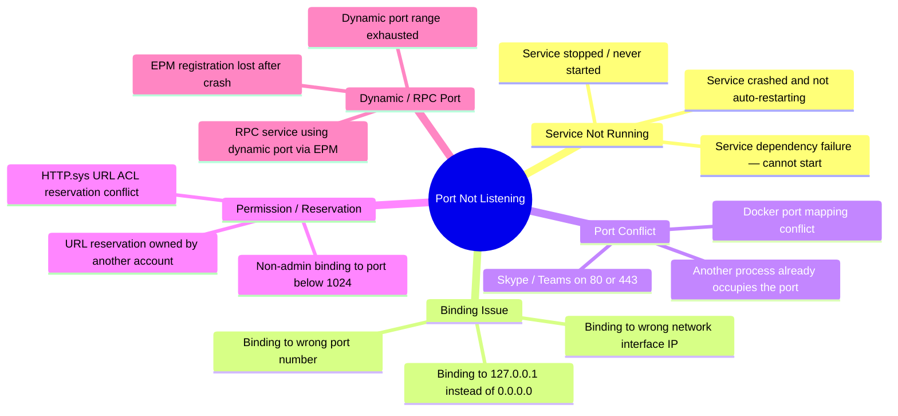
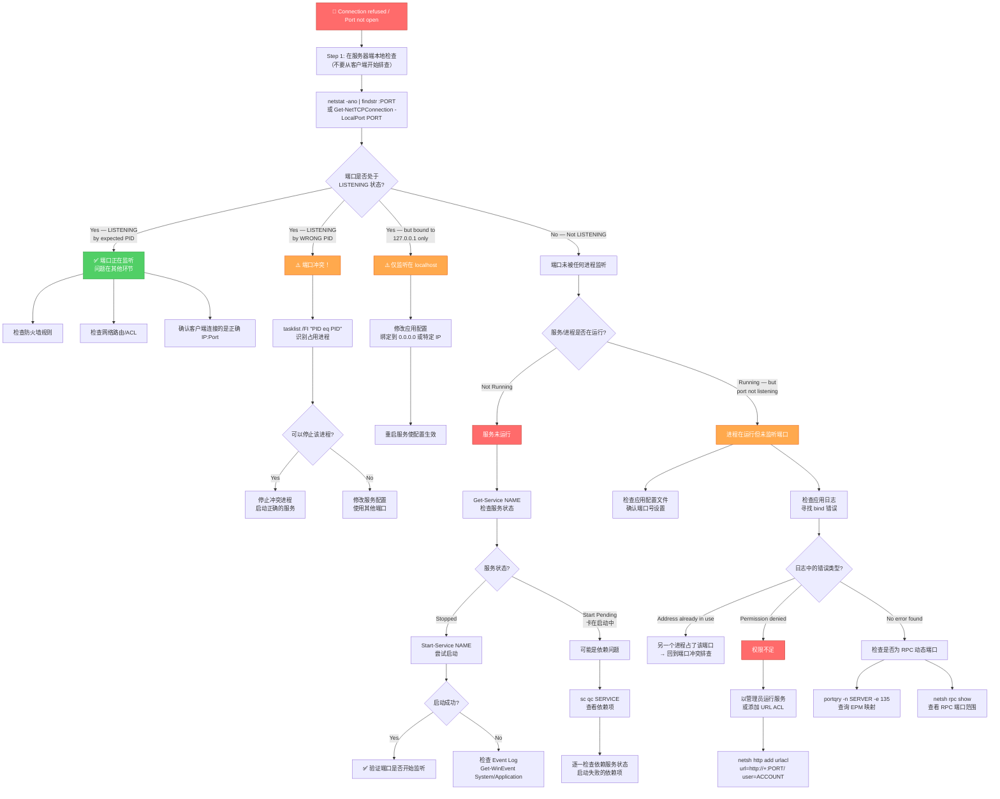
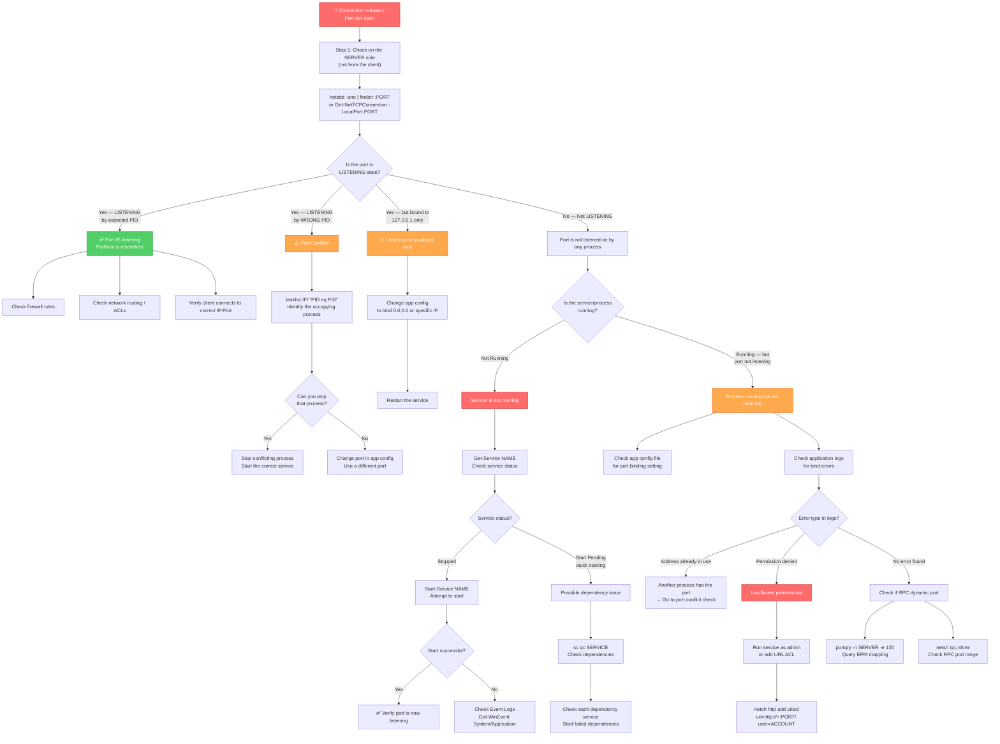

# Scenario Map: TCP/IP — 端口未监听 (Port Not Listening)

**Product/Service:** Windows TCP/IP Stack  
**Scope:** 目标端口上没有服务在监听，导致连接被拒绝  
**Last Updated:** 2026-03-11

---

## 核心概念

当没有进程在某个端口上监听时，TCP 协议栈会对收到的 SYN 包直接返回 RST（连接重置）。这与"被防火墙阻止"的行为完全不同——防火墙阻止时，SYN 包不会收到任何响应，客户端最终超时。

> **关键区分：SYN 后立即收到 RST = 端口未监听；SYN 后超时无响应 = 防火墙阻止。**

---

## 1. 场景子类型 (Sub-Scenarios)



| # | 子场景 | 简述 |
|---|--------|------|
| 1 | 服务/应用未运行 | 目标服务根本没有启动，端口自然不会被监听 |
| 2 | 服务运行但绑定了错误的 IP | 服务只绑定到 `127.0.0.1`（仅本地访问），远程连接无法到达 |
| 3 | 服务绑定了错误的端口 | 配置文件中端口号不正确，服务监听在其他端口上 |
| 4 | 端口冲突：另一个进程占用 | 目标端口已被其他进程占用，期望的服务无法绑定 |
| 5 | 服务崩溃且未自动重启 | 服务曾正常运行，但崩溃后恢复选项未配置 |
| 6 | 服务依赖失败 | 服务依赖的其他服务（如 SQL、RPC）未启动，导致自身无法启动 |
| 7 | RPC 动态端口 | 服务使用 RPC 动态端口注册到 EPM，客户端无法定位正确端口 |
| 8 | HTTP.sys URL 保留冲突 | IIS/WCF 服务因 URL ACL 保留冲突而无法绑定端口 |
| 9 | 权限不足 | 服务以非管理员身份运行，无法绑定特权端口或缺少 URL ACL 权限 |

---

## 2. 典型症状

| 症状 | 说明 |
|------|------|
| `telnet <ip> <port>` → **"Could not open connection to the host, Connection refused"** | 最经典的表现：TCP 连接立即被拒绝 |
| `Test-NetConnection` → **TcpTestSucceeded: False** | PowerShell 测试显示端口不可达 |
| 抓包显示 **SYN → RST/ACK** | 客户端发送 SYN，服务器立即返回 RST（区别于防火墙导致的超时） |
| 应用日志中出现 **"Connection refused"** | 客户端应用记录连接被拒绝的错误 |
| 服务在 services.msc 中显示 **"已启动"** 但端口未监听 | 服务进程在运行，但实际绑定了错误的 IP 或端口 |
| 服务启动失败，报错 **"Address already in use"** | 端口被另一个进程占用，服务无法绑定 |
| `netstat -ano` 显示端口被 **非预期的 PID** 监听 | 端口存在，但被错误的进程占据 |
| 服务反复崩溃重启（Event Log 中大量 7034/7031 事件） | 服务不稳定，在崩溃和重启之间有窗口期端口不可用 |

---

## 3. 排查流程图 (Troubleshooting Flowchart)



---

## 4. 详细排查步骤与命令

### Step 1：确认端口监听状态（在服务器端执行）

```powershell
# 最核心的第一条命令 — 检查端口是否在监听
netstat -ano | findstr :<PORT>

# PowerShell 等效命令（更详细）
Get-NetTCPConnection -LocalPort <PORT> -State Listen -ErrorAction SilentlyContinue

# 如果上面没有结果，说明没有任何进程监听该端口
# 检查所有 LISTENING 端口（排除 ESTABLISHED 等干扰）
netstat -ano | findstr LISTENING | findstr :<PORT>
```

### Step 2：识别占用端口的进程

```powershell
# 根据 netstat 输出中的 PID 识别进程
tasklist /FI "PID eq <PID>"

# PowerShell 版本 — 获取更多详情
Get-Process -Id <PID> | Select-Object ProcessName, Path, StartTime, Id

# 获取进程的命令行参数（有助于识别具体实例）
Get-CimInstance Win32_Process -Filter "ProcessId = <PID>" | Select Name, CommandLine
```

### Step 3：检查服务状态

```powershell
# 检查特定服务状态
sc query <servicename>
Get-Service <servicename> | Format-List *

# 检查服务配置（包括依赖项、启动类型、二进制路径）
sc qc <servicename>

# PowerShell 获取完整信息
Get-WmiObject Win32_Service | Where-Object {$_.Name -eq '<servicename>'} | 
    Select-Object Name, State, StartMode, PathName, StartName

# 强制服务报告当前状态
sc interrogate <servicename>

# 查看所有运行中的服务
Get-Service | Where-Object {$_.Status -eq 'Running'} | Select-Object Name, DisplayName
```

### Step 4：检查服务依赖

```powershell
# 查看服务依赖链
sc qc <servicename>
# 输出中 DEPENDENCIES 行显示依赖的服务

# 递归检查依赖树
Get-Service <servicename> | Select-Object -ExpandProperty DependentServices
Get-Service <servicename> | Select-Object -ExpandProperty ServicesDependedOn
```

### Step 5：检查事件日志

```powershell
# 查看最近的系统错误事件
Get-WinEvent -FilterHashtable @{LogName='System'; Level=2} -MaxEvents 20

# 查看应用程序错误事件
Get-WinEvent -FilterHashtable @{LogName='Application'; Level=2} -MaxEvents 20

# 筛选特定服务的事件（如服务崩溃 7034、恢复 7031）
Get-WinEvent -FilterHashtable @{LogName='System'; Id=7034,7031,7023,7024} -MaxEvents 10

# 查看服务启动失败的详细信息
Get-WinEvent -FilterHashtable @{LogName='System'; ProviderName='Service Control Manager'} -MaxEvents 20
```

### Step 6：检查 HTTP.sys URL 保留（IIS/WCF 场景）

```powershell
# 查看所有 HTTP.sys URL ACL 保留
netsh http show urlacl

# 查看当前活跃的 HTTP.sys 监听器
netsh http show servicestate

# 查看 SSL 证书绑定
netsh http show sslcert
```

### Step 7：检查 RPC 动态端口

```powershell
# 查询 RPC Endpoint Mapper（EPM）— 列出注册的 RPC 服务和端口
portqry -n <SERVER> -e 135

# 本地枚举所有监听端口及对应进程
portqry -local

# 查看 RPC 动态端口范围配置
netsh int ipv4 show dynamicport tcp

# 查看 RPC 设置
netsh rpc show
```

### Step 8：本地连通性验证

```powershell
# 先在服务器本地测试（排除网络因素）
Test-NetConnection -ComputerName localhost -Port <PORT>

# 然后从远程客户端测试
Test-NetConnection -ComputerName <SERVER_IP> -Port <PORT> -InformationLevel Detailed

# 经典 telnet 测试
telnet <SERVER_IP> <PORT>
```

---

## 5. 解决方案

| 根因 | 解决方案 | 命令示例 |
|------|----------|----------|
| **服务未运行** | 启动服务并设置为自动启动 | `Start-Service <name>` 然后 `Set-Service <name> -StartupType Automatic` |
| **服务依赖失败** | 先修复依赖服务，再启动目标服务 | `sc qc <service>` 查看依赖 → 逐一启动 |
| **端口冲突** | 停止冲突进程或修改服务配置使用其他端口 | `Stop-Process -Id <PID>` 或修改 app.config |
| **绑定到 127.0.0.1** | 修改应用配置文件，将绑定地址改为 `0.0.0.0` 或具体 IP | 编辑配置文件（如 `appsettings.json`, `web.config`, `httpd.conf`），重启服务 |
| **配置了错误的端口** | 修正应用配置文件中的端口号 | 编辑配置文件，重启服务 |
| **权限不足** | 以管理员身份运行，或添加 URL ACL 保留 | `netsh http add urlacl url=http://+:80/ user=<DOMAIN\account>` |
| **服务崩溃循环** | 分析 crash dump 和 Event Log，修复根因；配置恢复选项 | `sc failure <service> reset= 86400 actions= restart/60000/restart/120000//` |
| **HTTP.sys URL 保留冲突** | 删除旧的 URL 保留，重新添加正确的 | `netsh http delete urlacl url=<url>` 然后 `netsh http add urlacl url=<url> user=<account>` |
| **RPC 动态端口未注册** | 重启服务让其重新向 EPM 注册 | `Restart-Service <rpc-service-name>` |
| **动态端口范围耗尽** | 扩大动态端口范围或排查端口泄漏 | `netsh int ipv4 set dynamicport tcp start=10000 num=55535` |

---

## 6. 排查技巧 (Tips)

> 💡 **RST vs Timeout — 核心区分法则**  
> SYN 后立即收到 RST = **端口未监听**（没有进程在该端口上等待连接）  
> SYN 后超时无响应 = **防火墙阻止**（包被静默丢弃）  
> 这是排查网络连接问题最重要的第一步判断。

> 💡 **永远先在服务器端检查**  
> 不要从客户端开始猜测。在服务器上执行 `netstat -ano | findstr :<PORT>` 是最直接、最可靠的方式，告诉你端口的真实状态。

> 💡 **"服务运行中" ≠ "端口在监听"**  
> services.msc 中显示 "Running" 仅代表进程在运行，不代表端口已成功绑定。必须用 `netstat` 或 `Get-NetTCPConnection` 验证。

> 💡 **IIS 双重检查**  
> IIS 场景需要确认两件事：(1) 站点已启动（IIS Manager 中为 Started）；(2) 对应的应用程序池正在运行。任一未启动都会导致端口不监听。

> 💡 **常见端口冲突元凶**  
> - Skype / Teams 默认会尝试使用 80/443 端口  
> - Docker Desktop 的端口映射可能与宿主服务冲突  
> - SQL Server 的动态端口可能与其他服务冲突  
> - VMware/Hyper-V 的管理端口  

> 💡 **HTTP.sys URL ACL 隐形杀手**  
> 对于 WCF、ASP.NET 自托管或非 IIS 的 HTTP 服务，HTTP.sys 的 URL ACL 保留可能静默阻止端口绑定，且应用日志中可能没有明确的错误提示。使用 `netsh http show urlacl` 检查。

> 💡 **RPC 动态端口**  
> RPC 服务默认使用 49152-65535 范围内的动态端口。客户端通过 EPM（端口 135）查询目标服务的实际端口。使用 `portqry -e 135` 或 `netsh rpc show` 查看 RPC 端口映射。

> 💡 **修改端口绑定后必须重启**  
> 大多数服务在修改端口配置后需要完全重启（不仅是配置重载）才能生效。IIS 可以使用 `iisreset`，其他服务使用 `Restart-Service`。

---

## 7. 参考文档

暂无可验证的参考文档

---

---

# Scenario Map: TCP/IP — Port Not Listening

**Product/Service:** Windows TCP/IP Stack  
**Scope:** No service is listening on the target port, causing connection refusal  
**Last Updated:** 2026-03-11

---

## Key Concept

When no process is listening on a port, the TCP stack responds to an incoming SYN packet with an immediate RST (reset). This is fundamentally different from "blocked by firewall," where the SYN packet receives no response at all, causing the client to eventually time out.

> **Key distinction: SYN → immediate RST = port not listening. SYN → timeout = firewall blocking.**

---

## 1. Sub-Scenarios


| # | Sub-Scenario | Description |
|---|-------------|-------------|
| 1 | Service/application not running | The target service is not started; no process is bound to the port |
| 2 | Service running but binding to wrong IP | Service binds only to `127.0.0.1` (localhost), unreachable from remote clients |
| 3 | Service binding to wrong port | Port number in configuration file is incorrect |
| 4 | Port conflict: another process occupies the port | Another process already holds the target port; the expected service cannot bind |
| 5 | Service crashed and not auto-restarting | Service was running but crashed; recovery options not configured |
| 6 | Service dependency failure | A dependent service (e.g., SQL, RPC) failed to start, preventing the target service from starting |
| 7 | Dynamic RPC port | Service uses a dynamic port registered via RPC Endpoint Mapper (EPM) |
| 8 | HTTP.sys URL reservation conflict | IIS/WCF service cannot bind due to conflicting URL ACL reservation |
| 9 | Permission denied | Service runs as non-admin and cannot bind to a privileged port or lacks URL ACL permission |

---

## 2. Typical Symptoms

| Symptom | Explanation |
|---------|-------------|
| `telnet <ip> <port>` → **"Could not open connection to the host, Connection refused"** | Classic indicator: TCP connection immediately refused |
| `Test-NetConnection` → **TcpTestSucceeded: False** | PowerShell test shows port unreachable |
| Packet capture shows **SYN → RST/ACK** | Client sends SYN, server immediately returns RST (vs timeout = firewall) |
| **"Connection refused"** in application logs | Client application logs the connection refusal error |
| Service shows **"Started"** in services.msc but port not listening | Service process is running but bound to wrong IP or port |
| Service fails to start with **"Address already in use"** error | Port is occupied by another process |
| `netstat -ano` shows port **LISTENING by unexpected PID** | Port exists but is held by the wrong process |
| Service repeatedly crashes (Event Log shows 7034/7031 events) | Service is unstable; port is unavailable during crash-restart cycles |

---

## 3. Troubleshooting Flowchart



---

## 4. Detailed Troubleshooting Steps with Commands

### Step 1: Verify Port Listening State (Execute on the Server)

```powershell
# THE first command — check if the port is listening
netstat -ano | findstr :<PORT>

# PowerShell equivalent (more detailed)
Get-NetTCPConnection -LocalPort <PORT> -State Listen -ErrorAction SilentlyContinue

# If no results, no process is listening on that port
# Filter for LISTENING state only (exclude ESTABLISHED noise)
netstat -ano | findstr LISTENING | findstr :<PORT>
```

### Step 2: Identify the Process Occupying the Port

```powershell
# Identify process by PID from netstat output
tasklist /FI "PID eq <PID>"

# PowerShell version — get more details
Get-Process -Id <PID> | Select-Object ProcessName, Path, StartTime, Id

# Get process command line arguments (helps identify specific instance)
Get-CimInstance Win32_Process -Filter "ProcessId = <PID>" | Select Name, CommandLine
```

### Step 3: Check Service Status

```powershell
# Check specific service status
sc query <servicename>
Get-Service <servicename> | Format-List *

# Check service configuration (dependencies, startup type, binary path)
sc qc <servicename>

# PowerShell — full service information
Get-WmiObject Win32_Service | Where-Object {$_.Name -eq '<servicename>'} | 
    Select-Object Name, State, StartMode, PathName, StartName

# Force service to report current status
sc interrogate <servicename>

# List all running services
Get-Service | Where-Object {$_.Status -eq 'Running'} | Select-Object Name, DisplayName
```

### Step 4: Check Service Dependencies

```powershell
# View service dependency chain
sc qc <servicename>
# The DEPENDENCIES line in the output shows dependent services

# Recursively check dependency tree
Get-Service <servicename> | Select-Object -ExpandProperty DependentServices
Get-Service <servicename> | Select-Object -ExpandProperty ServicesDependedOn
```

### Step 5: Check Event Logs

```powershell
# View recent system error events
Get-WinEvent -FilterHashtable @{LogName='System'; Level=2} -MaxEvents 20

# View application error events
Get-WinEvent -FilterHashtable @{LogName='Application'; Level=2} -MaxEvents 20

# Filter for specific service events (crash 7034, recovery 7031)
Get-WinEvent -FilterHashtable @{LogName='System'; Id=7034,7031,7023,7024} -MaxEvents 10

# View detailed service start failure information
Get-WinEvent -FilterHashtable @{LogName='System'; ProviderName='Service Control Manager'} -MaxEvents 20
```

### Step 6: Check HTTP.sys URL Reservations (IIS/WCF Scenarios)

```powershell
# View all HTTP.sys URL ACL reservations
netsh http show urlacl

# View currently active HTTP.sys listeners
netsh http show servicestate

# View SSL certificate bindings
netsh http show sslcert
```

### Step 7: Check RPC Dynamic Ports

```powershell
# Query RPC Endpoint Mapper (EPM) — list registered RPC services and ports
portqry -n <SERVER> -e 135

# Locally enumerate all listening ports with process info
portqry -local

# View dynamic port range configuration
netsh int ipv4 show dynamicport tcp

# View RPC settings
netsh rpc show
```

### Step 8: Local Connectivity Verification

```powershell
# Test locally on the server first (eliminate network factors)
Test-NetConnection -ComputerName localhost -Port <PORT>

# Then test from a remote client
Test-NetConnection -ComputerName <SERVER_IP> -Port <PORT> -InformationLevel Detailed

# Classic telnet test
telnet <SERVER_IP> <PORT>
```

---

## 5. Solutions

| Root Cause | Solution | Command Example |
|-----------|----------|-----------------|
| **Service not running** | Start the service and set it to auto-start | `Start-Service <name>` then `Set-Service <name> -StartupType Automatic` |
| **Dependency failure** | Fix the dependency service first, then start the target service | `sc qc <service>` to view deps → start each one |
| **Port conflict** | Stop the conflicting process or change the service port | `Stop-Process -Id <PID>` or edit app.config |
| **Binding to 127.0.0.1** | Change the application config to bind to `0.0.0.0` or a specific IP | Edit config file (`appsettings.json`, `web.config`, `httpd.conf`), restart service |
| **Wrong port in config** | Correct the port number in the application configuration | Edit config file, restart service |
| **Permission denied** | Run as administrator, or add URL ACL reservation | `netsh http add urlacl url=http://+:80/ user=<DOMAIN\account>` |
| **Service crash loop** | Analyze crash dumps and Event Logs; configure recovery options | `sc failure <service> reset= 86400 actions= restart/60000/restart/120000//` |
| **HTTP.sys URL reservation conflict** | Remove old URL reservation, re-add the correct one | `netsh http delete urlacl url=<url>` then `netsh http add urlacl url=<url> user=<account>` |
| **RPC dynamic port not registered** | Restart the service to re-register with EPM | `Restart-Service <rpc-service-name>` |
| **Dynamic port range exhausted** | Expand dynamic port range or investigate port leaks | `netsh int ipv4 set dynamicport tcp start=10000 num=55535` |

---

## 6. Troubleshooting Tips

> 💡 **RST vs Timeout — The Key Distinction**  
> SYN followed by immediate RST = **port not listening** (no process waiting for connections on that port).  
> SYN followed by timeout = **firewall blocking** (packet silently dropped).  
> This is THE most important first-step judgment when troubleshooting network connectivity issues.

> 💡 **Always Check on the Server First**  
> Do not start guessing from the client side. Running `netstat -ano | findstr :<PORT>` on the server gives you the ground truth about the port's actual state.

> 💡 **"Service Running" ≠ "Port Listening"**  
> Seeing "Running" in services.msc only means the process is alive—it does NOT mean the port was successfully bound. Always verify with `netstat` or `Get-NetTCPConnection`.

> 💡 **IIS Double-Check**  
> For IIS scenarios, verify two things: (1) The website is Started in IIS Manager; (2) The corresponding Application Pool is running. If either is stopped, the port will not be listening.

> 💡 **Common Port Conflict Culprits**  
> - Skype / Teams default to using ports 80/443  
> - Docker Desktop port mappings may conflict with host services  
> - SQL Server dynamic ports may collide with other services  
> - VMware / Hyper-V management ports  

> 💡 **HTTP.sys URL ACL — The Silent Killer**  
> For WCF, self-hosted ASP.NET, or non-IIS HTTP services, HTTP.sys URL ACL reservations can silently prevent port binding, and application logs may show no clear error. Use `netsh http show urlacl` to check.

> 💡 **RPC Dynamic Ports**  
> RPC services use dynamic ports in the 49152-65535 range by default. Clients query the EPM (port 135) to discover the actual port of the target service. Use `portqry -e 135` or `netsh rpc show` to view RPC port mappings.

> 💡 **Restart Required After Port Binding Changes**  
> Most services require a full restart (not just a config reload) after changing port binding configuration. For IIS, use `iisreset`; for other services, use `Restart-Service`.

---

## 7. References

No verifiable reference documents available at this time.
