# Scenario Map: Hyper-V 常见问题排查导航

**Product/Service:** Windows Server Hyper-V  
**Scope:** Hyper-V 虚拟机管理和运行中的常见故障场景全覆盖  
**Last Updated:** 2026-03-17

---

## 1. 场景全景图 (Scenario Overview)

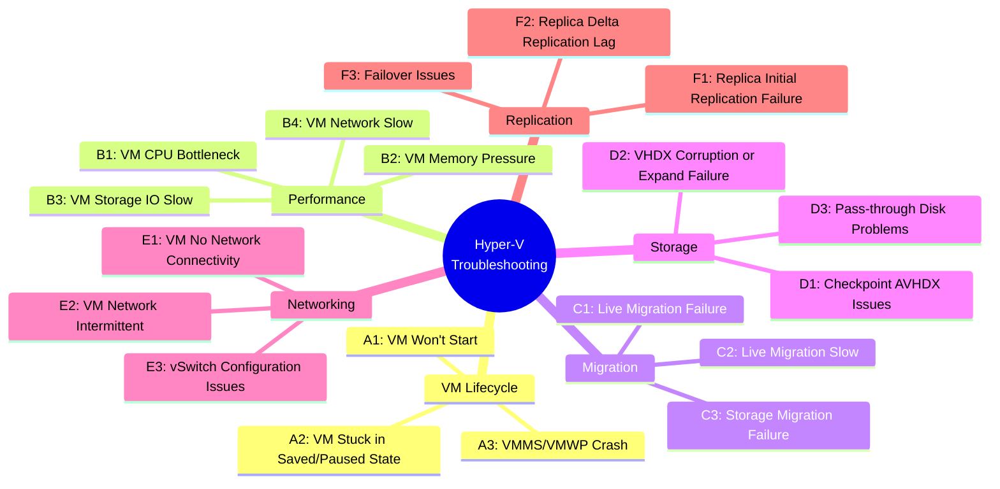
```mermaid
mindmap
  root((Hyper-V<br/>Troubleshooting))
    VM Lifecycle
      A1: VM Won't Start
      A2: VM Stuck in Saved/Paused State
      A3: VMMS/VMWP Crash
    Performance
      B1: VM CPU Bottleneck
      B2: VM Memory Pressure
      B3: VM Storage IO Slow
      B4: VM Network Slow
    Migration
      C1: Live Migration Failure
      C2: Live Migration Slow
      C3: Storage Migration Failure
    Storage
      D1: Checkpoint AVHDX Issues
      D2: VHDX Corruption or Expand Failure
      D3: Pass-through Disk Problems
    Networking
      E1: VM No Network Connectivity
      E2: VM Network Intermittent
      E3: vSwitch Configuration Issues
    Replication
      F1: Replica Initial Replication Failure
      F2: Replica Delta Replication Lag
      F3: Failover Issues
```

> 这张全景图覆盖了 Hyper-V 支持中 **6 大类 18 个常见场景**。根据你遇到的问题症状，在下表中快速定位。

---

## 2. 场景识别指南 (How to Identify Your Scenario)

| 你看到的症状 | 可能的场景 | 跳转 |
|-------------|-----------|------|
| VM 启动报错、停在 Starting 状态 | VM Won't Start | → [场景 A1](#场景-a1-vm-无法启动-vm-wont-start) |
| VM 卡在 Saved / Paused / Off (Critical) | VM Stuck State | → [场景 A2](#场景-a2-vm-卡在-savedpaused-状态) |
| vmms.exe / vmwp.exe 崩溃、所有 VM 受影响 | VMMS/VMWP Crash | → [场景 A3](#场景-a3-vmms--vmwp-进程崩溃) |
| VM 内 CPU 高但 Host 不高 / vCPU 等待时间长 | CPU Bottleneck | → [场景 B1](#场景-b1-vm-cpu-瓶颈) |
| VM 内存不足、频繁 Page Fault、Smart Paging | Memory Pressure | → [场景 B2](#场景-b2-vm-内存压力) |
| VM 磁盘延迟高、IO 慢 | Storage IO Slow | → [场景 B3](#场景-b3-vm-存储-io-缓慢) |
| VM 网络吞吐低、丢包、高延迟 | Network Slow | → [场景 B4](#场景-b4-vm-网络性能差) |
| Live Migration 报错回退 | LM Failure | → [场景 C1](#场景-c1-live-migration-失败) |
| Live Migration 完成但耗时过长 | LM Slow | → [场景 C2](#场景-c2-live-migration-缓慢) |
| Checkpoint 删除不了 / AVHDX 不合并 / 链过长 | AVHDX Issues | → [场景 D1](#场景-d1-checkpoint--avhdx-问题) |
| VHDX 损坏 / 在线扩展失败 | VHDX Corruption | → [场景 D2](#场景-d2-vhdx-损坏或扩展失败) |
| VM 完全没有网络 | No Connectivity | → [场景 E1](#场景-e1-vm-完全无网络) |
| Replica 初始复制失败 | Replica Init Fail | → [场景 F1](#场景-f1-replica-初始复制失败) |
| Replica 复制延迟大 | Replica Lag | → [场景 F2](#场景-f2-replica-delta-复制延迟) |

---

## 3. 各场景排查详情 (Scenario Details)

---

### 场景 A1: VM 无法启动 (VM Won't Start)

**典型症状：** Hyper-V Manager 中点击 Start 后 VM 状态卡在 "Starting" 或直接报错 "Failed to start"

**排查逻辑：**
> 先确认 Hypervisor 本身是否正常运行，再检查 VM 的存储和配置文件是否完整可访问，最后排查资源不足和权限问题。

**排查流程图：**

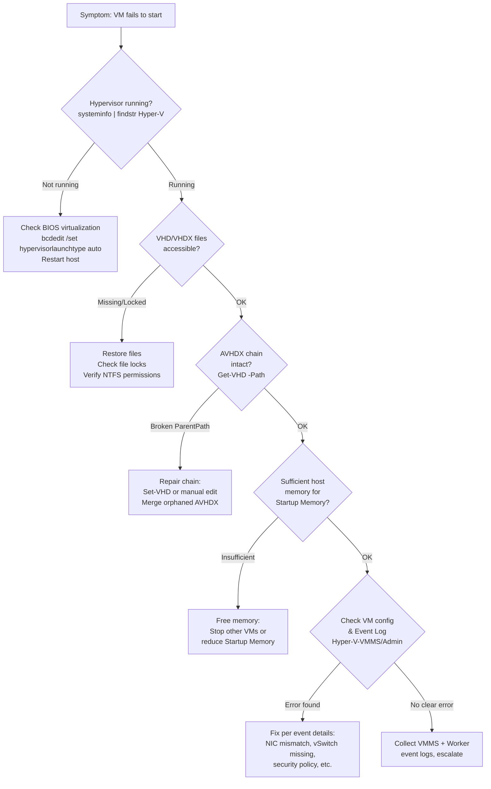
```mermaid
flowchart TD
    Start["Symptom: VM fails to start"] --> HV{"Hypervisor running?<br/>systeminfo | findstr Hyper-V"}
    HV -->|"Not running"| FixHV["Check BIOS virtualization<br/>bcdedit /set hypervisorlaunchtype auto<br/>Restart host"]
    HV -->|"Running"| VHD{"VHD/VHDX files<br/>accessible?"}
    VHD -->|"Missing/Locked"| FixVHD["Restore files<br/>Check file locks<br/>Verify NTFS permissions"]
    VHD -->|"OK"| Chain{"AVHDX chain<br/>intact?<br/>Get-VHD -Path"}
    Chain -->|"Broken ParentPath"| FixChain["Repair chain:<br/>Set-VHD or manual edit<br/>Merge orphaned AVHDX"]
    Chain -->|"OK"| Mem{"Sufficient host<br/>memory for<br/>Startup Memory?"}
    Mem -->|"Insufficient"| FixMem["Free memory:<br/>Stop other VMs or<br/>reduce Startup Memory"]
    Mem -->|"OK"| Config{"Check VM config<br/>& Event Log<br/>Hyper-V-VMMS/Admin"}
    Config -->|"Error found"| FixConfig["Fix per event details:<br/>NIC mismatch, vSwitch missing,<br/>security policy, etc."]
    Config -->|"No clear error"| Escalate["Collect VMMS + Worker<br/>event logs, escalate"]
```

**关键诊断命令：**

| 检查什么 | 命令 | 看什么 |
|---------|------|--------|
| Hypervisor 状态 | `systeminfo \| findstr "Hyper-V"` | 应显示 "A hypervisor has been detected" |
| VM 磁盘链 | `Get-VHD -Path "C:\VMs\disk.avhdx"` | ParentPath 是否指向存在的文件 |
| VM 状态 | `Get-VM -Name "TestVM" \| FL *` | State, Status, MemoryAssigned |
| 事件日志 | Event Viewer → Hyper-V-VMMS/Admin | 启动失败的具体错误代码 |

**💡 Tips：**
- **Tip 1：** 如果 VM 有 Checkpoint，AVHDX 链断裂是最常见的启动失败原因。用 `Get-VHD` 逐个检查 ParentPath
- **Tip 2：** 第三方备份软件（如 Veeam、Arcserve）有时会锁定 VHD 文件导致 VM 无法启动
- **⚠️ 常见误区：** 不要直接删除 AVHDX 文件！这会永久丢失 Checkpoint 以来的所有数据

**解决方案摘要：**

| 根因 | 修复方法 | 验证方式 |
|------|---------|---------|
| Hypervisor 未启动 | `bcdedit /set hypervisorlaunchtype auto` + 重启 | `systeminfo` 确认 |
| VHD 文件丢失 | 从备份恢复 / 修复存储路径 | `Test-Path` 确认文件存在 |
| AVHDX 链断裂 | `Set-VHD -ParentPath` 修复 | `Get-VHD` 验证完整链 |
| Host 内存不足 | 释放内存或调低 Startup Memory | `Get-VM` 确认启动成功 |

---

### 场景 A2: VM 卡在 Saved/Paused 状态

**典型症状：** VM 状态显示 Saved、Paused 或 Off (Critical)，无法正常恢复

**排查逻辑：**
> Saved 状态通常因 Host 内存不足或磁盘空间不足导致的自动保存；Paused 状态可能是存储路径不可达；Critical 通常表示 vmwp.exe 已崩溃。

**排查流程图：**

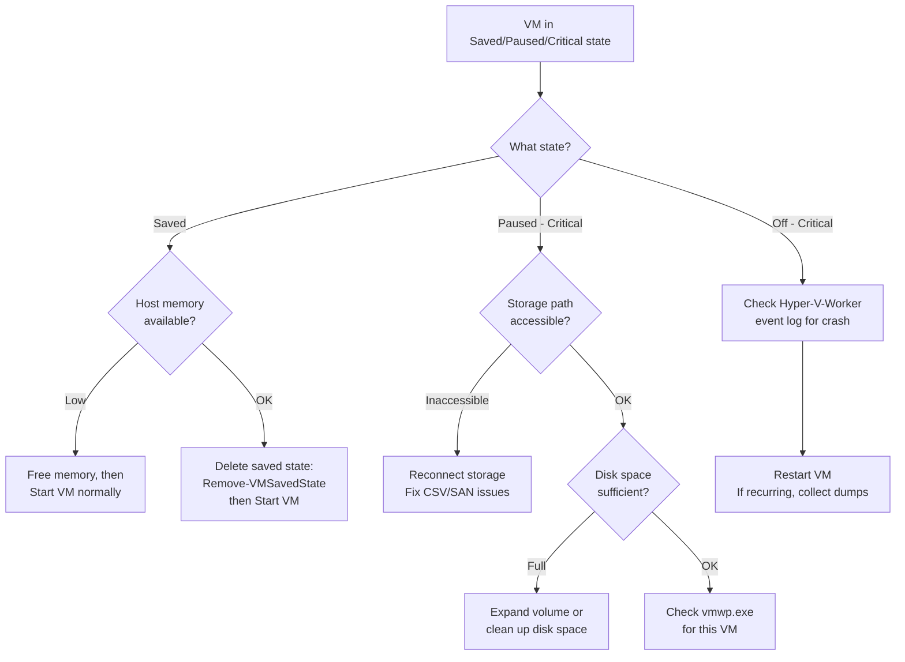
```mermaid
flowchart TD
    Start["VM in Saved/Paused/Critical state"] --> State{"What state?"}
    State -->|"Saved"| SavedCheck{"Host memory<br/>available?"}
    SavedCheck -->|"Low"| FreeMem["Free memory, then<br/>Start VM normally"]
    SavedCheck -->|"OK"| DelSaved["Delete saved state:<br/>Remove-VMSavedState<br/>then Start VM"]
    State -->|"Paused - Critical"| Storage{"Storage path<br/>accessible?"}
    Storage -->|"Inaccessible"| FixStorage["Reconnect storage<br/>Fix CSV/SAN issues"]
    Storage -->|"OK"| DiskSpace{"Disk space<br/>sufficient?"}
    DiskSpace -->|"Full"| FreeSpace["Expand volume or<br/>clean up disk space"]
    DiskSpace -->|"OK"| Worker["Check vmwp.exe<br/>for this VM"]
    State -->|"Off - Critical"| EventLog["Check Hyper-V-Worker<br/>event log for crash"]
    EventLog --> FixCrash["Restart VM<br/>If recurring, collect dumps"]
```

**💡 Tips：**
- **Tip 1：** `Remove-VMSavedState -VMName "VM1"` 可以丢弃保存的状态并让 VM 冷启动
- **Tip 2：** VM 自动暂停通常是因为存储路径丢失或磁盘空间不足，检查 CSV 或 SAN 连接状态

---

### 场景 A3: VMMS / VMWP 进程崩溃

**典型症状：** vmms.exe 崩溃影响所有 VM 管理；或单个 vmwp.exe 崩溃导致对应 VM 进入 Critical 状态

**排查流程图：**

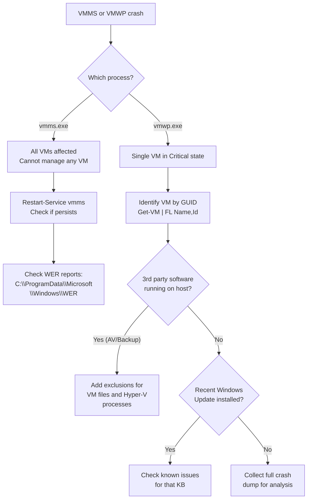
```mermaid
flowchart TD
    Start["VMMS or VMWP crash"] --> Which{"Which process?"}
    Which -->|"vmms.exe"| VMMSImpact["All VMs affected<br/>Cannot manage any VM"]
    VMMSImpact --> RestartSvc["Restart-Service vmms<br/>Check if persists"]
    RestartSvc --> WER["Check WER reports:<br/>C:\\ProgramData\\Microsoft<br/>\\Windows\\WER"]
    Which -->|"vmwp.exe"| VMWPImpact["Single VM in Critical state"]
    VMWPImpact --> IdentifyVM["Identify VM by GUID<br/>Get-VM | FL Name,Id"]
    IdentifyVM --> ThirdParty{"3rd party software<br/>running on host?"}
    ThirdParty -->|"Yes (AV/Backup)"| Exclude["Add exclusions for<br/>VM files and Hyper-V<br/>processes"]
    ThirdParty -->|"No"| Updates{"Recent Windows<br/>Update installed?"}
    Updates -->|"Yes"| KBCheck["Check known issues<br/>for that KB"]
    Updates -->|"No"| Dump["Collect full crash<br/>dump for analysis"]
```

**💡 Tips：**
- **Tip 1：** 反病毒软件扫描 VHD/VHDX/AVHDX 文件是导致 vmwp.exe 崩溃的常见原因。**必须添加排除项**
- **⚠️ 常见误区：** 重启 vmms 服务不会影响正在运行的 VM（VM 由各自的 vmwp.exe 进程管理）

---

### 场景 B1: VM CPU 瓶颈

**典型症状：** VM 内应用响应慢，VM 内看 CPU 高，但 Host 物理 CPU 不一定高

**排查流程图：**

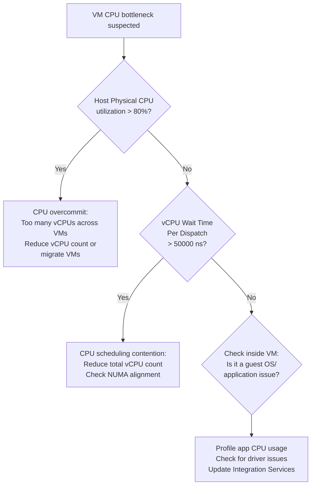
```mermaid
flowchart TD
    Start["VM CPU bottleneck suspected"] --> HostCPU{"Host Physical CPU<br/>utilization > 80%?"}
    HostCPU -->|"Yes"| Overcommit["CPU overcommit:<br/>Too many vCPUs across VMs<br/>Reduce vCPU count or<br/>migrate VMs"]
    HostCPU -->|"No"| WaitTime{"vCPU Wait Time<br/>Per Dispatch<br/>> 50000 ns?"}
    WaitTime -->|"Yes"| ReduceVCPU["CPU scheduling contention:<br/>Reduce total vCPU count<br/>Check NUMA alignment"]
    WaitTime -->|"No"| GuestInternal{"Check inside VM:<br/>Is it a guest OS/<br/>application issue?"}
    GuestInternal --> AppFix["Profile app CPU usage<br/>Check for driver issues<br/>Update Integration Services"]
```

**关键诊断命令：**

| 检查什么 | 命令/计数器 | 判断标准 |
|---------|-----------|---------|
| Host CPU | `\Processor(_Total)\% Processor Time` | > 80% 持续表示 Host 过载 |
| vCPU 等待 | `\Hyper-V Hypervisor Virtual Processor(*)\CPU Wait Time Per Dispatch` | > 50,000 ns = 严重超分 |
| NUMA 对齐 | `Get-VM \| FL ProcessorCount, NumaAligned` | 高性能 VM 应为 True |

**💡 Tips：**
- **Tip 1：** vCPU 数量不是"越多越好"。过多的 vCPU 会导致 Hypervisor 调度开销增加，反而更慢
- **Tip 2：** 使用 `Get-VMProcessor` 检查 VM 是否启用了 "Processor Compatibility Mode"（会降低 CPU 功能集）

---

### 场景 B2: VM 内存压力

**典型症状：** VM 内存不足告警、应用 OOM、Guest 频繁 Page Fault

**排查流程图：**

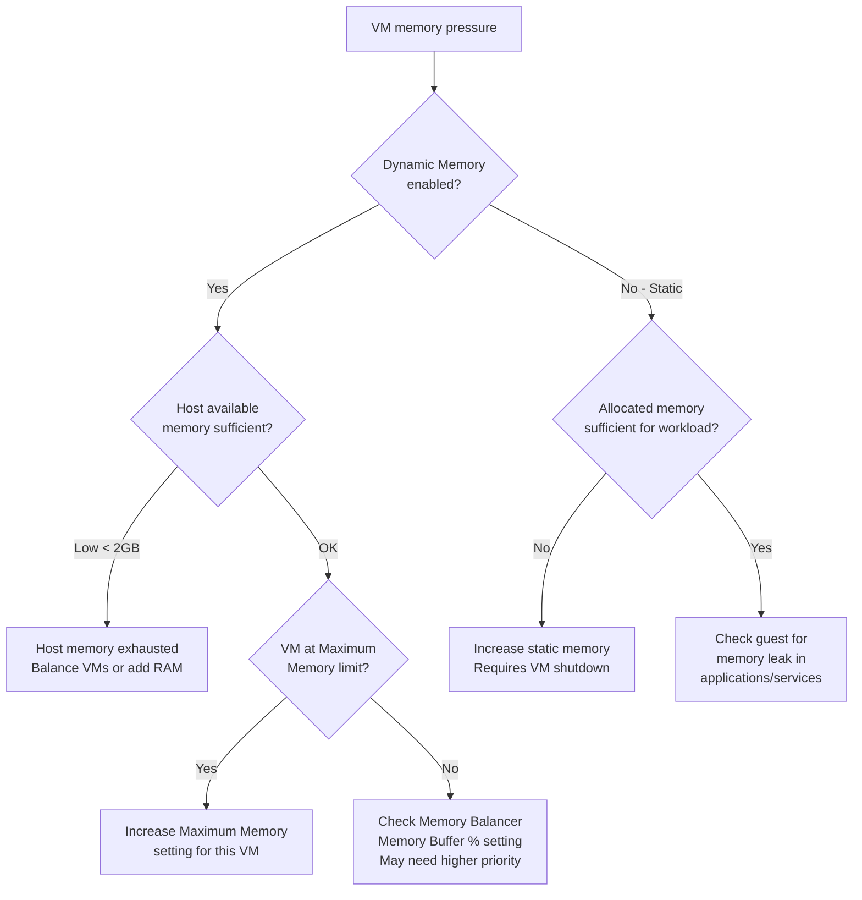
```mermaid
flowchart TD
    Start["VM memory pressure"] --> DynMem{"Dynamic Memory<br/>enabled?"}
    DynMem -->|"Yes"| HostMem{"Host available<br/>memory sufficient?"}
    HostMem -->|"Low < 2GB"| HostPressure["Host memory exhausted<br/>Balance VMs or add RAM"]
    HostMem -->|"OK"| MaxReached{"VM at Maximum<br/>Memory limit?"}
    MaxReached -->|"Yes"| IncreaseMax["Increase Maximum Memory<br/>setting for this VM"]
    MaxReached -->|"No"| Balancer["Check Memory Balancer<br/>Memory Buffer % setting<br/>May need higher priority"]
    DynMem -->|"No - Static"| StaticSize{"Allocated memory<br/>sufficient for workload?"}
    StaticSize -->|"No"| Increase["Increase static memory<br/>Requires VM shutdown"]
    StaticSize -->|"Yes"| GuestLeak["Check guest for<br/>memory leak in<br/>applications/services"]
```

**💡 Tips：**
- **Tip 1：** Smart Paging 如果频繁触发（磁盘上看到临时 .bin 文件），说明 Host 内存严重不足
- **Tip 2：** 对 SQL Server、Exchange 等内存敏感应用，建议使用**静态内存**而非 Dynamic Memory

---

### 场景 B3: VM 存储 IO 缓慢

**典型症状：** VM 内磁盘延迟高、应用读写慢、Event Log 中有 storvsp 或 disk timeout 事件

**排查流程图：**

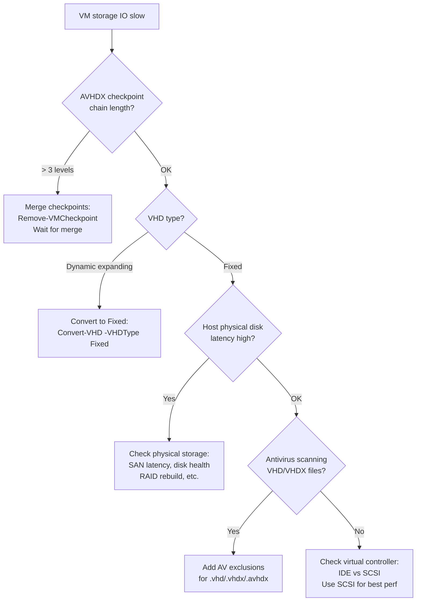
```mermaid
flowchart TD
    Start["VM storage IO slow"] --> AVHDXChain{"AVHDX checkpoint<br/>chain length?"}
    AVHDXChain -->|"> 3 levels"| MergeCP["Merge checkpoints:<br/>Remove-VMCheckpoint<br/>Wait for merge"]
    AVHDXChain -->|"OK"| DiskType{"VHD type?"}
    DiskType -->|"Dynamic expanding"| Convert["Convert to Fixed:<br/>Convert-VHD -VHDType Fixed"]
    DiskType -->|"Fixed"| HostDisk{"Host physical disk<br/>latency high?"}
    HostDisk -->|"Yes"| PhysDisk["Check physical storage:<br/>SAN latency, disk health<br/>RAID rebuild, etc."]
    HostDisk -->|"OK"| AV{"Antivirus scanning<br/>VHD/VHDX files?"}
    AV -->|"Yes"| Exclude["Add AV exclusions<br/>for .vhd/.vhdx/.avhdx"]
    AV -->|"No"| Controller["Check virtual controller:<br/>IDE vs SCSI<br/>Use SCSI for best perf"]
```

**关键诊断命令：**

| 检查什么 | 命令/计数器 | 判断标准 |
|---------|-----------|---------|
| AVHDX 链深度 | `Get-VMCheckpoint -VMName "VM1"` | > 3 层需要关注 |
| Host 磁盘延迟 | `\PhysicalDisk(*)\Avg. Disk sec/Read` | > 20ms 需排查物理存储 |
| VM 虚拟磁盘 IO | `\Hyper-V Virtual Storage Device(*)\Read/Write Latency` | 对比基线 |

**💡 Tips：**
- **Tip 1：** 长期不合并的 Checkpoint 是 VM 存储性能杀手！定期检查并清理不需要的 Checkpoint
- **⚠️ 常见误区：** IDE 控制器在 Gen1 VM 中比 SCSI 慢得多，但只有 IDE 可以做启动盘（Gen1 限制）

---

### 场景 B4: VM 网络性能差

**典型症状：** VM 网络吞吐低、延迟高、丢包

**排查流程图：**

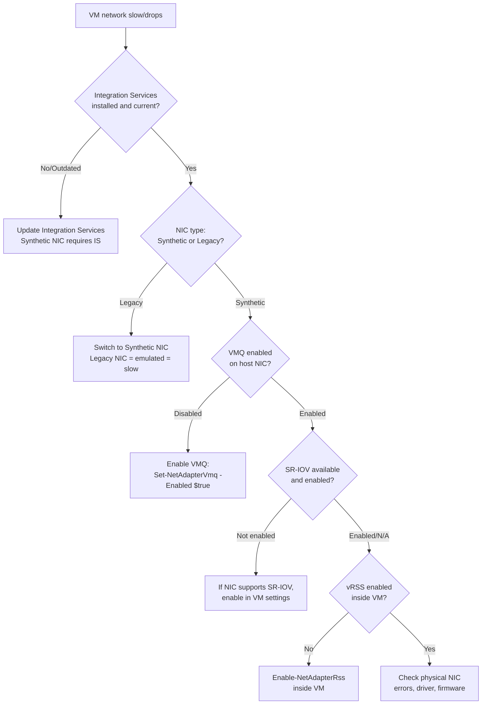
```mermaid
flowchart TD
    Start["VM network slow/drops"] --> ISCheck{"Integration Services<br/>installed and current?"}
    ISCheck -->|"No/Outdated"| UpdateIS["Update Integration Services<br/>Synthetic NIC requires IS"]
    ISCheck -->|"Yes"| NICType{"NIC type:<br/>Synthetic or Legacy?"}
    NICType -->|"Legacy"| SwitchSyn["Switch to Synthetic NIC<br/>Legacy NIC = emulated = slow"]
    NICType -->|"Synthetic"| VMQ{"VMQ enabled<br/>on host NIC?"}
    VMQ -->|"Disabled"| EnableVMQ["Enable VMQ:<br/>Set-NetAdapterVmq -Enabled $true"]
    VMQ -->|"Enabled"| SRIOV{"SR-IOV available<br/>and enabled?"}
    SRIOV -->|"Not enabled"| CheckHW["If NIC supports SR-IOV,<br/>enable in VM settings"]
    SRIOV -->|"Enabled/N/A"| vRSS{"vRSS enabled<br/>inside VM?"}
    vRSS -->|"No"| EnablevRSS["Enable-NetAdapterRss<br/>inside VM"]
    vRSS -->|"Yes"| PhysNIC["Check physical NIC<br/>errors, driver, firmware"]
```

**💡 Tips：**
- **Tip 1：** 如果 VM 使用 Legacy NIC（模拟的 DEC 21140 网卡），最高只能到约 100Mbps。必须换 Synthetic NIC
- **Tip 2：** SET (Switch Embedded Teaming) 环境中，确保所有网卡型号、驱动版本一致

---

### 场景 C1: Live Migration 失败

**典型症状：** Live Migration 过程中报错回退，VM 仍在源主机运行

**排查流程图：**

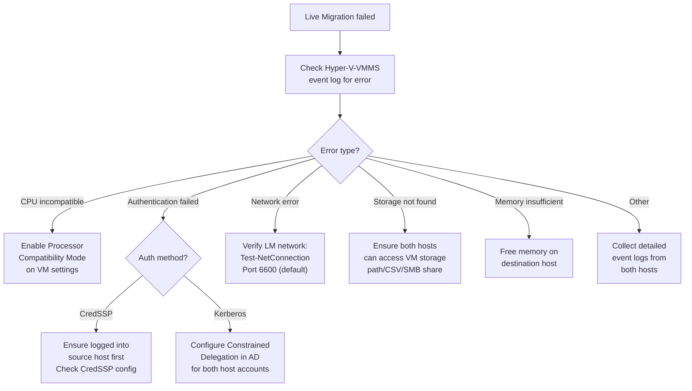
```mermaid
flowchart TD
    Start["Live Migration failed"] --> EventLog["Check Hyper-V-VMMS<br/>event log for error"]
    EventLog --> ErrorType{"Error type?"}
    ErrorType -->|"CPU incompatible"| CPUCompat["Enable Processor<br/>Compatibility Mode<br/>on VM settings"]
    ErrorType -->|"Authentication failed"| Auth{"Auth method?"}
    Auth -->|"CredSSP"| CredSSP["Ensure logged into<br/>source host first<br/>Check CredSSP config"]
    Auth -->|"Kerberos"| Kerberos["Configure Constrained<br/>Delegation in AD<br/>for both host accounts"]
    ErrorType -->|"Network error"| Network["Verify LM network:<br/>Test-NetConnection<br/>Port 6600 (default)"]
    ErrorType -->|"Storage not found"| StorageCheck["Ensure both hosts<br/>can access VM storage<br/>path/CSV/SMB share"]
    ErrorType -->|"Memory insufficient"| DestMem["Free memory on<br/>destination host"]
    ErrorType -->|"Other"| Collect["Collect detailed<br/>event logs from<br/>both hosts"]
```

**关键诊断命令：**

| 检查什么 | 命令 | 看什么 |
|---------|------|--------|
| 兼容性测试 | `Compare-VM -Name "VM1" -DestinationHost "HV02"` | 列出所有不兼容项 |
| LM 配置 | `Get-VMHost \| Select *Migration*` | 并发数、网络、认证方式 |
| 网络连通 | `Test-NetConnection HV02 -Port 6600` | 确认 LM 端口可达 |
| 委派配置 | AD 中检查 Computer Account 的 Delegation 标签 | Kerberos Constrained Delegation |

**💡 Tips：**
- **Tip 1：** CPU 兼容性问题在**异构集群**（不同代 CPU 的节点）中最常见。Processor Compatibility Mode 会限制 CPU 功能集到最低公共集
- **Tip 2：** Kerberos 认证需要在 AD 中为**两台 Host 的计算机账户**都配置约束委派
- **⚠️ 常见误区：** CredSSP 认证不支持"第三方发起"的迁移（即不能从管理机远程触发，必须在源主机上操作）

---

### 场景 C2: Live Migration 缓慢

**典型症状：** Migration 不报错，但完成时间远超预期

**排查流程图：**

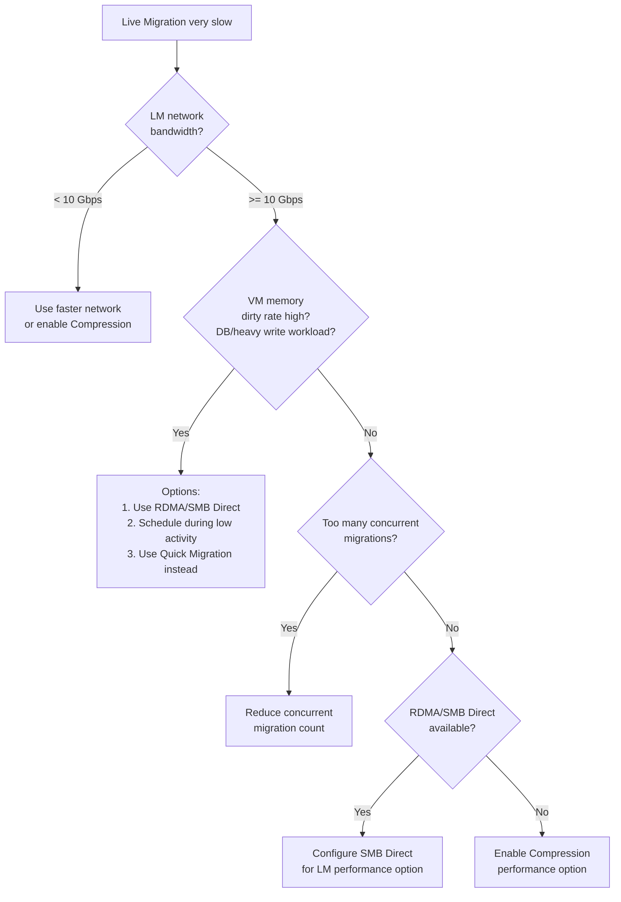
```mermaid
flowchart TD
    Start["Live Migration very slow"] --> BW{"LM network<br/>bandwidth?"}
    BW -->|"< 10 Gbps"| UpgradeBW["Use faster network<br/>or enable Compression"]
    BW -->|">= 10 Gbps"| DirtyRate{"VM memory<br/>dirty rate high?<br/>DB/heavy write workload?"}
    DirtyRate -->|"Yes"| Options["Options:<br/>1. Use RDMA/SMB Direct<br/>2. Schedule during low activity<br/>3. Use Quick Migration instead"]
    DirtyRate -->|"No"| Concurrent{"Too many concurrent<br/>migrations?"}
    Concurrent -->|"Yes"| ReduceConc["Reduce concurrent<br/>migration count"]
    Concurrent -->|"No"| RDMA{"RDMA/SMB Direct<br/>available?"}
    RDMA -->|"Yes"| EnableRDMA["Configure SMB Direct<br/>for LM performance option"]
    RDMA -->|"No"| Compress["Enable Compression<br/>performance option"]
```

**💡 Tips：**
- **Tip 1：** 高内存写入率（Dirty Rate）的 VM（如 OLTP 数据库）可能永远无法达到 Convergence。此时选择 Quick Migration 更实际
- **Tip 2：** SMB Direct (RDMA) 是最佳的 LM 传输方式，但需要 RDMA 网卡（如 Mellanox ConnectX）

---

### 场景 D1: Checkpoint / AVHDX 问题

**典型症状：** Checkpoint 删除后 AVHDX 文件未合并、链过长导致性能下降、VM 无法从 Checkpoint 恢复

**排查流程图：**

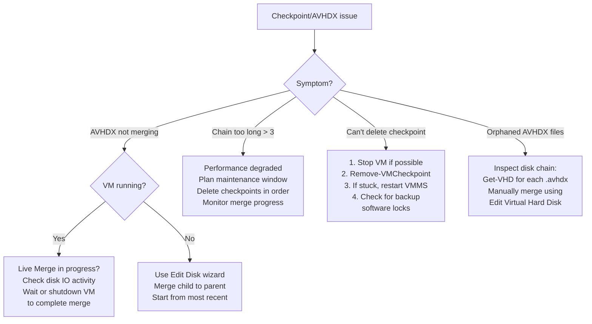
```mermaid
flowchart TD
    Start["Checkpoint/AVHDX issue"] --> Symptom{"Symptom?"}
    Symptom -->|"AVHDX not merging"| MergeCheck{"VM running?"}
    MergeCheck -->|"Yes"| LiveMerge["Live Merge in progress?<br/>Check disk IO activity<br/>Wait or shutdown VM<br/>to complete merge"]
    MergeCheck -->|"No"| ManualMerge["Use Edit Disk wizard<br/>Merge child to parent<br/>Start from most recent"]
    Symptom -->|"Chain too long > 3"| Performance["Performance degraded<br/>Plan maintenance window<br/>Delete checkpoints in order<br/>Monitor merge progress"]
    Symptom -->|"Can't delete checkpoint"| Stuck["1. Stop VM if possible<br/>2. Remove-VMCheckpoint<br/>3. If stuck, restart VMMS<br/>4. Check for backup<br/>software locks"]
    Symptom -->|"Orphaned AVHDX files"| Orphaned["Inspect disk chain:<br/>Get-VHD for each .avhdx<br/>Manually merge using<br/>Edit Virtual Hard Disk"]
```

**💡 Tips：**
- **Tip 1：** 合并顺序必须从**最新的（最末端的）AVHDX** 开始，逐级向上合并
- **Tip 2：** Live Merge 在 VM 运行时可能非常慢（取决于 IO 负载），大型 Checkpoint 建议在维护窗口关机合并
- **⚠️ 常见误区：** 在文件系统层面直接删除 .avhdx 文件 = **永久数据丢失**！始终通过 Hyper-V Manager 或 PowerShell 操作

---

### 场景 D2: VHDX 损坏或扩展失败

**典型症状：** VM 内磁盘报 IO 错误、VHDX 在线扩展失败、Compact 操作失败

**排查流程图：**

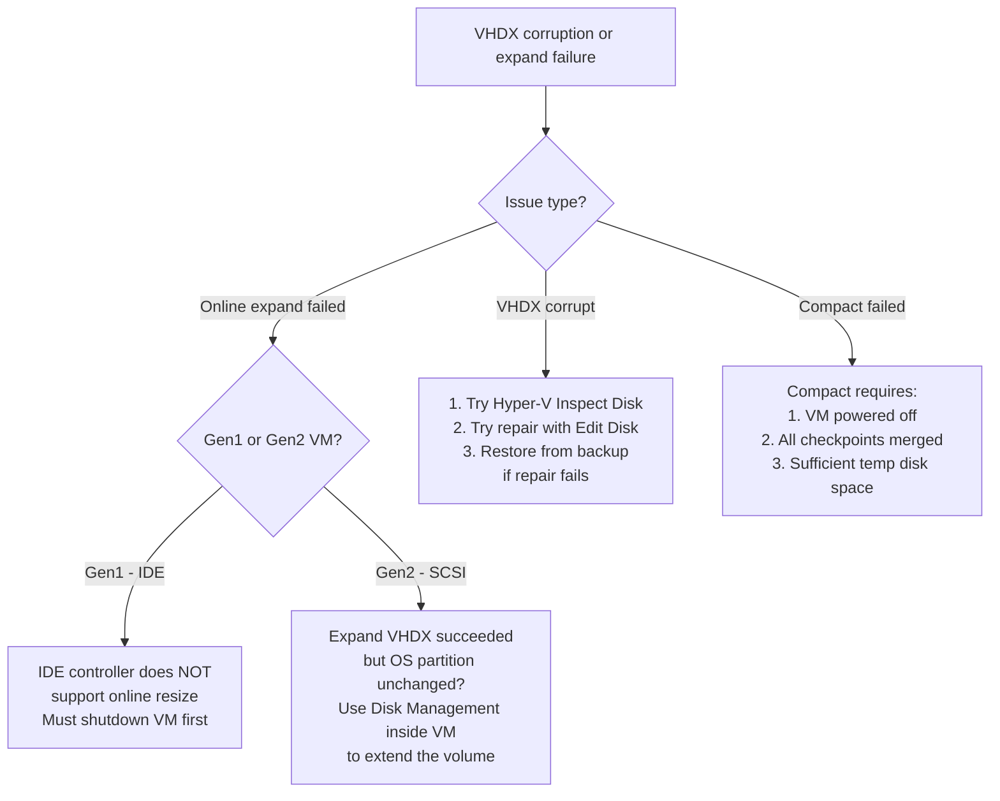
```mermaid
flowchart TD
    Start["VHDX corruption or expand failure"] --> Type{"Issue type?"}
    Type -->|"Online expand failed"| ExpandCheck{"Gen1 or Gen2 VM?"}
    ExpandCheck -->|"Gen1 - IDE"| NoExpand["IDE controller does NOT<br/>support online resize<br/>Must shutdown VM first"]
    ExpandCheck -->|"Gen2 - SCSI"| Partition["Expand VHDX succeeded<br/>but OS partition unchanged?<br/>Use Disk Management inside VM<br/>to extend the volume"]
    Type -->|"VHDX corrupt"| Repair["1. Try Hyper-V Inspect Disk<br/>2. Try repair with Edit Disk<br/>3. Restore from backup<br/>if repair fails"]
    Type -->|"Compact failed"| CompactReq["Compact requires:<br/>1. VM powered off<br/>2. All checkpoints merged<br/>3. Sufficient temp disk space"]
```

**💡 Tips：**
- **Tip 1：** VHDX 在线扩展只改变虚拟磁盘大小，**不会自动扩展 Guest 内部的分区**。需要在 VM 内使用 Disk Management 扩展
- **⚠️ 常见误区：** Dynamic VHDX 永远不会自动缩小，即使 Guest 删除了大量文件。需要手动 Compact

---

### 场景 E1: VM 完全无网络

**典型症状：** VM 无法 ping 任何地址、网络完全不通

**排查流程图：**

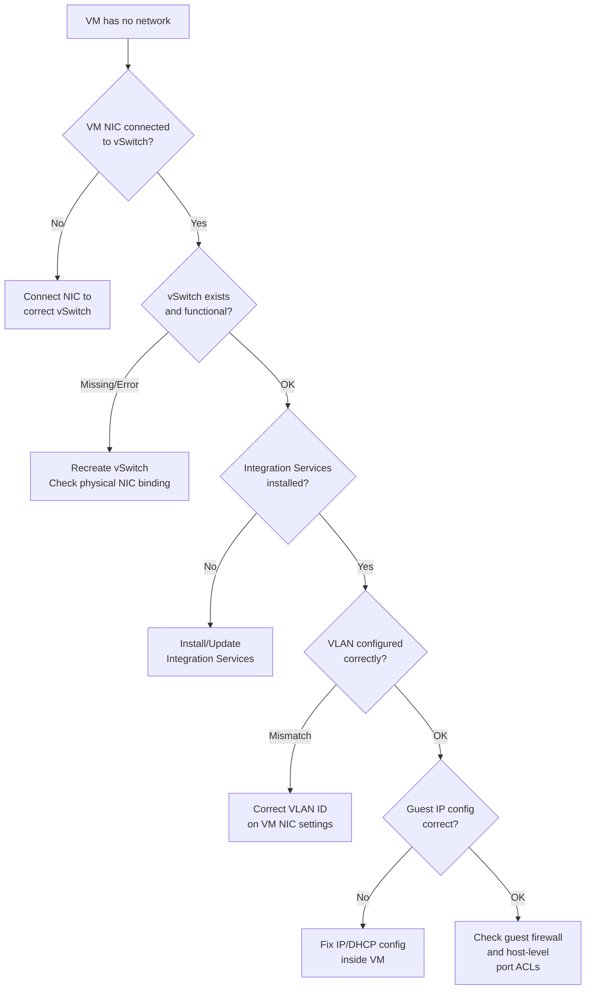
```mermaid
flowchart TD
    Start["VM has no network"] --> NICCheck{"VM NIC connected<br/>to vSwitch?"}
    NICCheck -->|"No"| ConnectNIC["Connect NIC to<br/>correct vSwitch"]
    NICCheck -->|"Yes"| vSwitchCheck{"vSwitch exists<br/>and functional?"}
    vSwitchCheck -->|"Missing/Error"| RecreateSwitch["Recreate vSwitch<br/>Check physical NIC binding"]
    vSwitchCheck -->|"OK"| ISCheck{"Integration Services<br/>installed?"}
    ISCheck -->|"No"| InstallIS["Install/Update<br/>Integration Services"]
    ISCheck -->|"Yes"| VLAN{"VLAN configured<br/>correctly?"}
    VLAN -->|"Mismatch"| FixVLAN["Correct VLAN ID<br/>on VM NIC settings"]
    VLAN -->|"OK"| GuestIP{"Guest IP config<br/>correct?"}
    GuestIP -->|"No"| FixIP["Fix IP/DHCP config<br/>inside VM"]
    GuestIP -->|"OK"| Firewall["Check guest firewall<br/>and host-level<br/>port ACLs"]
```

**💡 Tips：**
- **Tip 1：** 创建 External vSwitch 时绑定物理 NIC，会**中断该 NIC 的管理连接**。务必保留独立管理 NIC 或使用 SET
- **Tip 2：** 如果 vSwitch 绑定的物理 NIC 驱动更新失败，vSwitch 会断开所有 VM 的网络

---

### 场景 F1: Replica 初始复制失败

**典型症状：** 配置 Hyper-V Replica 后初始复制报错、连接不上、认证失败

**排查流程图：**

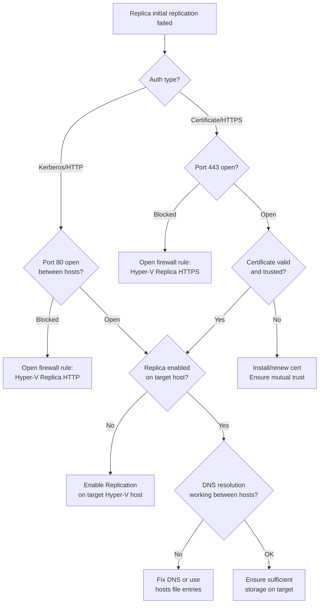
```mermaid
flowchart TD
    Start["Replica initial replication failed"] --> AuthType{"Auth type?"}
    AuthType -->|"Kerberos/HTTP"| Port80{"Port 80 open<br/>between hosts?"}
    Port80 -->|"Blocked"| OpenFW["Open firewall rule:<br/>Hyper-V Replica HTTP"]
    Port80 -->|"Open"| ReplicaEnabled{"Replica enabled<br/>on target host?"}
    AuthType -->|"Certificate/HTTPS"| Port443{"Port 443 open?"}
    Port443 -->|"Blocked"| OpenFW443["Open firewall rule:<br/>Hyper-V Replica HTTPS"]
    Port443 -->|"Open"| CertValid{"Certificate valid<br/>and trusted?"}
    CertValid -->|"No"| FixCert["Install/renew cert<br/>Ensure mutual trust"]
    CertValid -->|"Yes"| ReplicaEnabled
    ReplicaEnabled -->|"No"| EnableReplica["Enable Replication<br/>on target Hyper-V host"]
    ReplicaEnabled -->|"Yes"| DNS{"DNS resolution<br/>working between hosts?"}
    DNS -->|"No"| FixDNS["Fix DNS or use<br/>hosts file entries"]
    DNS -->|"OK"| StorageSpace["Ensure sufficient<br/>storage on target"]
```

**💡 Tips：**
- **Tip 1：** 大型 VM（TB 级别磁盘）可以选择"初始复制导出到外部媒体"方式，避免网络传输瓶颈
- **Tip 2：** 跨域场景必须使用证书认证（HTTPS），Kerberos 只适用于同域环境

---

### 场景 F2: Replica Delta 复制延迟

**典型症状：** Replica 健康状态显示 Warning/Critical，复制延迟大于配置的 RPO

**排查流程图：**

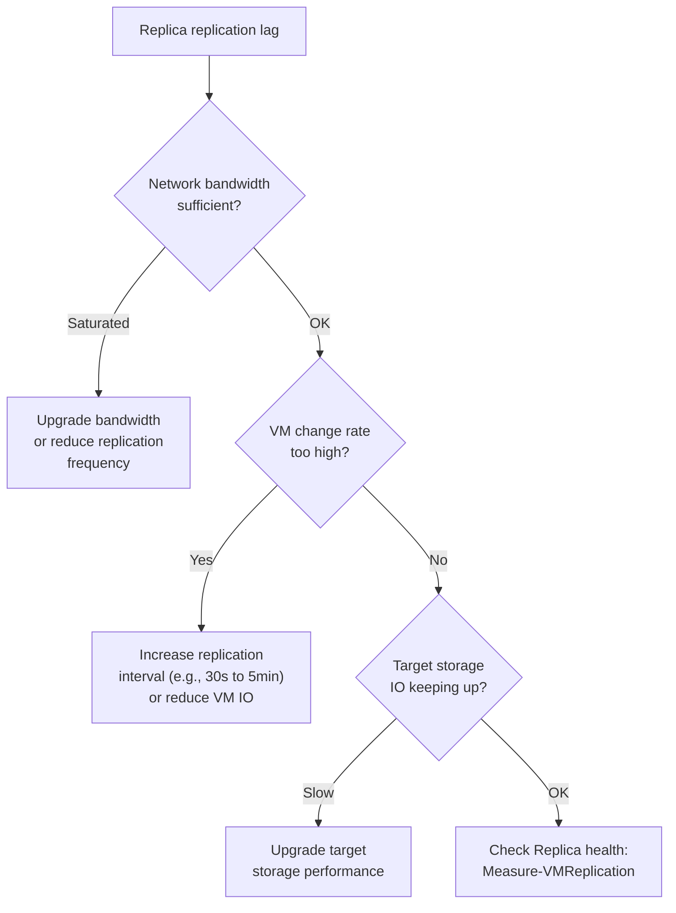
```mermaid
flowchart TD
    Start["Replica replication lag"] --> BW{"Network bandwidth<br/>sufficient?"}
    BW -->|"Saturated"| UpBW["Upgrade bandwidth<br/>or reduce replication<br/>frequency"]
    BW -->|"OK"| ChangeRate{"VM change rate<br/>too high?"}
    ChangeRate -->|"Yes"| Freq["Increase replication<br/>interval (e.g., 30s to 5min)<br/>or reduce VM IO"]
    ChangeRate -->|"No"| TargetDisk{"Target storage<br/>IO keeping up?"}
    TargetDisk -->|"Slow"| UpgradeTarget["Upgrade target<br/>storage performance"]
    TargetDisk -->|"OK"| Health["Check Replica health:<br/>Measure-VMReplication"]
```

**💡 Tips：**
- **Tip 1：** `Measure-VMReplication -VMName "VM1"` 可以查看详细的复制健康状态、延迟、大小
- **⚠️ 常见误区：** 30 秒复制频率听起来很好，但对于高变更率的 VM 可能导致持续的网络/存储压力

---

## 4. 通用排查工具箱 (Universal Toolkit)

### 日志收集

| 目的 | 命令/工具 | 说明 |
|------|----------|------|
| Hyper-V 管理事件 | Event Viewer → `Hyper-V-VMMS/Admin` | VM 管理相关错误 |
| VM Worker 事件 | Event Viewer → `Hyper-V-Worker/Admin` | 单个 VM 运行时错误 |
| Hypervisor 事件 | Event Viewer → `Hyper-V-Hypervisor/Admin` | Hypervisor 底层错误 |
| 导出所有 Hyper-V 日志 | `Get-WinEvent -ListLog *Hyper-V* \| ForEach { Get-WinEvent -LogName $_.LogName -MaxEvents 100 }` | 批量导出 |
| 性能数据 | `logman create counter "HyperV-Perf" -cf HyperVCounters.txt -si 5 -max 512` | 自定义计数器集 |

### 诊断命令

| 目的 | 命令 | 说明 |
|------|------|------|
| 列出所有 VM 状态 | `Get-VM \| Format-Table Name, State, CPUUsage, MemoryAssigned -AutoSize` | 快速概览 |
| 检查 VHD 链 | `Get-VHD -Path "path.vhdx"` | 查看 ParentPath、大小、格式 |
| 检查 LM 兼容性 | `Compare-VM -Name "VM1" -DestinationHost "HV02"` | 迁移前检测 |
| Replica 健康 | `Measure-VMReplication -VMName "VM1"` | 复制状态和延迟 |
| Host 资源概览 | `Get-VMHost \| Select *Memory*, *Migration*` | Host 配置检查 |
| VM 网络详情 | `Get-VMNetworkAdapter -VMName "VM1" \| FL *` | 网卡配置详情 |

### 常用注册表/配置

| 配置项 | 路径/键值 | 作用 |
|--------|----------|------|
| Hypervisor 启动类型 | `bcdedit /enum {hypervisorlaunchtype}` | Auto = Hypervisor 随系统启动 |
| VM 配置文件路径 | `C:\ProgramData\Microsoft\Windows\Hyper-V\` | 默认 VM 配置位置 |
| VHD 默认路径 | `C:\Users\Public\Documents\Hyper-V\Virtual Hard Disks\` | 默认 VHD 存储位置 |
| Smart Paging 路径 | VM 设置 → Smart Paging File Location | 建议放在 SSD 上 |

---

## 5. 跨场景关联 (Cross-Scenario Relationships)

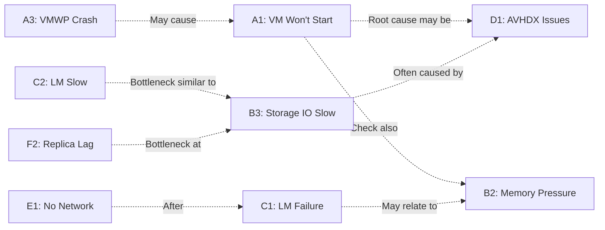
```mermaid
flowchart LR
    A1["A1: VM Won't Start"] -.->|"Root cause may be"| D1["D1: AVHDX Issues"]
    A1 -.->|"Check also"| B2["B2: Memory Pressure"]
    B3["B3: Storage IO Slow"] -.->|"Often caused by"| D1
    C1["C1: LM Failure"] -.->|"May relate to"| B2
    C2["C2: LM Slow"] -.->|"Bottleneck similar to"| B3
    E1["E1: No Network"] -.->|"After"| C1
    A3["A3: VMWP Crash"] -.->|"May cause"| A1
    F2["F2: Replica Lag"] -.->|"Bottleneck at"| B3
```

> **关键关联提示：**
> - VM 启动失败（A1）最常见根因是 AVHDX 问题（D1）
> - 存储 IO 慢（B3）通常和 Checkpoint 链过长（D1）同时出现
> - Live Migration 后 VM 网络断开（E1）通常是 vSwitch 配置在目标 Host 不一致
> - VMWP 崩溃（A3）会导致 VM 进入 Critical 状态，表现为"VM 无法启动"（A1）

---

## 6. 参考资料 (References)

- [Hyper-V Architecture](https://learn.microsoft.com/en-us/windows-server/administration/performance-tuning/role/hyper-v-server/architecture) — 官方架构文档
- [Troubleshoot Hyper-V VM Start/State Failures](https://learn.microsoft.com/en-us/troubleshoot/windows-server/virtualization/hyper-v-start-state-access-failures-clustered-standalone) — VM 启动和状态问题排查
- [Hyper-V Snapshots and AVHDX Troubleshooting](https://learn.microsoft.com/en-us/troubleshoot/windows-server/virtualization/merge-checkpoints-with-many-differencing-disks) — Checkpoint 和 AVHDX 合并指南
- [Troubleshoot Hyper-V VM Performance](https://learn.microsoft.com/en-us/troubleshoot/windows-server/virtualization/troubleshoot-hyper-v-virtual-machine-performance) — VM 性能排查
- [Live Migration Overview](https://learn.microsoft.com/en-us/windows-server/virtualization/hyper-v/manage/live-migration-overview) — Live Migration 文档
- [Hyper-V Replica Setup](https://learn.microsoft.com/en-us/windows-server/virtualization/hyper-v/manage/set-up-hyper-v-replica) — Replica 配置和管理

---

---

# English Version

---

# Scenario Map: Hyper-V Common Troubleshooting Navigation

**Product/Service:** Windows Server Hyper-V  
**Scope:** Comprehensive coverage of common Hyper-V VM management and runtime fault scenarios  
**Last Updated:** 2026-03-17

---

## 1. Scenario Overview

```mermaid
mindmap
  root((Hyper-V<br/>Troubleshooting))
    VM Lifecycle
      A1: VM Won't Start
      A2: VM Stuck in Saved/Paused State
      A3: VMMS/VMWP Crash
    Performance
      B1: VM CPU Bottleneck
      B2: VM Memory Pressure
      B3: VM Storage IO Slow
      B4: VM Network Slow
    Migration
      C1: Live Migration Failure
      C2: Live Migration Slow
      C3: Storage Migration Failure
    Storage
      D1: Checkpoint AVHDX Issues
      D2: VHDX Corruption or Expand Failure
      D3: Pass-through Disk Problems
    Networking
      E1: VM No Network Connectivity
      E2: VM Network Intermittent
      E3: vSwitch Configuration Issues
    Replication
      F1: Replica Initial Replication Failure
      F2: Replica Delta Replication Lag
      F3: Failover Issues
```

> This overview covers **6 categories with 18 common scenarios**. Use the symptom table below to quickly locate your issue.

---

## 2. How to Identify Your Scenario

| Symptom You See | Likely Scenario | Jump To |
|----------------|----------------|---------|
| VM start fails, stuck in "Starting" state | VM Won't Start | → [Scenario A1](#scenario-a1-vm-wont-start) |
| VM stuck in Saved / Paused / Off (Critical) | VM Stuck State | → [Scenario A2](#scenario-a2-vm-stuck-in-savedpaused-state) |
| vmms.exe / vmwp.exe crashes, all VMs affected | VMMS/VMWP Crash | → [Scenario A3](#scenario-a3-vmms--vmwp-process-crash) |
| VM CPU high but Host not / long vCPU wait | CPU Bottleneck | → [Scenario B1](#scenario-b1-vm-cpu-bottleneck) |
| VM out of memory, frequent page faults | Memory Pressure | → [Scenario B2](#scenario-b2-vm-memory-pressure) |
| VM high disk latency, slow IO | Storage IO Slow | → [Scenario B3](#scenario-b3-vm-storage-io-slow) |
| VM low throughput, packet loss, high latency | Network Slow | → [Scenario B4](#scenario-b4-vm-network-performance-issues) |
| Live Migration errors and rolls back | LM Failure | → [Scenario C1](#scenario-c1-live-migration-failure) |
| Live Migration completes but takes too long | LM Slow | → [Scenario C2](#scenario-c2-live-migration-slow) |
| Checkpoint won't delete / AVHDX won't merge | AVHDX Issues | → [Scenario D1](#scenario-d1-checkpoint--avhdx-issues) |
| VHDX corruption / online expand failure | VHDX Corruption | → [Scenario D2](#scenario-d2-vhdx-corruption-or-expand-failure) |
| VM has no network at all | No Connectivity | → [Scenario E1](#scenario-e1-vm-no-network-connectivity) |
| Replica initial replication fails | Replica Init Fail | → [Scenario F1](#scenario-f1-replica-initial-replication-failure) |
| Replica replication lag high | Replica Lag | → [Scenario F2](#scenario-f2-replica-delta-replication-lag) |

---

## 3. Scenario Details

---

### Scenario A1: VM Won't Start

**Typical Symptom:** Click Start in Hyper-V Manager, VM stays in "Starting" state or shows "Failed to start"

**Troubleshooting Logic:**
> First verify the Hypervisor itself is running, then check VM storage and config file accessibility, finally investigate resource shortages and permission issues.

**Troubleshooting Flowchart:**

```mermaid
flowchart TD
    Start["Symptom: VM fails to start"] --> HV{"Hypervisor running?<br/>systeminfo | findstr Hyper-V"}
    HV -->|"Not running"| FixHV["Check BIOS virtualization<br/>bcdedit /set hypervisorlaunchtype auto<br/>Restart host"]
    HV -->|"Running"| VHD{"VHD/VHDX files<br/>accessible?"}
    VHD -->|"Missing/Locked"| FixVHD["Restore files<br/>Check file locks<br/>Verify NTFS permissions"]
    VHD -->|"OK"| Chain{"AVHDX chain<br/>intact?<br/>Get-VHD -Path"}
    Chain -->|"Broken ParentPath"| FixChain["Repair chain:<br/>Set-VHD or manual edit<br/>Merge orphaned AVHDX"]
    Chain -->|"OK"| Mem{"Sufficient host<br/>memory for<br/>Startup Memory?"}
    Mem -->|"Insufficient"| FixMem["Free memory:<br/>Stop other VMs or<br/>reduce Startup Memory"]
    Mem -->|"OK"| Config{"Check VM config<br/>and Event Log<br/>Hyper-V-VMMS/Admin"}
    Config -->|"Error found"| FixConfig["Fix per event details:<br/>NIC mismatch, vSwitch missing,<br/>security policy, etc."]
    Config -->|"No clear error"| Escalate["Collect VMMS + Worker<br/>event logs, escalate"]
```

**Key Diagnostic Commands:**

| What to Check | Command | What to Look For |
|--------------|---------|-----------------|
| Hypervisor status | `systeminfo \| findstr "Hyper-V"` | Should show "A hypervisor has been detected" |
| VM disk chain | `Get-VHD -Path "C:\VMs\disk.avhdx"` | ParentPath points to existing file |
| VM status | `Get-VM -Name "TestVM" \| FL *` | State, Status, MemoryAssigned |
| Event logs | Event Viewer → Hyper-V-VMMS/Admin | Specific error code for startup failure |

**💡 Tips:**
- **Tip 1:** AVHDX chain breaks are the most common cause of startup failure when checkpoints exist. Check ParentPath for each with `Get-VHD`
- **Tip 2:** Third-party backup software (Veeam, Arcserve, etc.) sometimes locks VHD files, preventing VM start
- **⚠️ Common Mistake:** Never delete AVHDX files directly! This permanently loses all data since that checkpoint

**Solution Summary:**

| Root Cause | Fix | Verification |
|-----------|-----|-------------|
| Hypervisor not started | `bcdedit /set hypervisorlaunchtype auto` + reboot | `systeminfo` confirms |
| VHD file missing | Restore from backup / fix storage path | `Test-Path` confirms file exists |
| AVHDX chain broken | `Set-VHD -ParentPath` to repair | `Get-VHD` verifies complete chain |
| Host memory insufficient | Free memory or reduce Startup Memory | `Get-VM` confirms successful start |

---

### Scenario A2: VM Stuck in Saved/Paused State

**Typical Symptom:** VM shows Saved, Paused, or Off (Critical) and won't resume normally

**Troubleshooting Flowchart:**

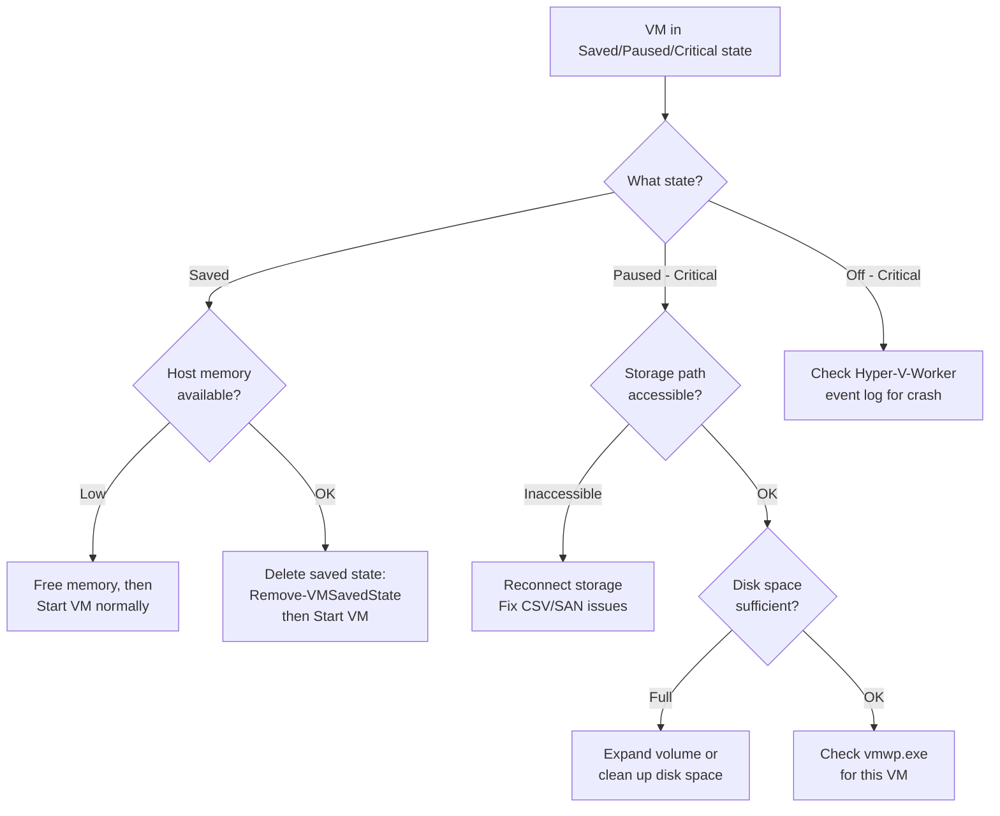
```mermaid
flowchart TD
    Start["VM in Saved/Paused/Critical state"] --> State{"What state?"}
    State -->|"Saved"| SavedCheck{"Host memory<br/>available?"}
    SavedCheck -->|"Low"| FreeMem["Free memory, then<br/>Start VM normally"]
    SavedCheck -->|"OK"| DelSaved["Delete saved state:<br/>Remove-VMSavedState<br/>then Start VM"]
    State -->|"Paused - Critical"| Storage{"Storage path<br/>accessible?"}
    Storage -->|"Inaccessible"| FixStorage["Reconnect storage<br/>Fix CSV/SAN issues"]
    Storage -->|"OK"| DiskSpace{"Disk space<br/>sufficient?"}
    DiskSpace -->|"Full"| FreeSpace["Expand volume or<br/>clean up disk space"]
    DiskSpace -->|"OK"| Worker["Check vmwp.exe<br/>for this VM"]
    State -->|"Off - Critical"| EventLog["Check Hyper-V-Worker<br/>event log for crash"]
```

**💡 Tips:**
- **Tip 1:** `Remove-VMSavedState -VMName "VM1"` discards saved state and allows cold boot
- **Tip 2:** Auto-pause usually means storage path loss or insufficient disk space — check CSV or SAN status

---

### Scenario A3: VMMS / VMWP Process Crash

**Typical Symptom:** vmms.exe crash affects all VM management; single vmwp.exe crash puts one VM in Critical state

**Troubleshooting Flowchart:**

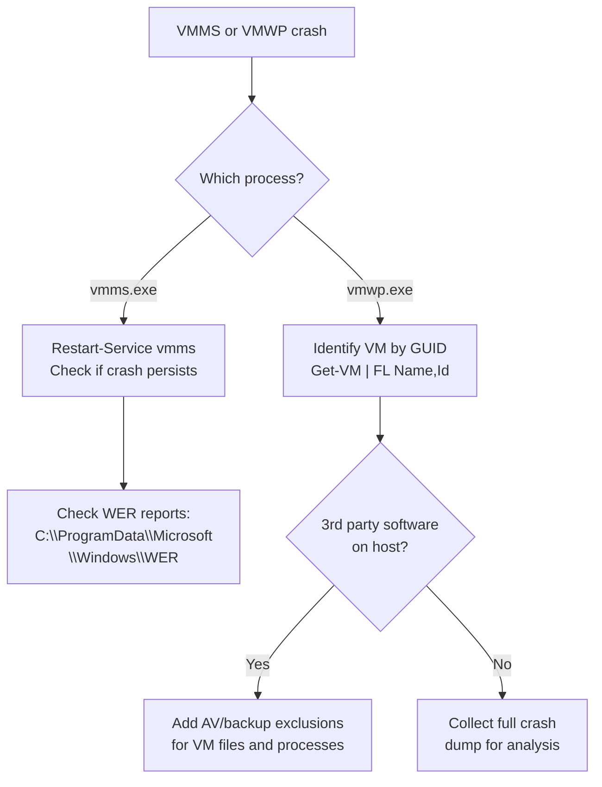
```mermaid
flowchart TD
    Start["VMMS or VMWP crash"] --> Which{"Which process?"}
    Which -->|"vmms.exe"| RestartSvc["Restart-Service vmms<br/>Check if crash persists"]
    RestartSvc --> WER["Check WER reports:<br/>C:\\ProgramData\\Microsoft<br/>\\Windows\\WER"]
    Which -->|"vmwp.exe"| IdentifyVM["Identify VM by GUID<br/>Get-VM | FL Name,Id"]
    IdentifyVM --> ThirdParty{"3rd party software<br/>on host?"}
    ThirdParty -->|"Yes"| Exclude["Add AV/backup exclusions<br/>for VM files and processes"]
    ThirdParty -->|"No"| Dump["Collect full crash<br/>dump for analysis"]
```

**💡 Tips:**
- **Tip 1:** Antivirus scanning VHD/VHDX/AVHDX files is a common cause of vmwp.exe crashes. **Must add exclusions**
- **⚠️ Common Mistake:** Restarting vmms service does NOT affect running VMs (each VM has its own vmwp.exe)

---

### Scenario B1: VM CPU Bottleneck

**Troubleshooting Flowchart:**

```mermaid
flowchart TD
    Start["VM CPU bottleneck"] --> HostCPU{"Host CPU > 80%?"}
    HostCPU -->|"Yes"| Overcommit["CPU overcommit<br/>Reduce vCPU count<br/>or migrate VMs"]
    HostCPU -->|"No"| WaitTime{"vCPU Wait Time<br/>> 50000 ns?"}
    WaitTime -->|"Yes"| ReduceVCPU["Scheduling contention<br/>Reduce total vCPUs<br/>Check NUMA alignment"]
    WaitTime -->|"No"| GuestIssue["Guest OS/app issue<br/>Profile CPU usage<br/>Update Integration Services"]
```

**💡 Tips:**
- **Tip 1:** More vCPUs is NOT always better. Excessive vCPUs increase Hypervisor scheduling overhead
- **Tip 2:** Check `Get-VMProcessor` for "Processor Compatibility Mode" which may reduce CPU features

---

### Scenario B2: VM Memory Pressure

**Troubleshooting Flowchart:**

```mermaid
flowchart TD
    Start["VM memory pressure"] --> DynMem{"Dynamic Memory?"}
    DynMem -->|"Yes"| HostMem{"Host available<br/>memory > 2GB?"}
    HostMem -->|"Low"| HostFix["Host exhausted<br/>Balance VMs or add RAM"]
    HostMem -->|"OK"| MaxReached{"VM at Max Memory?"}
    MaxReached -->|"Yes"| IncMax["Increase Max Memory"]
    MaxReached -->|"No"| Balancer["Check buffer %<br/>and memory priority"]
    DynMem -->|"No"| StaticCheck{"Static RAM sufficient?"}
    StaticCheck -->|"No"| IncStatic["Increase static memory<br/>Requires VM shutdown"]
    StaticCheck -->|"Yes"| Leak["Check guest for<br/>memory leak"]
```

**💡 Tips:**
- **Tip 1:** Frequent Smart Paging (temporary .bin files on disk) indicates severe host memory shortage
- **Tip 2:** For SQL Server, Exchange — use **static memory** instead of Dynamic Memory

---

### Scenario B3: VM Storage IO Slow

**Troubleshooting Flowchart:**

```mermaid
flowchart TD
    Start["VM storage IO slow"] --> Chain{"AVHDX chain > 3?"}
    Chain -->|"Yes"| Merge["Merge checkpoints"]
    Chain -->|"OK"| DiskType{"Dynamic VHD?"}
    DiskType -->|"Yes"| Convert["Convert to Fixed"]
    DiskType -->|"Fixed"| HostDisk{"Host disk<br/>latency high?"}
    HostDisk -->|"Yes"| PhysFix["Check physical storage"]
    HostDisk -->|"OK"| AV{"AV scanning<br/>VHD files?"}
    AV -->|"Yes"| Exclude["Add AV exclusions"]
    AV -->|"No"| Controller["Check IDE vs SCSI<br/>Use SCSI for best perf"]
```

**💡 Tips:**
- **Tip 1:** Unmerged checkpoints are the #1 killer of VM storage performance
- **⚠️ Common Mistake:** IDE controller in Gen1 VMs is significantly slower than SCSI

---

### Scenario B4: VM Network Performance Issues

**Troubleshooting Flowchart:**

```mermaid
flowchart TD
    Start["VM network slow"] --> IS{"Integration Services<br/>current?"}
    IS -->|"No"| Update["Update IS"]
    IS -->|"Yes"| NIC{"Synthetic or Legacy NIC?"}
    NIC -->|"Legacy"| Switch["Switch to Synthetic"]
    NIC -->|"Synthetic"| VMQ{"VMQ enabled?"}
    VMQ -->|"No"| EnableVMQ["Enable VMQ"]
    VMQ -->|"Yes"| SRIOV{"SR-IOV available?"}
    SRIOV -->|"No"| vRSS["Enable vRSS inside VM"]
    SRIOV -->|"Yes/N/A"| PhysNIC["Check physical NIC<br/>errors, driver, firmware"]
```

**💡 Tips:**
- **Tip 1:** Legacy NIC (emulated DEC 21140) caps at ~100 Mbps. Must use Synthetic NIC
- **Tip 2:** In SET environments, ensure all NIC models and driver versions match

---

### Scenario C1: Live Migration Failure

**Troubleshooting Flowchart:**

```mermaid
flowchart TD
    Start["LM failed"] --> Error{"Error type<br/>from Event Log?"}
    Error -->|"CPU incompatible"| CPU["Enable Processor<br/>Compatibility Mode"]
    Error -->|"Auth failed"| Auth["Fix CredSSP or<br/>Kerberos Delegation"]
    Error -->|"Network error"| Net["Test-NetConnection<br/>Port 6600"]
    Error -->|"Storage not found"| Storage["Verify both hosts<br/>can access VM storage"]
    Error -->|"Memory insufficient"| Mem["Free memory on<br/>destination host"]
```

**Key Diagnostic Commands:**

| What to Check | Command | What to Look For |
|--------------|---------|-----------------|
| Compatibility | `Compare-VM -Name "VM1" -DestinationHost "HV02"` | Lists all incompatibilities |
| LM config | `Get-VMHost \| Select *Migration*` | Concurrent count, network, auth |
| Connectivity | `Test-NetConnection HV02 -Port 6600` | LM port reachable |

**💡 Tips:**
- **Tip 1:** CPU compatibility issues are most common in **heterogeneous clusters** (different CPU generations)
- **⚠️ Common Mistake:** CredSSP doesn't support "third-party initiated" migration (can't remotely trigger from management station)

---

### Scenario C2: Live Migration Slow

**Troubleshooting Flowchart:**

```mermaid
flowchart TD
    Start["LM very slow"] --> BW{"LM network < 10 Gbps?"}
    BW -->|"Yes"| Upgrade["Upgrade network or<br/>enable Compression"]
    BW -->|"No"| Dirty{"High memory<br/>dirty rate?"}
    Dirty -->|"Yes"| Options["Use RDMA/SMB Direct<br/>or Quick Migration"]
    Dirty -->|"No"| Concurrent{"Too many<br/>concurrent migrations?"}
    Concurrent -->|"Yes"| Reduce["Reduce concurrent count"]
    Concurrent -->|"No"| RDMA["Enable SMB Direct<br/>for best performance"]
```

**💡 Tips:**
- **Tip 1:** VMs with high dirty rates (OLTP databases) may never converge. Use Quick Migration instead
- **Tip 2:** SMB Direct (RDMA) is the optimal LM transport, but requires RDMA NICs

---

### Scenario D1: Checkpoint / AVHDX Issues

**Troubleshooting Flowchart:**

```mermaid
flowchart TD
    Start["Checkpoint/AVHDX issue"] --> Symptom{"Symptom?"}
    Symptom -->|"Not merging"| VM{"VM running?"}
    VM -->|"Yes"| Wait["Live Merge in progress<br/>Wait or shut down VM"]
    VM -->|"No"| Manual["Edit Disk wizard<br/>Merge child to parent"]
    Symptom -->|"Chain too long"| Plan["Plan maintenance<br/>Delete checkpoints in order"]
    Symptom -->|"Can't delete"| Stuck["Stop VM if possible<br/>Remove-VMCheckpoint<br/>Restart VMMS if stuck"]
```

**💡 Tips:**
- **Tip 1:** Always merge from the **newest (outermost) AVHDX** first, working up the chain
- **⚠️ Common Mistake:** Directly deleting .avhdx files in file system = **permanent data loss**

---

### Scenario D2: VHDX Corruption or Expand Failure

**Troubleshooting Flowchart:**

```mermaid
flowchart TD
    Start["VHDX issue"] --> Type{"Issue type?"}
    Type -->|"Online expand failed"| Gen{"Gen1 IDE or Gen2 SCSI?"}
    Gen -->|"Gen1 IDE"| NoOnline["IDE doesn't support<br/>online resize<br/>Shutdown VM first"]
    Gen -->|"Gen2 SCSI"| Partition["VHDX expanded OK<br/>But extend partition<br/>inside VM with<br/>Disk Management"]
    Type -->|"Corruption"| Repair["Inspect Disk → Edit Disk<br/>Or restore from backup"]
    Type -->|"Compact failed"| Reqs["Requires: VM off,<br/>checkpoints merged,<br/>sufficient temp space"]
```

**💡 Tips:**
- **Tip 1:** VHDX online expand only changes virtual disk size, **does NOT auto-extend the guest partition**
- **⚠️ Common Mistake:** Dynamic VHDX never auto-shrinks, even after deleting large files in guest. Manual Compact needed

---

### Scenario E1: VM No Network Connectivity

**Troubleshooting Flowchart:**

```mermaid
flowchart TD
    Start["VM no network"] --> NIC{"VM NIC connected<br/>to vSwitch?"}
    NIC -->|"No"| Connect["Connect to correct vSwitch"]
    NIC -->|"Yes"| Switch{"vSwitch functional?"}
    Switch -->|"Error"| Recreate["Recreate vSwitch"]
    Switch -->|"OK"| IS{"Integration Services?"}
    IS -->|"No"| Install["Install/Update IS"]
    IS -->|"Yes"| VLAN{"VLAN correct?"}
    VLAN -->|"Mismatch"| Fix["Correct VLAN ID"]
    VLAN -->|"OK"| IP{"Guest IP correct?"}
    IP -->|"No"| FixIP["Fix IP/DHCP config"]
    IP -->|"OK"| FW["Check guest firewall<br/>and port ACLs"]
```

**💡 Tips:**
- **Tip 1:** Creating an External vSwitch bound to a physical NIC **interrupts that NIC's management connection**. Keep a separate management NIC
- **Tip 2:** If the physical NIC driver update fails, vSwitch disconnects ALL VMs

---

### Scenario F1: Replica Initial Replication Failure

**Troubleshooting Flowchart:**

```mermaid
flowchart TD
    Start["Replica init failed"] --> Auth{"Auth type?"}
    Auth -->|"Kerberos/HTTP"| Port80{"Port 80 open?"}
    Port80 -->|"No"| FW["Open Hyper-V Replica<br/>HTTP firewall rule"]
    Port80 -->|"Yes"| Enabled{"Replica enabled<br/>on target?"}
    Auth -->|"Certificate/HTTPS"| Port443{"Port 443 open?"}
    Port443 -->|"No"| FW443["Open HTTPS rule"]
    Port443 -->|"Yes"| Cert{"Cert valid/trusted?"}
    Cert -->|"No"| FixCert["Install/renew cert"]
    Cert -->|"Yes"| Enabled
    Enabled -->|"No"| Enable["Enable on target"]
    Enabled -->|"Yes"| DNS["Check DNS resolution<br/>and storage space"]
```

**💡 Tips:**
- **Tip 1:** For large VMs (TB-scale), use "Export to External Media" for initial replication to avoid network bottleneck
- **Tip 2:** Cross-domain scenarios must use certificate auth (HTTPS); Kerberos only works within the same domain

---

### Scenario F2: Replica Delta Replication Lag

**Troubleshooting Flowchart:**

```mermaid
flowchart TD
    Start["Replica lag"] --> BW{"Network saturated?"}
    BW -->|"Yes"| Fix["Upgrade bandwidth or<br/>reduce replication frequency"]
    BW -->|"No"| Change{"VM change rate<br/>too high?"}
    Change -->|"Yes"| Adjust["Increase replication<br/>interval or reduce VM IO"]
    Change -->|"No"| Target{"Target storage slow?"}
    Target -->|"Yes"| Upgrade["Upgrade target storage"]
    Target -->|"No"| Health["Measure-VMReplication<br/>for detailed health"]
```

**💡 Tips:**
- **Tip 1:** `Measure-VMReplication -VMName "VM1"` shows detailed replication health, lag, and size
- **⚠️ Common Mistake:** 30-second frequency sounds great but can cause sustained network/storage pressure for high-change-rate VMs

---

## 4. Universal Toolkit

### Log Collection

| Purpose | Command/Tool | Description |
|---------|-------------|-------------|
| Hyper-V management events | Event Viewer → `Hyper-V-VMMS/Admin` | VM management errors |
| VM Worker events | Event Viewer → `Hyper-V-Worker/Admin` | Individual VM runtime errors |
| Hypervisor events | Event Viewer → `Hyper-V-Hypervisor/Admin` | Low-level Hypervisor errors |
| Export all Hyper-V logs | `Get-WinEvent -ListLog *Hyper-V* \| ForEach { Get-WinEvent -LogName $_.LogName -MaxEvents 100 }` | Batch export |

### Diagnostic Commands

| Purpose | Command | Description |
|---------|---------|-------------|
| List all VM states | `Get-VM \| FT Name, State, CPUUsage, MemoryAssigned` | Quick overview |
| Check VHD chain | `Get-VHD -Path "path.vhdx"` | View ParentPath, size, format |
| LM compatibility | `Compare-VM -Name "VM1" -DestinationHost "HV02"` | Pre-migration check |
| Replica health | `Measure-VMReplication -VMName "VM1"` | Replication status and lag |
| Host overview | `Get-VMHost \| Select *Memory*, *Migration*` | Host config check |

---

## 5. Cross-Scenario Relationships

```mermaid
flowchart LR
    A1["A1: VM Won't Start"] -.->|"Root cause may be"| D1["D1: AVHDX Issues"]
    A1 -.->|"Check also"| B2["B2: Memory Pressure"]
    B3["B3: Storage IO Slow"] -.->|"Often caused by"| D1
    C1["C1: LM Failure"] -.->|"May relate to"| B2
    C2["C2: LM Slow"] -.->|"Bottleneck similar to"| B3
    E1["E1: No Network"] -.->|"After"| C1
    A3["A3: VMWP Crash"] -.->|"May cause"| A1
    F2["F2: Replica Lag"] -.->|"Bottleneck at"| B3
```

> **Key relationships:**
> - VM startup failure (A1) most commonly caused by AVHDX issues (D1)
> - Storage IO slow (B3) often coincides with long checkpoint chains (D1)
> - Post-Live Migration network loss (E1) usually due to vSwitch config mismatch on target host
> - VMWP crash (A3) puts VM in Critical state, manifesting as "VM won't start" (A1)

---

## 6. References

- [Hyper-V Architecture](https://learn.microsoft.com/en-us/windows-server/administration/performance-tuning/role/hyper-v-server/architecture) — Official architecture document
- [Troubleshoot Hyper-V VM Start/State Failures](https://learn.microsoft.com/en-us/troubleshoot/windows-server/virtualization/hyper-v-start-state-access-failures-clustered-standalone) — VM start and state troubleshooting
- [Hyper-V Snapshots and AVHDX Troubleshooting](https://learn.microsoft.com/en-us/troubleshoot/windows-server/virtualization/merge-checkpoints-with-many-differencing-disks) — Checkpoint and AVHDX merge guide
- [Troubleshoot Hyper-V VM Performance](https://learn.microsoft.com/en-us/troubleshoot/windows-server/virtualization/troubleshoot-hyper-v-virtual-machine-performance) — VM performance troubleshooting
- [Live Migration Overview](https://learn.microsoft.com/en-us/windows-server/virtualization/hyper-v/manage/live-migration-overview) — Live Migration documentation
- [Hyper-V Replica Setup](https://learn.microsoft.com/en-us/windows-server/virtualization/hyper-v/manage/set-up-hyper-v-replica) — Replica configuration and management
