# Scenario Map: Windows Defender Firewall 排查导航

**Product/Service:** Windows Defender Firewall / Windows Filtering Platform (WFP)
**Scope:** 防火墙服务、配置文件、规则、性能、丢包、远程管理全场景
**Last Updated:** 2026-04-17

---

## 1. 场景全景图 (Scenario Overview)

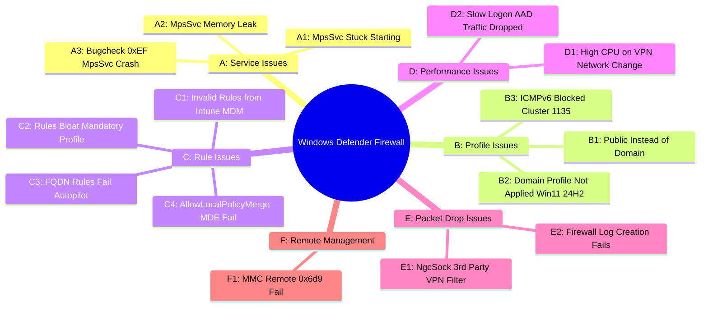

---

## 2. 场景识别指南 (How to Identify Your Scenario)

| 你看到的症状 | 可能的场景 | 跳转 |
|-------------|-----------|------|
| MpsSvc 服务卡在 "Starting"，无法完成启动 | 场景 A1 | → [A1](#场景-a1-mpssvc-启动挂起) |
| MpsSvc 进程内存持续增长，需频繁重启 | 场景 A2 | → [A2](#场景-a2-mpssvc-内存泄漏) |
| 蓝屏 Bugcheck 0xEF CRITICAL_PROCESS_DIED | 场景 A3 | → [A3](#场景-a3-bugcheck-0xef-mpssvc-崩溃) |
| 防火墙配置文件显示 Public 而非 Domain | 场景 B1 | → [B1](#场景-b1-配置文件显示-public-而非-domain) |
| Win11 24H2/25H2 域认证后仍非 Domain profile | 场景 B2 | → [B2](#场景-b2-win11-24h225h2-domain-profile-不生效) |
| 集群节点被移除 Event 1135，启用 IPv6 后出现 | 场景 B3 | → [B3](#场景-b3-icmpv6-被阻断导致集群节点移除) |
| Intune 推送的规则在 WFAS 中显示 "Invalid" | 场景 C1 | → [C1](#场景-c1-intune-推送规则显示-invalid) |
| 大量重复防火墙规则，登录慢或黑屏 | 场景 C2 | → [C2](#场景-c2-mandatory-profile-导致规则膨胀) |
| Autopilot 期间 FQDN 规则无法生效，出站被拦截 | 场景 C3 | → [C3](#场景-c3-autopilot-期间-fqdn-规则失败) |
| 设置 AllowLocalPolicyMerge=false 但本地规则仍生效 | 场景 C4 | → [C4](#场景-c4-allowlocalpolicymerge-通过-mde-配置失败) |
| VPN 连接或网络切换后 CPU 飙高、黑屏 | 场景 D1 | → [D1](#场景-d1-vpn网络切换后-cpu-飙高黑屏) |
| AAD 登录缓慢，防火墙丢弃 login.microsoftonline.com 流量 | 场景 D2 | → [D2](#场景-d2-防火墙丢弃-aad-流量导致登录缓慢) |
| Cisco AnyConnect 下部分站点无法访问 | 场景 E1 | → [E1](#场景-e1-ngcsock-第三方-vpn-过滤器丢包) |
| 防火墙日志文件无法创建 | 场景 E2 | → [E2](#场景-e2-防火墙日志文件创建失败) |
| Firewall MMC 远程连接失败 0x6d9 | 场景 F1 | → [F1](#场景-f1-firewall-mmc-远程连接失败-0x6d9) |

---

## 3. 各场景排查详情 (Scenario Details)

---

### 场景 A1: MpsSvc 启动挂起

**典型症状：** Windows Firewall 服务 (MpsSvc) 卡在 "Starting" 状态，长时间无法变为 Running。依赖防火墙的网络功能异常。

**排查逻辑：**
> MpsSvc 启动时需要读取 PolicyManager 下的 NetworkIsolation 注册表项。如果关键项（如 EnterpriseProxyServers）缺失，服务会在 registry 读取阶段挂起。使用 TSS + Procmon boot logging 可以精确捕获 NAME NOT FOUND 错误。

**排查流程图：**

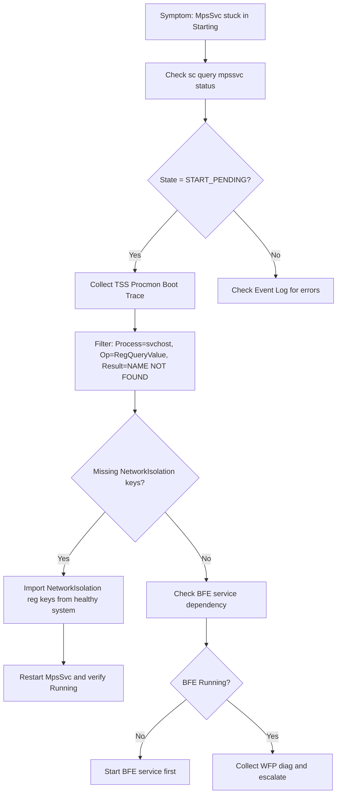

**关键诊断命令：**

| 检查什么 | 命令 | 看什么 |
|---------|------|--------|
| MpsSvc 当前状态 | `sc query mpssvc` | STATE 是否为 START_PENDING |
| BFE 服务状态 | `sc query bfe` | BFE 必须为 RUNNING |
| NetworkIsolation 注册表 | `reg query "HKLM\SOFTWARE\Microsoft\PolicyManager\default\NetworkIsolation" /s` | 是否存在 EnterpriseProxyServers 子项 |
| Boot trace 收集 | `TSS.ps1 -Scenario NET_Firewall -Boot` | 重启后收集启动阶段日志 |

**💡 Tips：**
- **Tip 1：** Procmon boot logging 必须在出问题的机器上配置后重启才能抓到启动阶段的行为，普通 Procmon 抓不到服务启动的 registry 访问。
- **Tip 2：** 导入 registry 时注意从**相同 OS 版本**的健康机器导出，不同版本的默认值可能不同。
- **⚠️ 常见误区：** 不要直接重装防火墙组件或 SFC，问题不在文件损坏而在 registry policy 缺失。

**解决方案摘要：**

| 根因 | 修复方法 | 验证方式 |
|------|---------|---------|
| NetworkIsolation\EnterpriseProxyServers 注册表项缺失 | 从健康同版本系统导出并导入该 registry key | `sc query mpssvc` 显示 RUNNING |
| BFE 服务未启动 | `net start bfe` 然后 `net start mpssvc` | 两个服务均 RUNNING |

---

### 场景 A2: MpsSvc 内存泄漏

**典型症状：** MpsSvc 所在 svchost 进程内存持续增长，尤其在频繁添加/删除防火墙规则的环境中（如使用 IPBan 等自动封禁工具）。Server 2025 上更常见。

**排查逻辑：**
> 当第三方工具高频调用 API 增删防火墙规则时，MpsSvc 内存分配但未完全释放，导致工作集持续增大。需要确认是否有外部程序在操作防火墙规则，并评估规则变更频率。

**排查流程图：**

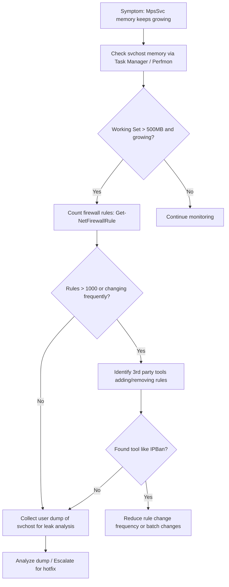

**关键诊断命令：**

| 检查什么 | 命令 | 看什么 |
|---------|------|--------|
| MpsSvc 进程内存 | `Get-Process -Id (Get-WmiObject Win32_Service -Filter "Name='mpssvc'").ProcessId \| Select WS, PM` | WorkingSet 是否持续增长 |
| 当前规则数量 | `(Get-NetFirewallRule).Count` | 规则总数是否异常大 |
| 规则变更审计 | Event Log: `Microsoft-Windows-Windows Firewall With Advanced Security/Firewall` Event 2004/2006 | 是否有高频 rule add/delete |
| 内存 trending | `Perfmon: Process\Working Set - svchost#N` | 持续上升趋势 |

**💡 Tips：**
- **Tip 1：** IPBan 等工具每次封禁 IP 会创建独立规则，建议改用 IP 段合并或使用 Windows Firewall 的 scope 地址列表减少规则数量。
- **⚠️ 常见误区：** 仅重启 MpsSvc 只是临时缓解，如果不解决高频规则变更的根因，内存会重新增长。

**解决方案摘要：**

| 根因 | 修复方法 | 验证方式 |
|------|---------|---------|
| 第三方工具频繁增删规则导致内存泄漏 | 降低规则变更频率，批量操作替代逐条增删 | 内存不再持续增长 |
| Server 2025 已知 bug | 等待/申请 OS 修复补丁 | 安装补丁后监控内存 |

---

### 场景 A3: Bugcheck 0xEF MpsSvc 崩溃

**典型症状：** 蓝屏 Bugcheck 0xEF (CRITICAL_PROCESS_DIED)，dump 分析显示 svchost.exe (LocalServiceNoNetworkFirewall) 被终止。通常由第三方安全软件崩溃导致级联故障。

**排查逻辑：**
> svchost.exe 托管 MpsSvc 的进程是 critical process。如果同进程内的第三方 DLL（如 Cisco Secure Workload 的 TetSen.exe 注入的模块）崩溃，会导致整个 svchost 终止，触发 0xEF bugcheck。Dump 中关键调用链：`PspCatchCriticalBreak → PspTerminateAllThreads → NtTerminateProcess`。

**排查流程图：**

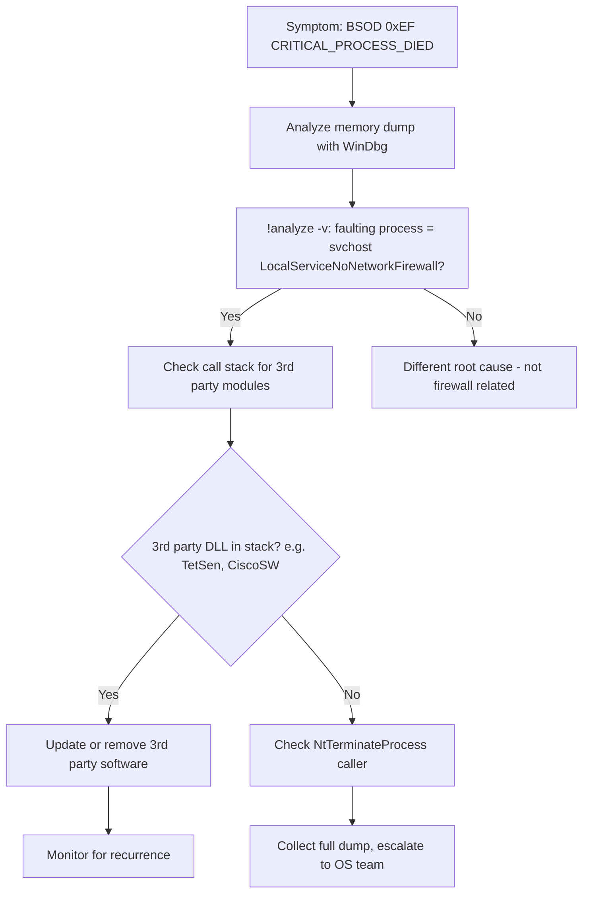

**关键诊断命令：**

| 检查什么 | 命令 | 看什么 |
|---------|------|--------|
| Dump 分析 | `!analyze -v` (WinDbg) | BugcheckCode=0xEF, faulting process |
| 崩溃进程模块 | `lm` (WinDbg on faulting process) | 是否加载了第三方 DLL |
| 调用栈 | `!thread; kn` (WinDbg) | PspCatchCriticalBreak 调用链 |
| MpsSvc 所在进程 | `sc queryex mpssvc` | PID 与 dump 中匹配 |

**💡 Tips：**
- **Tip 1：** LocalServiceNoNetworkFirewall 是 MpsSvc 专用的 service group，如果 dump 显示这个进程崩溃，第一时间检查是否有安全类软件注入了 DLL。
- **Tip 2：** Cisco Secure Workload (TetSen.exe) 是已知会导致此问题的软件，建议更新到最新版本。

**解决方案摘要：**

| 根因 | 修复方法 | 验证方式 |
|------|---------|---------|
| 第三方安全软件 (如 Cisco Secure Workload) 崩溃导致 svchost 终止 | 更新或卸载该第三方软件 | 无再次蓝屏 |

---

### 场景 B1: 配置文件显示 Public 而非 Domain

**典型症状：** 防火墙配置文件（Profile）始终显示 Public，即使机器已加域且在公司网络中。仅适用于 Domain profile 的 GPO 防火墙规则不生效。Server 2019 上较常见。

**排查逻辑：**
> 防火墙 profile 由 NLA (Network Location Awareness) 服务决定。NLA 检测 domain controller 可达性来判断 Domain network。如果 NLA 或其依赖 NLS (Network List Service) 未启动或启动失败，profile 回退到 Public。先查 NLA/NLS 服务状态，再查网络可达性。

**排查流程图：**

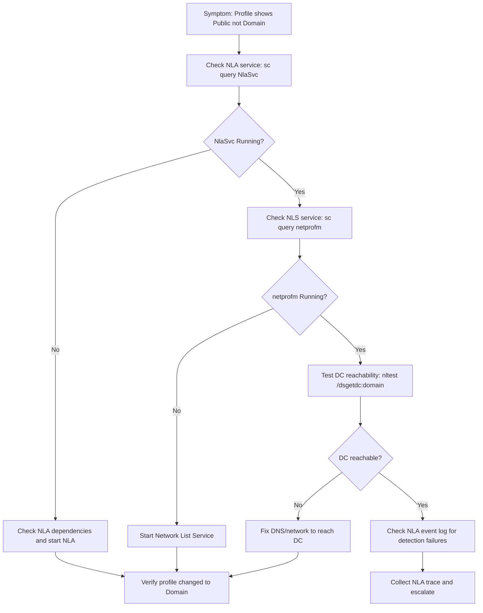

**关键诊断命令：**

| 检查什么 | 命令 | 看什么 |
|---------|------|--------|
| 当前 profile | `Get-NetConnectionProfile` | NetworkCategory 是否为 DomainAuthenticated |
| NLA 服务 | `sc query NlaSvc` | 是否 RUNNING |
| NLS 服务 | `sc query netprofm` | 是否 RUNNING |
| DC 可达性 | `nltest /dsgetdc:contoso.com` | 是否能找到 DC |
| NLA 事件日志 | `Get-WinEvent -LogName "Microsoft-Windows-NlaSvc/Operational" -MaxEvents 20` | 网络分类事件 |

**💡 Tips：**
- **Tip 1：** Server 2019 上 NLA 服务启动顺序问题已知，如果 NLA 在网卡就绪前启动会判定为 Public。可尝试 `Restart-Service NlaSvc` 来触发重新检测。
- **⚠️ 常见误区：** 不要直接用 `Set-NetConnectionProfile -NetworkCategory DomainAuthenticated` 来强制设置——Domain 类型只能由 NLA 自动检测分配。

**解决方案摘要：**

| 根因 | 修复方法 | 验证方式 |
|------|---------|---------|
| NLA/NLS 服务未启动 | 修复服务依赖，确保启动 | `Get-NetConnectionProfile` 显示 DomainAuthenticated |
| DC 不可达 (DNS/网络问题) | 修复 DNS 指向或网络连通性 | `nltest /dsgetdc:domain` 成功 |
| Server 2019 启动顺序问题 | 重启 NlaSvc 或延迟启动 NLA | Profile 正确切换 |

---

### 场景 B2: Win11 24H2/25H2 Domain Profile 不生效

**典型症状：** Windows 11 24H2 或 25H2 上，即使网络接口已通过域认证，防火墙 profile 仍停留在非 Domain（Private 或 Public）。这是该版本的已知问题。

**排查逻辑：**
> 先确认 OS 版本为 Win11 24H2/25H2，排除其他原因（NLA 服务、DC 可达性），然后确认是 known issue。关注后续累积更新是否包含修复。

**排查流程图：**

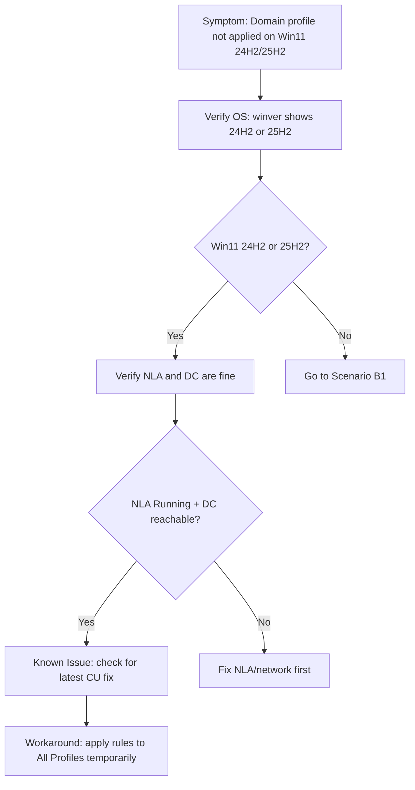

**关键诊断命令：**

| 检查什么 | 命令 | 看什么 |
|---------|------|--------|
| OS 版本 | `winver` 或 `[System.Environment]::OSVersion` | 确认 24H2/25H2 |
| Build 号 | `(Get-ItemProperty 'HKLM:\SOFTWARE\Microsoft\Windows NT\CurrentVersion').DisplayVersion` | 确认版本 |
| 当前 Profile | `Get-NetConnectionProfile \| Select InterfaceAlias, NetworkCategory` | 是否非 Domain |

**💡 Tips：**
- **Tip 1：** 临时 Workaround：将 GPO 规则的 Profile 改为 "All profiles"，但注意安全风险。
- **Tip 2：** 密切关注 Windows Update 发布的累积更新 changelog 中关于 NLA/Firewall profile 的修复。

**解决方案摘要：**

| 根因 | 修复方法 | 验证方式 |
|------|---------|---------|
| Win11 24H2/25H2 已知 bug | 安装包含修复的累积更新 | Profile 正确显示 DomainAuthenticated |
| 临时缓解 | 将规则的 Profile 改为 All Profiles | 规则在所有 profile 下生效 |

---

### 场景 B3: ICMPv6 被阻断导致集群节点移除

**典型症状：** Failover Cluster 启用 IPv6 后，节点被移除 (Event 1135)。根因是 ICMPv6 Neighbor Solicitation 被防火墙 Public profile 阻断，导致 link-local 通信失败、心跳丢失。

**排查逻辑：**
> 集群启用 IPv6 后，节点间通过 link-local 地址通信依赖 ICMPv6 Neighbor Solicitation。如果接口在 Public profile 下，默认阻断 ICMPv6。检查接口 profile、ICMPv6 规则状态，以及集群事件日志。

**排查流程图：**

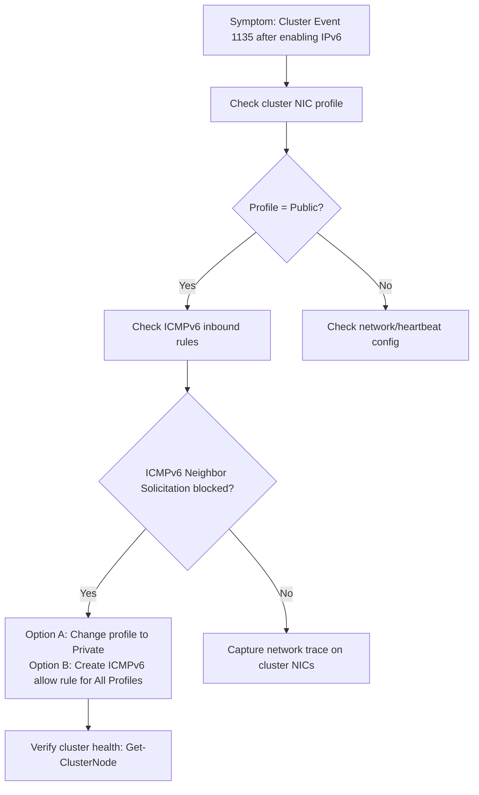

**关键诊断命令：**

| 检查什么 | 命令 | 看什么 |
|---------|------|--------|
| 集群 NIC Profile | `Get-NetConnectionProfile -InterfaceAlias "Cluster*"` | 是否为 Public |
| ICMPv6 规则 | `Get-NetFirewallRule -DisplayName "*ICMPv6*" \| Select DisplayName, Enabled, Profile, Action` | 是否有 allow 规则覆盖 Public |
| 集群事件 | `Get-WinEvent -LogName "Microsoft-Windows-FailoverClustering/Operational" -MaxEvents 50` | Event 1135 详情 |
| IPv6 邻居表 | `netsh interface ipv6 show neighbors` | link-local 地址是否解析 |

**💡 Tips：**
- **Tip 1：** 集群内部 NIC 应始终设置为 Private 或 Domain profile，避免 Public profile 的严格规则影响集群通信。
- **Tip 2：** 创建规则时确保覆盖 All Profiles：`New-NetFirewallRule -DisplayName "Allow ICMPv6 Cluster" -Protocol ICMPv6 -Direction Inbound -Action Allow -Profile Any`

**解决方案摘要：**

| 根因 | 修复方法 | 验证方式 |
|------|---------|---------|
| Public profile 阻断 ICMPv6 | 将集群 NIC profile 改为 Private | Event 1135 不再出现 |
| ICMPv6 无 allow 规则 | 创建 ICMPv6 allow 规则 (All Profiles) | `Test-NetConnection -ComputerName <node>` 成功 |

---

### 场景 C1: Intune 推送规则显示 Invalid

**典型症状：** 通过 Intune/MDM 推送的防火墙规则在 Windows Defender Firewall with Advanced Security (WFAS) UI 中显示为 "Invalid"，规则无法正常评估。

**排查逻辑：**
> Intune 推送的规则存储在 `HKLM\SYSTEM\CurrentControlSet\Services\SharedAccess\Parameters\FirewallPolicy\Mdm\FirewallRules`。如果规则格式不正确（如包含 UI 无法解析的参数），WFAS 会将其标记为 Invalid。这通常是 Intune 端的 policy schema 问题。

**排查流程图：**

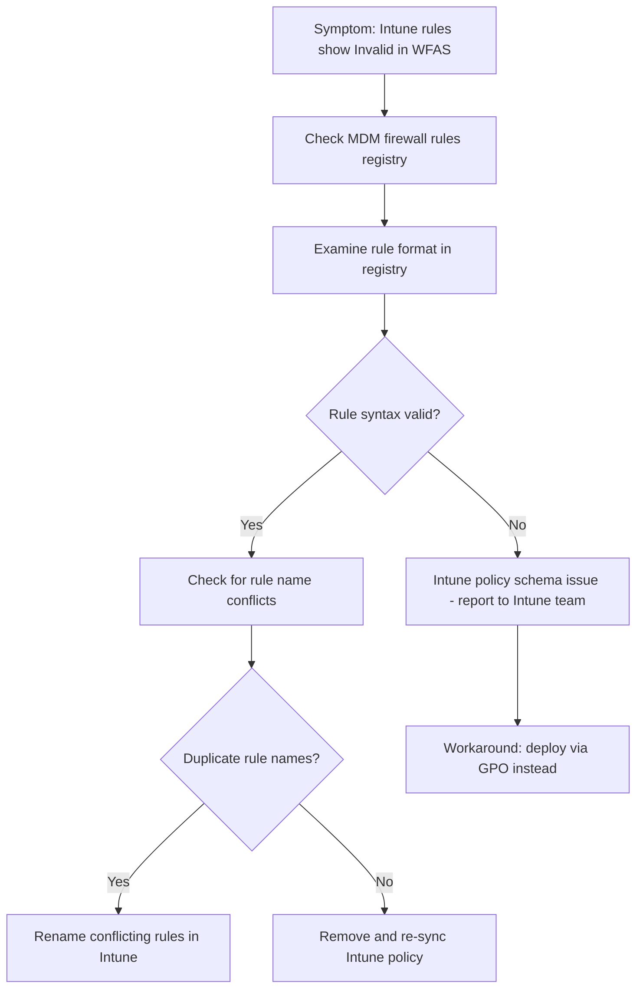

**关键诊断命令：**

| 检查什么 | 命令 | 看什么 |
|---------|------|--------|
| MDM 规则 registry | `reg query "HKLM\SYSTEM\CurrentControlSet\Services\SharedAccess\Parameters\FirewallPolicy\Mdm\FirewallRules" /s` | 规则格式是否合规 |
| 所有防火墙规则 | `Get-NetFirewallRule -PolicyStore ActiveStore \| Where {$_.Status -eq 'Invalid'}` | Invalid 规则列表 |
| MDM 诊断 | `mdmdiagnosticstool.exe -area DeviceEnrollment;DeviceProvisioning;Firewall -cab c:\temp\mdmdiag.cab` | 导出 MDM 诊断信息 |

**💡 Tips：**
- **Tip 1：** WFAS UI 中 Invalid 的规则**仍然占用 WFP filter 资源**，虽然不生效但影响规则处理效率。
- **⚠️ 常见误区：** 不要在本地删除 MDM store 的规则——下次同步会重新推送。需要在 Intune 端修复。

**解决方案摘要：**

| 根因 | 修复方法 | 验证方式 |
|------|---------|---------|
| Intune 规则格式问题 | 向 Intune 团队报告；使用 GPO 替代 | 规则不再显示 Invalid |
| 规则名称冲突 | 在 Intune 中修改规则名称 | 规则正常显示 |

---

### 场景 C2: Mandatory Profile 导致规则膨胀

**典型症状：** 使用 Mandatory Profile 的环境中，每次用户登录创建重复防火墙规则。规则累积到 1000+ 条后出现：登录极慢、桌面黑屏、开始菜单无响应。

**排查逻辑：**
> Mandatory Profile 每次登录都被视为"新用户"，系统为每次登录创建新的防火墙规则条目（尤其是应用自动添加的规则）。这些规则累积在 `FirewallPolicy\FirewallRules` 下。检查规则数量和重复程度，清理后评估是否有 OS 修复。

**排查流程图：**

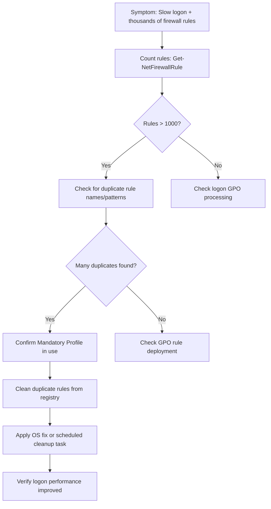

**关键诊断命令：**

| 检查什么 | 命令 | 看什么 |
|---------|------|--------|
| 规则总数 | `(Get-NetFirewallRule).Count` | 是否远超预期 (正常 < 500) |
| 重复规则 | `Get-NetFirewallRule \| Group DisplayName \| Where Count -gt 5 \| Sort Count -Desc` | 有大量同名规则 |
| 规则 registry | `(Get-Item "HKLM:\SYSTEM\CurrentControlSet\Services\SharedAccess\Parameters\FirewallPolicy\FirewallRules").ValueCount` | 值数量 |
| Mandatory Profile 检查 | `Get-ItemProperty "HKLM:\SOFTWARE\Microsoft\Windows NT\CurrentVersion\ProfileList\*" \| Where ProfileImagePath -match "mandatory"` | 是否使用 Mandatory Profile |

**💡 Tips：**
- **Tip 1：** 紧急清理可用：`Get-NetFirewallRule | Group DisplayName | Where Count -gt 1 | ForEach { $_.Group | Select -Skip 1 | Remove-NetFirewallRule }` （保留每组第一条，删除重复）。
- **Tip 2：** 可部署 Scheduled Task 在用户注销时清理重复规则作为临时缓解。
- **⚠️ 常见误区：** 不要删除所有 FirewallRules registry 值——这会导致所有规则丢失，包括系统内置规则。

**解决方案摘要：**

| 根因 | 修复方法 | 验证方式 |
|------|---------|---------|
| Mandatory Profile 每次登录创建重复规则 | 清理重复规则 + 部署计划任务防止累积 | 规则数量保持正常，登录速度恢复 |
| OS 层面修复 | 安装包含修复的系统更新 | 登录后规则不再重复创建 |

---

### 场景 C3: Autopilot 期间 FQDN 规则失败

**典型症状：** Autopilot OOBE 阶段，Intune 推送的 URL/FQDN-based 防火墙规则不生效，出站流量被 "Default Outbound" 规则阻断。设备无法访问必要的云端服务。

**排查逻辑：**
> FQDN-based 防火墙规则依赖 Microsoft Defender Network Protection 来解析 FQDN → IP。在 Autopilot OOBE 期间，Defender 签名可能过时，Network Protection 功能未激活，导致 FQDN 规则解析为空集，所有匹配流量落入 Default Outbound Block。需要在 provisioning 阶段先更新 Defender 签名。

**排查流程图：**

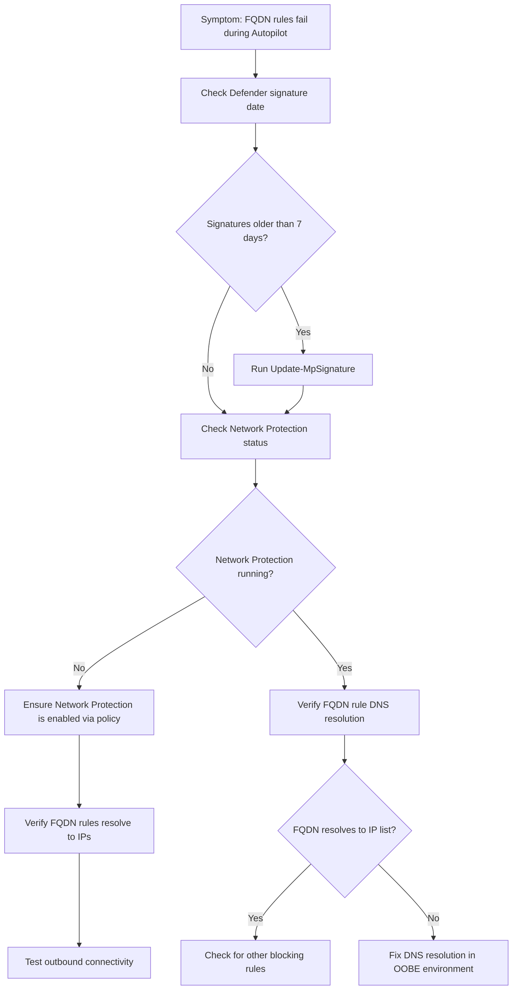

**关键诊断命令：**

| 检查什么 | 命令 | 看什么 |
|---------|------|--------|
| Defender 签名日期 | `Get-MpComputerStatus \| Select AntivirusSignatureLastUpdated` | 是否过时 |
| Network Protection 状态 | `Get-MpPreference \| Select EnableNetworkProtection` | 是否为 Enabled (1) |
| 更新签名 | `Update-MpSignature` | 签名更新成功 |
| FQDN 规则状态 | `Get-NetFirewallRule -PolicyStore ActiveStore \| Where {$_.DisplayName -match "FQDN"}` | 规则是否存在且 Enabled |
| WFP 丢包日志 | `netsh wfp show filters` | 检查 Default Outbound 是否拦截目标流量 |

**💡 Tips：**
- **Tip 1：** 在 Autopilot provisioning package 中加入 `Update-MpSignature` 作为第一个步骤，确保 FQDN 规则在后续部署中能正常工作。
- **Tip 2：** 作为备选方案，可以同时部署 IP-based 规则作为 FQDN 规则的 fallback。

**解决方案摘要：**

| 根因 | 修复方法 | 验证方式 |
|------|---------|---------|
| Defender 签名过时导致 Network Protection 未启动 | 在 provisioning 阶段运行 `Update-MpSignature` | FQDN 规则解析为有效 IP 列表 |
| Network Protection 未启用 | 通过 Intune 策略启用 Network Protection | `Get-MpPreference` 显示 EnableNetworkProtection=1 |

---

### 场景 C4: AllowLocalPolicyMerge 通过 MDE 配置失败

**典型症状：** 通过 Microsoft Defender for Endpoint (MDE) 配置 AllowLocalPolicyMerge=false，但本地定义的防火墙规则仍然生效。策略看似已应用但实际未生效。

**排查逻辑：**
> MDE 将 AllowLocalPolicyMerge 写入 local store 而非 MDM store。由于 MDM store 优先级高于 local store，而 MDM store 的默认值为 true，所以 local store 的 false 被覆盖。需要通过 GPO 或直接写入 MDM store 的 registry 路径来正确配置。

**排查流程图：**

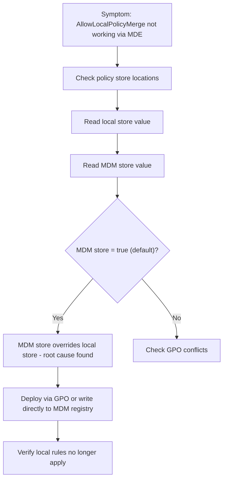

**关键诊断命令：**

| 检查什么 | 命令 | 看什么 |
|---------|------|--------|
| Local store 设置 | `reg query "HKLM\SOFTWARE\Policies\Microsoft\WindowsFirewall\DomainProfile" /v AllowLocalPolicyMerge` | 值是否为 0 (false) |
| MDM store 设置 | `reg query "HKLM\SYSTEM\CurrentControlSet\Services\SharedAccess\Parameters\FirewallPolicy\Mdm" /v AllowLocalPolicyMerge` | 是否覆盖了 local store |
| 有效 policy | `Get-NetFirewallProfile -PolicyStore ActiveStore \| Select Name, AllowLocalFirewallRules` | 实际生效的值 |
| 本地规则列表 | `Get-NetFirewallRule -PolicyStore PersistentStore` | 是否存在本地定义的规则 |

**💡 Tips：**
- **Tip 1：** Policy store 优先级：MDM > GPO > Local。通过 MDE 配置的设置进入 local store，会被 MDM store 的默认值覆盖。
- **⚠️ 常见误区：** 仅查看 `rsop.msc` 或 `gpresult` 不够——这些工具不显示 MDM store 的值，需要直接查 registry。

**解决方案摘要：**

| 根因 | 修复方法 | 验证方式 |
|------|---------|---------|
| MDE 写入 local store 被 MDM store 默认值覆盖 | 改用 GPO 或直接推送 reg key 到 MDM store | `Get-NetFirewallProfile` 显示 AllowLocalFirewallRules=False |

---

### 场景 D1: VPN/网络切换后 CPU 飙高黑屏

**典型症状：** 连接 VPN 或切换网络后，系统出现 CPU 100%、桌面黑屏、无响应。持续数分钟甚至更久。Event log 中可能有 WFP Transaction Watchdog Timeout 事件。

**排查逻辑：**
> 防火墙规则中包含大量 `-LocalAddress` 地址范围时，每次网络变化触发 WFP 规则刷新，内部 TRIE 数据结构的增删操作 (IndexTrieDeleteFilter/IndexTrieAddFilter) 呈指数级复杂度，导致 CPU 长时间满载。需要检查规则中 LocalAddress 的使用情况。

**排查流程图：**

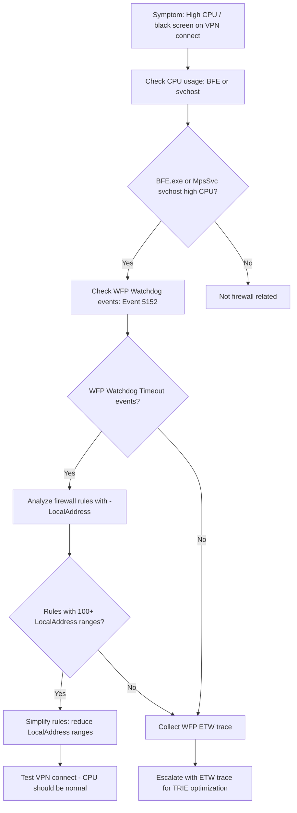

**关键诊断命令：**

| 检查什么 | 命令 | 看什么 |
|---------|------|--------|
| CPU 占用进程 | `Get-Process \| Sort CPU -Desc \| Select -First 10` | BFE.exe 或 MpsSvc svchost 是否高 CPU |
| WFP Watchdog 事件 | `Get-WinEvent -LogName Security -FilterXPath "*[System[EventID=5152]]" -MaxEvents 10` | WFP Transaction Watchdog Timeout |
| 带 LocalAddress 的规则 | `Get-NetFirewallRule \| Get-NetFirewallAddressFilter \| Where {$_.LocalAddress -ne 'Any'} \| Measure` | 数量和地址范围大小 |
| WFP filter 数量 | `netsh wfp show filters` 然后统计 | WFP filter 总数 |

**💡 Tips：**
- **Tip 1：** 如果有规则使用了 100+ 个 `-LocalAddress` 子网范围，将其拆分为多条较小规则或使用 `Any` 配合其他条件过滤，能显著减少 TRIE 操作耗时。
- **Tip 2：** WFP Transaction Watchdog Timeout 是关键线索——如果 Event Log 中有此事件，基本可以确认是 WFP 规则处理导致的性能问题。

**解决方案摘要：**

| 根因 | 修复方法 | 验证方式 |
|------|---------|---------|
| 复杂 LocalAddress 规则导致 TRIE 操作超时 | 简化规则中的 LocalAddress 范围 | VPN 连接后 CPU 正常，无 Watchdog 事件 |
| OS bug: TRIE 算法效率 | 等待/申请 OS 修复补丁 (TRIE optimization) | 安装补丁后验证 |

---

### 场景 D2: 防火墙丢弃 AAD 流量导致登录缓慢

**典型症状：** Windows 10 上 Azure AD 登录缓慢，防火墙日志显示丢弃了到 login.microsoftonline.com 的出站流量。

**排查逻辑：**
> 检查防火墙出站规则是否阻止了到 AAD endpoints 的 HTTPS (443) 流量。可能是过于严格的出站 Block 规则 + 缺少对 AAD URL 的 Allow 规则。需要审查 outbound 规则和 WFP drop 记录。

**排查流程图：**

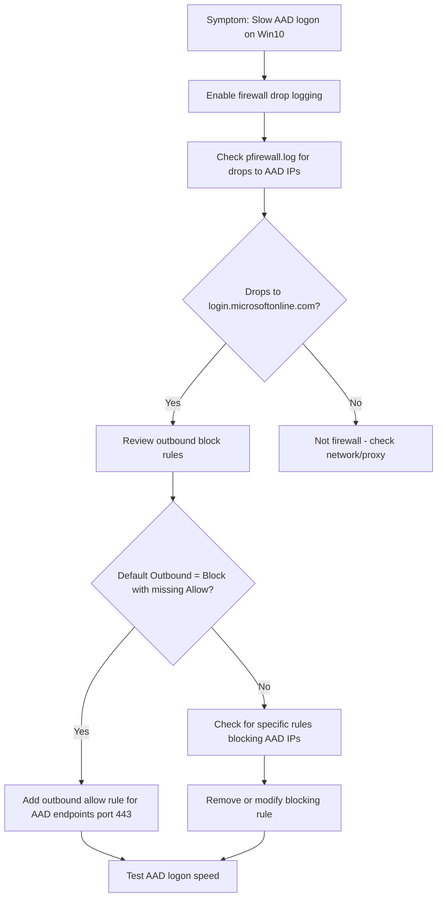

**关键诊断命令：**

| 检查什么 | 命令 | 看什么 |
|---------|------|--------|
| 出站默认策略 | `Get-NetFirewallProfile \| Select Name, DefaultOutboundAction` | 是否为 Block |
| 启用日志 | `Set-NetFirewallProfile -LogBlocked True -LogFileName %SystemRoot%\System32\LogFiles\Firewall\pfirewall.log` | 开启 drop 日志 |
| 查看 drop | `Select-String "DROP" "$env:SystemRoot\System32\LogFiles\Firewall\pfirewall.log" \| Select -Last 50` | 目标 IP 是否为 AAD 相关 |
| AAD IP 解析 | `Resolve-DnsName login.microsoftonline.com` | 获取当前 AAD endpoint IP |

**💡 Tips：**
- **Tip 1：** AAD endpoints IP 地址会变化，建议使用 FQDN-based 规则（需要 Network Protection 支持）或定期更新 IP 列表。Microsoft 发布 [Office 365 URL 和 IP 地址范围](https://learn.microsoft.com/en-us/microsoft-365/enterprise/urls-and-ip-address-ranges) 可供参考。

**解决方案摘要：**

| 根因 | 修复方法 | 验证方式 |
|------|---------|---------|
| 出站规则阻断 AAD 流量 | 添加 outbound allow 规则 for AAD endpoints (TCP 443) | AAD 登录速度恢复正常 |

---

### 场景 E1: NgcSock 第三方 VPN 过滤器丢包

**典型症状：** 使用 Cisco AnyConnect VPN 时，部分站点（特别是 Captive Portal）无法访问。WebView2 runtime 117+ 版本后出现。WFP 审计日志显示被 "NgcSock ALE Connect Callout V4" filter 丢弃。

**排查逻辑：**
> Cisco AnyConnect 在 WFP 层注册了 callout filter (NgcSock)，该 filter 在新版 WebView2 runtime 下错误阻断出站连接。这是 Cisco 的已知 bug (CSCwh75976)。确认方法是启用 WFP 审计并查看丢包是否由 NgcSock filter 导致。

**排查流程图：**

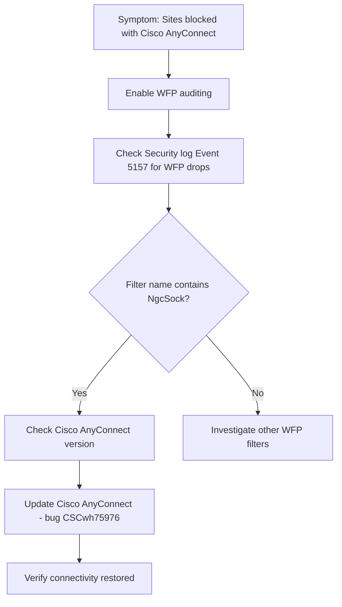

**关键诊断命令：**

| 检查什么 | 命令 | 看什么 |
|---------|------|--------|
| 启用 WFP 审计 | `auditpol /set /subcategory:"Filtering Platform Packet Drop" /success:enable /failure:enable` | 开启后重现问题 |
| WFP drop 事件 | `Get-WinEvent -LogName Security -FilterXPath "*[System[EventID=5152 or EventID=5157]]" -MaxEvents 50` | Filter 名称是否为 NgcSock |
| WFP filters 列表 | `netsh wfp show filters` | 查找 NgcSock 相关 filter |
| AnyConnect 版本 | `Get-WmiObject Win32_Product \| Where {$_.Name -match "Cisco AnyConnect"}` | 版本号 |

**💡 Tips：**
- **Tip 1：** 临时 Workaround：降级 WebView2 runtime 到 116 以下，但不建议长期使用。
- **⚠️ 常见误区：** 症状看起来像防火墙规则问题，但实际上是 WFP callout driver 的问题——普通防火墙规则无法覆盖 callout filter 的行为。

**解决方案摘要：**

| 根因 | 修复方法 | 验证方式 |
|------|---------|---------|
| Cisco AnyConnect WFP filter bug (CSCwh75976) | 更新 Cisco AnyConnect 到修复版本 | 被阻断的站点可正常访问 |

---

### 场景 E2: 防火墙日志文件创建失败

**典型症状：** 配置了防火墙日志 (`pfirewall.log`) 但文件未创建或无内容。权限检查正常。Server 2022 上出现。

**排查逻辑：**
> MpsSvc 尝试创建日志文件时 CreateFile 调用意外失败。虽然文件夹权限正确，但可能存在 NTFS 权限继承问题或安全软件拦截。使用 Procmon 跟踪 MpsSvc 的文件操作可以精确定位失败原因。

**排查流程图：**

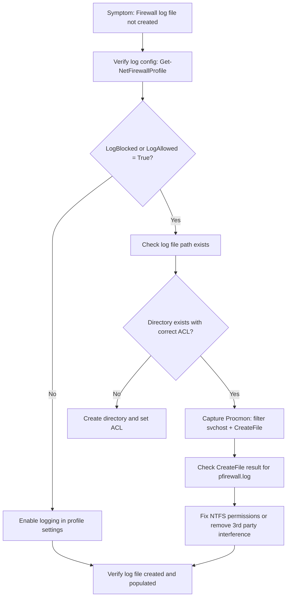

**关键诊断命令：**

| 检查什么 | 命令 | 看什么 |
|---------|------|--------|
| 日志配置 | `Get-NetFirewallProfile \| Select Name, LogFileName, LogBlocked, LogAllowed, LogMaxSizeKilobytes` | 配置是否正确 |
| 日志路径权限 | `icacls "$env:SystemRoot\System32\LogFiles\Firewall"` | MpsSvc (LOCAL SERVICE) 是否有写权限 |
| 文件是否存在 | `Test-Path "$env:SystemRoot\System32\LogFiles\Firewall\pfirewall.log"` | 文件是否被创建 |
| Procmon 跟踪 | Procmon filter: `Process Name = svchost.exe, Path contains pfirewall` | CreateFile 返回的错误码 |

**💡 Tips：**
- **Tip 1：** 默认日志路径 `%SystemRoot%\System32\LogFiles\Firewall\pfirewall.log`，如果更改了路径需确保 LOCAL SERVICE 账户有完全控制权限。

**解决方案摘要：**

| 根因 | 修复方法 | 验证方式 |
|------|---------|---------|
| NTFS 权限或安全软件拦截 | 修复权限或排除安全软件干扰 | 日志文件创建且有内容 |
| Server 2022 已知问题 | 检查并安装相关修复补丁 | 日志功能正常 |

---

### 场景 F1: Firewall MMC 远程连接失败 0x6d9

**典型症状：** 使用 Windows Defender Firewall with Advanced Security MMC 尝试远程连接到 Win11 24H2 或 Server 2025 时，报错 `0x6d9 (EPT_S_NOT_REGISTERED)`。

**排查逻辑：**
> 错误 0x6d9 表示 RPC endpoint mapper 中未注册目标服务的 endpoint。远程防火墙管理依赖 RPC 和远程 WMI/DCOM。Win11 24H2 / Server 2025 上可能是 RPC endpoint 注册变更导致的兼容性问题。

**排查流程图：**

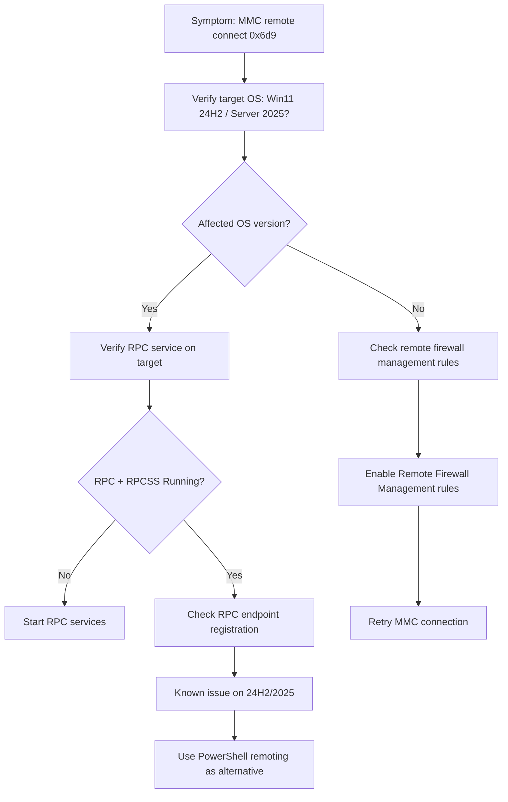

**关键诊断命令：**

| 检查什么 | 命令 | 看什么 |
|---------|------|--------|
| 目标 OS 版本 | `Invoke-Command -ComputerName corpdc01 {(Get-ItemProperty 'HKLM:\SOFTWARE\Microsoft\Windows NT\CurrentVersion').DisplayVersion}` | 确认版本 |
| RPC 服务 | `sc \\corpdc01 query RpcSs` | 是否 RUNNING |
| 远程管理规则 | `Invoke-Command -ComputerName corpdc01 {Get-NetFirewallRule -DisplayGroup "Windows Defender Firewall Remote Management"}` | 是否 Enabled |
| PowerShell 替代 | `Invoke-Command -ComputerName corpdc01 {Get-NetFirewallProfile}` | 远程 PowerShell 是否可用 |

**💡 Tips：**
- **Tip 1：** 使用 PowerShell Remoting (`Enter-PSSession` / `Invoke-Command`) 管理远程防火墙是可靠的替代方案，不受此 MMC bug 影响。
- **Tip 2：** 确保目标机器的 "Windows Defender Firewall Remote Management" 防火墙规则组已启用。

**解决方案摘要：**

| 根因 | 修复方法 | 验证方式 |
|------|---------|---------|
| Win11 24H2 / Server 2025 已知 RPC endpoint 问题 | 等待 OS 修复；使用 PowerShell Remoting 替代 | PowerShell 远程管理正常 |
| 远程管理防火墙规则未启用 | 启用 "Windows Defender Firewall Remote Management" 规则组 | MMC 远程连接成功 |

---

## 4. 通用排查工具箱 (Universal Toolkit)

### 日志收集

| 目的 | 命令/工具 | 说明 |
|------|----------|------|
| 防火墙事件日志 | `Get-WinEvent -LogName "Microsoft-Windows-Windows Firewall With Advanced Security/Firewall"` | 规则添加/删除/变更事件 |
| WFP 丢包审计 | `auditpol /set /subcategory:"Filtering Platform Packet Drop" /success:enable /failure:enable` | 启用 WFP 丢包审计到 Security log |
| WFP 连接审计 | `auditpol /set /subcategory:"Filtering Platform Connection" /success:enable /failure:enable` | 审计 WFP 连接事件 |
| TSS 防火墙场景收集 | `.\TSS.ps1 -Scenario NET_Firewall` | 一键收集防火墙相关诊断数据 |
| MDM 诊断导出 | `mdmdiagnosticstool.exe -area Firewall -cab c:\temp\fwdiag.cab` | 导出 MDM/Intune 防火墙策略诊断 |

### 防火墙状态诊断

| 目的 | 命令/工具 | 说明 |
|------|----------|------|
| 查看所有 Profile | `Get-NetFirewallProfile \| Format-Table Name, Enabled, DefaultInboundAction, DefaultOutboundAction, AllowLocalFirewallRules` | 防火墙 Profile 总览 |
| 查看所有规则 | `Get-NetFirewallRule \| Select DisplayName, Enabled, Direction, Action, Profile \| Format-Table` | 规则列表 |
| 查看特定 Store 规则 | `Get-NetFirewallRule -PolicyStore PersistentStore` / `ConfigurableServiceStore` / `ActiveStore` | 区分本地/MDM/活动规则 |
| WFP filters 导出 | `netsh wfp show filters` | 导出所有 WFP filter 到 XML |
| WFP state 快照 | `netsh wfp show state` | 当前 WFP 运行状态 |
| WFP security 信息 | `netsh wfp show security` | WFP 安全描述符 |
| 防火墙日志查看 | `Get-Content "$env:SystemRoot\System32\LogFiles\Firewall\pfirewall.log" -Tail 100` | 实时查看防火墙日志 |

### 网络诊断

| 目的 | 命令/工具 | 说明 |
|------|----------|------|
| 连接测试 | `Test-NetConnection -ComputerName target -Port 443` | 测试 TCP 连通性 |
| DNS 解析 | `Resolve-DnsName contoso.com` | 确认 DNS 解析正常 |
| NLA 状态 | `Get-NetConnectionProfile` | 查看网络分类 |
| Packet capture | `netsh trace start capture=yes tracefile=c:\temp\nettrace.etl` | 网络包捕获 |
| WFP drop 诊断 | `netsh wfp show netevents` | WFP 网络事件（含丢包原因） |

### 常用注册表/配置

| 配置项 | 路径/键值 | 作用 |
|--------|----------|------|
| 防火墙规则 (Local) | `HKLM\SYSTEM\CurrentControlSet\Services\SharedAccess\Parameters\FirewallPolicy\FirewallRules` | 本地定义的防火墙规则 |
| 防火墙规则 (MDM) | `HKLM\SYSTEM\CurrentControlSet\Services\SharedAccess\Parameters\FirewallPolicy\Mdm\FirewallRules` | Intune/MDM 推送的规则 |
| Profile 设置 | `HKLM\SYSTEM\CurrentControlSet\Services\SharedAccess\Parameters\FirewallPolicy\{DomainProfile\|StandardProfile\|PublicProfile}` | 各 Profile 的防火墙设置 |
| NetworkIsolation | `HKLM\SOFTWARE\Microsoft\PolicyManager\default\NetworkIsolation` | 网络隔离策略（影响 MpsSvc 启动） |
| BFE 服务 | `HKLM\SYSTEM\CurrentControlSet\Services\BFE` | Base Filtering Engine 服务配置 |
| MpsSvc 服务 | `HKLM\SYSTEM\CurrentControlSet\Services\MpsSvc` | Windows Firewall 服务配置 |

---

## 5. 跨场景关联 (Cross-Scenario Relationships)

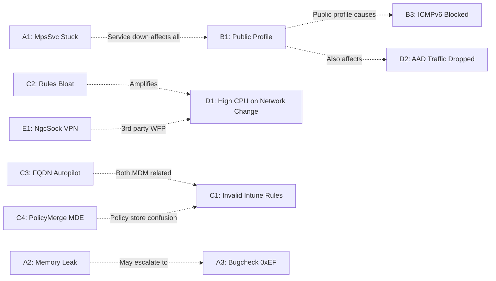

**关键关联说明：**
- **B1 → B3 / D2：** Profile 错误 (Public) 是很多下游问题的根因——ICMPv6 阻断和 AAD 流量丢弃都可能源于错误的 Profile。排查 B3 和 D2 时先确认 Profile 是否正确。
- **C2 → D1：** 规则膨胀 (1000+ 条) 显著放大网络切换时的性能问题。如果 D1 场景中看到大量规则，先解决 C2。
- **A1 → 所有场景：** MpsSvc 未启动意味着防火墙功能完全失效，所有规则和 profile 行为都不可预期。
- **C1 / C3 / C4：** 三个 Intune/MDM 相关场景经常在同一环境中并发出现，注意交叉排查。

---

## 6. 参考资料 (References)

- [Troubleshoot Windows Firewall with Advanced Security](https://learn.microsoft.com/en-us/troubleshoot/windows-server/networking/troubleshoot-windows-firewall-with-advanced-security-guidance) — 微软官方防火墙排查指南
- [Windows Firewall overview](https://learn.microsoft.com/en-us/windows/security/operating-system-security/network-security/windows-firewall/) — Windows Firewall 架构和功能概览
- [Windows Firewall tools](https://learn.microsoft.com/en-us/windows/security/operating-system-security/network-security/windows-firewall/tools) — 防火墙管理工具一览（WFAS, CSP, CLI 等）
- [Windows Filtering Platform (WFP)](https://learn.microsoft.com/en-us/windows/win32/fwp/windows-filtering-platform-start-page) — WFP 开发文档，理解底层过滤平台
- [Get-NetFirewallRule cmdlet](https://learn.microsoft.com/en-us/powershell/module/netsecurity/get-netfirewallrule) — PowerShell 防火墙规则管理
- [Use netsh advfirewall firewall to control Windows Firewall](https://learn.microsoft.com/en-us/troubleshoot/windows-server/networking/netsh-advfirewall-firewall-control-firewall-behavior) — netsh advfirewall 命令参考

---
---

# Scenario Map: Windows Defender Firewall Troubleshooting (English Version)

**Product/Service:** Windows Defender Firewall / Windows Filtering Platform (WFP)
**Scope:** Firewall service, profiles, rules, performance, packet drops, and remote management
**Last Updated:** 2026-04-17

---

## 1. Scenario Overview


---

## 2. How to Identify Your Scenario

| Symptom You See | Likely Scenario | Jump To |
|----------------|----------------|---------|
| MpsSvc stuck in "Starting" state, never becomes Running | Scenario A1 | → [A1](#scenario-a1-mpssvc-stuck-starting) |
| MpsSvc process memory keeps growing, requires restart | Scenario A2 | → [A2](#scenario-a2-mpssvc-memory-leak) |
| BSOD Bugcheck 0xEF CRITICAL_PROCESS_DIED | Scenario A3 | → [A3](#scenario-a3-bugcheck-0xef-mpssvc-crash) |
| Firewall profile shows Public instead of Domain | Scenario B1 | → [B1](#scenario-b1-profile-shows-public-instead-of-domain) |
| Win11 24H2/25H2 won't switch to Domain profile | Scenario B2 | → [B2](#scenario-b2-domain-profile-not-applied-on-win11-24h225h2) |
| Cluster node evicted (Event 1135) after enabling IPv6 | Scenario B3 | → [B3](#scenario-b3-icmpv6-blocked-causes-cluster-node-eviction) |
| Intune-pushed rules show "Invalid" in WFAS UI | Scenario C1 | → [C1](#scenario-c1-intune-pushed-rules-show-invalid) |
| Thousands of duplicate firewall rules, slow logon / black screen | Scenario C2 | → [C2](#scenario-c2-mandatory-profile-causes-rule-bloat) |
| FQDN-based rules fail during Autopilot OOBE | Scenario C3 | → [C3](#scenario-c3-fqdn-rules-fail-during-autopilot) |
| AllowLocalPolicyMerge=false set via MDE but local rules still work | Scenario C4 | → [C4](#scenario-c4-allowlocalpolicymerge-fails-via-mde) |
| CPU spike / black screen on VPN connect or network change | Scenario D1 | → [D1](#scenario-d1-high-cpu--black-screen-on-vpn--network-change) |
| Slow AAD logon, firewall dropping login.microsoftonline.com traffic | Scenario D2 | → [D2](#scenario-d2-firewall-drops-aad-traffic-causing-slow-logon) |
| Sites blocked when using Cisco AnyConnect VPN | Scenario E1 | → [E1](#scenario-e1-ngcsock-3rd-party-vpn-filter-drops) |
| Firewall log file not created despite correct permissions | Scenario E2 | → [E2](#scenario-e2-firewall-log-file-creation-fails) |
| Firewall MMC remote connect fails with 0x6d9 | Scenario F1 | → [F1](#scenario-f1-firewall-mmc-remote-connect-fails-0x6d9) |

---

## 3. Scenario Details

---

### Scenario A1: MpsSvc Stuck Starting

**Typical Symptoms:** Windows Firewall service (MpsSvc) remains in "Starting" (START_PENDING) state indefinitely. Network functionality dependent on the firewall is impaired.

**Troubleshooting Logic:**
> MpsSvc reads PolicyManager registry keys on startup. If the `NetworkIsolation\EnterpriseProxyServers` key is missing, the service hangs during registry read. Use TSS + Procmon boot logging to capture the `NAME NOT FOUND` error.

**Troubleshooting Flowchart:**


**Key Diagnostic Commands:**

| What to Check | Command | What to Look For |
|--------------|---------|------------------|
| MpsSvc status | `sc query mpssvc` | STATE = START_PENDING |
| BFE status | `sc query bfe` | Must be RUNNING |
| NetworkIsolation registry | `reg query "HKLM\SOFTWARE\Microsoft\PolicyManager\default\NetworkIsolation" /s` | EnterpriseProxyServers subkey exists |
| Boot trace | `TSS.ps1 -Scenario NET_Firewall -Boot` | Captures startup-phase logs |

**💡 Tips:**
- **Tip 1:** Procmon boot logging must be configured before reboot to capture service startup registry access — regular Procmon won't see it.
- **Tip 2:** Export the registry from a healthy system **of the same OS version** — defaults vary between versions.
- **⚠️ Common Pitfall:** Don't jump to SFC or component reinstall — the issue is a missing registry policy key, not file corruption.

**Resolution Summary:**

| Root Cause | Fix | Verification |
|-----------|-----|-------------|
| Missing NetworkIsolation\EnterpriseProxyServers registry key | Import registry key from same-version healthy system | `sc query mpssvc` shows RUNNING |
| BFE service not started | `net start bfe` then `net start mpssvc` | Both services RUNNING |

---

### Scenario A2: MpsSvc Memory Leak

**Typical Symptoms:** MpsSvc host process working set grows continuously, especially in environments where 3rd-party tools (e.g., IPBan) frequently add/remove firewall rules. More common on Server 2025.

**Troubleshooting Logic:**
> High-frequency firewall rule API calls (add/delete) cause MpsSvc to allocate memory that is not fully freed. Identify external programs modifying firewall rules and evaluate change frequency.

**Troubleshooting Flowchart:**


**Key Diagnostic Commands:**

| What to Check | Command | What to Look For |
|--------------|---------|------------------|
| MpsSvc process memory | `Get-Process -Id (Get-WmiObject Win32_Service -Filter "Name='mpssvc'").ProcessId \| Select WS, PM` | Continuous working set growth |
| Rule count | `(Get-NetFirewallRule).Count` | Unusually large number |
| Rule change audit | Event Log: `Microsoft-Windows-Windows Firewall With Advanced Security/Firewall` Event 2004/2006 | High-frequency add/delete |

**💡 Tips:**
- **Tip 1:** IPBan creates individual rules per blocked IP. Switch to consolidated IP range rules or address scope lists.
- **⚠️ Common Pitfall:** Restarting MpsSvc is a temporary fix — memory will grow again unless you address high-frequency rule churn.

**Resolution Summary:**

| Root Cause | Fix | Verification |
|-----------|-----|-------------|
| 3rd-party tools churning rules cause memory leak | Reduce rule change frequency; batch operations | Memory stays stable |
| Server 2025 known bug | Apply OS fix when available | Monitor post-patch |

---

### Scenario A3: Bugcheck 0xEF MpsSvc Crash

**Typical Symptoms:** Blue screen with Bugcheck 0xEF (CRITICAL_PROCESS_DIED). Dump analysis shows svchost.exe (LocalServiceNoNetworkFirewall) terminated. Usually caused by 3rd-party security software crash.

**Troubleshooting Logic:**
> The svchost hosting MpsSvc is a critical process. A 3rd-party DLL crash (e.g., Cisco Secure Workload's TetSen.exe) in the same process terminates the entire svchost, triggering 0xEF. Key call chain: `PspCatchCriticalBreak → PspTerminateAllThreads → NtTerminateProcess`.

**Troubleshooting Flowchart:**

```mermaid
flowchart TD
    Start["Symptom: BSOD 0xEF CRITICAL_PROCESS_DIED"] --> AnalyzeDump["Analyze memory dump with WinDbg"]
    AnalyzeDump --> CheckProcess["!analyze -v: faulting process = svchost LocalServiceNoNetworkFirewall?"]
    CheckProcess -->|Yes| CheckStack["Check call stack for 3rd party modules"]
    CheckProcess -->|No| OtherBugcheck["Different root cause - not firewall related"]
    CheckStack --> Found3P{"3rd party DLL in stack? e.g. TetSen, CiscoSW"}
    Found3P -->|Yes| Update3P["Update or remove 3rd party software"]
    Found3P -->|No| CheckNT["Check NtTerminateProcess caller"]
    Update3P --> Verify["Monitor for recurrence"]
    CheckNT --> Escalate["Collect full dump, escalate to OS team"]
```

**Key Diagnostic Commands:**

| What to Check | Command | What to Look For |
|--------------|---------|------------------|
| Dump analysis | `!analyze -v` (WinDbg) | BugcheckCode=0xEF, faulting process |
| Loaded modules | `lm` (WinDbg) | 3rd-party DLLs loaded |
| Call stack | `!thread; kn` (WinDbg) | PspCatchCriticalBreak chain |

**💡 Tips:**
- **Tip 1:** LocalServiceNoNetworkFirewall is MpsSvc's dedicated service group — if this process crashes, check for injected security DLLs immediately.
- **Tip 2:** Cisco Secure Workload (TetSen.exe) is a known offender — update to the latest version.

**Resolution Summary:**

| Root Cause | Fix | Verification |
|-----------|-----|-------------|
| 3rd-party security software crash cascading to svchost | Update or uninstall the 3rd-party software | No further BSODs |

---

### Scenario B1: Profile Shows Public Instead of Domain

**Typical Symptoms:** Firewall profile remains Public even when the machine is domain-joined and on the corporate network. GPO rules scoped to Domain profile are ineffective. More common on Server 2019.

**Troubleshooting Logic:**
> Firewall profile is determined by NLA (Network Location Awareness). NLA checks DC reachability. If NLA or NLS service fails to start, profile falls back to Public. Check NLA/NLS services first, then network/DC reachability.

**Troubleshooting Flowchart:**

```mermaid
flowchart TD
    Start["Symptom: Profile shows Public not Domain"] --> CheckNLA["Check NLA service: sc query NlaSvc"]
    CheckNLA --> NLARunning{"NlaSvc Running?"}
    NLARunning -->|No| FixNLA["Check NLA dependencies and start NLA"]
    NLARunning -->|Yes| CheckNLS["Check NLS service: sc query netprofm"]
    CheckNLS --> NLSRunning{"netprofm Running?"}
    NLSRunning -->|No| FixNLS["Start Network List Service"]
    NLSRunning -->|Yes| CheckDC["Test DC reachability: nltest /dsgetdc:domain"]
    CheckDC --> DCReachable{"DC reachable?"}
    DCReachable -->|No| FixNetwork["Fix DNS/network to reach DC"]
    DCReachable -->|Yes| CheckEvents["Check NLA event log for detection failures"]
    FixNLA --> Verify["Verify profile changed to Domain"]
    FixNLS --> Verify
    FixNetwork --> Verify
    CheckEvents --> Escalate["Collect NLA trace and escalate"]
```

**Key Diagnostic Commands:**

| What to Check | Command | What to Look For |
|--------------|---------|------------------|
| Current profile | `Get-NetConnectionProfile` | NetworkCategory = DomainAuthenticated |
| NLA service | `sc query NlaSvc` | Must be RUNNING |
| NLS service | `sc query netprofm` | Must be RUNNING |
| DC reachability | `nltest /dsgetdc:contoso.com` | Successfully finds a DC |

**💡 Tips:**
- **Tip 1:** On Server 2019, NLA startup timing issues are known. Try `Restart-Service NlaSvc` to trigger re-detection.
- **⚠️ Common Pitfall:** `Set-NetConnectionProfile -NetworkCategory DomainAuthenticated` doesn't work — Domain category can only be auto-assigned by NLA.

**Resolution Summary:**

| Root Cause | Fix | Verification |
|-----------|-----|-------------|
| NLA/NLS service not running | Fix dependencies, start services | Profile shows DomainAuthenticated |
| DC unreachable (DNS/network) | Fix DNS or network connectivity | `nltest /dsgetdc:domain` succeeds |

---

### Scenario B2: Domain Profile Not Applied on Win11 24H2/25H2

**Typical Symptoms:** On Windows 11 24H2 or 25H2, firewall profile stays on non-Domain (Private or Public) even when the interface is domain authenticated. Known issue on these versions.

**Troubleshooting Logic:**
> Confirm OS version is Win11 24H2/25H2, rule out other causes (NLA/DC issues), then identify as a known issue. Watch for cumulative updates with fixes.

**Troubleshooting Flowchart:**

```mermaid
flowchart TD
    Start["Symptom: Domain profile not applied on Win11 24H2/25H2"] --> CheckOS["Verify OS: winver shows 24H2 or 25H2"]
    CheckOS --> Is24H2{"Win11 24H2 or 25H2?"}
    Is24H2 -->|Yes| CheckNLA["Verify NLA and DC are fine"]
    Is24H2 -->|No| GoB1["Go to Scenario B1"]
    CheckNLA --> NLAGood{"NLA Running + DC reachable?"}
    NLAGood -->|Yes| KnownIssue["Known Issue: check for latest CU fix"]
    NLAGood -->|No| FixBasics["Fix NLA/network first"]
    KnownIssue --> Workaround["Workaround: apply rules to All Profiles temporarily"]
```

**💡 Tips:**
- **Tip 1:** Temporary workaround: Change GPO rule profiles to "All profiles" (be aware of security implications).
- **Tip 2:** Monitor Windows Update changelogs for NLA/Firewall profile fixes.

**Resolution Summary:**

| Root Cause | Fix | Verification |
|-----------|-----|-------------|
| Win11 24H2/25H2 known bug | Install CU with the fix | Profile shows DomainAuthenticated |
| Temporary mitigation | Set rules to apply on All Profiles | Rules effective on all profiles |

---

### Scenario B3: ICMPv6 Blocked Causes Cluster Node Eviction

**Typical Symptoms:** Failover Cluster nodes evicted (Event 1135) after enabling IPv6. Root cause: ICMPv6 Neighbor Solicitation blocked by Public profile firewall rules, breaking link-local communication.

**Troubleshooting Logic:**
> With IPv6 enabled, cluster nodes use link-local addresses requiring ICMPv6 Neighbor Solicitation. If the cluster NIC is on the Public profile, ICMPv6 is blocked by default → heartbeat fails → Event 1135.

**Troubleshooting Flowchart:**

```mermaid
flowchart TD
    Start["Symptom: Cluster Event 1135 after enabling IPv6"] --> CheckProfile["Check cluster NIC profile"]
    CheckProfile --> IsPublic{"Profile = Public?"}
    IsPublic -->|Yes| CheckICMP["Check ICMPv6 inbound rules"]
    IsPublic -->|No| OtherCause["Check network/heartbeat config"]
    CheckICMP --> ICMPBlocked{"ICMPv6 Neighbor Solicitation blocked?"}
    ICMPBlocked -->|Yes| Fix["Option A: Change profile to Private\nOption B: Create ICMPv6 allow rule for All Profiles"]
    ICMPBlocked -->|No| PacketCapture["Capture network trace on cluster NICs"]
    Fix --> VerifyCluster["Verify cluster health: Get-ClusterNode"]
```

**Key Diagnostic Commands:**

| What to Check | Command | What to Look For |
|--------------|---------|------------------|
| Cluster NIC profile | `Get-NetConnectionProfile -InterfaceAlias "Cluster*"` | Should not be Public |
| ICMPv6 rules | `Get-NetFirewallRule -DisplayName "*ICMPv6*" \| Select DisplayName, Enabled, Profile, Action` | Allow rules covering Public profile |
| Cluster events | `Get-WinEvent -LogName "Microsoft-Windows-FailoverClustering/Operational" -MaxEvents 50` | Event 1135 details |

**💡 Tips:**
- **Tip 1:** Cluster NICs should always be on Private or Domain profile to avoid strict Public-profile rules blocking cluster traffic.
- **Tip 2:** Create a catch-all rule: `New-NetFirewallRule -DisplayName "Allow ICMPv6 Cluster" -Protocol ICMPv6 -Direction Inbound -Action Allow -Profile Any`

**Resolution Summary:**

| Root Cause | Fix | Verification |
|-----------|-----|-------------|
| Public profile blocks ICMPv6 | Change cluster NIC to Private profile | Event 1135 stops |
| No ICMPv6 allow rule | Create ICMPv6 allow rule for All Profiles | Cluster health normal |

---

### Scenario C1: Intune-Pushed Rules Show Invalid

**Typical Symptoms:** Firewall rules pushed via Intune/MDM display as "Invalid" in WFAS UI. Rules cannot be evaluated properly.

**Troubleshooting Logic:**
> Intune rules are stored under `FirewallPolicy\Mdm\FirewallRules` registry. If the rule format includes parameters the UI cannot parse, WFAS marks them Invalid. This is typically an Intune-side policy schema issue.

**Troubleshooting Flowchart:**

```mermaid
flowchart TD
    Start["Symptom: Intune rules show Invalid in WFAS"] --> CheckReg["Check MDM firewall rules registry"]
    CheckReg --> ExamineRules["Examine rule format in registry"]
    ExamineRules --> ValidFormat{"Rule syntax valid?"}
    ValidFormat -->|No| IntuneIssue["Intune policy schema issue - report to Intune team"]
    ValidFormat -->|Yes| CheckConflict["Check for rule name conflicts"]
    CheckConflict --> Conflict{"Duplicate rule names?"}
    Conflict -->|Yes| FixNames["Rename conflicting rules in Intune"]
    Conflict -->|No| ReSync["Remove and re-sync Intune policy"]
    IntuneIssue --> Workaround["Workaround: deploy via GPO instead"]
```

**Key Diagnostic Commands:**

| What to Check | Command | What to Look For |
|--------------|---------|------------------|
| MDM rules registry | `reg query "HKLM\SYSTEM\CurrentControlSet\Services\SharedAccess\Parameters\FirewallPolicy\Mdm\FirewallRules" /s` | Rule format compliance |
| Invalid rules | `Get-NetFirewallRule -PolicyStore ActiveStore \| Where {$_.Status -eq 'Invalid'}` | List of invalid rules |
| MDM diagnostics | `mdmdiagnosticstool.exe -area Firewall -cab c:\temp\mdmdiag.cab` | MDM policy export |

**💡 Tips:**
- **⚠️ Common Pitfall:** Don't delete rules from the MDM registry store locally — next sync will re-push them. Fix in Intune.

**Resolution Summary:**

| Root Cause | Fix | Verification |
|-----------|-----|-------------|
| Intune rule format issue | Report to Intune team; use GPO as alternative | Rules no longer show Invalid |

---

### Scenario C2: Mandatory Profile Causes Rule Bloat

**Typical Symptoms:** In Mandatory Profile environments, each user logon creates duplicate firewall rules. Rules accumulate to 1000+ entries → extremely slow logon, black screen, unresponsive Start menu.

**Troubleshooting Logic:**
> Mandatory Profile treats every logon as a "new user," triggering new firewall rule creation for auto-added application rules. These accumulate under `FirewallPolicy\FirewallRules`. Check rule count, clean duplicates, and apply preventive measures.

**Troubleshooting Flowchart:**

```mermaid
flowchart TD
    Start["Symptom: Slow logon + thousands of firewall rules"] --> CountRules["Count rules: Get-NetFirewallRule"]
    CountRules --> TooMany{"Rules > 1000?"}
    TooMany -->|Yes| CheckDups["Check for duplicate rule names/patterns"]
    TooMany -->|No| OtherCause["Check logon GPO processing"]
    CheckDups --> HasDups{"Many duplicates found?"}
    HasDups -->|Yes| IsMandatory["Confirm Mandatory Profile in use"]
    HasDups -->|No| CheckGPO["Check GPO rule deployment"]
    IsMandatory --> CleanRules["Clean duplicate rules from registry"]
    CleanRules --> PreventRecurrence["Apply OS fix or scheduled cleanup task"]
    PreventRecurrence --> Verify["Verify logon performance improved"]
```

**Key Diagnostic Commands:**

| What to Check | Command | What to Look For |
|--------------|---------|------------------|
| Total rule count | `(Get-NetFirewallRule).Count` | Normal < 500, problem > 1000 |
| Duplicate rules | `Get-NetFirewallRule \| Group DisplayName \| Where Count -gt 5 \| Sort Count -Desc` | Large groups of same-named rules |
| Registry rule count | `(Get-Item "HKLM:\SYSTEM\CurrentControlSet\Services\SharedAccess\Parameters\FirewallPolicy\FirewallRules").ValueCount` | Registry value count |

**💡 Tips:**
- **Tip 1:** Emergency cleanup: `Get-NetFirewallRule | Group DisplayName | Where Count -gt 1 | ForEach { $_.Group | Select -Skip 1 | Remove-NetFirewallRule }` (keeps first, removes duplicates).
- **⚠️ Common Pitfall:** Don't delete ALL FirewallRules registry values — this removes system built-in rules too.

**Resolution Summary:**

| Root Cause | Fix | Verification |
|-----------|-----|-------------|
| Mandatory Profile creates duplicate rules per logon | Clean duplicates + scheduled cleanup task | Rule count normal, logon speed restored |
| OS-level fix | Install system update with fix | No duplicate rule creation on logon |

---

### Scenario C3: FQDN Rules Fail During Autopilot

**Typical Symptoms:** During Autopilot OOBE, Intune FQDN-based firewall rules don't work. Outbound traffic blocked by "Default Outbound" rule. Device cannot reach required cloud services.

**Troubleshooting Logic:**
> FQDN firewall rules depend on Microsoft Defender Network Protection for DNS resolution. During Autopilot OOBE, Defender signatures may be outdated → Network Protection inactive → FQDN rules resolve to empty set → all matching traffic hits Default Outbound Block. Run `Update-MpSignature` during provisioning.

**Troubleshooting Flowchart:**

```mermaid
flowchart TD
    Start["Symptom: FQDN rules fail during Autopilot"] --> CheckDefender["Check Defender signature date"]
    CheckDefender --> IsOutdated{"Signatures older than 7 days?"}
    IsOutdated -->|Yes| UpdateSig["Run Update-MpSignature"]
    IsOutdated -->|No| CheckNP["Check Network Protection status"]
    UpdateSig --> CheckNP
    CheckNP --> NPEnabled{"Network Protection running?"}
    NPEnabled -->|No| EnableNP["Ensure Network Protection is enabled via policy"]
    NPEnabled -->|Yes| CheckFQDN["Verify FQDN rule DNS resolution"]
    EnableNP --> VerifyRules["Verify FQDN rules resolve to IPs"]
    CheckFQDN --> Resolves{"FQDN resolves to IP list?"}
    Resolves -->|Yes| OtherBlock["Check for other blocking rules"]
    Resolves -->|No| FixDNS["Fix DNS resolution in OOBE environment"]
    VerifyRules --> Test["Test outbound connectivity"]
```

**Key Diagnostic Commands:**

| What to Check | Command | What to Look For |
|--------------|---------|------------------|
| Defender signature date | `Get-MpComputerStatus \| Select AntivirusSignatureLastUpdated` | How old signatures are |
| Network Protection | `Get-MpPreference \| Select EnableNetworkProtection` | Should be Enabled (1) |
| Update signatures | `Update-MpSignature` | Successful update |
| WFP drops | `netsh wfp show filters` | Default Outbound blocking target traffic |

**💡 Tips:**
- **Tip 1:** Add `Update-MpSignature` as the first step in your Autopilot provisioning package.
- **Tip 2:** Deploy IP-based rules alongside FQDN rules as a fallback.

**Resolution Summary:**

| Root Cause | Fix | Verification |
|-----------|-----|-------------|
| Outdated Defender signatures → Network Protection inactive | Run `Update-MpSignature` during provisioning | FQDN rules resolve to valid IPs |

---

### Scenario C4: AllowLocalPolicyMerge Fails via MDE

**Typical Symptoms:** AllowLocalPolicyMerge set to false via Microsoft Defender for Endpoint (MDE), but locally defined firewall rules still take effect. Policy appears applied but isn't working.

**Troubleshooting Logic:**
> MDE writes AllowLocalPolicyMerge to the local store, not the MDM store. The MDM store has higher precedence with a default value of true, overriding the local false. Deploy via GPO or write directly to the MDM store registry path.

**Troubleshooting Flowchart:**

```mermaid
flowchart TD
    Start["Symptom: AllowLocalPolicyMerge not working via MDE"] --> CheckStore["Check policy store locations"]
    CheckStore --> CheckLocal["Read local store value"]
    CheckLocal --> CheckMDM["Read MDM store value"]
    CheckMDM --> MDMDefault{"MDM store = true default?"}
    MDMDefault -->|Yes| Conflict["MDM store overrides local store - root cause found"]
    MDMDefault -->|No| OtherIssue["Check GPO conflicts"]
    Conflict --> Fix["Deploy via GPO or write directly to MDM registry"]
    Fix --> Verify["Verify local rules no longer apply"]
```

**Key Diagnostic Commands:**

| What to Check | Command | What to Look For |
|--------------|---------|------------------|
| Local store | `reg query "HKLM\SOFTWARE\Policies\Microsoft\WindowsFirewall\DomainProfile" /v AllowLocalPolicyMerge` | Value = 0 (false) |
| MDM store | `reg query "HKLM\SYSTEM\CurrentControlSet\Services\SharedAccess\Parameters\FirewallPolicy\Mdm" /v AllowLocalPolicyMerge` | Overriding local store |
| Effective policy | `Get-NetFirewallProfile -PolicyStore ActiveStore \| Select Name, AllowLocalFirewallRules` | Actual effective value |

**💡 Tips:**
- **Tip 1:** Policy store precedence: MDM > GPO > Local. MDE settings go to local store, overridden by MDM store defaults.
- **⚠️ Common Pitfall:** `rsop.msc` and `gpresult` don't show MDM store values — check the registry directly.

**Resolution Summary:**

| Root Cause | Fix | Verification |
|-----------|-----|-------------|
| MDE writes to local store, overridden by MDM store default | Use GPO or push reg key to MDM store directly | AllowLocalFirewallRules = False |

---

### Scenario D1: High CPU / Black Screen on VPN / Network Change

**Typical Symptoms:** CPU spikes to 100%, desktop black screen, unresponsive system after VPN connect or network switch. May last minutes. WFP Transaction Watchdog Timeout events in event log.

**Troubleshooting Logic:**
> Firewall rules with many `-LocalAddress` ranges trigger exponential TRIE operations (IndexTrieDeleteFilter/IndexTrieAddFilter) during WFP rule refresh on network change. Check rules using LocalAddress with many ranges.

**Troubleshooting Flowchart:**

```mermaid
flowchart TD
    Start["Symptom: High CPU / black screen on VPN connect"] --> CheckCPU["Check CPU usage: BFE or svchost"]
    CheckCPU --> IsBFE{"BFE.exe or MpsSvc svchost high CPU?"}
    IsBFE -->|Yes| CheckWFP["Check WFP Watchdog events: Event 5152"]
    IsBFE -->|No| OtherCause["Not firewall related"]
    CheckWFP --> HasWatchdog{"WFP Watchdog Timeout events?"}
    HasWatchdog -->|Yes| CheckRules["Analyze firewall rules with -LocalAddress"]
    HasWatchdog -->|No| CollectETW["Collect WFP ETW trace"]
    CheckRules --> ManyAddresses{"Rules with 100+ LocalAddress ranges?"}
    ManyAddresses -->|Yes| Simplify["Simplify rules: reduce LocalAddress ranges"]
    ManyAddresses -->|No| CollectETW
    Simplify --> Verify["Test VPN connect - CPU should be normal"]
    CollectETW --> Escalate["Escalate with ETW trace for TRIE optimization"]
```

**Key Diagnostic Commands:**

| What to Check | Command | What to Look For |
|--------------|---------|------------------|
| High CPU process | `Get-Process \| Sort CPU -Desc \| Select -First 10` | BFE.exe or MpsSvc svchost at top |
| WFP Watchdog events | `Get-WinEvent -LogName Security -FilterXPath "*[System[EventID=5152]]" -MaxEvents 10` | Watchdog Timeout entries |
| LocalAddress rules | `Get-NetFirewallRule \| Get-NetFirewallAddressFilter \| Where {$_.LocalAddress -ne 'Any'} \| Measure` | Count and range size |

**💡 Tips:**
- **Tip 1:** If rules have 100+ LocalAddress subnets, split into multiple smaller rules or use `Any` with other filter conditions.
- **Tip 2:** WFP Transaction Watchdog Timeout in the event log is the key indicator of this issue.

**Resolution Summary:**

| Root Cause | Fix | Verification |
|-----------|-----|-------------|
| Complex LocalAddress rules cause TRIE timeout | Simplify LocalAddress ranges in rules | Normal CPU on VPN connect, no Watchdog events |
| OS bug: TRIE algorithm efficiency | Apply OS patch (TRIE optimization) | Post-patch verification |

---

### Scenario D2: Firewall Drops AAD Traffic Causing Slow Logon

**Typical Symptoms:** Azure AD logon is slow on Windows 10. Firewall log shows outbound drops to login.microsoftonline.com endpoints.

**Troubleshooting Logic:**
> Check whether outbound rules block HTTPS (443) to AAD endpoints. Likely cause: strict outbound Block default + missing Allow rule for AAD URLs. Review outbound rules and WFP drop records.

**Troubleshooting Flowchart:**

```mermaid
flowchart TD
    Start["Symptom: Slow AAD logon on Win10"] --> EnableLog["Enable firewall drop logging"]
    EnableLog --> CheckDrops["Check pfirewall.log for drops to AAD IPs"]
    CheckDrops --> HasDrops{"Drops to login.microsoftonline.com?"}
    HasDrops -->|Yes| CheckOutbound["Review outbound block rules"]
    HasDrops -->|No| OtherCause["Not firewall - check network/proxy"]
    CheckOutbound --> TooStrict{"Default Outbound = Block with missing Allow?"}
    TooStrict -->|Yes| AddAllow["Add outbound allow rule for AAD endpoints port 443"]
    TooStrict -->|No| CheckSpecific["Check for specific rules blocking AAD IPs"]
    AddAllow --> Verify["Test AAD logon speed"]
    CheckSpecific --> RemoveBlock["Remove or modify blocking rule"]
    RemoveBlock --> Verify
```

**💡 Tips:**
- **Tip 1:** AAD endpoint IPs change frequently. Use FQDN-based rules (requires Network Protection) or regularly update IP lists from [Office 365 URLs and IP ranges](https://learn.microsoft.com/en-us/microsoft-365/enterprise/urls-and-ip-address-ranges).

**Resolution Summary:**

| Root Cause | Fix | Verification |
|-----------|-----|-------------|
| Outbound rules blocking AAD traffic | Add outbound allow rule for AAD endpoints (TCP 443) | AAD logon speed restored |

---

### Scenario E1: NgcSock 3rd Party VPN Filter Drops

**Typical Symptoms:** Cannot reach certain sites (especially captive portals) when Cisco AnyConnect VPN is active. Appears after WebView2 runtime 117+. WFP audit shows drops by "NgcSock ALE Connect Callout V4."

**Troubleshooting Logic:**
> Cisco AnyConnect registers WFP callout filters (NgcSock) that incorrectly block outbound connections with newer WebView2 runtime. This is a known Cisco bug (CSCwh75976). Confirm by enabling WFP audit and checking drop filter name.

**Troubleshooting Flowchart:**

```mermaid
flowchart TD
    Start["Symptom: Sites blocked with Cisco AnyConnect"] --> EnableAudit["Enable WFP auditing"]
    EnableAudit --> CheckDrops["Check Security log Event 5157 for WFP drops"]
    CheckDrops --> IsNgcSock{"Filter name contains NgcSock?"}
    IsNgcSock -->|Yes| CheckVersion["Check Cisco AnyConnect version"]
    IsNgcSock -->|No| OtherFilter["Investigate other WFP filters"]
    CheckVersion --> UpdateCisco["Update Cisco AnyConnect - bug CSCwh75976"]
    UpdateCisco --> Verify["Verify connectivity restored"]
```

**Key Diagnostic Commands:**

| What to Check | Command | What to Look For |
|--------------|---------|------------------|
| Enable WFP audit | `auditpol /set /subcategory:"Filtering Platform Packet Drop" /success:enable /failure:enable` | Enable, then reproduce |
| WFP drop events | `Get-WinEvent -LogName Security -FilterXPath "*[System[EventID=5152 or EventID=5157]]" -MaxEvents 50` | NgcSock filter name |
| WFP filters | `netsh wfp show filters` | NgcSock-related entries |

**💡 Tips:**
- **⚠️ Common Pitfall:** Symptoms look like firewall rules, but the actual blocker is a WFP callout driver — normal firewall rules cannot override callout filter behavior.

**Resolution Summary:**

| Root Cause | Fix | Verification |
|-----------|-----|-------------|
| Cisco AnyConnect WFP filter bug (CSCwh75976) | Update Cisco AnyConnect to fixed version | Blocked sites accessible |

---

### Scenario E2: Firewall Log File Creation Fails

**Typical Symptoms:** Firewall logging configured (`pfirewall.log`) but file is not created or has no content. Permission checks look correct. Seen on Server 2022.

**Troubleshooting Logic:**
> MpsSvc's CreateFile call fails unexpectedly. Despite correct folder permissions, NTFS permission inheritance issues or security software may interfere. Use Procmon to trace MpsSvc file operations.

**Troubleshooting Flowchart:**

```mermaid
flowchart TD
    Start["Symptom: Firewall log file not created"] --> CheckConfig["Verify log config: Get-NetFirewallProfile"]
    CheckConfig --> LogEnabled{"LogBlocked or LogAllowed = True?"}
    LogEnabled -->|No| EnableLog["Enable logging in profile settings"]
    LogEnabled -->|Yes| CheckPath["Check log file path exists"]
    CheckPath --> PathExists{"Directory exists with correct ACL?"}
    PathExists -->|No| FixPath["Create directory and set ACL"]
    PathExists -->|Yes| ProcMon["Capture Procmon: filter svchost + CreateFile"]
    ProcMon --> AnalyzeError["Check CreateFile result for pfirewall.log"]
    AnalyzeError --> FixPerm["Fix NTFS permissions or remove 3rd party interference"]
    EnableLog --> Verify["Verify log file created and populated"]
    FixPerm --> Verify
```

**💡 Tips:**
- **Tip 1:** Default log path: `%SystemRoot%\System32\LogFiles\Firewall\pfirewall.log`. If changed, ensure LOCAL SERVICE has Full Control.

**Resolution Summary:**

| Root Cause | Fix | Verification |
|-----------|-----|-------------|
| NTFS permissions or security software interference | Fix permissions or exclude from security software | Log file created with content |

---

### Scenario F1: Firewall MMC Remote Connect Fails 0x6d9

**Typical Symptoms:** Using WFAS MMC to connect to a remote Win11 24H2 or Server 2025 machine fails with error `0x6d9 (EPT_S_NOT_REGISTERED)`.

**Troubleshooting Logic:**
> Error 0x6d9 means the RPC endpoint is not registered. Remote firewall management requires RPC and remote WMI/DCOM. Win11 24H2 / Server 2025 may have RPC endpoint registration changes causing compatibility issues.

**Troubleshooting Flowchart:**

```mermaid
flowchart TD
    Start["Symptom: MMC remote connect 0x6d9"] --> CheckOS["Verify target OS: Win11 24H2 / Server 2025?"]
    CheckOS --> IsAffected{"Affected OS version?"}
    IsAffected -->|Yes| CheckRPC["Verify RPC service on target"]
    IsAffected -->|No| CheckFWRemote["Check remote firewall management rules"]
    CheckRPC --> RPCRunning{"RPC + RPCSS Running?"}
    RPCRunning -->|No| StartRPC["Start RPC services"]
    RPCRunning -->|Yes| CheckEndpoint["Check RPC endpoint registration"]
    CheckEndpoint --> KnownIssue["Known issue on 24H2/2025"]
    KnownIssue --> Workaround["Use PowerShell remoting as alternative"]
    CheckFWRemote --> EnableRemote["Enable Remote Firewall Management rules"]
    EnableRemote --> Retry["Retry MMC connection"]
```

**Key Diagnostic Commands:**

| What to Check | Command | What to Look For |
|--------------|---------|------------------|
| Target OS | `Invoke-Command -ComputerName corpdc01 {(Get-ItemProperty 'HKLM:\SOFTWARE\Microsoft\Windows NT\CurrentVersion').DisplayVersion}` | 24H2 or 25H2 |
| RPC service | `sc \\corpdc01 query RpcSs` | Must be RUNNING |
| Remote mgmt rules | `Invoke-Command -ComputerName corpdc01 {Get-NetFirewallRule -DisplayGroup "Windows Defender Firewall Remote Management"}` | Should be Enabled |
| PowerShell alternative | `Invoke-Command -ComputerName corpdc01 {Get-NetFirewallProfile}` | PS remoting works |

**💡 Tips:**
- **Tip 1:** PowerShell Remoting (`Enter-PSSession` / `Invoke-Command`) is a reliable alternative not affected by the MMC bug.
- **Tip 2:** Ensure the "Windows Defender Firewall Remote Management" firewall rule group is enabled on the target.

**Resolution Summary:**

| Root Cause | Fix | Verification |
|-----------|-----|-------------|
| Win11 24H2 / Server 2025 known RPC endpoint issue | Wait for OS fix; use PowerShell Remoting | PS remote management works |
| Remote management rules not enabled | Enable "Windows Defender Firewall Remote Management" rule group | MMC remote connect succeeds |

---

## 4. Universal Toolkit

### Log Collection

| Purpose | Command/Tool | Notes |
|---------|-------------|-------|
| Firewall event log | `Get-WinEvent -LogName "Microsoft-Windows-Windows Firewall With Advanced Security/Firewall"` | Rule add/delete/change events |
| WFP packet drop audit | `auditpol /set /subcategory:"Filtering Platform Packet Drop" /success:enable /failure:enable` | Enable WFP drop audit to Security log |
| WFP connection audit | `auditpol /set /subcategory:"Filtering Platform Connection" /success:enable /failure:enable` | Audit WFP connection events |
| TSS firewall scenario | `.\TSS.ps1 -Scenario NET_Firewall` | One-click firewall diagnostic data collection |
| MDM diagnostics | `mdmdiagnosticstool.exe -area Firewall -cab c:\temp\fwdiag.cab` | Export MDM/Intune firewall policy diagnostics |

### Firewall State Diagnostics

| Purpose | Command/Tool | Notes |
|---------|-------------|-------|
| All profiles overview | `Get-NetFirewallProfile \| Format-Table Name, Enabled, DefaultInboundAction, DefaultOutboundAction, AllowLocalFirewallRules` | Profile summary |
| List all rules | `Get-NetFirewallRule \| Select DisplayName, Enabled, Direction, Action, Profile \| Format-Table` | Rule listing |
| Store-specific rules | `Get-NetFirewallRule -PolicyStore PersistentStore` / `ConfigurableServiceStore` / `ActiveStore` | Distinguish local/MDM/active rules |
| WFP filters export | `netsh wfp show filters` | Export all WFP filters to XML |
| WFP state snapshot | `netsh wfp show state` | Current WFP runtime state |
| Firewall log tail | `Get-Content "$env:SystemRoot\System32\LogFiles\Firewall\pfirewall.log" -Tail 100` | Live firewall log view |

### Network Diagnostics

| Purpose | Command/Tool | Notes |
|---------|-------------|-------|
| Connectivity test | `Test-NetConnection -ComputerName target -Port 443` | TCP connectivity test |
| DNS resolution | `Resolve-DnsName contoso.com` | Verify DNS works |
| NLA status | `Get-NetConnectionProfile` | View network classification |
| Packet capture | `netsh trace start capture=yes tracefile=c:\temp\nettrace.etl` | Network packet capture |
| WFP drop diagnostics | `netsh wfp show netevents` | WFP network events including drop reasons |

### Key Registry Paths

| Setting | Registry Path | Purpose |
|---------|--------------|---------|
| Firewall Rules (Local) | `HKLM\SYSTEM\CurrentControlSet\Services\SharedAccess\Parameters\FirewallPolicy\FirewallRules` | Locally defined firewall rules |
| Firewall Rules (MDM) | `HKLM\SYSTEM\CurrentControlSet\Services\SharedAccess\Parameters\FirewallPolicy\Mdm\FirewallRules` | Intune/MDM-pushed rules |
| Profile Settings | `HKLM\SYSTEM\CurrentControlSet\Services\SharedAccess\Parameters\FirewallPolicy\{DomainProfile\|StandardProfile\|PublicProfile}` | Per-profile firewall settings |
| NetworkIsolation | `HKLM\SOFTWARE\Microsoft\PolicyManager\default\NetworkIsolation` | Network isolation policy (affects MpsSvc startup) |
| BFE Service | `HKLM\SYSTEM\CurrentControlSet\Services\BFE` | Base Filtering Engine config |
| MpsSvc Service | `HKLM\SYSTEM\CurrentControlSet\Services\MpsSvc` | Windows Firewall service config |

---

## 5. Cross-Scenario Relationships

```mermaid
flowchart LR
    B1["B1: Public Profile"] -.->|"Public profile causes"| B3["B3: ICMPv6 Blocked"]
    B1 -.->|"Also affects"| D2["D2: AAD Traffic Dropped"]
    C2["C2: Rules Bloat"] -.->|"Amplifies"| D1["D1: High CPU on Network Change"]
    C3["C3: FQDN Autopilot"] -.->|"Both MDM related"| C1["C1: Invalid Intune Rules"]
    C4["C4: PolicyMerge MDE"] -.->|"Policy store confusion"| C1
    A1["A1: MpsSvc Stuck"] -.->|"Service down affects all"| B1
    A2["A2: Memory Leak"] -.->|"May escalate to"| A3["A3: Bugcheck 0xEF"]
    E1["E1: NgcSock VPN"] -.->|"3rd party WFP"| D1
```

**Key Relationships:**
- **B1 → B3 / D2:** Wrong profile (Public) is the root cause of many downstream issues. When troubleshooting B3 or D2, verify profile first.
- **C2 → D1:** Rule bloat (1000+ rules) significantly amplifies performance issues on network changes. If D1 shows many rules, solve C2 first.
- **A1 → All:** MpsSvc down means firewall is completely non-functional. All rules and profile behaviors become unpredictable.
- **C1 / C3 / C4:** Three Intune/MDM-related scenarios often co-occur in the same environment — cross-check when troubleshooting any of them.

---

## 6. References

- [Troubleshoot Windows Firewall with Advanced Security](https://learn.microsoft.com/en-us/troubleshoot/windows-server/networking/troubleshoot-windows-firewall-with-advanced-security-guidance) — Official Microsoft firewall troubleshooting guide
- [Windows Firewall overview](https://learn.microsoft.com/en-us/windows/security/operating-system-security/network-security/windows-firewall/) — Windows Firewall architecture and features
- [Windows Firewall tools](https://learn.microsoft.com/en-us/windows/security/operating-system-security/network-security/windows-firewall/tools) — Firewall management tools (WFAS, CSP, CLI, etc.)
- [Windows Filtering Platform (WFP)](https://learn.microsoft.com/en-us/windows/win32/fwp/windows-filtering-platform-start-page) — WFP developer documentation
- [Get-NetFirewallRule cmdlet](https://learn.microsoft.com/en-us/powershell/module/netsecurity/get-netfirewallrule) — PowerShell firewall rule management
- [Use netsh advfirewall firewall](https://learn.microsoft.com/en-us/troubleshoot/windows-server/networking/netsh-advfirewall-firewall-control-firewall-behavior) — netsh advfirewall command reference
