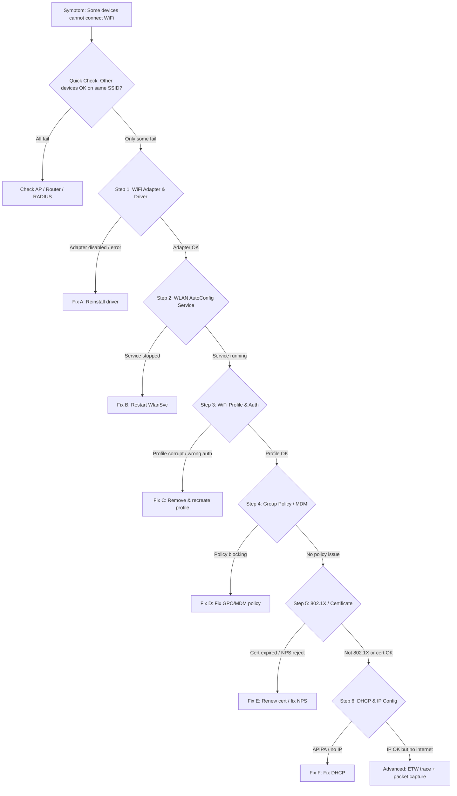

---

# TSG: 部分设备无法连接 WiFi

**Product/Service:** Windows 10 / Windows 11 / Windows Server (Wireless)
**Category:** Networking — Wireless (WLAN)
**Severity Guidance:** Sev B/C — 影响部分用户办公，非全面中断
**Last Updated:** 2026-04-22

---

## 1. 适用场景 (When to Use This TSG)

- **典型症状**：
  - 部分 Windows 设备无法连接公司或家庭 WiFi，而其他设备可以正常连接同一 SSID
  - WiFi 列表中能看到 SSID 但连接失败，提示"无法连接到此网络"
  - WiFi 连接后立即断开，反复 Associating → Authenticating → Disconnected
  - 设备 WiFi 开关正常但扫描不到任何 SSID
  - 连接成功但无法获取 IP 地址（APIPA 169.254.x.x）

- **适用条件**：
  - 客户端为 Windows 10 / Windows 11
  - 问题为**部分设备**受影响（非所有设备全部无法连接）
  - 涉及企业 WPA2-Enterprise (802.1X) 或个人 WPA2-PSK/WPA3 场景

- **不适用场景**：
  - **所有设备均无法连接** → 优先排查 AP / 路由器硬件或 ISP 故障
  - **连接成功但网速慢** → 参考 WiFi 性能优化 TSG
  - **VPN 连接失败** → 参考 VPN/RRAS 排查指南
  - **有线网络连接失败** → 参考 NIC / Ethernet 排查指南

## 2. 快速检查清单 (Quick Checklist)

在深入排查之前，先确认基本项（5 分钟内快速定位方向）：

- [ ] **WiFi 适配器状态** — Device Manager 中 WiFi 适配器是否启用且无感叹号 → 有感叹号=驱动问题
- [ ] **WLAN AutoConfig 服务** — `WlanSvc` 服务是否 Running → Stopped=核心服务故障
- [ ] **Airplane Mode** — 飞行模式是否关闭 → 开启=基本配置问题
- [ ] **能否看到 SSID** — `netsh wlan show networks` 是否列出目标 SSID → 看不到=信号/驱动/AP 问题
- [ ] **密码/证书** — 密码是否正确；802.1X 环境中客户端证书是否有效 → 错误=认证问题
- [ ] **其他设备是否正常** — 同一位置的手机或其他笔记本能否连接 → 能=客户端问题；不能=AP/网络问题

> 💡 快速检查的目的是在 5 分钟内判断问题属于 **AP 端 / 网络链路 / 客户端** 哪个层面。

## 3. 排查流程 (Troubleshooting Steps)

### 排查总览流程图



---

### Step 1: 检查 WiFi 适配器与驱动

**目的：** 排除硬件故障或驱动异常导致适配器不可用

**操作：**

```powershell
# === 创建诊断输出目录 ===
$diagPath = "$env:USERPROFILE\Desktop\Diag_WiFi_$env:COMPUTERNAME"
New-Item -Path $diagPath -ItemType Directory -Force | Out-Null

# 1. 检查 WiFi 适配器状态（设备管理器视角）
Get-PnpDevice -Class Net -Status OK -ErrorAction SilentlyContinue |
  Where-Object { $_.FriendlyName -match "Wi-Fi|Wireless|WLAN|802\.11" } |
  Format-Table Status, Class, FriendlyName, InstanceId -AutoSize |
  Out-File "$diagPath\01_WiFi_Adapter_PnP.txt"

# 2. 检查网络适配器详情（IP 配置 & 驱动版本）
Get-NetAdapter -Name "*Wi-Fi*","*Wireless*" -ErrorAction SilentlyContinue |
  Format-List Name, InterfaceDescription, Status, MacAddress, LinkSpeed, DriverVersion, DriverDate, DriverProvider |
  Out-File "$diagPath\02_WiFi_NetAdapter.txt"

# 3. 检查适配器是否被禁用
Get-NetAdapter -Name "*Wi-Fi*","*Wireless*" -ErrorAction SilentlyContinue |
  Where-Object { $_.Status -ne "Up" } |
  Out-File "$diagPath\03_WiFi_Adapter_Disabled.txt"
```

**判断标准：**

| 输出/现象 | 含义 | 下一步 |
|----------|------|--------|
| 适配器 Status = "Up"，无感叹号 | 硬件和驱动正常 | 继续 Step 2 |
| 适配器 Status = "Disabled" | 适配器被手动禁用 | → **方案 A-1**: 启用适配器 |
| 找不到 WiFi 适配器 / 有感叹号 | 驱动未安装或硬件故障 | → **方案 A-2**: 重装驱动 |
| DriverDate 非常旧（>2 年） | 驱动过旧可能不兼容 | → **方案 A-3**: 更新驱动 |

**💡 Tip：** Windows 11 升级后，部分旧 WiFi 适配器（如 Intel Dual Band Wireless-AC 7260/7265）驱动不兼容是常见问题。检查 OEM 网站是否有最新驱动。

---

### Step 2: 检查 WLAN AutoConfig 服务

**目的：** 确认 WiFi 核心服务正在运行（WlanSvc 是 WiFi 连接的基础服务）

**操作：**

```powershell
# 4. 检查 WLAN AutoConfig 服务状态
Get-Service -Name WlanSvc -ErrorAction SilentlyContinue |
  Select-Object Name, Status, StartType, DisplayName |
  Out-File "$diagPath\04_WlanSvc_Status.txt"

# 5. 同时检查相关依赖服务
@("WlanSvc","Wcmsvc","dot3svc","Dhcp","NlaSvc") | ForEach-Object {
    Get-Service -Name $_ -ErrorAction SilentlyContinue
} | Format-Table Name, Status, StartType -AutoSize |
  Out-File "$diagPath\05_Related_Services.txt"

# 6. 检查 WLAN AutoConfig 事件日志（最近 24 小时的错误）
Get-WinEvent -LogName "Microsoft-Windows-WLAN-AutoConfig/Operational" -MaxEvents 50 -ErrorAction SilentlyContinue |
  Where-Object { $_.LevelDisplayName -match "Error|Warning" } |
  Format-Table TimeCreated, Id, LevelDisplayName, Message -Wrap |
  Out-File "$diagPath\06_WLAN_EventLog.txt"
```

**判断标准：**

| 输出/现象 | 含义 | 下一步 |
|----------|------|--------|
| WlanSvc Status = Running | 服务正常 | 继续 Step 3 |
| WlanSvc Status = Stopped | WiFi 核心服务未运行 | → **方案 B**: 启动服务 |
| WlanSvc StartType = Disabled | 服务被禁用（可能 GPO） | → 检查 GPO 后启动 |
| 事件日志有 Event ID 11001/11003/11004 | 连接或认证失败 | 记录错误码，继续 Step 3 & 5 |

**💡 Tip：** 第三方网络管理软件（如 Intel PROSet、Lenovo Vantage WiFi Manager）可能干扰 WlanSvc，导致连接异常。尝试卸载后测试。

---

### Step 3: 检查 WiFi Profile 与认证配置

**目的：** 排除 WiFi 配置文件损坏或认证参数不匹配

**操作：**

```powershell
# 7. 列出所有已保存的 WiFi Profile
netsh wlan show profiles 2>&1 | Out-File "$diagPath\07_WiFi_Profiles.txt"

# 8. 查看目标 SSID 的详细配置（替换 YOURSSID 为实际 SSID）
netsh wlan show profile name="YOURSSID" key=clear 2>&1 | Out-File "$diagPath\08_WiFi_Profile_Detail.txt"

# 9. 查看当前可见的 WiFi 网络
netsh wlan show networks mode=bssid 2>&1 | Out-File "$diagPath\09_Visible_Networks.txt"

# 10. 查看 WiFi 接口当前状态
netsh wlan show interfaces 2>&1 | Out-File "$diagPath\10_WiFi_Interface.txt"
```

**判断标准：**

| 输出/现象 | 含义 | 下一步 |
|----------|------|--------|
| Profile 存在且认证类型正确 | 配置正常 | 继续 Step 4 |
| Profile 不存在 | 未保存过此 WiFi | → **方案 C-1**: 手动添加 Profile |
| 认证类型不匹配（如 AP 用 WPA3 但 Profile 用 WPA2） | 安全协议不匹配 | → **方案 C-2**: 修改 Profile 认证类型 |
| 目标 SSID 在 `show networks` 中不可见 | 信号弱/AP 频段不支持/隐藏 SSID | → 检查信号强度和 AP 设置 |
| Signal 强度 < 30% | 信号太弱 | → 移近 AP 或检查 AP 天线 |

**💡 Tip：** WiFi 6E (6GHz) AP 的 SSID 在不支持 WiFi 6E 的旧设备上不可见，这是 **"部分设备看不到"** 最常见的原因之一。

---

### Step 4: 检查 Group Policy / MDM 策略

**目的：** 排除 GPO 或 Intune MDM 策略禁用或限制了 WiFi 功能

**操作：**

```powershell
# 11. 检查 GPO 中的 WLAN 相关策略
$gpoWlan = @(
    "HKLM:\SOFTWARE\Policies\Microsoft\Windows\WlanSvc",
    "HKLM:\SOFTWARE\Policies\Microsoft\Windows\WcmSvc",
    "HKLM:\SOFTWARE\Microsoft\WlanSvc",
    "HKLM:\SOFTWARE\Microsoft\WcmSvc\wifinetworkmanager"
)
$gpoWlan | ForEach-Object {
    "=== $_ ===" 
    if (Test-Path $_) { Get-ItemProperty -Path $_ -ErrorAction SilentlyContinue } else { "(Not Found)" }
} | Out-File "$diagPath\11_GPO_WLAN_Policy.txt"

# 12. 检查 MDM / Intune 推送的 WiFi 策略
$mdmWifi = "HKLM:\SOFTWARE\Microsoft\PolicyManager\current\device\WiFi"
if (Test-Path $mdmWifi) {
    Get-ItemProperty -Path $mdmWifi -ErrorAction SilentlyContinue |
      Out-File "$diagPath\12_MDM_WiFi_Policy.txt"
} else {
    "No MDM WiFi policy found" | Out-File "$diagPath\12_MDM_WiFi_Policy.txt"
}

# 13. 检查 GPO 是否限制了可连接的 SSID（仅允许特定网络）
netsh wlan show filters 2>&1 | Out-File "$diagPath\13_WLAN_Filters.txt"

# 14. 导出 GPO 结果（WLAN 部分）
gpresult /h "$diagPath\14_GPResult.html" 2>&1 | Out-Null
```

**判断标准：**

| 输出/现象 | 含义 | 下一步 |
|----------|------|--------|
| 无 WLAN 策略 / 策略允许连接 | GPO/MDM 未限制 | 继续 Step 5 |
| `AllowWiFi = 0` 或类似禁用项 | 策略禁用了 WiFi | → **方案 D**: 修改 GPO/MDM |
| WLAN Filters 有 Deny 规则 | 特定 SSID 被屏蔽 | → **方案 D**: 移除 Filter |
| GPO 推送了固定的 WiFi Profile | Profile 覆盖了手动设置 | → 检查 GPO Profile 配置 |

**💡 Tip：** Windows 11 中如果 Intune 推送了 WiFi Configuration Profile，可能覆盖用户手动配置。检查 Intune Portal → Devices → Configuration profiles。

---

### Step 5: 检查 802.1X 认证与证书（企业 WiFi）

**目的：** 排除 802.1X 认证失败（RADIUS/NPS 拒绝、证书过期、EAP 类型不匹配）

> ⚠️ 此步骤仅适用于 **WPA2/WPA3-Enterprise (802.1X)** 环境。如果是家庭 WPA2-PSK，跳至 Step 6。

**操作：**

```powershell
# === 客户端侧 ===

# 15. 检查客户端证书（用于 EAP-TLS）
Get-ChildItem Cert:\CurrentUser\My -ErrorAction SilentlyContinue |
  Select-Object Subject, Issuer, NotAfter, HasPrivateKey, EnhancedKeyUsageList |
  Format-Table -AutoSize | Out-File "$diagPath\15_Client_Certs.txt"

# 16. 检查计算机证书（用于 Machine auth）
Get-ChildItem Cert:\LocalMachine\My -ErrorAction SilentlyContinue |
  Select-Object Subject, Issuer, NotAfter, HasPrivateKey, EnhancedKeyUsageList |
  Format-Table -AutoSize | Out-File "$diagPath\16_Machine_Certs.txt"

# 17. 检查受信任的根 CA
Get-ChildItem Cert:\LocalMachine\Root -ErrorAction SilentlyContinue |
  Where-Object { $_.NotAfter -lt (Get-Date) } |
  Select-Object Subject, NotAfter |
  Out-File "$diagPath\17_Expired_Root_CAs.txt"

# 18. 检查 WLAN AutoConfig 中 802.1X 相关事件
Get-WinEvent -LogName "Microsoft-Windows-WLAN-AutoConfig/Operational" -MaxEvents 100 -ErrorAction SilentlyContinue |
  Where-Object { $_.Message -match "802\.1X|auth|EAP|certificate|RADIUS" } |
  Format-Table TimeCreated, Id, Message -Wrap |
  Out-File "$diagPath\18_8021X_Events.txt"
```

```powershell
# === NPS/RADIUS 服务端侧（在 NPS 服务器上执行） ===

# 19. 检查 NPS 服务状态
Get-Service -Name IAS -ErrorAction SilentlyContinue |
  Select-Object Name, Status, StartType |
  Out-File "$diagPath\19_NPS_Service.txt"

# 20. 检查 NPS 事件日志（认证成功/失败记录）
Get-WinEvent -LogName "Security" -MaxEvents 200 -ErrorAction SilentlyContinue |
  Where-Object { $_.Id -in @(6272,6273,6274,6275,6276,6278) } |
  Format-Table TimeCreated, Id, Message -Wrap |
  Out-File "$diagPath\20_NPS_Auth_Events.txt"
```

**判断标准：**

| 输出/现象 | 含义 | 下一步 |
|----------|------|--------|
| 证书有效且 NPS 未报错 | 802.1X 正常 | 继续 Step 6 |
| 客户端证书 NotAfter < 当前时间 | 证书已过期 | → **方案 E-1**: 续期证书 |
| NPS Event 6273 Reason Code 16 | 认证失败 — 凭据不匹配 | → **方案 E-2**: 检查 NPS 策略 |
| NPS Event 6273 Reason Code 22 | 证书链验证失败 | → **方案 E-3**: 修复 CA 信任链 |
| EAP 类型不匹配 | 客户端与服务端 EAP 配置不一致 | → **方案 E-4**: 统一 EAP 配置 |

**💡 Tip：** NPS Event 6273 的 Reason Code 是关键。常见 Code：
- `16` = Authentication failed (bad password/cert)
- `22` = Client certificate chain error
- `23` = Certificate expired
- `48` = Policy not matched
- `65` = No dial-in permission (用户属性)

---

### Step 6: 检查 DHCP 与 IP 配置

**目的：** 排除连接成功后无法获取 IP 地址的问题

**操作：**

```powershell
# 21. 检查当前 IP 配置
ipconfig /all 2>&1 | Out-File "$diagPath\21_IPConfig.txt"

# 22. 检查 DHCP 客户端服务
Get-Service -Name Dhcp -ErrorAction SilentlyContinue |
  Select-Object Name, Status, StartType |
  Out-File "$diagPath\22_DHCP_Client_Service.txt"

# 23. 尝试释放并重新获取 IP
ipconfig /release "Wi-Fi" 2>&1 | Out-File "$diagPath\23_IP_Release.txt"
ipconfig /renew "Wi-Fi" 2>&1 | Out-File -Append "$diagPath\23_IP_Renew.txt"

# 24. 检查 DHCP 事件日志
Get-WinEvent -LogName "Microsoft-Windows-Dhcp-Client/Operational" -MaxEvents 30 -ErrorAction SilentlyContinue |
  Format-Table TimeCreated, Id, Message -Wrap |
  Out-File "$diagPath\24_DHCP_Events.txt"
```

**判断标准：**

| 输出/现象 | 含义 | 下一步 |
|----------|------|--------|
| 获得正常 IP（非 169.254.x.x） | DHCP 正常 | WiFi 已连接 → 问题可能在 DNS/路由 |
| IP 为 169.254.x.x (APIPA) | 未从 DHCP 获得地址 | → **方案 F**: 排查 DHCP |
| IP 为 0.0.0.0 | 接口未连接或 DHCP 超时 | → 先解决 WiFi 连接问题 (Step 1-5) |

---

## 4. 解决方案 (Solutions)

### 方案 A: 修复 WiFi 适配器 / 驱动

**适用于：** Step 1 中发现适配器禁用、驱动异常或版本过旧

**A-1: 启用被禁用的适配器**

```powershell
# 启用 WiFi 适配器
Enable-NetAdapter -Name "Wi-Fi" -Confirm:$false
# 验证
Get-NetAdapter -Name "Wi-Fi" | Select-Object Name, Status
```

**A-2: 重新安装 WiFi 驱动**

```powershell
# 1. 卸载适配器（勾选"删除驱动软件"）
# 在 Device Manager 中右键 WiFi 适配器 → Uninstall device → 勾选 "Delete the driver software"
# 2. 重启计算机，Windows 将自动重新安装驱动
Restart-Computer -Force
```

**A-3: 更新 WiFi 驱动**

1. 访问设备制造商（Dell/Lenovo/HP）官网下载最新 WiFi 驱动
2. 或使用 Windows Update：`Settings → Windows Update → Optional updates → Driver updates`
3. 对于 Intel WiFi 适配器：下载 [Intel Driver & Support Assistant](https://www.intel.com/content/www/us/en/support/detect.html)

**验证：**
```powershell
Get-NetAdapter -Name "*Wi-Fi*" | Select-Object Name, Status, DriverVersion, DriverDate
```

**⚠️ 注意事项：**
- 更新驱动前记录当前版本号，便于回退
- 企业环境中使用 SCCM/Intune 统一推送驱动更新

---

### 方案 B: 重启 WLAN AutoConfig 服务

**适用于：** Step 2 中发现 WlanSvc 服务停止

```powershell
# 设置为自动启动并启动服务
Set-Service -Name WlanSvc -StartupType Automatic
Start-Service -Name WlanSvc
# 验证
Get-Service -Name WlanSvc | Select-Object Name, Status, StartType
```

**验证：**
- 执行 `netsh wlan show interfaces` 确认 WiFi 接口可见
- 尝试连接目标 SSID

**⚠️ 注意事项：**
- 如果服务反复停止，检查系统事件日志中的 Service Control Manager 事件
- 检查是否有第三方网络管理软件冲突（Intel PROSet 等）

---

### 方案 C: 删除并重新创建 WiFi Profile

**适用于：** Step 3 中发现 Profile 损坏或配置不匹配

**C-1: 删除并重新添加 Profile**

```powershell
# 删除指定 Profile（替换 YOURSSID）
netsh wlan delete profile name="YOURSSID"

# 然后在 Windows 设置中重新连接该 WiFi 网络，输入密码
```

**C-2: 修改认证类型**

```powershell
# 导出当前 Profile 为 XML
netsh wlan export profile name="YOURSSID" folder="%USERPROFILE%\Desktop"

# 编辑 XML 文件中的 <authentication> 和 <encryption> 节点
# 例如将 WPA2PSK 改为 WPA3SAE（如果 AP 已升级到 WPA3）

# 导入修改后的 Profile
netsh wlan add profile filename="%USERPROFILE%\Desktop\Wi-Fi-YOURSSID.xml"
```

**验证：**
```powershell
netsh wlan show profile name="YOURSSID"
netsh wlan connect name="YOURSSID"
```

---

### 方案 D: 修改 GPO / MDM WiFi 策略

**适用于：** Step 4 中发现策略阻止 WiFi 连接

1. **GPO 路径**：`Computer Configuration → Administrative Templates → Network → Windows Connection Manager` 和 `WLAN Service`
2. 检查以下策略：
   - "Prohibit connection to non-domain networks when connected to domain authenticated network"
   - "Allow Windows to automatically connect to suggested open hotspots" 
   - WLAN Filter 允许/拒绝列表
3. **Intune**：检查 `Devices → Configuration profiles → WiFi` 是否有冲突的 Profile

```powershell
# 强制刷新 GPO
gpupdate /force

# 检查 WLAN 过滤器
netsh wlan show filters

# 如果有错误的 Deny Filter，删除它
netsh wlan delete filter permission=denyall networktype=infrastructure
```

---

### 方案 E: 修复 802.1X / 证书问题

**适用于：** Step 5 中发现证书过期或 NPS 认证失败

**E-1: 续期客户端证书**

```powershell
# 检查自动注册策略
certutil -pulse

# 或手动请求新证书
certreq -enroll -machine -policyserver * WiFiClientCert
```

**E-2: 检查 NPS 策略（在 NPS 服务器上）**

1. 打开 `nps.msc`
2. 检查 `Network Policies` 中匹配 WiFi 的策略
3. 确认 `Conditions` 中的用户组/计算机组包含受影响的设备
4. 检查 `Constraints → Authentication Methods` 中的 EAP 类型与客户端一致

**E-3: 修复 CA 信任链**

```powershell
# 在客户端检查 NPS 服务器证书的颁发者是否在受信任的根 CA 中
certutil -verify -urlfetch <NPS_Cert_File.cer>
```

**验证：**
- NPS 服务器 Security 日志出现 Event 6272（认证成功）
- 客户端成功连接 WiFi

---

### 方案 F: 修复 DHCP 问题

**适用于：** Step 6 中发现 APIPA 地址 (169.254.x.x)

```powershell
# 1. 重置 TCP/IP 栈
netsh winsock reset
netsh int ip reset

# 2. 释放并重新获取 IP
ipconfig /release "Wi-Fi"
ipconfig /renew "Wi-Fi"

# 3. 刷新 DNS
ipconfig /flushdns

# 4. 如果仍然失败，手动设置静态 IP 测试（确认是 DHCP 问题还是连接问题）
# New-NetIPAddress -InterfaceAlias "Wi-Fi" -IPAddress 192.168.1.100 -PrefixLength 24 -DefaultGateway 192.168.1.1
```

**验证：**
```powershell
ipconfig /all | findstr "IPv4"
Test-Connection -ComputerName 8.8.8.8 -Count 2
```

**⚠️ 注意事项：**
- `netsh winsock reset` 和 `netsh int ip reset` 需要**重启**才能生效
- 如果设置了静态 IP 能上网，则确认是 DHCP 服务端问题

---

## 5. 进阶排查 (Advanced Diagnostics)

当以上步骤未能解决时，收集以下数据用于深入分析或升级。

### 数据收集脚本

```powershell
# ============================================================
# WiFi 诊断数据一键收集脚本
# 在受影响的客户端上以管理员身份运行
# ============================================================
$diagPath = "$env:USERPROFILE\Desktop\Diag_WiFi_$env:COMPUTERNAME"
New-Item -Path $diagPath -ItemType Directory -Force | Out-Null

Write-Host "=== Starting WiFi Diagnostic Data Collection ===" -ForegroundColor Cyan

# 1. 基本系统信息
systeminfo | Out-File "$diagPath\SysInfo.txt"

# 2. WiFi 适配器
Get-NetAdapter | Format-List * | Out-File "$diagPath\AllAdapters.txt"
Get-NetAdapter -Name "*Wi-Fi*","*Wireless*" -ErrorAction SilentlyContinue | Format-List * | Out-File "$diagPath\WiFi_Adapter_Detail.txt"

# 3. WLAN 完整信息
netsh wlan show all 2>&1 | Out-File "$diagPath\WLAN_ShowAll.txt"

# 4. IP 配置
ipconfig /all 2>&1 | Out-File "$diagPath\IPConfig.txt"

# 5. 路由表
route print 2>&1 | Out-File "$diagPath\RouteTable.txt"

# 6. 服务状态
Get-Service WlanSvc, Wcmsvc, dot3svc, Dhcp, NlaSvc, Dnscache -ErrorAction SilentlyContinue |
  Format-Table Name, Status, StartType -AutoSize | Out-File "$diagPath\Services.txt"

# 7. WLAN AutoConfig 事件日志
Get-WinEvent -LogName "Microsoft-Windows-WLAN-AutoConfig/Operational" -MaxEvents 200 -ErrorAction SilentlyContinue |
  Export-Csv "$diagPath\WLAN_EventLog.csv" -NoTypeInformation

# 8. 系统事件日志（网络相关）
Get-WinEvent -LogName System -MaxEvents 500 -ErrorAction SilentlyContinue |
  Where-Object { $_.ProviderName -match "WLAN|Dhcp|NlaSvc|Tcpip|Netwtw|e1d|rt640" } |
  Export-Csv "$diagPath\System_Network_Events.csv" -NoTypeInformation

# 9. GPO / 注册表
$regKeys = @(
    "HKLM:\SOFTWARE\Policies\Microsoft\Windows\WlanSvc",
    "HKLM:\SOFTWARE\Policies\Microsoft\Windows\WcmSvc",
    "HKLM:\SOFTWARE\Microsoft\PolicyManager\current\device\WiFi",
    "HKLM:\SOFTWARE\Microsoft\WlanSvc"
)
$regKeys | ForEach-Object {
    "`n=== $_ ==="
    if (Test-Path $_) { Get-ItemProperty -Path $_ -ErrorAction SilentlyContinue | Format-List } else { "(Not Found)" }
} | Out-File "$diagPath\Registry_WLAN.txt"

gpresult /h "$diagPath\GPResult.html" 2>&1 | Out-Null

# 10. 证书（802.1X 场景）
Get-ChildItem Cert:\CurrentUser\My, Cert:\LocalMachine\My -ErrorAction SilentlyContinue |
  Select-Object PSParentPath, Subject, Issuer, NotAfter, HasPrivateKey |
  Export-Csv "$diagPath\Certificates.csv" -NoTypeInformation

# 11. WiFi ETW Trace（抓取 30 秒内的连接尝试）
Write-Host "Starting WiFi ETW trace for 60 seconds..." -ForegroundColor Yellow
Write-Host ">>> Please reproduce the WiFi connection failure NOW <<<" -ForegroundColor Red
netsh trace start scenario=wlan capture=yes overwrite=yes maxsize=512 tracefile="$diagPath\WiFi_Trace.etl" 2>&1 | Out-File "$diagPath\TraceStart.txt"
Start-Sleep -Seconds 60
netsh trace stop 2>&1 | Out-File "$diagPath\TraceStop.txt"

# 12. 打包
Write-Host "=== Collection Complete ===" -ForegroundColor Green
Write-Host "Data saved to: $diagPath" -ForegroundColor Cyan
Write-Host "Please compress this folder and send to support engineer." -ForegroundColor Cyan
```

### 需要收集的数据

| 数据项 | 收集命令/方法 | 目的 |
|--------|-------------|------|
| WiFi ETW Trace | `netsh trace start scenario=wlan capture=yes` | 分析 WiFi 连接状态机 (FSM)，定位在哪个阶段失败 |
| WLAN AutoConfig 日志 | Event Viewer → WLAN-AutoConfig/Operational | 查看连接失败的具体错误码和原因 |
| NPS 审核日志 | Security Event 6272/6273（NPS 服务器） | 确认 RADIUS 是否拒绝了客户端认证 |
| 抓包 (Wireshark) | 在 AP 或客户端抓 802.11 帧 | 分析 Association/Authentication/4-Way Handshake 流程 |
| Driver INF 版本 | `Get-NetAdapter \| FL DriverVersion` | 确认驱动版本是否有已知 Bug |

### 常见根因模式

| 模式特征（在日志/抓包中看到什么） | 通常意味着 | 解决方向 |
|-------------------------------|-----------|---------|
| FSM: Associating → Disconnected（未进入 Authenticating） | AP 拒绝了 Association（MAC Filter / 容量满 / 安全参数不匹配） | 检查 AP 端 MAC Filter、安全设置、最大客户端数 |
| FSM: Authenticating → Roaming → Disconnected | 802.1X 认证失败（证书/凭据/NPS 策略） | 检查 NPS 日志 Event 6273 的 Reason Code |
| Event 11004: "The wireless security credentials were rejected" | 密码错误或 PSK 不匹配 | 忘记网络并重新输入正确密码 |
| Event 11001: "The wireless network is not compatible" | 安全协议不匹配（如设备不支持 WPA3） | AP 开启向后兼容模式或降级安全协议 |
| DHCP Nack / 无 DHCP Offer | DHCP 地址池耗尽或 DHCP 服务器不可达 | 检查 DHCP scope、AP VLAN 配置 |
| DisAssoc Reason 0x04 in NWiFi trace | AP 主动断开（deauthentication） | 检查 AP 日志、信道拥塞、漫游策略 |
| 只有 5GHz / 6GHz 可见，2.4GHz 不可见 | 部分旧设备不支持高频段 | AP 开启 2.4GHz 或检查双频配置 |

## 6. 已知问题与 KB (Known Issues & KB Articles)

| KB / Bug ID | 描述 | 影响版本 | 修复版本/状态 |
|------------|------|---------|-------------|
| KB4284848 | WiFi 连接间歇性断开（WLAN AutoConfig 状态机异常） | Windows 10 1803 | 已修复 |
| KB4284822 | WiFi 连接后无法获取 IP 地址 | Windows 10 1709 | 已修复 |
| KB4338827 | 802.1X 认证在漫游时失败 | Windows 10 1703 | 已修复 |
| KB5005565 | WiFi 连接性能下降，WPA3-SAE 兼容性问题 | Windows 10 21H1 | 已修复 (KB5005611) |
| Known Issue | Intel AX201/AX211 驱动 22.x 版本在 Win11 上导致随机断连 | Windows 11 22H2+ | 更新到 Intel 驱动 23.x+ |
| Known Issue | Realtek RTL8852 系列 WiFi 6E 驱动在 Win11 23H2 上扫描不到 6GHz SSID | Windows 11 23H2 | 更新 Realtek 驱动 6001.x+ |

## 7. 参考资料 (References)

- [Advanced troubleshooting wireless network connectivity](https://learn.microsoft.com/troubleshoot/windows-client/networking/wireless-network-connectivity-issues-troubleshooting) — 微软官方 WiFi 高级排查指南，包含 ETW Trace 分析方法
- [Advanced troubleshooting 802.1X authentication](https://learn.microsoft.com/troubleshoot/windows-client/networking/802-1x-authentication-issues-troubleshooting) — 802.1X 认证排查，包含 NPS 事件日志解读
- [Wireless technology troubleshooting guidance](https://learn.microsoft.com/troubleshoot/windows-server/networking/troubleshoot-wireless-technologies) — WiFi 连接建立失败的分步排查

---
---

# TSG: Some Devices Cannot Connect to WiFi (English Version)

**Product/Service:** Windows 10 / Windows 11 / Windows Server (Wireless)
**Category:** Networking — Wireless (WLAN)
**Severity Guidance:** Sev B/C — Partial user impact, not a total outage
**Last Updated:** 2026-04-22

---

## 1. When to Use This TSG

- **Typical Symptoms:**
  - Some Windows devices fail to connect to company or home WiFi, while others connect fine to the same SSID
  - WiFi SSID is visible but connection fails with "Can't connect to this network"
  - WiFi connects then immediately disconnects, cycling through Associating → Authenticating → Disconnected
  - WiFi toggle is on but no SSIDs are scanned/visible
  - Connection succeeds but device gets APIPA address (169.254.x.x) instead of DHCP lease

- **Applicable Conditions:**
  - Client OS: Windows 10 / Windows 11
  - **Some devices** are affected (not all devices on the network)
  - Applies to both WPA2-Enterprise (802.1X) and WPA2-PSK/WPA3 scenarios

- **Out of Scope:**
  - **All devices fail to connect** → Investigate AP / router hardware or ISP outage first
  - **Connected but slow speed** → See WiFi performance optimization TSG
  - **VPN connection failures** → See VPN/RRAS troubleshooting guide
  - **Wired network failures** → See NIC / Ethernet troubleshooting guide

## 2. Quick Checklist

Before deep-diving, confirm basics (identify direction within 5 minutes):

- [ ] **WiFi Adapter Status** — Is the WiFi adapter enabled with no yellow bang in Device Manager? → Yellow bang = driver issue
- [ ] **WLAN AutoConfig Service** — Is `WlanSvc` service Running? → Stopped = core service failure
- [ ] **Airplane Mode** — Is Airplane Mode off? → On = basic config issue
- [ ] **Can the SSID be seen?** — Does `netsh wlan show networks` list the target SSID? → Not listed = signal/driver/AP issue
- [ ] **Password/Certificate** — Is the password correct? In 802.1X environments, is the client certificate valid? → Wrong = auth issue
- [ ] **Other devices OK?** — Can a phone or another laptop connect from the same location? → Yes = client-side issue; No = AP/network issue

> 💡 The Quick Checklist helps determine in 5 minutes whether the issue is on the **AP side / Network path / Client side**.

## 3. Troubleshooting Steps

### Overview Flowchart


---

### Step 1: Check WiFi Adapter & Driver

**Purpose:** Rule out hardware failure or driver issues making the adapter unavailable

**Commands:**

```powershell
# === Create diagnostic output directory ===
$diagPath = "$env:USERPROFILE\Desktop\Diag_WiFi_$env:COMPUTERNAME"
New-Item -Path $diagPath -ItemType Directory -Force | Out-Null

# 1. Check WiFi adapter status (Device Manager view)
Get-PnpDevice -Class Net -Status OK -ErrorAction SilentlyContinue |
  Where-Object { $_.FriendlyName -match "Wi-Fi|Wireless|WLAN|802\.11" } |
  Format-Table Status, Class, FriendlyName, InstanceId -AutoSize |
  Out-File "$diagPath\01_WiFi_Adapter_PnP.txt"

# 2. Check network adapter details (IP config & driver version)
Get-NetAdapter -Name "*Wi-Fi*","*Wireless*" -ErrorAction SilentlyContinue |
  Format-List Name, InterfaceDescription, Status, MacAddress, LinkSpeed, DriverVersion, DriverDate, DriverProvider |
  Out-File "$diagPath\02_WiFi_NetAdapter.txt"

# 3. Check if adapter is disabled
Get-NetAdapter -Name "*Wi-Fi*","*Wireless*" -ErrorAction SilentlyContinue |
  Where-Object { $_.Status -ne "Up" } |
  Out-File "$diagPath\03_WiFi_Adapter_Disabled.txt"
```

**Decision Criteria:**

| Output / Observation | Meaning | Next Step |
|---------------------|---------|-----------|
| Adapter Status = "Up", no yellow bang | Hardware and driver OK | Continue to Step 2 |
| Adapter Status = "Disabled" | Adapter manually disabled | → **Fix A-1**: Enable adapter |
| WiFi adapter not found / yellow bang | Driver not installed or hardware fault | → **Fix A-2**: Reinstall driver |
| DriverDate very old (>2 years) | Outdated driver may be incompatible | → **Fix A-3**: Update driver |

**💡 Tip:** After upgrading to Windows 11, some older WiFi adapters (e.g., Intel Dual Band Wireless-AC 7260/7265) have driver compatibility issues. Check the OEM website for latest drivers.

---

### Step 2: Check WLAN AutoConfig Service

**Purpose:** Confirm the core WiFi service is running (WlanSvc is the foundation for all WiFi connectivity)

**Commands:**

```powershell
# 4. Check WLAN AutoConfig service status
Get-Service -Name WlanSvc -ErrorAction SilentlyContinue |
  Select-Object Name, Status, StartType, DisplayName |
  Out-File "$diagPath\04_WlanSvc_Status.txt"

# 5. Check related dependency services
@("WlanSvc","Wcmsvc","dot3svc","Dhcp","NlaSvc") | ForEach-Object {
    Get-Service -Name $_ -ErrorAction SilentlyContinue
} | Format-Table Name, Status, StartType -AutoSize |
  Out-File "$diagPath\05_Related_Services.txt"

# 6. Check WLAN AutoConfig event log (errors in last 24 hours)
Get-WinEvent -LogName "Microsoft-Windows-WLAN-AutoConfig/Operational" -MaxEvents 50 -ErrorAction SilentlyContinue |
  Where-Object { $_.LevelDisplayName -match "Error|Warning" } |
  Format-Table TimeCreated, Id, LevelDisplayName, Message -Wrap |
  Out-File "$diagPath\06_WLAN_EventLog.txt"
```

**Decision Criteria:**

| Output / Observation | Meaning | Next Step |
|---------------------|---------|-----------|
| WlanSvc Status = Running | Service healthy | Continue to Step 3 |
| WlanSvc Status = Stopped | Core WiFi service not running | → **Fix B**: Start service |
| WlanSvc StartType = Disabled | Service disabled (possibly by GPO) | → Check GPO then start |
| Event log shows Event ID 11001/11003/11004 | Connection or auth failure | Note error code, continue Step 3 & 5 |

**💡 Tip:** Third-party network management software (Intel PROSet, Lenovo Vantage WiFi Manager, etc.) can interfere with WlanSvc. Try uninstalling and testing.

---

### Step 3: Check WiFi Profile & Authentication Config

**Purpose:** Rule out corrupted WiFi profiles or authentication parameter mismatch

**Commands:**

```powershell
# 7. List all saved WiFi profiles
netsh wlan show profiles 2>&1 | Out-File "$diagPath\07_WiFi_Profiles.txt"

# 8. View target SSID detailed config (replace YOURSSID)
netsh wlan show profile name="YOURSSID" key=clear 2>&1 | Out-File "$diagPath\08_WiFi_Profile_Detail.txt"

# 9. View currently visible WiFi networks
netsh wlan show networks mode=bssid 2>&1 | Out-File "$diagPath\09_Visible_Networks.txt"

# 10. View WiFi interface current status
netsh wlan show interfaces 2>&1 | Out-File "$diagPath\10_WiFi_Interface.txt"
```

**Decision Criteria:**

| Output / Observation | Meaning | Next Step |
|---------------------|---------|-----------|
| Profile exists with correct auth type | Config OK | Continue to Step 4 |
| Profile does not exist | WiFi never saved | → **Fix C-1**: Manually add profile |
| Auth type mismatch (e.g., AP uses WPA3 but profile uses WPA2) | Security protocol mismatch | → **Fix C-2**: Modify profile auth type |
| Target SSID not visible in `show networks` | Weak signal / unsupported band / hidden SSID | → Check signal strength and AP settings |
| Signal strength < 30% | Signal too weak | → Move closer to AP or check AP antenna |

**💡 Tip:** WiFi 6E (6GHz) AP SSIDs are invisible to older devices that don't support WiFi 6E. This is the **most common cause** of "some devices can't see the network."

---

### Step 4: Check Group Policy / MDM Policies

**Purpose:** Rule out GPO or Intune MDM policies disabling or restricting WiFi

**Commands:**

```powershell
# 11. Check GPO WLAN-related policies
$gpoWlan = @(
    "HKLM:\SOFTWARE\Policies\Microsoft\Windows\WlanSvc",
    "HKLM:\SOFTWARE\Policies\Microsoft\Windows\WcmSvc",
    "HKLM:\SOFTWARE\Microsoft\WlanSvc",
    "HKLM:\SOFTWARE\Microsoft\WcmSvc\wifinetworkmanager"
)
$gpoWlan | ForEach-Object {
    "=== $_ ===" 
    if (Test-Path $_) { Get-ItemProperty -Path $_ -ErrorAction SilentlyContinue } else { "(Not Found)" }
} | Out-File "$diagPath\11_GPO_WLAN_Policy.txt"

# 12. Check MDM / Intune pushed WiFi policies
$mdmWifi = "HKLM:\SOFTWARE\Microsoft\PolicyManager\current\device\WiFi"
if (Test-Path $mdmWifi) {
    Get-ItemProperty -Path $mdmWifi -ErrorAction SilentlyContinue |
      Out-File "$diagPath\12_MDM_WiFi_Policy.txt"
} else {
    "No MDM WiFi policy found" | Out-File "$diagPath\12_MDM_WiFi_Policy.txt"
}

# 13. Check if GPO restricts allowed SSIDs
netsh wlan show filters 2>&1 | Out-File "$diagPath\13_WLAN_Filters.txt"

# 14. Export GPO results
gpresult /h "$diagPath\14_GPResult.html" 2>&1 | Out-Null
```

**Decision Criteria:**

| Output / Observation | Meaning | Next Step |
|---------------------|---------|-----------|
| No WLAN policies / policies allow connection | GPO/MDM not restricting | Continue to Step 5 |
| `AllowWiFi = 0` or similar disable value | Policy disabled WiFi | → **Fix D**: Modify GPO/MDM |
| WLAN Filters have Deny rules | Specific SSIDs blocked | → **Fix D**: Remove filter |
| GPO pushed a fixed WiFi profile | Profile overrides manual config | → Check GPO profile settings |

---

### Step 5: Check 802.1X Authentication & Certificates (Enterprise WiFi)

**Purpose:** Rule out 802.1X auth failures (RADIUS/NPS rejection, expired certs, EAP type mismatch)

> ⚠️ This step only applies to **WPA2/WPA3-Enterprise (802.1X)** environments. Skip to Step 6 for WPA2-PSK.

**Commands (Client-side):**

```powershell
# 15. Check client certificates (for EAP-TLS)
Get-ChildItem Cert:\CurrentUser\My -ErrorAction SilentlyContinue |
  Select-Object Subject, Issuer, NotAfter, HasPrivateKey, EnhancedKeyUsageList |
  Format-Table -AutoSize | Out-File "$diagPath\15_Client_Certs.txt"

# 16. Check machine certificates (for Machine auth)
Get-ChildItem Cert:\LocalMachine\My -ErrorAction SilentlyContinue |
  Select-Object Subject, Issuer, NotAfter, HasPrivateKey, EnhancedKeyUsageList |
  Format-Table -AutoSize | Out-File "$diagPath\16_Machine_Certs.txt"

# 17. Check for expired trusted root CAs
Get-ChildItem Cert:\LocalMachine\Root -ErrorAction SilentlyContinue |
  Where-Object { $_.NotAfter -lt (Get-Date) } |
  Select-Object Subject, NotAfter |
  Out-File "$diagPath\17_Expired_Root_CAs.txt"

# 18. Check WLAN AutoConfig 802.1X events
Get-WinEvent -LogName "Microsoft-Windows-WLAN-AutoConfig/Operational" -MaxEvents 100 -ErrorAction SilentlyContinue |
  Where-Object { $_.Message -match "802\.1X|auth|EAP|certificate|RADIUS" } |
  Format-Table TimeCreated, Id, Message -Wrap |
  Out-File "$diagPath\18_8021X_Events.txt"
```

**Commands (NPS/RADIUS Server-side):**

```powershell
# 19. Check NPS service status
Get-Service -Name IAS -ErrorAction SilentlyContinue |
  Select-Object Name, Status, StartType |
  Out-File "$diagPath\19_NPS_Service.txt"

# 20. Check NPS event log (auth success/failure)
Get-WinEvent -LogName "Security" -MaxEvents 200 -ErrorAction SilentlyContinue |
  Where-Object { $_.Id -in @(6272,6273,6274,6275,6276,6278) } |
  Format-Table TimeCreated, Id, Message -Wrap |
  Out-File "$diagPath\20_NPS_Auth_Events.txt"
```

**Decision Criteria:**

| Output / Observation | Meaning | Next Step |
|---------------------|---------|-----------|
| Cert valid and no NPS errors | 802.1X OK | Continue to Step 6 |
| Client cert NotAfter < current date | Certificate expired | → **Fix E-1**: Renew cert |
| NPS Event 6273 Reason Code 16 | Auth failed — credential mismatch | → **Fix E-2**: Check NPS policy |
| NPS Event 6273 Reason Code 22 | Certificate chain verification failure | → **Fix E-3**: Fix CA trust chain |
| EAP type mismatch | Client and server EAP config inconsistent | → **Fix E-4**: Align EAP config |

**💡 Tip:** NPS Event 6273 Reason Code is the key. Common codes: `16` = bad password/cert, `22` = cert chain error, `23` = cert expired, `48` = no matching policy, `65` = no dial-in permission.

---

### Step 6: Check DHCP & IP Configuration

**Purpose:** Rule out failure to obtain IP address after WiFi connection

**Commands:**

```powershell
# 21. Check current IP configuration
ipconfig /all 2>&1 | Out-File "$diagPath\21_IPConfig.txt"

# 22. Check DHCP client service
Get-Service -Name Dhcp -ErrorAction SilentlyContinue |
  Select-Object Name, Status, StartType |
  Out-File "$diagPath\22_DHCP_Client_Service.txt"

# 23. Release and renew IP
ipconfig /release "Wi-Fi" 2>&1 | Out-File "$diagPath\23_IP_Release.txt"
ipconfig /renew "Wi-Fi" 2>&1 | Out-File -Append "$diagPath\23_IP_Renew.txt"

# 24. Check DHCP event log
Get-WinEvent -LogName "Microsoft-Windows-Dhcp-Client/Operational" -MaxEvents 30 -ErrorAction SilentlyContinue |
  Format-Table TimeCreated, Id, Message -Wrap |
  Out-File "$diagPath\24_DHCP_Events.txt"
```

**Decision Criteria:**

| Output / Observation | Meaning | Next Step |
|---------------------|---------|-----------|
| Valid IP obtained (not 169.254.x.x) | DHCP OK | WiFi connected → issue may be DNS/routing |
| IP is 169.254.x.x (APIPA) | No DHCP lease obtained | → **Fix F**: Troubleshoot DHCP |
| IP is 0.0.0.0 | Interface not connected or DHCP timeout | → Resolve WiFi connection first (Steps 1-5) |

---

## 4. Solutions

### Fix A: Repair WiFi Adapter / Driver

**A-1: Enable disabled adapter**
```powershell
Enable-NetAdapter -Name "Wi-Fi" -Confirm:$false
Get-NetAdapter -Name "Wi-Fi" | Select-Object Name, Status
```

**A-2: Reinstall WiFi driver**
1. Device Manager → Right-click WiFi adapter → Uninstall device → Check "Delete the driver software"
2. Restart the computer; Windows will auto-reinstall the driver

**A-3: Update WiFi driver**
1. Visit device manufacturer (Dell/Lenovo/HP) website for latest WiFi driver
2. Or: `Settings → Windows Update → Optional updates → Driver updates`
3. For Intel WiFi: Download Intel Driver & Support Assistant

**Verification:** `Get-NetAdapter -Name "*Wi-Fi*" | Select-Object Name, Status, DriverVersion, DriverDate`

---

### Fix B: Restart WLAN AutoConfig Service

```powershell
Set-Service -Name WlanSvc -StartupType Automatic
Start-Service -Name WlanSvc
Get-Service -Name WlanSvc | Select-Object Name, Status, StartType
```

**Verify:** Run `netsh wlan show interfaces` to confirm WiFi interface is visible, then attempt connection.

---

### Fix C: Delete and Recreate WiFi Profile

**C-1: Delete and re-add**
```powershell
netsh wlan delete profile name="YOURSSID"
# Then reconnect via Windows Settings and enter password
```

**C-2: Modify auth type**
```powershell
netsh wlan export profile name="YOURSSID" folder="%USERPROFILE%\Desktop"
# Edit XML: change <authentication> and <encryption> nodes
netsh wlan add profile filename="%USERPROFILE%\Desktop\Wi-Fi-YOURSSID.xml"
```

---

### Fix D: Fix GPO / MDM WiFi Policy

1. Check GPO: `Computer Configuration → Administrative Templates → Network → Windows Connection Manager` and `WLAN Service`
2. Check Intune: `Devices → Configuration profiles → WiFi`
3. Force GPO refresh: `gpupdate /force`
4. Remove incorrect filters: `netsh wlan delete filter permission=denyall networktype=infrastructure`

---

### Fix E: Fix 802.1X / Certificate Issues

**E-1:** Renew client certificate: `certutil -pulse`
**E-2:** Check NPS policy in `nps.msc` → Network Policies → Conditions and Constraints
**E-3:** Fix CA trust chain: `certutil -verify -urlfetch <NPS_Cert_File.cer>`

---

### Fix F: Fix DHCP Issues

```powershell
netsh winsock reset
netsh int ip reset
ipconfig /release "Wi-Fi"
ipconfig /renew "Wi-Fi"
ipconfig /flushdns
# Restart required after winsock/ip reset
```

Test with static IP to confirm DHCP vs connectivity issue.

---

## 5. Advanced Diagnostics

### One-Click Data Collection Script

```powershell
# Run as Administrator on the affected client
$diagPath = "$env:USERPROFILE\Desktop\Diag_WiFi_$env:COMPUTERNAME"
New-Item -Path $diagPath -ItemType Directory -Force | Out-Null

systeminfo | Out-File "$diagPath\SysInfo.txt"
Get-NetAdapter | Format-List * | Out-File "$diagPath\AllAdapters.txt"
netsh wlan show all 2>&1 | Out-File "$diagPath\WLAN_ShowAll.txt"
ipconfig /all 2>&1 | Out-File "$diagPath\IPConfig.txt"
route print 2>&1 | Out-File "$diagPath\RouteTable.txt"
Get-Service WlanSvc, Wcmsvc, dot3svc, Dhcp, NlaSvc, Dnscache -ErrorAction SilentlyContinue |
  Format-Table Name, Status, StartType -AutoSize | Out-File "$diagPath\Services.txt"
Get-WinEvent -LogName "Microsoft-Windows-WLAN-AutoConfig/Operational" -MaxEvents 200 -ErrorAction SilentlyContinue |
  Export-Csv "$diagPath\WLAN_EventLog.csv" -NoTypeInformation
gpresult /h "$diagPath\GPResult.html" 2>&1 | Out-Null

# WiFi ETW Trace (60 seconds)
Write-Host "Starting WiFi ETW trace... Reproduce the issue NOW" -ForegroundColor Red
netsh trace start scenario=wlan capture=yes overwrite=yes maxsize=512 tracefile="$diagPath\WiFi_Trace.etl" 2>&1 | Out-Null
Start-Sleep -Seconds 60
netsh trace stop 2>&1 | Out-Null

Write-Host "Collection complete. Data saved to: $diagPath" -ForegroundColor Green
```

### Common Root Cause Patterns

| Pattern in Logs/Traces | Usually Means | Resolution Direction |
|----------------------|---------------|---------------------|
| FSM: Associating → Disconnected (never reaches Authenticating) | AP rejected Association (MAC filter / capacity / security mismatch) | Check AP-side MAC filter, security settings, max clients |
| FSM: Authenticating → Roaming → Disconnected | 802.1X auth failure (cert/credentials/NPS policy) | Check NPS Event 6273 Reason Code |
| Event 11004: "wireless security credentials rejected" | Wrong password or PSK mismatch | Forget network and re-enter correct password |
| Event 11001: "wireless network is not compatible" | Security protocol mismatch (device doesn't support WPA3) | Enable backward compatibility on AP or downgrade security |
| DHCP Nack / no DHCP Offer | DHCP pool exhausted or DHCP server unreachable | Check DHCP scope, AP VLAN config |
| DisAssoc Reason 0x04 in NWiFi trace | AP-initiated deauthentication | Check AP logs, channel congestion, roaming policy |
| Only 5GHz/6GHz visible, 2.4GHz missing | Older devices don't support higher bands | Enable 2.4GHz on AP or check dual-band config |

## 6. Known Issues & KB Articles

| KB / Bug ID | Description | Affected Version | Fix Status |
|------------|-------------|-----------------|------------|
| KB4284848 | WiFi intermittent disconnect (WLAN AutoConfig FSM issue) | Windows 10 1803 | Fixed |
| KB4284822 | WiFi connected but no IP address | Windows 10 1709 | Fixed |
| KB4338827 | 802.1X auth fails during roaming | Windows 10 1703 | Fixed |
| KB5005565 | WiFi performance degradation, WPA3-SAE compatibility | Windows 10 21H1 | Fixed (KB5005611) |
| Known Issue | Intel AX201/AX211 driver 22.x causes random disconnects on Win11 | Windows 11 22H2+ | Update to Intel driver 23.x+ |
| Known Issue | Realtek RTL8852 WiFi 6E driver can't scan 6GHz SSIDs on Win11 23H2 | Windows 11 23H2 | Update Realtek driver 6001.x+ |

## 7. References

- [Advanced troubleshooting wireless network connectivity](https://learn.microsoft.com/troubleshoot/windows-client/networking/wireless-network-connectivity-issues-troubleshooting) — Official WiFi advanced troubleshooting guide with ETW trace analysis
- [Advanced troubleshooting 802.1X authentication](https://learn.microsoft.com/troubleshoot/windows-client/networking/802-1x-authentication-issues-troubleshooting) — 802.1X auth troubleshooting with NPS event log interpretation
- [Wireless technology troubleshooting guidance](https://learn.microsoft.com/troubleshoot/windows-server/networking/troubleshoot-wireless-technologies) — Step-by-step for WiFi connection establishment failures
